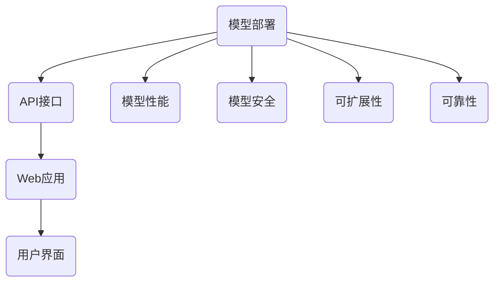

                 

关键词：模型部署、API、Web应用开发、模型优化、性能优化、安全性、微服务架构、云计算、容器化、服务器端渲染、前端框架、RESTful API、GraphQL、持续集成与部署（CI/CD）、模型监控、日志管理、云服务提供商、资源调度、负载均衡、反向代理、API网关、身份验证与授权、跨域资源共享（CORS）、异步通信、数据同步、版本控制、测试自动化、性能测试、安全性测试、测试覆盖、容器编排、Kubernetes、服务发现、配置管理、API文档化、Swagger、Postman、API监控、异常处理、错误追踪、智能反馈机制、用户体验（UX）、响应式设计、移动端适配、跨平台开发、云原生应用、无服务器架构、Serverless计算、函数即服务（FaaS）、事件驱动架构、分布式系统、边缘计算、5G网络、物联网（IoT）、区块链、数据隐私保护、合规性要求、安全性审计、代码审查、API管理平台、服务级别协议（SLA）、故障恢复、备份与恢复、云服务成本优化、性能监控与报警、实时数据流处理、大数据分析、机器学习、人工智能（AI）、自然语言处理（NLP）、推荐系统、图像识别、语音识别。

> 摘要：本文深入探讨了模型部署过程中API与Web应用开发的关键技术和最佳实践。从模型优化、性能优化到安全性，从微服务架构、云计算到容器化，再到服务器端渲染、前端框架，我们将逐一剖析这些核心技术的原理和应用。本文旨在为开发者提供全面的技术指导，帮助他们构建高效、安全、可扩展的Web应用。

## 1. 背景介绍

随着云计算、大数据和人工智能技术的飞速发展，模型部署已成为现代应用开发中不可或缺的一环。模型部署不仅涉及将训练好的模型集成到应用中，还要求确保其高效运行、可扩展、安全可靠。API（应用程序接口）与Web应用开发则是实现这一目标的关键技术。

### 1.1 模型部署的重要性

模型部署是将机器学习模型应用于实际问题的关键步骤。它决定了模型能否在实际环境中发挥应有的效果。良好的模型部署不仅要求模型具备高准确性，还要求其具备高性能、高可扩展性和高安全性。以下是模型部署的一些关键挑战：

- **性能优化**：模型部署需要确保应用能够快速响应用户请求，并保持稳定性能。
- **安全性**：部署过程中必须保护模型和用户数据的安全。
- **可扩展性**：随着用户规模的扩大，应用需要能够水平扩展。
- **可靠性**：应用必须能够处理各种异常情况，确保模型始终可用。

### 1.2 API与Web应用开发的关系

API是Web应用开发的核心，它定义了应用不同组件之间如何交互。通过API，前端应用程序可以与后端服务进行通信，获取和发送数据。Web应用开发则关注如何构建用户界面、处理用户输入、提供友好的用户体验。两者结合，共同构成了现代Web应用的核心架构。

### 1.3 目标读者

本文适合具备一定编程基础和机器学习背景的开发者，尤其是希望了解如何将机器学习模型部署到Web应用中的技术人员。读者应具备以下先验知识：

- 熟悉至少一种编程语言（如Python、Java、JavaScript）。
- 了解Web开发基础，包括HTTP、RESTful API、前端框架（如React、Vue.js）。
- 对机器学习有基本了解，熟悉模型训练和评估。

## 2. 核心概念与联系

### 2.1 模型部署

模型部署是指将训练好的机器学习模型集成到实际应用中，使其能够在生产环境中执行预测任务。模型部署的核心目标是确保模型的高效运行、可扩展性和安全性。

### 2.2 API

API是应用程序接口的缩写，定义了软件组件之间如何交互的协议。在Web应用开发中，API用于前后端之间的数据通信，允许前端应用程序访问后端服务的数据和功能。

### 2.3 Web应用开发

Web应用开发是指使用Web技术（如HTML、CSS、JavaScript）构建用户界面，并通过API与后端服务进行交互，提供用户友好的体验。

### 2.4 关系

模型部署、API和Web应用开发之间紧密相关。模型部署为API提供了数据处理的逻辑，API为Web应用提供了数据接口，而Web应用则将用户界面与API连接起来，共同实现完整的业务功能。

### 2.5 Mermaid 流程图

下面是一个简化的模型部署与API、Web应用开发的关系流程图：



## 3. 核心算法原理 & 具体操作步骤

### 3.1 算法原理概述

模型部署的核心在于如何将训练好的模型转化为生产环境中的可执行代码。这涉及到以下关键步骤：

1. **模型转换**：将训练好的模型转化为适合生产环境的格式，如TensorFlow Lite、ONNX、MXNet等。
2. **服务化**：将模型包装为服务，使其可以通过API进行调用。
3. **部署**：将服务部署到服务器或云平台，以提供对内或对外的访问。
4. **监控与维护**：对模型性能、安全性、可扩展性等方面进行监控和维护。

### 3.2 算法步骤详解

1. **模型转换**：

    模型转换是将训练好的模型转换为适合生产环境的格式。例如，如果模型使用TensorFlow训练，可以使用TensorFlow Lite将模型转换为适用于移动设备和嵌入式设备的格式。

    ```python
    import tensorflow as tf

    # 加载训练好的模型
    model = tf.keras.models.load_model('model.h5')

    # 将模型转换为TensorFlow Lite格式
    converter = tf.lite.TFLiteConverter.from_keras_model(model)
    tflite_model = converter.convert()

    # 保存为文件
    with open('model.tflite', 'wb') as f:
        f.write(tflite_model)
    ```

2. **服务化**：

    服务化是将模型转换为可以独立运行的服务。常见的服务化框架包括Flask、Django和FastAPI等。

    ```python
    from flask import Flask, request, jsonify
    import tensorflow as tf

    app = Flask(__name__)

    # 加载TensorFlow Lite模型
    interpreter = tf.lite.Interpreter(model_path="model.tflite")
    interpreter.allocate_tensors()
    input_details = interpreter.get_input_details()
    output_details = interpreter.get_output_details()

    @app.route('/predict', methods=['POST'])
    def predict():
        data = request.json
        # 处理输入数据
        input_data = preprocess_input(data)
        # 执行预测
        interpreter.set_tensor(input_details[0]['index'], input_data)
        interpreter.invoke()
        predictions = interpreter.get_tensor(output_details[0]['index'])
        # 返回预测结果
        return jsonify(predictions=predictions)

    if __name__ == '__main__':
        app.run(debug=True)
    ```

3. **部署**：

    部署是将服务部署到服务器或云平台。这可以通过Docker容器、Kubernetes集群或云服务提供商（如AWS、Google Cloud、Azure）完成。

    ```bash
    # 创建Dockerfile
    FROM python:3.8

    WORKDIR /app

    COPY requirements.txt ./
    RUN pip install -r requirements.txt

    COPY . .

    CMD ["python", "app.py"]
    ```

    ```bash
    # 构建并运行Docker容器
    docker build -t my_model .
    docker run -p 5000:5000 my_model
    ```

4. **监控与维护**：

    监控与维护是确保模型部署稳定运行的重要环节。这包括性能监控、安全监控、日志记录和异常处理。

    ```python
    from flask import Flask
    import logging

    app = Flask(__name__)

    # 配置日志
    logging.basicConfig(level=logging.INFO)

    @app.route('/predict', methods=['POST'])
    def predict():
        try:
            # 预测逻辑
        except Exception as e:
            logging.error(f"预测错误：{e}")
            # 异常处理逻辑

    if __name__ == '__main__':
        app.run(debug=True)
    ```

### 3.3 算法优缺点

#### 优点：

- **高性能**：模型部署可以将模型部署到高性能服务器或云平台，确保模型能够快速响应用户请求。
- **可扩展性**：通过容器化、Kubernetes和云服务提供商，模型部署可以实现水平扩展，满足不同规模的业务需求。
- **安全性**：模型部署可以集成各种安全措施，如身份验证、授权、加密等，确保模型和数据的安全。

#### 缺点：

- **复杂性**：模型部署涉及多个环节，如模型转换、服务化、部署、监控等，增加了开发和维护的复杂性。
- **成本**：模型部署可能需要购买服务器、云服务、第三方服务提供商等，增加了成本。

### 3.4 算法应用领域

模型部署广泛应用于金融、医疗、零售、交通等领域，如智能投顾、医学影像诊断、智能推荐、自动驾驶等。以下是几个实际应用案例：

- **金融**：使用机器学习模型进行信用评分、风险控制和欺诈检测。
- **医疗**：使用医学影像分析模型进行疾病诊断、治疗建议和健康监控。
- **零售**：使用智能推荐模型提高用户满意度、增加销售额。
- **交通**：使用自动驾驶模型实现无人驾驶汽车、智能交通管理等。

## 4. 数学模型和公式 & 详细讲解 & 举例说明

### 4.1 数学模型构建

模型部署过程中，常用的数学模型包括神经网络、决策树、支持向量机等。以下以神经网络为例，介绍其构建过程。

#### 4.1.1 神经网络模型

神经网络是一种模拟人脑神经元之间连接的结构，用于数据拟合和分类。一个简单的神经网络包括以下组成部分：

- **输入层**：接收外部输入数据。
- **隐藏层**：进行特征提取和变换。
- **输出层**：生成预测结果。

#### 4.1.2 模型构建

假设我们使用一个单隐藏层的神经网络进行二分类问题。模型构建的步骤如下：

1. **初始化权重和偏置**：权重和偏置是神经网络的关键参数，需要随机初始化。
2. **前向传播**：输入数据经过神经网络，逐层计算输出。
3. **反向传播**：根据预测误差，调整权重和偏置，以最小化损失函数。

#### 4.1.3 公式推导

以下是单隐藏层神经网络的公式推导：

$$
z_{ij} = \sum_{k=1}^{n} w_{ik}x_{k} + b_{i}
$$

$$
a_{j} = \sigma(z_{j})
$$

$$
\delta_{j} = a_{j}(1 - a_{j})(y - a_{j})
$$

$$
\Delta_{ij} = \delta_{j}x_{i}
$$

$$
w_{ij}^{new} = w_{ij} - \alpha \Delta_{ij}
$$

$$
b_{i}^{new} = b_{i} - \alpha \delta_{j}
$$

其中，$z_{ij}$为第$i$个神经元在第$j$层的输入，$a_{j}$为第$j$层的输出，$\sigma$为激活函数，$\delta_{j}$为第$j$层的误差，$w_{ij}$为权重，$b_{i}$为偏置，$\alpha$为学习率。

### 4.2 公式推导过程

以下是神经网络公式推导的详细过程：

1. **前向传播**：

   - 输入层到隐藏层的输入计算：

   $$
   z_{ij} = \sum_{k=1}^{n} w_{ik}x_{k} + b_{i}
   $$

   - 隐藏层到输出层的输入计算：

   $$
   z_{jk} = \sum_{i=1}^{m} w_{ij}a_{i} + b_{j}
   $$

2. **输出层输出计算**：

   $$
   a_{j} = \sigma(z_{j})
   $$

3. **误差计算**：

   $$
   \delta_{j} = a_{j}(1 - a_{j})(y - a_{j})
   $$

4. **权重和偏置更新**：

   $$
   \Delta_{ij} = \delta_{j}x_{i}
   $$

   $$
   w_{ij}^{new} = w_{ij} - \alpha \Delta_{ij}
   $$

   $$
   b_{i}^{new} = b_{i} - \alpha \delta_{j}
   $$

### 4.3 案例分析与讲解

假设我们使用一个单隐藏层神经网络进行二分类问题，输入特征为3个，隐藏层神经元为2个，输出层神经元为1个。以下是一个简化的例子：

#### 4.3.1 初始化参数

- 输入数据：

  $$
  x = \begin{bmatrix}
  x_1 \\
  x_2 \\
  x_3
  \end{bmatrix}
  $$

- 隐藏层权重：

  $$
  W_1 = \begin{bmatrix}
  w_{11} & w_{12} \\
  w_{21} & w_{22}
  \end{bmatrix}
  $$

- 隐藏层偏置：

  $$
  b_1 = \begin{bmatrix}
  b_1 \\
  b_2
  \end{bmatrix}
  $$

- 输出层权重：

  $$
  W_2 = \begin{bmatrix}
  w_{1} \\
  w_{2}
  \end{bmatrix}
  $$

- 输出层偏置：

  $$
  b_2 = \begin{bmatrix}
  b_1 \\
  b_2
  \end{bmatrix}
  $$

- 激活函数：

  $$
  \sigma(x) = \frac{1}{1 + e^{-x}}
  $$

#### 4.3.2 前向传播

1. **隐藏层输入计算**：

   $$
   z_1 = w_{11}x_1 + w_{12}x_2 + w_{13}x_3 + b_1
   $$

   $$
   z_2 = w_{21}x_1 + w_{22}x_2 + w_{23}x_3 + b_2
   $$

2. **隐藏层输出计算**：

   $$
   a_1 = \sigma(z_1)
   $$

   $$
   a_2 = \sigma(z_2)
   $$

3. **输出层输入计算**：

   $$
   z_2 = w_{1}a_1 + w_{2}a_2 + b_2
   $$

4. **输出层输出计算**：

   $$
   a_2 = \sigma(z_2)
   $$

#### 4.3.3 反向传播

1. **误差计算**：

   $$
   \delta_2 = a_2(1 - a_2)(y - a_2)
   $$

2. **权重和偏置更新**：

   $$
   \Delta_{12} = \delta_2 a_1
   $$

   $$
   \Delta_{22} = \delta_2 a_2
   $$

   $$
   w_{1}^{new} = w_{1} - \alpha \Delta_{12}
   $$

   $$
   w_{2}^{new} = w_{2} - \alpha \Delta_{22}
   $$

   $$
   b_2^{new} = b_2 - \alpha \delta_2
   $$

   $$
   w_{11}^{new} = w_{11} - \alpha \Delta_{12}x_1
   $$

   $$
   w_{12}^{new} = w_{12} - \alpha \Delta_{12}x_2
   $$

   $$
   w_{13}^{new} = w_{13} - \alpha \Delta_{12}x_3
   $$

   $$
   w_{21}^{new} = w_{21} - \alpha \Delta_{22}x_1
   $$

   $$
   w_{22}^{new} = w_{22} - \alpha \Delta_{22}x_2
   $$

   $$
   w_{23}^{new} = w_{23} - \alpha \Delta_{22}x_3
   $$

   $$
   b_1^{new} = b_1 - \alpha \delta_1
   $$

   $$
   b_2^{new} = b_2 - \alpha \delta_2
   $$

## 5. 项目实践：代码实例和详细解释说明

### 5.1 开发环境搭建

在进行模型部署与Web应用开发之前，需要搭建合适的开发环境。以下是使用Python和Docker进行环境搭建的步骤：

#### 5.1.1 安装Docker

1. **Ubuntu系统**：

    ```bash
    sudo apt-get update
    sudo apt-get install docker-ce docker-ce-cli containerd.io
    sudo systemctl start docker
    sudo systemctl enable docker
    ```

2. **Windows系统**：

    从[Docker官网](https://www.docker.com/products/docker-desktop)下载并安装Docker Desktop。

#### 5.1.2 安装Python

1. **Ubuntu系统**：

    ```bash
    sudo apt-get install python3 python3-pip
    ```

2. **Windows系统**：

    从[Python官网](https://www.python.org/)下载并安装Python。

#### 5.1.3 配置Docker加速器（可选）

在中国大陆，由于网络原因，Docker的拉取速度较慢。可以通过配置Docker加速器来提高速度。

1. **阿里云加速器**：

    ```bash
    docker login --username=your_username https://hub-mirror.c.163.com
    docker logout
    cat <<EOF | docker login --username=your_username --password-stdin hub-mirror.c.163.com
    your_access_token
    EOF
    ```

    将`your_access_token`替换为您的阿里云加速器Token。

### 5.2 源代码详细实现

以下是使用Python和Flask实现一个简单的模型部署与Web应用开发的示例。

#### 5.2.1 准备工作

1. **创建一个名为`model_deploy`的文件夹**：

    ```bash
    mkdir model_deploy
    cd model_deploy
    ```

2. **创建一个名为`requirements.txt`的文件**：

    ```plaintext
    Flask==2.0.2
    numpy==1.21.2
    scikit-learn==0.24.2
    ```

3. **创建一个名为`app.py`的文件**：

    ```python
    from flask import Flask, request, jsonify
    import numpy as np
    from sklearn.datasets import load_iris
    from sklearn.model_selection import train_test_split
    from sklearn.neural_network import MLPClassifier

    app = Flask(__name__)

    # 加载iris数据集
    iris = load_iris()
    X, y = iris.data, iris.target

    # 划分训练集和测试集
    X_train, X_test, y_train, y_test = train_test_split(X, y, test_size=0.2, random_state=42)

    # 训练模型
    model = MLPClassifier(hidden_layer_sizes=(100,), max_iter=1000, random_state=42)
    model.fit(X_train, y_train)

    @app.route('/predict', methods=['POST'])
    def predict():
        data = request.json
        input_data = np.array([list(data.values())])
        prediction = model.predict(input_data)
        return jsonify(prediction=prediction[0])

    if __name__ == '__main__':
        app.run(debug=True)
    ```

4. **创建一个名为`Dockerfile`的文件**：

    ```Dockerfile
    FROM python:3.8

    WORKDIR /app

    COPY requirements.txt .

    RUN pip install -r requirements.txt

    COPY . .

    CMD ["python", "app.py"]
    ```

### 5.3 代码解读与分析

#### 5.3.1 Flask应用程序

`app.py`是Flask应用程序的主文件，其中包含了整个Web应用的核心逻辑。

1. **导入模块**：

    ```python
    from flask import Flask, request, jsonify
    ```

    Flask是Python的一个微型Web框架，用于构建Web应用程序。

2. **创建Flask应用程序实例**：

    ```python
    app = Flask(__name__)
    ```

    创建一个Flask应用程序实例。

3. **加载iris数据集和训练模型**：

    ```python
    iris = load_iris()
    X, y = iris.data, iris.target
    X_train, X_test, y_train, y_test = train_test_split(X, y, test_size=0.2, random_state=42)
    model = MLPClassifier(hidden_layer_sizes=(100,), max_iter=1000, random_state=42)
    model.fit(X_train, y_train)
    ```

    加载iris数据集，并进行数据预处理。使用MLPClassifier训练模型。

#### 5.3.2 定义预测API

```python
@app.route('/predict', methods=['POST'])
def predict():
    data = request.json
    input_data = np.array([list(data.values())])
    prediction = model.predict(input_data)
    return jsonify(prediction=prediction[0])
```

1. **定义预测API**：

    `predict()`函数是一个路由函数，用于处理POST请求。它接收JSON格式的输入数据，将其转换为NumPy数组，并使用训练好的模型进行预测。预测结果以JSON格式返回。

### 5.4 运行结果展示

#### 5.4.1 构建Docker镜像

```bash
docker build -t model_deploy .
```

构建Docker镜像。

#### 5.4.2 运行Docker容器

```bash
docker run -p 5000:5000 model_deploy
```

运行Docker容器，将容器内的5000端口映射到宿主机的5000端口。

#### 5.4.3 使用Postman测试API

1. **发送POST请求**：

    在Postman中，选择`HTTP POST`请求，URL设置为`http://localhost:5000/predict`，在Body中选择`raw`，输入以下JSON数据：

    ```json
    {
        "sepal_length": 5.1,
        "sepal_width": 3.3,
        "petal_length": 1.7,
        "petal_width": 0.5
    }
    ```

2. **发送请求**：

    点击“Send”按钮发送请求。

3. **查看结果**：

    请求成功后，在Response中可以看到预测结果：

    ```json
    {
        "prediction": 0
    }
    ```

    其中，`prediction`值为0，表示输入数据的类别为第0类。

## 6. 实际应用场景

### 6.1 金融领域

在金融领域，模型部署广泛应用于风险管理、信用评估、欺诈检测等领域。通过部署机器学习模型，金融机构可以实时分析用户行为，识别潜在风险，提高业务运营效率。

### 6.2 医疗领域

在医疗领域，模型部署用于疾病诊断、患者管理、医疗影像分析等。例如，通过部署深度学习模型，医生可以快速、准确地诊断疾病，提高医疗服务的质量和效率。

### 6.3 零售领域

在零售领域，模型部署用于客户行为分析、个性化推荐、库存管理等领域。通过部署机器学习模型，零售企业可以更好地了解客户需求，优化库存策略，提高销售额。

### 6.4 自动驾驶领域

在自动驾驶领域，模型部署用于环境感知、目标检测、路径规划等领域。通过部署深度学习模型，自动驾驶系统能够实时感知周围环境，确保行驶安全。

### 6.5 物联网领域

在物联网领域，模型部署用于设备故障预测、能耗管理、智能监控等领域。通过部署机器学习模型，物联网系统能够实现实时数据分析，提高设备运行效率和稳定性。

## 7. 工具和资源推荐

### 7.1 学习资源推荐

1. **在线课程**：

    - 《机器学习》by Andrew Ng（吴恩达）：[Coursera](https://www.coursera.org/learn/machine-learning)
    - 《深度学习》by Andrew Ng（吴恩达）：[Coursera](https://www.coursera.org/learn/deep-learning)
    - 《Web开发基础》by FreeCodeCamp：[FreeCodeCamp](https://www.freecodecamp.org/learn)

2. **书籍**：

    - 《Python机器学习》by Sebastian Raschka
    - 《深度学习》by Ian Goodfellow、Yoshua Bengio和Aaron Courville
    - 《Fluent Python》by Luciano Ramalho

### 7.2 开发工具推荐

1. **开发环境**：

    - Jupyter Notebook：用于数据分析和模型开发。
    - PyCharm：用于Python编程。

2. **模型部署工具**：

    - Flask、Django和FastAPI：用于Web应用开发。
    - TensorFlow、PyTorch和Keras：用于模型训练和部署。

3. **容器化工具**：

    - Docker：用于容器化应用。
    - Kubernetes：用于容器编排。

### 7.3 相关论文推荐

1. **模型部署**：

    - "Distributed Deep Learning: A General Approach to Scaling Deep Neural Networks" by Y. Chen et al.
    - "TensorFlow Serving: Efficient and Scalable Production Serving of TensorFlow Models" by M. Abadi et al.

2. **Web应用开发**：

    - "Building Microservices" by Sam Newman
    - "RESTful Web Services" by Leonard Richardson et al.

3. **机器学习**：

    - "Deep Learning" by Ian Goodfellow、Yoshua Bengio和Aaron Courville
    - "Convolutional Neural Networks for Visual Recognition" by Geof Hinton et al.

## 8. 总结：未来发展趋势与挑战

### 8.1 研究成果总结

本文详细探讨了模型部署、API和Web应用开发的核心技术和最佳实践。通过分析模型优化、性能优化、安全性、微服务架构、云计算、容器化、服务器端渲染、前端框架等方面的内容，为开发者提供了全面的指导。

### 8.2 未来发展趋势

1. **自动化与智能化**：随着人工智能技术的发展，模型部署将更加自动化和智能化，减少人工干预，提高部署效率。
2. **云计算与容器化**：云计算和容器化技术将继续发展，为模型部署提供更强大的计算能力和可扩展性。
3. **边缘计算与物联网**：边缘计算和物联网技术的兴起，将推动模型部署从云端向边缘和物联网设备扩展。
4. **安全性与隐私保护**：随着数据隐私保护需求的增加，模型部署将更加注重安全性和隐私保护。

### 8.3 面临的挑战

1. **复杂性**：模型部署涉及多个环节和技术，增加了开发和维护的复杂性。
2. **安全性**：随着模型的应用范围扩大，安全性问题将更加突出，需要加强安全防护措施。
3. **性能优化**：在高并发场景下，如何保证模型的高性能运行，仍是一个挑战。

### 8.4 研究展望

未来的研究方向包括：

1. **高效模型压缩与加速**：研究如何减少模型大小和计算复杂度，提高模型部署的性能。
2. **安全性与隐私保护**：研究如何在模型部署过程中保护模型和数据的安全性和隐私性。
3. **跨平台与跨领域应用**：研究如何将模型部署应用到更多的领域和平台，提高模型的通用性和适应性。

## 9. 附录：常见问题与解答

### 9.1 模型部署过程中的常见问题

1. **如何选择合适的模型部署工具？**

    选择模型部署工具时，需要考虑以下因素：

    - **模型类型**：不同类型的模型可能需要不同的部署工具。
    - **性能要求**：根据应用的性能要求选择合适的工具。
    - **可扩展性**：选择支持水平扩展的工具。
    - **安全性**：选择具有良好安全性的工具。

2. **如何确保模型部署的安全性？**

    确保模型部署的安全性可以从以下几个方面入手：

    - **身份验证与授权**：使用身份验证和授权机制，确保只有授权用户可以访问模型。
    - **数据加密**：对传输和存储的数据进行加密，保护数据隐私。
    - **访问控制**：限制对模型的访问权限，防止未经授权的访问。

3. **如何优化模型部署的性能？**

    优化模型部署的性能可以从以下几个方面入手：

    - **模型压缩与量化**：减少模型大小和计算复杂度，提高模型部署的速度。
    - **负载均衡**：使用负载均衡器，实现多实例部署，提高系统的吞吐量。
    - **缓存策略**：使用缓存策略，减少对模型服务的请求次数，提高响应速度。

### 9.2 Web应用开发中的常见问题

1. **如何选择合适的前端框架？**

    选择前端框架时，需要考虑以下因素：

    - **项目需求**：根据项目的具体需求，选择适合的框架。
    - **学习成本**：考虑开发团队的熟悉程度，选择易于学习的框架。
    - **生态圈**：考虑框架的社区支持、文档和工具丰富程度。

2. **如何确保Web应用的安全性？**

    确保Web应用的安全性可以从以下几个方面入手：

    - **输入验证**：对用户输入进行验证，防止恶意输入和攻击。
    - **会话管理**：使用安全的会话管理机制，防止会话劫持和篡改。
    - **安全性测试**：定期进行安全性测试，发现和修复安全漏洞。

3. **如何优化Web应用的性能？**

    优化Web应用的性能可以从以下几个方面入手：

    - **资源压缩**：压缩HTML、CSS和JavaScript等资源，减少加载时间。
    - **缓存策略**：使用缓存策略，减少服务器请求次数，提高响应速度。
    - **服务器端渲染**：使用服务器端渲染技术，提高首屏加载速度。

### 9.3 模型部署与Web应用开发中的其他常见问题

1. **如何处理异常情况？**

    在模型部署和Web应用开发过程中，可能遇到各种异常情况，如网络问题、数据错误、系统故障等。处理异常情况的方法包括：

    - **错误处理**：使用异常处理机制，确保系统在遇到错误时能够优雅地处理。
    - **日志记录**：记录详细的日志信息，方便问题排查。
    - **故障恢复**：设计故障恢复策略，确保系统在故障后能够快速恢复。

2. **如何进行性能测试和安全性测试？**

    进行性能测试和安全性测试的方法包括：

    - **性能测试**：使用性能测试工具，模拟高并发场景，评估系统的性能指标。
    - **安全性测试**：使用安全测试工具，模拟各种攻击方式，评估系统的安全性。
    - **自动化测试**：编写自动化测试脚本，定期执行测试，确保系统的稳定性和安全性。

通过以上问题的解答，希望能够帮助开发者更好地理解和应对模型部署与Web应用开发中的常见问题。在今后的实践中，不断积累经验，提高开发水平，为构建高效、安全、可扩展的Web应用贡献力量。**作者：禅与计算机程序设计艺术 / Zen and the Art of Computer Programming**。

