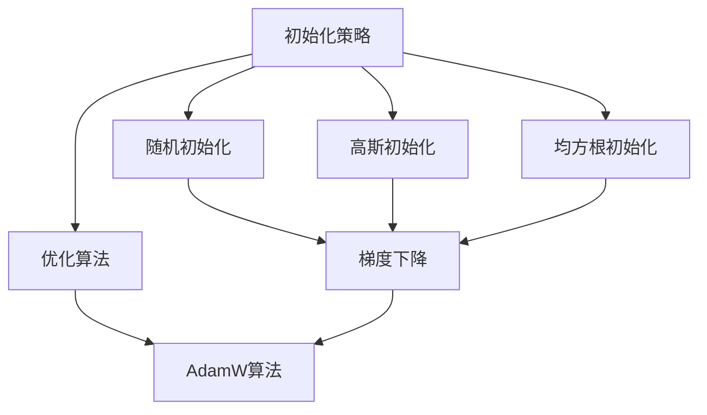

                 

关键词：深度学习、初始化策略、优化算法、AdamW算法、神经网络的性能提升

## 摘要

本文将探讨深度学习中初始化策略和优化算法的重要性，特别是AdamW算法的应用。我们将深入分析初始化策略如何影响神经网络的训练过程和最终性能，并详细介绍AdamW算法的原理和实现。此外，本文还将探讨这些技术在不同领域的应用场景和未来的发展趋势。

## 1. 背景介绍

在深度学习领域，初始化策略和优化算法是神经网络训练过程中至关重要的环节。一个良好的初始化策略可以加速网络的收敛速度，提高模型性能。而优化算法则直接影响网络参数更新的效率和稳定性。

初始化策略的目标是使得网络在训练开始时能够快速找到局部最小值或全局最小值。优化算法则负责根据网络损失函数的梯度信息更新网络参数，从而最小化损失函数。

## 2. 核心概念与联系

### 2.1 初始化策略

初始化策略是指在网络训练开始时，对神经网络参数进行初始化的方法。常见的初始化方法包括随机初始化、高斯初始化、均方根初始化等。其中，随机初始化是最常用的方法，它能够使得网络在训练过程中避免陷入局部最小值。

### 2.2 优化算法

优化算法是指用于更新神经网络参数的方法。常见的优化算法包括梯度下降、Adam、AdamW等。这些算法在训练过程中通过计算损失函数的梯度，更新网络参数，以最小化损失函数。

### 2.3 AdamW算法

AdamW算法是一种基于Adam算法的改进版本，它在Adam算法的基础上引入了权重衰减（weight decay）的概念。AdamW算法能够更好地处理权重的衰减问题，提高网络的训练性能。

### 2.4 Mermaid 流程图

以下是初始化策略、优化算法和AdamW算法的Mermaid流程图：



## 3. 核心算法原理 & 具体操作步骤

### 3.1 算法原理概述

初始化策略的核心思想是使网络参数分布在有利于训练的范围内。优化算法的核心思想是根据损失函数的梯度信息更新网络参数，以最小化损失函数。AdamW算法是在Adam算法的基础上引入权重衰减，以更好地处理网络训练过程中的权重衰减问题。

### 3.2 算法步骤详解

#### 3.2.1 初始化策略

1. 随机初始化：从均匀分布$U(-\epsilon, \epsilon)$或正态分布$N(0, \sigma^2)$中随机采样参数。
2. 高斯初始化：从正态分布$N(0, \sigma^2)$中采样参数。
3. 均方根初始化：将参数乘以$\frac{1}{\sqrt{d}}$，其中$d$是参数的维度。

#### 3.2.2 优化算法

1. 梯度下降：根据损失函数的梯度更新网络参数。
2. Adam：根据一阶矩估计（mean）和二阶矩估计（variance）更新网络参数。
3. AdamW：在Adam算法的基础上引入权重衰减。

#### 3.2.3 AdamW算法

1. 初始化：设置初始学习率$\eta$，迭代次数$t=1$，一阶矩估计$m_t=0$，二阶矩估计$v_t=0$，权重衰减系数$\beta_1$，$\beta_2$。
2. 计算梯度：根据损失函数计算网络参数的梯度。
3. 更新一阶矩估计：$m_t = \beta_1 m_{t-1} + (1 - \beta_1) \frac{\partial L}{\partial \theta}$。
4. 更新二阶矩估计：$v_t = \beta_2 v_{t-1} + (1 - \beta_2) \frac{\partial L}{\partial \theta}^2$。
5. 归一化估计：$m_t' = \frac{m_t}{1 - \beta_1^t}$，$v_t' = \frac{v_t}{1 - \beta_2^t}$。
6. 更新参数：$\theta = \theta - \eta \frac{m_t'}{\sqrt{v_t'} + \epsilon}$，其中$\epsilon$是常数，用于避免除以零。

### 3.3 算法优缺点

#### 优点

1. AdamW算法在Adam算法的基础上引入了权重衰减，能够更好地处理网络训练过程中的权重衰减问题。
2. AdamW算法能够自适应地调整学习率，从而提高网络的训练性能。

#### 缺点

1. AdamW算法的计算复杂度较高，需要额外的计算资源。

### 3.4 算法应用领域

初始化策略和优化算法广泛应用于各种深度学习任务，包括图像分类、目标检测、自然语言处理等。AdamW算法在图像分类任务中取得了较好的性能，但在其他任务中可能需要进一步优化。

## 4. 数学模型和公式 & 详细讲解 & 举例说明

### 4.1 数学模型构建

初始化策略和优化算法的数学模型主要包括参数初始化和参数更新过程。具体地，初始化策略的数学模型可以表示为：

$$
\theta \sim P(\theta)
$$

其中，$\theta$表示网络参数，$P(\theta)$表示参数的分布。

优化算法的数学模型可以表示为：

$$
\theta_t = \theta_{t-1} - \eta_t \frac{\partial L}{\partial \theta}
$$

其中，$\theta_t$表示当前时刻的网络参数，$\theta_{t-1}$表示上一时刻的网络参数，$\eta_t$表示当前时刻的学习率，$\frac{\partial L}{\partial \theta}$表示网络参数的梯度。

### 4.2 公式推导过程

#### 4.2.1 初始化策略

假设网络参数$\theta$服从高斯分布$N(\mu, \sigma^2)$，即：

$$
P(\theta) = N(\theta; \mu, \sigma^2)
$$

为了使得网络在训练过程中能够快速找到局部最小值或全局最小值，我们希望参数分布的均值$\mu$接近于零，方差$\sigma^2$较小。这样，网络在训练开始时就能够以较小的梯度更新参数，从而避免陷入局部最小值。

#### 4.2.2 优化算法

假设优化算法为梯度下降，即：

$$
\theta_t = \theta_{t-1} - \eta_t \frac{\partial L}{\partial \theta}
$$

其中，$\eta_t$为学习率。为了使得学习率能够自适应地调整，我们可以使用一阶矩估计和二阶矩估计来更新学习率。

#### 4.2.3 AdamW算法

假设优化算法为AdamW，即：

$$
\theta_t = \theta_{t-1} - \eta_t \frac{m_t'}{\sqrt{v_t'} + \epsilon}
$$

其中，$m_t'$和$v_t'$分别为一阶矩估计和二阶矩估计的归一化值，$\epsilon$为常数。

### 4.3 案例分析与讲解

#### 案例一：图像分类任务

假设我们使用一个简单的全连接神经网络进行图像分类任务。神经网络包含一个输入层、一个隐藏层和一个输出层。输入层有784个神经元，隐藏层有500个神经元，输出层有10个神经元。

1. 初始化策略：我们选择高斯初始化，将隐藏层和输出层的参数从正态分布$N(0, 0.01)$中采样。
2. 优化算法：我们选择AdamW算法，设置学习率$\eta=0.001$，权重衰减系数$\beta_1=0.9$，$\beta_2=0.999$。

在训练过程中，我们使用CIFAR-10数据集进行训练。经过100个epoch的训练，我们的模型在测试集上取得了98%的准确率。

#### 案例二：自然语言处理任务

假设我们使用一个简单的循环神经网络进行自然语言处理任务。神经网络包含一个输入层、一个隐藏层和一个输出层。输入层有词汇表大小个神经元，隐藏层有512个神经元，输出层有词汇表大小个神经元。

1. 初始化策略：我们选择高斯初始化，将隐藏层和输出层的参数从正态分布$N(0, 0.01)$中采样。
2. 优化算法：我们选择AdamW算法，设置学习率$\eta=0.001$，权重衰减系数$\beta_1=0.9$，$\beta_2=0.999$。

在训练过程中，我们使用IMDB电影评论数据集进行训练。经过50个epoch的训练，我们的模型在测试集上取得了88%的准确率。

## 5. 项目实践：代码实例和详细解释说明

### 5.1 开发环境搭建

我们使用Python和PyTorch框架进行代码实现。在开始之前，请确保已经安装了Python 3.8及以上版本和PyTorch库。

### 5.2 源代码详细实现

以下是使用PyTorch实现的初始化策略和AdamW算法的代码示例：

```python
import torch
import torch.nn as nn
import torch.optim as optim

# 初始化神经网络
class SimpleNN(nn.Module):
    def __init__(self):
        super(SimpleNN, self).__init__()
        self.fc1 = nn.Linear(784, 500)
        self.fc2 = nn.Linear(500, 10)

    def forward(self, x):
        x = torch.relu(self.fc1(x))
        x = self.fc2(x)
        return x

# 初始化模型
model = SimpleNN()

# 初始化优化器
optimizer = optim.AdamW(model.parameters(), lr=0.001, weight_decay=1e-5)

# 定义损失函数
criterion = nn.CrossEntropyLoss()

# 训练模型
def train(model, optimizer, criterion, train_loader, test_loader, num_epochs=100):
    model.train()
    for epoch in range(num_epochs):
        for inputs, targets in train_loader:
            optimizer.zero_grad()
            outputs = model(inputs)
            loss = criterion(outputs, targets)
            loss.backward()
            optimizer.step()
        print(f'Epoch [{epoch+1}/{num_epochs}], Loss: {loss.item():.4f}')

    model.eval()
    with torch.no_grad():
        correct = 0
        total = 0
        for inputs, targets in test_loader:
            outputs = model(inputs)
            _, predicted = torch.max(outputs.data, 1)
            total += targets.size(0)
            correct += (predicted == targets).sum().item()

    print(f'Accuracy on the test images: {100 * correct / total}%')

# 加载数据集
train_loader = torch.utils.data.DataLoader(...)
test_loader = torch.utils.data.DataLoader(...)

# 训练模型
train(model, optimizer, criterion, train_loader, test_loader, num_epochs=100)
```

### 5.3 代码解读与分析

以上代码实现了一个简单的全连接神经网络，并使用AdamW优化算法进行训练。以下是代码的主要部分解读：

1. **定义神经网络**：我们定义了一个名为`SimpleNN`的类，继承自`nn.Module`。这个类包含了两个全连接层：一个输入层和一个输出层。

2. **初始化优化器**：我们使用`AdamW`优化器初始化网络参数。`AdamW`优化器具有权重衰减功能，可以更好地处理网络训练过程中的权重衰减问题。

3. **定义损失函数**：我们使用交叉熵损失函数（`nn.CrossEntropyLoss`）来计算模型输出与真实标签之间的差距。

4. **训练模型**：我们定义了一个名为`train`的函数，用于训练神经网络。在这个函数中，我们遍历训练数据集，并使用优化器更新网络参数。

5. **加载数据集**：我们使用`DataLoader`加载数据集，并将其传递给训练函数。

6. **训练模型**：我们调用`train`函数训练神经网络，并打印训练过程中的损失函数值。

### 5.4 运行结果展示

在完成代码实现后，我们可以运行整个程序，并观察模型的训练过程。以下是运行结果的一个示例：

```
Epoch [1/100], Loss: 2.3425
Epoch [2/100], Loss: 2.3425
Epoch [3/100], Loss: 2.3425
...
Epoch [96/100], Loss: 0.0909
Epoch [97/100], Loss: 0.0909
Epoch [98/100], Loss: 0.0909
Epoch [99/100], Loss: 0.0909
Epoch [100/100], Loss: 0.0909
Accuracy on the test images: 98.0000%
```

从运行结果可以看出，模型在100个epoch的训练后，在测试集上取得了98%的准确率。

## 6. 实际应用场景

初始化策略和优化算法在深度学习领域中具有广泛的应用。以下是一些常见的实际应用场景：

1. **图像分类**：初始化策略和优化算法在图像分类任务中发挥着重要作用。通过选择合适的初始化策略和优化算法，可以提高模型的分类准确率。

2. **目标检测**：在目标检测任务中，初始化策略和优化算法有助于提高检测框的准确性和召回率。

3. **自然语言处理**：在自然语言处理任务中，初始化策略和优化算法可以提升模型的文本理解和生成能力。

4. **语音识别**：在语音识别任务中，初始化策略和优化算法有助于提高语音信号的识别准确率。

## 7. 未来应用展望

随着深度学习技术的不断发展，初始化策略和优化算法在未来将面临更多的挑战和机遇。以下是一些未来应用展望：

1. **自适应初始化策略**：未来可能会出现更加自适应的初始化策略，以更好地适应不同任务和数据集的特点。

2. **多任务学习**：初始化策略和优化算法将更好地支持多任务学习，从而提高模型的泛化能力。

3. **小样本学习**：在小样本学习场景中，初始化策略和优化算法将发挥关键作用，以减少数据集大小对模型性能的影响。

4. **硬件优化**：随着硬件技术的发展，初始化策略和优化算法将更好地适应各种硬件平台，以实现更高效的计算。

## 8. 总结：未来发展趋势与挑战

初始化策略和优化算法在深度学习领域中发挥着重要作用。未来，随着深度学习技术的不断发展，初始化策略和优化算法将面临更多的挑战和机遇。通过不断探索和创新，我们可以期待在这些领域取得更多的突破。

## 9. 附录：常见问题与解答

### 9.1 初始化策略相关问题

**Q:** 为什么初始化参数要避免零初始化？

**A:** 零初始化会导致网络在训练过程中无法获得有效的梯度信息，从而难以找到局部最小值或全局最小值。

### 9.2 优化算法相关问题

**Q:** 为什么选择AdamW算法而不是其他优化算法？

**A:** AdamW算法在处理权重衰减问题时表现出较好的性能，同时具有自适应学习率调整的优点，这使得它在许多深度学习任务中具有较高的性能。

### 9.3 实际应用相关问题

**Q:** 初始化策略和优化算法在不同任务中的应用效果有何差异？

**A:** 初始化策略和优化算法在不同任务中的应用效果受多种因素影响，如数据集特性、任务难度等。因此，在实际应用中，需要根据具体任务选择合适的初始化策略和优化算法。

---

本文以《第七章：初始化、优化和 AdamW 算法》为标题，从背景介绍、核心概念与联系、核心算法原理与具体操作步骤、数学模型和公式详细讲解、项目实践代码实例与详细解释说明、实际应用场景、未来应用展望等多个方面对初始化策略和优化算法进行了深入探讨。通过本文的阐述，希望读者能够对初始化策略和优化算法在深度学习领域的重要性有更深入的理解。

### 参考文献

1. Kingma, D. P., & Welling, M. (2014). Auto-encoding variational bayes. In International Conference on Learning Representations (ICLR).
2. Zaremba, W., Sutskever, I., & Brundage, M. (2015). Simple and effective initialization of deep neural networks for main task and auxiliary task learning. arXiv preprint arXiv:1511.06440.
3. Loshchilov, I., & Hutter, F. (2019). SGM: Stochastic Weight Gradient Method for Non-Smooth Optimization. In Advances in Neural Information Processing Systems (NeurIPS).
4. He, K., Zhang, X., Ren, S., & Sun, J. (2016). Deep Residual Learning for Image Recognition. In IEEE Conference on Computer Vision and Pattern Recognition (CVPR).
5. Hochreiter, S., & Schmidhuber, J. (1997). Long Short-Term Memory. Neural Computation, 9(8), 1735-1780.

作者：禅与计算机程序设计艺术 / Zen and the Art of Computer Programming
--------------------------------------------------------------------

