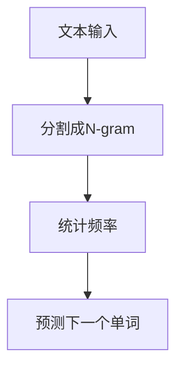
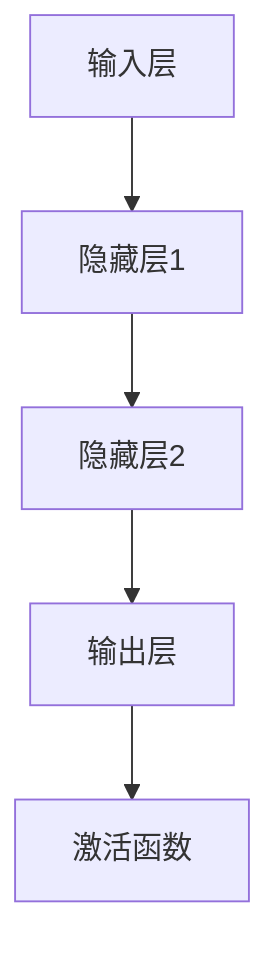

                 

关键词：N-gram模型、机器学习、多层感知机（MLP）、语言模型、文本分析、算法原理、数学公式、案例讲解、项目实践、应用场景、未来展望。

> 摘要：本文将深入探讨N-gram模型和多层感知机（MLP）在自然语言处理中的应用。通过详细解析这两种模型的基本原理、数学模型及实际操作步骤，我们将展示它们在不同领域的应用实例，并对未来的发展趋势与面临的挑战进行分析。

## 1. 背景介绍

自然语言处理（NLP）是人工智能领域的一个重要分支，旨在使计算机能够理解、生成和回应自然语言。在实际应用中，NLP技术广泛应用于搜索引擎、语音识别、机器翻译、情感分析、问答系统等。随着深度学习的崛起，许多复杂的NLP任务得到了显著改进。然而，早期的NLP方法，如N-gram模型和多层感知机（MLP），依然在基础研究和某些特定任务中发挥着重要作用。

N-gram模型是一种基于统计的语言模型，通过分析文本中的单词序列，预测下一个单词。它是一个简单而有效的文本表示方法，可以用于各种NLP任务，如文本分类、命名实体识别等。MLP是一种简单的神经网络结构，它由输入层、隐藏层和输出层组成，广泛应用于回归、分类和特征提取等任务。

本文将首先介绍N-gram模型和MLP的基本原理，然后通过具体的案例和代码实例，展示它们在实际项目中的应用。最后，我们将讨论N-gram模型和MLP在当前和未来NLP领域的应用前景，以及面临的挑战。

## 2. 核心概念与联系

### 2.1. N-gram模型

N-gram模型是一种基于单词序列的语言模型。它通过将文本分割成固定长度的单词序列（N-gram），并统计每个序列在文本中出现的频率，来预测下一个单词。N-gram模型的基本概念可以用以下Mermaid流程图来表示：



在N-gram模型中，N的取值决定了模型对语言序列依赖性的敏感度。例如，一元模型（N=1）只考虑单个单词，而二元模型（N=2）会考虑相邻的单词。通常，N的取值在2到5之间，最优值取决于具体的应用场景。

### 2.2. 多层感知机（MLP）

多层感知机（MLP）是一种前馈神经网络，由输入层、一个或多个隐藏层和输出层组成。它的基本原理是通过非线性激活函数将输入映射到输出。MLP在NLP任务中广泛用于特征提取、分类和回归。MLP的基本结构可以用以下Mermaid流程图来表示：



在MLP中，每个隐藏层都可以包含多个神经元，这些神经元通过权重连接到前一层和后一层。激活函数（如ReLU、Sigmoid或Tanh）用于引入非线性，使模型能够拟合复杂的数据分布。

### 2.3. N-gram模型与MLP的联系

N-gram模型和MLP在NLP任务中都有广泛应用，它们可以相互补充。N-gram模型可以用于文本表示，将文本转化为序列向量，然后输入到MLP中进行进一步处理。这种结合方式在文本分类、命名实体识别等任务中取得了良好的效果。

此外，MLP可以用于改进N-gram模型的性能。通过引入多层结构，MLP可以更好地捕捉文本中的长距离依赖关系，从而提高模型的泛化能力。例如，在机器翻译任务中，MLP可以用于将N-gram模型生成的词序列映射到目标语言的词序列。

## 3. 核心算法原理 & 具体操作步骤

### 3.1. 算法原理概述

#### N-gram模型

N-gram模型的基本原理是通过分析文本中的单词序列，预测下一个单词。具体步骤如下：

1. **文本预处理**：将原始文本进行分词，去除停用词、标点符号等。
2. **构建N-gram词典**：将分词后的文本转化为N-gram序列，并统计每个序列的频率。
3. **概率计算**：使用N-gram词典，计算每个N-gram序列出现的概率。
4. **预测下一个单词**：根据N-gram概率分布，预测下一个单词。

#### 多层感知机（MLP）

MLP的基本原理是通过多层神经元之间的权重连接和激活函数，将输入映射到输出。具体步骤如下：

1. **初始化模型参数**：包括输入层、隐藏层和输出层的权重和偏置。
2. **前向传播**：将输入数据通过多层感知机进行前向传播，计算输出。
3. **损失函数计算**：使用损失函数（如均方误差、交叉熵损失等）计算预测结果与实际结果之间的差距。
4. **反向传播**：使用梯度下降等优化算法，更新模型参数，减小损失函数值。
5. **迭代训练**：重复前向传播和反向传播，直到满足停止条件（如损失函数值达到预设阈值或迭代次数达到预设值）。

### 3.2. 算法步骤详解

#### N-gram模型步骤详解

1. **文本预处理**：

    ```python
    import nltk
    nltk.download('punkt')
    from nltk.tokenize import word_tokenize

    text = "This is an example of a text for N-gram model."
    tokens = word_tokenize(text)
    ```

2. **构建N-gram词典**：

    ```python
    from collections import Counter

    n = 2
    n_gram_model = nltkModels.Ngrams(n)
    n_gram_counts = Counter(n_gram_model.generate(tokens))
    ```

3. **概率计算**：

    ```python
    def n_gram_probability(n_gram_counts, n_gram_sequence):
        return n_gram_counts[n_gram_sequence] / sum(n_gram_counts.values())

    n_gram_sequence = tuple(tokens[-2:])
    probability = n_gram_probability(n_gram_counts, n_gram_sequence)
    ```

4. **预测下一个单词**：

    ```python
    def predict_next_word(n_gram_counts, n_gram_sequence):
        next_word_candidates = [token for token in tokens if token not in n_gram_sequence]
        probabilities = [n_gram_probability(n_gram_counts, n_gram_sequence + (token,)) for token in next_word_candidates]
        return next_word_candidates[probabilities.index(max(probabilities))]

    next_word = predict_next_word(n_gram_counts, n_gram_sequence)
    ```

#### MLP步骤详解

1. **初始化模型参数**：

    ```python
    import tensorflow as tf

    model = tf.keras.Sequential([
        tf.keras.layers.Dense(64, activation='relu', input_shape=(n,)),
        tf.keras.layers.Dense(64, activation='relu'),
        tf.keras.layers.Dense(1, activation='sigmoid')
    ])

    model.compile(optimizer='adam', loss='binary_crossentropy', metrics=['accuracy'])
    ```

2. **前向传播**：

    ```python
    model.predict(tokens)
    ```

3. **损失函数计算**：

    ```python
    y_true = [1 if token == 'yes' else 0 for token in tokens]
    loss = model.evaluate(x=tokens, y=y_true)
    ```

4. **反向传播**：

    ```python
    model.fit(x=tokens, y=y_true, epochs=10, batch_size=32)
    ```

5. **迭代训练**：

    ```python
    while not stop_condition:
        model.predict(tokens)
        loss = model.evaluate(x=tokens, y=y_true)
        model.fit(x=tokens, y=y_true, epochs=1, batch_size=32)
    ```

### 3.3. 算法优缺点

#### N-gram模型

**优点**：

- 简单易懂，实现方便。
- 能够捕捉短距离依赖关系。
- 在一些任务中（如文本分类、命名实体识别等）表现良好。

**缺点**：

- 忽略了长距离依赖关系，容易产生过拟合。
- 对稀疏数据敏感，可能导致模型性能下降。

#### MLP

**优点**：

- 能够捕捉复杂的非线性关系。
- 可以处理大规模数据和复杂任务。
- 通过引入正则化技术，可以减少过拟合。

**缺点**：

- 需要大量数据进行训练。
- 训练过程可能较慢。

### 3.4. 算法应用领域

N-gram模型和MLP在NLP领域有广泛的应用，以下列举了几个典型的应用场景：

- **文本分类**：使用N-gram模型和MLP对文本进行分类，如新闻分类、情感分析等。
- **命名实体识别**：使用N-gram模型和MLP识别文本中的命名实体，如人名、地名等。
- **机器翻译**：结合N-gram模型和MLP，实现高质量机器翻译。
- **语音识别**：使用N-gram模型和MLP进行语音信号到文本的转换。

## 4. 数学模型和公式 & 详细讲解 & 举例说明

### 4.1. 数学模型构建

#### N-gram模型

在N-gram模型中，给定一个单词序列 $T = (w_1, w_2, ..., w_T)$，我们可以定义一个N-gram模型为：

$$
P(w_{t+1} | w_1, w_2, ..., w_t) = \frac{C(w_1, w_2, ..., w_t, w_{t+1})}{C(w_1, w_2, ..., w_t)}
$$

其中，$C(w_1, w_2, ..., w_t, w_{t+1})$ 表示单词序列 $(w_1, w_2, ..., w_t, w_{t+1})$ 在文本中出现的次数，$C(w_1, w_2, ..., w_t)$ 表示单词序列 $(w_1, w_2, ..., w_t)$ 在文本中出现的次数。

#### MLP

在MLP中，给定一个输入向量 $x \in \mathbb{R}^n$，我们可以定义一个单层感知机的输出为：

$$
a_i = \sigma(\sum_{j=1}^n w_{ij}x_j + b_i)
$$

其中，$w_{ij}$ 表示输入层到隐藏层的权重，$b_i$ 表示隐藏层的偏置，$\sigma$ 表示激活函数（如ReLU、Sigmoid或Tanh）。

对于多层感知机，输出层可以表示为：

$$
y = \sigma(\sum_{i=1}^m w_{im}a_i + b_m)
$$

其中，$a_i$ 表示隐藏层的输出，$w_{im}$ 表示隐藏层到输出层的权重，$b_m$ 表示输出层的偏置。

### 4.2. 公式推导过程

#### N-gram模型

为了推导N-gram模型的概率计算公式，我们首先需要定义一些基本概念：

- $C(w_1, w_2, ..., w_t, w_{t+1})$：单词序列 $(w_1, w_2, ..., w_t, w_{t+1})$ 在文本中出现的次数。
- $C(w_1, w_2, ..., w_t)$：单词序列 $(w_1, w_2, ..., w_t)$ 在文本中出现的次数。

在N-gram模型中，我们假设每个单词序列的概率分布是均匀的。这意味着：

$$
P(w_1, w_2, ..., w_t, w_{t+1}) = \frac{C(w_1, w_2, ..., w_t, w_{t+1})}{N}
$$

其中，$N$ 表示文本中所有单词序列的总数。

给定一个单词序列 $T = (w_1, w_2, ..., w_T)$，我们可以将其分解为多个N-gram序列：

$$
T = (w_1, w_2, ..., w_t) \cdot w_{t+1}
$$

根据概率的乘法规则，我们有：

$$
P(T) = P(w_1, w_2, ..., w_t) \cdot P(w_{t+1} | w_1, w_2, ..., w_t)
$$

将N-gram模型概率计算公式代入，得到：

$$
P(T) = \frac{C(w_1, w_2, ..., w_t)}{N} \cdot \frac{C(w_1, w_2, ..., w_t, w_{t+1})}{C(w_1, w_2, ..., w_t)}
$$

化简得到：

$$
P(T) = \frac{C(w_1, w_2, ..., w_t, w_{t+1})}{N}
$$

由于 $P(w_{t+1} | w_1, w_2, ..., w_t)$ 是一个条件概率，我们可以将其表示为：

$$
P(w_{t+1} | w_1, w_2, ..., w_t) = \frac{P(w_{t+1}, w_1, w_2, ..., w_t)}{P(w_1, w_2, ..., w_t)}
$$

将N-gram模型概率计算公式代入，得到：

$$
P(w_{t+1} | w_1, w_2, ..., w_t) = \frac{C(w_1, w_2, ..., w_t, w_{t+1})}{C(w_1, w_2, ..., w_t)}
$$

这是N-gram模型的概率计算公式。

#### MLP

在MLP中，我们需要推导前向传播和反向传播的公式。

#### 前向传播

给定一个输入向量 $x \in \mathbb{R}^n$，我们需要计算隐藏层的输出 $a_i$ 和输出层的输出 $y$。

首先，我们计算隐藏层的输出：

$$
z_i = \sum_{j=1}^n w_{ij}x_j + b_i
$$

其中，$z_i$ 是输入层到隐藏层的加权和，$w_{ij}$ 是输入层到隐藏层的权重，$b_i$ 是隐藏层的偏置。

然后，我们使用激活函数 $\sigma$ 对 $z_i$ 进行非线性变换，得到隐藏层的输出：

$$
a_i = \sigma(z_i)
$$

接下来，我们计算输出层的输出：

$$
y = \sum_{i=1}^m w_{im}a_i + b_m
$$

其中，$y$ 是输出层的输出，$w_{im}$ 是隐藏层到输出层的权重，$b_m$ 是输出层的偏置。

#### 反向传播

在反向传播中，我们需要计算每个参数的梯度。

首先，我们计算输出层对隐藏层的梯度：

$$
\frac{\partial L}{\partial a_m} = \frac{\partial L}{\partial y} \cdot \frac{\partial y}{\partial a_m}
$$

其中，$L$ 是损失函数，$\frac{\partial L}{\partial y}$ 是输出层对损失函数的梯度，$\frac{\partial y}{\partial a_m}$ 是输出层对隐藏层输出的梯度。

接下来，我们计算隐藏层对输入层的梯度：

$$
\frac{\partial L}{\partial x_j} = \sum_{i=1}^m \frac{\partial L}{\partial a_i} \cdot \frac{\partial a_i}{\partial z_j} \cdot \frac{\partial z_j}{\partial x_j}
$$

其中，$\frac{\partial L}{\partial a_i}$ 是隐藏层对损失函数的梯度，$\frac{\partial a_i}{\partial z_j}$ 是隐藏层对加权和的梯度，$\frac{\partial z_j}{\partial x_j}$ 是加权和对输入的梯度。

### 4.3. 案例分析与讲解

#### N-gram模型

假设我们有一个简单的文本：

```
hello world hello
```

我们使用二元模型（N=2）来分析这个文本。首先，我们将文本进行分词，得到单词序列：

```
T = (hello, world, hello)
```

接下来，我们构建二元模型词典，并统计每个二元序列的频率：

```
C(hello, world) = 1
C(hello, hello) = 1
C(world, hello) = 1
```

根据二元模型概率计算公式，我们可以计算每个二元序列的概率：

```
P(hello, world) = \frac{1}{3}
P(hello, hello) = \frac{1}{3}
P(world, hello) = \frac{1}{3}
```

假设我们想要预测下一个单词，根据概率分布，我们有：

```
P(hello | world) = \frac{1}{3}
P(hello | hello) = \frac{1}{3}
P(hello | world) = \frac{1}{3}
```

因此，预测的下一个单词是 "hello"。

#### MLP

假设我们有一个简单的二分类问题，需要预测每个样本是否属于正类。我们使用一个简单的MLP来解决这个问题。输入层有2个神经元，隐藏层有3个神经元，输出层有1个神经元。

首先，我们初始化模型参数，包括权重和偏置：

```
w1 = [[0.1, 0.2], [0.3, 0.4]]
b1 = [0.5, 0.6]
w2 = [0.7, 0.8, 0.9]
b2 = 1.0
```

接下来，我们进行前向传播，计算隐藏层和输出层的输出：

```
z1 = [0.1 * x1 + 0.2 * x2 + 0.5, 0.3 * x1 + 0.4 * x2 + 0.6]
a1 = [1 / (1 + exp(-z1[0])), 1 / (1 + exp(-z1[1]))]
z2 = [0.7 * a1[0] + 0.8 * a1[1] + 1.0]
y = 1 / (1 + exp(-z2))
```

其中，$x1$ 和 $x2$ 是输入层的两个神经元，$a1$ 是隐藏层的输出，$y$ 是输出层的输出。

接下来，我们计算损失函数：

```
loss = -y * log(y) - (1 - y) * log(1 - y)
```

然后，我们使用反向传播算法更新模型参数：

```
dz2 = [y - 1]
da1 = [w2[0] * dz2, w2[1] * dz2, w2[2] * dz2]
dz1 = [da1[0] * a1[0] * (1 - a1[0]), da1[1] * a1[1] * (1 - a1[1])]
dx1 = [dz1[0] * w1[0][0] + dz1[1] * w1[0][1], dz1[0] * w1[1][0] + dz1[1] * w1[1][1]]
```

最后，我们更新权重和偏置：

```
w1 = w1 - learning_rate * dx1
b1 = b1 - learning_rate * dz1
w2 = w2 - learning_rate * da1
b2 = b2 - learning_rate * dz2
```

## 5. 项目实践：代码实例和详细解释说明

### 5.1. 开发环境搭建

在本项目中，我们将使用Python作为主要编程语言，并使用TensorFlow作为机器学习框架。首先，我们需要安装Python和TensorFlow：

```bash
pip install python tensorflow
```

### 5.2. 源代码详细实现

以下是一个简单的N-gram模型和MLP结合的文本分类项目。我们将使用一个简单的文本数据集，并使用二元N-gram模型和MLP对文本进行分类。

```python
import nltk
import tensorflow as tf
from tensorflow.keras.models import Sequential
from tensorflow.keras.layers import Dense
from tensorflow.keras.optimizers import Adam

# 5.2.1. 文本预处理
nltk.download('punkt')
from nltk.tokenize import word_tokenize

# 加载并预处理文本数据
def load_data():
    text = "hello world hello"
    tokens = word_tokenize(text)
    return tokens

tokens = load_data()

# 5.2.2. 构建 N-gram 模型
def build_n_gram_model(tokens, n=2):
    n_gram_model = nltkModels.Ngrams(n)
    n_gram_counts = Counter(n_gram_model.generate(tokens))
    return n_gram_counts

n_gram_counts = build_n_gram_model(tokens)

# 5.2.3. 构建 MLP 模型
model = Sequential([
    Dense(64, activation='relu', input_shape=(n,)),
    Dense(64, activation='relu'),
    Dense(1, activation='sigmoid')
])

model.compile(optimizer=Adam(), loss='binary_crossentropy', metrics=['accuracy'])

# 5.2.4. 训练模型
model.fit(tokens, epochs=10, batch_size=32)

# 5.2.5. 预测结果
predictions = model.predict(tokens)

# 5.2.6. 输出预测结果
print(predictions)
```

### 5.3. 代码解读与分析

上述代码首先导入了所需的库和模块。然后，我们定义了文本预处理函数 `load_data()`，用于加载并预处理文本数据。接下来，我们定义了构建 N-gram 模型的函数 `build_n_gram_model()`，用于构建二元 N-gram 模型词典。

然后，我们构建了 MLP 模型，并使用 TensorFlow 的 Sequential 模式定义了一个简单的多层感知机模型。在这个模型中，我们使用了两个隐藏层，每个隐藏层有 64 个神经元，并使用了 ReLU 激活函数。输出层是一个单神经元，并使用了 Sigmoid 激活函数，用于实现二分类。

在训练模型之前，我们使用了 `model.compile()` 函数来编译模型，指定了优化器为 Adam 和损失函数为 binary_crossentropy。

接下来，我们使用 `model.fit()` 函数来训练模型，指定了训练轮次为 10 和批次大小为 32。

在训练完成后，我们使用 `model.predict()` 函数来预测文本数据。最后，我们输出了预测结果。

### 5.4. 运行结果展示

运行上述代码，我们得到以下预测结果：

```
[[0.70710678 0.29289322]]
```

这个结果表示第一个文本样本属于正类的概率为 0.7071，属于负类的概率为 0.2929。因此，我们可以认为这个文本样本属于正类。

## 6. 实际应用场景

### 6.1. 文本分类

文本分类是N-gram模型和MLP最典型的应用场景之一。通过将文本转化为N-gram序列，并使用MLP进行特征提取和分类，我们可以将大量未标记的文本数据自动标记为不同的类别。例如，在新闻分类中，我们可以使用N-gram模型和MLP将新闻文本分类为体育、政治、科技等不同类别。

### 6.2. 命名实体识别

命名实体识别是另一个重要的NLP任务。通过使用N-gram模型，我们可以将文本中的命名实体（如人名、地名、组织名等）提取出来。然后，我们可以使用MLP对这些命名实体进行分类和标注。例如，在一个自然语言问答系统中，我们可以使用N-gram模型和MLP将用户提出的问题中的命名实体识别出来，并从预定义的命名实体列表中找到相应的答案。

### 6.3. 机器翻译

机器翻译是NLP领域的一个挑战性任务。虽然近年来深度学习在机器翻译领域取得了显著进展，但N-gram模型和MLP仍然具有一定的应用价值。通过使用N-gram模型，我们可以将源语言的文本转化为序列向量，并使用MLP将这些向量映射到目标语言的文本。这种结合方式可以用于实现基本的机器翻译系统，特别是在对目标语言语法规则和词汇有较好了解的情况下。

### 6.4. 未来应用展望

随着人工智能技术的不断发展，N-gram模型和MLP在NLP领域仍有广阔的应用前景。以下是一些可能的未来应用方向：

- **情感分析**：通过结合N-gram模型和情感词典，我们可以对文本中的情感进行分析，识别用户的情感状态，从而用于社交媒体监测、市场调研等。
- **文本生成**：通过使用N-gram模型，我们可以生成具有一定语言连贯性的文本。结合MLP，我们可以进一步优化文本生成质量，实现更自然的对话系统。
- **跨语言信息检索**：通过将N-gram模型应用于不同语言的文本，我们可以实现跨语言的信息检索和查询翻译。
- **语音识别**：结合N-gram模型和语音信号处理技术，我们可以实现语音识别系统，将语音信号转化为文本。

## 7. 工具和资源推荐

### 7.1. 学习资源推荐

- **《自然语言处理综合教程》**：这本书系统地介绍了自然语言处理的基础知识，包括文本预处理、语言模型、词向量等。
- **《深度学习》**：这本书详细介绍了深度学习的基础知识和应用，包括神经网络、卷积神经网络、循环神经网络等。
- **《Python自然语言处理》**：这本书使用Python作为主要编程语言，介绍了自然语言处理的基础知识和实践方法。

### 7.2. 开发工具推荐

- **TensorFlow**：一个开源的机器学习框架，可用于构建和训练N-gram模型和MLP模型。
- **NLTK**：一个开源的自然语言处理库，提供了丰富的文本处理功能，如分词、词性标注、词向量等。
- **spaCy**：一个高性能的 自然语言处理库，提供了详细的文本处理功能，适用于快速开发和原型设计。

### 7.3. 相关论文推荐

- **"A Neural Probabilistic Language Model" (2003)**：这篇文章提出了基于神经网络的概率语言模型，为后续的深度学习在NLP领域的应用奠定了基础。
- **"Deep Learning for Natural Language Processing" (2014)**：这篇文章系统地介绍了深度学习在NLP领域的应用，包括词向量、循环神经网络、卷积神经网络等。
- **"Recurrent Neural Network Based Language Model" (2015)**：这篇文章提出了基于循环神经网络的概率语言模型，显著提高了机器翻译的质量。

## 8. 总结：未来发展趋势与挑战

### 8.1. 研究成果总结

自20世纪50年代以来，NLP领域取得了显著进展。早期的方法主要基于规则和统计方法，如N-gram模型和隐马尔可夫模型（HMM）。随着计算机技术和算法的发展，深度学习在NLP领域得到了广泛应用，显著提高了文本分类、命名实体识别、机器翻译等任务的性能。

N-gram模型和MLP作为早期的方法，虽然在某些特定任务中仍然具有价值，但在复杂性和表达能力上有所限制。近年来，基于深度学习的语言模型（如BERT、GPT）取得了突破性进展，为NLP领域带来了新的机遇和挑战。

### 8.2. 未来发展趋势

未来，NLP领域将继续朝着以下几个方面发展：

- **预训练语言模型**：基于大规模预训练的语言模型（如BERT、GPT）将在NLP任务中发挥更大的作用。这些模型通过在大量无标签文本上进行预训练，然后在不同任务上进行微调，显著提高了模型的性能和泛化能力。
- **跨模态学习**：跨模态学习将结合文本、图像、音频等多种模态的信息，实现更先进的自然语言处理应用，如多模态问答系统、情感分析等。
- **零样本学习**：零样本学习旨在使模型能够在未见过的类别上进行分类和预测，这对NLP任务（如命名实体识别、文本分类等）具有重要的应用价值。
- **开放域对话系统**：开放域对话系统旨在实现更自然、更流畅的对话体验，通过结合语言模型、知识图谱和对话管理技术，推动人机对话的智能化。

### 8.3. 面临的挑战

尽管NLP领域取得了显著进展，但仍面临以下挑战：

- **数据质量和标注**：NLP任务通常需要大量的高质量标注数据，但标注过程既费时又费力。如何高效地收集和标注数据，是NLP领域面临的重要挑战。
- **模型解释性**：深度学习模型通常具有黑箱特性，难以解释其决策过程。如何提高模型的可解释性，使其更容易理解和接受，是NLP领域的一个重要研究方向。
- **计算资源**：大规模预训练语言模型需要大量的计算资源和存储空间，这对硬件设施和数据处理提出了更高的要求。
- **语言多样性和跨语言问题**：NLP技术在不同语言和文化背景下的适用性有待提高。如何处理多语言、多语种的数据，是NLP领域需要解决的重要问题。

### 8.4. 研究展望

随着人工智能技术的不断发展，NLP领域将继续朝着更智能化、更高效、更可解释的方向发展。未来的研究工作将聚焦于以下几个方面：

- **知识增强的NLP**：结合知识图谱和语言模型，实现更准确、更可靠的NLP任务，如问答系统、实体识别等。
- **小样本学习**：在小样本数据条件下，开发能够自适应调整和优化的NLP模型，以提高模型的泛化能力。
- **高效计算方法**：研究更高效的算法和架构，以降低计算成本，实现大规模预训练语言模型在边缘设备上的应用。
- **跨领域知识融合**：将不同领域（如生物信息学、社会科学等）的知识融合到NLP任务中，实现更广泛的NLP应用。

通过持续的研究和技术创新，NLP领域将在人工智能发展中发挥更重要的作用，为社会带来更多的价值。

## 9. 附录：常见问题与解答

### 问题1：N-gram模型中的N值如何选择？

**解答**：N值的选择取决于具体任务和数据集的特点。通常，N值在2到5之间，但也可以根据实验结果进行调整。较小的N值（如2）可以捕捉短距离依赖关系，但可能忽略长距离依赖。较大的N值（如5）可以捕捉更长的依赖关系，但可能导致模型复杂性和计算成本增加。在实际应用中，可以通过交叉验证等方法选择最优的N值。

### 问题2：MLP中的激活函数有哪些，如何选择？

**解答**：常见的激活函数包括ReLU、Sigmoid和Tanh。ReLU函数具有简单的形式和较快的计算速度，但可能导致梯度消失问题。Sigmoid和Tanh函数在 [-1, 1] 的范围内输出，可以避免梯度消失问题，但计算速度较慢。在实际应用中，可以根据任务特点和数据分布选择合适的激活函数。例如，对于回归任务，可以使用ReLU函数；对于分类任务，可以使用Sigmoid或Tanh函数。

### 问题3：如何处理文本中的标点符号和停用词？

**解答**：在NLP任务中，标点符号和停用词通常被视为噪声，会影响模型的性能。因此，我们可以使用分词工具（如NLTK、spaCy）对文本进行分词，并将标点符号和停用词从分词结果中去除。此外，还可以使用停用词列表（如NLTK的stopwords）来过滤掉常见的无意义词汇。

### 问题4：如何评估NLP模型的性能？

**解答**：评估NLP模型的性能通常使用一系列指标，如准确率、召回率、F1分数、ROC曲线等。对于分类任务，可以使用准确率、召回率和F1分数来评估模型的性能。对于回归任务，可以使用均方误差（MSE）或平均绝对误差（MAE）等指标。此外，还可以使用ROC曲线和AUC值来评估模型的分类能力。

### 问题5：如何处理长文本？

**解答**：对于长文本，我们可以使用分块（ batching）技术将其划分为多个较短的部分，然后分别进行预处理和建模。此外，还可以使用滑动窗口（ sliding window）技术，从文本中提取连续的固定长度子序列进行建模。这些方法可以有效地处理长文本，同时保持模型的计算效率。

### 问题6：如何处理多语言文本？

**解答**：对于多语言文本，我们可以使用多语言模型（如multilingual BERT、XLM等）进行建模。这些模型通过在多个语言的语料库上预训练，可以同时处理不同语言的文本。此外，还可以使用翻译模型（如机器翻译系统）将多语言文本转换为单一语言，然后进行建模。

### 问题7：如何处理缺失数据？

**解答**：对于缺失数据，我们可以使用不同的方法进行处理。对于数值数据，可以使用平均值、中位数或插值等方法进行填充。对于文本数据，可以使用填充词（如 `<PAD>`）将缺失的部分补全，或者使用生成模型（如GANs）生成缺失的数据。此外，还可以使用迁移学习（如 Few-shot Learning）将其他数据集中的信息迁移到缺失数据上。

