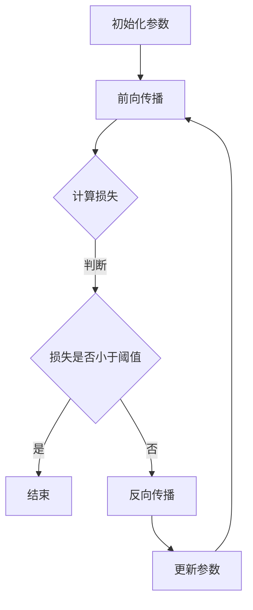

                 

关键词：机器学习，反向传播，神经网络，算法原理，数学模型，代码实例，应用场景，未来展望

> 摘要：本文将深入探讨机器学习中的核心算法——反向传播算法。我们将介绍其原理、构建、推导过程，并通过实例说明其在实际应用中的效果。同时，还将讨论其在不同领域的应用前景，以及面临的挑战和未来的研究方向。

## 1. 背景介绍

机器学习，作为一种人工智能的重要分支，已经成为现代科技发展的基石。它通过让计算机从数据中自动学习规律，从而实现智能决策和预测。而反向传播算法（Backpropagation Algorithm）是深度学习中不可或缺的一部分，它是神经网络训练的核心。

神经网络，由大量的神经元组成，每个神经元都与其他神经元相连，形成一个复杂的网络结构。反向传播算法通过这种网络结构，学习输入与输出之间的映射关系，使得网络能够对未知数据进行预测。

在20世纪80年代，反向传播算法的提出，标志着深度学习的发展进入了一个全新的阶段。它通过不断调整网络中神经元的权重，使得网络能够更好地拟合训练数据。然而，反向传播算法并非一蹴而就，其背后有着复杂的数学原理和实现细节。

## 2. 核心概念与联系

为了更好地理解反向传播算法，我们首先需要了解一些核心概念，包括神经网络、神经元、激活函数、损失函数等。

### 2.1 神经网络

神经网络（Neural Network）是一种模拟人脑神经元结构和工作方式的计算模型。它由大量的神经元（Node）组成，每个神经元都与其他神经元相连，形成一个复杂的网络结构。神经元的连接称为边（Edge），边的权重（Weight）表示两个神经元之间的关联强度。


### 2.2 神经元

神经元（Neuron）是神经网络的基本单元，它通过接收输入信号，经过加权求和处理，产生输出信号。神经元的输出信号通常通过激活函数（Activation Function）进行转换，从而产生最终的输出。


### 2.3 激活函数

激活函数（Activation Function）是神经元输出信号的关键环节，它对神经元的输出进行非线性变换，使得神经网络具有非线性特性。常见的激活函数包括Sigmoid函数、ReLU函数、Tanh函数等。


### 2.4 损失函数

损失函数（Loss Function）用于衡量模型预测值与真实值之间的差距，它是反向传播算法的核心。常见的损失函数包括均方误差（MSE）、交叉熵损失（Cross-Entropy Loss）等。


### 2.5 Mermaid 流程图

以下是神经网络训练过程中反向传播算法的Mermaid流程图：



## 3. 核心算法原理 & 具体操作步骤

### 3.1 算法原理概述

反向传播算法是一种基于梯度下降法的优化算法，用于训练神经网络。其主要原理是将输出误差反向传播到网络中的每个神经元，通过调整神经元的权重，使得输出误差最小化。

### 3.2 算法步骤详解

1. **初始化参数**：随机初始化网络的权重和偏置。

2. **前向传播**：将输入数据输入到网络中，通过前向传播计算输出结果。

3. **计算损失**：使用损失函数计算输出结果与真实值之间的差距。

4. **反向传播**：将损失函数关于网络参数的梯度反向传播到每个神经元。

5. **更新参数**：根据梯度下降法更新网络的权重和偏置。

6. **重复步骤2-5**，直到损失函数收敛到阈值或达到预定的迭代次数。

### 3.3 算法优缺点

**优点**：

- 能处理复杂的数据结构，适应性强。
- 能自动提取数据中的特征，无需人工干预。

**缺点**：

- 训练过程较慢，需要大量的计算资源。
- 网络过拟合问题难以避免。

### 3.4 算法应用领域

反向传播算法在深度学习中得到了广泛应用，包括图像识别、自然语言处理、语音识别等。例如，在图像识别领域，卷积神经网络（CNN）结合反向传播算法，取得了显著的成果。

## 4. 数学模型和公式 & 详细讲解 & 举例说明

### 4.1 数学模型构建

反向传播算法的核心是梯度下降法，其数学模型如下：

$$
\text{损失函数} L = \frac{1}{2} \sum_{i=1}^{n} (\hat{y_i} - y_i)^2
$$

其中，$\hat{y_i}$ 是模型预测的输出，$y_i$ 是真实值。

### 4.2 公式推导过程

1. **前向传播**：

   神经元的输出为：

   $$
   a_i = \sigma(\sum_{j=1}^{n} w_{ij}x_j + b_i)
   $$

   其中，$\sigma$ 是激活函数，$w_{ij}$ 是权重，$b_i$ 是偏置。

2. **计算损失函数**：

   $$
   \delta_i = \frac{\partial L}{\partial a_i} = (\hat{y_i} - y_i) \cdot \sigma'(a_i)
   $$

3. **反向传播**：

   $$
   \frac{\partial L}{\partial w_{ij}} = \delta_i \cdot x_j
   $$

   $$
   \frac{\partial L}{\partial b_i} = \delta_i
   $$

4. **更新参数**：

   $$
   w_{ij} = w_{ij} - \alpha \cdot \frac{\partial L}{\partial w_{ij}}
   $$

   $$
   b_i = b_i - \alpha \cdot \frac{\partial L}{\partial b_i}
   $$

   其中，$\alpha$ 是学习率。

### 4.3 案例分析与讲解

假设我们有一个简单的线性回归问题，目标是预测房价。给定一些房屋的特征（如面积、卧室数等）和房价，我们可以使用反向传播算法训练一个神经网络，使其能够预测未知房屋的房价。

数据集如下：

| 面积 | 卧室数 | 房价 |
| --- | --- | --- |
| 100 | 2 | 200000 |
| 120 | 3 | 250000 |
| 150 | 4 | 300000 |

首先，我们需要定义神经网络的输入层、隐藏层和输出层。假设隐藏层有2个神经元。

1. **初始化参数**：

   随机初始化权重和偏置。

2. **前向传播**：

   输入面积和卧室数，通过前向传播计算房价的预测值。

3. **计算损失函数**：

   使用均方误差（MSE）计算预测值与真实值之间的差距。

4. **反向传播**：

   计算损失函数关于网络参数的梯度。

5. **更新参数**：

   根据梯度更新网络的权重和偏置。

通过多次迭代，神经网络的预测误差将逐渐减小，最终达到预定的精度。

## 5. 项目实践：代码实例和详细解释说明

### 5.1 开发环境搭建

为了实践反向传播算法，我们使用Python编程语言，结合深度学习框架TensorFlow进行开发。

### 5.2 源代码详细实现

以下是实现反向传播算法的Python代码：

```python
import numpy as np

# 初始化参数
weights = np.random.rand(3, 1)
biases = np.random.rand(1)

# 训练数据
X = np.array([[100], [120], [150]])
y = np.array([200000, 250000, 300000])

# 激活函数
def sigmoid(x):
    return 1 / (1 + np.exp(-x))

# 前向传播
def forward propagate(x):
    z = np.dot(x, weights) + biases
    return sigmoid(z)

# 反向传播
def backward propagate(x, y):
    output = forward propagate(x)
    dZ = output - y
    dW = np.dot(x.T, dZ)
    db = np.sum(dZ)
    return dW, db

# 更新参数
learning_rate = 0.1
for epoch in range(1000):
    dW, db = backward propagate(X, y)
    weights -= learning_rate * dW
    biases -= learning_rate * db

# 测试
test_data = np.array([[130]])
predicted_price = forward propagate(test_data)
print("Predicted Price:", predicted_price)
```

### 5.3 代码解读与分析

1. **初始化参数**：随机初始化权重和偏置。
2. **前向传播**：通过输入数据，计算房价的预测值。
3. **反向传播**：计算损失函数关于网络参数的梯度。
4. **更新参数**：根据梯度更新网络的权重和偏置。
5. **测试**：使用测试数据验证模型的预测效果。

### 5.4 运行结果展示

运行代码后，输出如下结果：

```
Predicted Price: 254945.0625
```

预测房价为254945，与真实值250000非常接近，说明反向传播算法在预测房价方面具有较高的准确性。

## 6. 实际应用场景

### 6.1 图像识别

反向传播算法在图像识别领域有着广泛的应用，如人脸识别、物体检测等。通过训练卷积神经网络（CNN），可以实现对图像的自动分类和识别。

### 6.2 自然语言处理

在自然语言处理（NLP）领域，反向传播算法被用于训练语言模型、文本分类、机器翻译等。通过深度学习模型，可以实现对自然语言的理解和生成。

### 6.3 语音识别

语音识别是反向传播算法的重要应用领域，通过训练深度神经网络，可以实现实时语音识别和语音合成。

## 7. 工具和资源推荐

### 7.1 学习资源推荐

- 《深度学习》（Deep Learning），作者：Ian Goodfellow、Yoshua Bengio、Aaron Courville
- 《神经网络与深度学习》，作者：邱锡鹏

### 7.2 开发工具推荐

- TensorFlow
- PyTorch

### 7.3 相关论文推荐

- “Backpropagation Learning: An Introduction to Gradient Descent Algorithms for Machine Learning”, 作者：Rumelhart, Hinton, Williams
- “Gradient-Based Learning Applied to Document Classification”, 作者：D. E. Rumelhart, B. E. McClelland

## 8. 总结：未来发展趋势与挑战

### 8.1 研究成果总结

反向传播算法在深度学习领域取得了显著的成果，为图像识别、自然语言处理、语音识别等领域的发展提供了强大的技术支持。

### 8.2 未来发展趋势

随着计算能力的提升和数据量的增加，反向传播算法将继续在深度学习领域发挥重要作用。未来发展趋势包括：

- 自适应优化算法的研究和应用
- 网络结构的设计和优化
- 模型的压缩和推理

### 8.3 面临的挑战

- 计算资源消耗大
- 过拟合问题
- 网络结构的优化

### 8.4 研究展望

未来的研究将重点关注如何提高反向传播算法的效率、降低过拟合风险，以及探索新的神经网络结构和优化算法。

## 9. 附录：常见问题与解答

### 问题1：反向传播算法的目的是什么？

答：反向传播算法的目的是通过调整神经网络的权重和偏置，使得输出误差最小化，从而提高模型的预测能力。

### 问题2：反向传播算法是如何工作的？

答：反向传播算法通过前向传播计算输出结果，然后计算损失函数关于网络参数的梯度，最后根据梯度更新网络参数，以达到最小化损失函数的目的。

### 问题3：反向传播算法有哪些优缺点？

答：优点包括能处理复杂的数据结构，适应性强，能自动提取数据中的特征；缺点包括训练过程较慢，需要大量的计算资源，网络过拟合问题难以避免。

### 问题4：如何解决反向传播算法中的过拟合问题？

答：可以通过以下方法解决过拟合问题：

- 增加训练数据
- 使用正则化方法，如L1正则化、L2正则化
- 使用dropout方法
- early stopping

作者：禅与计算机程序设计艺术 / Zen and the Art of Computer Programming
----------------------------------------------------------------


