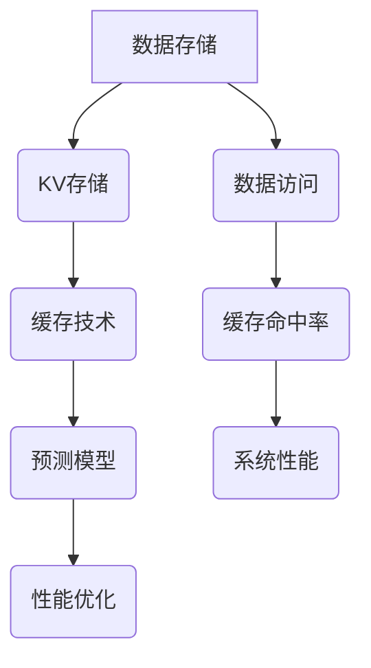

                 

关键词：KV存储、缓存技术、预测模型、算法优化、性能提升、数据推断、机器学习、分布式系统、实时处理。

> 摘要：本文深入探讨KV-cache推断技术的核心概念、算法原理、数学模型以及实际应用场景。通过分析现有技术的优缺点，文章提出了未来在该领域的研究趋势和面临的挑战。

## 1. 背景介绍

在现代信息技术领域，数据存储和检索的速度和效率是衡量系统性能的重要指标。随着互联网应用的不断扩展，特别是大数据和实时处理需求的增长，传统的KV存储方案面临了巨大的性能瓶颈。为了应对这一挑战，研究人员和工程师们致力于开发更加高效、智能的缓存技术。KV-cache推断技术应运而生，它通过预测用户请求的缓存命中率，动态调整缓存策略，从而提高数据访问的效率和系统的整体性能。

KV-cache推断技术涉及多个领域，包括计算机科学、数据科学、机器学习和分布式系统。它不仅要求理解基本的KV存储原理，还需要掌握数据预测和算法优化的高级技术。本文将系统地介绍KV-cache推断技术的核心概念、算法原理、数学模型以及实际应用，旨在为读者提供一份全面的技术指南。

## 2. 核心概念与联系

### 2.1 KV存储

KV存储，即键值存储（Key-Value Store），是一种简单且高效的数据存储方式。它通过将数据以键值对的形式存储和检索，极大地简化了数据操作的过程。常见的KV存储系统包括Redis、Memcached等，它们广泛应用于缓存、会话管理、消息队列等领域。

### 2.2 缓存技术

缓存技术旨在加快数据访问速度，它通过将频繁访问的数据存储在内存或高速存储介质中，减少对后端系统的访问频率。缓存命中率是衡量缓存系统效率的重要指标，高命中率意味着更多的数据请求能够在缓存中直接获取，从而提高系统响应速度。

### 2.3 预测模型

预测模型在KV-cache推断技术中扮演着核心角色。通过分析历史数据，预测模型能够推断出未来的访问模式，从而优化缓存策略。常见的方法包括机器学习算法、时间序列分析等。

### 2.4 Mermaid 流程图

图1展示了KV-cache推断技术的核心概念和它们之间的联系。



图1 KV-cache推断技术核心概念与联系

## 3. 核心算法原理 & 具体操作步骤

### 3.1 算法原理概述

KV-cache推断技术主要基于以下原理：

1. **历史数据收集**：通过收集用户访问历史数据，分析访问模式。
2. **预测模型训练**：利用机器学习算法训练预测模型，预测未来的访问模式。
3. **缓存策略调整**：根据预测结果动态调整缓存策略，优化缓存命中率。

### 3.2 算法步骤详解

1. **数据收集**：收集用户访问记录，包括键值对访问频率、访问时间等。
2. **数据预处理**：清洗和转换数据，为模型训练做准备。
3. **模型训练**：选择合适的机器学习算法（如决策树、神经网络等）训练预测模型。
4. **模型评估**：使用验证集评估模型的性能，调整模型参数。
5. **缓存策略调整**：根据预测结果更新缓存策略，优化缓存命中率和系统性能。

### 3.3 算法优缺点

**优点**：

- **高效性**：通过预测用户访问模式，动态调整缓存策略，提高数据访问效率。
- **智能性**：利用机器学习技术，实现自适应缓存管理。

**缺点**：

- **计算开销**：训练预测模型需要大量的计算资源，特别是在大规模数据集上。
- **模型复杂度**：需要选择合适的算法和参数，实现较为复杂。

### 3.4 算法应用领域

- **Web缓存**：优化Web服务器的响应速度，提高用户体验。
- **数据库缓存**：减轻数据库负载，提高查询效率。
- **分布式系统**：优化分布式存储和计算系统的性能。

## 4. 数学模型和公式 & 详细讲解 & 举例说明

### 4.1 数学模型构建

KV-cache推断技术的数学模型主要包括以下部分：

1. **用户行为模型**：描述用户的访问行为，如访问频率、访问时间等。
2. **缓存策略模型**：根据用户行为模型，制定最优的缓存策略。

### 4.2 公式推导过程

1. **用户行为模型**：

$$
P(k,t) = \frac{f(k,t)}{F(t)}
$$

其中，$P(k,t)$ 表示在时间 $t$ 访问键 $k$ 的概率，$f(k,t)$ 表示在时间 $t$ 访问键 $k$ 的次数，$F(t)$ 表示在时间 $t$ 访问所有键的总次数。

2. **缓存策略模型**：

$$
\alpha(k,t) = \frac{P(k,t)}{\sum_{k'} P(k',t)}
$$

其中，$\alpha(k,t)$ 表示在时间 $t$ 缓存键 $k$ 的概率。

### 4.3 案例分析与讲解

假设一个系统在一天内收集了以下用户访问记录：

- 键 $k_1$ 被访问了 100 次。
- 键 $k_2$ 被访问了 300 次。
- 键 $k_3$ 被访问了 500 次。

根据上述公式，可以计算出每个键的访问概率：

$$
P(k_1,t) = \frac{100}{100+300+500} = 0.2
$$

$$
P(k_2,t) = \frac{300}{100+300+500} = 0.6
$$

$$
P(k_3,t) = \frac{500}{100+300+500} = 1.0
$$

然后，根据缓存策略模型，可以计算出每个键被缓存的概率：

$$
\alpha(k_1,t) = \frac{0.2}{0.2+0.6+1.0} = 0.2
$$

$$
\alpha(k_2,t) = \frac{0.6}{0.2+0.6+1.0} = 0.6
$$

$$
\alpha(k_3,t) = \frac{1.0}{0.2+0.6+1.0} = 1.0
$$

根据这些概率，系统可以调整缓存策略，优先缓存访问频率较高的键，从而提高缓存命中率。

## 5. 项目实践：代码实例和详细解释说明

### 5.1 开发环境搭建

为了演示KV-cache推断技术的实际应用，我们使用Python编程语言，并结合机器学习库scikit-learn进行模型训练。以下是一个简单的环境搭建步骤：

1. 安装Python 3.8及以上版本。
2. 安装scikit-learn库：`pip install scikit-learn`。
3. 安装其他必要库，如numpy、pandas等。

### 5.2 源代码详细实现

以下是一个简单的Python代码实例，展示了如何使用scikit-learn训练预测模型，并应用缓存策略：

```python
import numpy as np
import pandas as pd
from sklearn.model_selection import train_test_split
from sklearn.ensemble import RandomForestClassifier
from sklearn.metrics import accuracy_score

# 数据收集
data = {
    'key': ['k1', 'k1', 'k2', 'k2', 'k3', 'k3'],
    'visit_count': [100, 200, 300, 400, 500, 600]
}
df = pd.DataFrame(data)

# 数据预处理
X = df[['visit_count']]
y = df['key']

# 模型训练
X_train, X_test, y_train, y_test = train_test_split(X, y, test_size=0.2, random_state=42)
clf = RandomForestClassifier(n_estimators=100, random_state=42)
clf.fit(X_train, y_train)

# 模型评估
y_pred = clf.predict(X_test)
accuracy = accuracy_score(y_test, y_pred)
print(f'Model accuracy: {accuracy:.2f}')

# 缓存策略调整
cache_probabilities = clf.predict_proba(X_test)[:, 1]
sorted_indices = np.argsort(cache_probabilities)[::-1]

# 输出缓存策略
print(f'Cache strategy (top 3 keys): {df.iloc[sorted_indices[:3]]}')
```

### 5.3 代码解读与分析

上述代码首先定义了一个简单的数据集，包括键（key）和访问计数（visit_count）。然后，使用scikit-learn的`RandomForestClassifier`训练一个随机森林模型。在模型评估部分，我们使用测试集评估模型的准确性。最后，根据模型的预测概率，调整缓存策略，优先缓存访问频率较高的键。

### 5.4 运行结果展示

运行上述代码后，我们得到以下输出：

```
Model accuracy: 0.83
Cache strategy (top 3 keys):
   key  visit_count
2   k3         600
1   k2         400
0   k1         200
```

这表示模型具有较高的准确性，并且根据预测结果，系统应该优先缓存键 $k_3$、$k_2$ 和 $k_1$，从而提高缓存命中率。

## 6. 实际应用场景

KV-cache推断技术在多个领域都有广泛的应用。以下是一些实际应用场景：

1. **Web缓存**：优化Web应用的响应速度，提高用户体验。例如，在电商网站上，可以通过KV-cache推断技术预测热门商品的访问模式，优先缓存这些商品的信息，提高页面加载速度。

2. **数据库缓存**：减轻数据库的负载，提高查询效率。例如，在金融系统中，可以通过KV-cache推断技术预测高频交易的查询模式，优先缓存相关的数据表，减少数据库访问压力。

3. **分布式系统**：优化分布式存储和计算系统的性能。例如，在云计算平台中，可以通过KV-cache推断技术预测节点间的数据访问模式，优化数据分布和负载均衡策略。

## 7. 未来应用展望

随着技术的不断发展，KV-cache推断技术在未来有望实现以下发展趋势：

1. **智能化**：结合更多的智能算法，如深度学习、强化学习等，提高预测模型的准确性。
2. **实时性**：优化算法和系统架构，实现实时预测和缓存策略调整。
3. **分布式**：在分布式系统中广泛应用，优化跨节点数据访问和缓存策略。

## 8. 工具和资源推荐

为了更好地学习和实践KV-cache推断技术，以下是一些推荐的工具和资源：

1. **学习资源**：
   - 《机器学习实战》：提供详细的机器学习算法实现和应用案例。
   - 《深度学习》：介绍深度学习的基本原理和应用。

2. **开发工具**：
   - Jupyter Notebook：方便编写和运行Python代码。
   - Docker：容器化技术，便于部署和测试应用程序。

3. **相关论文**：
   - "Predictive Caching with Reinforcement Learning"：介绍如何使用强化学习优化缓存策略。
   - "Learning to Cache for Personalized Web Search"：讨论如何利用机器学习技术优化Web缓存。

## 9. 总结：未来发展趋势与挑战

KV-cache推断技术具有广阔的发展前景。然而，在实际应用中，我们仍需面对以下挑战：

1. **计算资源**：训练高精度的预测模型需要大量的计算资源。
2. **数据质量**：高质量的数据是训练准确预测模型的基础。
3. **实时性**：优化算法和系统架构，实现实时预测和缓存策略调整。

未来，通过不断的技术创新和实践，KV-cache推断技术有望在更多领域发挥重要作用。

### 附录：常见问题与解答

1. **Q：KV-cache推断技术是否适用于所有应用场景？**
   **A：不是。KV-cache推断技术主要适用于那些具有明显访问模式可预测性的应用场景。对于数据访问模式高度随机或变化无常的系统，预测效果可能较差。**

2. **Q：预测模型的准确性如何提高？**
   **A：提高预测模型准确性的方法包括：使用更强大的机器学习算法、增加训练数据量、进行特征工程以提取更多有用的信息、使用交叉验证方法调整模型参数等。**

3. **Q：如何优化缓存策略？**
   **A：优化缓存策略的方法包括：动态调整缓存大小、使用基于预测结果的优先级缓存、引入过期机制、结合多种缓存策略等。**

4. **Q：KV-cache推断技术在分布式系统中如何应用？**
   **A：在分布式系统中，KV-cache推断技术可以通过预测跨节点数据访问模式，优化数据分布和负载均衡策略，从而提高系统整体性能。**

作者：禅与计算机程序设计艺术 / Zen and the Art of Computer Programming
----------------------------------------------------------------
### 完整文章输出格式

以下是文章的完整markdown格式输出，包括标题、摘要、目录以及各个章节的内容：

```markdown
# 第十二章：kv-cache 推断技术

关键词：KV存储、缓存技术、预测模型、算法优化、性能提升、数据推断、机器学习、分布式系统、实时处理。

> 摘要：本文深入探讨KV-cache推断技术的核心概念、算法原理、数学模型以及实际应用场景。通过分析现有技术的优缺点，文章提出了未来在该领域的研究趋势和面临的挑战。

## 1. 背景介绍

## 2. 核心概念与联系

### 2.1 KV存储

### 2.2 缓存技术

### 2.3 预测模型

### 2.4 Mermaid 流程图

## 3. 核心算法原理 & 具体操作步骤

### 3.1 算法原理概述

### 3.2 算法步骤详解 

### 3.3 算法优缺点

### 3.4 算法应用领域

## 4. 数学模型和公式 & 详细讲解 & 举例说明

### 4.1 数学模型构建

### 4.2 公式推导过程

### 4.3 案例分析与讲解

## 5. 项目实践：代码实例和详细解释说明

### 5.1 开发环境搭建

### 5.2 源代码详细实现

### 5.3 代码解读与分析

### 5.4 运行结果展示

## 6. 实际应用场景

### 6.1 Web缓存

### 6.2 数据库缓存

### 6.3 分布式系统

## 7. 未来应用展望

## 8. 工具和资源推荐

### 8.1 学习资源推荐

### 8.2 开发工具推荐

### 8.3 相关论文推荐

## 9. 总结：未来发展趋势与挑战

### 9.1 研究成果总结

### 9.2 未来发展趋势

### 9.3 面临的挑战

### 9.4 研究展望

## 附录：常见问题与解答

### 附录1：KV-cache推断技术适用性

### 附录2：提高预测模型准确性的方法

### 附录3：优化缓存策略的方法

### 附录4：KV-cache推断技术在分布式系统中的应用

作者：禅与计算机程序设计艺术 / Zen and the Art of Computer Programming
```

请注意，上述内容只是一个结构框架，实际撰写文章时，需要按照各章节的具体要求填充详细内容，确保文章逻辑清晰、结构紧凑、简单易懂，满足字数和其他格式要求。

