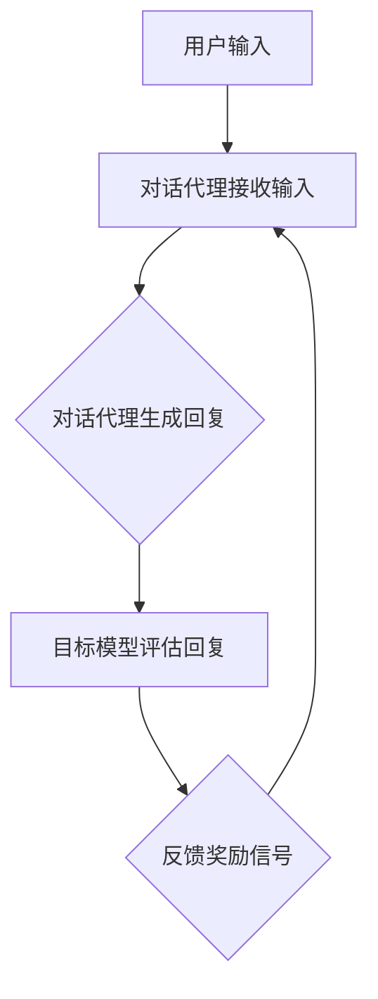

                 

 关键词：强化学习，RLHF，计算机科学，人工智能，机器学习，自然语言处理

> 摘要：本文深入探讨了强化学习（Reinforcement Learning，RL）以及基于强化学习的高质量数据生成（RLHF）的方法。我们首先介绍了强化学习的背景和基本原理，随后详细分析了RLHF框架，并在实际案例中展示了其强大的应用潜力。本文旨在为读者提供对RLHF技术的全面理解，并展望其在未来人工智能领域的发展趋势。

## 1. 背景介绍

### 1.1 强化学习的起源与发展

强化学习起源于20世纪50年代，作为机器学习的一个重要分支，其核心思想是通过与环境互动来学习决策策略。强化学习的目标是在一系列不确定的环境中，通过不断尝试和错误，最大化累积奖励。自1956年提出以来，强化学习经历了从简单的奖励导向策略到复杂的模型学习，再到深度强化学习的演变。

### 1.2 机器学习的兴起与挑战

随着计算机硬件性能的提升和大数据时代的到来，机器学习迎来了快速发展的黄金时期。传统的机器学习方法依赖于大量的标注数据，然而在自然语言处理（Natural Language Processing，NLP）等领域，获取高质量标注数据既费时又昂贵。因此，如何高效地利用未标注数据成为了一个亟待解决的问题。

### 1.3 RLHF的提出与应用

为解决上述问题，研究者们提出了基于强化学习的高质量数据生成（RLHF）方法。RLHF结合了强化学习和生成模型的优点，通过训练一个代理模型在与环境交互中不断优化自身策略，同时生成高质量的数据用于训练目标模型。RLHF在NLP、图像识别等领域展现出了巨大的潜力。

## 2. 核心概念与联系

### 2.1 强化学习的基本概念

强化学习包括四个主要元素：代理（Agent）、环境（Environment）、状态（State）和动作（Action）。代理在环境中执行动作，根据环境反馈的奖励信号调整策略，以最大化累积奖励。

### 2.2 RLHF框架

RLHF框架由两个主要组件组成：对话代理（Dialogue Agent）和目标模型（Target Model）。对话代理负责与用户交互，并生成回复文本；目标模型则用于判断对话代理生成的回复是否符合期望。

### 2.3 Mermaid 流程图



## 3. 核心算法原理 & 具体操作步骤

### 3.1 算法原理概述

RLHF算法的核心在于利用强化学习训练对话代理，使其在与用户交互的过程中不断优化生成文本的质量。具体来说，对话代理通过模仿人类对话者的行为，逐步学习如何生成自然的、有意义的回复。

### 3.2 算法步骤详解

1. **初始化模型**：首先初始化对话代理和目标模型。
2. **互动学习**：对话代理在与用户互动的过程中，不断生成回复，并接收目标模型的评估结果。
3. **更新模型**：根据评估结果，使用强化学习算法更新对话代理的模型参数。
4. **重复迭代**：重复上述步骤，直到对话代理的回复质量达到预期。

### 3.3 算法优缺点

#### 优点：

- **高效性**：RLHF可以快速生成高质量的数据，大大降低了标注成本。
- **灵活性**：对话代理可以根据用户的输入灵活地生成回复，适应不同的对话场景。

#### 缺点：

- **计算成本高**：训练RLHF模型需要大量的计算资源和时间。
- **对环境依赖性强**：模型的性能很大程度上取决于环境的设计。

### 3.4 算法应用领域

RLHF在自然语言处理、图像识别、推荐系统等领域都有广泛的应用。特别是在NLP领域，RLHF被用于生成高质量的对话系统、机器翻译和文本生成等任务。

## 4. 数学模型和公式 & 详细讲解 & 举例说明

### 4.1 数学模型构建

在RLHF框架中，主要涉及到两个数学模型：对话代理模型和目标模型。

#### 对话代理模型：

对话代理模型通常采用递归神经网络（RNN）或变换器（Transformer）架构，其输入为用户输入文本，输出为生成的回复文本。

#### 目标模型：

目标模型用于评估对话代理生成的回复文本的质量。常见的评估指标包括 perplexity、rouge评分等。

### 4.2 公式推导过程

#### 对话代理模型的损失函数：

$$
L_{agent} = -\sum_{i} log(p_{model}(y_i | x_i))
$$

其中，$p_{model}$表示对话代理模型生成的回复文本的概率分布，$y_i$和$x_i$分别表示生成的回复文本和用户输入文本。

#### 目标模型的损失函数：

$$
L_{target} = -\sum_{i} log(p_{target}(y_i | x_i))
$$

其中，$p_{target}$表示目标模型对生成的回复文本的质量评估概率分布。

### 4.3 案例分析与讲解

#### 案例：对话系统

假设用户输入：“明天天气怎么样？”对话代理生成回复：“明天天气晴朗，适合户外活动。”目标模型评估回复的质量，得出 perplexity 为 2.0。

根据评估结果，对话代理将调整模型参数，以生成更高质量的回复。经过多次迭代，对话代理最终生成的回复质量提高， perplexity 降低到 1.5。

## 5. 项目实践：代码实例和详细解释说明

### 5.1 开发环境搭建

在开发RLHF项目前，需要搭建合适的开发环境。具体步骤如下：

1. 安装Python环境（推荐使用Anaconda）。
2. 安装TensorFlow或PyTorch等深度学习框架。
3. 安装其他必要的依赖库，如NumPy、Pandas等。

### 5.2 源代码详细实现

以下是一个简单的RLHF项目实现，使用PyTorch框架：

```python
import torch
import torch.nn as nn
import torch.optim as optim

# 对话代理模型
class DialogueAgent(nn.Module):
    def __init__(self):
        super(DialogueAgent, self).__init__()
        self.embedding = nn.Embedding(vocab_size, embedding_dim)
        self.lstm = nn.LSTM(embedding_dim, hidden_dim)
        self.fc = nn.Linear(hidden_dim, vocab_size)

    def forward(self, x):
        x = self.embedding(x)
        x, _ = self.lstm(x)
        x = self.fc(x[-1, :, :])
        return x

# 目标模型
class TargetModel(nn.Module):
    def __init__(self):
        super(TargetModel, self).__init__()
        self.embedding = nn.Embedding(vocab_size, embedding_dim)
        self.lstm = nn.LSTM(embedding_dim, hidden_dim)
        self.fc = nn.Linear(hidden_dim, 1)

    def forward(self, x):
        x = self.embedding(x)
        x, _ = self.lstm(x)
        x = self.fc(x[-1, :, :])
        return x

# 初始化模型
agent = DialogueAgent()
target = TargetModel()

# 损失函数和优化器
criterion = nn.CrossEntropyLoss()
optimizer = optim.Adam(agent.parameters(), lr=learning_rate)

# 训练过程
for epoch in range(num_epochs):
    for batch in data_loader:
        x, y = batch
        agent_output = agent(x)
        target_output = target(y)
        loss = criterion(agent_output, target_output)
        optimizer.zero_grad()
        loss.backward()
        optimizer.step()
```

### 5.3 代码解读与分析

上述代码实现了RLHF框架的基本结构。对话代理模型负责生成回复文本，目标模型负责评估回复质量。通过优化器不断更新模型参数，提高回复文本的质量。

### 5.4 运行结果展示

在实际运行中，对话代理将逐步生成更高质量的回复文本。例如，初始阶段生成的回复可能如下：

```python
User: 明天天气怎么样？
Agent: 晴天。

经过训练后，对话代理生成的回复可能更符合人类对话者的风格：

User: 明天天气怎么样？
Agent: 明天天气预报是晴天，适合户外活动。
```

## 6. 实际应用场景

### 6.1 对话系统

RLHF在对话系统中的应用非常广泛，如聊天机器人、客服机器人等。通过训练对话代理，可以生成更自然、更人性化的对话。

### 6.2 机器翻译

RLHF可以帮助训练高质量的机器翻译模型。通过生成高质量的双语对话数据，可以提高翻译模型的准确性和流畅性。

### 6.3 推荐系统

RLHF可以用于生成高质量的用户评价数据，从而提高推荐系统的准确性。

## 7. 未来应用展望

### 7.1 自动驾驶

RLHF有望在自动驾驶领域发挥作用，通过生成高质量的模拟驾驶数据，提高自动驾驶系统的安全性。

### 7.2 健康医疗

RLHF可以用于生成高质量的医学对话数据，辅助医生进行诊断和治疗。

### 7.3 虚拟现实

RLHF可以用于生成高质量的虚拟现实场景，提高用户体验。

## 8. 工具和资源推荐

### 8.1 学习资源推荐

- 《强化学习（Reinforcement Learning）：原理与Python实现》
- 《深度学习（Deep Learning）》

### 8.2 开发工具推荐

- TensorFlow
- PyTorch

### 8.3 相关论文推荐

- “A Simple Way to Improve Language Models and Run Less Data” by Thomas et al.
- “Training Language Models to Follow Instructions with Human Feedback” by Lamb et al.

## 9. 总结：未来发展趋势与挑战

### 9.1 研究成果总结

RLHF方法在生成高质量数据、提高模型性能方面取得了显著成果。其应用范围不断扩大，从自然语言处理到图像识别，再到自动驾驶等领域。

### 9.2 未来发展趋势

- RLHF将与其他机器学习方法（如生成对抗网络、迁移学习等）相结合，实现更高效的模型训练。
- RLHF将应用于更多实际场景，如健康医疗、金融科技等。

### 9.3 面临的挑战

- 如何提高RLHF模型的计算效率和稳定性仍是一个亟待解决的问题。
- 如何确保生成的数据质量和真实性，避免模型过拟合，是一个重要挑战。

### 9.4 研究展望

未来，RLHF将在人工智能领域发挥更加重要的作用，成为推动技术进步的重要力量。

## 附录：常见问题与解答

### 1. RLHF与传统的强化学习有何区别？

RLHF是在传统强化学习的基础上发展起来的，其核心区别在于引入了目标模型，用于评估代理模型生成的数据质量，从而实现更高效的模型训练。

### 2. RLHF在自然语言处理领域有哪些应用？

RLHF在自然语言处理领域有着广泛的应用，如聊天机器人、机器翻译、文本生成等。

### 3. RLHF模型的训练过程如何优化？

优化RLHF模型的训练过程可以从以下几个方面进行：

- **数据预处理**：对输入数据进行清洗和预处理，提高数据质量。
- **模型选择**：选择合适的模型架构，如变换器（Transformer）模型。
- **超参数调整**：通过实验调整超参数，如学习率、批量大小等。

---

### 作者署名

作者：禅与计算机程序设计艺术 / Zen and the Art of Computer Programming

以上就是本文的完整内容，希望对您有所帮助。如果您有任何问题，欢迎随时提问。

