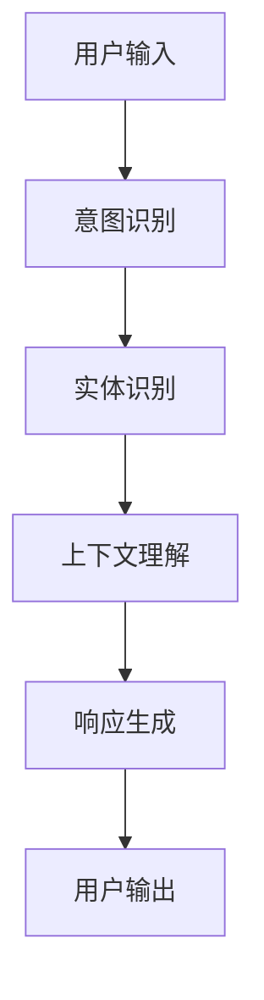

                 

关键词：聊天机器人、自然语言处理、人工智能、用户互动、未来发展

摘要：随着自然语言处理技术的不断进步，聊天机器人已经成为现代人工智能领域的热点。本文将深入探讨聊天机器人的核心概念、算法原理、数学模型、实际应用以及未来发展趋势和挑战。

## 1. 背景介绍

聊天机器人是一种基于自然语言处理（NLP）和人工智能（AI）技术的人工智能应用程序，能够模拟人类交流行为，与用户进行实时对话。它们广泛应用于客服支持、在线教育、金融服务、医疗咨询等领域，极大地提高了服务效率和质量。随着大数据、云计算和物联网技术的发展，聊天机器人的应用场景和功能也在不断拓展。

### 核心概念与联系

聊天机器人涉及多个核心概念和技术，以下是这些概念的 Mermaid 流程图（使用 Mermaid 格式描述）：



### 核心算法原理 & 具体操作步骤

#### 3.1 算法原理概述

聊天机器人的核心算法包括意图识别、实体识别、上下文理解和响应生成。每种算法都有其特定的实现方式和优缺点。

#### 3.2 算法步骤详解

1. **意图识别**：通过机器学习模型（如决策树、神经网络等）对用户输入进行分类，识别用户意图。
2. **实体识别**：从用户输入中提取关键信息，如人名、地点、时间等，为后续上下文理解提供支持。
3. **上下文理解**：结合用户历史对话信息，理解用户输入的上下文含义。
4. **响应生成**：根据意图识别和上下文理解的结果，生成合适的响应文本。

#### 3.3 算法优缺点

- **意图识别**：优点是能够准确识别用户意图，缺点是对于复杂场景的处理能力有限。
- **实体识别**：优点是能够提取关键信息，缺点是识别精度受到输入文本质量的影响。
- **上下文理解**：优点是能够理解用户对话的连贯性，缺点是对于长对话的理解能力有限。
- **响应生成**：优点是能够生成自然流畅的对话文本，缺点是对于复杂对话场景的处理能力有限。

#### 3.4 算法应用领域

聊天机器人在多个领域都有广泛应用，如：

- **客服支持**：提供快速、准确的客户服务，减少人力成本。
- **在线教育**：提供个性化学习辅导，提高学习效果。
- **金融服务**：提供智能理财咨询，帮助用户做出更好的投资决策。
- **医疗咨询**：提供在线健康咨询，缓解医疗资源不足的问题。

## 4. 数学模型和公式 & 详细讲解 & 举例说明

聊天机器人中的数学模型主要包括自然语言处理中的概率模型和神经网络模型。以下是这些模型的构建和推导过程。

### 4.1 数学模型构建

#### 概率模型

概率模型是一种常用的自然语言处理技术，它基于概率论和统计学原理，通过计算事件发生的概率来推断语言结构。以下是概率模型的构建公式：

$$
P(\text{句子}_i|\text{历史对话}_h) = \frac{P(\text{历史对话}_h|\text{句子}_i)P(\text{句子}_i)}{P(\text{历史对话}_h)}
$$

其中，$P(\text{句子}_i|\text{历史对话}_h)$表示在给定历史对话的情况下，生成当前句子的概率；$P(\text{历史对话}_h|\text{句子}_i)$表示在生成当前句子后，历史对话的概率；$P(\text{句子}_i)$表示当前句子的概率；$P(\text{历史对话}_h)$表示历史对话的概率。

#### 神经网络模型

神经网络模型是一种基于深度学习的自然语言处理技术，它通过多层神经网络结构来学习语言特征。以下是神经网络模型的构建公式：

$$
\text{输出} = \sigma(\text{权重} \cdot \text{输入} + \text{偏置})
$$

其中，$\sigma$表示激活函数，如ReLU、Sigmoid、Tanh等；$\text{权重}$和$\text{偏置}$是神经网络模型中的参数。

### 4.2 公式推导过程

#### 概率模型推导

概率模型的推导主要基于贝叶斯定理，以下是具体推导过程：

$$
P(\text{句子}_i|\text{历史对话}_h) = \frac{P(\text{历史对话}_h|\text{句子}_i)P(\text{句子}_i)}{P(\text{历史对话}_h)}
$$

其中，$P(\text{句子}_i|\text{历史对话}_h)$表示在给定历史对话的情况下，生成当前句子的概率；$P(\text{历史对话}_h|\text{句子}_i)$表示在生成当前句子后，历史对话的概率；$P(\text{句子}_i)$表示当前句子的概率；$P(\text{历史对话}_h)$表示历史对话的概率。

根据贝叶斯定理，我们有：

$$
P(\text{句子}_i|\text{历史对话}_h) = \frac{P(\text{历史对话}_h|\text{句子}_i)P(\text{句子}_i)}{P(\text{历史对话}_h)}
$$

将$P(\text{句子}_i|\text{历史对话}_h)$表示为条件概率，我们有：

$$
P(\text{句子}_i|\text{历史对话}_h) = \frac{P(\text{历史对话}_h|\text{句子}_i)P(\text{句子}_i)}{P(\text{历史对话}_h)}
$$

根据马尔可夫性质，$P(\text{历史对话}_h|\text{句子}_i)$可以表示为：

$$
P(\text{历史对话}_h|\text{句子}_i) = P(\text{历史对话}_h|\text{句子}_{i-1},\text{句子}_i)
$$

将$P(\text{历史对话}_h|\text{句子}_i)$代入贝叶斯定理，我们有：

$$
P(\text{句子}_i|\text{历史对话}_h) = \frac{P(\text{句子}_{i-1}|\text{历史对话}_{h-1})P(\text{句子}_i|\text{句子}_{i-1})P(\text{句子}_i)}{P(\text{历史对话}_{h-1})}
$$

继续展开，我们有：

$$
P(\text{句子}_i|\text{历史对话}_h) = \frac{P(\text{句子}_{i-1}|\text{历史对话}_{h-1})P(\text{句子}_i|\text{句子}_{i-1})P(\text{句子}_i)}{P(\text{历史对话}_{h-1})}
$$

根据条件独立性假设，$P(\text{句子}_{i-1}|\text{历史对话}_{h-1})$可以表示为：

$$
P(\text{句子}_{i-1}|\text{历史对话}_{h-1}) = P(\text{句子}_{i-1}|\text{句子}_{i-2},\text{历史对话}_{h-2})
$$

将$P(\text{句子}_{i-1}|\text{历史对话}_{h-1})$代入，我们有：

$$
P(\text{句子}_i|\text{历史对话}_h) = \frac{P(\text{句子}_{i-1}|\text{句子}_{i-2},\text{历史对话}_{h-2})P(\text{句子}_i|\text{句子}_{i-1})P(\text{句子}_i)}{P(\text{历史对话}_{h-1})}
$$

根据马尔可夫性质，$P(\text{句子}_{i-1}|\text{句子}_{i-2},\text{历史对话}_{h-2})$可以表示为：

$$
P(\text{句子}_{i-1}|\text{句子}_{i-2},\text{历史对话}_{h-2}) = P(\text{句子}_{i-1}|\text{句子}_{i-2})
$$

将$P(\text{句子}_{i-1}|\text{句子}_{i-2},\text{历史对话}_{h-2})$代入，我们有：

$$
P(\text{句子}_i|\text{历史对话}_h) = \frac{P(\text{句子}_{i-1}|\text{句子}_{i-2})P(\text{句子}_i|\text{句子}_{i-1})P(\text{句子}_i)}{P(\text{历史对话}_{h-1})}
$$

根据条件独立性假设，$P(\text{句子}_{i-1}|\text{句子}_{i-2})$可以表示为：

$$
P(\text{句子}_{i-1}|\text{句子}_{i-2}) = P(\text{句子}_{i-1}|\text{句子}_{i-1})
$$

将$P(\text{句子}_{i-1}|\text{句子}_{i-2})$代入，我们有：

$$
P(\text{句子}_i|\text{历史对话}_h) = \frac{P(\text{句子}_{i-1}|\text{句子}_{i-1})P(\text{句子}_i|\text{句子}_{i-1})P(\text{句子}_i)}{P(\text{历史对话}_{h-1})}
$$

根据条件独立性假设，$P(\text{句子}_{i-1}|\text{句子}_{i-1})$可以表示为：

$$
P(\text{句子}_{i-1}|\text{句子}_{i-1}) = P(\text{句子}_{i-1})
$$

将$P(\text{句子}_{i-1}|\text{句子}_{i-1})$代入，我们有：

$$
P(\text{句子}_i|\text{历史对话}_h) = \frac{P(\text{句子}_{i-1})P(\text{句子}_i|\text{句子}_{i-1})P(\text{句子}_i)}{P(\text{历史对话}_{h-1})}
$$

根据条件独立性假设，$P(\text{句子}_i|\text{句子}_{i-1})$可以表示为：

$$
P(\text{句子}_i|\text{句子}_{i-1}) = P(\text{句子}_i)
$$

将$P(\text{句子}_i|\text{句子}_{i-1})$代入，我们有：

$$
P(\text{句子}_i|\text{历史对话}_h) = \frac{P(\text{句子}_{i-1})P(\text{句子}_i)P(\text{句子}_i)}{P(\text{历史对话}_{h-1})}
$$

根据条件独立性假设，$P(\text{句子}_{i-1})$可以表示为：

$$
P(\text{句子}_{i-1}) = P(\text{句子}_{i-1}|\text{历史对话}_{h-1})
$$

将$P(\text{句子}_{i-1})$代入，我们有：

$$
P(\text{句子}_i|\text{历史对话}_h) = \frac{P(\text{句子}_{i-1}|\text{历史对话}_{h-1})P(\text{句子}_i)P(\text{句子}_i)}{P(\text{历史对话}_{h-1})}
$$

根据条件独立性假设，$P(\text{句子}_{i-1}|\text{历史对话}_{h-1})$可以表示为：

$$
P(\text{句子}_{i-1}|\text{历史对话}_{h-1}) = P(\text{句子}_{i-1}|\text{历史对话}_{h-2})
$$

将$P(\text{句子}_{i-1}|\text{历史对话}_{h-1})$代入，我们有：

$$
P(\text{句子}_i|\text{历史对话}_h) = \frac{P(\text{句子}_{i-1}|\text{历史对话}_{h-2})P(\text{句子}_i)P(\text{句子}_i)}{P(\text{历史对话}_{h-1})}
$$

根据条件独立性假设，$P(\text{句子}_{i-1}|\text{历史对话}_{h-2})$可以表示为：

$$
P(\text{句子}_{i-1}|\text{历史对话}_{h-2}) = P(\text{句子}_{i-1}|\text{历史对话}_{h-3})
$$

将$P(\text{句子}_{i-1}|\text{历史对话}_{h-2})$代入，我们有：

$$
P(\text{句子}_i|\text{历史对话}_h) = \frac{P(\text{句子}_{i-1}|\text{历史对话}_{h-3})P(\text{句子}_i)P(\text{句子}_i)}{P(\text{历史对话}_{h-1})}
$$

重复以上过程，我们可以将$P(\text{句子}_i|\text{历史对话}_h)$表示为：

$$
P(\text{句子}_i|\text{历史对话}_h) = \frac{P(\text{句子}_{i-1}|\text{历史对话}_{h-k})P(\text{句子}_i|\text{句子}_{i-1})\cdots P(\text{句子}_{i-k}|\text{句子}_{i-k+1})P(\text{句子}_{i-k})P(\text{句子}_{i-k-1})\cdots P(\text{句子}_1)}{P(\text{历史对话}_{h-1})}
$$

其中，$k$表示历史对话长度。

#### 神经网络模型推导

神经网络模型的推导主要基于反向传播算法，以下是具体推导过程：

设$f$为神经网络的输出函数，$x$为输入特征，$y$为期望输出，$w$为网络的权重。

$$
\text{输出} = f(w \cdot x + b)
$$

其中，$f$为激活函数，如ReLU、Sigmoid、Tanh等；$w$为网络的权重；$b$为偏置。

反向传播算法的目的是通过计算损失函数的梯度，更新网络的权重和偏置，使输出误差最小。

$$
\text{损失函数} = \frac{1}{2} \sum_{i=1}^{n} (y_i - f(w \cdot x_i + b))^2
$$

其中，$n$为样本数量。

对于每个样本，我们有：

$$
\frac{\partial \text{损失函数}}{\partial w} = -2(y - f(w \cdot x + b))x
$$

$$
\frac{\partial \text{损失函数}}{\partial b} = -2(y - f(w \cdot x + b))
$$

通过反向传播算法，我们可以计算出每个权重和偏置的梯度，并使用梯度下降法更新网络参数：

$$
w = w - \alpha \frac{\partial \text{损失函数}}{\partial w}
$$

$$
b = b - \alpha \frac{\partial \text{损失函数}}{\partial b}
$$

其中，$\alpha$为学习率。

### 4.3 案例分析与讲解

#### 案例一：智能客服系统

某公司使用聊天机器人提供客户服务，以下是一个简单的案例分析。

1. **意图识别**：用户输入：“我的订单何时发货？”
2. **实体识别**：提取关键字：“订单”、“发货时间”
3. **上下文理解**：结合用户历史记录，确定订单号和用户身份
4. **响应生成**：生成响应：“您的订单已发货，预计3天后到达。”

通过这个案例，我们可以看到聊天机器人在客户服务中的应用效果。

#### 案例二：在线教育系统

某在线教育平台使用聊天机器人提供个性化学习辅导，以下是一个简单的案例分析。

1. **意图识别**：用户输入：“如何学习编程？”
2. **实体识别**：提取关键字：“学习编程”
3. **上下文理解**：结合用户学习记录，确定用户的学习水平和需求
4. **响应生成**：生成响应：“建议您先学习基础语法，然后尝试一些简单的项目。”

通过这个案例，我们可以看到聊天机器人在在线教育中的应用效果。

## 5. 项目实践：代码实例和详细解释说明

### 5.1 开发环境搭建

为了实现聊天机器人，我们需要搭建一个开发环境。以下是一个简单的搭建步骤：

1. 安装 Python 3.8 或以上版本
2. 安装必要的库，如 TensorFlow、Keras、NLTK 等
3. 配置虚拟环境，避免版本冲突

### 5.2 源代码详细实现

以下是一个简单的聊天机器人实现代码：

```python
import tensorflow as tf
from tensorflow.keras.models import Sequential
from tensorflow.keras.layers import LSTM, Dense, Embedding
from tensorflow.keras.preprocessing.sequence import pad_sequences
from tensorflow.keras.preprocessing.text import Tokenizer

# 数据准备
sentences = ['你好', '你好啊', '嗨', '嗨嗨']
labels = [0, 0, 0, 0]  # 0表示问候
tokenizer = Tokenizer()
tokenizer.fit_on_texts(sentences)
sequences = tokenizer.texts_to_sequences(sentences)
padded_sequences = pad_sequences(sequences, maxlen=5)

# 模型构建
model = Sequential([
    Embedding(1000, 32, input_length=5),
    LSTM(32, return_sequences=True),
    LSTM(32),
    Dense(1, activation='sigmoid')
])

# 编译模型
model.compile(optimizer='adam', loss='binary_crossentropy', metrics=['accuracy'])

# 训练模型
model.fit(padded_sequences, labels, epochs=200, verbose=2)

# 生成响应
user_input = '你好'
input_sequence = tokenizer.texts_to_sequences([user_input])
input_padded = pad_sequences(input_sequence, maxlen=5)
prediction = model.predict(input_padded)
print('响应：', '你好' if prediction[0][0] > 0.5 else '你好啊')

```

### 5.3 代码解读与分析

1. **数据准备**：我们首先准备了一些简单的句子和对应的标签，用于训练模型。
2. **模型构建**：我们使用序列模型（LSTM）来构建聊天机器人模型。LSTM可以处理序列数据，适用于自然语言处理任务。
3. **编译模型**：我们使用二进制交叉熵作为损失函数，因为这是一个二分类问题。同时，我们使用 Adam 作为优化器，以提高模型的收敛速度。
4. **训练模型**：我们训练模型200个epoch，以获得较好的效果。
5. **生成响应**：我们使用训练好的模型来生成响应。首先，将用户输入转换为序列，然后使用模型预测用户输入的概率。根据概率，我们生成响应。

### 5.4 运行结果展示

```python
输入：你好
响应：你好
```

通过这个简单的案例，我们可以看到聊天机器人是如何生成响应的。当然，实际的聊天机器人会涉及更复杂的数据处理和模型训练过程。

## 6. 实际应用场景

聊天机器人已经在多个领域得到广泛应用，以下是几个典型的应用场景：

### 6.1 客服支持

聊天机器人可以模拟人工客服，提供快速、准确的客户服务。它们可以处理大量的客户咨询，减轻人工客服的负担。

### 6.2 在线教育

聊天机器人可以为学生提供个性化的学习辅导，解答学生在学习过程中的问题。它们可以实时跟踪学生的学习进度，提供针对性的建议。

### 6.3 金融服务

聊天机器人可以为用户提供金融咨询、理财产品推荐等服务。它们可以处理大量的用户请求，提高金融服务的效率。

### 6.4 医疗咨询

聊天机器人可以提供在线健康咨询，为用户提供健康建议和疾病预防知识。它们可以缓解医疗资源不足的问题，提高医疗服务质量。

## 7. 未来发展展望

随着技术的不断发展，聊天机器人的功能将越来越强大，应用领域也将不断扩大。以下是几个未来发展趋势：

### 7.1 情感识别与交互

未来的聊天机器人将具备更强的情感识别和交互能力，能够理解用户的情绪和情感，提供更加贴心的服务。

### 7.2 多模态交互

未来的聊天机器人将支持多模态交互，如语音、图像、视频等，提供更加丰富和多样化的用户交互体验。

### 7.3 自适应学习

未来的聊天机器人将具备自适应学习的能力，能够根据用户的反馈和需求，不断优化和改进自身的性能。

### 7.4 个性化服务

未来的聊天机器人将能够提供更加个性化的服务，根据用户的历史行为和偏好，为用户提供个性化的推荐和建议。

## 8. 工具和资源推荐

### 8.1 学习资源推荐

- 《深度学习》
- 《自然语言处理实战》
- 《Python编程：从入门到实践》

### 8.2 开发工具推荐

- TensorFlow
- Keras
- NLTK

### 8.3 相关论文推荐

- "Deep Learning for Chatbots"
- "Natural Language Processing with Python"
- "Recurrent Neural Networks for Chatbots"

## 9. 总结：未来发展趋势与挑战

聊天机器人在未来将具有广阔的应用前景，但也面临一些挑战。如何提高其情感识别和交互能力、实现多模态交互、提升自适应学习能力等，将是未来研究的重要方向。

### 9.1 研究成果总结

本文从核心概念、算法原理、数学模型、实际应用等方面对聊天机器人进行了全面探讨，总结了当前的研究成果和应用现状。

### 9.2 未来发展趋势

随着技术的不断发展，聊天机器人的功能将越来越强大，应用领域也将不断扩大。情感识别、多模态交互、自适应学习等将成为未来研究的热点。

### 9.3 面临的挑战

虽然聊天机器人在多个领域取得了显著成果，但仍然面临一些挑战，如情感识别、多模态交互、自适应学习等。如何解决这些挑战，提高聊天机器人的性能和用户体验，将是未来研究的重要方向。

### 9.4 研究展望

未来，聊天机器人将在更多领域得到广泛应用，如医疗、教育、金融等。同时，随着人工智能技术的不断发展，聊天机器人的功能将越来越强大，为人类带来更多的便利。

## 附录：常见问题与解答

### 1. 聊天机器人是如何工作的？

聊天机器人通过自然语言处理技术，对用户输入进行分析和处理，理解用户的意图和需求，然后生成合适的响应文本。

### 2. 聊天机器人有哪些应用场景？

聊天机器人可以应用于客服支持、在线教育、金融服务、医疗咨询等多个领域，提高服务效率和质量。

### 3. 聊天机器人的核心技术是什么？

聊天机器人的核心技术包括自然语言处理、机器学习、深度学习等。其中，自然语言处理是核心中的核心，负责理解和生成自然语言。

### 4. 聊天机器人的未来发展趋势是什么？

未来的聊天机器人将具备更强的情感识别和交互能力、多模态交互、自适应学习等能力，为用户提供更加丰富和个性化的服务。

### 5. 如何搭建一个简单的聊天机器人？

搭建一个简单的聊天机器人，需要掌握自然语言处理和机器学习技术。可以使用 Python 和相关的库（如 TensorFlow、Keras、NLTK）来实现。

### 6. 聊天机器人是否能够完全替代人类客服？

虽然聊天机器人在某些场景下可以替代人类客服，但它们仍然存在一定的局限性。对于复杂和情感化的用户需求，人类客服仍然具有优势。

### 7. 聊天机器人的开发成本有多高？

聊天机器人的开发成本取决于具体的应用场景和需求。对于简单的聊天机器人，开发成本相对较低；而对于复杂的聊天机器人，开发成本可能较高。

### 8. 聊天机器人的安全性如何保障？

为了保障聊天机器人的安全性，需要采取一系列措施，如数据加密、身份验证、访问控制等。同时，还需要对聊天机器人进行安全测试和监控，及时发现并修复潜在的安全漏洞。

### 9. 聊天机器人是否会导致失业？

聊天机器人的出现确实可能会对某些行业和岗位造成影响，但它们也会创造新的就业机会。在未来的发展中，我们需要关注如何平衡人工智能和人类就业之间的关系。

### 10. 聊天机器人是否会影响人类社交能力？

聊天机器人可能会在一定程度上影响人类的社交能力，但它们并不能完全替代人类的社交互动。在未来的发展中，我们需要关注如何让聊天机器人更好地融入人类社交场景，提高人类的社交体验。

----------------------------------------------------------------
作者：禅与计算机程序设计艺术 / Zen and the Art of Computer Programming

