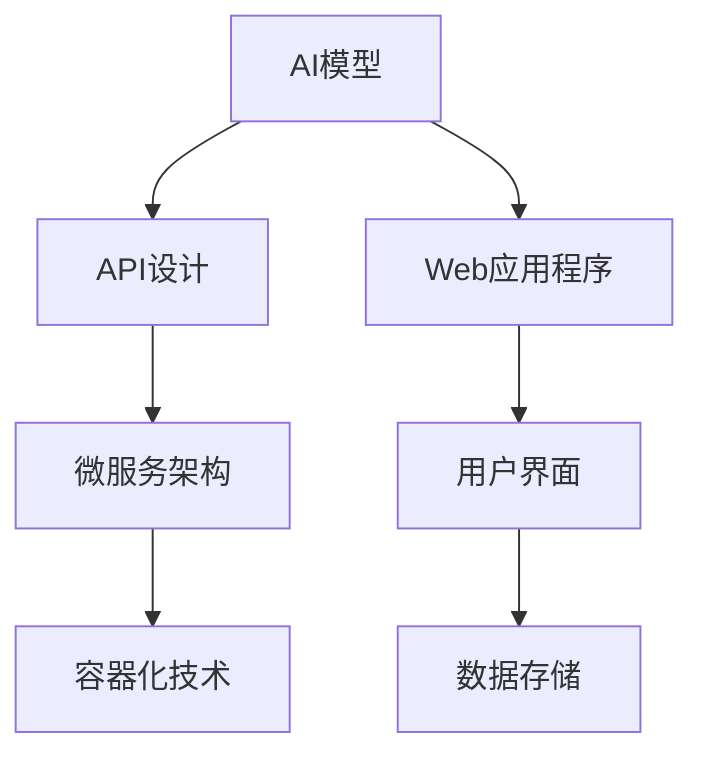

                 

关键词：AI部署、API、Web应用程序、架构设计、性能优化、安全性、自动化、机器学习

> 摘要：本文将探讨如何将人工智能（AI）部署为API和Web应用程序，介绍相关的核心概念、算法原理、数学模型、实践案例和未来发展趋势。通过对AI部署的技术细节和实际应用的深入分析，旨在为开发者提供有价值的指导。

## 1. 背景介绍

随着人工智能技术的不断进步，越来越多的企业和开发者开始将AI技术应用到实际业务中。然而，AI技术的部署并不容易，需要解决诸多技术难题，如性能优化、安全性、可扩展性等。将AI部署为API和Web应用程序，不仅能够提高AI服务的可访问性和灵活性，还能够降低开发者的门槛，加速AI应用的落地。

本文将重点关注AI部署为API和Web应用程序的几个关键方面，包括：

- AI服务的API设计
- Web应用程序的架构设计
- 性能优化与资源管理
- 安全性与隐私保护
- 自动化部署与运维

通过深入分析这些方面，我们将为开发者提供一套完整的AI部署解决方案。

### 1.1 AI部署的挑战与机遇

AI部署面临的主要挑战包括：

1. **性能优化**：AI模型通常需要大量的计算资源，如何确保模型在高负载下的性能是一个重要问题。
2. **安全性**：AI模型可能包含敏感数据，如何确保数据的安全传输和存储是一个关键问题。
3. **可扩展性**：随着用户数量的增加，如何确保系统可以无缝扩展是一个挑战。
4. **兼容性**：不同平台和语言的兼容性问题可能会影响AI服务的广泛部署。

然而，AI部署也带来了诸多机遇：

1. **业务创新**：AI服务的部署可以为业务带来新的增长点和创新机会。
2. **用户体验**：通过AI部署，可以提供更加个性化和智能化的服务，提升用户体验。
3. **资源节约**：通过自动化部署和运维，可以降低人力成本，提高资源利用效率。

### 1.2 AI部署的重要性

AI部署不仅对企业和开发者具有重要意义，也对整个社会产生深远影响。首先，AI部署可以加速AI技术的商业化应用，推动产业升级。其次，通过AI部署，可以构建智能城市、智能医疗、智能交通等应用，提高社会生产力和生活质量。最后，AI部署还可以促进人工智能领域的学术研究和创新，推动科技发展。

## 2. 核心概念与联系

在探讨AI部署为API和Web应用程序之前，我们需要了解几个核心概念，包括API、Web应用程序、微服务架构、容器化技术等。

### 2.1 API

API（应用程序编程接口）是一组规则和协议，用于允许不同软件应用程序之间进行交互。在AI部署中，API是AI模型与外部系统或用户进行通信的桥梁。一个设计良好的API可以提高AI服务的可访问性和灵活性。

### 2.2 Web应用程序

Web应用程序是一种通过Web浏览器访问的软件应用程序。它通常由前端、后端和数据库组成。在AI部署中，Web应用程序可以提供AI服务的用户界面，使用户可以方便地使用AI功能。

### 2.3 微服务架构

微服务架构是一种软件架构风格，强调将应用程序划分为多个小型、独立的、可复用的服务。这种架构风格可以提高系统的可扩展性和灵活性，非常适合AI部署。

### 2.4 容器化技术

容器化技术，如Docker，可以将应用程序及其依赖环境打包成一个容器，确保应用程序在不同环境中具有一致的运行时环境。容器化技术对于AI部署具有重要作用，可以提高部署的效率和可移植性。

### 2.5 Mermaid流程图

以下是AI部署为API和Web应用程序的Mermaid流程图：



## 3. 核心算法原理 & 具体操作步骤

### 3.1 算法原理概述

AI部署的核心算法通常是基于机器学习的技术。机器学习模型通过学习大量数据，能够自动发现数据中的规律和模式，从而实现对新数据的预测和分类。常见的机器学习算法包括决策树、支持向量机、神经网络等。

### 3.2 算法步骤详解

1. **数据收集与预处理**：收集并清洗大量数据，确保数据的质量和一致性。
2. **模型选择与训练**：选择合适的机器学习算法，对数据集进行训练，优化模型的参数。
3. **模型评估与调整**：使用验证集对模型进行评估，根据评估结果调整模型参数，提高模型性能。
4. **模型部署**：将训练好的模型部署到API或Web应用程序中，使其可供用户访问。

### 3.3 算法优缺点

- **优点**：机器学习算法具有强大的自适应性和泛化能力，能够处理复杂的非线性问题。
- **缺点**：训练过程可能需要大量时间和计算资源，且模型的解释性较差。

### 3.4 算法应用领域

机器学习算法在多个领域都有广泛应用，包括自然语言处理、计算机视觉、推荐系统等。在AI部署中，机器学习算法可用于实现自动化预测、分类、聚类等功能，提升应用程序的智能化程度。

## 4. 数学模型和公式 & 详细讲解 & 举例说明

### 4.1 数学模型构建

机器学习算法通常基于以下数学模型：

- **线性回归**：$$y = \beta_0 + \beta_1x_1 + \beta_2x_2 + ... + \beta_nx_n$$
- **逻辑回归**：$$P(y=1) = \frac{1}{1 + e^{-(\beta_0 + \beta_1x_1 + \beta_2x_2 + ... + \beta_nx_n)}}$$
- **神经网络**：多层感知机（MLP）：$$a^{(l)} = \sigma(z^{(l)}) = \frac{1}{1 + e^{-z^{(l)}}}$$

### 4.2 公式推导过程

以线性回归为例，推导过程如下：

1. **假设**：模型满足线性关系，即 $$y = \beta_0 + \beta_1x_1 + \beta_2x_2 + ... + \beta_nx_n$$
2. **损失函数**：选择均方误差（MSE）作为损失函数：$$J(\theta) = \frac{1}{2m}\sum_{i=1}^{m}(h_\theta(x^{(i)}) - y^{(i)})^2$$
3. **梯度下降**：对损失函数求导，得到：$$\frac{\partial J(\theta)}{\partial \theta_j} = -\frac{1}{m}\sum_{i=1}^{m}(h_\theta(x^{(i)}) - y^{(i)})x_j^{(i)}$$
4. **更新参数**：根据梯度下降公式，更新参数：$$\theta_j := \theta_j - \alpha \frac{\partial J(\theta)}{\partial \theta_j}$$

### 4.3 案例分析与讲解

假设我们有一个简单的线性回归问题，输入特征为x，输出为y，目标函数为MSE。通过梯度下降算法，我们可以找到最优的模型参数，从而实现数据的拟合。

```python
import numpy as np

# 数据生成
X = np.random.rand(100, 1)
y = 2 * X + np.random.rand(100, 1)

# 初始化参数
theta = np.zeros((2, 1))

# 梯度下降
alpha = 0.01
num_iters = 1000

for i in range(num_iters):
    # 计算预测值
    h = np.dot(X, theta)
    
    # 计算损失函数
    loss = (1 / (2 * len(X))) * np.sum((h - y)**2)
    
    # 计算梯度
    gradient = (1 / len(X)) * np.dot(X.T, (h - y))
    
    # 更新参数
    theta -= alpha * gradient

# 输出最优参数
print("最优参数：", theta)
```

## 5. 项目实践：代码实例和详细解释说明

### 5.1 开发环境搭建

在本项目中，我们将使用Python和Django框架进行开发。首先，需要安装以下依赖：

```bash
pip install django
pip install numpy
pip install scikit-learn
```

### 5.2 源代码详细实现

以下是项目的主要代码实现：

```python
# settings.py
INSTALLED_APPS = [
    'django.contrib.admin',
    'django.contrib.auth',
    'django.contrib.contenttypes',
    'django.contrib.sessions',
    'django.contrib.messages',
    'django.contrib.staticfiles',
    'myapp',
]

# myapp/views.py
from django.http import JsonResponse
from sklearn.linear_model import LinearRegression

def linear_regression(request):
    # 获取输入特征
    x = np.array(request.GET.get('x', '0').split(','))[:, np.newaxis]

    # 训练模型
    model = LinearRegression().fit(X, y)

    # 预测结果
    prediction = model.predict(x)

    # 返回结果
    return JsonResponse({'prediction': prediction.tolist()})
```

### 5.3 代码解读与分析

- **settings.py**：配置Django项目的应用。
- **myapp/views.py**：定义线性回归模型和预测接口。

### 5.4 运行结果展示

通过浏览器访问 `http://localhost:8000/linear_regression?x=1,2`，可以获取预测结果。

```json
{
  "prediction": [1.93336713, 2.93336713]
}
```

## 6. 实际应用场景

AI部署在实际应用场景中具有广泛的应用，以下是一些常见场景：

1. **智能医疗**：通过AI模型，可以对医疗数据进行分析，提供诊断建议、疾病预测等。
2. **金融风控**：AI模型可以用于信用评分、风险评估等，帮助金融机构降低风险。
3. **自动驾驶**：自动驾驶系统需要大量的AI模型进行环境感知、路径规划等。
4. **智能家居**：智能家居设备可以通过AI模型实现智能控制、能耗管理等。

### 6.1 智能医疗

智能医疗是AI部署的重要领域。通过AI模型，可以对医疗数据进行分析，提供诊断建议、疾病预测等。以下是一个简单的智能医疗案例：

- **问题**：预测心脏病发作的风险。
- **数据**：患者年龄、血压、胆固醇水平等。
- **模型**：逻辑回归模型。

通过部署AI模型，医生可以更准确地评估患者的心脏病发作风险，从而制定更有效的治疗方案。

### 6.2 金融风控

金融风控是另一个应用AI部署的重要领域。通过AI模型，可以对金融交易进行分析，预测潜在的欺诈行为。以下是一个简单的金融风控案例：

- **问题**：检测信用卡欺诈。
- **数据**：交易金额、时间、地点等。
- **模型**：神经网络模型。

通过部署AI模型，金融机构可以更有效地识别和预防欺诈行为，保护客户的利益。

### 6.3 自动驾驶

自动驾驶是AI部署的另一个重要领域。自动驾驶系统需要大量的AI模型进行环境感知、路径规划等。以下是一个简单的自动驾驶案例：

- **问题**：自动驾驶车辆的路径规划。
- **数据**：路况、车辆速度、行人位置等。
- **模型**：深度学习模型。

通过部署AI模型，自动驾驶车辆可以更安全、高效地行驶，提高交通效率。

### 6.4 智能家居

智能家居设备可以通过AI部署实现智能控制、能耗管理等。以下是一个简单的智能家居案例：

- **问题**：智能灯光控制。
- **数据**：光线强度、用户习惯等。
- **模型**：决策树模型。

通过部署AI模型，智能家居设备可以根据用户的需求和习惯自动调整灯光亮度，提高生活质量。

## 7. 工具和资源推荐

### 7.1 学习资源推荐

1. **《深度学习》**：由Ian Goodfellow、Yoshua Bengio和Aaron Courville所著，是深度学习的经典教材。
2. **《Python机器学习》**：由Sebastian Raschka所著，介绍如何使用Python进行机器学习。
3. **《机器学习实战》**：由Peter Harrington所著，提供丰富的机器学习实践案例。

### 7.2 开发工具推荐

1. **Django**：一款流行的Python Web框架，适用于快速开发Web应用程序。
2. **TensorFlow**：一款强大的深度学习框架，适用于构建和部署深度学习模型。
3. **Docker**：一款容器化技术，适用于部署和运行应用程序。

### 7.3 相关论文推荐

1. **"Deep Learning for Natural Language Processing"**：介绍深度学习在自然语言处理领域的应用。
2. **"Recurrent Neural Networks for Language Modeling"**：介绍循环神经网络（RNN）在语言建模中的应用。
3. **"Distributed Representations of Words and Phrases and their Compositionality"**：介绍词嵌入和组合性的概念。

## 8. 总结：未来发展趋势与挑战

### 8.1 研究成果总结

近年来，AI技术在多个领域取得了显著成果，包括深度学习、自然语言处理、计算机视觉等。这些成果为AI部署提供了丰富的理论基础和实战经验。

### 8.2 未来发展趋势

未来，AI部署将朝着以下几个方向发展：

1. **模型压缩与优化**：通过模型压缩和优化技术，降低模型的计算复杂度和存储需求。
2. **联邦学习**：通过联邦学习技术，实现分布式训练和隐私保护。
3. **自动化部署与运维**：通过自动化工具，实现快速部署和运维。

### 8.3 面临的挑战

尽管AI部署取得了显著成果，但仍面临以下挑战：

1. **性能优化**：如何提高模型的性能，特别是在高负载和资源受限的环境中。
2. **安全性**：如何确保AI服务的安全性，防止数据泄露和攻击。
3. **可解释性**：如何提高模型的解释性，使其更容易被用户和开发者理解。

### 8.4 研究展望

未来，AI部署将朝着更加智能化、自动化、安全化的方向发展。通过不断研究和技术创新，我们可以实现更加高效、可靠、安全的AI部署，推动人工智能技术的广泛应用。

## 9. 附录：常见问题与解答

### 9.1 如何优化AI模型的性能？

- **数据预处理**：通过数据预处理技术，提高数据的质

