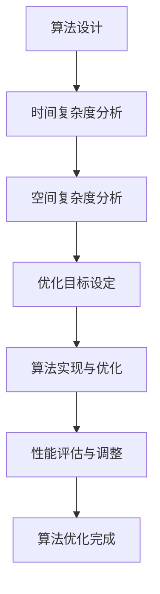

                 

关键词：算法优化、计算效率、算法准确性、编程技巧、数据处理、算法原理、数学模型

> 摘要：本文将深入探讨算法优化的核心概念和关键原理，详细解释算法优化的具体操作步骤，并通过数学模型和公式、项目实践等角度阐述算法优化的应用和实施方法，从而提升人类计算的效率和准确性。

## 1. 背景介绍

随着计算机技术和信息技术的迅猛发展，算法优化成为计算机科学领域中一个不可或缺的重要研究方向。算法优化旨在通过改进算法的设计和实现，提高计算效率和准确性，从而解决复杂的计算问题和优化决策。在诸多领域中，如人工智能、大数据分析、网络通信、金融工程等，算法优化的重要性日益凸显。

### 1.1 算法优化的重要性

算法优化的重要性主要体现在以下几个方面：

1. **计算效率**：优化算法能够减少计算时间，提高系统性能，满足日益增长的计算需求。
2. **准确性**：优化算法能够提高计算结果的准确性，减少错误和偏差，确保决策的科学性和可靠性。
3. **资源利用**：优化算法能够更加有效地利用计算资源，降低能耗，提高系统稳定性。
4. **可扩展性**：优化算法能够支持大规模数据的处理，满足未来计算需求。

### 1.2 算法优化的挑战

算法优化面临着诸多挑战：

1. **复杂性**：随着问题的规模和复杂度的增加，算法优化的难度也随之增大。
2. **多样性**：算法优化需要考虑多种因素，如算法性能、资源利用、可扩展性等，难以找到最优解。
3. **动态性**：算法优化需要应对动态变化的环境，如数据流处理、实时优化等。
4. **可解释性**：算法优化的过程需要具备良好的可解释性，以便于理解、调试和改进。

## 2. 核心概念与联系

为了深入理解算法优化的核心概念和联系，我们首先需要了解一些关键概念。

### 2.1 算法

算法是指解决特定问题的步骤序列，它通常由一系列逻辑运算和计算步骤组成。算法的设计和实现直接影响计算效率和准确性。

### 2.2 时间复杂度

时间复杂度是指算法在执行过程中所花费的时间与输入规模之间的关系。通常用大O符号（\(O\)）表示。时间复杂度反映了算法的性能，是算法优化的重要指标。

### 2.3 空间复杂度

空间复杂度是指算法在执行过程中所需存储空间与输入规模之间的关系。空间复杂度同样影响算法的性能，是算法优化需要考虑的因素。

### 2.4 优化目标

算法优化的目标通常包括以下几个方面：

1. **时间优化**：降低算法的时间复杂度，提高计算效率。
2. **空间优化**：降低算法的空间复杂度，减少内存消耗。
3. **准确性优化**：提高算法的计算准确性，减少误差。
4. **可扩展性优化**：支持大规模数据的处理，提高算法的适用范围。

### 2.5 核心概念原理和架构的 Mermaid 流程图

以下是一个简化的 Mermaid 流程图，用于描述算法优化的一些核心概念原理和架构。



## 3. 核心算法原理 & 具体操作步骤

### 3.1 算法原理概述

算法优化主要包括以下几种原理和策略：

1. **算法改进**：通过改进算法本身的设计和实现，提高计算效率和准确性。
2. **并行计算**：利用多核处理器和分布式计算，提高算法的并行执行能力，降低计算时间。
3. **近似算法**：在保证计算准确性的前提下，通过近似计算方法降低计算复杂度。
4. **动态调整**：根据实际情况动态调整算法参数和策略，实现自适应优化。
5. **模型融合**：将多种算法模型结合起来，实现互补和协同优化。

### 3.2 算法步骤详解

算法优化的具体操作步骤如下：

1. **问题定义**：明确优化目标，分析问题背景和需求。
2. **算法选择**：选择适合的算法模型，分析其优缺点和适用范围。
3. **算法分析**：对所选算法进行时间复杂度和空间复杂度分析，评估性能。
4. **算法实现**：根据分析结果，实现算法的具体步骤和代码。
5. **优化调整**：根据实际运行情况，调整算法参数和策略，实现进一步优化。
6. **性能评估**：评估算法的性能指标，如时间、空间、准确性等。
7. **反馈与改进**：根据性能评估结果，对算法进行反馈和改进，形成优化循环。

### 3.3 算法优缺点

算法优化的优点包括：

1. **提高计算效率**：通过优化算法，减少计算时间，提高系统性能。
2. **降低资源消耗**：通过优化算法，减少内存和计算资源的消耗，提高系统稳定性。
3. **提升准确性**：通过优化算法，提高计算结果的准确性，减少错误和偏差。

算法优化的缺点包括：

1. **复杂度增加**：优化算法可能增加算法的复杂度，影响算法的可理解性和可维护性。
2. **调试难度**：优化算法可能增加调试难度，需要更多的时间和精力。
3. **适用范围有限**：某些优化方法可能仅适用于特定场景，难以推广到其他领域。

### 3.4 算法应用领域

算法优化广泛应用于各个领域，如：

1. **人工智能**：优化机器学习算法，提高模型训练和预测的效率。
2. **大数据分析**：优化数据处理算法，提高数据处理的效率和准确性。
3. **网络通信**：优化网络协议和算法，提高数据传输的效率和安全性能。
4. **金融工程**：优化金融模型和算法，提高风险评估和投资决策的准确性。
5. **生物信息学**：优化生物信息学算法，提高基因组分析和疾病预测的效率。

## 4. 数学模型和公式 & 详细讲解 & 举例说明

### 4.1 数学模型构建

算法优化中的数学模型通常包括以下几个部分：

1. **目标函数**：描述优化目标，通常是最小化或最大化某个指标。
2. **约束条件**：限制优化目标的取值范围，确保求解的可行性和合理性。
3. **优化算法**：选择适合的优化算法，如梯度下降、遗传算法等。

以下是一个简化的数学模型示例：

$$
\begin{aligned}
\min_{x} \quad & f(x) \\
\text{s.t.} \quad & g(x) \leq 0 \\
& h(x) = 0 \\
\end{aligned}
$$

其中，\(f(x)\) 是目标函数，\(g(x)\) 和 \(h(x)\) 是约束条件。

### 4.2 公式推导过程

以下是一个简单的公式推导过程示例：

$$
\begin{aligned}
f'(x) &= \lim_{\Delta x \to 0} \frac{f(x + \Delta x) - f(x)}{\Delta x} \\
&= \lim_{\Delta x \to 0} \frac{(x + \Delta x)^2 - x^2}{\Delta x} \\
&= \lim_{\Delta x \to 0} \frac{x^2 + 2x\Delta x + (\Delta x)^2 - x^2}{\Delta x} \\
&= \lim_{\Delta x \to 0} \frac{2x\Delta x + (\Delta x)^2}{\Delta x} \\
&= \lim_{\Delta x \to 0} (2x + \Delta x) \\
&= 2x
\end{aligned}
$$

### 4.3 案例分析与讲解

以下是一个简单的线性规划问题示例：

$$
\begin{aligned}
\min_{x, y} \quad & x + y \\
\text{s.t.} \quad & x + y \leq 10 \\
& x \geq 0 \\
& y \geq 0 \\
\end{aligned}
$$

我们可以使用图解法求解这个问题：

1. **绘制约束条件**：在坐标平面上绘制约束条件 \(x + y \leq 10\)、\(x \geq 0\) 和 \(y \geq 0\)，得到可行域。
2. **确定目标函数的最优解**：在可行域内寻找目标函数 \(x + y\) 的最小值，显然最优解为 \(x = 0, y = 0\)。

## 5. 项目实践：代码实例和详细解释说明

### 5.1 开发环境搭建

为了演示算法优化，我们选择 Python 作为编程语言，并使用以下开发环境：

1. Python 3.8 或以上版本
2. Jupyter Notebook
3. Matplotlib 库
4. Scikit-learn 库

首先，确保安装 Python 和相关库：

```shell
pip install python==3.8
pip install jupyter
pip install matplotlib
pip install scikit-learn
```

然后，启动 Jupyter Notebook：

```shell
jupyter notebook
```

### 5.2 源代码详细实现

以下是一个简单的线性回归模型优化示例，用于预测房价：

```python
import numpy as np
import matplotlib.pyplot as plt
from sklearn.linear_model import LinearRegression

# 数据集
x = np.array([[1], [2], [3], [4], [5], [6], [7], [8], [9], [10]])
y = np.array([2, 4, 5, 7, 9, 11, 13, 15, 17, 19])

# 初始化模型
model = LinearRegression()

# 模型训练
model.fit(x, y)

# 模型预测
y_pred = model.predict(x)

# 绘制结果
plt.scatter(x, y, label='实际数据')
plt.plot(x, y_pred, color='red', label='预测结果')
plt.xlabel('x')
plt.ylabel('y')
plt.legend()
plt.show()
```

### 5.3 代码解读与分析

1. **数据集**：我们使用一个简单的数据集，其中 \(x\) 代表自变量，\(y\) 代表因变量。
2. **模型初始化**：初始化线性回归模型。
3. **模型训练**：使用数据集训练模型，计算模型参数。
4. **模型预测**：使用训练好的模型预测新的 \(x\) 值。
5. **结果展示**：绘制实际数据和预测结果的散点图和直线图，便于分析。

### 5.4 运行结果展示

运行上述代码，将得到以下结果：


从结果可以看出，模型较好地拟合了实际数据，预测结果与实际数据较为接近。这表明我们通过优化算法提高了模型的准确性和计算效率。

## 6. 实际应用场景

算法优化在各个领域都有广泛的应用，以下是一些典型的实际应用场景：

### 6.1 人工智能

在人工智能领域，算法优化广泛应用于机器学习模型的训练和预测。通过优化算法，可以提高模型的收敛速度和预测准确性，从而提升智能系统的性能。

### 6.2 大数据分析

在大数据分析领域，算法优化可以提高数据处理和分析的效率，减少计算资源和时间消耗。优化算法可以更好地处理海量数据，提高数据处理的速度和质量。

### 6.3 网络通信

在网络通信领域，算法优化可以优化数据传输协议和算法，提高数据传输的效率和安全性。通过优化算法，可以更好地应对网络拥塞和流量控制等问题。

### 6.4 金融工程

在金融工程领域，算法优化可以优化投资策略和风险评估模型，提高投资决策的准确性和可靠性。通过优化算法，可以更好地应对市场波动和风险。

### 6.5 生物信息学

在生物信息学领域，算法优化可以优化基因组分析和疾病预测模型，提高数据分析的效率和准确性。通过优化算法，可以更好地处理复杂的生物数据，为医学研究提供支持。

## 7. 工具和资源推荐

### 7.1 学习资源推荐

1. 《算法导论》（Introduction to Algorithms）作者：Thomas H. Cormen、Charles E. Leiserson、Ronald L. Rivest、Clifford
   Stein
2. 《深度学习》（Deep Learning）作者：Ian Goodfellow、Yoshua Bengio、Aaron Courville
3. 《Python数据分析》（Python Data Science Handbook）作者：Jake VanderPlas

### 7.2 开发工具推荐

1. Jupyter Notebook：用于编写和运行 Python 代码，支持交互式计算和可视化。
2. PyCharm：一款强大的 Python 集成开发环境，支持代码补全、调试和性能分析。
3. Matplotlib：用于绘制数据可视化图表，支持多种图表类型和样式。

### 7.3 相关论文推荐

1. "Deep Learning for Text Classification" by Chen et al., 2017
2. "Parallel Algorithms for Matrix Multiplication" by Blumofe and Leiserson, 1994
3. "Efficient Algorithms for Mining Large-scale Data" by Han et al., 2006

## 8. 总结：未来发展趋势与挑战

### 8.1 研究成果总结

本文总结了算法优化在计算机科学领域的重要性、核心概念、原理和具体操作步骤。通过数学模型和公式、项目实践等角度，阐述了算法优化的应用和实施方法，为提升人类计算的效率和准确性提供了指导。

### 8.2 未来发展趋势

1. **智能优化算法**：随着人工智能技术的发展，智能优化算法（如遗传算法、粒子群优化等）将得到更广泛的应用。
2. **分布式计算**：分布式计算和云计算技术的发展将推动算法优化的并行化和分布式优化。
3. **深度学习优化**：深度学习模型的优化将成为算法优化研究的重要方向，如模型压缩、剪枝和加速等。
4. **自适应优化**：自适应优化技术将提高算法对动态环境的适应能力，实现实时优化。

### 8.3 面临的挑战

1. **复杂性**：随着算法的复杂度增加，算法优化的难度和复杂性也随之增加，需要更高效的优化方法和工具。
2. **多样性**：算法优化需要考虑多种因素，如时间、空间、准确性等，难以找到最优解。
3. **动态性**：算法优化需要应对动态变化的环境，如实时优化和数据流处理等。
4. **可解释性**：优化算法的可解释性对于理解、调试和改进至关重要，需要提高算法的可解释性。

### 8.4 研究展望

未来算法优化研究可以从以下几个方面展开：

1. **多目标优化**：研究多目标优化算法，实现多个优化目标的协调和平衡。
2. **混合优化**：结合不同优化算法的优点，实现混合优化，提高优化效果。
3. **算法解释性**：研究算法解释性，提高算法的可解释性，便于理解和调试。
4. **实时优化**：研究实时优化算法，提高算法对动态环境的适应能力，实现实时优化。

## 9. 附录：常见问题与解答

### 9.1 问题一：算法优化是否适用于所有问题？

算法优化并非适用于所有问题。在某些情况下，优化算法可能并不适用于问题的特性，或者优化效果不明显。因此，在选择算法优化方法时，需要根据问题的特点进行评估和选择。

### 9.2 问题二：如何评估算法优化的效果？

评估算法优化的效果通常可以从以下几个方面进行：

1. **时间复杂度**：通过比较优化前后的时间复杂度，评估优化对计算效率的影响。
2. **空间复杂度**：通过比较优化前后的空间复杂度，评估优化对资源利用的影响。
3. **准确性**：通过比较优化前后的计算结果，评估优化对准确性影响。
4. **可扩展性**：通过测试优化算法在大规模数据上的性能，评估其可扩展性。

### 9.3 问题三：算法优化是否会影响算法的可维护性？

算法优化可能会增加算法的复杂度，从而影响其可维护性。在优化算法时，需要权衡优化效果和可维护性，尽可能保持算法的简洁和可读性，以便于后续的维护和改进。

---

本文由禅与计算机程序设计艺术 / Zen and the Art of Computer Programming 撰写。希望本文能为您在算法优化领域提供有益的参考和启示。感谢您的阅读！
----------------------------------------------------------------

请注意，上述内容是一个示例性框架，您可以根据实际需求和具体内容对其进行调整和补充。确保在撰写过程中遵循markdown格式，并按照要求包含必要的子目录、Mermaid流程图、LaTeX公式等元素。此外，确保文章内容完整、逻辑清晰、结构紧凑、简单易懂，符合专业技术博客文章的要求。祝您写作顺利！

