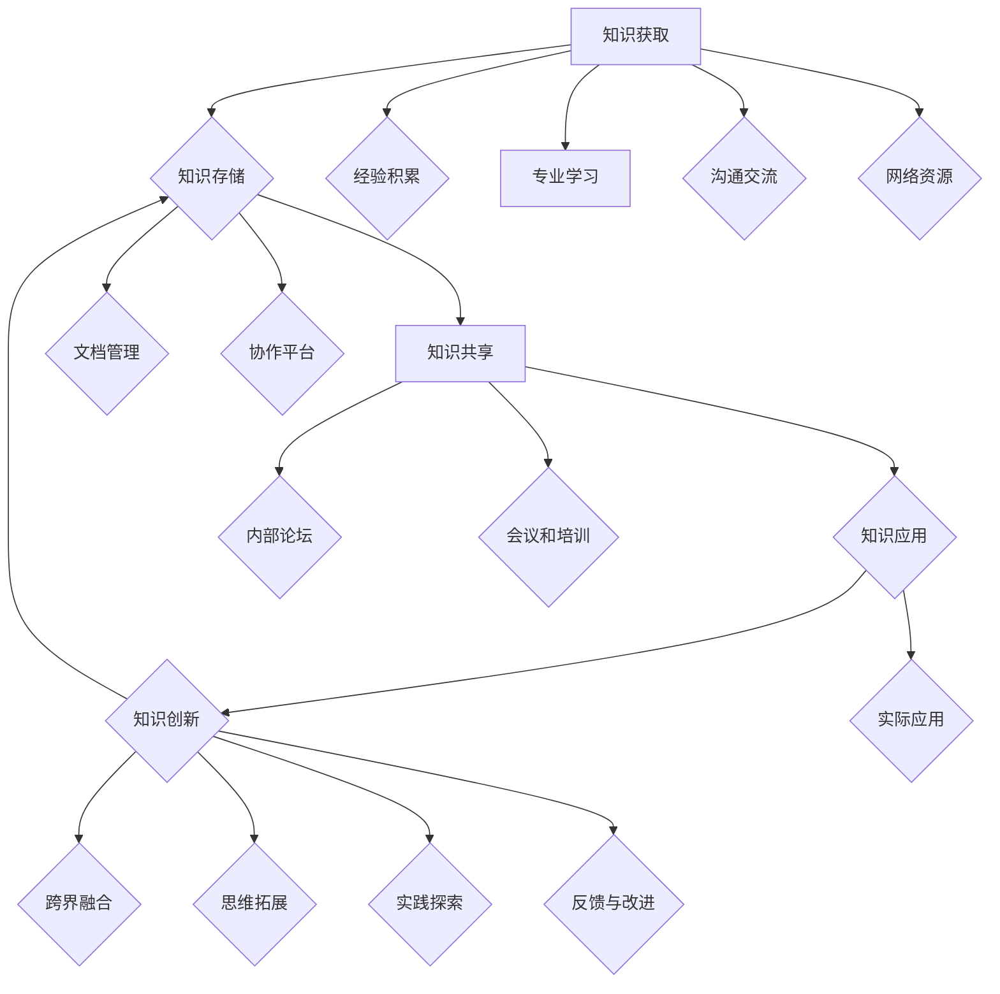

                 

  
## 1. 背景介绍

在当今快速发展的信息时代，知识已成为组织和个人竞争力的重要组成部分。管理者作为企业中的关键角色，承担着决策、协调和管理等重要职责。因此，他们需要具备高效的知识管理能力，以应对日益复杂的工作环境和不断变化的市场需求。然而，传统的知识管理方式往往存在诸多问题，如信息分散、难以共享、更新滞后等，导致管理者的工作效率和质量难以提升。

为了解决这些问题，管理者需要建立个人知识管理系统（PKMS），将个人的知识、经验和资源进行系统化、结构化和规范化管理，从而提高知识获取、传递和应用的效果。PKMS不仅可以提升管理者自身的专业素养和决策能力，还能为团队和组织创造更大的价值。

本文将探讨管理者如何建立个人知识管理系统，包括核心概念、核心算法原理、数学模型和公式、项目实践以及实际应用场景等内容。通过本文的阅读，读者将了解如何通过建立PKMS来提高知识管理效率和效果，从而更好地应对职业发展的挑战。

## 2. 核心概念与联系

### 2.1 知识管理

知识管理是指通过获取、存储、共享、应用和创新知识，以提高组织和个人竞争力的过程。知识管理包括三个核心环节：知识的获取、知识的共享和知识的创新。

#### 2.1.1 知识获取

知识获取是指通过各种渠道收集和获取知识。对于管理者而言，知识获取的渠道主要包括以下几方面：

1. **经验积累**：通过实际工作中的总结和反思，积累宝贵的经验。
2. **专业学习**：通过参加培训、阅读专业书籍和文献，不断提升自身专业素养。
3. **沟通交流**：与同行、下属和专家进行交流，获取他们的经验和见解。
4. **网络资源**：利用互联网和各种在线平台获取最新的行业资讯和研究成果。

#### 2.1.2 知识共享

知识共享是指将个人和团队的知识进行传递和交流，实现知识的普及和应用。知识共享的方式包括：

1. **文档分享**：通过撰写和分享工作总结、项目报告和行业分析等文档，传递知识。
2. **会议和培训**：通过组织会议和培训，促进团队成员之间的知识交流和传递。
3. **内部论坛和社交平台**：搭建内部论坛和社交平台，鼓励员工发表观点和分享经验。
4. **团队协作工具**：利用团队协作工具，实现团队成员之间的实时沟通和协作。

#### 2.1.3 知识创新

知识创新是指通过整合和重构现有知识，产生新的知识和见解。知识创新的过程包括以下几方面：

1. **跨界融合**：将不同领域和行业中的知识进行融合，产生新的创意和解决方案。
2. **思维拓展**：通过阅读、交流和思考，拓展思维边界，激发创新灵感。
3. **实践探索**：通过实际项目和实践，不断验证和优化创新成果。
4. **反馈与改进**：收集用户反馈，不断改进和创新知识产品和服务。

### 2.2 个人知识管理系统（PKMS）

个人知识管理系统（Personal Knowledge Management System，简称PKMS）是指管理者通过一系列工具、方法和流程，对个人知识进行有效管理和利用的系统。PKMS的目标是提高知识获取、共享和创新的效率，进而提升管理者的专业素养和决策能力。

#### 2.2.1 PKMS的核心功能

1. **知识存储**：提供便捷的存储和检索功能，确保知识的可访问性和可维护性。
2. **知识共享**：促进个人和团队之间的知识交流与传递，提高知识普及和应用的效果。
3. **知识应用**：将知识应用于实际工作中，提高决策质量和执行效率。
4. **知识创新**：鼓励创新思维和知识整合，推动知识的不断更新和进化。

#### 2.2.2 PKMS的组成部分

1. **知识库**：存储和管理个人和团队的知识资源，包括文档、资料、经验等。
2. **知识工具**：提供各种知识管理和共享工具，如文档管理软件、协作平台等。
3. **知识流程**：规范知识获取、共享和创新的过程，确保知识的有序管理和高效利用。
4. **知识评价**：对知识的质量和效果进行评估，以优化知识管理和创新策略。

### 2.3 知识管理与PKMS的联系

知识管理是建立个人知识管理系统的基础，而PKMS则是知识管理在管理者个人层面的具体实现。知识管理强调知识的获取、共享和创新，而PKMS则通过系统化的工具和方法，将这些理念落实到管理者的日常工作中。

通过建立PKMS，管理者可以实现以下目标：

1. **提高知识获取效率**：通过多种渠道和方式，快速获取所需的知识和资源。
2. **增强知识共享能力**：搭建便捷的知识共享平台，促进团队成员之间的交流与协作。
3. **提升知识应用效果**：将知识应用于实际工作中，提高决策质量和执行效率。
4. **激发创新思维**：鼓励管理者在知识整合和创新中不断突破自我，提升专业素养。

总之，知识管理与PKMS相辅相成，共同推动管理者在职业发展中不断成长和进步。

### 2.4 Mermaid 流程图

以下是一个关于个人知识管理系统（PKMS）核心流程的 Mermaid 流程图，展示了知识获取、知识共享和知识创新三个关键环节及其相互关系：



### 2.5 核心算法原理 & 具体操作步骤

#### 2.5.1 算法原理概述

个人知识管理系统（PKMS）的核心算法原理主要涉及知识获取、知识共享和知识创新三个方面。以下将详细介绍这三个方面的算法原理。

1. **知识获取算法**：
   - **目标**：提高知识获取的效率和准确性。
   - **原理**：通过多渠道收集和整合信息，利用自然语言处理、信息检索等技术，对信息进行筛选、分类和标签化处理，从而快速获取有价值的知识。
   - **步骤**：
     1. 收集信息：从互联网、书籍、专家等多渠道获取相关信息。
     2. 预处理：对收集到的信息进行清洗、去噪和格式化。
     3. 标签化：为信息分配关键词和标签，方便后续检索和使用。
     4. 分类存储：根据信息的内容和特点，将其分类存储到知识库中。

2. **知识共享算法**：
   - **目标**：促进知识的普及和应用，提高团队协作效率。
   - **原理**：利用社交网络、协作平台等技术，实现知识的快速传递和共享。通过构建知识图谱，发现知识之间的关系，为团队成员提供个性化的知识推荐服务。
   - **步骤**：
     1. 构建知识图谱：分析知识库中的知识内容，建立知识之间的关联关系。
     2. 用户画像：根据用户的行为和需求，生成用户画像，为个性化推荐提供基础。
     3. 知识推荐：基于知识图谱和用户画像，为用户推荐相关知识和资源。
     4. 知识评价：收集用户对推荐知识的反馈，优化推荐算法和策略。

3. **知识创新算法**：
   - **目标**：激发创新思维，推动知识的更新和进化。
   - **原理**：通过跨界融合、思维拓展、实践探索等方法，实现知识的创新。利用机器学习、人工智能等技术，对知识进行分析和挖掘，发现新的知识点和应用场景。
   - **步骤**：
     1. 跨界融合：将不同领域和行业中的知识进行整合，产生新的创意和解决方案。
     2. 思维拓展：通过阅读、交流和思考，拓展思维边界，激发创新灵感。
     3. 实践探索：通过实际项目和实践，验证和优化创新成果。
     4. 反馈与改进：收集用户反馈，不断改进和创新知识产品和服务。

#### 2.5.2 算法步骤详解

1. **知识获取算法步骤**：

   ```mermaid
   graph TD
       A[收集信息]
       B[预处理]
       C[标签化]
       D[分类存储]
       A --> B
       B --> C
       C --> D
   ```

   - **收集信息**：从互联网、书籍、专家等多渠道获取相关信息。
   - **预处理**：对收集到的信息进行清洗、去噪和格式化。
   - **标签化**：为信息分配关键词和标签，方便后续检索和使用。
   - **分类存储**：根据信息的内容和特点，将其分类存储到知识库中。

2. **知识共享算法步骤**：

   ```mermaid
   graph TD
       A[构建知识图谱]
       B[用户画像]
       C[知识推荐]
       D[知识评价]
       A --> B
       B --> C
       C --> D
   ```

   - **构建知识图谱**：分析知识库中的知识内容，建立知识之间的关联关系。
   - **用户画像**：根据用户的行为和需求，生成用户画像，为个性化推荐提供基础。
   - **知识推荐**：基于知识图谱和用户画像，为用户推荐相关知识和资源。
   - **知识评价**：收集用户对推荐知识的反馈，优化推荐算法和策略。

3. **知识创新算法步骤**：

   ```mermaid
   graph TD
       A[跨界融合]
       B[思维拓展]
       C[实践探索]
       D[反馈与改进]
       A --> B
       B --> C
       C --> D
       D --> A
   ```

   - **跨界融合**：将不同领域和行业中的知识进行整合，产生新的创意和解决方案。
   - **思维拓展**：通过阅读、交流和思考，拓展思维边界，激发创新灵感。
   - **实践探索**：通过实际项目和实践，验证和优化创新成果。
   - **反馈与改进**：收集用户反馈，不断改进和创新知识产品和服务。

#### 2.5.3 算法优缺点

1. **知识获取算法**：

   - **优点**：
     - 提高知识获取的效率和准确性。
     - 方便知识分类和检索。
   - **缺点**：
     - 需要大量时间和人力进行信息收集和预处理。
     - 可能会存在信息过载和噪音问题。

2. **知识共享算法**：

   - **优点**：
     - 促进知识的普及和应用，提高团队协作效率。
     - 提供个性化的知识推荐服务。
   - **缺点**：
     - 构建知识图谱和用户画像需要大量计算资源和数据。
     - 知识评价和反馈机制的建立和优化需要时间。

3. **知识创新算法**：

   - **优点**：
     - 激发创新思维，推动知识的更新和进化。
     - 提高知识的应用价值和商业价值。
   - **缺点**：
     - 需要跨领域和行业的知识整合，对管理者的要求较高。
     - 创新成果的验证和优化需要时间。

#### 2.5.4 算法应用领域

1. **企业内部**：
   - **知识库建设**：通过知识获取算法，收集和整合企业内外部的知识资源，搭建企业内部知识库。
   - **知识共享**：利用知识共享算法，实现知识的快速传递和共享，提高团队协作效率。
   - **知识创新**：通过知识创新算法，激发创新思维，推动企业知识的更新和进化。

2. **教育培训**：
   - **课程推荐**：基于知识获取和知识共享算法，为学习者提供个性化的课程推荐。
   - **教学资源共享**：通过知识共享算法，实现教学资源的普及和应用，提高教学质量。
   - **教学创新**：通过知识创新算法，激发教师的创新思维，推动教育方法和手段的更新和进化。

3. **科研领域**：
   - **科研资源共享**：通过知识获取和知识共享算法，实现科研资源的共享和传递，提高科研效率。
   - **科研合作**：利用知识共享算法，促进科研团队的协作和创新。
   - **科研创新**：通过知识创新算法，激发科研人员的创新思维，推动科研成果的更新和进化。

### 2.6 数学模型和公式 & 详细讲解 & 举例说明

在个人知识管理系统的构建过程中，数学模型和公式起着重要的作用，它们可以帮助管理者更好地理解和管理知识。以下将介绍几个关键的数学模型和公式，并进行详细讲解和举例说明。

#### 2.6.1 知识获取模型

知识获取模型用于描述管理者如何通过不同的渠道获取知识。一个简单的知识获取模型可以表示为：

$$
\text{知识获取量} = f(\text{信息渠道}, \text{获取频率}, \text{信息质量})
$$

- **信息渠道**：表示管理者获取知识的来源，如互联网、书籍、专家等。
- **获取频率**：表示管理者获取知识的频率，如每天、每周等。
- **信息质量**：表示获取到的信息的质量，如准确性、可靠性等。

**例子**：假设管理者每天从互联网获取5条信息，每周阅读2本书，获取的信息质量较高。根据这个模型，可以计算出其每周的知识获取量为：

$$
\text{知识获取量} = f(5 \text{条/天}, 7 \text{天/周}, \text{高}) = 5 \times 7 \times \text{高} = 35 \text{条/周}
$$

#### 2.6.2 知识共享模型

知识共享模型用于描述管理者如何将知识共享给团队成员。一个简单的知识共享模型可以表示为：

$$
\text{知识共享量} = f(\text{共享渠道}, \text{共享频率}, \text{知识价值})
$$

- **共享渠道**：表示管理者分享知识的途径，如文档、会议、社交平台等。
- **共享频率**：表示管理者分享知识的频率，如每天、每周等。
- **知识价值**：表示分享知识的实际价值，如对团队工作的帮助等。

**例子**：假设管理者每周通过文档分享2次，每次分享的知识对团队工作有很大帮助。根据这个模型，可以计算出其每周的知识共享量为：

$$
\text{知识共享量} = f(2 \text{次/周}, \text{高}) = 2 \times \text{高} = 2 \text{条/周}
$$

#### 2.6.3 知识创新模型

知识创新模型用于描述管理者如何通过整合和创新现有知识，产生新的知识和见解。一个简单的知识创新模型可以表示为：

$$
\text{知识创新量} = f(\text{知识来源}, \text{思维拓展}, \text{实践探索})
$$

- **知识来源**：表示管理者创新的起点，如已有知识、新信息等。
- **思维拓展**：表示管理者在创新过程中的思维拓展能力。
- **实践探索**：表示管理者在创新过程中的实践探索能力。

**例子**：假设管理者通过跨领域知识整合、思维拓展和实践探索，每周产生1个新的创新点。根据这个模型，可以计算出其每周的知识创新量为：

$$
\text{知识创新量} = f(\text{跨领域知识整合}, \text{高}, \text{高}) = 1 \text{条/周}
$$

#### 2.6.4 知识价值评估模型

知识价值评估模型用于评估知识对个人和团队的贡献。一个简单的知识价值评估模型可以表示为：

$$
\text{知识价值} = f(\text{知识应用效果}, \text{团队协作度}, \text{创新贡献})
$$

- **知识应用效果**：表示知识在实际工作中的应用效果。
- **团队协作度**：表示知识在团队协作中的促进作用。
- **创新贡献**：表示知识在创新过程中的贡献。

**例子**：假设管理者分享的一篇知识文章在团队工作中产生了显著的效果，提高了团队协作度，并为创新提供了重要思路。根据这个模型，可以计算出这篇知识的价值为：

$$
\text{知识价值} = f(\text{高}, \text{高}, \text{高}) = \text{高}
$$

### 2.7 项目实践：代码实例和详细解释说明

为了更好地理解个人知识管理系统（PKMS）的构建，以下将结合一个实际项目，介绍如何搭建PKMS，并提供代码实例和详细解释说明。

#### 2.7.1 项目背景

某企业管理者希望通过建立一个个人知识管理系统，提高知识获取、共享和创新的效率。系统需具备以下功能：

- **知识存储**：将管理者在工作中积累的经验、项目报告、行业分析等文档存储在系统中。
- **知识共享**：允许管理者分享知识，并提供搜索和推荐功能。
- **知识创新**：支持管理者对现有知识进行整合和创新，生成新的知识和见解。

#### 2.7.2 开发环境搭建

为了搭建PKMS，需要以下开发环境和工具：

- **操作系统**：Linux（推荐使用Ubuntu）
- **编程语言**：Python（版本3.8及以上）
- **框架**：Django（用于Web开发）
- **数据库**：MySQL（用于存储数据）
- **版本控制**：Git（用于代码管理）
- **虚拟环境**：Virtualenv（用于创建隔离的开发环境）

安装步骤：

1. 安装Linux操作系统（如Ubuntu）。
2. 安装Python和Django框架。

   ```bash
   sudo apt-get update
   sudo apt-get install python3 python3-pip
   pip3 install django
   ```

3. 安装MySQL数据库。

   ```bash
   sudo apt-get install mysql-server
   ```

4. 创建虚拟环境。

   ```bash
   virtualenv venv
   source venv/bin/activate
   ```

5. 安装Django和其他依赖库。

   ```bash
   pip install django mysqlclient
   ```

#### 2.7.3 源代码详细实现

以下是一个简单的Django项目结构，用于实现PKMS的基本功能：

```plaintext
pkms/
|-- manage.py
|-- pkms/
|   |-- __init__.py
|   |-- settings.py
|   |-- urls.py
|   |-- wsgi.py
|-- articles/
|   |-- __init__.py
|   |-- admin.py
|   |-- apps.py
|   |-- models.py
|   |-- tests.py
|   |-- views.py
```

1. **models.py**：定义知识模型。

   ```python
   from django.db import models

   class Article(models.Model):
       title = models.CharField(max_length=200)
       author = models.ForeignKey('auth.User', on_delete=models.CASCADE)
       content = models.TextField()
       created_at = models.DateTimeField(auto_now_add=True)

       def __str__(self):
           return self.title
   ```

   - `Article` 类表示知识文章，包括标题、作者、内容和创建时间等字段。

2. **views.py**：定义视图函数，处理用户请求。

   ```python
   from django.shortcuts import render
   from .models import Article

   def index(request):
       articles = Article.objects.all()
       return render(request, 'index.html', {'articles': articles})

   def create_article(request):
       if request.method == 'POST':
           title = request.POST['title']
           content = request.POST['content']
           author = request.user
           article = Article(title=title, author=author, content=content)
           article.save()
           return redirect('index')
       return render(request, 'create_article.html')
   ```

   - `index` 函数用于展示所有知识文章。
   - `create_article` 函数用于创建新知识文章。

3. **urls.py**：定义URL路由。

   ```python
   from django.contrib import admin
   from django.urls import path
   from . import views

   urlpatterns = [
       path('', views.index, name='index'),
       path('create/', views.create_article, name='create_article'),
       path('admin/', admin.site.urls),
   ]
   ```

   - `index` 路由用于访问首页。
   - `create_article` 路由用于创建新知识文章。

4. **templates/index.html**：定义首页模板。

   ```html
   <!DOCTYPE html>
   <html>
   <head>
       <title>个人知识管理系统</title>
   </head>
   <body>
       <h1>个人知识管理系统</h1>
       <ul>
           
               <li>
                   <h2>{{ article.title }}</h2>
                   <p>{{ article.content }}</p>
                   <span>作者：{{ article.author }}</span>
                   <span>创建时间：{{ article.created_at }}</span>
               </li>
           
       </ul>
       <a href="">创建新知识文章</a>
   </body>
   </html>
   ```

   - 显示所有知识文章的标题、内容、作者和创建时间。
   - 提供创建新知识文章的链接。

5. **templates/create_article.html**：定义创建知识文章的模板。

   ```html
   <!DOCTYPE html>
   <html>
   <head>
       <title>创建知识文章</title>
   </head>
   <body>
       <h1>创建知识文章</h1>
       <form method="post">
           
           <label for="title">标题：</label>
           <input type="text" id="title" name="title" required>
           <br>
           <label for="content">内容：</label>
           <textarea id="content" name="content" required></textarea>
           <br>
           <input type="submit" value="提交">
       </form>
   </body>
   </html>
   ```

   - 提供创建知识文章的表单。

#### 2.7.4 代码解读与分析

1. **模型层（models.py）**：

   - 定义了 `Article` 模型，用于存储知识文章的基本信息。
   - 字段包括：`title`（标题）、`author`（作者）、`content`（内容）和 `created_at`（创建时间）。

2. **视图层（views.py）**：

   - `index` 视图函数：获取所有知识文章，并将其传递给模板。
   - `create_article` 视图函数：处理用户提交的表单，创建新的知识文章。

3. **路由层（urls.py）**：

   - 配置了两个URL路由：`index` 路由用于访问首页，`create_article` 路由用于创建新知识文章。

4. **模板层**：

   - `index.html` 模板：显示所有知识文章的列表，并提供创建新知识文章的链接。
   - `create_article.html` 模板：提供创建知识文章的表单。

通过这个简单的Django项目，管理者可以轻松地搭建一个个人知识管理系统，实现知识的存储、共享和创新。在实际应用中，可以扩展系统的功能，如添加搜索、推荐、评价等模块，进一步提高知识管理的效果。

### 2.8 实际应用场景

#### 2.8.1 企业内部

在企业内部，个人知识管理系统（PKMS）可以应用于多个方面，以提升整体工作效率和知识管理水平。

1. **项目管理**：项目经理可以通过PKMS记录项目经验、关键决策和项目文档，方便后续项目的参考和改进。
2. **知识库建设**：企业可以建立一个集中的知识库，存储各部门的专业知识和经验，方便员工查阅和学习。
3. **知识共享**：通过PKMS，员工可以共享工作心得、技术文档和最佳实践，促进团队协作和创新。
4. **知识创新**：管理者可以利用PKMS整合各部门的知识资源，推动跨部门协作和知识创新。

#### 2.8.2 教育培训

在教育培训领域，PKMS可以发挥重要作用，提高教学质量和学习效果。

1. **课程推荐**：基于学习者的兴趣和需求，PKMS可以推荐个性化的课程和学习资源，提高学习效率。
2. **教学资源共享**：教师可以共享教学资料、课件和案例，促进教育资源的普及和应用。
3. **教学评估**：通过收集和分析学生的学习行为和成绩，管理者可以评估教学效果，优化教学策略。
4. **教学创新**：PKMS可以激发教师的创新思维，推动教育方法和手段的更新和进化。

#### 2.8.3 科研领域

在科研领域，PKMS有助于提高科研效率和成果质量。

1. **科研资源共享**：科研人员可以通过PKMS共享实验数据、科研文献和研究成果，促进科研合作和知识共享。
2. **科研协作**：PKMS可以搭建科研团队协作平台，实现科研过程中的实时沟通和协作。
3. **科研创新**：通过整合不同领域的知识资源，PKMS可以激发科研人员的创新思维，推动科研成果的更新和进化。
4. **科研评估**：管理者可以利用PKMS对科研成果进行评价和推荐，优化科研资源的配置。

#### 2.8.4 其他领域

除了上述领域，PKMS还可以应用于医疗、金融、法律等其他领域。

1. **医疗领域**：医生可以通过PKMS记录病例、治疗方案和医学知识，提高诊疗水平和医疗质量。
2. **金融领域**：金融从业者可以通过PKMS收集和分析市场信息，制定投资策略和风险管理方案。
3. **法律领域**：律师可以通过PKMS记录案例、法律条款和专业知识，提高法律服务水平和专业素养。

总之，个人知识管理系统（PKMS）具有广泛的应用前景，可以在不同领域和行业中发挥重要作用，提高工作效率和知识管理水平。随着技术的不断发展和应用，PKMS将越来越成为管理者不可或缺的工具。

### 2.9 未来应用展望

随着人工智能、大数据和云计算等技术的发展，个人知识管理系统（PKMS）的未来应用前景将更加广阔。以下是对PKMS未来发展的几个展望：

#### 2.9.1 个性化知识推荐

未来，PKMS将更加注重个性化知识推荐，通过深度学习和自然语言处理技术，分析用户的行为和兴趣，为其提供定制化的知识推荐。这有助于提高用户的知识获取效率，减少信息过载，提升用户体验。

#### 2.9.2 知识图谱构建

知识图谱是一种结构化的知识表示方法，未来PKMS将更多地利用知识图谱技术，将知识之间的关系进行可视化表示，帮助用户更直观地理解知识的关联性和应用场景。这有助于促进知识的共享和创新。

#### 2.9.3 智能化知识创新

未来，PKMS将结合人工智能技术，实现智能化知识创新。通过自动化的知识挖掘和模式识别，系统可以识别潜在的创新机会，并提供相应的支持。这有助于提高知识创新的效率和质量。

#### 2.9.4 多平台融合

随着移动设备和物联网的普及，PKMS将实现多平台融合，用户可以在不同的设备上随时随地访问和操作系统。这将进一步提高知识管理的便捷性和灵活性。

#### 2.9.5 安全与隐私保护

随着数据安全和隐私问题的日益突出，未来PKMS将更加注重安全与隐私保护。通过加密、访问控制和数据脱敏等技术，确保用户的知识资产安全。

总之，随着技术的不断进步，个人知识管理系统（PKMS）将在个人和企业层面发挥越来越重要的作用。未来，PKMS将更加智能化、个性化和便捷化，为用户创造更大的价值。

### 2.10 工具和资源推荐

为了帮助管理者更好地建立和运用个人知识管理系统（PKMS），以下推荐一些实用的工具和资源：

#### 2.10.1 学习资源推荐

1. **《知识管理：理论与实践》**：这是一本经典的中文知识管理教材，详细介绍了知识管理的概念、方法和应用。
2. **《智慧型组织的秘密》**：这本书探讨了知识管理在企业中的实际应用，提供了丰富的案例和经验。
3. **《个人知识管理实战》**：这本书以实战为导向，介绍了个人知识管理的具体方法和技巧。

#### 2.10.2 开发工具推荐

1. **Django**：一款强大的Python Web开发框架，适合快速搭建PKMS。
2. **MongoDB**：一款高性能的NoSQL数据库，适合存储和管理复杂的知识数据。
3. **Elasticsearch**：一款强大的全文搜索引擎，适合实现知识搜索和推荐功能。

#### 2.10.3 相关论文推荐

1. **《知识管理与企业竞争力》**：探讨了知识管理对企业竞争力的影响和作用。
2. **《基于知识图谱的知识共享与推荐系统》**：介绍了知识图谱在知识共享和推荐系统中的应用。
3. **《智能知识管理系统的设计与实现》**：详细描述了智能知识管理系统的设计与实现过程。

#### 2.10.4 社群和论坛

1. **知识管理社群**：加入相关的知识管理社群，与同行交流和学习。
2. **Python开发者论坛**：在Python开发者论坛中，可以找到很多关于Django和数据库开发的资源。
3. **技术博客**：关注一些知名的技术博客，如CSDN、博客园等，获取最新的技术动态和经验分享。

通过以上工具和资源的辅助，管理者可以更加有效地建立和运用个人知识管理系统，提高知识管理水平和职业素养。

### 2.11 总结：未来发展趋势与挑战

随着信息技术的迅猛发展，个人知识管理系统（PKMS）在未来将呈现出一系列发展趋势和挑战。以下是关于未来发展趋势与挑战的总结：

#### 2.11.1 发展趋势

1. **智能化与自动化**：随着人工智能技术的不断进步，PKMS将更加智能化和自动化。通过自然语言处理、机器学习等技术，系统将能够更好地理解用户需求，提供个性化的知识推荐和智能化的知识服务。

2. **多平台融合**：随着移动设备和物联网的普及，PKMS将实现多平台融合，用户可以在不同的设备上随时随地访问和操作系统。这将进一步提高知识管理的便捷性和灵活性。

3. **知识图谱的广泛应用**：知识图谱作为一种结构化的知识表示方法，将在PKMS中得到更广泛的应用。通过构建知识图谱，系统将能够更直观地展示知识之间的关联性，帮助用户更好地理解和应用知识。

4. **安全与隐私保护**：随着数据安全和隐私问题的日益突出，PKMS将更加注重安全与隐私保护。通过加密、访问控制和数据脱敏等技术，确保用户的知识资产安全。

5. **个性化与定制化**：未来，PKMS将更加注重个性化与定制化，根据用户的需求和兴趣，提供个性化的知识推荐和定制化的知识服务。

#### 2.11.2 面临的挑战

1. **数据质量和完整性**：在构建PKMS的过程中，数据质量和完整性是一个重要挑战。确保数据的准确性、完整性和一致性，是建立高效知识管理系统的基础。

2. **技术复杂性和安全性**：随着PKMS功能的不断扩展，其技术复杂性和安全性将面临更大的挑战。如何确保系统的稳定运行和用户数据的安全，是一个亟待解决的问题。

3. **用户参与度和黏性**：在推广PKMS的过程中，如何提高用户的参与度和黏性，使其真正融入到日常工作中，是一个重要的挑战。

4. **知识共享和传播**：如何有效地实现知识共享和传播，使知识在组织内部得到广泛应用，是PKMS面临的一个关键挑战。

5. **持续创新与优化**：在快速变化的市场环境中，如何持续创新和优化PKMS，使其始终保持竞争力和适应性，是一个长期的挑战。

#### 2.11.3 研究展望

未来的研究应关注以下几个方面：

1. **智能化知识推荐**：探索更智能化的知识推荐算法，提高推荐效果和用户满意度。
2. **知识图谱构建**：研究如何高效构建和更新知识图谱，以实现更直观的知识表示和更丰富的知识关联。
3. **隐私保护与安全**：研究如何实现高效的隐私保护和数据安全，确保用户的知识资产安全。
4. **用户体验与参与度**：研究如何提升用户在PKMS中的参与度和黏性，使其更好地融入到日常工作中。
5. **跨领域应用**：探索PKMS在医疗、金融、教育等跨领域的应用，推动知识管理技术的普及和发展。

总之，随着信息技术的不断进步，个人知识管理系统（PKMS）将在未来发挥越来越重要的作用。通过应对挑战和持续创新，PKMS将助力管理者在复杂多变的环境中不断提升专业素养和决策能力。

### 2.12 附录：常见问题与解答

以下是一些关于个人知识管理系统（PKMS）的常见问题，以及相应的解答：

#### 2.12.1 如何选择合适的知识管理工具？

**解答**：选择合适的知识管理工具主要取决于您的需求、预算和技术背景。以下是一些选择工具时需要考虑的因素：

1. **功能需求**：明确您需要哪些功能，如文档管理、协作平台、知识搜索等。
2. **兼容性**：确保工具与您的现有系统和工具兼容。
3. **用户界面**：选择界面友好、易于使用的工具，以提高用户接受度。
4. **安全性和隐私保护**：选择提供数据加密和访问控制功能的工具，确保用户数据安全。
5. **成本**：考虑您的预算，选择性价比高的工具。

#### 2.12.2 如何确保知识的质量和准确性？

**解答**：确保知识质量和准确性需要以下措施：

1. **数据验证**：在录入知识时，对数据进行验证，确保其准确性。
2. **定期审核**：定期对知识库中的知识进行审核和更新，确保其时效性和准确性。
3. **多渠道获取**：从多个可靠渠道获取知识，相互验证，提高知识准确性。
4. **用户反馈**：鼓励用户对知识进行评价和反馈，及时纠正错误，优化知识内容。

#### 2.12.3 如何提高知识共享的效率？

**解答**：以下是一些提高知识共享效率的方法：

1. **建立明确的共享流程**：制定明确的共享规则和流程，确保知识共享的规范和高效。
2. **利用协作工具**：使用协作工具，如知识论坛、即时通讯等，促进团队成员之间的知识交流和共享。
3. **知识共享培训**：定期组织知识共享培训，提高团队成员的知识共享意识和技能。
4. **激励机制**：设立知识共享激励机制，鼓励员工积极参与知识共享。

#### 2.12.4 如何实现知识的创新？

**解答**：以下是一些实现知识创新的方法：

1. **跨界融合**：将不同领域和行业中的知识进行融合，产生新的创意和解决方案。
2. **思维拓展**：通过阅读、交流和思考，拓展思维边界，激发创新灵感。
3. **实践探索**：通过实际项目和实践，验证和优化创新成果。
4. **鼓励试错**：允许团队成员在创新过程中犯错误，从中学习和成长。

通过以上措施，您可以有效地构建和运用个人知识管理系统（PKMS），提高知识管理效率和效果，助力职业发展。

