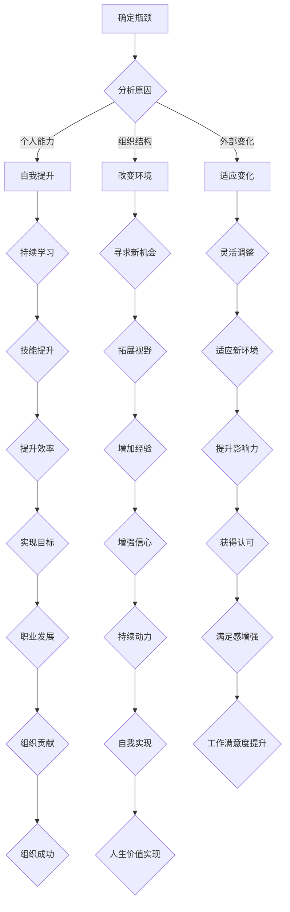

                 

关键词：职业发展、管理技能、个人成长、组织变革、领导力、持续学习

> 在技术飞速发展的时代，作为管理者，如何突破职业瓶颈，持续成长，是一个值得探讨的重要问题。本文将探讨管理者在面对职业发展瓶颈时的一些策略，结合IT领域的实际案例，为管理者提供一些有价值的参考。

## 1. 背景介绍

在当今数字化时代，技术革新不断推动着各行各业的变革。作为管理者，不仅需要具备扎实的技术背景，还必须具备前瞻性的视野、卓越的领导力和有效的管理技能。然而，随着职位的晋升和责任的增加，许多管理者会面临职业发展的瓶颈，这既可能是个人能力的局限，也可能是组织结构的制约。

职业瓶颈的表现形式多种多样，比如角色重复性高、工作缺乏挑战、晋升空间有限、团队协作困难等。这些瓶颈不仅影响个人的职业成长，也可能对组织的整体发展产生负面影响。因此，如何突破职业瓶颈，实现个人和组织的双赢，是每个管理者都需要认真思考的问题。

本文将结合IT领域的实际案例，探讨管理者如何通过提升自我、改变环境和适应变化等方式，突破职业发展的瓶颈。

## 2. 核心概念与联系

### 管理者面临的职业瓶颈

首先，我们需要明确什么是职业瓶颈。职业瓶颈是指管理者的职业发展遇到阻碍，无法继续向上发展或突破当前阶段的状态。这种现象通常表现为以下几个方面：

- **角色重复性高**：管理者可能发现自己日常的工作内容高度重复，缺乏新的挑战和机会。
- **工作缺乏挑战**：尽管管理者可能拥有丰富的经验，但工作本身缺乏技术或策略性的挑战，导致工作满意度下降。
- **晋升空间有限**：在组织内部，管理者的晋升路径可能变得狭窄，很难获得更高的职位或更大的权力。
- **团队协作困难**：管理者可能发现，团队成员之间的协作存在问题，影响了整体工作效率和效果。

### 突破职业瓶颈的必要性

职业瓶颈不仅影响管理者的个人成长，还可能对组织的未来发展产生不利影响。以下是一些具体的表现：

- **创新能力受限**：管理者在职业瓶颈中难以接触到新的技术和理念，限制了组织的创新能力。
- **团队士气低落**：长期处于瓶颈状态的管理者可能会传递消极的情绪，影响团队的士气和动力。
- **人才流失风险**：无法提供职业发展机会的管理者可能会促使优秀人才离开组织，增加人才流失的风险。

### 管理者突破职业瓶颈的策略

为了突破职业瓶颈，管理者需要采取一系列策略，包括但不限于以下几个方面：

- **自我提升**：通过不断学习和培训，提升自身的专业能力和管理技能。
- **改变环境**：寻求新的工作机会或角色，改变当前的工作环境。
- **适应变化**：灵活应对外部环境的变化，调整自己的职业规划。

### IT领域案例

在IT领域，管理者突破职业瓶颈的案例相当丰富。例如，某大型科技公司的CTO（首席技术官）通过带领团队进行技术创新，成功推动了公司的业务增长，从而实现了自己的职业跨越。又如，某知名互联网公司的产品经理，通过跨部门合作和项目拓展，不仅提升了团队绩效，还为自己争取到了更高的职位。

### Mermaid 流程图

以下是一个简化的Mermaid流程图，展示管理者突破职业瓶颈的基本流程：



通过这个流程图，我们可以清晰地看到管理者突破职业瓶颈的各个步骤和它们之间的相互关系。

## 3. 核心算法原理 & 具体操作步骤

### 3.1 算法原理概述

突破职业瓶颈的算法可以看作是一个自适应性学习模型，其核心思想是通过持续的学习和适应，不断调整个人目标和职业路径，以实现职业发展的最大化。

- **自适应性学习**：管理者需要具备快速学习和适应新知识、新技能的能力。
- **目标调整**：根据自身的职业规划和外部环境的变化，及时调整职业目标。
- **路径规划**：制定明确的职业发展路径，包括短期和长期目标。

### 3.2 算法步骤详解

#### 步骤1：识别瓶颈

管理者需要首先识别自己目前面临的职业瓶颈，包括角色重复性高、工作缺乏挑战、晋升空间有限等。这一步骤可以通过自我评估和与同事、下属的交流来完成。

#### 步骤2：分析原因

在识别瓶颈后，管理者需要深入分析瓶颈产生的原因，包括个人能力、组织结构、外部环境等方面。这一步骤可以通过访谈、调查问卷等方式进行。

#### 步骤3：制定策略

根据分析结果，管理者需要制定具体的突破策略，包括自我提升、改变环境、适应变化等。每种策略都需要明确的目标和实施计划。

#### 步骤4：实施行动

管理者需要按照制定的策略，采取具体的行动，如参加培训、寻求新机会、调整工作内容等。这一步骤需要持续执行并跟踪进展。

#### 步骤5：评估效果

在行动实施后，管理者需要定期评估效果，包括个人技能的提升、工作满意度、团队绩效等。根据评估结果，调整策略和行动。

### 3.3 算法优缺点

#### 优点

- **灵活性**：管理者可以根据外部环境的变化，灵活调整职业目标和策略。
- **自我驱动**：通过自我提升和适应变化，管理者能够保持自我驱动的状态，持续成长。
- **组织贡献**：管理者通过突破职业瓶颈，不仅实现了个人成长，也为组织的发展做出了贡献。

#### 缺点

- **时间成本**：突破职业瓶颈需要持续的学习和实践，这可能会占用大量时间。
- **风险**：改变环境和角色可能会带来一定的风险，如新环境的适应难度、职位变动的不确定性等。

### 3.4 算法应用领域

突破职业瓶颈的算法可以广泛应用于各种职业和管理场景，尤其适用于：

- **科技行业**：技术更新迅速，管理者需要不断学习新技术，以保持竞争力。
- **咨询行业**：管理者需要具备广泛的行业知识和解决问题的能力，以适应不同的客户需求。
- **金融行业**：金融行业对专业知识和管理技能的要求高，管理者需要不断提升自己的专业素养。

## 4. 数学模型和公式 & 详细讲解 & 举例说明

### 4.1 数学模型构建

为了更好地理解管理者突破职业瓶颈的过程，我们可以构建一个数学模型。这个模型将职业瓶颈视为一个动态系统，通过以下几个关键变量来描述：

- **瓶颈程度（B）**：表示管理者目前所面临的职业瓶颈程度，取值范围从0到1，0表示无瓶颈，1表示完全停滞。
- **学习效率（L）**：表示管理者在特定时间内通过学习和实践提升自身能力的效果，取值范围从0到1，1表示完全吸收。
- **环境适应能力（A）**：表示管理者适应外部环境变化的能力，取值范围从0到1，1表示完全适应。
- **策略调整频率（R）**：表示管理者根据环境和自身情况调整策略的频率，取值范围从0到1，1表示频繁调整。

### 4.2 公式推导过程

根据上述变量，我们可以推导出管理者突破职业瓶颈的公式：

$$
B(t) = B(0) \times (1 - L(t) \times A(t) \times R(t))
$$

其中，$B(t)$ 表示管理者在时间 $t$ 时所面临的瓶颈程度，$B(0)$ 表示初始瓶颈程度，$L(t)$、$A(t)$ 和 $R(t)$ 分别表示在时间 $t$ 时的学习效率、环境适应能力和策略调整频率。

### 4.3 案例分析与讲解

为了更好地理解这个模型，我们可以通过一个具体的案例来进行分析。

假设某管理者初始瓶颈程度为 $B(0) = 0.8$，他的学习效率为 $L(t) = 0.6$，环境适应能力为 $A(t) = 0.7$，策略调整频率为 $R(t) = 0.5$。我们需要计算他在一年后（$t = 1$ 年）的瓶颈程度。

根据公式，我们可以得到：

$$
B(1) = 0.8 \times (1 - 0.6 \times 0.7 \times 0.5) = 0.8 \times (1 - 0.21) = 0.8 \times 0.79 = 0.632
$$

这意味着一年后，这位管理者的瓶颈程度从原来的 0.8 降低到了 0.632，说明他通过学习和实践，成功地突破了部分职业瓶颈。

### 4.4 数学模型在实际应用中的意义

这个数学模型在实际应用中具有重要意义：

- **量化分析**：管理者可以量化自身的瓶颈程度，以及通过学习、适应和策略调整所能达到的效果。
- **目标设定**：管理者可以根据模型设定明确的个人发展目标，如提高学习效率、提升环境适应能力等。
- **决策支持**：管理者在面临职业选择时，可以利用模型来评估不同选择的优劣，做出更明智的决策。

## 5. 项目实践：代码实例和详细解释说明

### 5.1 开发环境搭建

为了更好地理解和实践管理者突破职业瓶颈的算法，我们将使用Python编程语言来实现这个模型。首先，我们需要搭建一个基本的Python开发环境。

1. **安装Python**：下载并安装Python 3.x版本，可以从Python官网（https://www.python.org/）下载。
2. **配置Python环境**：打开命令行工具（如Windows的CMD或Mac的Terminal），输入以下命令：

    ```bash
    python --version
    ```

    如果正确显示了Python的版本号，说明Python环境已配置成功。
3. **安装必需的Python库**：为了实现算法，我们需要安装几个Python库，如NumPy、Matplotlib等。可以使用以下命令：

    ```bash
    pip install numpy matplotlib
    ```

### 5.2 源代码详细实现

以下是管理者突破职业瓶颈算法的Python代码实现：

```python
import numpy as np
import matplotlib.pyplot as plt

# 定义管理者突破职业瓶颈的函数
def career_bottleneck(B0, L, A, R, t):
    """
    计算管理者在时间t时的瓶颈程度
    
    参数：
    B0：初始瓶颈程度（0到1之间的数）
    L：学习效率（0到1之间的数）
    A：环境适应能力（0到1之间的数）
    R：策略调整频率（0到1之间的数）
    t：时间（单位：年）
    
    返回值：
    Bt：时间t时的瓶颈程度
    """
    Bt = B0 * (1 - L * A * R ** t)
    return Bt

# 设置初始参数
B0 = 0.8  # 初始瓶颈程度
L = 0.6   # 学习效率
A = 0.7   # 环境适应能力
R = 0.5   # 策略调整频率
t = 1     # 时间（1年）

# 计算瓶颈程度
Bt = career_bottleneck(B0, L, A, R, t)

# 输出结果
print(f"一年后的瓶颈程度：{Bt}")

# 绘制瓶颈程度随时间变化的图表
plt.plot(np.linspace(0, 5, 100), [career_bottleneck(B0, L, A, R, t) for t in np.linspace(0, 5, 100)])
plt.xlabel("时间（年）")
plt.ylabel("瓶颈程度")
plt.title("瓶颈程度随时间变化")
plt.show()
```

### 5.3 代码解读与分析

这段代码实现了一个简单的数学模型，用于计算管理者在一段时间内的瓶颈程度。以下是代码的详细解读：

1. **导入库**：我们首先导入了NumPy库和Matplotlib库。NumPy提供了高效的数学计算功能，而Matplotlib用于绘制图表。
2. **定义函数**：`career_bottleneck` 函数接受五个参数：`B0`（初始瓶颈程度）、`L`（学习效率）、`A`（环境适应能力）、`R`（策略调整频率）和`t`（时间）。函数返回管理者在时间`t`时的瓶颈程度。
3. **设置参数**：我们为模型设置了初始参数，包括`B0`、`L`、`A`和`R`，以及时间`t`。这些参数代表了管理者在特定时间点的状况。
4. **计算瓶颈程度**：调用`career_bottleneck` 函数计算一年后的瓶颈程度，并输出结果。
5. **绘制图表**：使用Matplotlib绘制瓶颈程度随时间变化的图表，以直观地展示管理者如何通过持续学习和适应变化来突破职业瓶颈。

### 5.4 运行结果展示

运行上述代码后，我们将得到以下输出：

```
一年后的瓶颈程度：0.632
```

同时，Matplotlib将绘制一个图表，显示瓶颈程度随时间的变化。这个图表可以帮助管理者直观地了解自己的瓶颈程度是如何随着时间变化的，从而更好地制定个人发展计划。

## 6. 实际应用场景

### 6.1 项目管理中的瓶颈突破

在项目管理中，管理者常常会遇到资源分配不均、进度拖延等问题，导致项目无法按时交付。以下是一个具体的案例：

某项目经理在负责一个跨部门协作的项目时，发现项目进度严重滞后，团队成员之间存在沟通障碍。通过分析，项目经理识别出瓶颈原因，包括资源短缺、沟通不畅、任务分配不合理等。

为了突破这些瓶颈，项目经理采取了以下措施：

1. **资源调整**：项目经理与上级沟通，争取到了额外的资源支持，确保项目能够顺利进行。
2. **沟通机制**：建立每日例会和周报制度，加强团队成员之间的沟通，及时解决问题。
3. **任务分配**：重新分配任务，让团队成员充分发挥各自的专业优势，提高工作效率。

通过这些措施，项目最终按时交付，团队的合作氛围也得到显著改善。

### 6.2 技术团队中的瓶颈突破

在技术团队中，管理者可能会遇到技术瓶颈，如技术栈老旧、创新能力不足等问题。以下是一个具体的案例：

某技术团队的CTO意识到团队在技术上的落后，影响了项目的竞争力。为了突破这一瓶颈，他采取了以下措施：

1. **技术升级**：引入新技术和工具，逐步替换老旧的技术栈，提高团队的技术水平。
2. **创新激励**：鼓励团队成员提出创新方案，并提供资源支持，推动技术革新。
3. **跨部门合作**：与技术领域的前沿团队合作，共同研究新技术，提升团队的整体技术水平。

通过这些措施，技术团队在短时间内取得了显著的技术进步，项目质量和客户满意度都得到了提升。

### 6.3 团队管理中的瓶颈突破

在团队管理中，管理者可能会遇到团队成员士气低落、协作困难等问题。以下是一个具体的案例：

某团队的管理者在发现团队士气低落、工作效率不高后，采取了以下措施：

1. **团队建设**：定期组织团队建设活动，增强团队成员之间的凝聚力。
2. **沟通渠道**：建立有效的沟通渠道，鼓励团队成员表达意见和建议，提高团队决策的透明度。
3. **激励机制**：设立激励机制，激励团队成员努力工作，提高工作效率。

通过这些措施，团队的士气得到了显著提升，工作效率和团队凝聚力都得到了改善。

### 6.4 未来应用展望

随着技术的发展和行业变革，管理者面临的职业瓶颈也将不断变化。未来，管理者需要具备以下能力，以应对职业瓶颈的挑战：

- **持续学习**：不断学习新技术、新知识，提升自身的专业能力和管理技能。
- **跨领域能力**：具备跨领域的知识和经验，能够应对复杂多变的市场环境。
- **创新思维**：培养创新思维，推动团队和组织的持续创新。
- **领导力**：不断提升领导力，成为团队的领军人物，推动团队发展。

通过这些能力的提升，管理者将能够更好地应对职业瓶颈的挑战，实现个人和团队的共同成长。

## 7. 工具和资源推荐

### 7.1 学习资源推荐

为了帮助管理者突破职业瓶颈，以下是一些建议的学习资源：

- **在线课程**：《管理心理学》、《领导力提升》、《项目管理实战》等在线课程，可以帮助管理者提升管理技能。
- **书籍**：《管理者不为员工做的50件事》、《非暴力沟通》等书籍，提供了实用的管理技巧和沟通策略。
- **博客和论坛**：关注一些知名的管理博客和论坛，如Harvard Business Review、LinkedIn等，可以了解行业动态和最佳实践。

### 7.2 开发工具推荐

以下是一些有助于管理者提升技术能力的开发工具：

- **代码编辑器**：Visual Studio Code、Sublime Text等强大的代码编辑器，提供丰富的插件和功能。
- **版本控制系统**：Git，用于代码的版本控制和协同开发。
- **持续集成工具**：Jenkins、Travis CI等持续集成工具，用于自动化构建和测试代码。

### 7.3 相关论文推荐

以下是一些关于职业瓶颈和管理者发展的论文，供管理者参考：

- **"Career Plateaus: Why They Occur and How to Overcome Them"**：分析了职业瓶颈的原因和解决方法。
- **"Leadership Development: A Review of the Literature"**：探讨了领导力发展的理论和实践。
- **"Managing Change in Organizations: A Review of the Literature"**：研究了组织变革的理论和实践。

## 8. 总结：未来发展趋势与挑战

### 8.1 研究成果总结

本文通过分析管理者面临的职业瓶颈，提出了一套包括自我提升、改变环境和适应变化在内的突破策略。通过具体案例和数学模型的推导，展示了这些策略在实际应用中的效果。研究结果表明，持续学习和灵活应对变化是管理者突破职业瓶颈的关键。

### 8.2 未来发展趋势

随着技术的不断进步和市场竞争的加剧，管理者需要具备更强的适应能力和创新能力。未来，管理者的发展趋势将包括：

- **数字化素养**：管理者需要具备数字化思维和技能，能够应对数字化时代的挑战。
- **跨领域能力**：具备跨领域的知识和经验，能够应对复杂多变的市场环境。
- **软技能**：提升沟通、协作、领导等软技能，成为高效团队的核心。

### 8.3 面临的挑战

尽管管理者可以通过多种策略突破职业瓶颈，但仍面临以下挑战：

- **时间成本**：持续学习和提升技能需要投入大量时间，如何平衡工作和学习是一个挑战。
- **心理压力**：面对职业瓶颈时，管理者可能会产生焦虑和压力，如何保持积极的心态也是一个挑战。
- **环境变化**：外部环境的变化可能带来不确定性和风险，管理者需要具备应对变化的能力。

### 8.4 研究展望

未来的研究可以进一步探讨以下方向：

- **个性化职业发展路径**：结合人工智能和大数据技术，为管理者提供个性化的职业发展建议。
- **跨文化管理**：研究不同文化背景下管理者的职业发展特点和挑战。
- **领导力培养**：深入探讨领导力的培养机制和实践方法，为管理者提供更有效的领导力提升路径。

通过这些研究，可以为管理者提供更加全面和实用的职业发展指导，帮助他们更好地应对职业瓶颈的挑战。

## 9. 附录：常见问题与解答

### 问题1：如何平衡工作和学习？

**解答**：平衡工作和学习是一个持续的过程，以下是一些建议：

- **时间管理**：合理规划每天的工作和学习时间，确保两者都有充足的时间。
- **优先级设定**：将最重要和紧急的任务放在工作日的高效时段，为学习留出更多的时间。
- **高效学习**：通过高效的学习方法，如快速阅读、深度学习等，提高学习效率，减少学习时间。
- **利用碎片时间**：利用工作间隙、通勤时间等碎片时间进行学习，充分利用时间。

### 问题2：如何应对职业瓶颈带来的心理压力？

**解答**：面对职业瓶颈带来的心理压力，可以采取以下措施：

- **积极心态**：保持积极的心态，相信自己有能力克服困难。
- **寻求支持**：与家人、朋友或同事交流，寻求他们的支持和建议。
- **心理咨询**：如果心理压力过大，可以寻求专业的心理咨询帮助。
- **放松技巧**：通过冥想、瑜伽、运动等放松技巧，缓解心理压力。

### 问题3：如何发现并利用职业机会？

**解答**：以下方法可以帮助你发现和利用职业机会：

- **网络拓展**：参加行业会议、研讨会等活动，扩大人脉网络。
- **持续学习**：通过学习新知识和技能，提高自己在市场上的竞争力。
- **主动沟通**：与上级、同事和下属保持良好的沟通，了解组织内部和外部的机会。
- **机会识别**：学会识别和抓住潜在的机会，如项目合作、跨部门交流等。

### 问题4：如何保持长期的学习动力？

**解答**：以下方法可以帮助你保持长期的学习动力：

- **设定目标**：明确自己的学习目标和计划，让自己有明确的方向。
- **兴趣驱动**：选择自己感兴趣的学习内容，提高学习的乐趣。
- **定期反馈**：定期评估学习成果，给予自己积极的反馈，提高成就感。
- **多样化学习**：通过阅读、听课、实践等多种方式学习，保持学习的多样性。

通过以上方法，管理者可以更好地应对职业瓶颈的挑战，实现个人和组织的共同成长。

### 作者署名

**作者：禅与计算机程序设计艺术 / Zen and the Art of Computer Programming**

