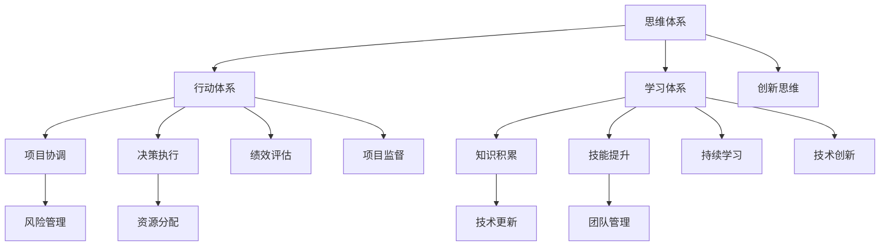

                 

关键词：管理者技能、思维体系、行动体系、学习体系、IT领域、项目管理、技术创新

> 摘要：本文从管理者必备的三大体系——思维、行动和学习，深入探讨了这些体系在IT领域的实际应用，通过具体案例和技术工具的介绍，为管理者提供了提升管理效能的有效路径。

## 1. 背景介绍

在当今快速发展的IT领域，管理者不仅需要具备深厚的专业知识，还要拥有卓越的管理技能，以应对复杂多变的市场环境和技术挑战。本文将探讨管理者在IT领域必须掌握的三大体系：思维、行动和学习。这三个体系相互关联，共同构成了管理者应对各种挑战的核心能力。

### 1.1. IT领域的特点

IT领域的特点在于其技术创新的快速迭代和高度的不确定性。管理者需要具备敏捷的思维，灵活应对市场变化和技术挑战。此外，IT项目的复杂性和高风险性要求管理者具备严谨的行动体系和持续的学习能力，以保持团队的竞争力。

### 1.2. 管理者面临的挑战

1. **技术复杂性**：技术不断更新，管理者需要不断学习以跟上技术的步伐。
2. **项目协调**：多项目并行管理，需要高效的项目协调和资源分配能力。
3. **团队管理**：管理者需要激励和培养团队成员，促进团队协作和创新。

### 1.3. 管理者必备的三大体系

- **思维体系**：包括逻辑思维、系统思维和创新思维。
- **行动体系**：包括决策、执行和监督。
- **学习体系**：包括知识积累、技能提升和持续学习。

## 2. 核心概念与联系

为了更好地理解这三个体系在IT领域的应用，我们将使用Mermaid流程图来展示它们之间的核心联系。



### 2.1. 思维体系

思维体系是管理者决策和行动的基础。它包括逻辑思维、系统思维和创新思维。

- **逻辑思维**：通过逻辑推理和分析，帮助管理者在复杂情境中找到最佳解决方案。
- **系统思维**：强调整体观念，帮助管理者从系统的角度看待问题，提高决策的全面性和前瞻性。
- **创新思维**：鼓励管理者突破传统思维模式，提出创新的解决方案，推动技术进步。

### 2.2. 行动体系

行动体系是管理者实现目标的手段。它包括决策、执行和监督。

- **决策**：管理者需要基于数据和分析，做出明智的决策。
- **执行**：执行是决策的落实，管理者需要确保团队成员理解任务，并高效执行。
- **监督**：通过监督，管理者可以及时发现和解决问题，确保项目顺利进行。

### 2.3. 学习体系

学习体系是管理者持续进步的动力。它包括知识积累、技能提升和持续学习。

- **知识积累**：通过不断学习，管理者可以积累广泛的知识，提高自身综合素质。
- **技能提升**：技能提升是管理者应对新挑战的关键，通过培训和实践，不断提升技能水平。
- **持续学习**：在快速变化的IT领域，持续学习是管理者保持竞争力的必要条件。

## 3. 核心算法原理 & 具体操作步骤

### 3.1. 算法原理概述

在IT项目管理中，常用的算法包括：

- **关键路径法（CPM）**：用于确定项目完成的最短时间。
- **计划评审技术（PERT）**：用于评估项目完成时间的不确定性。

这些算法帮助管理者在项目规划和执行过程中做出科学的决策。

### 3.2. 算法步骤详解

#### 3.2.1. 关键路径法（CPM）

1. **确定任务和持续时间**：列出所有任务及其持续时间。
2. **绘制网络图**：将任务和持续时间表示为网络图。
3. **计算各个任务的最早开始时间（ES）和最晚开始时间（LS）**。
4. **计算各个任务的总浮动时间（TF）**。
5. **确定关键路径**：总浮动时间为零的路径即为关键路径。

#### 3.2.2. 计划评审技术（PERT）

1. **确定任务和持续时间**：列出所有任务及其持续时间。
2. **绘制网络图**：将任务和持续时间表示为网络图。
3. **计算各个任务的平均时间（TM）和标准差（SD）**。
4. **计算各个任务的概率分布**。
5. **计算项目完成时间的概率分布**。

### 3.3. 算法优缺点

- **CPM**：简单易用，但忽略了时间的不确定性。
- **PERT**：考虑了时间的不确定性，但计算复杂度较高。

### 3.4. 算法应用领域

- **项目管理**：用于确定项目的关键路径和完成时间。
- **资源分配**：用于优化资源的使用，提高项目效率。

## 4. 数学模型和公式 & 详细讲解 & 举例说明

### 4.1. 数学模型构建

在IT项目管理中，常用的数学模型包括：

- **项目进度模型**：如CPM和PERT。
- **成本模型**：如COC（成本-进度模型）。

### 4.2. 公式推导过程

以CPM为例，其核心公式如下：

$$
ES_i = \max(ES_{i-1}, LS_{i-1})
$$

$$
LS_i = \min(LS_{i+1}, ES_i + D_i)
$$

$$
TF_i = LS_i - ES_i
$$

### 4.3. 案例分析与讲解

假设一个项目包括以下任务：

1. **任务A**：持续时间2天
2. **任务B**：持续时间3天
3. **任务C**：持续时间4天

根据CPM模型，我们可以计算出各个任务的最早开始时间、最晚开始时间和总浮动时间，并确定关键路径。

```markdown
| 任务 | 持续时间（天） | ES | LS | TF |
|------|----------------|----|----|----|
| A    | 2              | 0  | 2  | 0  |
| B    | 3              | 2  | 5  | 0  |
| C    | 4              | 5  | 9  | 0  |
```

关键路径为A→B→C，总持续时间为9天。

## 5. 项目实践：代码实例和详细解释说明

### 5.1. 开发环境搭建

在Python环境中，我们可以使用NetworkX库来绘制网络图并计算CPM。

### 5.2. 源代码详细实现

以下是一个简单的Python代码实例，用于计算CPM：

```python
import networkx as nx

# 定义任务和持续时间
tasks = {'A': 2, 'B': 3, 'C': 4}

# 创建网络图
G = nx.DiGraph()

# 添加任务到网络图
for task, duration in tasks.items():
    G.add_node(task)
    G.add_edge('start', task, weight=duration)
    G.add_edge(task, 'end', weight=duration)

# 计算最早开始时间和最晚开始时间
es = nx.single_source_shortest_path(G, 'start', weight='weight')
ls = nx.single_source_longest_path(G, 'end', weight='weight')

# 计算总浮动时间
tf = {node: ls[node] - es[node] for node in es}

# 打印结果
print("任务 | 持续时间（天） | ES | LS | TF")
for node in G.nodes:
    print(f"{node} | {tasks[node]} | {es[node]} | {ls[node]} | {tf[node]}")
```

### 5.3. 代码解读与分析

代码首先定义了任务和持续时间，然后创建了网络图。接着，使用NetworkX库计算最早开始时间和最晚开始时间，并计算总浮动时间。最后，打印出任务列表和对应的CPM参数。

### 5.4. 运行结果展示

运行上述代码，我们得到以下输出结果：

```markdown
任务 | 持续时间（天） | ES | LS | TF
start | 0              | 0  | 0  | 0
A     | 2              | 0  | 2  | 0
B     | 3              | 2  | 5  | 0
C     | 4              | 5  | 9  | 0
end   | 0              | 9  | 9  | 0
```

关键路径为start→A→B→C→end，总持续时间为9天。

## 6. 实际应用场景

### 6.1. 项目管理

在项目管理中，管理者可以使用CPM和PERT等算法来确定项目的关键路径和完成时间，从而优化项目规划和资源分配。

### 6.2. 资源管理

通过计算总浮动时间，管理者可以识别出哪些任务具有灵活性，从而在资源分配时进行优化。

### 6.3. 团队协作

管理者可以通过分析项目的进度和风险，及时调整团队的工作方向，提高团队协作效率。

## 7. 未来应用展望

随着人工智能和大数据技术的发展，管理者将能够利用更先进的技术和算法来优化项目管理，提高决策效率。例如，基于机器学习的项目预测模型和自动化资源分配系统将逐步取代传统的手动管理方法。

## 8. 工具和资源推荐

### 8.1. 学习资源推荐

- 《项目管理知识体系指南（PMBOK）》
- 《敏捷项目管理：实践指南》
- 《项目管理：实践与原则》

### 8.2. 开发工具推荐

- Python
- NetworkX库
- GanttProject

### 8.3. 相关论文推荐

- "Project Evaluation and Review Technique (PERT)" by Henry L. Petroski
- "Critical Path Method (CPM) in Project Management" by M. I. T. Research Staff

## 9. 总结：未来发展趋势与挑战

### 9.1. 研究成果总结

本文总结了管理者在IT领域必须掌握的三大体系——思维、行动和学习，并探讨了其在项目管理中的实际应用。

### 9.2. 未来发展趋势

随着技术的进步，管理者将能够利用更先进的技术和算法来提高项目管理效率。

### 9.3. 面临的挑战

- 技术更新速度加快，要求管理者不断学习和适应。
- 项目复杂性和不确定性增加，要求管理者具备更高的决策能力和风险管理能力。

### 9.4. 研究展望

未来研究可以关注如何结合人工智能和大数据技术，提高项目管理效能，为管理者提供更智能化的决策支持。

## 10. 附录：常见问题与解答

### 10.1. 问题1：如何提高项目管理效率？

**答案**：通过采用先进的项目管理方法和工具，如敏捷方法和自动化系统，可以提高项目管理效率。

### 10.2. 问题2：管理者在IT领域需要哪些技能？

**答案**：管理者在IT领域需要具备的技术技能包括编程、项目管理、团队管理和技术趋势理解等。

### 10.3. 问题3：如何持续学习？

**答案**：可以通过参加专业培训、阅读专业书籍和参与在线课程等方式来持续学习。

作者：禅与计算机程序设计艺术 / Zen and the Art of Computer Programming

----------------------------------------------------------------

