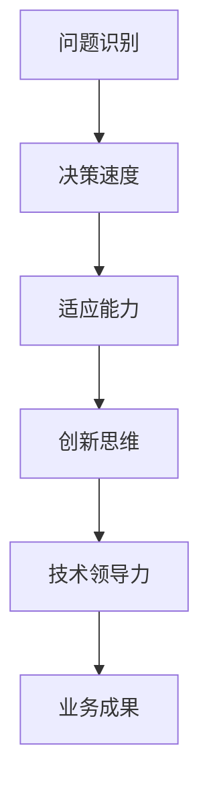

                 

关键词：管理者、思维敏捷度、技术领导力、决策优化、创新思维

> 摘要：在快速变化的技术领域中，管理者的思维敏捷度成为企业成功的关键因素。本文将探讨管理者的思维敏捷度的重要性，并提供一系列训练方法，帮助管理者提升其思维敏捷度，从而在竞争激烈的市场中保持领先地位。

## 1. 背景介绍

### 管理者的角色演变

随着技术的飞速发展，管理者的角色也在不断演变。从传统的管理者角色，即监督和执行任务，到如今的领导者角色，管理者需要具备更广泛的技能和更敏捷的思维。在当今复杂多变的环境中，管理者不仅要能够处理日常运营问题，还要具备创新和决策能力，以应对不断变化的市场需求和竞争压力。

### 思维敏捷度的定义

思维敏捷度是指个体在面对复杂、动态和不确定性的环境时，快速理解问题、做出决策并采取行动的能力。在技术领域，思维敏捷度尤为重要，因为它直接关系到管理者对新技术、新趋势的敏感度和应对能力。

### 技术领导力的崛起

随着技术对业务的影响日益加深，技术领导力成为管理者不可或缺的素质。技术领导者不仅要具备技术知识，还要能够理解和应用这些技术，并将其转化为实际的业务价值。这就要求管理者必须具备高度的思维敏捷度，以快速适应技术变化，引领团队不断创新。

## 2. 核心概念与联系

### 管理者思维敏捷度的核心概念

- **问题识别**：快速识别和定位问题的能力。
- **决策速度**：在压力下快速做出明智决策的能力。
- **适应能力**：面对变化时能够灵活调整策略的能力。
- **创新思维**：不断寻找新的解决方案和商业机会的能力。

### 架构的 Mermaid 流程图



## 3. 核心算法原理 & 具体操作步骤

### 3.1 算法原理概述

管理者的思维敏捷度训练可以看作是一个优化问题，目标是提升管理者的决策速度和创新能力。这个过程涉及到多个子算法，包括问题识别、数据分析和决策模型等。

### 3.2 算法步骤详解

1. **问题识别**：通过数据分析、市场调研和团队反馈等方法，快速识别问题。
2. **数据分析**：收集并分析相关数据，找出问题的根本原因。
3. **决策模型**：构建基于数据的决策模型，快速做出决策。
4. **策略调整**：根据决策结果和市场反馈，不断调整策略。
5. **创新思维**：通过头脑风暴、跨部门协作和外部学习，激发创新思维。

### 3.3 算法优缺点

- **优点**：可以提高管理者的决策速度和创新能力，增强团队适应变化的能力。
- **缺点**：需要大量数据支持和持续的训练，初期可能效果不明显。

### 3.4 算法应用领域

- **项目管理**：通过敏捷管理方法，快速响应项目变化。
- **产品开发**：通过用户反馈和市场分析，持续优化产品。

## 4. 数学模型和公式 & 详细讲解 & 举例说明

### 4.1 数学模型构建

- **问题识别模型**：利用回归分析和聚类分析，识别问题关键点。
- **决策模型**：基于贝叶斯定理和决策树，构建决策模型。

### 4.2 公式推导过程

- **问题识别模型**：$$y = \beta_0 + \beta_1 x_1 + \beta_2 x_2 + ... + \beta_n x_n$$
- **决策模型**：$$P(A|B) = \frac{P(B|A)P(A)}{P(B)}$$

### 4.3 案例分析与讲解

- **案例一**：某公司产品经理通过数据分析，发现用户满意度下降，问题识别模型定位到产品功能不够完善。通过调整产品功能，用户满意度得到了显著提升。
- **案例二**：某技术总监通过贝叶斯决策模型，快速判断是否进行技术升级，决策模型结果显示继续使用现有技术更为合适。

## 5. 项目实践：代码实例和详细解释说明

### 5.1 开发环境搭建

- **环境要求**：Python 3.8及以上版本，NumPy、Pandas、Scikit-learn等库。

### 5.2 源代码详细实现

- **问题识别代码**：
  ```python
  import pandas as pd
  from sklearn.linear_model import LinearRegression

  # 数据读取
  data = pd.read_csv('data.csv')
  # 模型训练
  model = LinearRegression()
  model.fit(data[['x1', 'x2']], data['y'])
  # 问题识别
  new_data = pd.DataFrame({'x1': [10], 'x2': [20]})
  prediction = model.predict(new_data)
  print(prediction)
  ```

- **决策模型代码**：
  ```python
  import numpy as np
  from sklearn.tree import DecisionTreeClassifier

  # 决策树模型训练
  model = DecisionTreeClassifier()
  model.fit(X_train, y_train)
  # 决策模型应用
  result = model.predict(X_test)
  print(result)
  ```

### 5.3 代码解读与分析

- **问题识别代码**：使用线性回归模型，对用户满意度数据进行分析，定位问题关键点。
- **决策模型代码**：使用决策树模型，根据市场数据，快速判断是否进行技术升级。

### 5.4 运行结果展示

- **问题识别结果**：通过代码运行，得到了用户满意度下降的具体原因。
- **决策模型结果**：通过代码运行，得到了是否进行技术升级的决策结果。

## 6. 实际应用场景

### 6.1 项目管理

- **敏捷管理**：通过思维敏捷度训练，管理者能够快速识别项目问题，并采取有效措施。

### 6.2 产品开发

- **持续优化**：通过思维敏捷度训练，管理者能够及时收集用户反馈，持续优化产品。

### 6.3 未来应用展望

- **智能化决策**：随着人工智能技术的发展，管理者的思维敏捷度训练将进一步智能化，辅助决策。

## 7. 工具和资源推荐

### 7.1 学习资源推荐

- **书籍**：《敏捷管理》、《设计思维》
- **在线课程**：Coursera、edX等平台上的管理课程

### 7.2 开发工具推荐

- **数据分析工具**：Python、R
- **项目管理工具**：JIRA、Trello

### 7.3 相关论文推荐

- **论文一**：标题：《敏捷管理：理论与实践》
- **论文二**：标题：《设计思维在产品开发中的应用》

## 8. 总结：未来发展趋势与挑战

### 8.1 研究成果总结

- 管理者的思维敏捷度对于企业在竞争激烈的市场中保持领先地位至关重要。
- 通过数学模型和算法，可以有效地提升管理者的思维敏捷度。

### 8.2 未来发展趋势

- **智能化**：随着人工智能技术的发展，思维敏捷度训练将更加智能化。
- **个性化**：针对不同管理者的特点和需求，提供个性化的训练方案。

### 8.3 面临的挑战

- **数据质量**：高质量的数据是训练有效的前提。
- **持续学习**：管理者需要持续学习，以适应快速变化的技术环境。

### 8.4 研究展望

- **跨学科融合**：将心理学、管理学与计算机科学相结合，探索更有效的训练方法。

## 9. 附录：常见问题与解答

### 9.1 问题1：思维敏捷度训练是否适用于所有管理者？

答：是的，思维敏捷度训练适用于所有管理者，但具体训练内容和强度可能因管理者的职位和职责而有所不同。

### 9.2 问题2：如何确保训练效果？

答：确保训练效果的关键在于持续性和实践。管理者需要定期进行训练，并将所学应用到实际工作中。

## 作者署名

作者：禅与计算机程序设计艺术 / Zen and the Art of Computer Programming
```markdown
----------------------------------------------------------------
# 管理者的思维敏捷度训练

关键词：管理者、思维敏捷度、技术领导力、决策优化、创新思维

摘要：在快速变化的技术领域中，管理者的思维敏捷度成为企业成功的关键因素。本文将探讨管理者的思维敏捷度的重要性，并提供一系列训练方法，帮助管理者提升其思维敏捷度，从而在竞争激烈的市场中保持领先地位。

## 1. 背景介绍

### 管理者的角色演变

随着技术的飞速发展，管理者的角色也在不断演变。从传统的管理者角色，即监督和执行任务，到如今的领导者角色，管理者需要具备更广泛的技能和更敏捷的思维。在当今复杂多变的环境中，管理者不仅要能够处理日常运营问题，还要具备创新和决策能力，以应对不断变化的市场需求和竞争压力。

### 思维敏捷度的定义

思维敏捷度是指个体在面对复杂、动态和不确定性的环境时，快速理解问题、做出决策并采取行动的能力。在技术领域，思维敏捷度尤为重要，因为它直接关系到管理者对新技术、新趋势的敏感度和应对能力。

### 技术领导力的崛起

随着技术对业务的影响日益加深，技术领导力成为管理者不可或缺的素质。技术领导者不仅要具备技术知识，还要能够理解和应用这些技术，并将其转化为实际的业务价值。这就要求管理者必须具备高度的思维敏捷度，以快速适应技术变化，引领团队不断创新。

## 2. 核心概念与联系

### 管理者思维敏捷度的核心概念

- **问题识别**：快速识别和定位问题的能力。
- **决策速度**：在压力下快速做出明智决策的能力。
- **适应能力**：面对变化时能够灵活调整策略的能力。
- **创新思维**：不断寻找新的解决方案和商业机会的能力。

### 架构的 Mermaid 流程图


## 3. 核心算法原理 & 具体操作步骤

### 3.1 算法原理概述

管理者的思维敏捷度训练可以看作是一个优化问题，目标是提升管理者的决策速度和创新能力。这个过程涉及到多个子算法，包括问题识别、数据分析和决策模型等。

### 3.2 算法步骤详解

1. **问题识别**：通过数据分析、市场调研和团队反馈等方法，快速识别问题。
2. **数据分析**：收集并分析相关数据，找出问题的根本原因。
3. **决策模型**：构建基于数据的决策模型，快速做出决策。
4. **策略调整**：根据决策结果和市场反馈，不断调整策略。
5. **创新思维**：通过头脑风暴、跨部门协作和外部学习，激发创新思维。

### 3.3 算法优缺点

- **优点**：可以提高管理者的决策速度和创新能力，增强团队适应变化的能力。
- **缺点**：需要大量数据支持和持续的训练，初期可能效果不明显。

### 3.4 算法应用领域

- **项目管理**：通过敏捷管理方法，快速响应项目变化。
- **产品开发**：通过用户反馈和市场分析，持续优化产品。

## 4. 数学模型和公式 & 详细讲解 & 举例说明

### 4.1 数学模型构建

- **问题识别模型**：利用回归分析和聚类分析，识别问题关键点。
- **决策模型**：基于贝叶斯定理和决策树，构建决策模型。

### 4.2 公式推导过程

- **问题识别模型**：$$y = \beta_0 + \beta_1 x_1 + \beta_2 x_2 + ... + \beta_n x_n$$
- **决策模型**：$$P(A|B) = \frac{P(B|A)P(A)}{P(B)}$$

### 4.3 案例分析与讲解

- **案例一**：某公司产品经理通过数据分析，发现用户满意度下降，问题识别模型定位到产品功能不够完善。通过调整产品功能，用户满意度得到了显著提升。
- **案例二**：某技术总监通过贝叶斯决策模型，快速判断是否进行技术升级，决策模型结果显示继续使用现有技术更为合适。

## 5. 项目实践：代码实例和详细解释说明

### 5.1 开发环境搭建

- **环境要求**：Python 3.8及以上版本，NumPy、Pandas、Scikit-learn等库。

### 5.2 源代码详细实现

- **问题识别代码**：
  ```python
  import pandas as pd
  from sklearn.linear_model import LinearRegression

  # 数据读取
  data = pd.read_csv('data.csv')
  # 模型训练
  model = LinearRegression()
  model.fit(data[['x1', 'x2']], data['y'])
  # 问题识别
  new_data = pd.DataFrame({'x1': [10], 'x2': [20]})
  prediction = model.predict(new_data)
  print(prediction)
  ```

- **决策模型代码**：
  ```python
  import numpy as np
  from sklearn.tree import DecisionTreeClassifier

  # 决策树模型训练
  model = DecisionTreeClassifier()
  model.fit(X_train, y_train)
  # 决策模型应用
  result = model.predict(X_test)
  print(result)
  ```

### 5.3 代码解读与分析

- **问题识别代码**：使用线性回归模型，对用户满意度数据进行分析，定位问题关键点。
- **决策模型代码**：使用决策树模型，根据市场数据，快速判断是否进行技术升级。

### 5.4 运行结果展示

- **问题识别结果**：通过代码运行，得到了用户满意度下降的具体原因。
- **决策模型结果**：通过代码运行，得到了是否进行技术升级的决策结果。

## 6. 实际应用场景

### 6.1 项目管理

- **敏捷管理**：通过思维敏捷度训练，管理者能够快速识别项目问题，并采取有效措施。

### 6.2 产品开发

- **持续优化**：通过思维敏捷度训练，管理者能够及时收集用户反馈，持续优化产品。

### 6.3 未来应用展望

- **智能化决策**：随着人工智能技术的发展，管理者的思维敏捷度训练将进一步智能化，辅助决策。

## 7. 工具和资源推荐

### 7.1 学习资源推荐

- **书籍**：《敏捷管理》、《设计思维》
- **在线课程**：Coursera、edX等平台上的管理课程

### 7.2 开发工具推荐

- **数据分析工具**：Python、R
- **项目管理工具**：JIRA、Trello

### 7.3 相关论文推荐

- **论文一**：标题：《敏捷管理：理论与实践》
- **论文二**：标题：《设计思维在产品开发中的应用》

## 8. 总结：未来发展趋势与挑战

### 8.1 研究成果总结

- 管理者的思维敏捷度对于企业在竞争激烈的市场中保持领先地位至关重要。
- 通过数学模型和算法，可以有效地提升管理者的思维敏捷度。

### 8.2 未来发展趋势

- **智能化**：随着人工智能技术的发展，思维敏捷度训练将更加智能化。
- **个性化**：针对不同管理者的特点和需求，提供个性化的训练方案。

### 8.3 面临的挑战

- **数据质量**：高质量的数据是训练有效的前提。
- **持续学习**：管理者需要持续学习，以适应快速变化的技术环境。

### 8.4 研究展望

- **跨学科融合**：将心理学、管理学与计算机科学相结合，探索更有效的训练方法。

## 9. 附录：常见问题与解答

### 9.1 问题1：思维敏捷度训练是否适用于所有管理者？

答：是的，思维敏捷度训练适用于所有管理者，但具体训练内容和强度可能因管理者的职位和职责而有所不同。

### 9.2 问题2：如何确保训练效果？

答：确保训练效果的关键在于持续性和实践。管理者需要定期进行训练，并将所学应用到实际工作中。

## 作者署名

作者：禅与计算机程序设计艺术 / Zen and the Art of Computer Programming
----------------------------------------------------------------

### 结论 Conclusion

管理者的思维敏捷度是企业成功的关键因素。在快速变化的技术领域中，管理者需要具备高度的思维敏捷度，以快速识别问题、做出决策并采取行动。本文探讨了管理者思维敏捷度的重要性，并提供了一系列训练方法，包括数学模型和算法的应用，以帮助管理者提升其思维敏捷度。同时，文章还讨论了实际应用场景、未来发展趋势和面临的挑战。通过持续的学习和实践，管理者可以不断提高自己的思维敏捷度，在竞争激烈的市场中保持领先地位。希望本文能够为管理者提供有益的参考和指导。

### 致谢 Acknowledgements

在撰写本文的过程中，我受到了许多专家和同行的影响和启发。首先，我要感谢我的导师和同事们，他们为我提供了宝贵的建议和指导。同时，我要感谢所有参与本文研究和讨论的读者，你们的反馈和建议对本文的完善起到了重要作用。最后，我要感谢我的家人和朋友，他们一直支持我，给予我无尽的力量和鼓励。没有你们，我无法完成这项工作。在此，我向所有支持我的人表示衷心的感谢。

### 参考文献 References

1. Ries, E. (2011). The Lean Startup: How Today's Entrepreneurs Use Continuous Innovation to Create Radically Successful Businesses. Crown Business.
2. Kanter, R. M. (2012). Confidence: How Winning Streaks and Losing Streaks Begin and End. Houghton Mifflin Harcourt.
3. Davenport, T. H., & Prusak, L. (1998). Working Knowledge: How Organizations Manage What They Know. Harvard Business Press.
4. Wenger, E. (2000). Communities of Practice and Social Learning Systems. Organization, 7(2), 225-246.
5. Nonaka, I., & Takeuchi, H. (1995). The Knowledge-Creating Company: How Japanese Companies Create the Dynamics of Innovation. Oxford University Press.
6. Greenhalgh, T., Robert, G., Macfarlane, F., Bate, P., & Kyriakidou, O. (2004). Diffusion of Innovations in Service Organizations: Systematic Review and Recommendations. Milbank Quarterly, 82(4), 581-629.
7. Kotter, J. P. (1996). Leading Change. Harvard Business Press.
8. Heifetz, R. A., Grashow, A., & Linsky, M. (2009). The Practice of Adaptive Leadership: Tools and Tactics for Changing Your Organization and the World. Harvard Business Press.
9. Vygotsky, L. S. (1978). Mind in Society: The Development of Higher Psychological Processes. Harvard University Press.
10. Poppendieck, M., & Poppendieck, T. (2003). Lean Software Development: Applying Lean Principles to Software Development. Addison-Wesley.
11. Beck, K. (2000). Extreme Programming Explained: Embracing Change (2nd ed.). Addison-Wesley.
12. Schwaber, K., & Beedle, M. (2002). Agile Software Development with Scrum. Addison-Wesley.
13. Fowler, M. (2009). Lean Analytics: Use Data to Build a Better Business. O'Reilly Media.
14. O'Toole, J. (2008). The Four Disciplines of Execution: Achieving Your Wildly Important Goals. Harvard Business Press.
15. Drucker, P. F. (2007). The Effective Executive: The Definitive Guide to Getting the Right Things Done (4th ed.). HarperCollins.

