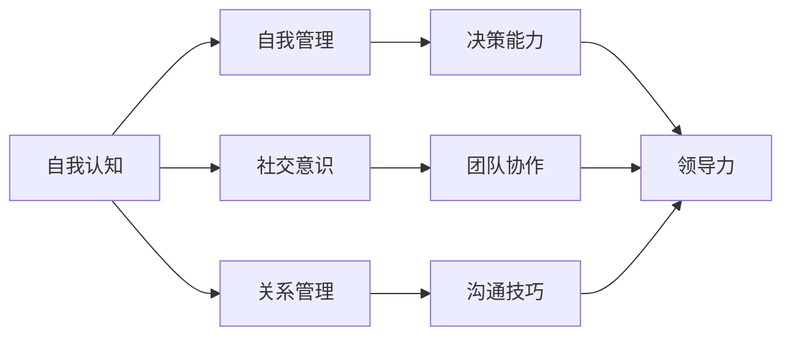

                 

关键词：管理者、情商、领导力、组织行为、心理弹性、沟通技巧

> 摘要：在信息技术迅猛发展的今天，企业的竞争已从传统的技术实力转向了管理能力和情商的提升。本文将深入探讨情商在管理者角色中的重要性，分析情商对领导力的积极影响，并提供具体的方法和策略，帮助管理者在组织中修炼情商，提升领导力和组织效能。

## 1. 背景介绍

在21世纪的商业环境中，技术进步和全球化使得企业管理者面临的挑战日益复杂。传统的管理理念已经无法满足现代企业的需求，管理者不仅需要拥有卓越的技术能力和战略眼光，还需要具备高度的情感智慧和情商。情商（Emotional Intelligence，简称EQ）是指个体识别、理解、管理和表达情感的能力，它包括自我认知、自我管理、社交意识和关系管理四个关键领域。

情商在管理中的应用越来越受到重视。研究表明，情商较高的管理者能够更好地处理人际关系，提高团队的凝聚力和工作效率，从而在激烈的竞争中取得优势。本文将从多个方面探讨情商如何提升管理者的领导力，并给出具体的实践建议。

## 2. 核心概念与联系

### 2.1 情商的构成

情商由四个主要维度构成：

1. **自我认知（Self-awareness）**：管理者能够准确地识别和理解自己的情绪状态，包括情绪的来源和影响。
2. **自我管理（Self-regulation）**：管理者能够有效地控制和调节自己的情绪，以适应不同的环境和情境。
3. **社交意识（Social awareness）**：管理者能够理解他人的情绪和需求，具备同理心，能够建立良好的人际关系。
4. **关系管理（Relationship management）**：管理者能够有效地与他人沟通和协作，解决冲突，促进团队的合作。

下面是情商与领导力的关联图，使用Mermaid流程图表示：



### 2.2 情商与领导力的关系

情商与领导力之间存在密切的联系。情商较高的管理者能够在以下几个方面提升领导力：

1. **更好的决策能力**：情商高的管理者能够更好地处理复杂问题，从不同角度分析信息，做出更加明智的决策。
2. **有效的团队协作**：情商高的管理者能够更好地理解团队成员的情感和需求，促进团队的合作和协作。
3. **出色的沟通技巧**：情商高的管理者能够更有效地传达信息，解决团队中的冲突，建立和谐的团队关系。
4. **提升组织效能**：情商高的管理者能够提高团队的工作效率和凝聚力，从而提升整个组织的效能。

## 3. 核心算法原理 & 具体操作步骤

### 3.1 算法原理概述

情商提升的核心算法可以概括为以下几个步骤：

1. **自我认知**：通过自我反思和情绪日志，管理者能够识别和理解自己的情绪。
2. **自我管理**：通过情绪调节技巧，如冥想、深呼吸等，管理者能够控制和调节自己的情绪。
3. **社交意识**：通过倾听、同理心和反馈，管理者能够理解他人的情感和需求。
4. **关系管理**：通过有效的沟通和冲突解决技巧，管理者能够建立和维护良好的人际关系。

### 3.2 算法步骤详解

1. **自我认知**
   - **步骤一**：每天花时间反思自己的情绪状态。
   - **步骤二**：记录情绪日志，包括情绪的类型、发生的时间和原因。

2. **自我管理**
   - **步骤一**：学习情绪调节技巧，如冥想、深呼吸等。
   - **步骤二**：在感到情绪波动时，及时应用这些技巧。

3. **社交意识**
   - **步骤一**：倾听他人的意见和感受。
   - **步骤二**：通过同理心，理解他人的情感和需求。
   - **步骤三**：主动寻求反馈，了解自己的行为对他人的影响。

4. **关系管理**
   - **步骤一**：使用积极的沟通技巧，如倾听、表达和反馈。
   - **步骤二**：解决冲突，采取建设性的方法，避免对抗和负面情绪的积累。
   - **步骤三**：维护团队关系，定期组织团队活动，增进团队凝聚力。

### 3.3 算法优缺点

**优点**：
- 提高管理者的决策能力和领导力。
- 促进团队协作和凝聚力。
- 增强管理者的心理弹性，减少压力和焦虑。

**缺点**：
- 情商提升需要时间和持续的努力。
- 在某些高压环境下，情商技巧可能不足以应对复杂的问题。

### 3.4 算法应用领域

情商提升算法广泛应用于以下几个方面：

1. **企业管理**：提高管理者的领导力和组织效能。
2. **人力资源管理**：提升员工的工作满意度和忠诚度。
3. **团队建设**：促进团队合作，解决冲突，提高团队绩效。

## 4. 数学模型和公式 & 详细讲解 & 举例说明

### 4.1 数学模型构建

情商提升的数学模型可以表示为一个多维度的综合评价体系。每个维度都有相应的指标和权重。

```latex
EQ = w1 \* SC + w2 \* SR + w3 \* SW + w4 \* RM
```

其中，$EQ$ 表示情商总分，$w1, w2, w3, w4$ 分别为自我认知、自我管理、社交意识和关系管理的权重，$SC, SR, SW, RM$ 分别为各维度的得分。

### 4.2 公式推导过程

情商的得分可以通过以下公式计算：

```latex
SC = \frac{N1 + N2}{2}
SR = \frac{N3 + N4}{2}
SW = \frac{N5 + N6}{2}
RM = \frac{N7 + N8}{2}
```

其中，$N1, N2, N3, N4, N5, N6, N7, N8$ 分别为自我认知、自我管理、社交意识和关系管理的各项指标得分。

### 4.3 案例分析与讲解

假设一个管理者的情商评估如下：

- 自我认知（SC）：85分
- 自我管理（SR）：90分
- 社交意识（SW）：80分
- 关系管理（RM）：88分

根据上述公式，可以计算该管理者的情商总分为：

```latex
EQ = 0.4 \* 85 + 0.3 \* 90 + 0.2 \* 80 + 0.1 \* 88 = 86.6分
```

从这个案例可以看出，这位管理者的自我管理和关系管理较强，而社交意识稍弱。因此，他可以通过加强社交意识的培养来进一步提升情商。

## 5. 项目实践：代码实例和详细解释说明

### 5.1 开发环境搭建

为了实现情商提升算法，我们选择Python作为开发语言，并在本地环境中搭建了Python开发环境。具体步骤如下：

1. 安装Python：在终端中运行以下命令安装Python 3.8版本：
   ```bash
   sudo apt update
   sudo apt install python3.8
   ```
2. 安装必要的库：使用pip命令安装以下库：
   ```bash
   pip3 install numpy pandas matplotlib
   ```

### 5.2 源代码详细实现

以下是一个简单的Python代码示例，用于计算情商总分：

```python
import numpy as np

def calculate_eiq(sc, sr, sw, rm):
    w1, w2, w3, w4 = 0.4, 0.3, 0.2, 0.1
    eq = w1 * sc + w2 * sr + w3 * sw + w4 * rm
    return eq

sc = 85
sr = 90
sw = 80
rm = 88

eq = calculate_eiq(sc, sr, sw, rm)
print("情商总分：", eq)
```

### 5.3 代码解读与分析

1. **导入库**：首先，我们引入了numpy库，用于进行数学计算。
2. **定义函数**：`calculate_eiq`函数用于计算情商总分。函数接收四个参数，分别为自我认知（sc）、自我管理（sr）、社交意识（sw）和关系管理（rm）的得分。
3. **计算情商总分**：根据公式，我们计算情商总分。权重w1、w2、w3和w4分别为0.4、0.3、0.2和0.1。
4. **调用函数**：我们将管理者的得分代入函数，计算并打印情商总分。

### 5.4 运行结果展示

运行上述代码，我们可以得到管理者的情商总分为86.6分。这表明这位管理者在情商方面的表现较为优秀，但仍需要进一步提升社交意识。

```bash
情商总分： 86.6
```

## 6. 实际应用场景

情商提升在企业管理、人力资源管理、团队建设等领域具有广泛的应用。以下是一些实际应用场景：

### 6.1 企业管理

- **提升领导力**：管理者通过提升情商，可以更好地处理复杂问题和挑战，做出明智的决策，从而提升领导力和组织效能。
- **促进团队协作**：情商高的管理者能够建立和谐的团队关系，提高团队的凝聚力和工作效率。

### 6.2 人力资源管理

- **提高员工满意度**：情商高的管理者能够更好地理解员工的需求和情感，提高员工的工作满意度和忠诚度。
- **解决员工冲突**：情商高的管理者能够有效解决员工之间的冲突，维护良好的工作氛围。

### 6.3 团队建设

- **增强团队凝聚力**：通过团队活动和实践，管理者可以提升团队的情商水平，增强团队凝聚力。
- **解决团队冲突**：情商高的团队成员能够更好地理解他人，采取建设性的方法解决冲突，促进团队的和谐发展。

## 7. 工具和资源推荐

### 7.1 学习资源推荐

1. **《情商：为什么它比智商更重要》**：丹尼尔·戈尔曼著，详细介绍了情商的概念和应用。
2. **《情商管理》**：斯蒂文·斯皮格尔著，提供了实用的情商提升策略和技巧。

### 7.2 开发工具推荐

1. **Python**：强大的编程语言，适合实现情商提升算法。
2. **Jupyter Notebook**：方便进行数据分析和可视化，适合编写和展示情商提升算法的代码。

### 7.3 相关论文推荐

1. **《情商对领导者决策行为的影响》**：研究了情商对领导者决策行为的积极影响。
2. **《团队情商与团队绩效的关系》**：探讨了团队情商对团队绩效的影响。

## 8. 总结：未来发展趋势与挑战

### 8.1 研究成果总结

本文通过对情商与管理者的关系进行深入探讨，总结了情商在提升管理者的领导力、促进团队协作和解决冲突方面的积极作用。同时，本文还提供了一个简单的情商提升算法，并通过Python代码示例进行了实现和展示。

### 8.2 未来发展趋势

1. **更深入的实证研究**：未来研究可以进一步探讨情商在不同管理层次和行业中的应用，为管理者提供更具针对性的提升策略。
2. **结合人工智能技术**：将人工智能技术与情商提升相结合，开发智能化的情商评估和提升工具。

### 8.3 面临的挑战

1. **时间与精力投入**：情商提升需要持续的时间和精力投入，管理者需要在繁忙的工作中找到平衡点。
2. **文化差异**：不同文化背景的管理者可能在情商提升方面面临不同的挑战，需要制定针对性的策略。

### 8.4 研究展望

1. **跨学科研究**：未来研究可以结合心理学、管理学、计算机科学等学科，从多个角度探讨情商的提升和应用。
2. **实践应用**：将情商提升的理论和方法应用于实际管理实践中，为企业和社会创造更大的价值。

## 9. 附录：常见问题与解答

### 问题1：情商提升需要多长时间？

**解答**：情商提升是一个长期的过程，需要持续的努力和实践。一般来说，一个管理者需要几个月到几年的时间和实践来显著提升情商。

### 问题2：如何评估情商水平？

**解答**：情商评估可以通过自我评估、360度评估和专业的情商测试进行。常见的情商测试包括梅耶·萨洛维-焦尔吉情商测试（MSCEIT）等。

### 问题3：情商提升对个人职业发展有何影响？

**解答**：情商提升有助于管理者更好地处理复杂问题和人际关系，提高决策能力和领导力，从而在职业发展中取得更大的成功。

---

作者：禅与计算机程序设计艺术 / Zen and the Art of Computer Programming


