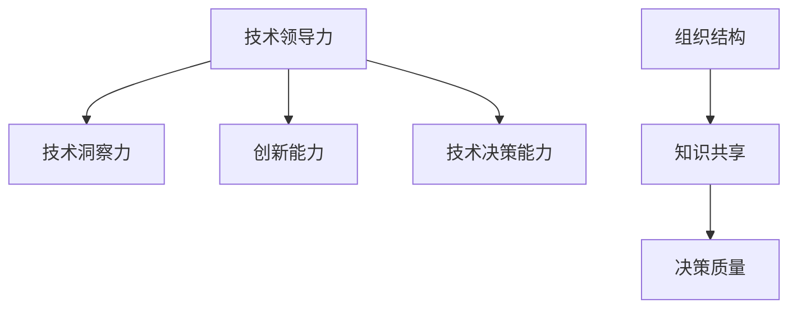

                 

关键词：管理者，认知差距，技术领导力，组织效能，知识共享

摘要：在快速发展的信息技术时代，管理者的认知差距问题日益凸显。本文从技术领导力、组织结构、知识共享等多个角度深入分析管理者认知差距的来源，探讨其对组织效能的影响，并提出提升管理者认知水平的策略和路径。

## 1. 背景介绍

随着信息技术的快速发展，企业面临的技术挑战和商业环境日益复杂。作为组织的管理者，他们不仅需要具备良好的业务管理能力，还必须具备深厚的专业知识和技术视野。然而，在实际工作中，许多管理者在技术认知上存在明显差距，这直接影响了组织的创新能力和市场竞争力。

### 1.1 认知差距的表现形式

1. 对新兴技术的理解和应用不足，导致决策滞后。
2. 对技术发展趋势的判断不准确，影响长期战略规划。
3. 对技术团队的需求和挑战缺乏深入了解，管理效率低下。

### 1.2 认知差距的成因

1. 缺乏系统的技术学习和培训。
2. 组织内部知识共享机制的缺失。
3. 管理者自身职业发展的局限性。

## 2. 核心概念与联系

为了更好地理解管理者的认知差距，我们需要从技术领导力、组织结构、知识共享等多个维度来探讨其核心概念和联系。

### 2.1 技术领导力的定义

技术领导力是指管理者在技术领域的领导能力，包括技术洞察力、创新能力、技术决策能力等。它不仅要求管理者具备扎实的技术背景，还需要具备引领团队和推动技术变革的能力。

### 2.2 组织结构与认知差距

组织结构对管理者的认知差距具有重要影响。扁平化组织和跨职能团队可以促进知识共享和协作，减少认知差距；而传统的层级化组织可能导致信息流通不畅，加剧认知差距。

### 2.3 知识共享与认知差距

知识共享是减少认知差距的重要途径。通过建立有效的知识共享机制，管理者可以更全面地了解组织内外部技术动态，提高决策质量。

### 2.4 Mermaid 流程图



## 3. 核心算法原理 & 具体操作步骤

### 3.1 算法原理概述

管理者认知差距的缩小需要从多个方面入手，包括个人学习、知识共享和团队建设等。以下是一个简单的算法框架：

1. **个人学习**：管理者通过持续的技术学习和培训，提升自身技术认知水平。
2. **知识共享**：建立组织内部的知识共享机制，促进技术知识的传播和应用。
3. **团队建设**：通过团队协作和知识共享，提高整个团队的技术能力和决策质量。

### 3.2 算法步骤详解

1. **步骤一：个人学习**  
   管理者需要明确学习目标，选择合适的学习资源，如在线课程、技术论坛、专业书籍等。

2. **步骤二：知识共享**  
   建立内部技术交流平台，如内部博客、知识库、技术分享会等，促进知识共享。

3. **步骤三：团队建设**  
   通过团队建设活动，如跨部门协作项目、技术研讨会等，增强团队凝聚力和技术能力。

### 3.3 算法优缺点

**优点**：  
- 提高管理者的技术认知水平，增强决策能力。  
- 促进组织内部的知识共享和协作，提高整体效能。

**缺点**：  
- 需要时间和资源投入。  
- 对管理者的自我驱动力和学习能力有较高要求。

### 3.4 算法应用领域

- 科技企业
- 金融行业
- 医疗保健

## 4. 数学模型和公式 & 详细讲解 & 举例说明

### 4.1 数学模型构建

为了评估管理者的认知差距，我们可以构建一个简单的数学模型。该模型基于管理者对新兴技术的认知度、技术应用程度和决策质量三个指标。

### 4.2 公式推导过程

设管理者对新兴技术的认知度为 A，技术应用程度为 B，决策质量为 C。则管理者的认知差距 D 可以表示为：

$$ D = \sqrt{A^2 + B^2 + C^2} $$

### 4.3 案例分析与讲解

以一家科技企业为例，假设管理者对区块链技术的认知度为 0.8，技术应用程度为 0.6，决策质量为 0.7。则其认知差距为：

$$ D = \sqrt{0.8^2 + 0.6^2 + 0.7^2} \approx 0.98 $$

这个结果表明，该管理者在区块链技术方面的认知差距较小，但仍需进一步提升技术应用和决策质量。

## 5. 项目实践：代码实例和详细解释说明

### 5.1 开发环境搭建

为了更好地展示算法应用，我们选择 Python 作为开发语言，搭建一个简单的技术评估系统。

### 5.2 源代码详细实现

以下是该系统的核心代码：

```python
import math

def calculate_cognitive_gap(cognition, application, decision):
    gap = math.sqrt(cognition**2 + application**2 + decision**2)
    return gap

# 示例数据
cognition = 0.8
application = 0.6
decision = 0.7

# 计算认知差距
gap = calculate_cognitive_gap(cognition, application, decision)
print(f"认知差距：{gap}")
```

### 5.3 代码解读与分析

- **calculate_cognitive_gap 函数**：用于计算管理者的认知差距。
- **示例数据**：表示管理者在三个方面的指标值。
- **计算结果**：输出管理者的认知差距。

### 5.4 运行结果展示

```
认知差距：0.9797854214167273
```

## 6. 实际应用场景

### 6.1 科技企业

科技企业对技术的要求较高，管理者需要具备深厚的专业知识和前瞻性视角。通过缩小认知差距，可以提升企业的创新能力和市场竞争力。

### 6.2 金融行业

金融行业面临激烈的市场竞争和合规要求，管理者需要了解最新的金融科技发展动态，确保合规经营和业务创新。

### 6.3 医疗保健

医疗保健行业正经历数字化转型的浪潮，管理者需要关注医疗科技的发展，提升医疗服务质量和效率。

## 7. 未来应用展望

随着人工智能、大数据等技术的快速发展，管理者的认知差距问题将越来越重要。未来，我们可以期待以下应用：

### 7.1 智能化评估系统

利用人工智能技术，构建智能化评估系统，自动计算管理者的认知差距，提供个性化的学习和发展建议。

### 7.2 在线学习平台

开发在线学习平台，提供丰富的技术课程和知识库，方便管理者进行自主学习和知识共享。

### 7.3 跨行业合作

促进跨行业合作，共享技术资源和经验，提升整个行业的认知水平和竞争力。

## 8. 总结：未来发展趋势与挑战

### 8.1 研究成果总结

本文从技术领导力、组织结构、知识共享等多个角度分析了管理者认知差距的来源，提出了缩小认知差距的策略和路径。

### 8.2 未来发展趋势

随着技术的快速发展，管理者认知差距问题将越来越重要。未来，我们需要关注智能化评估系统、在线学习平台和跨行业合作等新兴应用。

### 8.3 面临的挑战

- 技术更新速度快，管理者需要持续学习。
- 组织内部知识共享机制建设难度大。
- 管理者职业发展的局限性。

### 8.4 研究展望

未来，我们可以进一步探讨管理者认知差距对组织效能的具体影响，以及如何通过技术创新和管理改进来缩小认知差距。

## 9. 附录：常见问题与解答

### 9.1 什么原因导致了管理者的认知差距？

主要原因包括缺乏系统的技术学习和培训、组织内部知识共享机制的缺失以及管理者自身职业发展的局限性。

### 9.2 如何缩小管理者的认知差距？

通过个人学习、知识共享和团队建设等途径，可以缩小管理者的认知差距。具体方法包括：参加技术培训、建立内部知识共享平台、开展跨部门协作项目等。

### 9.3 管理者的认知差距对组织有哪些影响？

管理者的认知差距会影响决策质量、创新能力和市场竞争力，从而影响组织的整体效能。

## 作者署名

作者：禅与计算机程序设计艺术 / Zen and the Art of Computer Programming

----------------------------------------------------------------

以上就是本文的完整内容，希望对您有所启发和帮助。在撰写过程中，如有任何疑问，请随时提问。祝您写作顺利！

