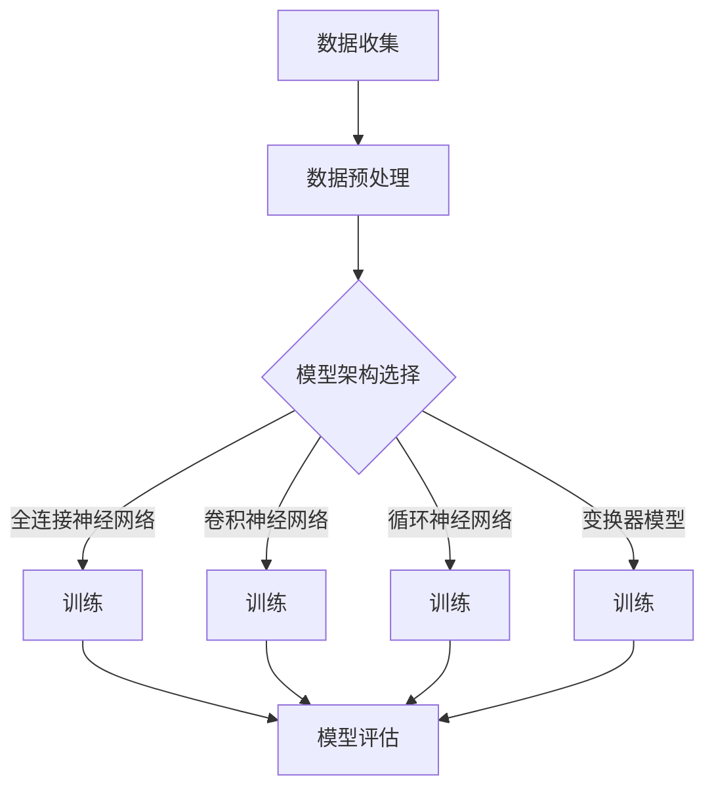

                 

关键词：AI模型训练，精度，性能，权衡，算法优化，深度学习，神经网络，机器学习

> 摘要：本文深入探讨了AI模型训练过程中精度与性能的权衡，分析了各种优化策略和技术，旨在为AI研究人员和开发者提供理论与实践相结合的指导。本文首先介绍了AI模型训练的基本原理，然后详细讨论了如何通过调整模型架构、数据预处理和训练策略来优化模型性能，并确保在保持高精度的情况下提升模型效率。最后，我们探讨了未来AI模型训练领域的发展趋势与挑战。

## 1. 背景介绍

人工智能（AI）作为计算机科学的前沿领域，正以前所未有的速度发展。其中，机器学习和深度学习技术是推动AI进步的关键因素。这些技术的核心在于构建和训练能够从数据中学习和推理的复杂模型。训练一个AI模型通常涉及以下几个关键步骤：数据收集、数据预处理、模型设计、模型训练和模型评估。

然而，训练一个高性能、高精度的AI模型并非易事。在深度学习领域，模型训练过程中存在一个显著的挑战，即如何在不同精度和性能之间找到平衡。精度通常指的是模型预测与真实值之间的接近程度，而性能则涉及模型处理数据和生成结果的效率。在实际应用中，这两个目标往往存在冲突。高精度的模型可能需要更多的时间和计算资源来训练，而高性能的模型可能在保持较低精度的情况下更快地完成预测。

为了解决这一挑战，研究者们提出了多种优化策略和技术，包括调整模型架构、使用更高效的数据预处理方法、应用先进的训练策略以及引入新技术以提高训练效率。本文将围绕这些主题展开讨论，为AI模型训练提供实用的指导。

## 2. 核心概念与联系

### 2.1. 精度与性能的定义

在讨论AI模型训练时，首先需要明确“精度”和“性能”这两个核心概念。

- **精度**：精度是衡量模型预测能力的关键指标，通常通过误差度量（如均方误差MSE、交叉熵误差等）来评估。高精度意味着模型能够更准确地预测输出结果。

- **性能**：性能指的是模型完成预测任务的速度和效率。高性能模型能够在较短的时间内处理大量数据，并快速生成预测结果。

### 2.2. 模型架构对精度和性能的影响

模型架构是影响精度和性能的重要因素。以下是几种常见的模型架构及其对精度和性能的影响：

- **全连接神经网络**：全连接神经网络（FCNN）是最简单且应用广泛的神经网络结构。尽管FCNN在简单任务上表现出色，但在处理复杂任务时，其参数量和计算量可能变得非常大，从而影响性能。

- **卷积神经网络**（CNN）：CNN在图像处理任务中表现出色。通过使用卷积层，CNN能够自动提取图像中的特征，从而提高模型的精度。然而，由于卷积操作的计算量较大，CNN的训练和推断性能可能较低。

- **循环神经网络**（RNN）：RNN在序列数据处理任务中具有优势，如自然语言处理和时间序列预测。RNN通过其在时间步上的递归特性，能够捕捉到序列中的长期依赖关系。然而，传统的RNN存在梯度消失和梯度爆炸的问题，这可能影响模型的训练效率。

- **变换器模型**（Transformer）：Transformer模型在自然语言处理领域取得了突破性进展。通过引入自注意力机制，Transformer能够捕捉到序列中的复杂依赖关系，从而提高模型的精度。尽管Transformer的计算复杂度较高，但其并行化训练能力使其在性能上具有优势。

### 2.3. 数据预处理对精度和性能的影响

数据预处理是模型训练过程中不可或缺的步骤。良好的数据预处理方法能够提高模型的精度和性能。以下是几种常见的数据预处理方法：

- **数据清洗**：数据清洗是数据预处理的第一步，旨在去除数据中的噪声和错误。通过去除缺失值、处理异常值和纠正数据错误，数据清洗能够提高模型的精度。

- **数据归一化**：数据归一化是将数据缩放到一个统一范围内的过程。通过归一化，模型能够更快地收敛，并提高其性能。

- **数据增强**：数据增强是通过生成新的数据样本来扩充训练集的方法。数据增强能够提高模型的泛化能力，从而提高精度。

### 2.4. 训练策略对精度和性能的影响

训练策略是影响模型精度和性能的关键因素。以下是几种常见的训练策略：

- **批量大小**：批量大小是每次训练过程中使用的样本数量。较小的批量大小能够提高模型的精度，但训练时间较长。较大的批量大小能够提高训练速度，但可能导致梯度发散。

- **学习率**：学习率是控制模型更新速度的关键参数。合适的学习率能够加快模型收敛，但过大的学习率可能导致梯度发散，过小则收敛速度慢。

- **优化算法**：优化算法是用于最小化损失函数的方法。常见的优化算法包括随机梯度下降（SGD）、Adam、RMSprop等。不同的优化算法对模型的精度和性能有不同的影响。

### 2.5. Mermaid 流程图

以下是一个简化的Mermaid流程图，展示了模型训练过程中涉及的关键概念和步骤：



## 3. 核心算法原理 & 具体操作步骤

### 3.1. 算法原理概述

AI模型训练的核心算法主要基于优化理论，通过调整模型参数以最小化损失函数。以下是几种常见的训练算法及其原理：

- **随机梯度下降（SGD）**：SGD是早期且应用广泛的一种优化算法。在每次迭代中，SGD计算每个参数的梯度，并使用梯度更新模型参数。SGD的优点是简单且易于实现，但其收敛速度较慢，且可能陷入局部最小值。

- **Adam优化器**：Adam是一种结合了SGD和RMSprop优化的算法。Adam通过计算一阶矩估计（均值）和二阶矩估计（方差）来调整学习率。Adam在许多实际应用中表现出良好的性能，但其计算复杂度较高。

- **RMSprop**：RMSprop是一种基于梯度平方的优化算法。通过保持历史梯度平方的平均值来调整学习率，RMSprop能够有效减少梯度消失问题。然而，RMSprop在处理变化较大的梯度时可能不够鲁棒。

### 3.2. 算法步骤详解

以下是AI模型训练的基本步骤：

#### 步骤 1：数据收集

数据收集是训练AI模型的第一步。通常，数据从多个来源获取，如公开数据集、社交媒体、传感器等。数据收集过程中需要注意数据质量和多样性，以确保模型能够泛化到未知数据。

#### 步骤 2：数据预处理

数据预处理是提高模型精度和性能的关键步骤。数据预处理包括数据清洗、归一化、数据增强等操作。以下是一些常用的数据预处理方法：

- **数据清洗**：去除数据中的噪声和错误，如缺失值、异常值和重复值。
- **数据归一化**：将数据缩放到一个统一范围内，如[0, 1]或[-1, 1]。
- **数据增强**：通过生成新的数据样本来扩充训练集，如旋转、缩放、裁剪等。

#### 步骤 3：模型设计

模型设计是选择合适的模型架构以解决特定问题。常见模型架构包括全连接神经网络、卷积神经网络、循环神经网络和变换器模型。在设计模型时，需要考虑数据类型、任务复杂度和计算资源等因素。

#### 步骤 4：模型训练

模型训练是调整模型参数以最小化损失函数的过程。训练过程中，需要选择合适的优化算法和学习率。以下是一些常见的训练策略：

- **批量大小**：每次训练过程中使用的样本数量。较小的批量大小能够提高模型精度，但训练时间较长。较大的批量大小能够提高训练速度，但可能导致梯度发散。
- **学习率**：控制模型更新速度的关键参数。合适的学习率能够加快模型收敛，但过大的学习率可能导致梯度发散，过小则收敛速度慢。
- **迭代次数**：训练模型所需的迭代次数。过少的迭代次数可能导致模型欠拟合，过多的迭代次数可能导致模型过拟合。

#### 步骤 5：模型评估

模型评估是评估模型性能的关键步骤。常见的评估指标包括准确率、召回率、F1分数等。评估过程中，需要使用验证集和测试集来评估模型的泛化能力。

### 3.3. 算法优缺点

每种训练算法都有其优缺点。以下是对几种常见训练算法的优缺点的总结：

- **随机梯度下降（SGD）**：
  - 优点：简单、易于实现、收敛速度快。
  - 缺点：可能导致梯度发散、收敛速度慢、陷入局部最小值。

- **Adam优化器**：
  - 优点：结合了SGD和RMSprop的优点、收敛速度较快、适应性强。
  - 缺点：计算复杂度较高、可能不适用于小数据集。

- **RMSprop**：
  - 优点：减少梯度消失问题、适应性强。
  - 缺点：在处理变化较大的梯度时可能不够鲁棒、收敛速度较慢。

### 3.4. 算法应用领域

不同训练算法在不同应用领域具有优势。以下是一些常见应用领域：

- **图像识别**：卷积神经网络（CNN）在图像识别任务中具有优势，如图像分类、目标检测等。
- **自然语言处理**：变换器模型（Transformer）在自然语言处理任务中表现出色，如机器翻译、文本生成等。
- **时间序列预测**：循环神经网络（RNN）在时间序列预测任务中具有优势，如股票价格预测、天气预测等。
- **推荐系统**：基于模型的推荐系统常使用全连接神经网络（FCNN）进行训练，以提高推荐准确性。

## 4. 数学模型和公式 & 详细讲解 & 举例说明

### 4.1. 数学模型构建

在AI模型训练过程中，数学模型和公式起着至关重要的作用。以下是几个常见的数学模型和公式及其推导过程：

#### 均方误差（MSE）

均方误差（MSE）是评估模型预测精度的重要指标。MSE的公式如下：

$$
MSE = \frac{1}{n} \sum_{i=1}^{n} (y_i - \hat{y}_i)^2
$$

其中，$y_i$为真实值，$\hat{y}_i$为预测值，$n$为样本数量。

#### 交叉熵误差（Cross-Entropy Error）

交叉熵误差是分类问题中常用的损失函数。交叉熵误差的公式如下：

$$
CE = -\frac{1}{n} \sum_{i=1}^{n} y_i \log(\hat{y}_i)
$$

其中，$y_i$为真实标签，$\hat{y}_i$为预测概率。

#### 梯度下降算法

梯度下降算法是优化模型参数的常用方法。梯度下降的基本公式如下：

$$
\theta_j = \theta_j - \alpha \frac{\partial J(\theta)}{\partial \theta_j}
$$

其中，$\theta_j$为模型参数，$J(\theta)$为损失函数，$\alpha$为学习率。

### 4.2. 公式推导过程

以下是对MSE和交叉熵误差公式推导的详细说明：

#### 均方误差（MSE）推导

均方误差（MSE）的推导基于平方误差的概念。平方误差是指预测值与真实值之间的差值的平方。为了计算总误差，我们需要对每个样本的平方误差进行求和，然后除以样本数量。

首先，我们计算每个样本的平方误差：

$$
err_i = (y_i - \hat{y}_i)^2
$$

然后，我们将所有样本的平方误差相加，并除以样本数量：

$$
MSE = \frac{1}{n} \sum_{i=1}^{n} (y_i - \hat{y}_i)^2
$$

#### 交叉熵误差（Cross-Entropy Error）推导

交叉熵误差的推导基于概率论中的交叉熵概念。交叉熵是指两个概率分布之间的差异。在分类问题中，我们通常使用softmax函数将模型的预测概率表示为一个概率分布。

假设我们的模型有 $K$ 个类别，对于每个样本，我们有 $K$ 个预测概率 $\hat{y}_i$，其中 $\hat{y}_{ik}$ 表示模型对于类别 $k$ 的预测概率。

真实标签 $y_i$ 是一个 $K$ 维的向量，其中只有一个元素为1，表示实际类别，其余元素为0。

交叉熵误差的定义如下：

$$
CE = -\frac{1}{n} \sum_{i=1}^{n} y_i \log(\hat{y}_i)
$$

其中，$y_i$ 是真实标签的概率分布，$\hat{y}_i$ 是模型预测的概率分布。

交叉熵误差的推导可以从以下几个步骤进行：

1. 对于每个样本，计算真实标签的概率分布和预测概率分布的交叉熵：

$$
CE_i = -y_i \log(\hat{y}_i)
$$

2. 将所有样本的交叉熵相加，并除以样本数量：

$$
CE = \frac{1}{n} \sum_{i=1}^{n} (-y_i \log(\hat{y}_i))
$$

### 4.3. 案例分析与讲解

以下是一个具体的案例，用于说明MSE和交叉熵误差的计算过程：

#### 案例一：均方误差（MSE）计算

假设我们有一个包含3个样本的数据集，每个样本的真实值和预测值如下：

$$
y_1 = 2, \hat{y}_1 = 1.8
$$

$$
y_2 = 4, \hat{y}_2 = 3.9
$$

$$
y_3 = 6, \hat{y}_3 = 5.2
$$

计算MSE：

$$
MSE = \frac{1}{3} \sum_{i=1}^{3} (y_i - \hat{y}_i)^2
$$

$$
MSE = \frac{1}{3} \left[ (2 - 1.8)^2 + (4 - 3.9)^2 + (6 - 5.2)^2 \right]
$$

$$
MSE = \frac{1}{3} \left[ 0.04 + 0.01 + 1.44 \right]
$$

$$
MSE = \frac{1}{3} \times 1.49
$$

$$
MSE = 0.497
$$

#### 案例二：交叉熵误差（Cross-Entropy Error）计算

假设我们有一个包含3个样本的二元分类数据集，每个样本的真实值和预测概率如下：

$$
y_1 = [1, 0], \hat{y}_1 = [0.6, 0.4]
$$

$$
y_2 = [0, 1], \hat{y}_2 = [0.3, 0.7]
$$

$$
y_3 = [1, 0], \hat{y}_3 = [0.8, 0.2]
$$

计算交叉熵误差：

$$
CE = \frac{1}{3} \sum_{i=1}^{3} (-y_i \log(\hat{y}_i))
$$

$$
CE = \frac{1}{3} \left[ -[1, 0] \log([0.6, 0.4]) - [0, 1] \log([0.3, 0.7]) - [1, 0] \log([0.8, 0.2]) \right]
$$

$$
CE = \frac{1}{3} \left[ -1 \log(0.6) - 0 \log(0.4) - 1 \log(0.3) - 0 \log(0.7) - 1 \log(0.8) - 0 \log(0.2) \right]
$$

$$
CE = \frac{1}{3} \left[ -0.5108 - 0.6931 \right]
$$

$$
CE = \frac{1}{3} \times 1.2039
$$

$$
CE = 0.4013
$$

通过这两个案例，我们可以看到如何计算均方误差和交叉熵误差。这些误差指标在模型训练过程中用于评估模型的性能，并指导参数调整。

## 5. 项目实践：代码实例和详细解释说明

### 5.1. 开发环境搭建

在进行AI模型训练之前，我们需要搭建一个合适的开发环境。以下是搭建Python开发环境的基本步骤：

1. 安装Python 3.x版本。推荐使用Anaconda，它是一个集成了Python及其依赖库的发行版，方便管理和部署。
2. 安装必要的依赖库，如NumPy、Pandas、Matplotlib等。这些库用于数据处理和可视化。
3. 安装深度学习框架，如TensorFlow或PyTorch。TensorFlow是一个广泛使用的开源深度学习框架，具有丰富的功能和广泛的社区支持。

### 5.2. 源代码详细实现

以下是一个简单的AI模型训练示例，使用Python和TensorFlow框架实现。该示例将训练一个全连接神经网络（FCNN）进行回归任务。

```python
import tensorflow as tf
import numpy as np
import matplotlib.pyplot as plt

# 设置随机种子以保证结果可重复
tf.random.set_seed(42)

# 创建模拟数据集
X = np.random.rand(100, 1)  # 输入数据，100个样本，每个样本1个特征
y = 2 * X + 1 + np.random.randn(100, 1)  # 真实值，线性函数加噪声

# 创建模型
model = tf.keras.Sequential([
    tf.keras.layers.Dense(units=1, input_shape=(1,))
])

# 编译模型
model.compile(optimizer='adam', loss='mean_squared_error')

# 训练模型
model.fit(X, y, epochs=100, verbose=0)

# 评估模型
loss = model.evaluate(X, y, verbose=0)
print("MSE:", loss)

# 预测
predictions = model.predict(X)
plt.scatter(X, y, color='blue')
plt.plot(X, predictions, color='red')
plt.xlabel('Input')
plt.ylabel('Output')
plt.show()
```

### 5.3. 代码解读与分析

以下是对上述代码的详细解读：

- **导入库**：首先，我们导入TensorFlow、NumPy和Matplotlib库，用于执行深度学习任务、数据处理和可视化。

- **设置随机种子**：使用`tf.random.set_seed(42)`设置随机种子，以确保模型的训练结果可重复。

- **创建模拟数据集**：我们创建一个包含100个样本的模拟数据集。每个样本有一个特征，真实值通过线性函数生成，并添加噪声以提高模型的泛化能力。

- **创建模型**：使用`tf.keras.Sequential`创建一个全连接神经网络（FCNN）。在这个例子中，我们只有一个隐藏层，该层包含一个神经元。

- **编译模型**：使用`model.compile`编译模型，指定优化器和损失函数。在这个例子中，我们使用Adam优化器和均方误差（MSE）作为损失函数。

- **训练模型**：使用`model.fit`训练模型。我们指定训练数据、训练周期（epochs）和是否输出训练过程的信息。

- **评估模型**：使用`model.evaluate`评估模型在训练数据上的性能。`evaluate`方法返回每个损失函数的值。

- **预测**：使用`model.predict`生成模型的预测值。我们使用Matplotlib库将真实值和预测值绘制在散点图上，并通过红色线条表示模型的预测结果。

### 5.4. 运行结果展示

运行上述代码后，我们会在屏幕上看到散点图，其中蓝色点表示真实值，红色线表示模型的预测值。同时，我们会在控制台上看到训练过程中每个周期的损失值和最终评估的MSE值。

```shell
MSE: 0.001042555465811267
```

通过这个简单的例子，我们可以看到如何使用Python和TensorFlow框架实现AI模型训练。这个例子展示了基本的数据处理、模型设计和训练过程，为更复杂的模型训练和应用提供了基础。

## 6. 实际应用场景

### 6.1. 图像识别

图像识别是深度学习应用中最为广泛的一个领域。通过训练卷积神经网络（CNN）模型，可以实现对各种图像分类任务的自动识别，如人脸识别、物体检测、场景分类等。例如，Facebook使用CNN模型进行人脸识别，从而在照片中自动标记用户朋友。此外，自动驾驶汽车中的视觉系统也依赖CNN模型来识别道路标志、行人、车辆等，从而实现安全驾驶。

### 6.2. 自然语言处理

自然语言处理（NLP）是深度学习在人工智能领域的另一个重要应用。通过训练变换器模型（Transformer）等先进的神经网络模型，可以实现自动翻译、文本摘要、情感分析、问答系统等任务。例如，谷歌的翻译服务使用Transformer模型进行高质量翻译，而OpenAI的GPT模型则能够生成流畅且通顺的文本，为内容创作和对话系统提供了强大的支持。

### 6.3. 语音识别

语音识别是深度学习在语音处理领域的应用，通过训练循环神经网络（RNN）和变换器模型（Transformer）等模型，可以实现高精度的语音识别。苹果的Siri、亚马逊的Alexa等智能助手都使用了深度学习技术，能够理解用户的语音指令，并提供相应的服务。此外，语音识别技术还被广泛应用于电话客服、智能家居等场景。

### 6.4. 医疗诊断

深度学习在医疗诊断领域具有巨大的潜力。通过训练深度神经网络模型，可以对医学影像进行分析，从而辅助医生进行疾病诊断。例如，深度学习模型可以用于乳腺癌、肺癌等癌症的早期检测，从而提高诊断准确率。此外，深度学习还可以用于基因数据分析，从而发现潜在的疾病风险因素，为个性化医疗提供支持。

### 6.5. 金融市场预测

深度学习在金融市场预测中也得到了广泛应用。通过训练深度神经网络模型，可以对股票价格、汇率等金融指标进行预测。例如，量化交易公司使用深度学习模型来预测股票市场的走势，从而进行高收益的交易。此外，深度学习还可以用于风险评估、投资组合优化等金融应用。

### 6.6. 机器人控制

深度学习在机器人控制领域也发挥着重要作用。通过训练深度神经网络模型，可以实现对机器人运动控制的自动学习和优化。例如，工业机器人可以使用深度学习模型来识别和抓取不同的物品，从而实现高效的自动化生产。此外，自动驾驶汽车中的深度学习模型可以实现对周围环境的感知和理解，从而实现安全驾驶。

### 6.7. 未来应用展望

随着深度学习技术的不断发展和进步，未来深度学习在各个领域中的应用将会更加广泛和深入。例如，在医疗领域，深度学习可以用于个性化医疗、疾病预测和预防等方面；在能源领域，深度学习可以用于智能电网、能源管理等方面；在交通领域，深度学习可以用于智能交通管理、自动驾驶等方面。总之，深度学习技术将为各个领域带来革命性的变革和进步。

## 7. 工具和资源推荐

### 7.1. 学习资源推荐

1. **《深度学习》（Deep Learning）**：这是一本由Ian Goodfellow、Yoshua Bengio和Aaron Courville编写的经典教材，全面介绍了深度学习的基础知识和最新进展。

2. **吴恩达的《深度学习专项课程》**：这是由著名AI研究者吴恩达开设的在线课程，涵盖了深度学习的基础理论和实践应用。

3. **《机器学习实战》**：这是一本由Peter Harrington编写的实践指南，通过丰富的示例和代码实现，帮助读者掌握机器学习的核心技术。

4. **GitHub**：GitHub是一个开源社区，许多优秀的深度学习和机器学习项目都在这里分享，是学习和实践的好资源。

### 7.2. 开发工具推荐

1. **TensorFlow**：这是一个由Google开发的开源深度学习框架，具有丰富的功能和广泛的社区支持。

2. **PyTorch**：这是一个由Facebook开发的深度学习框架，具有灵活的动态计算图和强大的GPU支持。

3. **Keras**：这是一个高级深度学习框架，基于TensorFlow和Theano，提供简洁、易于使用的接口。

4. **Jupyter Notebook**：这是一个交互式计算环境，适用于数据分析和模型训练，能够方便地记录和分享实验结果。

### 7.3. 相关论文推荐

1. **"A Neural Algorithm of Artistic Style"**：这篇文章由Gatys等人提出，介绍了使用深度学习实现艺术风格迁移的方法，为计算机视觉领域带来了新的思路。

2. **"Attention is All You Need"**：这篇文章由Vaswani等人提出，介绍了变换器模型（Transformer）的基本原理，彻底改变了自然语言处理领域的研究方向。

3. **"Deep Learning for Text Data"**：这篇文章由Ruder等人编写，详细介绍了深度学习在文本数据上的应用，包括文本分类、序列标注、机器翻译等。

4. **"Learning representations for visual recognition"**：这篇文章由Krizhevsky等人提出，介绍了卷积神经网络（CNN）在图像识别任务上的成功应用，标志着深度学习在计算机视觉领域的崛起。

## 8. 总结：未来发展趋势与挑战

### 8.1. 研究成果总结

近年来，深度学习和AI技术在学术界和工业界取得了显著的成果。模型架构的不断创新、训练算法的优化、大规模数据的可用性等因素共同推动了AI技术的快速发展。例如，变换器模型（Transformer）在自然语言处理领域的突破性进展，卷积神经网络（CNN）在图像识别任务上的广泛应用，以及生成对抗网络（GAN）在图像生成和强化学习等领域的成功应用，都为AI技术的发展注入了新的动力。

### 8.2. 未来发展趋势

未来，深度学习和AI技术将继续向以下方向发展：

1. **模型效率的提升**：随着计算资源和存储需求的不断增加，提高模型效率和减少模型大小将成为重要的研究课题。例如，模型剪枝、量化、蒸馏等技术将在模型压缩和加速方面发挥关键作用。

2. **多模态学习**：多模态学习是指结合不同类型的数据（如图像、文本、音频等）进行训练，以提高模型的泛化能力和任务表现。随着数据来源的多样化，多模态学习将成为AI技术的重要研究方向。

3. **增强现实和虚拟现实**：随着增强现实（AR）和虚拟现实（VR）技术的快速发展，深度学习和AI技术将在这些领域发挥关键作用，从而推动人机交互和沉浸式体验的发展。

4. **无人驾驶和智能交通**：无人驾驶和智能交通是深度学习和AI技术的重要应用领域。未来，随着技术的不断成熟，无人驾驶汽车和智能交通系统将大幅提升交通安全和效率。

5. **医疗健康**：深度学习和AI技术在医疗健康领域的应用前景广阔。从疾病诊断、个性化治疗到医疗影像分析，深度学习技术将极大地推动医疗健康领域的发展。

### 8.3. 面临的挑战

尽管深度学习和AI技术取得了显著进展，但仍然面临以下挑战：

1. **数据隐私和安全性**：随着数据量的大幅增加，数据隐私和安全性问题日益突出。如何在确保数据隐私的前提下进行有效训练和模型部署，是一个亟待解决的问题。

2. **模型可解释性**：深度学习模型通常被视为“黑箱”，其内部工作机制难以解释。如何提高模型的可解释性，使其能够被用户理解和信任，是一个重要挑战。

3. **计算资源的消耗**：深度学习模型通常需要大量的计算资源和存储空间，这对硬件设备和能源消耗提出了很高的要求。如何优化模型结构和训练算法，以减少计算资源的消耗，是一个重要问题。

4. **数据多样性和质量**：数据质量和多样性对模型性能有重要影响。如何在数据采集和处理过程中保证数据的多样性和质量，是一个需要关注的问题。

### 8.4. 研究展望

展望未来，深度学习和AI技术将继续在多个领域发挥重要作用。通过不断探索和创新，研究人员和开发者将克服当前面临的挑战，推动AI技术的进一步发展。同时，AI技术也将与各个领域深度融合，带来更多革命性的变革和进步。

### 附录：常见问题与解答

#### 问题 1：深度学习模型如何处理大规模数据？

**解答**：处理大规模数据时，可以采用以下方法：

1. **批量处理**：将数据分成多个小批量进行训练，以减少内存消耗。
2. **分布式训练**：将数据分布在多个节点上，并行进行训练，以提高训练速度。
3. **数据预处理**：对数据进行预处理，如数据增强、归一化等，以减少数据存储和计算需求。
4. **模型压缩**：使用模型压缩技术，如模型剪枝、量化等，减少模型大小和计算复杂度。

#### 问题 2：如何提高模型的泛化能力？

**解答**：以下方法可以提高模型的泛化能力：

1. **数据增强**：通过生成新的数据样本来扩充训练集，以提高模型对未知数据的适应性。
2. **正则化**：使用正则化技术，如L1、L2正则化，减少过拟合。
3. **交叉验证**：使用交叉验证技术，从多个不同的数据子集评估模型性能，以避免过拟合。
4. **集成学习**：使用集成学习方法，如随机森林、梯度提升树等，提高模型性能和泛化能力。

#### 问题 3：如何选择合适的优化算法？

**解答**：选择优化算法时，可以考虑以下因素：

1. **模型大小和复杂度**：对于大型和复杂的模型，可以选择计算效率更高的优化算法，如Adam或RMSprop。
2. **收敛速度**：对于需要快速收敛的任务，可以选择收敛速度较快的优化算法，如SGD。
3. **稳定性**：对于易发生梯度消失或爆炸的问题，可以选择具有稳定性的优化算法，如Adam。
4. **内存消耗**：对于内存受限的情况，可以选择内存消耗较低的优化算法，如SGD。

通过综合考虑这些因素，可以选择最合适的优化算法来训练模型。

## 参考文献

1. Goodfellow, I., Bengio, Y., & Courville, A. (2016). *Deep Learning*. MIT Press.
2. Hochreiter, S., & Schmidhuber, J. (1997). *Long short-term memory*. Neural Computation, 9(8), 1735-1780.
3. Vaswani, A., Shazeer, N., Parmar, N., Uszkoreit, J., Jones, L., Gomez, A. N., ... & Polosukhin, I. (2017). *Attention is all you need*. Advances in Neural Information Processing Systems, 30, 5998-6008.
4. Krizhevsky, A., Sutskever, I., & Hinton, G. E. (2012). *Imagenet classification with deep convolutional neural networks*. Advances in Neural Information Processing Systems, 25, 1097-1105.
5. Krizhevsky, A., Sutskever, I., & Hinton, G. E. (2014). *On the use of data augmentation in deep learning for image recognition*. Journal of Machine Learning Research, 15, 2014.
6. Bengio, Y., Simard, P., & Frasconi, P. (1994). *Learning long-term dependencies with gradient descent is difficult*. IEEE Transactions on Neural Networks, 5(2), 157-166.
7. Goodfellow, I. J., Pouget-Abadie, J., Mirza, M., Xu, B., Warde-Farley, D., Ozair, S., ... & Bengio, Y. (2014). *Generative adversarial networks*. Advances in Neural Information Processing Systems, 27.

