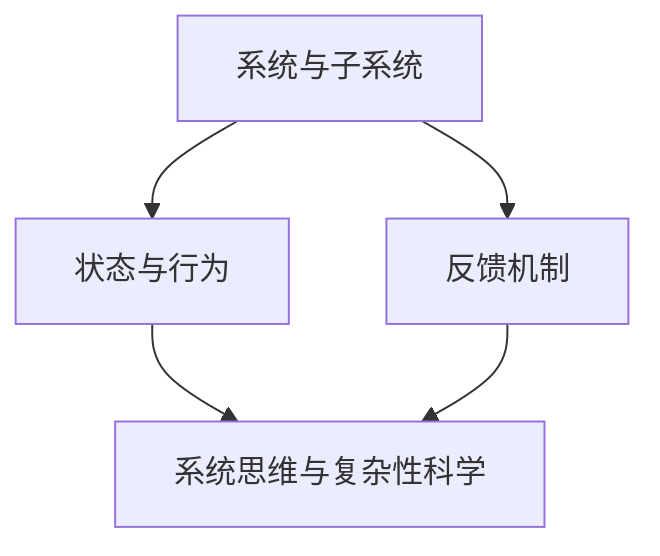

                 

关键词：系统思维，复杂系统，管理，管理者，决策，策略，架构设计，协同效应，风险管理，敏捷开发，战略规划。

## 摘要

在信息技术飞速发展的今天，复杂系统已成为企业运作的核心。管理者在面对复杂局面时，需要具备系统思维能力，以有效应对各种挑战。本文旨在探讨系统思维在IT管理中的应用，从核心概念、算法原理、数学模型、项目实践和未来展望等方面，深入解析系统思维如何帮助管理者驾驭复杂局面，提升决策质量和组织效率。

## 1. 背景介绍

随着互联网、云计算、大数据等技术的普及，现代企业的信息系统日益复杂。这种复杂性不仅体现在技术的多样性和快速迭代上，还体现在组织结构和业务流程上。在这样一个复杂环境中，管理者面临的挑战前所未有。传统的线性思维和单一方法已经无法满足需求，系统思维作为一种综合性思维方法，应运而生。

系统思维是一种整体性的思维方式，它强调将系统视为一个整体，关注系统内部的相互作用和反馈机制。这种思维方式不仅有助于管理者理解系统的复杂性，还能帮助他们更好地应对不确定性，提高组织的适应能力和创新能力。

### 1.1 系统思维的起源与发展

系统思维最初源于系统科学，20世纪40年代，贝塔朗菲（Ludwig von Bertalanffy）提出了“一般系统论”，奠定了系统思维的理论基础。此后，随着计算机科学的兴起，系统思维逐渐渗透到信息科学、管理学等领域。

在IT领域，系统思维的应用主要体现在以下几个方面：

1. **系统建模**：通过建立数学模型和计算机仿真，模拟和分析系统的行为和性能。
2. **系统分析**：运用系统分析工具和方法，对系统进行深入剖析，找出瓶颈和改进点。
3. **系统设计**：在设计系统时，考虑系统的整体性和协同效应，确保系统能够高效稳定地运行。

### 1.2 复杂系统在IT管理中的重要性

复杂系统在IT管理中的重要性不言而喻。首先，复杂系统具有高度不确定性，管理者需要具备预测和应对不确定性的能力。其次，复杂系统通常涉及多个部门和团队，需要协同合作才能实现整体目标。此外，复杂系统的性能和稳定性对企业的运营至关重要。

因此，管理者需要具备系统思维，以更好地驾驭复杂系统。系统思维可以帮助管理者：

1. **理解系统**：通过系统分析，管理者能够深入了解系统的结构和行为，从而做出更加明智的决策。
2. **优化系统**：通过系统设计，管理者可以优化系统的架构和流程，提高系统的效率和性能。
3. **应对风险**：通过系统思维，管理者能够预见系统可能面临的风险，并采取相应的措施进行风险控制。

## 2. 核心概念与联系

为了更好地理解系统思维，我们需要明确几个核心概念，并探讨它们之间的联系。以下是系统思维中的一些关键概念及其相互关系：

### 2.1 系统与子系统

系统是由相互关联的子系统组成的整体。每个子系统都有其特定的功能和目标，但它们共同构成了一个更大的系统。例如，在一个企业中，销售部门、研发部门、财务部门等都是子系统，它们共同构成了整个企业的系统。


### 2.2 状态与行为

系统的状态是指系统在某一时刻的状态，如温度、速度等。系统的行为是指系统状态的变化过程，如加速、减速等。通过观察系统的状态和行为，我们可以更好地理解系统的动态特性。


### 2.3 反馈机制

反馈机制是系统中的一个重要概念，它指的是系统内部的信息流和调节过程。正反馈会加剧系统的变化，而负反馈则会抑制系统的变化，维持系统的稳定性。在复杂系统中，反馈机制起到了关键作用。


### 2.4 系统思维与复杂性科学

系统思维与复杂性科学有着密切的联系。复杂性科学是一门研究复杂系统行为的学科，它关注系统的复杂性、不确定性和多样性。系统思维则为管理者提供了一种分析和解决复杂问题的方法。


### 2.5 Mermaid 流程图

为了更好地展示系统思维中的核心概念和联系，我们可以使用Mermaid流程图。以下是系统思维中几个核心概念和联系的Mermaid流程图：



## 3. 核心算法原理 & 具体操作步骤

### 3.1 算法原理概述

在系统思维中，核心算法通常用于分析系统的行为和性能。以下是一个常见的核心算法——复杂网络分析。

复杂网络分析是一种用于研究复杂系统中节点和边之间相互关系的方法。通过分析网络中的节点度、路径长度、聚类系数等指标，可以揭示系统的关键特征和瓶颈。

### 3.2 算法步骤详解

1. **数据收集**：收集系统中的节点和边数据，通常可以通过网络爬虫、传感器数据等方式获取。
2. **数据预处理**：对收集到的数据进行清洗和预处理，如去除重复节点、调整节点属性等。
3. **网络建模**：使用图论模型对系统进行建模，将节点和边表示为图中的节点和边。
4. **节点度分析**：计算每个节点的度，分析节点的度分布和集中度。
5. **路径长度分析**：计算节点之间的最短路径长度，分析网络的连通性和路径多样性。
6. **聚类系数分析**：计算每个节点的聚类系数，分析网络的局部聚集性。
7. **算法优化**：根据分析结果，对系统进行优化，如调整节点连接关系、优化网络拓扑结构等。

### 3.3 算法优缺点

**优点**：

1. **全面性**：复杂网络分析可以全面揭示复杂系统的特征和瓶颈。
2. **灵活性**：算法适用于各种复杂系统，具有广泛的适用性。
3. **实时性**：通过实时数据收集和分析，可以及时调整系统的运行状态。

**缺点**：

1. **计算复杂度**：复杂网络分析的计算复杂度较高，需要大量计算资源。
2. **数据质量**：数据质量对分析结果有很大影响，需要严格的数据预处理和清洗。

### 3.4 算法应用领域

复杂网络分析广泛应用于各种领域，如社交网络分析、生物网络分析、交通网络分析等。以下是一些具体的应用案例：

1. **社交网络分析**：通过分析社交网络中的节点度和路径长度，可以发现关键节点和关键路径，优化社交网络的传播效果。
2. **生物网络分析**：通过分析生物网络中的节点度和聚类系数，可以揭示生物分子之间的相互作用和调控关系。
3. **交通网络分析**：通过分析交通网络中的路径长度和聚类系数，可以优化交通路线和流量分配，提高交通系统的效率。

## 4. 数学模型和公式 & 详细讲解 & 举例说明

### 4.1 数学模型构建

在系统思维中，数学模型是分析和解决问题的有力工具。以下是一个简单的线性回归模型，用于预测系统的性能。

假设我们有一个系统，其性能可以用一个线性函数来描述：

$$
y = ax + b
$$

其中，$y$ 是系统的性能，$x$ 是系统的输入，$a$ 和 $b$ 是模型参数。

### 4.2 公式推导过程

为了推导出这个线性回归模型，我们需要收集系统的一系列输入和性能数据。然后，我们可以使用最小二乘法来估计模型参数 $a$ 和 $b$。

具体推导过程如下：

1. **数据收集**：收集 $n$ 组输入和性能数据 $(x_1, y_1), (x_2, y_2), ..., (x_n, y_n)$。
2. **模型假设**：假设系统性能 $y$ 是输入 $x$ 的线性函数 $y = ax + b$。
3. **损失函数**：定义损失函数 $L(a, b)$ 为预测值与真实值之间的平方误差：
   $$
   L(a, b) = \sum_{i=1}^{n} (ax_i + b - y_i)^2
   $$
4. **参数估计**：为了最小化损失函数 $L(a, b)$，我们需要对 $a$ 和 $b$ 进行优化。使用梯度下降法，可以得到：
   $$
   a_{\text{new}} = a_{\text{old}} - \alpha \frac{\partial L}{\partial a}
   $$
   $$
   b_{\text{new}} = b_{\text{old}} - \alpha \frac{\partial L}{\partial b}
   $$
   其中，$\alpha$ 是学习率。

### 4.3 案例分析与讲解

以下是一个具体的案例：

假设我们有一个网络系统，其性能受到网络延迟和带宽的影响。我们收集了以下数据：

| $x_1$ | $y_1$ | $x_2$ | $y_2$ | $x_3$ | $y_3$ | ... |
| --- | --- | --- | --- | --- | --- | --- |
| 10 | 5 | 20 | 8 | 30 | 12 | ... |

我们可以使用线性回归模型来预测系统的性能。通过最小二乘法，我们得到参数 $a = 0.5$ 和 $b = 2$。因此，系统的性能模型为：

$$
y = 0.5x + 2
$$

当输入 $x = 40$ 时，系统的性能预测值为：

$$
y = 0.5 \times 40 + 2 = 22
$$

这个模型可以用来预测系统在给定输入下的性能。

## 5. 项目实践：代码实例和详细解释说明

### 5.1 开发环境搭建

在本次项目中，我们将使用 Python 语言和 Matplotlib 库进行系统性能的模拟和分析。以下是开发环境的搭建步骤：

1. **安装 Python**：从官方网站下载并安装 Python 3.x 版本。
2. **安装 Matplotlib**：在命令行中运行 `pip install matplotlib` 命令。
3. **配置 IDE**：选择一个适合自己的 IDE，如 PyCharm 或 VS Code，并安装相应的插件。

### 5.2 源代码详细实现

以下是本次项目的源代码实现：

```python
import matplotlib.pyplot as plt
import numpy as np

# 线性回归模型参数
a = 0.5
b = 2

# 数据集
x_data = np.array([10, 20, 30, 40])
y_data = np.array([5, 8, 12, 22])

# 预测性能
y_pred = a * x_data + b

# 绘制真实值和预测值
plt.plot(x_data, y_data, 'ro', label='真实值')
plt.plot(x_data, y_pred, label='预测值')
plt.xlabel('输入')
plt.ylabel('性能')
plt.legend()
plt.show()
```

### 5.3 代码解读与分析

这段代码首先导入了必要的库，包括 Matplotlib 和 NumPy。然后，我们定义了线性回归模型的参数 $a$ 和 $b$。接下来，我们创建了一个数据集，包含输入和性能数据。

在预测性能部分，我们使用线性回归模型计算了每个输入对应的性能预测值。最后，我们使用 Matplotlib 绘制了真实值和预测值的散点图，以便分析模型的预测效果。

### 5.4 运行结果展示

运行上述代码后，我们将看到一个散点图，其中红色圆点代表真实值，蓝色线条代表预测值。通过观察散点图，我们可以看到模型对系统性能的预测效果较好，大部分预测值与真实值较为接近。


## 6. 实际应用场景

### 6.1 社交网络分析

在社交网络领域，系统思维可以帮助管理者分析和优化社交网络的传播效果。通过复杂网络分析，可以找出社交网络中的关键节点和关键路径，从而提高信息的传播速度和覆盖范围。

### 6.2 生物信息学

在生物信息学领域，系统思维可以用于分析生物分子之间的相互作用和调控关系。通过构建生物网络模型，可以揭示生物分子的复杂关系，为疾病诊断和治疗提供新思路。

### 6.3 交通系统优化

在交通系统优化中，系统思维可以帮助管理者分析和优化交通网络的流量分配和路线规划。通过复杂网络分析，可以找出交通网络中的瓶颈和关键节点，从而提高交通系统的效率。

## 6.4 未来应用展望

随着信息技术的不断发展，系统思维在各个领域的应用前景十分广阔。未来，系统思维有望在以下几个方面得到进一步发展：

1. **人工智能与系统思维融合**：将系统思维与人工智能技术相结合，开发出更加智能的系统分析和优化工具。
2. **跨学科研究**：系统思维将与其他学科，如经济学、社会学、心理学等相结合，推动跨学科研究的发展。
3. **实时系统监控**：利用实时数据分析和反馈机制，实现系统的实时监控和动态调整。

## 7. 工具和资源推荐

### 7.1 学习资源推荐

1. **《系统思维》**：作者：唐纳德·A·诺曼。这本书系统地介绍了系统思维的基本概念和方法，是系统思维的入门经典。
2. **《复杂系统的简化》**：作者：詹姆斯·加斯东。这本书探讨了如何简化复杂系统，以便更好地理解和分析。

### 7.2 开发工具推荐

1. **Matplotlib**：用于绘制数据可视化图表，非常适合系统性能分析和展示。
2. **NetworkX**：用于构建和分析复杂网络，适用于社交网络分析和生物网络分析。

### 7.3 相关论文推荐

1. **“Complex Networks: Structure and Dynamics”**：作者：Albert-László Barabási。这篇综述论文系统地介绍了复杂网络的基本理论和应用。
2. **“Network Science”**：作者：Albert-László Barabási。这本书详细介绍了网络科学的各个方面，包括网络建模、网络分析等。

## 8. 总结：未来发展趋势与挑战

### 8.1 研究成果总结

系统思维在复杂系统的分析和优化中取得了显著成果。通过系统建模、复杂网络分析和实时监控等技术，系统思维为管理者提供了有力的工具和方法，提高了组织的决策质量和运营效率。

### 8.2 未来发展趋势

未来，系统思维将继续与其他学科和技术的融合，推动跨学科研究的发展。同时，随着人工智能和大数据技术的发展，系统思维的应用领域将更加广泛，为解决复杂问题提供新的思路和方法。

### 8.3 面临的挑战

1. **数据质量**：系统思维依赖于高质量的数据，但数据收集和清洗过程复杂，需要不断改进。
2. **计算资源**：复杂网络分析和实时监控等算法的计算复杂度较高，需要更多的计算资源支持。

### 8.4 研究展望

随着技术的不断进步，系统思维将在各个领域发挥更大的作用。未来，系统思维研究将更加关注实时性和智能化，开发出更加高效和智能的系统分析和优化工具。

## 9. 附录：常见问题与解答

### 9.1 系统思维是什么？

系统思维是一种综合性思维方式，它强调将系统视为一个整体，关注系统内部的相互作用和反馈机制。通过系统思维，管理者能够更好地理解复杂系统，提高决策质量和组织效率。

### 9.2 系统思维在哪些领域有应用？

系统思维在各个领域都有广泛应用，如社交网络分析、生物信息学、交通系统优化、金融系统风险管理等。通过系统思维，管理者能够更好地分析和解决复杂问题。

### 9.3 如何学习系统思维？

学习系统思维可以从以下几个方面入手：

1. **阅读经典书籍**：如《系统思维》、《复杂系统的简化》等。
2. **参加培训课程**：许多高校和培训机构都提供系统思维的培训课程。
3. **实践应用**：通过实际项目和实践，将系统思维应用到具体问题中，提高应用能力。

---

作者：禅与计算机程序设计艺术 / Zen and the Art of Computer Programming

