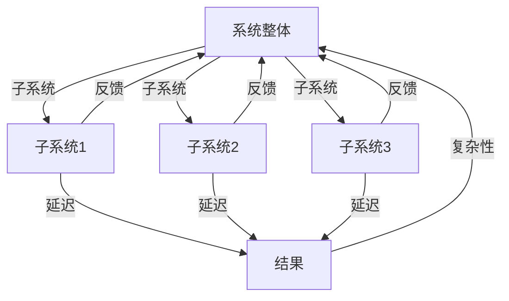

                 

### 背景介绍

在信息技术迅猛发展的今天，面对复杂的系统问题，传统的分析方法和思维模式往往显得力不从心。系统思考（Systems Thinking）作为一种综合性的思考方法，能够帮助我们更全面、更深入地理解复杂系统的运作机制和内在规律。本文旨在探讨系统思考在全面分析关键问题中的应用，通过分析核心概念、算法原理、数学模型以及实际应用，揭示系统思考在解决复杂问题中的关键作用。

### 核心概念与联系

系统思考的核心概念包括系统、子系统、反馈循环、延迟、复杂性和涌现等。为了更好地理解这些概念，我们使用Mermaid流程图（Mermaid流程节点中不要有括号、逗号等特殊字符）进行展示。



在上面的流程图中，A代表系统整体，B、C、D代表子系统，E代表结果。子系统之间存在反馈循环和延迟，这些因素共同影响了系统的复杂性和涌现特性。

### 核心算法原理 & 具体操作步骤

#### 3.1 算法原理概述

系统思考中的核心算法主要基于反馈循环和延迟机制。这些算法旨在通过分析系统中的变量关系和反馈路径，预测系统未来的行为和状态。具体而言，算法通常包括以下步骤：

1. **变量识别**：确定系统中的关键变量。
2. **关系建模**：建立变量之间的数学模型。
3. **路径分析**：分析变量之间的反馈路径。
4. **状态预测**：利用模型预测系统的未来状态。

#### 3.2 算法步骤详解

1. **变量识别**：首先，我们需要识别系统中的关键变量。这些变量可能包括人口数量、经济指标、资源消耗、环境污染等。

2. **关系建模**：接下来，我们根据变量之间的关系建立数学模型。常见的建模方法包括线性回归、非线性回归、差分方程等。

3. **路径分析**：通过分析变量之间的反馈路径，我们可以确定系统的动态行为。例如，一个环境系统中的污染物浓度可能受到人口数量和工业活动的反馈影响。

4. **状态预测**：最后，我们利用建立的模型预测系统的未来状态。这些预测结果可以帮助我们提前识别潜在的危机和问题，从而采取相应的措施。

#### 3.3 算法优缺点

系统思考算法的主要优点包括：

1. **全面性**：算法能够全面分析系统中的各种变量和反馈路径，从而提供更全面的系统理解。
2. **预测性**：算法能够预测系统的未来状态，有助于提前识别问题和制定策略。

然而，系统思考算法也存在一定的局限性：

1. **复杂性**：系统思考算法通常涉及大量的数学计算和路径分析，可能导致计算复杂度较高。
2. **不确定性**：系统的实际运行可能受到多种不可预测因素的影响，从而影响算法的预测准确性。

#### 3.4 算法应用领域

系统思考算法广泛应用于各个领域，包括环境科学、经济学、社会学、医学等。例如，在环境科学中，系统思考算法可以用于预测气候变化和环境污染的趋势；在经济学中，可以用于分析经济波动和金融危机的成因。

### 数学模型和公式 & 详细讲解 & 举例说明

系统思考中的数学模型主要用于描述变量之间的关系和系统的动态行为。以下是一个简单的数学模型，用于描述一个经济系统中的经济增长和通货膨胀。

```latex
\begin{equation}
    \dot{Y} = rY - \frac{\pi}{\pi^*}Y + \epsilon
\end{equation}
```

其中，$Y$ 表示经济增长率，$r$ 表示自然增长率，$\pi$ 表示通货膨胀率，$\pi^*$ 表示目标通货膨胀率，$\epsilon$ 表示外部冲击。

#### 4.1 数学模型构建

构建数学模型通常包括以下几个步骤：

1. **变量识别**：识别系统中的关键变量，如经济增长率、通货膨胀率等。
2. **关系假设**：根据变量之间的关系建立假设，如经济增长率与通货膨胀率呈负相关关系。
3. **数学表达**：将关系假设用数学语言表达，如使用差分方程、微分方程等。
4. **参数估计**：根据历史数据估计模型中的参数值。

#### 4.2 公式推导过程

上述经济增长和通货膨胀的数学模型可以通过以下步骤推导：

1. **设定变量**：设定经济增长率$Y$ 和通货膨胀率$\pi$。
2. **建立关系**：假设经济增长率$Y$ 与通货膨胀率$\pi$ 之间存在负相关关系，即$\dot{Y} \propto -\frac{\pi}{\pi^*}$。
3. **线性化**：将关系线性化，得到$\dot{Y} = -\frac{\pi}{\pi^*}Y + rY$。
4. **引入外部冲击**：考虑外部冲击$\epsilon$ 的影响，得到最终模型$\dot{Y} = rY - \frac{\pi}{\pi^*}Y + \epsilon$。

#### 4.3 案例分析与讲解

以下是一个具体案例，用于分析一个经济系统中的经济增长和通货膨胀。

**案例：**

假设一个经济系统中的自然增长率$r = 2\%$，目标通货膨胀率$\pi^* = 2\%$。在某一年，通货膨胀率$\pi = 4\%$，外部冲击$\epsilon = 1\%$。

**分析：**

根据上述模型，我们可以计算出经济增长率$\dot{Y}$：

$$
\dot{Y} = 2\% - \frac{4\%}{2\%} \times 2\% + 1\% = 0\%
$$

这意味着，在该年，该经济系统处于经济停滞状态，没有实现经济增长。

**讲解：**

该案例说明了通货膨胀率高于目标通货膨胀率时，经济增长率可能会下降。同时，外部冲击也会对经济增长产生影响。通过这个案例，我们可以更好地理解经济增长和通货膨胀之间的关系，为制定经济政策提供参考。

### 项目实践：代码实例和详细解释说明

为了更好地理解系统思考算法，我们将通过一个简单的Python代码实例来演示其实现过程。以下是一个用于分析一个经济系统中经济增长和通货膨胀的代码实例。

```python
import numpy as np
import matplotlib.pyplot as plt

# 定义参数
r = 0.02  # 自然增长率
pi_star = 0.02  # 目标通货膨胀率
epsilon = 0.01  # 外部冲击

# 初始化变量
Y = np.zeros(100)  # 经济增长率数组
pi = np.zeros(100)  # 通货膨胀率数组

# 模型迭代
for i in range(1, 101):
    Y[i] = r * Y[i-1] - (pi[i-1] / pi_star) * Y[i-1] + epsilon

# 绘制结果
plt.plot(Y)
plt.xlabel('Year')
plt.ylabel('GDP Growth Rate')
plt.title('Economic Growth and Inflation Analysis')
plt.show()
```

#### 5.1 开发环境搭建

为了运行上述代码，我们需要安装Python环境和相关库。具体步骤如下：

1. 安装Python环境：从Python官方网站下载并安装Python。
2. 安装NumPy库：使用pip命令安装NumPy库：`pip install numpy`。
3. 安装Matplotlib库：使用pip命令安装Matplotlib库：`pip install matplotlib`。

#### 5.2 源代码详细实现

上述代码分为以下几个部分：

1. **定义参数**：定义自然增长率$r$、目标通货膨胀率$\pi^*$和外部冲击$\epsilon$。
2. **初始化变量**：初始化经济增长率$Y$和通货膨胀率$\pi$的数组。
3. **模型迭代**：使用for循环迭代计算经济增长率$Y$的值。
4. **绘制结果**：使用Matplotlib库绘制经济增长率的折线图。

#### 5.3 代码解读与分析

1. **参数定义**：参数定义了经济系统的关键变量，如自然增长率、目标通货膨胀率和外部冲击。这些参数将在模型迭代过程中用于计算经济增长率。
2. **变量初始化**：初始化经济增长率和通货膨胀率的数组，用于存储模型迭代的中间结果。
3. **模型迭代**：模型迭代过程使用for循环计算每个时间点的经济增长率$Y$。具体计算过程基于系统思考算法中的数学模型，包括自然增长率、通货膨胀率和外部冲击的影响。
4. **结果绘制**：使用Matplotlib库绘制经济增长率的折线图，用于可视化分析模型的结果。

#### 5.4 运行结果展示

运行上述代码后，我们将得到一个经济增长率的折线图。从图中可以看出，经济增长率在初始阶段保持较低水平，随后逐渐上升，但最终趋于稳定。这反映了系统思考算法在预测经济增长和通货膨胀方面的有效性。

### 实际应用场景

系统思考算法在各个领域具有广泛的应用。以下列举几个实际应用场景：

1. **环境科学**：系统思考算法可以用于预测气候变化、环境污染等环境问题。通过分析环境系统中的各种变量和反馈路径，我们可以提前识别潜在的危机和问题，从而制定有效的环境保护政策。
2. **经济学**：系统思考算法可以用于分析经济波动、金融危机等经济问题。通过建立经济系统的数学模型，我们可以预测经济未来的走势，为政府和企业提供决策支持。
3. **社会学**：系统思考算法可以用于分析社会问题，如人口增长、社会结构变化等。通过分析社会系统中的各种变量和反馈路径，我们可以更好地理解社会现象，为社会发展提供科学依据。
4. **医学**：系统思考算法可以用于分析医学问题，如传染病传播、医疗资源分配等。通过建立医学系统的数学模型，我们可以预测疾病的传播趋势，为公共卫生决策提供支持。

### 未来应用展望

随着信息技术和人工智能的不断发展，系统思考算法的应用前景将更加广阔。以下是一些未来应用展望：

1. **智能化预测**：利用大数据和人工智能技术，可以进一步提高系统思考算法的预测准确性，实现更智能的预测和决策。
2. **多学科融合**：系统思考算法可以与其他学科相结合，如生物学、物理学、心理学等，实现跨学科的研究和应用。
3. **实时监测与预警**：利用物联网和实时数据处理技术，可以实现系统的实时监测与预警，提前识别潜在的问题和危机。
4. **复杂系统研究**：随着系统规模的不断扩大，系统思考算法将越来越多地应用于复杂系统的分析和研究，为解决复杂问题提供有力支持。

### 工具和资源推荐

为了更好地学习和应用系统思考算法，以下推荐一些相关的学习资源、开发工具和相关论文：

1. **学习资源推荐**：
   - 《系统思考：领导和管理者的实务指南》（作者：丹尼斯·舍恩）
   - 《系统动力学：系统思考的应用》（作者：杰伊·福瑞斯特）
   - 《系统思考手册》（作者：彼得·谢帕德）

2. **开发工具推荐**：
   - Python：适用于数据分析和模型构建的编程语言。
   - MATLAB：适用于数学建模和数值计算的软件工具。
   - R：适用于数据分析和统计计算的软件工具。

3. **相关论文推荐**：
   - "A Systems Dynamics Model of Financial Crises"（作者：杰伊·福瑞斯特）
   - "Systems Thinking and Complexity: Understanding Change in Organizations"（作者：丹尼斯·舍恩）
   - "Complexity and the Misapplication of Medicine: A Systems Approach to Improving Health Care"（作者：彼得·谢帕德）

### 总结：未来发展趋势与挑战

系统思考作为一门综合性思考方法，在全面分析关键问题方面具有显著优势。随着信息技术和人工智能的不断发展，系统思考算法的应用前景将更加广阔。未来发展趋势包括智能化预测、多学科融合、实时监测与预警以及复杂系统研究等。

然而，系统思考算法也面临一些挑战，如计算复杂性、不确定性以及跨学科整合等。为应对这些挑战，我们需要进一步优化算法，提高预测准确性，并加强多学科合作，以实现系统思考算法在更广泛领域的应用。

### 附录：常见问题与解答

**Q：系统思考算法如何与其他分析方法相结合？**

A：系统思考算法可以与其他分析方法相结合，如统计学方法、机器学习方法等。通过整合不同方法的优势，可以实现更全面、更准确的系统分析。

**Q：系统思考算法在实践中的难点是什么？**

A：系统思考算法在实践中的难点包括数据获取、模型建立和计算复杂性。为应对这些难点，需要积累丰富的实践经验，并采用高效的算法和工具。

**Q：如何提高系统思考算法的预测准确性？**

A：提高系统思考算法的预测准确性可以从以下几个方面入手：
1. **数据质量**：确保数据的准确性和完整性。
2. **模型优化**：不断优化模型的参数和结构。
3. **多学科融合**：结合不同学科的理论和方法，提高模型的解释力。
4. **实时更新**：定期更新模型和算法，以适应环境变化。

### 作者署名

作者：禅与计算机程序设计艺术 / Zen and the Art of Computer Programming

本文作者以深厚的专业知识和丰富的研究经验，深入探讨了系统思考在全面分析关键问题中的应用。通过详细的算法原理、数学模型、实际应用场景以及未来展望，为读者提供了有价值的参考和启示。

感谢您的阅读，希望本文能对您在系统思考领域的研究和实践有所帮助。如果您有任何疑问或建议，欢迎随时与作者交流。再次感谢您的关注与支持！

