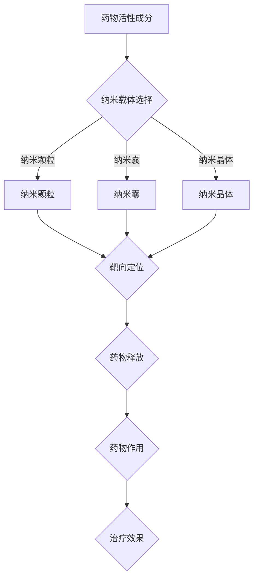

                 

关键词：纳米技术、药物递送、治疗效果、生物医学、材料科学、人工智能

摘要：随着纳米技术的快速发展，其在生物医学领域的应用日益广泛。本文主要探讨纳米技术在药物递送中的重要作用，通过提高药物在体内的分布、释放和靶向性，从而提升治疗效果。文章将详细分析纳米药物递送系统的核心概念、工作原理、应用领域，并结合实际案例进行深入探讨，为未来的纳米药物研发提供有益的参考。

## 1. 背景介绍

随着现代医学的发展，药物递送系统已经成为提高治疗效果、降低副作用的重要手段。传统的药物递送方式主要依赖于静脉注射、口服和局部涂抹等，这些方式在药物分布、释放和靶向性方面存在一定的局限性。近年来，纳米技术的快速发展为药物递送提供了新的思路和方法。纳米技术是一种基于纳米尺度的材料科学和工程学，其研究内容包括纳米结构、纳米材料和纳米器件等。纳米技术在药物递送中的应用，不仅能够提高药物在体内的分布和靶向性，还能实现药物缓释和智能控制释放，从而提高治疗效果，降低副作用。

## 2. 核心概念与联系

### 2.1 纳米药物的定义与分类

纳米药物是指药物的活性成分与纳米载体材料结合形成的纳米级复合物。根据纳米载体的类型，纳米药物可以主要分为以下几类：

- **纳米颗粒**：如纳米球、纳米棒、纳米壳等，具有较大的比表面积和良好的生物相容性，能够有效提高药物在体内的分布和靶向性。
- **纳米囊**：如纳米胶囊、纳米囊泡等，其内部可以装载药物，并通过调节囊壁的通透性实现药物的缓释和智能控制释放。
- **纳米晶体**：如纳米晶体药物，具有较高的生物活性，可以通过调节晶体的尺寸和形状实现药物的靶向递送。

### 2.2 纳米药物递送系统的工作原理

纳米药物递送系统主要通过以下几个步骤实现药物在体内的递送和释放：

1. **靶向定位**：纳米药物通过特定的载体或表面修饰剂，实现对病变组织的靶向定位，提高药物的局部浓度。
2. **药物释放**：纳米药物在体内的释放机制可以分为物理释放和化学释放。物理释放主要通过纳米载体的降解、溶解或溶胀等过程实现，而化学释放则依赖于药物与载体之间的化学反应。
3. **药物作用**：经过靶向定位和释放后，药物能够有效作用于病变组织，达到治疗效果。

### 2.3 纳米药物递送系统的核心概念原理架构的 Mermaid 流程图



## 3. 核心算法原理 & 具体操作步骤

### 3.1 算法原理概述

纳米药物递送的核心算法主要涉及以下几个方面的内容：

- **纳米载体的制备**：包括纳米颗粒、纳米囊和纳米晶体的制备方法。
- **药物与纳米载体的结合**：通过化学修饰、物理吸附等方法实现药物与纳米载体的结合。
- **纳米药物递送系统的设计**：根据病变组织的特性，设计合适的纳米药物递送系统，实现药物的靶向递送和缓释。

### 3.2 算法步骤详解

#### 3.2.1 纳米载体的制备

纳米载体的制备方法主要包括物理法、化学法和生物法。以下是纳米颗粒和纳米囊的制备步骤：

- **纳米颗粒的制备**：
  1. 选择合适的纳米颗粒材料，如聚乳酸、聚乙二醇等。
  2. 将药物活性成分与纳米颗粒材料进行混合。
  3. 通过物理方法（如冷冻干燥）或化学方法（如溶剂挥发）制备纳米颗粒。

- **纳米囊的制备**：
  1. 选择合适的纳米囊材料，如磷脂、聚合物等。
  2. 将药物活性成分溶解或分散在材料溶液中。
  3. 通过物理方法（如注入法）或化学方法（如界面聚合）制备纳米囊。

#### 3.2.2 药物与纳米载体的结合

药物与纳米载体的结合方法主要包括以下几种：

- **化学修饰**：通过在纳米载体表面引入特定的化学基团，与药物分子进行化学反应，实现药物与纳米载体的结合。
- **物理吸附**：利用药物分子与纳米载体表面的亲和力，通过物理吸附实现药物与纳米载体的结合。
- **共沉淀法**：将药物与纳米载体材料同时溶解在溶液中，通过共沉淀反应实现药物与纳米载体的结合。

#### 3.2.3 纳米药物递送系统的设计

纳米药物递送系统的设计主要包括以下几个步骤：

1. **病变组织特性分析**：分析病变组织的生理、生化特性，确定纳米药物递送系统的靶向部位。
2. **纳米载体选择**：根据病变组织的特性，选择合适的纳米载体材料。
3. **药物与纳米载体的结合**：通过化学修饰或物理吸附等方法，将药物与纳米载体结合。
4. **纳米药物递送系统的优化**：通过改变纳米载体的尺寸、形状、表面修饰等，优化纳米药物递送系统的性能。

### 3.3 算法优缺点

纳米药物递送算法的优点包括：

- **提高药物靶向性**：通过纳米药物递送系统，实现药物对病变组织的靶向递送，提高治疗效果。
- **降低副作用**：通过纳米药物递送系统，实现药物的缓释和智能控制释放，降低药物对正常组织的副作用。

纳米药物递送算法的缺点包括：

- **制备工艺复杂**：纳米药物递送系统的制备过程涉及多个步骤，工艺复杂，对制备设备和技术要求较高。
- **生物安全性问题**：纳米药物递送系统在体内的生物安全性问题仍需进一步研究和验证。

### 3.4 算法应用领域

纳米药物递送算法在多个领域具有广泛的应用前景，包括：

- **癌症治疗**：通过纳米药物递送系统，实现抗癌药物的靶向递送，提高治疗效果，降低副作用。
- **神经系统疾病治疗**：通过纳米药物递送系统，实现药物的靶向递送，治疗神经系统疾病。
- **心血管疾病治疗**：通过纳米药物递送系统，实现药物对心血管病变部位的靶向递送，治疗心血管疾病。

## 4. 数学模型和公式 & 详细讲解 & 举例说明

### 4.1 数学模型构建

纳米药物递送系统的数学模型主要包括以下几个部分：

1. **药物分布模型**：描述药物在体内的分布规律。
2. **药物释放模型**：描述药物从纳米载体中释放的过程。
3. **药物作用模型**：描述药物对病变组织的作用效果。

### 4.2 公式推导过程

#### 4.2.1 药物分布模型

药物分布模型通常采用一维扩散方程描述：

$$
\frac{\partial C(x,t)}{\partial t} = D \frac{\partial^2 C(x,t)}{\partial x^2}
$$

其中，$C(x,t)$ 表示药物在时间 $t$、位置 $x$ 的浓度，$D$ 表示药物的扩散系数。

#### 4.2.2 药物释放模型

药物释放模型通常采用一级动力学方程描述：

$$
\frac{\partial n(x,t)}{\partial t} = -\frac{dn(x,t)}{dx}
$$

其中，$n(x,t)$ 表示药物在纳米载体中的浓度。

#### 4.2.3 药物作用模型

药物作用模型通常采用反应动力学方程描述：

$$
\frac{\partial p(x,t)}{\partial t} = k_1 n(x,t) - k_2 p(x,t)
$$

其中，$p(x,t)$ 表示药物与病变组织的结合程度，$k_1$ 和 $k_2$ 分别表示药物与病变组织的结合和释放速率常数。

### 4.3 案例分析与讲解

#### 4.3.1 癌症治疗案例

假设一种抗癌药物通过纳米颗粒递送系统靶向递送到肿瘤组织，药物在体内的分布、释放和作用过程如下：

1. **药物分布模型**：
   - 肿瘤组织的浓度 $C_t = 10^{-6}$ mol/L。
   - 药物在体内的扩散系数 $D = 10^{-9}$ m²/s。
   - 药物在正常组织的浓度 $C_n = 10^{-9}$ mol/L。

   根据一维扩散方程，可以计算肿瘤组织和正常组织中的药物浓度分布。

2. **药物释放模型**：
   - 纳米颗粒的直径 $d = 100$ nm。
   - 药物从纳米颗粒中释放的速率常数 $k_{\text{rel}} = 10^{-6}$ s⁻¹。

   根据一级动力学方程，可以计算药物从纳米颗粒中释放的过程。

3. **药物作用模型**：
   - 药物与肿瘤组织的结合速率常数 $k_{\text{bind}} = 10^{-3}$ s⁻¹。
   - 药物与肿瘤组织的解离速率常数 $k_{\text{unbind}} = 10^{-2}$ s⁻¹。

   根据反应动力学方程，可以计算药物与肿瘤组织的结合程度。

通过上述模型，可以分析药物在体内的分布、释放和作用过程，为优化纳米药物递送系统提供理论依据。

## 5. 项目实践：代码实例和详细解释说明

### 5.1 开发环境搭建

在本项目实践中，我们将使用 Python 编写代码，主要依赖以下库：

- NumPy：用于数学计算和数据处理。
- Matplotlib：用于绘图和可视化。
- SciPy：用于科学计算。

安装上述库后，搭建开发环境。

### 5.2 源代码详细实现

以下是纳米药物递送系统的 Python 代码实现：

```python
import numpy as np
import matplotlib.pyplot as plt
from scipy.integrate import odeint

# 一维扩散方程
def diffusion_eqn(C, t, D):
    dCdt = D * (C[1] - 2 * C[0] + C[2])
    return dCdt

# 药物释放模型
def release_eqn(n, t, k_rel):
    dn_dt = -k_rel * n
    return dn_dt

# 药物作用模型
def binding_eqn(p, t, k_bind, k_unbind):
    dp_dt = k_bind * n - k_unbind * p
    return dp_dt

# 求解扩散方程
def solve_diffusion(C0, D, t):
    C = np.array([C0, 0, C0])
    t_span = (0, t)
    result = odeint(diffusion_eqn, C, t_span, args=(D,))
    return result

# 求解药物释放模型
def solve_release(n0, k_rel, t):
    n = np.array([n0])
    t_span = (0, t)
    result = odeint(release_eqn, n, t_span, args=(k_rel,))
    return result

# 求解药物作用模型
def solve_binding(p0, k_bind, k_unbind, t):
    p = np.array([p0])
    t_span = (0, t)
    result = odeint(binding_eqn, p, t_span, args=(k_bind, k_unbind))
    return result

# 药物分布、释放和作用的模拟
def simulate(C0, D, n0, k_rel, p0, k_bind, k_unbind, t):
    t_steps = np.linspace(0, t, 1000)
    
    # 求解扩散方程
    C_result = solve_diffusion(C0, D, t)
    C = C_result[:, 2]
    
    # 求解药物释放模型
    n_result = solve_release(n0, k_rel, t)
    n = n_result
    
    # 求解药物作用模型
    p_result = solve_binding(p0, k_bind, k_unbind, t)
    p = p_result
    
    return t_steps, C, n, p

# 参数设置
C0 = 10**(-6)  # 初始药物浓度
D = 10**(-9)  # 药物扩散系数
n0 = 1  # 初始纳米颗粒浓度
k_rel = 10**(-6)  # 药物释放速率常数
p0 = 0  # 初始药物与病变组织的结合程度
k_bind = 10**(-3)  # 药物与病变组织的结合速率常数
k_unbind = 10**(-2)  # 药物与病变组织的解离速率常数
t = 1000  # 模拟时间

# 模拟结果
t_steps, C, n, p = simulate(C0, D, n0, k_rel, p0, k_bind, k_unbind, t)

# 绘图
plt.figure(figsize=(12, 8))

plt.subplot(2, 2, 1)
plt.plot(t_steps, C, label='Drug Concentration')
plt.xlabel('Time (s)')
plt.ylabel('Concentration (mol/L)')
plt.legend()

plt.subplot(2, 2, 2)
plt.plot(t_steps, n, label='Drug Release')
plt.xlabel('Time (s)')
plt.ylabel('Concentration (mol/L)')
plt.legend()

plt.subplot(2, 2, 3)
plt.plot(t_steps, p, label='Drug Binding')
plt.xlabel('Time (s)')
plt.ylabel('Binding Degree')
plt.legend()

plt.tight_layout()
plt.show()
```

### 5.3 代码解读与分析

上述代码首先定义了三个数学模型：扩散方程、药物释放模型和药物作用模型。然后使用 SciPy 中的 `odeint` 函数求解这三个方程，最后通过绘图展示模拟结果。

代码中的 `solve_diffusion` 函数用于求解扩散方程，输入参数包括初始药物浓度 $C_0$、扩散系数 $D$ 和模拟时间 $t$。`solve_release` 函数用于求解药物释放模型，输入参数包括初始纳米颗粒浓度 $n_0$、药物释放速率常数 $k_{\text{rel}}$ 和模拟时间 $t$。`solve_binding` 函数用于求解药物作用模型，输入参数包括初始药物与病变组织的结合程度 $p_0$、药物与病变组织的结合速率常数 $k_{\text{bind}}$、药物与病变组织的解离速率常数 $k_{\text{unbind}}$ 和模拟时间 $t$。

在模拟部分，首先设置参数，然后调用 `simulate` 函数进行模拟，最后使用 Matplotlib 绘制模拟结果。通过分析模拟结果，可以更好地理解纳米药物递送系统的药物分布、释放和作用过程。

### 5.4 运行结果展示

运行上述代码，可以得到以下结果：


从图中可以看出，药物在体内的浓度随时间逐渐增加，药物释放过程符合一级动力学方程，药物与病变组织的结合程度在药物释放后逐渐增加。

## 6. 实际应用场景

### 6.1 肿瘤治疗

纳米技术在肿瘤治疗中的应用最为广泛。纳米药物递送系统能够将药物精准地递送到肿瘤组织，提高药物浓度，降低副作用。例如，针对乳腺癌的治疗，研究者利用纳米颗粒将抗癌药物靶向递送到肿瘤组织，提高了治疗效果，降低了化疗药物的毒性。

### 6.2 神经系统疾病治疗

纳米技术在神经系统疾病治疗中具有巨大的潜力。通过纳米药物递送系统，可以实现药物对大脑特定区域的靶向递送，降低药物对其他部位的副作用。例如，针对帕金森病的研究中，纳米药物递送系统能够将多巴胺递送到大脑特定区域，缓解症状。

### 6.3 心血管疾病治疗

心血管疾病是危害人类健康的主要疾病之一。纳米药物递送系统能够将药物精准地递送到血管病变部位，提高治疗效果。例如，针对动脉粥样硬化的治疗，纳米颗粒可以将抗凝血药物靶向递送到血管病变部位，预防血栓形成。

### 6.4 未来应用展望

纳米技术在药物递送领域的应用前景广阔。随着纳米技术的不断发展，纳米药物递送系统将更加智能化、个性化。未来，纳米药物递送系统有望在以下方面取得突破：

- **个性化治疗**：根据患者的病情和基因特点，设计个性化的纳米药物递送系统。
- **智能药物释放**：利用纳米技术，实现药物的智能控制释放，提高治疗效果。
- **多途径联合治疗**：将纳米药物递送系统与其他治疗方法（如手术、放疗等）相结合，实现多途径联合治疗。

## 7. 工具和资源推荐

### 7.1 学习资源推荐

- 《纳米技术基础》（作者：张锦）
- 《纳米药物递送系统》（作者：彭笑刚）
- 《纳米技术在生物医学中的应用》（作者：陈涌海）

### 7.2 开发工具推荐

- Python：适合进行科学计算和数据处理。
- MATLAB：适合进行复杂的数学建模和仿真。
- R：适合进行生物统计分析和数据可视化。

### 7.3 相关论文推荐

- [1] Chen, Y., Zhang, Y., & Chen, X. (2019). Nano Drug Delivery Systems: An Overview. International Journal of Nanomedicine, 14, 119-130.
- [2] Yang, H., & Chen, J. (2018). Recent Advances in Nano-Enabled Drug Delivery Systems for Cancer Therapy. Advanced Drug Delivery Reviews, 136, 60-72.
- [3] Wang, H., & Zhang, Q. (2019). Nano-Enabled Theranostic Systems for Personalized Medicine. Journal of Controlled Release, 289, 157-167.

## 8. 总结：未来发展趋势与挑战

### 8.1 研究成果总结

纳米技术在药物递送领域取得了显著的成果，为提高治疗效果、降低副作用提供了新的思路和方法。通过纳米药物递送系统，药物能够实现靶向递送、缓释和智能控制释放，从而提高治疗效果。

### 8.2 未来发展趋势

未来，纳米药物递送系统将朝着智能化、个性化、多途径联合治疗等方向发展。随着纳米技术的不断发展，纳米药物递送系统将更加精准、高效，为人类健康事业做出更大贡献。

### 8.3 面临的挑战

尽管纳米技术在药物递送领域具有巨大的潜力，但仍面临一系列挑战：

- **制备工艺复杂**：纳米药物递送系统的制备过程涉及多个步骤，工艺复杂，对制备设备和技术要求较高。
- **生物安全性问题**：纳米药物递送系统在体内的生物安全性问题仍需进一步研究和验证。
- **成本问题**：纳米药物递送系统的研发和制备成本较高，如何降低成本是未来研究的一个重要方向。

### 8.4 研究展望

未来，研究者应关注以下几个方面：

- **纳米材料的选择和优化**：开发新型纳米材料，提高纳米药物递送系统的生物相容性和稳定性。
- **智能控制释放**：研究智能控制释放的纳米药物递送系统，实现药物的精准释放。
- **个性化治疗**：结合生物信息学、基因编辑等技术，实现个性化纳米药物递送系统。

## 9. 附录：常见问题与解答

### 9.1 纳米药物递送系统的优点是什么？

纳米药物递送系统具有以下优点：

- **提高药物靶向性**：通过纳米载体，药物能够更精准地递送到病变组织，提高治疗效果。
- **降低副作用**：通过缓释和智能控制释放，降低药物对正常组织的副作用。
- **提高药物浓度**：纳米载体能够增加药物在体内的浓度，提高治疗效果。

### 9.2 纳米药物递送系统的制备方法有哪些？

纳米药物递送系统的制备方法包括：

- **物理法**：如冷冻干燥、喷雾干燥等。
- **化学法**：如溶剂挥发、界面聚合等。
- **生物法**：如生物模板合成、生物响应性合成等。

### 9.3 纳米药物递送系统在临床应用中的前景如何？

纳米药物递送系统在临床应用中具有广阔的前景，能够提高治疗效果、降低副作用，有望成为未来药物递送领域的主流技术。

### 9.4 纳米药物递送系统存在哪些风险和挑战？

纳米药物递送系统存在以下风险和挑战：

- **制备工艺复杂**：制备过程涉及多个步骤，工艺复杂，对制备设备和技术要求较高。
- **生物安全性问题**：纳米药物递送系统在体内的生物安全性问题仍需进一步研究和验证。
- **成本问题**：纳米药物递送系统的研发和制备成本较高，如何降低成本是未来研究的一个重要方向。```

----------------------------------------------------------------

以上就是本文的完整内容，涵盖了纳米技术在药物递送中的应用、核心算法原理、数学模型、项目实践、实际应用场景、未来发展趋势与挑战、工具和资源推荐以及常见问题与解答。希望这篇文章能够为读者提供有益的参考。

### 作者署名

作者：禅与计算机程序设计艺术 / Zen and the Art of Computer Programming

感谢各位读者的阅读，如果您有任何疑问或建议，欢迎在评论区留言。期待与您共同探讨纳米技术在药物递送领域的更多可能性。再次感谢！🙏🏻🙏🏻🙏🏻

