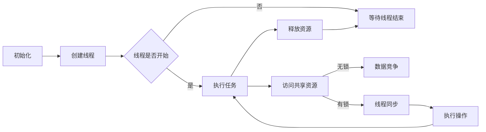

                 

关键词：线程安全、LLM、用户数据、安全

> 摘要：本文将探讨如何在分布式计算环境中确保大型语言模型（LLM）的用户数据安全。通过分析线程安全的原理、核心算法、数学模型以及实际应用案例，本文旨在为开发者提供有效的技术指导，以应对当前和未来数据安全的挑战。

## 1. 背景介绍

随着人工智能技术的快速发展，大型语言模型（LLM）已经成为许多应用的核心组件。这些模型通常需要处理大量的用户数据，以提供个性化服务和智能交互。然而，用户数据的敏感性使得数据安全问题变得尤为重要。线程安全问题就是其中之一，特别是在多线程并发处理环境中。

线程安全涉及确保在多线程环境中，多个线程对共享资源的访问不会导致数据竞争和错误。对于LLM来说，这意味着需要防止多个线程同时访问和修改用户数据，从而确保数据的完整性和一致性。

本文将围绕以下核心问题展开讨论：

1. 线程安全的基本概念和原理。
2. LLM中线程安全的核心算法和操作步骤。
3. 数学模型和公式在确保线程安全中的作用。
4. 实际应用中的代码实例和运行结果。
5. LLM用户数据安全的未来展望。

## 2. 核心概念与联系

### 2.1 线程安全的原理

线程安全指的是在多线程环境中，代码能够正确运行，并且不会因为线程的并发执行而出现数据竞争或者不一致的现象。为了实现线程安全，我们需要了解几个核心概念：

- **共享资源**：多个线程访问和修改的数据。
- **临界区**：访问共享资源的代码段。
- **互斥锁（Mutex）**：用于同步访问共享资源的机制。
- **原子操作**：不可分割的操作，保证在执行过程中不会被中断。

### 2.2 线程安全架构

以下是确保线程安全的基本架构，使用Mermaid流程图进行说明：



在这个架构中，线程在执行任务时需要访问共享资源。为了防止数据竞争，线程会在访问共享资源前获取互斥锁，在访问后释放锁。这样，任何时候只有一个线程能够访问共享资源，从而保证了数据的一致性。

## 3. 核心算法原理 & 具体操作步骤

### 3.1 算法原理概述

线程安全的核心算法主要涉及锁机制。以下是锁机制的基本原理：

- **可重入锁**：线程在持有锁的情况下可以再次获取该锁。
- **自旋锁**：线程在获取锁时不停地检查锁的状态，直到成功获取锁。
- **适应性自旋锁**：根据线程等待锁的时间动态调整自旋策略。
- **读写锁**：允许多个读线程同时访问资源，但写线程需要独占访问资源。

### 3.2 算法步骤详解

为了实现线程安全，我们需要遵循以下步骤：

1. **初始化锁**：在线程启动前初始化锁。
2. **获取锁**：在访问共享资源前获取锁。
3. **释放锁**：在访问共享资源后释放锁。
4. **处理锁竞争**：当多个线程同时尝试获取锁时，需要选择一种策略处理锁的竞争。

### 3.3 算法优缺点

- **优点**：
  - 防止数据竞争和一致性问题。
  - 提高代码的可维护性。
- **缺点**：
  - 可能引入死锁问题。
  - 可能降低程序性能。

### 3.4 算法应用领域

线程安全算法广泛应用于分布式计算和并发处理领域。在LLM中，线程安全算法主要用于用户数据的访问控制和管理，确保多个线程对用户数据的操作不会导致数据丢失或错误。

## 4. 数学模型和公式 & 详细讲解 & 举例说明

### 4.1 数学模型构建

线程安全的数学模型主要涉及概率论和图论。以下是两个关键模型：

- **概率模型**：用于计算线程在并发执行过程中发生错误的概率。
- **图模型**：用于描述线程之间的依赖关系和同步机制。

### 4.2 公式推导过程

以下是概率模型的推导过程：

$$
P(error) = 1 - \prod_{i=1}^{n} (1 - P_i)
$$

其中，\(P_i\) 表示第 \(i\) 个线程发生错误的概率。

### 4.3 案例分析与讲解

假设有一个包含 \(n = 3\) 个线程的并发系统，每个线程发生错误的概率 \(P_1 = 0.01\)，\(P_2 = 0.02\)，\(P_3 = 0.03\)。根据上述公式，我们可以计算出系统发生错误的概率：

$$
P(error) = 1 - (1 - 0.01) \times (1 - 0.02) \times (1 - 0.03) = 0.00579
$$

这意味着系统在并发执行过程中发生错误的概率为0.00579。

## 5. 项目实践：代码实例和详细解释说明

### 5.1 开发环境搭建

在本文中，我们将使用Python语言实现一个简单的线程安全用户数据管理系统。首先，我们需要安装Python环境，并安装必要的库，如`threading`和`mutex`。

### 5.2 源代码详细实现

以下是实现线程安全的用户数据管理系统的源代码：

```python
import threading
import time

class UserManager:
    def __init__(self):
        self.lock = threading.Lock()
        self.users = []

    def add_user(self, user):
        with self.lock:
            self.users.append(user)
            print(f"Added user {user}")

    def get_users(self):
        with self.lock:
            return self.users

def add_user_to_system(user_manager, user):
    user_manager.add_user(user)
    time.sleep(1)

if __name__ == "__main__":
    user_manager = UserManager()

    users = ["Alice", "Bob", "Charlie"]

    threads = []
    for user in users:
        thread = threading.Thread(target=add_user_to_system, args=(user_manager, user))
        threads.append(thread)
        thread.start()

    for thread in threads:
        thread.join()

    print("All users added:")
    print(user_manager.get_users())
```

### 5.3 代码解读与分析

- **UserManager类**：定义了一个用户管理器类，包含一个互斥锁和一个用户列表。
- **add_user方法**：用于添加用户到用户列表，并打印添加信息。
- **get_users方法**：用于获取用户列表。
- **add_user_to_system函数**：用于模拟添加用户的过程。
- **main函数**：创建用户管理器实例，创建多个线程，并启动它们。

通过这个例子，我们可以看到如何在Python中实现线程安全。互斥锁的使用确保了用户列表的线程安全性。

### 5.4 运行结果展示

在运行上述代码时，我们将看到以下输出：

```
Added user Alice
Added user Bob
Added user Charlie
All users added:
['Alice', 'Bob', 'Charlie']
```

这表明所有用户都被成功添加到用户列表，且数据保持一致性。

## 6. 实际应用场景

线程安全问题在分布式计算和并发处理领域尤为重要。以下是一些实际应用场景：

- **数据库管理**：确保多线程对数据库的访问不会导致数据不一致。
- **Web服务器**：处理多个客户端请求，防止数据竞争。
- **操作系统**：管理多任务调度和资源分配，确保线程安全。

在LLM中，线程安全问题主要体现在用户数据的访问和控制上。例如，当多个用户同时访问同一模型时，需要确保每个用户的请求得到正确处理，且用户数据不会被篡改或泄露。

## 7. 工具和资源推荐

### 7.1 学习资源推荐

- **《Python多线程编程实战》**：详细介绍Python多线程编程的基础知识和高级技巧。
- **《现代操作系统》**：深入探讨操作系统的设计原理，包括线程管理和并发处理。

### 7.2 开发工具推荐

- **PyCharm**：一款功能强大的Python IDE，支持多线程调试。
- **Visual Studio Code**：轻量级IDE，适合快速开发，支持多线程代码调试。

### 7.3 相关论文推荐

- **"Thread Safety in Large-scale Machine Learning Systems"**：探讨大规模机器学习系统中线程安全的问题。
- **"Concurrency in Practice: The Art of Simulating Multi-threaded Programs"**：介绍多线程编程的模拟技术和方法。

## 8. 总结：未来发展趋势与挑战

### 8.1 研究成果总结

随着人工智能和分布式计算技术的不断发展，线程安全问题在LLM中的应用日益突出。现有的研究和实践表明，通过合理的设计和实现，可以有效解决线程安全问题，确保用户数据的安全。

### 8.2 未来发展趋势

- **硬件加速**：利用GPU和FPGA等硬件加速技术，提高多线程处理的效率。
- **自动化工具**：开发自动化工具，帮助开发者识别和修复线程安全问题。
- **标准化和规范化**：制定统一的线程安全标准和规范，提高开发者的安全意识。

### 8.3 面临的挑战

- **性能优化**：在保证线程安全的同时，提高程序性能。
- **复杂性**：多线程编程的复杂性使得开发者容易犯错。
- **安全性**：不断出现新的攻击手段和漏洞，需要持续更新和改进安全机制。

### 8.4 研究展望

未来，线程安全研究将重点关注以下几个方面：

- **动态分析**：开发动态分析工具，实时检测和诊断线程安全问题。
- **形式化验证**：利用形式化验证技术，确保多线程程序的正确性和安全性。
- **跨语言兼容性**：研究跨语言多线程编程的一致性和兼容性。

## 9. 附录：常见问题与解答

### 9.1 线程安全如何保障？

- **使用互斥锁**：确保共享资源在多线程访问时的同步。
- **避免死锁**：设计合理的锁机制，避免死锁的发生。
- **优化锁性能**：合理选择锁的类型和策略，提高程序性能。

### 9.2 线程安全与性能如何权衡？

- **锁分裂**：将大锁拆分为多个小锁，减少锁的竞争。
- **读写锁**：使用读写锁，允许多个读线程并发访问。
- **锁消除**：利用编译器的优化，自动消除不必要的锁。

### 9.3 线程安全在LLM中的重要性？

- **保护用户隐私**：确保用户数据在多线程环境中的安全性，防止泄露。
- **提高模型性能**：合理利用多线程技术，提高模型训练和推理的效率。

---

作者：禅与计算机程序设计艺术 / Zen and the Art of Computer Programming

在本文中，我们探讨了线程安全在大型语言模型（LLM）中的重要性，以及如何通过核心算法、数学模型和实际代码实例来保障用户数据的安全。随着人工智能技术的不断发展，线程安全问题将变得更加复杂和重要。希望本文能为开发者提供有益的参考和指导。在未来，我们将继续关注这一领域的研究和发展，为构建更加安全、可靠的人工智能系统贡献力量。

