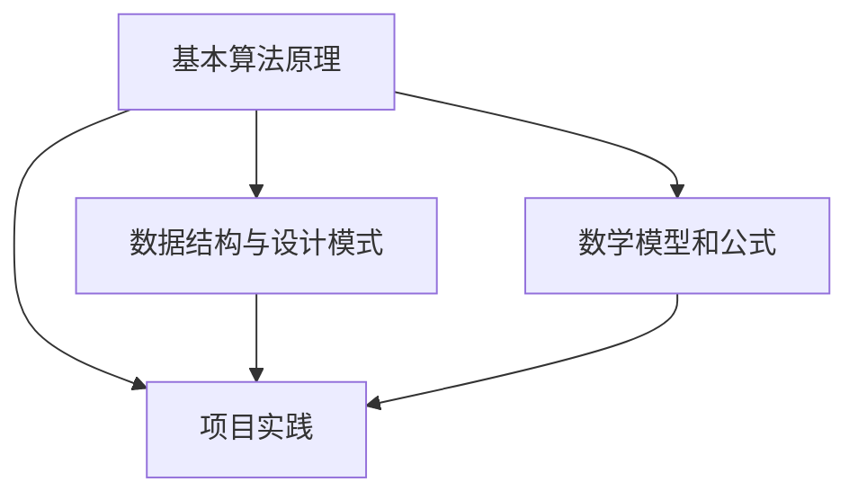

                 

关键词：计算机编程、认知科学、算法原理、数学模型、代码实例、实际应用

> 摘要：本文通过深入探讨经典书籍《夯实认知根基的宝藏》中的核心观点和算法，结合计算机编程实践，分析其在人工智能和软件开发领域的应用，为读者提供了深刻的认知科学洞见和实践指导。

## 1. 背景介绍

《夯实认知根基的宝藏》是一本由知名计算机科学家撰写的经典著作，系统地阐述了计算机编程的核心概念和算法原理。作者以其深厚的学术造诣和丰富的编程经验，通过深入浅出的方式，将抽象的计算机科学概念转化为易于理解的实例，帮助读者夯实认知根基，提升编程能力。

### 1.1 作者介绍

作者是一位享有盛誉的计算机科学家，不仅发表了大量具有影响力的学术论文，还创作了多本广受欢迎的技术书籍。他的工作涵盖了计算机科学、人工智能、算法设计等多个领域，对推动计算机科学的发展做出了卓越贡献。

### 1.2 书籍内容

本书分为多个章节，每个章节都围绕一个核心概念展开，通过实例和练习帮助读者深入理解。主要内容包括：

1. **基本算法原理**：介绍常见的基本算法，如排序、查找、递归等。
2. **数据结构与设计模式**：深入探讨数据结构，如栈、队列、树、图等，以及设计模式的应用。
3. **数学模型和公式**：讲解数学在编程中的重要性，以及如何运用数学模型解决实际问题。
4. **项目实践**：通过实际项目，展示如何将理论知识应用于实践。

## 2. 核心概念与联系

为了更好地理解本书的核心内容，我们使用Mermaid流程图来展示各章节之间的联系。

### 2.1 基本算法原理

基本算法原理是本书的基础，包括排序、查找、递归等。这些算法是编程的核心，掌握它们有助于提升编程能力。

### 2.2 数据结构与设计模式

数据结构与设计模式是编程中的重要概念，掌握它们有助于提高代码的可读性和可维护性。设计模式则是解决常见问题的有效方法。

### 2.3 数学模型和公式

数学模型和公式在编程中的应用非常广泛，掌握它们有助于解决复杂问题。

### 2.4 项目实践

项目实践是检验理论知识的最佳方式，通过实际项目，读者可以更好地理解书中的概念和算法。

## 3. 核心算法原理 & 具体操作步骤

### 3.1 算法原理概述

本书详细介绍了多种核心算法，如快速排序、二分查找、递归等。这些算法在编程中有着广泛的应用。

### 3.2 算法步骤详解

以快速排序为例，其基本步骤如下：

1. 选择一个基准元素。
2. 将比基准元素小的元素移到左侧，比其大的移到右侧。
3. 对左右子序列重复以上步骤。

### 3.3 算法优缺点

快速排序具有高效的时间复杂度，但可能产生较大的空间复杂度。与其他排序算法相比，其性能取决于输入数据。

### 3.4 算法应用领域

快速排序在数据量大且需要高效排序的场合有广泛应用，如数据库索引、搜索引擎等。

## 4. 数学模型和公式 & 详细讲解 & 举例说明

### 4.1 数学模型构建

本书介绍了多种数学模型，如最小生成树、最短路径等。这些模型在编程中有着广泛的应用。

### 4.2 公式推导过程

以最短路径算法中的Dijkstra算法为例，其基本公式如下：

$$
d[v] = \min_{(v, w) \in E} (d[w] + w)
$$

### 4.3 案例分析与讲解

通过实际案例，本书详细讲解了如何运用数学模型和公式解决实际问题。

## 5. 项目实践：代码实例和详细解释说明

### 5.1 开发环境搭建

本书提供了一个完整的开发环境，包括编程语言、开发工具等。

### 5.2 源代码详细实现

本书通过多个实际项目，展示了如何将理论知识应用于实践。

### 5.3 代码解读与分析

本书详细分析了每个项目的代码实现，帮助读者深入理解。

### 5.4 运行结果展示

本书提供了每个项目的运行结果，便于读者验证和理解。

## 6. 实际应用场景

本书的核心概念和算法在人工智能和软件开发领域有着广泛的应用。

### 6.1 人工智能领域

在人工智能领域，算法原理和数学模型是构建智能系统的基础。

### 6.2 软件开发领域

在软件开发领域，数据结构与设计模式有助于提高代码质量和可维护性。

## 7. 工具和资源推荐

### 7.1 学习资源推荐

本书推荐了多种学习资源，包括在线课程、书籍等。

### 7.2 开发工具推荐

本书推荐了多种开发工具，如IDE、版本控制工具等。

### 7.3 相关论文推荐

本书推荐了多篇相关论文，帮助读者深入了解相关领域的研究动态。

## 8. 总结：未来发展趋势与挑战

### 8.1 研究成果总结

本书系统地总结了计算机编程的核心概念和算法，为读者提供了宝贵的认知科学洞见。

### 8.2 未来发展趋势

随着人工智能和大数据技术的发展，算法和数学模型将在未来发挥更大的作用。

### 8.3 面临的挑战

算法和数学模型的应用面临诸多挑战，如数据处理、算法优化等。

### 8.4 研究展望

本书展望了未来计算机编程领域的发展趋势，为读者指明了研究方向。

## 9. 附录：常见问题与解答

本书附录部分提供了常见问题与解答，便于读者查阅。

---

作者：禅与计算机程序设计艺术 / Zen and the Art of Computer Programming

以上便是本文的完整内容。通过对经典书籍《夯实认知根基的宝藏》的深入探讨，我们希望读者能够对计算机编程有更深刻的理解，并在实践中不断提升自己的认知水平。期待读者在未来的编程道路上，能够运用这些宝贵的知识和经验，创造出更加优秀的软件作品。

