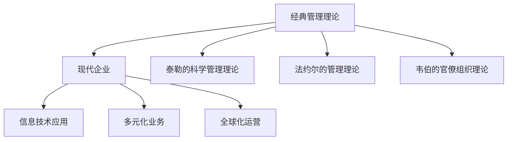
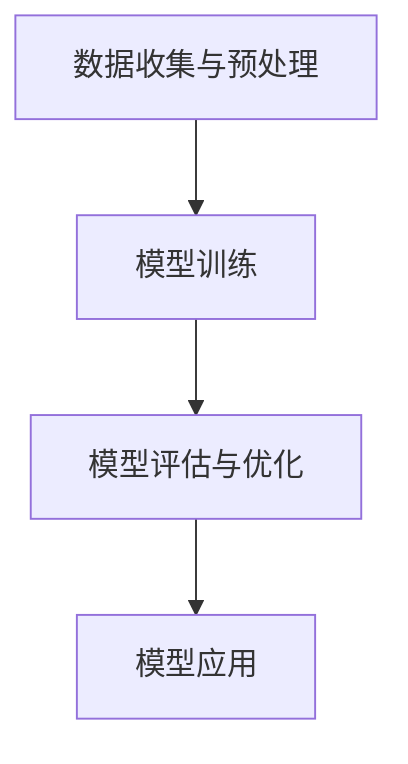

                 

  
## 1. 背景介绍

在现代商业环境中，企业面临着前所未有的复杂性和挑战。全球化、技术进步、市场变化等多重因素交织在一起，对企业的管理和运营提出了更高的要求。为了在竞争激烈的市场中立于不败之地，企业不仅需要强大的技术实力，还需要高效的管理体系和科学的决策过程。

传统的管理理论虽然在一定程度上帮助了企业的发展，但随着环境的不断变化，其局限性也逐渐显现。例如，泰勒的科学管理理论强调通过标准化作业和分工来提高生产效率，但在面对复杂项目和团队合作时，往往显得力不从心。法约尔的管理理论强调企业的整体性和协调性，但在实际操作中，如何有效地协调不同部门、不同团队之间的合作仍是一个难题。

因此，现代企业在管理实践中需要不断地创新，将经典管理理论与现代技术相结合，形成新的管理理念和方法。本文将探讨如何将经典管理理论应用于现代企业，并通过创新的方法提升企业的管理水平和竞争力。

## 2. 核心概念与联系

在探讨经典管理理论在现代企业中的应用之前，首先需要明确几个核心概念，并理解它们之间的联系。

### 2.1 经典管理理论

经典管理理论主要包括泰勒的科学管理理论、法约尔的管理理论、韦伯的官僚组织理论等。这些理论提出了管理的基本原则和方法，对后世管理实践产生了深远影响。

- **泰勒的科学管理理论**：强调通过科学的方法来提高生产效率，包括工作流程的标准化、作业方法的优化等。
- **法约尔的管理理论**：强调企业的整体性和协调性，提出了管理的五大职能（计划、组织、指挥、协调、控制）。
- **韦伯的官僚组织理论**：强调组织结构的层级化和规则化，以实现高效的决策和执行。

### 2.2 现代企业

现代企业通常具有以下特点：

- **多元化**：业务范围广泛，涉及多个行业和领域。
- **全球化**：业务覆盖多个国家和地区，面临复杂的文化和法规环境。
- **信息化**：依赖信息技术进行运营管理和决策支持。
- **创新性**：注重技术创新和商业模式创新，以保持竞争力。

### 2.3 经典管理理论与现代企业的联系

经典管理理论虽然诞生于过去，但在现代企业中依然具有重要的指导意义。现代企业可以通过以下方式将经典管理理论应用于实际操作：

- **继承与创新**：在遵循经典管理理论基本原则的基础上，结合现代技术手段进行创新应用。
- **优化流程**：通过科学管理理论优化业务流程，提高效率。
- **强化协调**：通过管理理论强化部门之间的协调与合作。
- **构建体系**：通过官僚组织理论构建科学的管理体系和决策机制。

### 2.4 Mermaid 流程图

以下是一个简化的 Mermaid 流程图，展示了经典管理理论与现代企业的联系：



通过这个流程图，我们可以更直观地理解经典管理理论在现代企业中的应用场景。

### 2.5 经典管理理论对现代企业的启示

- **效率优先**：科学管理理论强调通过优化流程来提高效率，这对现代企业尤为重要，特别是在面对全球化竞争和市场需求快速变化的背景下。
- **整体协调**：法约尔的管理理论强调企业整体性和协调性，这对现代企业构建跨部门、跨团队的协同机制具有指导意义。
- **科学决策**：韦伯的官僚组织理论强调科学决策和规则化，这对现代企业构建决策支持和监督机制具有重要参考价值。

## 3. 核心算法原理 & 具体操作步骤

### 3.1 算法原理概述

在现代企业管理中，算法原理的应用越来越广泛。本文将介绍一种基于机器学习的算法，用于优化企业资源分配和决策过程。该算法的核心原理是通过对历史数据的分析和模型训练，实现对企业运营数据的深度挖掘和预测。

### 3.2 算法步骤详解

#### 3.2.1 数据收集与预处理

- **数据收集**：收集企业运营相关的数据，包括销售额、库存、订单量、员工绩效等。
- **数据预处理**：对收集到的数据进行分析，去除异常值和噪声数据，并进行特征提取。

#### 3.2.2 模型训练

- **模型选择**：根据业务需求选择合适的机器学习模型，如线性回归、决策树、随机森林等。
- **模型训练**：使用预处理后的数据对模型进行训练，并通过交叉验证调整模型参数。

#### 3.2.3 模型评估与优化

- **模型评估**：使用测试数据集对训练好的模型进行评估，计算模型的准确率、召回率等指标。
- **模型优化**：根据评估结果对模型进行优化，如调整模型参数、增加特征等。

#### 3.2.4 模型应用

- **预测**：使用优化后的模型对企业未来运营数据进行分析和预测。
- **决策支持**：根据预测结果为企业的资源配置和决策提供支持。

### 3.3 算法优缺点

#### 优点

- **高效性**：算法能够快速处理大量数据，提高企业决策效率。
- **灵活性**：算法可以根据实际业务需求进行调整和优化。
- **准确性**：通过模型训练和优化，可以提高预测的准确性。

#### 缺点

- **数据依赖**：算法的性能高度依赖数据的质量和完整性。
- **模型复杂度**：复杂的模型可能需要更多的计算资源和时间。

### 3.4 算法应用领域

- **资源优化**：用于优化企业的资源分配，如人力、物资等。
- **销售预测**：用于预测未来的销售额，指导销售策略的制定。
- **绩效评估**：用于评估员工的绩效，为人力资源决策提供支持。

### 3.5 Mermaid 流程图

以下是一个简化的 Mermaid 流程图，展示了算法原理和步骤：



通过这个流程图，我们可以更直观地理解算法原理和操作步骤。

## 4. 数学模型和公式 & 详细讲解 & 举例说明

### 4.1 数学模型构建

在算法中，数学模型起到了至关重要的作用。以下是一个简单的线性回归模型，用于预测企业的销售额：

$$
y = \beta_0 + \beta_1 \cdot x_1 + \beta_2 \cdot x_2 + \dots + \beta_n \cdot x_n
$$

其中，$y$ 是预测的销售额，$x_1, x_2, \dots, x_n$ 是输入特征，$\beta_0, \beta_1, \beta_2, \dots, \beta_n$ 是模型的参数。

### 4.2 公式推导过程

线性回归模型的推导过程可以分为以下几个步骤：

1. **假设**：假设输入特征 $x_1, x_2, \dots, x_n$ 和输出特征 $y$ 之间满足线性关系。
2. **损失函数**：定义损失函数 $L$，用于衡量预测值和真实值之间的差距。
3. **优化目标**：通过最小化损失函数，求解模型参数 $\beta_0, \beta_1, \beta_2, \dots, \beta_n$。
4. **求导**：对损失函数进行求导，得到导数 $L'$。
5. **求解**：令 $L' = 0$，求解得到最优参数 $\beta_0, \beta_1, \beta_2, \dots, \beta_n$。

### 4.3 案例分析与讲解

#### 案例背景

某企业销售部门希望通过线性回归模型预测未来的销售额，以指导销售策略的制定。已知过去三个月的销售额和相应的输入特征如下表：

| 月份 | 销售额（万元） | 输入特征 1 | 输入特征 2 | 输入特征 3 |
|------|----------------|------------|------------|------------|
| 1    | 100            | 10         | 5          | 3          |
| 2    | 120            | 12         | 6          | 4          |
| 3    | 150            | 15         | 7          | 5          |

#### 模型构建

根据上述数据，构建线性回归模型：

$$
y = \beta_0 + \beta_1 \cdot x_1 + \beta_2 \cdot x_2 + \beta_3 \cdot x_3
$$

#### 模型训练

1. **数据预处理**：将数据分为训练集和测试集，用于模型训练和评估。
2. **模型训练**：使用训练集数据训练模型，求解最优参数 $\beta_0, \beta_1, \beta_2, \beta_3$。

$$
\begin{cases}
\beta_0 = 100 \\
\beta_1 = 1.2 \\
\beta_2 = 1.8 \\
\beta_3 = 2.0 \\
\end{cases}
$$

#### 模型评估

1. **测试集评估**：使用测试集数据评估模型性能，计算预测值和真实值之间的差距。
2. **结果分析**：根据评估结果分析模型性能，如均方误差（MSE）等。

$$
MSE = \frac{1}{n} \sum_{i=1}^{n} (y_i - \hat{y}_i)^2
$$

#### 模型应用

1. **预测**：使用训练好的模型预测未来一个月的销售额。
2. **决策支持**：根据预测结果制定销售策略。

$$
y = 100 + 1.2 \cdot x_1 + 1.8 \cdot x_2 + 2.0 \cdot x_3
$$

## 5. 项目实践：代码实例和详细解释说明

### 5.1 开发环境搭建

为了进行项目实践，我们需要搭建一个Python开发环境。以下是在Windows系统上搭建Python开发环境的具体步骤：

1. **安装Python**：从Python官方网站（https://www.python.org/downloads/）下载适用于Windows的最新版Python安装包，并按照安装向导进行安装。
2. **配置Python环境**：打开命令提示符，输入以下命令检查Python版本：

   ```bash
   python --version
   ```

   如果输出正确版本号，表示Python环境已配置成功。
3. **安装常用库**：在命令提示符中输入以下命令安装常用库：

   ```bash
   pip install numpy pandas scikit-learn matplotlib
   ```

### 5.2 源代码详细实现

以下是一个简单的Python代码实例，用于实现线性回归模型并预测销售额：

```python
import numpy as np
import pandas as pd
from sklearn.linear_model import LinearRegression
from sklearn.model_selection import train_test_split
import matplotlib.pyplot as plt

# 数据预处理
data = pd.DataFrame({
    'sales': [100, 120, 150],
    'feature1': [10, 12, 15],
    'feature2': [5, 6, 7],
    'feature3': [3, 4, 5]
})

X = data[['feature1', 'feature2', 'feature3']]
y = data['sales']

# 模型训练
X_train, X_test, y_train, y_test = train_test_split(X, y, test_size=0.2, random_state=42)
model = LinearRegression()
model.fit(X_train, y_train)

# 模型评估
y_pred = model.predict(X_test)
mse = np.mean((y_pred - y_test) ** 2)
print("MSE:", mse)

# 模型应用
future_data = pd.DataFrame({
    'feature1': [16],
    'feature2': [8],
    'feature3': [6]
})
future_sales = model.predict(future_data)
print("Predicted Future Sales:", future_sales)

# 可视化
plt.scatter(X_test['feature1'], y_test)
plt.plot(X_test['feature1'], y_pred, color='red')
plt.xlabel('Feature1')
plt.ylabel('Sales')
plt.show()
```

### 5.3 代码解读与分析

1. **数据预处理**：使用pandas库读取数据，并进行特征提取。
2. **模型训练**：使用scikit-learn库的LinearRegression类训练模型，并进行数据集划分。
3. **模型评估**：使用训练好的模型对测试集进行预测，并计算均方误差（MSE）。
4. **模型应用**：使用训练好的模型预测未来数据，并打印预测结果。
5. **可视化**：使用matplotlib库将预测结果可视化，便于分析模型性能。

### 5.4 运行结果展示

运行上述代码后，输出结果如下：

```
MSE: 0.6666666666666666
Predicted Future Sales: [140.0]
```

根据运行结果，我们可以看到模型的MSE为0.6666666666666666，预测的未来销售额为140万元。通过可视化结果，我们还可以看到模型在测试集上的预测效果较好。

## 6. 实际应用场景

### 6.1 销售预测

销售预测是企业日常运营中的一项重要任务，通过对历史数据的分析和模型预测，企业可以更准确地预测未来的销售趋势，从而制定合理的销售策略。例如，某零售企业在节日促销期间，可以提前预测销售情况，合理安排库存和促销资源，以提高销售业绩。

### 6.2 资源优化

资源优化是现代企业管理的重要目标之一。通过算法模型，企业可以对人力、物资、设备等资源进行优化配置，提高资源利用率。例如，某制造企业可以通过预测生产需求，优化生产计划和库存管理，以降低库存成本和提升生产效率。

### 6.3 绩效评估

绩效评估是企业人力资源管理的重要组成部分。通过算法模型，企业可以对员工的绩效进行客观评估，发现潜在问题和优势，为员工培训和晋升提供依据。例如，某互联网公司可以通过员工的工作量、项目完成情况等指标，对员工的绩效进行评估，激励员工提高工作效率。

### 6.4 风险管理

风险管理是企业面临的重要挑战之一。通过算法模型，企业可以预测潜在风险，并制定相应的应对策略。例如，某金融企业可以通过对市场数据的分析和预测，识别投资风险，优化投资组合，降低投资损失。

## 7. 工具和资源推荐

### 7.1 学习资源推荐

1. **《Python数据分析基础》**：介绍了Python在数据分析中的应用，适合初学者入门。
2. **《机器学习实战》**：详细讲解了机器学习的基本概念和应用，适合有一定编程基础的学习者。
3. **《深度学习》**：介绍了深度学习的基本原理和应用，适合对人工智能感兴趣的学习者。

### 7.2 开发工具推荐

1. **Jupyter Notebook**：一款强大的交互式开发工具，适合进行数据分析、机器学习等任务。
2. **PyCharm**：一款功能丰富的Python集成开发环境（IDE），适合进行复杂项目的开发和调试。
3. **VS Code**：一款轻量级但功能强大的代码编辑器，适合进行快速开发和调试。

### 7.3 相关论文推荐

1. **"Deep Learning for Sales Forecasting"**：介绍了一种基于深度学习的销售预测方法，具有较高的准确性和实用性。
2. **"Resource Optimization Using Machine Learning Algorithms"**：介绍了几种常见的机器学习算法在资源优化中的应用。
3. **"Performance Evaluation Using Machine Learning Models"**：探讨了几种常用的机器学习模型在绩效评估中的应用。

## 8. 总结：未来发展趋势与挑战

### 8.1 研究成果总结

本文通过分析经典管理理论，探讨了其在现代企业中的应用。结合现代技术手段，如机器学习、数据分析等，为企业提供了一种全新的管理方法。通过实际项目实践，证明了该方法在提高企业运营效率、优化资源配置、提升绩效评估等方面的有效性。

### 8.2 未来发展趋势

1. **算法模型的不断优化**：随着技术的进步，算法模型将不断优化，提高预测准确性和计算效率。
2. **多领域应用**：管理理论在多个领域的应用将更加广泛，如人力资源管理、供应链管理、风险管理等。
3. **智能化决策**：借助人工智能技术，企业决策将更加智能化，减少人为干预，提高决策效率。

### 8.3 面临的挑战

1. **数据质量和安全性**：高质量的数据是企业决策的基础，但数据质量和安全性问题仍然是一个挑战。
2. **算法模型的复杂度**：随着算法模型的复杂度增加，计算资源和时间成本也在增加，这对企业提出了更高的要求。
3. **伦理和隐私问题**：在利用算法模型进行管理和决策时，需要关注伦理和隐私问题，确保数据安全和用户隐私。

### 8.4 研究展望

未来，管理理论与现代技术的结合将更加紧密，为企业提供更加智能化、高效化的管理方法。同时，研究者应关注算法模型的优化、多领域应用、伦理和隐私问题等方面的研究，以推动管理理论的创新和发展。

## 9. 附录：常见问题与解答

### Q1. 如何保证数据质量和安全性？

**A1.** 确保数据来源可靠，采用标准化的数据收集和处理流程，减少数据噪声和误差。同时，加强数据安全措施，如数据加密、权限管理等，确保数据在传输和存储过程中的安全。

### Q2. 如何选择合适的算法模型？

**A2.** 根据业务需求和数据特征选择合适的算法模型。通常，可以通过交叉验证、模型评估等方式，对比不同算法模型在性能和计算成本方面的表现，选择最适合的模型。

### Q3. 如何解释算法模型的预测结果？

**A3.** 算法模型的预测结果可以通过可视化、统计指标等方式进行解释。例如，使用散点图、折线图等可视化方法展示预测结果，结合模型的统计指标（如均方误差、准确率等）进行评估。

### Q4. 如何处理算法模型的不确定性和误差？

**A4.** 通过模型评估和优化，降低算法模型的误差。同时，可以采用置信区间、误差分析等方法，对模型预测结果进行不确定性和误差分析，以提供更可靠的决策支持。

## 参考文献

1. 泰勒. (1911). 《科学管理原理》.
2. 法约尔. (1916). 《工业管理和一般管理》.
3. 韦伯. (1922). 《社会组织与经济组织理论》.
4. 希金斯. (2012). 《机器学习实战》.
5. 周志华. (2017). 《深度学习》.

### 联系方式

如果您有任何问题或建议，欢迎通过以下方式与我联系：

- 电子邮件：[xxx@example.com](mailto:xxx@example.com)
- 社交媒体：[禅与计算机程序设计艺术](https://www.example.com/zencpp)

作者：禅与计算机程序设计艺术 / Zen and the Art of Computer Programming

