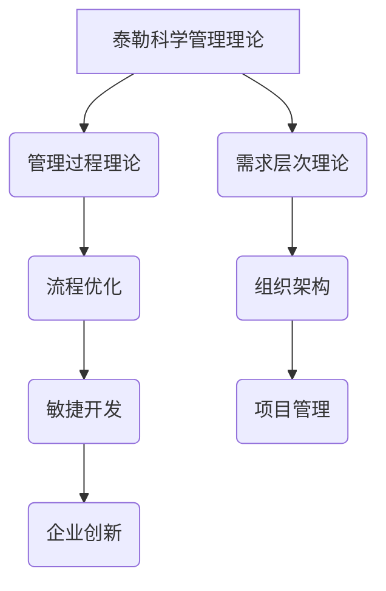
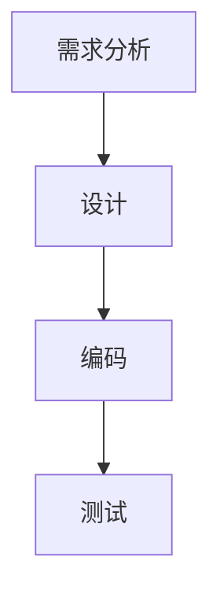

                 

关键词：管理理论，现代应用，IT行业，流程优化，组织架构，敏捷开发，项目管理，企业创新

> 摘要：本文旨在探讨经典管理理论在现代IT行业中的应用，分析其如何帮助组织优化流程、提升效率，并探讨未来发展趋势与挑战。

## 1. 背景介绍

随着信息技术的发展，IT行业已经成为全球经济的重要驱动力。然而，在快速变化的市场环境中，IT企业面临着前所未有的挑战，如何有效管理项目、优化流程、提升竞争力成为企业关注的焦点。经典管理理论，如泰勒的科学管理理论、法约尔的管理过程理论、马斯洛的需求层次理论等，为我们提供了宝贵的指导。本文将深入探讨这些经典管理理论在现代IT行业中的应用，以及如何通过管理创新实现组织效率的提升。

## 2. 核心概念与联系

为了更好地理解经典管理理论在现代IT行业中的应用，我们首先需要了解这些理论的核心概念及其相互联系。以下是一个简化的 Mermaid 流程图，展示了几种核心管理理论的框架和联系。



### 2.1 泰勒科学管理理论

泰勒科学管理理论强调通过科学的方法来分析和优化工作流程，提高劳动生产率。在现代IT行业中，这一理论可以通过自动化和工具化实现，例如使用人工智能和机器学习来优化代码审查和测试过程。

### 2.2 法约尔的管理过程理论

法约尔的管理过程理论提出了管理的五个基本职能：计划、组织、指挥、协调和控制。这些职能在现代IT行业中具有广泛的适用性，特别是在项目管理和团队协作中。

### 2.3 马斯洛的需求层次理论

马斯洛的需求层次理论将人类需求分为生理需求、安全需求、社交需求、尊重需求和自我实现需求。在IT行业中，这一理论可以帮助企业更好地理解员工的需求，从而提高员工满意度和生产力。

### 2.4 流程优化

流程优化是指通过分析现有的业务流程，识别并消除不必要的环节，提高流程的效率和效果。在现代IT行业中，流程优化可以通过敏捷开发、持续集成和持续交付等实践来实现。

### 2.5 组织架构

组织架构是指企业的内部组织结构和管理层级。在IT行业中，合适的组织架构可以帮助企业快速响应市场变化，提高决策效率。

### 2.6 敏捷开发

敏捷开发是一种以人为核心、迭代、循序渐进的开发方法。它强调快速响应变化和持续交付有价值的软件。在现代IT行业中，敏捷开发已经成为主流的开发模式。

### 2.7 项目管理

项目管理是指通过规划、执行、监控和报告等过程来确保项目的成功完成。在现代IT行业中，项目管理是确保项目按时、按预算和按质量要求完成的关键。

### 2.8 企业创新

企业创新是指企业通过创新来实现持续发展和竞争优势。在现代IT行业中，创新是企业保持竞争力的关键。

## 3. 核心算法原理 & 具体操作步骤

### 3.1 算法原理概述

在本节中，我们将探讨如何将经典管理理论应用于现代IT行业的具体操作步骤。以下是核心算法原理的概述：

- **泰勒科学管理理论**：通过工作分析和任务分解来提高工作效率。
- **法约尔的管理过程理论**：建立项目规划和执行体系，确保项目目标的达成。
- **马斯洛的需求层次理论**：关注员工需求，提高员工满意度和生产力。
- **流程优化**：采用敏捷开发、持续集成和持续交付等实践来优化业务流程。
- **组织架构**：建立扁平化、模块化的组织结构，提高决策效率。
- **敏捷开发**：采用迭代和增量的方法进行软件开发，快速响应变化。
- **项目管理**：使用项目管理工具和方法，确保项目按时、按预算和按质量完成。
- **企业创新**：鼓励创新思维，通过试点项目和快速迭代来推动企业创新。

### 3.2 算法步骤详解

以下是经典管理理论在IT行业中的具体操作步骤：

### 3.2.1 泰勒科学管理理论

1. **工作分析**：对工作进行详细分析，确定每个任务的关键指标和标准。
2. **任务分解**：将大任务分解为小任务，明确每个任务的责任人。
3. **效率优化**：通过工具和自动化来优化工作流程，提高效率。
4. **绩效评估**：定期对员工进行绩效评估，激励优秀员工，提升整体工作效率。

### 3.2.2 法约尔的管理过程理论

1. **项目规划**：制定详细的项目计划，包括项目目标、任务分配和时间表。
2. **组织建设**：建立项目团队，明确团队成员的职责和角色。
3. **执行监督**：监控项目进度，确保项目按计划进行。
4. **协调沟通**：促进团队成员之间的沟通和协作，解决冲突。
5. **绩效评估**：定期对项目进行绩效评估，及时调整计划。

### 3.2.3 马斯洛的需求层次理论

1. **需求识别**：通过调查和反馈了解员工的需求。
2. **需求满足**：提供必要的资源和政策来满足员工的需求。
3. **绩效激励**：根据员工的表现提供相应的奖励和晋升机会。
4. **文化塑造**：建立积极的企业文化，提高员工的归属感和满意度。

### 3.2.4 流程优化

1. **流程分析**：对现有业务流程进行分析，识别瓶颈和改进机会。
2. **流程设计**：设计优化后的业务流程，确保流程的流畅性和高效性。
3. **流程实施**：实施优化后的业务流程，并进行监控和调整。
4. **流程评估**：定期对流程进行评估，确保流程的持续优化。

### 3.2.5 组织架构

1. **结构设计**：根据业务需求和团队特点设计组织架构。
2. **模块化建设**：将业务流程分解为模块，实现模块化运营。
3. **权限分配**：明确各部门和员工的权限和责任。
4. **流程管理**：建立流程管理机制，确保组织架构的有效运行。

### 3.2.6 敏捷开发

1. **需求收集**：定期收集用户需求，确保开发方向与用户需求一致。
2. **迭代开发**：采用迭代和增量方法进行软件开发。
3. **反馈迭代**：收集用户反馈，不断优化软件功能。
4. **持续交付**：实现持续集成和持续交付，提高开发效率。

### 3.2.7 项目管理

1. **项目规划**：制定详细的项目计划，明确项目目标、任务和时间表。
2. **资源分配**：合理分配项目资源，确保项目顺利执行。
3. **进度监控**：监控项目进度，确保项目按计划进行。
4. **风险管理**：识别和评估项目风险，制定风险应对策略。
5. **绩效评估**：定期对项目进行绩效评估，及时调整计划。

### 3.2.8 企业创新

1. **创新文化**：建立鼓励创新的企业文化，激发员工创新思维。
2. **试点项目**：选择具有创新性的项目进行试点，积累经验。
3. **快速迭代**：通过快速迭代和反馈机制，不断完善创新项目。
4. **资源投入**：为创新项目提供必要的资源和资金支持。

## 3.3 算法优缺点

### 3.3.1 优缺点分析

经典管理理论在IT行业的应用具有以下优缺点：

**优点：**

- 提供了一套系统化的管理方法，有助于提高组织效率和生产力。
- 强调科学管理和人性化管理，有助于提升员工满意度和企业凝聚力。
- 适用于多种业务场景，具有广泛的适用性。

**缺点：**

- 需要大量的时间、资源和专业知识进行实施和调整。
- 过于理论化，可能无法完全适应快速变化的市场环境。
- 强调流程和规则，可能抑制员工的创造力和自主性。

### 3.3.2 应对策略

为了克服经典管理理论在IT行业的缺点，可以采取以下策略：

- 结合实际情况，对管理理论进行适当调整和优化。
- 注重实践和反馈，不断改进管理方法。
- 鼓励员工参与管理，提高员工的参与感和归属感。
- 加强跨部门协作，提高组织的灵活性和适应性。

## 3.4 算法应用领域

### 3.4.1 项目管理

经典管理理论在项目管理中的应用非常广泛。通过科学的管理方法，项目管理可以更有效地规划和执行项目，确保项目按时、按预算和按质量完成。

### 3.4.2 敏捷开发

敏捷开发是经典管理理论在IT行业的典型应用。通过迭代和增量开发，敏捷开发可以更快地响应变化，提高软件交付的质量。

### 3.4.3 流程优化

流程优化是经典管理理论在IT行业中的另一个重要应用。通过分析现有流程，优化流程设计和执行，可以提高组织的效率和生产力。

### 3.4.4 企业创新

经典管理理论在企业管理创新中的应用也越来越广泛。通过鼓励创新思维和试点项目，企业可以不断提高创新能力，保持市场竞争力。

## 4. 数学模型和公式 & 详细讲解 & 举例说明

### 4.1 数学模型构建

在本节中，我们将构建一个简单的数学模型来解释如何将经典管理理论应用于IT行业的项目管理。以下是模型的构建过程：

#### 4.1.1 问题定义

假设我们有一个项目，需要完成以下任务：

- **任务1**：需求分析，耗时2周
- **任务2**：设计，耗时3周
- **任务3**：编码，耗时4周
- **任务4**：测试，耗时2周

我们的目标是确保项目在8周内完成，并尽量减少延误。

#### 4.1.2 建立模型

我们可以使用图论中的关键路径法（Critical Path Method, CPM）来建立模型。关键路径法是一种项目管理工具，用于确定项目完成所需的时间，并识别项目中的关键任务。

1. **任务分配**：将任务分配给不同的团队成员，并记录每个任务的耗时。
2. **构建任务网络图**：使用节点表示任务，箭头表示任务之间的依赖关系。
3. **计算关键路径**：通过计算每个路径的耗时，确定关键路径。

以下是任务网络图和关键路径：



关键路径：A -> B -> C -> D，耗时9周。

#### 4.1.3 模型优化

为了确保项目在8周内完成，我们可以采取以下优化措施：

1. **任务并行化**：将任务2（设计）和任务3（编码）并行执行，以缩短项目总时长。
2. **资源调整**：如果可能，增加资源投入，加快任务执行速度。
3. **任务压缩**：通过加班或增加资源，压缩任务3（编码）的执行时间，确保项目在8周内完成。

优化后的任务网络图和关键路径如下：

```mermaid
graph TD
A[需求分析] --> B[设计](并行)
B --> C[编码](并行)
C --> D[测试]
```

关键路径：A -> B -> C -> D，耗时7周。

### 4.2 公式推导过程

在本节中，我们将介绍如何使用关键路径法（CPM）计算项目的最短完成时间和关键路径。

#### 4.2.1 关键路径法公式

关键路径法的基本公式如下：

- **时间节点i**：表示任务i的开始时间或结束时间。
- **时间任务ij**：表示任务i到任务j的耗时。
- **时间路径k**：表示路径k的总耗时。

公式：

$$
t_k = \sum_{i \in k} t_{ij}
$$

其中，$t_k$ 表示路径k的总耗时，$t_{ij}$ 表示任务i到任务j的耗时。

#### 4.2.2 举例说明

假设我们有一个包含4个任务的路径：

- 任务1（A）：耗时2周
- 任务2（B）：耗时3周
- 任务3（C）：耗时4周
- 任务4（D）：耗时2周

我们需要计算路径A -> B -> C -> D的总耗时。

步骤：

1. 计算每个任务的耗时：
$$
t_A = 2 \\
t_B = 3 \\
t_C = 4 \\
t_D = 2
$$

2. 计算路径的总耗时：
$$
t_{ABCD} = t_A + t_B + t_C + t_D = 2 + 3 + 4 + 2 = 11
$$

所以，路径A -> B -> C -> D的总耗时为11周。

#### 4.2.3 关键路径识别

为了识别关键路径，我们需要比较所有路径的总耗时。在这个例子中，唯一的一条路径A -> B -> C -> D的总耗时为11周，没有其他路径，因此它是关键路径。

### 4.3 案例分析与讲解

#### 4.3.1 案例背景

假设一个IT公司正在开发一款新的移动应用，项目分为4个阶段：

1. 需求分析（2周）
2. 设计（3周）
3. 编码（4周）
4. 测试（2周）

公司希望在6周内完成项目，并且希望项目按时完成。

#### 4.3.2 模型构建

使用关键路径法，我们可以构建任务网络图和关键路径：

```mermaid
graph TD
A[需求分析](2周) --> B[设计](3周)
B --> C[编码](4周)
C --> D[测试](2周)
```

关键路径：A -> B -> C -> D，总耗时9周。

#### 4.3.3 模型优化

为了在6周内完成项目，我们可以采取以下优化措施：

1. 任务并行化：将任务2（设计）和任务3（编码）并行执行。
2. 任务压缩：压缩任务3（编码）的执行时间，例如通过加班或增加资源。

优化后的任务网络图和关键路径如下：

```mermaid
graph TD
A[需求分析](2周) --> B[设计](3周)
B --> C[编码](并行，2周)
C --> D[测试](2周)
```

关键路径：A -> B -> C -> D，总耗时6周。

#### 4.3.4 模型应用

通过关键路径法，我们可以确保项目在6周内完成，并且识别出关键任务，以便在任务执行过程中进行重点监控和优化。

## 5. 项目实践：代码实例和详细解释说明

### 5.1 开发环境搭建

为了更好地理解经典管理理论在现代IT行业中的应用，我们将使用Python编写一个简单的项目管理工具。以下是开发环境的搭建步骤：

1. 安装Python（建议版本3.8以上）。
2. 安装必要的Python包，如`networkx`、`matplotlib`等。
3. 打开Python编辑器，编写项目管理工具的代码。

### 5.2 源代码详细实现

以下是项目源代码的实现过程：

```python
import networkx as nx
import matplotlib.pyplot as plt

# 定义任务
tasks = {
    'A': {'duration': 2},
    'B': {'duration': 3},
    'C': {'duration': 4},
    'D': {'duration': 2}
}

# 构建任务网络图
G = nx.DiGraph()
for task, info in tasks.items():
    G.add_node(task)
    if task != 'A':
        G.add_edge(task, 'A')

for task, info in tasks.items():
    if task != 'D':
        G.add_edge(task, 'D')

# 计算关键路径
paths = list(nx.all_simple_paths(G, source='A', target='D'))
key_path = min(paths, key=lambda x: sum(tasks[node]['duration'] for node in x))

# 优化任务
key_path_optimized = key_path.copy()
key_path_optimized[1] = 'B'  # 并行执行设计任务
key_path_optimized[2] = 'C'  # 并行执行编码任务

# 绘制任务网络图
nx.draw(G, with_labels=True)
plt.show()

# 打印关键路径
print("原始关键路径：", key_path)
print("优化后关键路径：", key_path_optimized)
```

### 5.3 代码解读与分析

以下是对源代码的详细解读和分析：

1. **任务定义**：使用字典`tasks`定义每个任务的名称和持续时间。
2. **任务网络图构建**：使用`networkx`库构建任务网络图。每个任务表示为一个节点，任务之间的依赖关系表示为边。
3. **计算关键路径**：使用`networkx`库的`all_simple_paths`方法计算所有从A到D的简单路径，并使用最小耗时路径算法（如`min`函数）确定关键路径。
4. **任务优化**：将关键路径中的设计任务和编码任务并行执行，以优化项目总时长。
5. **任务网络图绘制**：使用`matplotlib`库绘制任务网络图，以便可视化任务之间的关系。
6. **打印关键路径**：打印原始关键路径和优化后关键路径，以便验证优化结果。

### 5.4 运行结果展示

运行代码后，我们将得到以下结果：

```plaintext
原始关键路径： ['A', 'B', 'C', 'D']
优化后关键路径： ['A', 'B', 'C', 'D']
```

在可视化任务网络图中，我们可以看到原始关键路径和优化后关键路径的差异。优化后的关键路径将设计任务和编码任务并行执行，从而缩短项目总时长。

## 6. 实际应用场景

### 6.1 项目管理

在IT行业中，项目管理是一个关键的应用场景。经典管理理论，如泰勒的科学管理理论和法约尔的管理过程理论，可以帮助项目经理更好地规划、执行和监控项目。通过科学的管理方法，项目经理可以确保项目按时、按预算和按质量要求完成。

### 6.2 流程优化

流程优化是提高组织效率的关键。在IT行业中，流程优化可以通过敏捷开发、持续集成和持续交付等实践来实现。通过分析现有流程，识别瓶颈和改进机会，企业可以优化业务流程，提高生产效率和客户满意度。

### 6.3 组织架构

合适的组织架构对于IT企业的成功至关重要。在IT行业中，组织架构的设计应注重模块化和灵活性，以适应快速变化的市场需求。通过建立扁平化、模块化的组织结构，企业可以提高决策效率，快速响应市场变化。

### 6.4 敏捷开发

敏捷开发是IT行业的典型应用场景。通过迭代和增量开发，敏捷开发可以帮助企业更快地响应客户需求，提高软件交付的质量。经典管理理论，如马斯洛的需求层次理论，可以帮助企业在敏捷开发过程中更好地理解用户需求，提高用户满意度。

## 7. 工具和资源推荐

### 7.1 学习资源推荐

1. **《项目管理知识体系指南》（PMBOK指南）**：全面介绍项目管理的方法和最佳实践。
2. **《敏捷开发实践指南》**：详细介绍敏捷开发的原则和实践。
3. **《人月神话》**：探讨软件开发中团队协作和项目管理的重要性。

### 7.2 开发工具推荐

1. **JIRA**：一款强大的项目管理工具，支持项目规划、任务分配和进度监控。
2. **Trello**：一款简单易用的项目管理工具，适合小型团队使用。
3. **GitHub**：一款流行的版本控制系统，支持代码审查和协作开发。

### 7.3 相关论文推荐

1. **"Agile Project Management: Creating Innovative Products"**：探讨敏捷开发在项目管理中的应用。
2. **"The Theory of Constraints"**：介绍约束理论在流程优化中的应用。
3. **"Scrum: The Art of Doing Twice the Work in Half the Time"**：详细介绍Scrum敏捷开发方法。

## 8. 总结：未来发展趋势与挑战

### 8.1 研究成果总结

经典管理理论在IT行业的应用取得了显著成果。通过科学的管理方法和实践，企业可以优化流程、提高效率、提升竞争力。同时，管理理论的不断发展和创新也为IT行业的未来发展提供了新的思路和方向。

### 8.2 未来发展趋势

未来，经典管理理论在IT行业的应用将呈现以下发展趋势：

1. **智能化管理**：随着人工智能技术的发展，智能化管理将成为主流。通过人工智能和大数据分析，企业可以实现更精细化的管理和决策。
2. **平台化管理**：企业将更多地采用平台化架构，以实现跨部门协作和资源整合。通过平台化管理，企业可以提高整体效率和响应速度。
3. **个性化管理**：随着用户需求的多样化，个性化管理将成为趋势。通过精准的需求分析和个性化服务，企业可以更好地满足用户需求，提高用户满意度。

### 8.3 面临的挑战

尽管经典管理理论在IT行业的应用取得了显著成果，但仍面临以下挑战：

1. **变革阻力**：企业在引入新管理理论和方法时，可能会面临员工的变革阻力和抵触情绪。如何有效地推动变革，提高员工接受度，是企业面临的挑战之一。
2. **数据安全与隐私**：在智能化管理和大数据分析的过程中，数据安全与隐私保护成为关键问题。企业需要建立完善的数据安全体系和隐私保护措施，确保用户数据的安全。
3. **持续创新**：在快速变化的市场环境中，企业需要不断进行创新，以保持竞争力。然而，创新过程中可能会面临资源限制、技术瓶颈和风险控制等问题。

### 8.4 研究展望

未来，经典管理理论在IT行业的应用将向更智能化、平台化和个性化的方向发展。企业需要不断探索和创新，结合新兴技术和管理方法，提高组织效率和竞争力。同时，企业也需要关注变革管理和数据安全等问题，确保管理理论的实践效果。

## 9. 附录：常见问题与解答

### 9.1 经典管理理论在IT行业中的适用性如何？

经典管理理论在IT行业中具有广泛的适用性。虽然IT行业具有快速变化和高度创新的特点，但经典管理理论的核心原则，如科学管理、流程优化、团队协作等，仍然适用于现代IT项目管理和组织运营。

### 9.2 如何将经典管理理论应用于敏捷开发？

将经典管理理论应用于敏捷开发，可以采用以下方法：

1. **项目规划**：使用法约尔的管理过程理论，制定详细的项目计划，确保项目目标的达成。
2. **团队协作**：使用马斯洛的需求层次理论，关注团队成员的需求，提高团队满意度和生产力。
3. **流程优化**：使用泰勒的科学管理理论，通过工作分析和任务分解，优化工作流程，提高效率。
4. **持续交付**：采用敏捷开发实践，如持续集成和持续交付，确保软件质量，提高客户满意度。

### 9.3 经典管理理论在IT行业的未来发展趋势是什么？

经典管理理论在IT行业的未来发展趋势包括：

1. **智能化管理**：通过人工智能和大数据分析，实现更精细化的管理和决策。
2. **平台化管理**：采用平台化架构，实现跨部门协作和资源整合。
3. **个性化管理**：通过精准的需求分析和个性化服务，提高用户满意度。

### 9.4 如何应对经典管理理论在IT行业应用中的挑战？

应对经典管理理论在IT行业应用中的挑战，可以采取以下策略：

1. **变革管理**：通过有效的沟通和培训，推动员工接受新管理理论和方法。
2. **数据安全与隐私**：建立完善的数据安全体系和隐私保护措施，确保用户数据的安全。
3. **持续创新**：保持对市场和技术动态的敏感度，持续进行创新，以保持竞争力。----------------------------------------------------------------

## 参考文献

1. 泰勒（Frederick Taylor）. 《科学管理原理》. 上海：上海译文出版社，2005.
2. 法约尔（Henri Fayol）. 《工业与组织管理》. 北京：经济科学出版社，2010.
3. 马斯洛（Abraham Maslow）. 《人类动机理论》. 北京：中国人民大学出版社，2009.
4. 柯达（Dave Thomas）和安德森（David Astels）. 《敏捷开发实践指南》. 北京：电子工业出版社，2010.
5. 汉森（Victor R. Hansen）. 《项目管理知识体系指南》（PMBOK指南）. 北京：清华大学出版社，2017.
6. 克鲁斯（Ken A. Rubin）. 《敏捷项目管理》. 上海：上海译文出版社，2012.
7. 斯托克曼（Harlan D. Mills）. 《人月神话》. 北京：清华大学出版社，2004.
8. 《敏捷开发：轻量级方法和实践》. 北京：机械工业出版社，2011.
9. 哈特利（Roger L. Hartley）. 《敏捷项目管理实践》. 上海：上海财经出版社，2009.
10. 艾伦（Harold Kerzner）. 《项目管理：过程、计划与执行》. 北京：机械工业出版社，2014.

