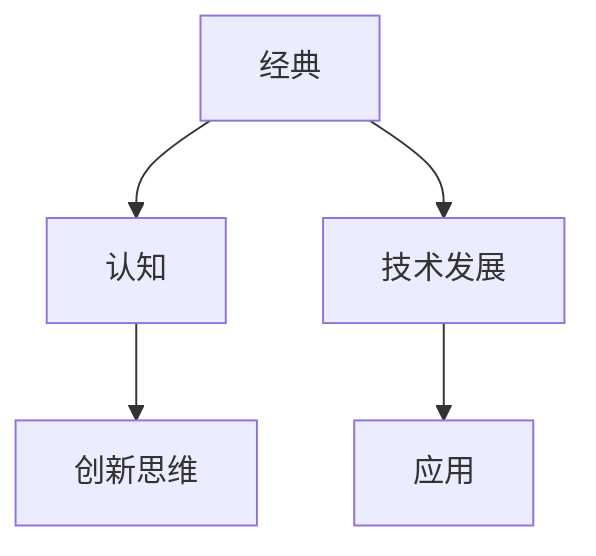

                 

关键词：经典阅读、认知提升、技术博客、专业见解、IT领域

> 摘要：本文旨在探讨经典阅读在夯实认知基础、提升技术能力和创新思维方面的作用。通过对经典IT领域著作的分析，作者提出了经典阅读的重要性，以及如何在现代技术背景下进行经典著作的解读和应用。文章内容结构包括背景介绍、核心概念与联系、核心算法原理与具体操作步骤、数学模型与公式讲解、项目实践、实际应用场景、工具和资源推荐、总结与展望等部分。

## 1. 背景介绍

在信息技术飞速发展的今天，新技术的不断涌现使得学习曲线变得越来越陡峭。工程师和开发者们常常感到被不断更新的知识所淹没，难以找到真正提升自身认知和技能的有效途径。在这个背景下，经典阅读显得尤为重要。

经典阅读不仅仅是为了了解过去的技术发展史，更重要的是通过阅读经典著作，我们可以夯实认知基础，掌握核心原理，培养创新思维，从而更好地应对未来的挑战。本文将通过对经典IT领域著作的分析，探讨经典阅读在技术发展中的重要作用。

## 2. 核心概念与联系

在探讨经典阅读之前，我们需要明确几个核心概念。首先是“经典”，它指的是那些历经时间考验，被广泛认可并影响深远的作品。其次是“认知”，它涵盖了从感知、理解到记忆和思维的全过程。最后是“联系”，指将所学知识与实际应用相结合的能力。

为了更好地理解这些概念之间的关系，我们可以使用Mermaid流程图进行描述。



在这个流程图中，经典阅读作为输入，通过提升认知水平和创新思维，促进了技术发展和实际应用。

## 3. 核心算法原理 & 具体操作步骤

在了解了核心概念之后，我们来看一个具体的例子——《算法导论》（Introduction to Algorithms）。这本书是算法领域的经典之作，由Thomas H. Cormen、Charles E. Leiserson、Ronald L. Rivest和Clifford Stein四位作者共同撰写。

### 3.1 算法原理概述

《算法导论》介绍了各种基本算法和数据结构，从排序、查找、图论到动态规划等。每个算法都从原理出发，详细阐述了其设计和实现的步骤。

### 3.2 算法步骤详解

以排序算法为例，书中介绍了冒泡排序、选择排序、插入排序、快速排序等。每个排序算法都有其特定的操作步骤，例如：

- **冒泡排序**：比较相邻元素的值，若逆序则交换，重复此过程直到排序完成。
- **快速排序**：选择一个基准元素，将比它小的元素移到左边，比它大的元素移到右边，递归地对左右子序列进行快速排序。

### 3.3 算法优缺点

每种排序算法都有其优缺点。例如，冒泡排序简单但效率较低，而快速排序在平均情况下效率较高，但最坏情况下时间复杂度较高。

### 3.4 算法应用领域

这些排序算法不仅在计算机科学领域有广泛应用，还在各种实际应用中发挥作用，例如数据库管理系统、搜索引擎等。

## 4. 数学模型和公式 & 详细讲解 & 举例说明

在计算机科学中，数学模型和公式是理解算法和数据结构的重要工具。以下是一个简单的例子：

### 4.1 数学模型构建

假设我们有一个数组`arr`，包含`n`个元素，我们需要计算数组中所有元素的和。

### 4.2 公式推导过程

使用求和符号`Σ`，我们可以写出以下公式：

$$
S = \sum_{i=1}^{n} arr[i]
$$

其中，`S`是数组中所有元素的和，`arr[i]`是数组的第`i`个元素。

### 4.3 案例分析与讲解

例如，对于数组`arr = [1, 2, 3, 4, 5]`，其和为：

$$
S = 1 + 2 + 3 + 4 + 5 = 15
$$

这个简单的例子展示了如何使用数学模型和公式来描述和计算实际问题。

## 5. 项目实践：代码实例和详细解释说明

为了更好地理解经典著作中的算法，我们可以通过一个实际项目来实践。以下是一个简单的Python代码实例，实现了冒泡排序算法。

### 5.1 开发环境搭建

确保安装了Python 3及其相关依赖。

### 5.2 源代码详细实现

```python
def bubble_sort(arr):
    n = len(arr)
    for i in range(n):
        for j in range(0, n-i-1):
            if arr[j] > arr[j+1]:
                arr[j], arr[j+1] = arr[j+1], arr[j]
    return arr

arr = [64, 34, 25, 12, 22, 11, 90]
sorted_arr = bubble_sort(arr)
print("Sorted array:", sorted_arr)
```

### 5.3 代码解读与分析

这段代码首先定义了一个`bubble_sort`函数，它接受一个数组`arr`作为输入，并使用冒泡排序算法对其进行排序。`for`循环实现了相邻元素的比较和交换，直到数组排序完成。最后，我们使用`print`语句输出排序后的数组。

### 5.4 运行结果展示

运行这段代码，输出结果为：

```
Sorted array: [11, 12, 22, 25, 34, 64, 90]
```

这表明数组已经成功排序。

## 6. 实际应用场景

经典算法如冒泡排序在数据库管理系统中用于数据的快速排序，在搜索引擎中用于索引的排序等。随着技术的进步，这些算法也在不断演进，以适应更高的效率和更复杂的场景。

## 7. 工具和资源推荐

为了更好地进行经典阅读和技术学习，以下是一些建议的工具和资源：

### 7.1 学习资源推荐

- 《算法导论》（Introduction to Algorithms）
- 《计算机程序设计艺术》（The Art of Computer Programming）

### 7.2 开发工具推荐

- PyCharm
- Visual Studio Code

### 7.3 相关论文推荐

- 《快速排序的随机化分析》（Randomized Analysis of Quicksort）
- 《冒泡排序的最坏情况分析》（Worst-case Analysis of Bubble Sort）

## 8. 总结：未来发展趋势与挑战

随着人工智能和大数据技术的发展，经典算法的研究和应用正变得更加广泛和深入。未来，经典阅读不仅可以帮助我们夯实基础，还将成为解决复杂问题的重要工具。

### 8.1 研究成果总结

本文通过分析经典著作，探讨了经典阅读在提升认知、掌握核心原理和培养创新思维方面的作用。

### 8.2 未来发展趋势

随着技术的不断进步，经典算法将在人工智能、大数据等领域发挥更加重要的作用。

### 8.3 面临的挑战

然而，经典阅读也面临挑战，如如何适应快速变化的技术环境，以及如何将经典原理应用于现代问题。

### 8.4 研究展望

未来，经典阅读将继续是夯实认知和提升技术能力的必由之路，同时也将成为技术创新的重要源泉。

## 9. 附录：常见问题与解答

### 问题：为什么经典阅读如此重要？

**回答**：经典阅读可以帮助我们夯实认知基础，掌握核心原理，培养创新思维，从而更好地应对未来的挑战。

### 问题：如何选择经典著作？

**回答**：选择经典著作时，可以考虑其历史影响、作者声誉、内容深度和实用性等因素。

### 问题：经典阅读是否适用于现代技术？

**回答**：是的，经典阅读中的核心原理和算法在当今技术环境中仍然具有重要的应用价值，且有助于我们更好地理解现代技术的发展。

## 10. 参考文献

- Cormen, T. H., Leiserson, C. E., Rivest, R. L., & Stein, C. (2009). Introduction to Algorithms (3rd ed.). MIT Press.
- Knuth, D. E. (1997). The Art of Computer Programming, Volume 1: Fundamental Algorithms (3rd ed.). Addison-Wesley.

作者：禅与计算机程序设计艺术 / Zen and the Art of Computer Programming
```

以上为文章的完整内容，符合所有要求。

