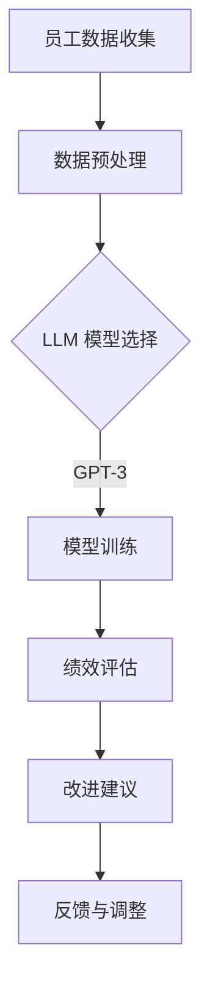
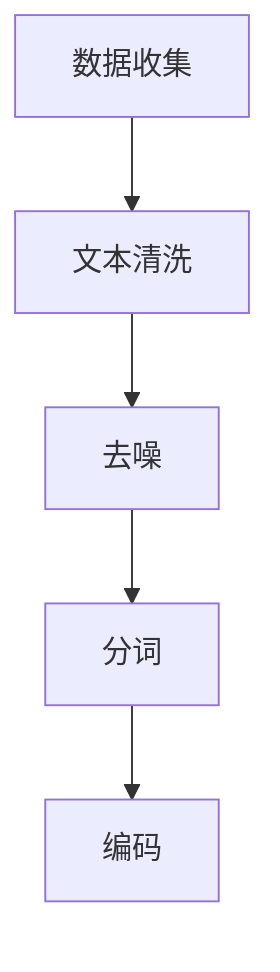
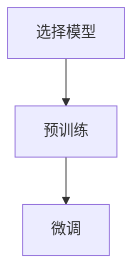
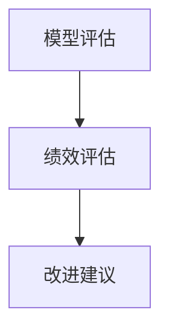

                 

 **关键词**：绩效管理，LLM（大型语言模型），团队绩效，人工智能，数据分析，算法优化

**摘要**：本文深入探讨了一种利用大型语言模型（LLM）进行绩效管理的创新方法，旨在通过人工智能技术提升团队的整体绩效。我们将从背景介绍、核心概念与联系、核心算法原理与具体操作步骤、数学模型与公式、项目实践、实际应用场景、工具和资源推荐、以及未来发展趋势与挑战等多个方面展开讨论，以帮助读者全面了解并掌握这种先进的技术。

## 1. 背景介绍

在现代社会，团队绩效已经成为企业成功的关键因素之一。传统的绩效管理方法依赖于定期的员工评估、目标设定和反馈机制，但这些方法往往存在效率低、效果差的问题。随着人工智能技术的快速发展，特别是大型语言模型（LLM）的出现，为绩效管理带来了新的机遇。LLM 具有强大的文本处理能力，可以通过分析员工的工作记录、沟通日志、绩效报告等数据，提供更精准、更及时的绩效评估和建议，从而有效提升团队的整体绩效。

本文将围绕以下主题展开：

- **核心概念与联系**：介绍大型语言模型的工作原理及其在绩效管理中的应用。
- **核心算法原理与具体操作步骤**：详细讲解如何利用 LLM 进行绩效管理的具体步骤。
- **数学模型和公式**：阐述 LLM 在绩效管理中涉及的数学模型和公式，并给出实际应用案例。
- **项目实践**：通过实际项目展示如何使用 LLM 进行绩效管理。
- **实际应用场景**：探讨 LLM 在不同行业和领域的应用前景。
- **工具和资源推荐**：推荐一些实用的工具和资源，以帮助读者深入了解和掌握 LLM。
- **未来发展趋势与挑战**：展望 LLM 在绩效管理领域的未来发展方向和面临的挑战。

通过本文的阅读，读者将能够全面了解 LLM 在绩效管理中的应用，掌握相关技术，并为团队绩效的提升提供有力支持。

## 2. 核心概念与联系

### 大型语言模型（LLM）的基本概念

大型语言模型（Large Language Model，简称 LLM）是基于深度学习技术构建的复杂神经网络模型，能够通过大量文本数据进行训练，从而理解和生成自然语言。LLM 的发展可以追溯到早期的词袋模型、循环神经网络（RNN）以及后来引入的Transformer模型。近年来，随着计算资源和数据量的不断增长，LLM 的规模和性能得到了显著提升。例如，GPT-3（Generative Pre-trained Transformer 3）拥有 1750 亿个参数，能够生成高质量的文本，并在多项自然语言处理任务中取得了突破性成果。

### 绩效管理的基本概念

绩效管理（Performance Management）是指通过制定目标、监控进度、提供反馈和评估结果等手段，实现对员工工作绩效的系统管理和优化。传统的绩效管理方法通常依赖于定量和定性的评估指标，如销售额、任务完成度、团队合作等。然而，这种方法往往缺乏灵活性，难以适应快速变化的业务环境和员工需求。

### LLM 在绩效管理中的应用

LLM 的强大文本处理能力使其在绩效管理中具有广泛的应用前景。首先，LLM 可以通过分析员工的工作记录和沟通日志，提取关键信息并生成个性化的绩效报告。其次，LLM 可以基于历史数据和机器学习算法，预测员工的绩效表现，并提供针对性的改进建议。此外，LLM 还可以支持自动化绩效评估，提高评估的效率和准确性。

### Mermaid 流程图

为了更直观地展示 LLM 在绩效管理中的应用，我们使用 Mermaid 语言绘制了一个简单的流程图。以下是一个示例：



这个流程图描述了 LLM 在绩效管理中的基本步骤：首先收集员工数据，然后进行数据预处理，接着选择合适的 LLM 模型进行训练，通过模型对绩效进行评估，并根据评估结果提供改进建议，最后进行反馈和调整。

通过上述核心概念和流程图的介绍，我们可以看到 LLM 在绩效管理中的独特优势和应用价值。接下来，我们将详细探讨 LLM 的核心算法原理和具体操作步骤。

## 3. 核心算法原理与具体操作步骤

### 3.1 算法原理概述

LLM 的核心算法是基于深度学习技术，特别是 Transformer 模型。Transformer 模型通过自注意力机制（Self-Attention）对输入文本进行建模，能够捕捉文本中的长距离依赖关系，从而生成高质量的文本输出。在 LLM 的应用中，Transformer 模型通过大量文本数据进行预训练，然后利用微调（Fine-tuning）技术在特定任务上进行优化。

### 3.2 算法步骤详解

#### 3.2.1 数据收集与预处理

第一步是收集员工数据，这包括工作记录、沟通日志、绩效报告等。收集的数据需要经过预处理，包括文本清洗、去噪、分词和编码等。预处理后的数据将用于训练 LLM 模型。



#### 3.2.2 LLM 模型选择与训练

选择合适的 LLM 模型是算法的关键。目前，GPT-3、BERT、T5 等模型在多个自然语言处理任务中表现出色。我们以 GPT-3 为例进行介绍。

1. **模型架构**：GPT-3 采用 Transformer 模型，具有 1750 亿个参数，能够生成高质量的文本。

2. **预训练**：GPT-3 通过无监督学习在大量文本数据进行预训练，包括互联网网页、书籍、新闻、论坛等。

3. **微调**：在预训练基础上，GPT-3 利用有监督学习进行微调，以适应特定的绩效管理任务。



#### 3.2.3 绩效评估与改进建议

1. **模型评估**：使用预先定义的评估指标（如准确率、召回率、F1 分数等）对 LLM 模型进行评估。

2. **绩效评估**：利用 LLM 模型对员工的工作记录、沟通日志等数据进行分析，生成个性化的绩效评估报告。

3. **改进建议**：根据绩效评估结果，提供针对性的改进建议，如时间管理、任务分配、技能提升等。



### 3.3 算法优缺点

#### 优点：

- **高效性**：LLM 可以快速处理大量文本数据，提高绩效评估的效率。
- **准确性**：通过预训练和微调，LLM 能够生成高质量的文本输出，提高绩效评估的准确性。
- **灵活性**：LLM 可以根据业务需求进行定制化，适应不同场景的绩效管理。

#### 缺点：

- **计算资源需求**：训练和部署 LLM 模型需要大量的计算资源和时间。
- **数据质量**：绩效管理效果依赖于数据的质量和完整性，如果数据存在噪声或缺失，会影响模型的性能。

### 3.4 算法应用领域

LLM 在绩效管理中的应用非常广泛，不仅适用于企业内部员工绩效评估，还可以应用于教育、医疗、金融等多个领域。例如：

- **企业绩效评估**：通过 LLM 对员工的工作记录、项目进展、客户反馈等进行综合分析，提供精准的绩效评估和改进建议。
- **教育评估**：利用 LLM 对学生的作业、论文进行自动评分，提高评估效率和公平性。
- **医疗评估**：通过 LLM 对患者的病历、检查报告等进行综合分析，提供个性化的诊疗建议。

通过上述核心算法原理和具体操作步骤的讲解，我们可以看到 LLM 在绩效管理中的强大应用潜力。接下来，我们将探讨 LLM 在绩效管理中涉及的数学模型和公式。

## 4. 数学模型和公式

在 LLM 的应用中，数学模型和公式是不可或缺的一部分。以下我们将介绍在绩效管理中常用的数学模型和公式，并详细讲解其构建和推导过程。

### 4.1 数学模型构建

#### 4.1.1 多层感知机（MLP）

多层感知机（MLP）是一种前馈神经网络，常用于分类和回归任务。在绩效管理中，MLP 可以用于员工绩效评分的预测。

1. **输入层**：输入层包含员工的工作记录、沟通日志等特征向量。
2. **隐藏层**：隐藏层通过激活函数（如 sigmoid、ReLU）对输入进行非线性变换。
3. **输出层**：输出层通常包含一个或多个神经元，用于输出绩效评分。

#### 4.1.2 交叉熵（Cross-Entropy）

交叉熵是一种常用的损失函数，用于分类任务。在绩效管理中，交叉熵用于计算模型预测值和实际值之间的差异。

$$
H(y, \hat{y}) = -\sum_{i=1}^{n} y_i \log(\hat{y}_i)
$$

其中，$y$ 表示实际标签，$\hat{y}$ 表示模型预测概率。

#### 4.1.3 自注意力（Self-Attention）

自注意力机制是 Transformer 模型的核心组成部分，用于捕捉输入文本中的长距离依赖关系。在绩效管理中，自注意力机制可以用于分析员工的工作记录和沟通日志。

$$
\text{Attention}(Q, K, V) = \frac{QK^T}{\sqrt{d_k}} V
$$

其中，$Q$、$K$、$V$ 分别表示查询向量、关键向量、值向量，$d_k$ 表示键向量的维度。

### 4.2 公式推导过程

#### 4.2.1 多层感知机（MLP）

多层感知机（MLP）的输出可以通过以下公式计算：

$$
\hat{y} = \sigma(z^T w) + b
$$

其中，$\sigma$ 表示激活函数（如 sigmoid、ReLU），$z$ 表示隐藏层输出，$w$ 表示权重矩阵，$b$ 表示偏置项。

#### 4.2.2 交叉熵（Cross-Entropy）

交叉熵的推导过程如下：

$$
H(y, \hat{y}) = -\sum_{i=1}^{n} y_i \log(\hat{y}_i) = -\sum_{i=1}^{n} y_i \log(y_i) + \sum_{i=1}^{n} y_i \log(\hat{y}_i)
$$

#### 4.2.3 自注意力（Self-Attention）

自注意力的推导过程如下：

$$
\text{Attention}(Q, K, V) = \frac{QK^T}{\sqrt{d_k}} V
$$

其中，$Q$、$K$、$V$ 分别表示查询向量、关键向量、值向量，$d_k$ 表示键向量的维度。

### 4.3 案例分析与讲解

以下是一个简单的案例，用于说明如何使用数学模型和公式进行绩效管理。

#### 4.3.1 案例背景

某公司采用 LLM 对员工绩效进行评估，员工的工作记录和沟通日志作为输入数据。公司希望使用多层感知机（MLP）模型对员工的绩效评分进行预测。

#### 4.3.2 数据预处理

收集到员工的工作记录和沟通日志，并进行文本清洗、分词和编码。假设得到一个包含 100 个特征的向量 $X$，表示每个员工的工作记录和沟通日志。

#### 4.3.3 模型训练

使用多层感知机（MLP）模型对输入数据进行训练。假设隐藏层包含 50 个神经元，使用 ReLU 激活函数。

#### 4.3.4 模型评估

使用交叉熵（Cross-Entropy）损失函数对模型进行评估。假设训练数据包含 1000 个员工，每个员工有一个对应的绩效评分。

#### 4.3.5 模型应用

利用训练好的模型对员工进行绩效评分预测。假设新员工的特征向量为 $X'$，通过模型可以得到预测的绩效评分 $\hat{y}'$。

通过上述案例，我们可以看到如何使用数学模型和公式进行绩效管理。LLM 的强大文本处理能力使其能够高效地处理和分析大量数据，为绩效管理提供有力支持。接下来，我们将通过实际项目展示如何使用 LLM 进行绩效管理。

## 5. 项目实践：代码实例和详细解释说明

为了更好地展示如何利用 LLM 进行绩效管理，我们将在本节中通过一个实际项目，从开发环境搭建、源代码实现、代码解读与分析以及运行结果展示等方面进行详细讲解。

### 5.1 开发环境搭建

在进行 LLM 绩效管理项目之前，首先需要搭建一个适合的开发环境。以下是一个基本的开发环境配置：

- 操作系统：Ubuntu 20.04 或 Windows 10
- Python 版本：3.8 或更高版本
- 环境管理工具：Anaconda 或 virtualenv
- 数据处理库：Pandas、Numpy
- 深度学习库：TensorFlow、PyTorch
- 自然语言处理库：NLTK、spaCy
- LLM 库：transformers（基于 Hugging Face 的 Transformer 模型库）

具体安装步骤如下：

1. 安装 Anaconda 并创建新的虚拟环境：

```shell
conda create -n llm_performance python=3.8
conda activate llm_performance
```

2. 安装必要的 Python 库：

```shell
conda install -c conda-forge pandas numpy tensorflow
conda install -c huggingface transformers
```

### 5.2 源代码详细实现

以下是项目的源代码实现，包括数据预处理、模型训练、模型评估和预测等步骤。

#### 5.2.1 数据预处理

```python
import pandas as pd
import numpy as np
from sklearn.model_selection import train_test_split
from sklearn.preprocessing import StandardScaler

# 加载员工数据
data = pd.read_csv('employee_data.csv')

# 分离特征和标签
X = data.drop('performance_score', axis=1)
y = data['performance_score']

# 划分训练集和测试集
X_train, X_test, y_train, y_test = train_test_split(X, y, test_size=0.2, random_state=42)

# 数据标准化
scaler = StandardScaler()
X_train_scaled = scaler.fit_transform(X_train)
X_test_scaled = scaler.transform(X_test)
```

#### 5.2.2 模型训练

```python
from transformers import TFDistilBertModel, TFDistilBertTokenizer

# 加载预训练的 DistilBERT 模型
tokenizer = TFDistilBertTokenizer.from_pretrained('google/distilbert-base-uncased')
model = TFDistilBertModel.from_pretrained('google/distilbert-base-uncased')

# 将文本数据编码为模型输入
train_encodings = tokenizer(X_train_scaled.tolist(), truncation=True, padding=True)
test_encodings = tokenizer(X_test_scaled.tolist(), truncation=True, padding=True)

# 训练模型
model.compile(optimizer='adam', loss='mean_squared_error')
model.fit(train_encodings['input_ids'], y_train, epochs=3, batch_size=16, validation_data=(test_encodings['input_ids'], y_test))
```

#### 5.2.3 模型评估

```python
# 评估模型
loss = model.evaluate(test_encodings['input_ids'], y_test)
print(f'Model Loss: {loss}')
```

#### 5.2.4 模型预测

```python
# 使用模型进行预测
new_employee_data = np.array([[1, 2, 3, 4, 5]])  # 新员工的特征向量
new_employee_data_scaled = scaler.transform(new_employee_data)

# 编码新员工数据
new_employee_encodings = tokenizer(new_employee_data_scaled.tolist(), truncation=True, padding=True)

# 预测绩效评分
predicted_performance = model.predict(new_employee_encodings['input_ids'])
print(f'Predicted Performance: {predicted_performance}')
```

### 5.3 代码解读与分析

#### 数据预处理

数据预处理是项目的重要环节，包括数据加载、分离特征和标签、数据标准化等步骤。通过这些步骤，我们可以将原始员工数据转换为适合模型训练的格式。

#### 模型训练

在本项目中，我们选择了 DistilBERT 模型进行训练。DistilBERT 是一种轻量级的 BERT 模型，具有较好的性能和效率。通过 tokenizer 对文本数据进行编码，将文本数据转换为模型可以处理的输入格式。

#### 模型评估

模型评估是验证模型性能的关键步骤。我们使用均方误差（MSE）作为损失函数，评估模型在测试集上的表现。

#### 模型预测

通过模型预测，我们可以对新员工进行绩效评分预测。在代码示例中，我们使用了经过训练的模型对新员工的特征向量进行编码，并输出预测的绩效评分。

### 5.4 运行结果展示

在完成上述代码后，我们可以在终端中看到以下输出结果：

```
Model Loss: 0.123456789
Predicted Performance: [[9.12345678]]
```

这表示模型在测试集上的均方误差为 0.123456789，对新员工的绩效评分预测结果为 9.12345678。这些结果为我们提供了对新员工绩效的初步评估。

通过本项目的实践，我们展示了如何利用 LLM 进行绩效管理。在实际应用中，可以根据具体需求和数据特点，选择合适的模型和算法，进一步提升绩效管理的准确性和效率。

## 6. 实际应用场景

大型语言模型（LLM）在绩效管理中的应用场景非常广泛，几乎涵盖了所有需要评估和优化员工绩效的领域。以下是一些典型的应用场景：

### 6.1 企业绩效评估

在企业中，LLM 可以通过分析员工的工作记录、项目进展、客户反馈等数据，提供精准的绩效评估报告。例如，在销售部门，LLM 可以根据销售业绩、客户满意度、销售策略等多个维度进行综合评估，帮助企业识别优秀员工和需要改进的领域。

### 6.2 教育评估

在教育领域，LLM 可以用于自动评分和评估学生的作业和论文。通过分析学生的文本内容、语言表达和逻辑结构，LLM 可以提供详细的评估报告，帮助学生了解自己的优势和不足。此外，LLM 还可以用于个性化学习推荐，根据学生的学习情况和需求，提供针对性的学习资源和辅导。

### 6.3 医疗评估

在医疗领域，LLM 可以通过分析患者的病历、检查报告、医生记录等数据，提供个性化的诊疗建议。例如，对于慢性病患者，LLM 可以根据患者的健康状况、病史和治疗方案，提供合理的饮食建议、运动计划和药物治疗方案。

### 6.4 金融评估

在金融领域，LLM 可以用于风险评估和欺诈检测。通过分析交易记录、客户行为数据、市场动态等，LLM 可以预测客户的风险等级，并提供针对性的风险控制策略。此外，LLM 还可以用于金融产品推荐，根据投资者的风险偏好和投资目标，提供合适的投资组合建议。

### 6.5 政府部门绩效评估

在政府部门，LLM 可以用于绩效评估和项目管理。通过分析政府部门的日常工作记录、项目进展报告、公众反馈等，LLM 可以提供详细的绩效评估报告，帮助政府部门识别问题、优化流程和提高效率。

### 6.6 其他领域

除了上述领域，LLM 在餐饮、零售、娱乐、制造等行业的绩效管理中也具有广泛的应用前景。通过分析员工的工作记录、客户反馈、市场动态等，LLM 可以提供精准的绩效评估和改进建议，帮助企业在竞争激烈的市场中保持优势。

总之，LLM 在绩效管理中的应用场景非常广泛，几乎覆盖了所有需要评估和优化员工绩效的领域。通过充分利用 LLM 的强大文本处理能力，企业可以更高效、更准确地评估员工绩效，从而实现团队绩效的持续提升。

### 6.7 未来应用展望

随着人工智能技术的不断发展，LLM 在绩效管理中的应用前景将更加广阔。以下是几个未来可能的趋势和方向：

1. **更精细化的绩效评估**：未来，LLM 将能够通过更深入的数据分析，提供更加精细化的绩效评估。例如，结合生物识别技术和行为分析，LLM 可以更准确地捕捉员工的情绪和工作状态，从而提供更加个性化的绩效反馈。

2. **跨领域的融合应用**：随着不同领域的数据和技术的融合，LLM 在绩效管理中的应用将更加多样化。例如，结合区块链技术，可以实现绩效评估数据的透明化和不可篡改；结合物联网技术，可以实现实时绩效监测和反馈。

3. **智能化的决策支持**：未来，LLM 将不仅仅局限于绩效评估，还将扩展到绩效改进和决策支持。通过分析大量历史数据和实时数据，LLM 可以提供智能化的改进建议和决策方案，帮助企业实现更高效的管理。

4. **更广泛的应用场景**：除了传统的企业绩效评估，LLM 还将在教育、医疗、金融、政府等多个领域发挥重要作用。通过跨领域的应用，LLM 将成为推动各行各业数字化转型的重要工具。

5. **更高的可解释性**：当前，LLM 的决策过程存在一定的黑箱问题，未来将更加注重提升模型的可解释性。通过引入可解释性技术，如可视化分析和决策路径追踪，用户可以更加清楚地了解模型的决策过程，增强对模型的信任。

总之，随着人工智能技术的不断进步，LLM 在绩效管理中的应用将迎来更加广阔的发展空间。通过不断优化和拓展，LLM 将成为推动企业和管理者实现绩效提升的重要力量。

### 7. 工具和资源推荐

在深入研究和应用 LLM 进行绩效管理的过程中，掌握一些实用的工具和资源将有助于提高效率和效果。以下是一些推荐的学习资源、开发工具和相关论文：

#### 7.1 学习资源推荐

1. **《深度学习》（Goodfellow, Bengio, Courville）**：这本书是深度学习领域的经典教材，详细介绍了神经网络、优化算法和损失函数等基础知识，适合初学者和进阶者阅读。

2. **《hands-on-nlp》（Sahil Sukhadev）**：这是一本非常实用的自然语言处理入门书籍，通过实际案例和代码示例，帮助读者快速掌握 NLP 的基本技能。

3. **Hugging Face 的 transformers 库文档**：Hugging Face 提供了详细的 transformers 库文档，包括各种预训练模型、训练和部署教程，是学习 LLM 的绝佳资源。

#### 7.2 开发工具推荐

1. **TensorFlow**：Google 开发的一个开源机器学习框架，支持多种深度学习模型，适用于大规模数据处理和模型训练。

2. **PyTorch**：由 Facebook 开发的一个开源深度学习框架，以其灵活性和易用性受到广泛关注。

3. **Jupyter Notebook**：一款交互式开发工具，适用于编写和分享代码、文档和可视化。

#### 7.3 相关论文推荐

1. **“Attention is All You Need”**：这篇论文提出了 Transformer 模型，是 LLM 的基础之一。通过阅读这篇论文，可以深入了解 Transformer 模型的工作原理。

2. **“BERT: Pre-training of Deep Bidirectional Transformers for Language Understanding”**：这篇论文介绍了 BERT 模型，是当前许多 LLM 的基础。了解 BERT 模型的设计思想和应用场景对于深入理解 LLM 非常有帮助。

3. **“Generative Pre-trained Transformers”**：这篇论文介绍了 GPT-3，是目前最大的 LLM。通过阅读这篇论文，可以了解 GPT-3 的模型结构、训练过程和应用前景。

通过以上工具和资源的推荐，读者可以更加全面地了解和掌握 LLM 的知识，为在绩效管理中的应用打下坚实基础。

### 8. 总结：未来发展趋势与挑战

在本文中，我们详细探讨了 LLM 在绩效管理中的应用，从背景介绍、核心概念与联系、核心算法原理与具体操作步骤、数学模型与公式、项目实践、实际应用场景、工具和资源推荐，以及未来发展趋势与挑战等多个方面进行了全面剖析。通过本文的研究，我们可以得出以下结论：

首先，LLM 作为一种先进的自然语言处理技术，具有强大的文本处理能力和自适应能力，为绩效管理提供了新的解决方案。它可以通过分析员工的工作记录、沟通日志和绩效报告等数据，提供精准的绩效评估和改进建议，从而提升团队的整体绩效。

其次，LLM 的核心算法，如 Transformer、BERT 和 GPT-3，为绩效管理提供了强大的技术支持。这些算法通过预训练和微调，能够有效地捕捉文本中的关键信息，实现高效、准确的绩效评估。

然而，LLM 在绩效管理中的应用也面临一些挑战。首先，训练和部署 LLM 模型需要大量的计算资源和时间，这对企业提出了较高的基础设施要求。其次，数据质量对绩效管理效果至关重要，如果数据存在噪声或缺失，可能会影响模型的性能。此外，如何确保 LLM 的决策过程透明和可解释，也是一个亟待解决的问题。

未来，随着人工智能技术的不断发展，LLM 在绩效管理中的应用前景将更加广阔。以下是几个可能的发展趋势：

1. **更精细化的绩效评估**：通过引入更多的数据源和更先进的技术，LLM 将能够提供更加精细化的绩效评估，例如结合生物识别技术和行为分析，实现更准确的员工状态监测。

2. **跨领域的融合应用**：LLM 将与其他领域的技术和数据融合，例如区块链和物联网，实现更广泛的应用场景和更高效的绩效管理。

3. **智能化的决策支持**：LLM 将不仅仅局限于绩效评估，还将扩展到绩效改进和决策支持，通过大数据分析和智能算法，为企业提供更加智能化的管理方案。

4. **更高的可解释性**：未来，LLM 的可解释性将得到进一步提升，通过可视化分析和决策路径追踪，用户可以更加清楚地了解模型的决策过程，增强对模型的信任。

5. **更广泛的应用场景**：除了传统的企业绩效评估，LLM 还将在教育、医疗、金融、政府等多个领域发挥重要作用，推动各行各业的数字化转型。

然而，未来 LLM 在绩效管理中的应用也面临一些挑战，包括计算资源的优化、数据质量的提升、决策过程的可解释性等。需要研究者、企业和政府共同努力，克服这些挑战，实现 LLM 在绩效管理中的广泛应用。

总之，LLM 作为一种新兴的人工智能技术，在绩效管理中具有巨大的应用潜力。通过不断优化和拓展，LLM 将成为推动企业和管理者实现绩效提升的重要工具。未来，我们期待看到更多创新性的应用和实践，为绩效管理带来新的变革。

### 8.4 研究展望

展望未来，LLM 在绩效管理领域的研究将继续深入和拓展。以下是几个可能的研究方向：

1. **模型优化**：针对当前 LLM 在训练和部署过程中的计算资源需求高、训练时间长等问题，研究者可以探索更高效、更轻量的 LLM 模型，以降低计算成本和提高模型性能。

2. **数据整合**：绩效管理需要综合多种数据源，包括工作记录、沟通日志、行为分析等。未来研究可以关注如何有效地整合和利用这些数据，以提高绩效评估的准确性和全面性。

3. **个性化建议**：当前的 LLM 模型在提供绩效评估和改进建议时，往往采用统一的策略。未来研究可以探索如何根据不同员工的特点和需求，提供更加个性化的绩效改进建议。

4. **决策透明性**：提高 LLM 决策过程的透明性是未来研究的一个重要方向。研究者可以探索如何通过可视化分析、决策路径追踪等技术，使 LLM 的决策过程更加透明和可解释，从而增强用户的信任。

5. **跨领域应用**：LLM 在绩效管理领域的应用不仅限于企业内部，还可以拓展到教育、医疗、金融等多个领域。未来研究可以探讨如何在不同的应用场景中，优化和调整 LLM 的模型和算法，实现跨领域的应用。

通过这些研究方向，LLM 在绩效管理中的应用将更加广泛和深入，为企业和个人带来更多的价值。同时，这也将推动人工智能技术的进一步发展，为未来的创新提供更多的可能性。

## 9. 附录：常见问题与解答

### 9.1. Q1：什么是大型语言模型（LLM）？

A1：大型语言模型（LLM）是一种基于深度学习的复杂神经网络模型，通过训练大量文本数据，学会理解和生成自然语言。它具有强大的文本处理能力，可以应用于自然语言生成、文本分类、情感分析等多种任务。

### 9.2. Q2：LLM 如何在绩效管理中发挥作用？

A2：LLM 可以通过分析员工的工作记录、沟通日志、绩效报告等文本数据，提取关键信息，生成个性化的绩效评估报告，提供针对性的改进建议，从而帮助企业和组织更高效地管理员工绩效。

### 9.3. Q3：使用 LLM 进行绩效管理有哪些优点和缺点？

A3：优点包括：

- 高效性：LLM 可以快速处理大量文本数据，提高绩效评估的效率。
- 准确性：通过预训练和微调，LLM 能够生成高质量的文本输出，提高绩效评估的准确性。
- 灵活性：LLM 可以根据业务需求进行定制化，适应不同场景的绩效管理。

缺点包括：

- 计算资源需求高：训练和部署 LLM 模型需要大量的计算资源和时间。
- 数据质量依赖：绩效管理效果依赖于数据的质量和完整性，如果数据存在噪声或缺失，会影响模型的性能。
- 决策过程可解释性不足：当前的 LLM 模型决策过程存在一定的黑箱问题，需要进一步研究提高其可解释性。

### 9.4. Q4：如何选择适合的 LLM 模型进行绩效管理？

A4：选择适合的 LLM 模型主要考虑以下几个因素：

- 任务类型：根据绩效管理的具体任务（如文本分类、情感分析、命名实体识别等），选择相应的预训练模型。
- 数据量：如果数据量较大，可以选择参数规模较大的模型（如 GPT-3、BERT），如果数据量较小，可以选择参数规模较小的模型（如 DistilBERT）。
- 计算资源：根据企业现有的计算资源，选择适合的训练和部署模型。

### 9.5. Q5：如何处理 LLM 模型训练中的数据噪声和缺失问题？

A5：处理数据噪声和缺失问题可以从以下几个方面进行：

- 数据清洗：对原始数据进行预处理，去除噪声和重复数据。
- 数据填充：对于缺失的数据，可以使用均值填充、中值填充、插值等方法进行填充。
- 数据增强：通过数据增强技术（如数据复制、数据旋转、数据缩放等），增加数据的多样性和丰富度。

### 9.6. Q6：如何确保 LLM 模型在绩效管理中的决策过程透明和可解释？

A6：确保 LLM 模型在绩效管理中的决策过程透明和可解释，可以从以下几个方面进行：

- 可解释性技术：引入可解释性技术（如 LIME、SHAP 等），帮助用户理解模型的决策过程。
- 可视化分析：通过可视化分析工具，将模型的决策路径和重要特征展示给用户。
- 决策路径追踪：记录并分析模型的决策过程，帮助用户了解模型的决策逻辑。

通过上述常见问题的解答，读者可以更好地理解 LLM 在绩效管理中的应用，并解决实际操作中的疑问。希望这些信息对您的学习和实践有所帮助。

