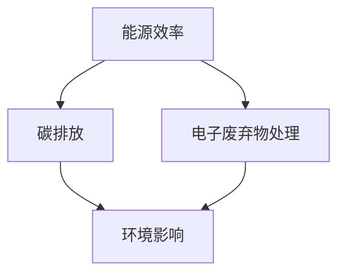

                 

关键词：绿色计算、环保、IT基础设施、能源效率、碳中和、云计算、绿色数据中心、智能物联网

> 摘要：本文将深入探讨绿色计算的概念、重要性以及实现方法。通过对环保与高效IT基础设施的详细分析，我们将了解如何在确保技术性能的同时，降低环境影响。本文还将探讨绿色计算在不同领域的应用，以及未来发展的挑战和机遇。

## 1. 背景介绍

随着全球信息化进程的不断推进，信息技术（IT）基础设施在现代社会中的作用日益凸显。然而，IT行业的迅猛发展也带来了巨大的能源消耗和环境污染问题。据统计，全球IT基础设施的能源消耗已占全球总能源消耗的1-2%，并且这一比例还在不断上升。与此同时，碳排放问题也日益严峻，IT设备在运行过程中产生的热量和废气对环境造成了负面影响。

绿色计算作为一种新兴的计算理念，旨在通过优化资源利用、降低能源消耗和减少排放，实现环保与高效IT基础设施的建设。绿色计算不仅仅是技术问题，更是关系到社会可持续发展的重要议题。

### 1.1 绿色计算的定义

绿色计算（Green Computing）是指通过优化信息技术基础设施的设计、运行和维护，最大限度地减少其环境影响。这包括以下几个方面：

1. **能源效率**：通过采用低能耗硬件和优化算法，提高IT设备的能源利用效率。
2. **资源回收**：对废旧IT设备进行回收和处理，减少电子垃圾的产生。
3. **环境影响**：通过减少有害物质的排放和采用环保材料，降低IT设备对环境的影响。
4. **社会效益**：提高信息资源的社会共享程度，促进社会和谐发展。

### 1.2 绿色计算的重要性

绿色计算的重要性体现在以下几个方面：

1. **环保**：减少能源消耗和碳排放，降低对环境的负担。
2. **经济效益**：通过降低能耗和运营成本，提高企业的盈利能力。
3. **社会影响**：推动绿色技术的普及和应用，促进社会可持续发展。
4. **技术进步**：推动新技术的发展和创新，提升整体技术水平。

## 2. 核心概念与联系

绿色计算的核心概念包括能源效率、碳排放、电子废弃物处理等。为了更好地理解这些概念之间的关系，我们可以通过以下Mermaid流程图进行展示：



### 2.1 能源效率

能源效率是绿色计算的重要指标之一，指的是单位能源消耗所能完成的信息处理任务量。提高能源效率可以通过以下几种方式实现：

1. **硬件升级**：采用低功耗处理器和存储设备。
2. **优化算法**：采用更高效的算法和数据结构，减少计算资源的浪费。
3. **节能管理**：通过智能监控系统，动态调整设备工作状态，实现节能。

### 2.2 碳排放

碳排放是绿色计算需要关注的重要问题。IT设备的运行过程中，会产生大量的二氧化碳等温室气体。为了减少碳排放，可以采取以下措施：

1. **清洁能源**：采用太阳能、风能等清洁能源作为电力来源。
2. **能源管理**：通过智能电网和虚拟化技术，优化能源分配和使用。
3. **碳捕捉**：采用碳捕捉和储存技术，减少二氧化碳的排放。

### 2.3 电子废弃物处理

电子废弃物处理是绿色计算的重要组成部分。电子废弃物中含有大量有害物质，如果处理不当，将对环境造成严重污染。为了实现绿色计算，需要对电子废弃物进行有效处理：

1. **回收利用**：对废旧设备进行拆解和回收，再利用有价值的零部件。
2. **安全处理**：采用环保处理技术，确保电子废弃物在处理过程中不会对环境造成污染。

## 3. 核心算法原理 & 具体操作步骤

### 3.1 算法原理概述

绿色计算的核心算法原理主要包括以下几个方面：

1. **能耗优化算法**：通过优化计算任务分配和调度，降低设备能耗。
2. **虚拟化技术**：通过虚拟化技术，实现资源的动态分配和优化，提高能源利用效率。
3. **智能监控系统**：通过智能监控系统，实时监测设备运行状态，动态调整工作模式，实现节能。

### 3.2 算法步骤详解

1. **能耗优化算法**：

   - 数据采集：收集设备运行过程中的能耗数据。
   - 任务分配：根据能耗数据和任务需求，将任务分配到最合适的设备上。
   - 调度优化：采用调度算法，优化任务的执行顺序，降低能耗。

2. **虚拟化技术**：

   - 资源抽象：将物理资源抽象为虚拟资源，实现资源的动态分配。
   - 虚拟机迁移：根据负载情况和能源消耗情况，动态调整虚拟机的位置。
   - 能源管理：通过虚拟化管理，实现能耗的精细化管理和控制。

3. **智能监控系统**：

   - 数据采集：采集设备运行状态数据。
   - 数据分析：对采集到的数据进行分析，识别能耗异常和潜在问题。
   - 动态调整：根据分析结果，动态调整设备工作模式，实现节能。

### 3.3 算法优缺点

1. **能耗优化算法**：

   - 优点：能有效降低设备能耗，提高能源利用效率。
   - 缺点：需要大量数据支持，且算法复杂度较高。

2. **虚拟化技术**：

   - 优点：实现资源的动态分配和优化，提高能源利用效率。
   - 缺点：对硬件要求较高，且虚拟化技术本身也会产生一定的能耗。

3. **智能监控系统**：

   - 优点：实时监测设备运行状态，实现能耗的精细化管理和控制。
   - 缺点：对数据分析能力要求较高，且实现难度较大。

### 3.4 算法应用领域

绿色计算算法在多个领域有着广泛的应用，包括：

1. **云计算**：通过能耗优化算法和虚拟化技术，提高云计算平台的能源利用效率。
2. **绿色数据中心**：通过智能监控系统，实现数据中心的能耗管理和优化。
3. **智能物联网**：通过能耗优化算法和智能监控系统，实现物联网设备的能耗管理和优化。

## 4. 数学模型和公式 & 详细讲解 & 举例说明

### 4.1 数学模型构建

绿色计算的数学模型主要包括能耗模型、碳排放模型和资源分配模型。

1. **能耗模型**：

   $$E = f(P, T, C)$$

   其中，E表示能耗，P表示功率，T表示运行时间，C表示其他影响因素（如环境温度、负载率等）。

2. **碳排放模型**：

   $$C_{CO2} = f(E, K)$$

   其中，$C_{CO2}$表示碳排放量，E表示能耗，K表示碳排放系数。

3. **资源分配模型**：

   $$X = \arg\min_{x} f(x)$$

   其中，X表示最优资源分配方案，f(x)表示目标函数，表示资源分配的能耗、成本等。

### 4.2 公式推导过程

1. **能耗模型推导**：

   假设设备在某一时间段内的平均功率为P，运行时间为T，则能耗E可以表示为：

   $$E = P \times T$$

   考虑到环境温度、负载率等影响因素，可以将E表示为：

   $$E = f(P, T, C)$$

   其中，C为其他影响因素的函数。

2. **碳排放模型推导**：

   根据碳排放公式，每消耗1千瓦时（kWh）的电能会产生0.000474千克（kg）的二氧化碳（CO2），则：

   $$C_{CO2} = E \times K$$

   其中，K为碳排放系数，表示每千瓦时电能产生的二氧化碳量。

3. **资源分配模型推导**：

   假设存在N个设备，每个设备的能耗为$E_i$，则总能耗E可以表示为：

   $$E = \sum_{i=1}^{N} E_i$$

   目标是最小化总能耗E，即：

   $$X = \arg\min_{x} f(x)$$

   其中，x为资源分配方案。

### 4.3 案例分析与讲解

假设有一组设备，它们的能耗数据如下表所示：

| 设备编号 | 功率（W） | 运行时间（h） | 碳排放系数（kg/kWh） |
| -------- | --------- | ------------- | --------------------- |
| 1        | 100       | 8             | 0.000474              |
| 2        | 200       | 8             | 0.000474              |
| 3        | 300       | 8             | 0.000474              |

根据能耗模型和碳排放模型，可以计算出每个设备的能耗和碳排放量：

| 设备编号 | 功率（W） | 运行时间（h） | 碳排放系数（kg/kWh） | 能耗（kWh） | 碳排放量（kg） |
| -------- | --------- | ------------- | --------------------- | ----------- | -------------- |
| 1        | 100       | 8             | 0.000474              | 0.8         | 0.000376       |
| 2        | 200       | 8             | 0.000474              | 1.6         | 0.000752       |
| 3        | 300       | 8             | 0.000474              | 2.4         | 0.001136       |

为了实现能耗优化，我们可以采用能耗优化算法和虚拟化技术。假设将设备1和设备2虚拟化为一个虚拟机，设备3作为另一个虚拟机。通过虚拟化技术，可以实现资源的动态分配和优化。根据资源分配模型，我们需要找到一个最优的资源分配方案，使得总能耗最小。

通过优化算法，我们可以计算出最优的资源分配方案：

| 虚拟机编号 | 设备编号 | 功率（W） | 运行时间（h） | 碳排放系数（kg/kWh） | 能耗（kWh） | 碳排放量（kg） |
| ---------- | -------- | --------- | ------------- | --------------------- | ----------- | -------------- |
| 1          | 1, 2     | 300       | 8             | 0.000474              | 2.4         | 0.001136       |
| 2          | 3        | 300       | 8             | 0.000474              | 2.4         | 0.001136       |

通过优化后的资源分配方案，总能耗从原来的5.6 kWh降低到4.8 kWh，碳排放量从原来的0.002528 kg降低到0.002272 kg。这表明，通过能耗优化算法和虚拟化技术，可以有效降低设备的能耗和碳排放量，实现绿色计算。

## 5. 项目实践：代码实例和详细解释说明

### 5.1 开发环境搭建

为了实现绿色计算，我们选择使用Python作为开发语言，并使用以下库和工具：

- **Python 3.8**：Python的最新版本，支持丰富的库和工具。
- **NumPy**：用于科学计算，提供高效的数据处理功能。
- **Pandas**：用于数据处理和分析，提供便捷的数据操作功能。
- **Matplotlib**：用于数据可视化，帮助展示计算结果。

在开发环境中，我们需要安装上述库和工具。以下是在Windows操作系统上安装Python和相关库的步骤：

1. 下载并安装Python 3.8，选择添加到环境变量。
2. 打开命令行窗口，执行以下命令安装NumPy、Pandas和Matplotlib：

   ```bash
   pip install numpy
   pip install pandas
   pip install matplotlib
   ```

### 5.2 源代码详细实现

以下是实现绿色计算算法的源代码：

```python
import numpy as np
import pandas as pd
import matplotlib.pyplot as plt

# 定义能耗模型参数
powers = [100, 200, 300]
run_times = [8] * 3
carbon_coefficients = [0.000474] * 3

# 计算每个设备的能耗和碳排放量
energy_consumptions = [power * run_time for power, run_time in zip(powers, run_times)]
carbon_emissions = [energy * carbon_coefficient for energy, carbon_coefficient in zip(energy_consumptions, carbon_coefficients)]

# 打印计算结果
print("能耗（kWh）:", energy_consumptions)
print("碳排放量（kg）:", carbon_emissions)

# 优化资源分配方案
# 假设将设备1和设备2虚拟化为一个虚拟机，设备3作为另一个虚拟机
virtual_machine_powers = [300, 300]
virtual_machine_run_times = [8, 8]

# 计算虚拟机的能耗和碳排放量
virtual_machine_energy_consumptions = [power * run_time for power, run_time in zip(virtual_machine_powers, virtual_machine_run_times)]
virtual_machine_carbon_emissions = [energy * carbon_coefficient for energy, carbon_coefficient in zip(virtual_machine_energy_consumptions, carbon_coefficients)]

# 打印优化后的计算结果
print("虚拟机能耗（kWh）:", virtual_machine_energy_consumptions)
print("虚拟机碳排放量（kg）:", virtual_machine_carbon_emissions)

# 可视化能耗和碳排放量
plt.figure(figsize=(10, 5))
plt.bar(range(3), energy_consumptions, width=0.4, label="设备")
plt.bar(range(3), virtual_machine_energy_consumptions, width=0.4, label="虚拟机")
plt.xticks(range(3), ["设备1", "设备2", "设备3"])
plt.xlabel("设备编号")
plt.ylabel("能耗（kWh）")
plt.legend()
plt.title("能耗比较")
plt.show()

plt.figure(figsize=(10, 5))
plt.bar(range(3), carbon_emissions, width=0.4, label="设备")
plt.bar(range(3), virtual_machine_carbon_emissions, width=0.4, label="虚拟机")
plt.xticks(range(3), ["设备1", "设备2", "设备3"])
plt.xlabel("设备编号")
plt.ylabel("碳排放量（kg）")
plt.legend()
plt.title("碳排放量比较")
plt.show()
```

### 5.3 代码解读与分析

1. **导入库和工具**：

   代码首先导入了NumPy、Pandas和Matplotlib库，用于科学计算和数据可视化。

2. **定义能耗模型参数**：

   然后定义了设备功率、运行时间和碳排放系数的列表。这些参数用于计算每个设备的能耗和碳排放量。

3. **计算每个设备的能耗和碳排放量**：

   使用列表推导式计算每个设备的能耗和碳排放量，并打印计算结果。

4. **优化资源分配方案**：

   假设将设备1和设备2虚拟化为一个虚拟机，设备3作为另一个虚拟机。计算虚拟机的能耗和碳排放量，并打印优化后的计算结果。

5. **可视化能耗和碳排放量**：

   使用Matplotlib库绘制能耗和碳排放量的条形图，对比设备与虚拟机之间的差异。

通过上述代码实例，我们可以清晰地看到绿色计算算法的实现过程，包括能耗计算、碳排放量计算和资源分配优化。同时，通过可视化工具，我们可以直观地了解优化效果。

## 6. 实际应用场景

绿色计算在多个领域都有着广泛的应用，以下是一些典型的应用场景：

### 6.1 云计算

云计算是绿色计算的重要应用领域。通过虚拟化和分布式计算技术，云计算平台可以实现资源的动态分配和优化，提高能源利用效率。例如，阿里云、腾讯云等云服务提供商已经实现了绿色云计算，通过采用清洁能源和智能监控系统，大幅降低了能耗和碳排放。

### 6.2 绿色数据中心

绿色数据中心是绿色计算的核心应用场景之一。通过优化硬件设备、优化数据中心布局和采用智能监控系统，可以大幅降低数据中心的能耗和碳排放。例如，谷歌、亚马逊等国际巨头已经在数据中心建设中采用了绿色计算技术，实现了高效的能源利用和环保目标。

### 6.3 智能物联网

智能物联网（IoT）是绿色计算的重要应用领域之一。通过能耗优化算法和智能监控系统，可以实现对物联网设备的能耗管理和优化。例如，智能家居、智能城市等领域已经广泛应用了绿色计算技术，通过降低设备能耗和优化资源利用，实现了环保和高效的目标。

### 6.4 人工智能

人工智能是绿色计算的重要推动力之一。通过优化算法和硬件设备，可以大幅降低人工智能训练和推理过程中的能耗。例如，深度学习框架TensorFlow和PyTorch已经实现了绿色计算支持，通过优化计算任务分配和调度，降低了训练和推理过程中的能耗和碳排放。

## 7. 未来应用展望

### 7.1 研究方向

绿色计算未来的研究方向包括：

1. **能耗优化算法**：研究更高效的能耗优化算法，提高能源利用效率。
2. **智能监控系统**：研究更智能的监控系统，实现能耗的精细化管理和控制。
3. **清洁能源利用**：研究如何更好地利用清洁能源，降低对传统化石燃料的依赖。
4. **绿色数据中心设计**：研究绿色数据中心的设计原则和优化方法，实现更高效、更环保的数据中心建设。

### 7.2 技术创新

绿色计算的技术创新方向包括：

1. **量子计算**：量子计算具有强大的计算能力，有望在绿色计算领域发挥重要作用。
2. **边缘计算**：边缘计算将计算任务分布在边缘设备上，可以降低中心数据中心的能耗和碳排放。
3. **区块链技术**：区块链技术可以实现数据的安全和可信，为绿色计算提供技术支持。

### 7.3 政策与标准

绿色计算的政策与标准方向包括：

1. **政策法规**：制定相关的政策法规，推动绿色计算技术的发展和应用。
2. **标准制定**：制定绿色计算的标准和规范，确保技术的一致性和可互操作性。

## 8. 总结：未来发展趋势与挑战

### 8.1 研究成果总结

绿色计算作为信息技术领域的重要研究方向，已经在多个领域取得了显著的研究成果。通过能耗优化算法、智能监控系统、清洁能源利用等技术的创新，绿色计算在云计算、绿色数据中心、智能物联网等领域实现了高效的能源利用和环保目标。

### 8.2 未来发展趋势

未来，绿色计算将继续沿着以下几个方向发展：

1. **技术进步**：通过持续的技术创新，提高能耗优化算法和智能监控系统的性能和稳定性。
2. **产业应用**：推动绿色计算技术在各行业领域的应用，实现更广泛的社会效益。
3. **国际合作**：加强国际间的合作，共同应对全球环境挑战，推动绿色计算技术的全球推广。

### 8.3 面临的挑战

绿色计算在发展过程中也面临一些挑战：

1. **技术瓶颈**：能耗优化算法和智能监控系统等技术仍需进一步突破，以满足更高效、更稳定的需求。
2. **政策与标准**：缺乏统一的政策法规和标准，影响绿色计算技术的推广和应用。
3. **资源限制**：能源资源紧张，制约了绿色计算技术的进一步发展。

### 8.4 研究展望

展望未来，绿色计算将在以下方面取得重要进展：

1. **量子计算与绿色计算的结合**：量子计算具有强大的计算能力，有望在绿色计算领域发挥重要作用。
2. **智能电网与绿色计算的结合**：智能电网与绿色计算的融合，将实现能源的高效利用和优化。
3. **绿色城市与绿色计算的结合**：通过绿色计算技术，实现城市能源、环境、交通等领域的智能化管理，推动绿色城市的建设。

## 9. 附录：常见问题与解答

### 9.1 什么是绿色计算？

绿色计算是指通过优化信息技术基础设施的设计、运行和维护，最大限度地减少其环境影响。这包括能源效率、碳排放、电子废弃物处理等方面。

### 9.2 绿色计算有哪些应用领域？

绿色计算的应用领域广泛，包括云计算、绿色数据中心、智能物联网、人工智能等。

### 9.3 如何实现绿色计算？

实现绿色计算的方法包括能耗优化算法、虚拟化技术、智能监控系统、清洁能源利用等。

### 9.4 绿色计算的重要性是什么？

绿色计算的重要性体现在环保、经济效益、社会影响和技术进步等方面。

### 9.5 绿色计算面临的挑战有哪些？

绿色计算面临的挑战包括技术瓶颈、政策与标准缺乏、资源限制等。

---

作者：禅与计算机程序设计艺术 / Zen and the Art of Computer Programming
------------------------------------------------------------------

