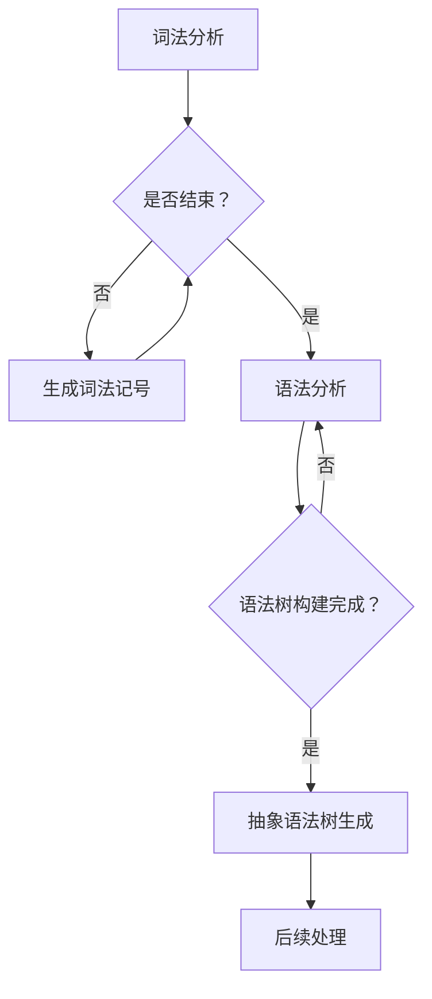
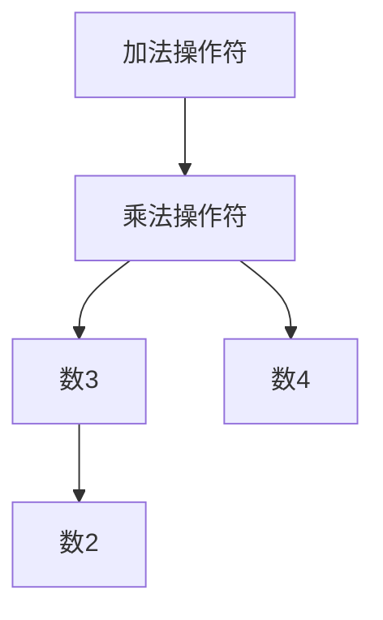

                 

关键词：编程语言解析器、词法分析、语法分析、抽象语法树（AST）、编译原理、编程工具

> 摘要：本文将深入探讨编程语言解析器的核心组成部分——词法分析和语法分析。通过详细解析这两个过程，本文旨在为读者提供一个全面的理解，从而在编程领域取得更深入的认识和应用。

## 1. 背景介绍

在计算机科学中，编程语言解析器是一个至关重要的工具，它负责将人类编写的源代码转换成计算机可以理解和执行的机器语言。解析器的核心任务是对源代码进行词法分析和语法分析，这两个步骤是理解编程语言语义的基础。

### 1.1 词法分析

词法分析，也称为扫描，是解析器的第一步。它的主要任务是读取源代码字符序列，将其分割成有意义的记号，如关键字、标识符、操作符和分隔符。词法分析器通常使用正则表达式来识别这些记号。

### 1.2 语法分析

语法分析，也称为解析，是解析器的第二步。它的任务是确定词法记号序列是否符合编程语言的语法规则，构建出一个表示程序结构的语法树。语法分析器通常使用递归下降分析、LL(1)分析或LR分析等算法来实现。

### 1.3 抽象语法树（AST）

抽象语法树（Abstract Syntax Tree，AST）是语法分析的结果，它以一种结构化的方式表示源代码的语法结构。AST不仅包含了源代码的语法信息，还可以用来进行语义分析、类型检查和代码生成等后续处理。

## 2. 核心概念与联系

### 2.1 词法分析原理

词法分析的过程可以分为以下几个步骤：

1. **字符流生成**：从源代码中逐个读取字符，生成字符流。
2. **字符分类**：将字符流中的字符分类为不同的类别，如字母、数字、操作符等。
3. **记号生成**：根据字符类别，生成有意义的记号。

### 2.2 语法分析原理

语法分析的过程可以分为以下几个步骤：

1. **词法记号流生成**：通过词法分析器生成词法记号流。
2. **语法树构建**：根据语法规则，将词法记号流转换为语法树。
3. **语义分析**：检查语法树是否符合语义规则，如变量声明是否已经定义、函数调用是否正确等。

### 2.3 抽象语法树（AST）

抽象语法树（AST）是语法分析的结果，它以一种结构化的方式表示源代码的语法结构。AST不仅包含了源代码的语法信息，还可以用来进行语义分析、类型检查和代码生成等后续处理。


### 2.4 Mermaid 流程图

以下是一个简单的 Mermaid 流程图，展示了词法分析和语法分析的过程：



## 3. 核心算法原理 & 具体操作步骤

### 3.1 算法原理概述

词法分析和语法分析的核心算法原理如下：

1. **词法分析**：使用正则表达式匹配源代码字符序列，生成词法记号。
2. **语法分析**：使用递归下降分析、LL(1)分析或LR分析等算法，构建抽象语法树。

### 3.2 算法步骤详解

#### 3.2.1 词法分析步骤

1. 读取源代码字符。
2. 将字符分类为不同的类别。
3. 根据类别生成词法记号。

#### 3.2.2 语法分析步骤

1. 读取词法记号流。
2. 使用递归下降分析、LL(1)分析或LR分析等算法，构建抽象语法树。
3. 对抽象语法树进行语义分析。

### 3.3 算法优缺点

#### 3.3.1 词法分析

**优点**：简单高效，对源代码的字符序列进行初步处理。

**缺点**：可能产生大量的词法记号，需要一定的存储空间。

#### 3.3.2 语法分析

**优点**：能够准确识别源代码的语法结构，为后续处理提供基础。

**缺点**：算法复杂，对源代码的理解能力有限。

### 3.4 算法应用领域

词法分析和语法分析广泛应用于各种编程语言编译器、解释器和集成开发环境（IDE）。通过这些算法，开发者可以编写出功能强大、性能高效的编程语言工具。

## 4. 数学模型和公式 & 详细讲解 & 举例说明

### 4.1 数学模型构建

词法分析和语法分析的过程可以通过数学模型来描述。以下是一个简化的数学模型：

```latex
\text{源代码} \rightarrow \text{字符序列}
\text{字符序列} \rightarrow \text{词法记号序列}
\text{词法记号序列} \rightarrow \text{抽象语法树}
```

### 4.2 公式推导过程

假设源代码为一个字符串 $s$，词法分析器能够将其分割为多个词法记号 $t_1, t_2, ..., t_n$，语法分析器能够将这些词法记号序列构建为一个抽象语法树 $T$。则：

```latex
s \rightarrow t_1 t_2 ... t_n
t_1 t_2 ... t_n \rightarrow T
```

### 4.3 案例分析与讲解

假设我们有一个简单的算术表达式 $3 + 4 \times 2$，以下是一个详细的词法分析和语法分析过程：

#### 4.3.1 词法分析

1. 读取字符串 $3 + 4 \times 2$。
2. 将字符串分割为词法记号：$3$、$+$、$4$、$\times$、$2$。

#### 4.3.2 语法分析

1. 读取词法记号序列：$3$、$+$、$4$、$\times$、$2$。
2. 根据语法规则，构建抽象语法树：



## 5. 项目实践：代码实例和详细解释说明

### 5.1 开发环境搭建

本文将使用 Python 语言实现一个简单的编程语言解析器。首先，你需要安装 Python 3.x 版本。接下来，安装一些必要的库，如 `re`（用于正则表达式）和 `matplotlib`（用于绘制抽象语法树）。

### 5.2 源代码详细实现

以下是一个简单的 Python 源代码实现：

```python
import re
import matplotlib.pyplot as plt
from collections import defaultdict

# 词法分析
def tokenize(source_code):
    # 使用正则表达式匹配词法记号
    tokens = re.findall(r'\d+|\+|\-|\*|/|\(|\)', source_code)
    return tokens

# 语法分析
def parse(tokens):
    # 使用递归下降分析构建抽象语法树
    def parse_expression(tokens):
        if not tokens:
            return None
        token = tokens.pop(0)
        if token == '(':
            expr = parse_expression(tokens)
            tokens.pop(0)  # 移除右括号
            return expr
        elif token.isdigit():
            return int(token)
        else:
            raise ValueError(f"Unexpected token: {token}")

    ast = parse_expression(tokens)
    return ast

# 绘制抽象语法树
def draw_ast(ast):
    # 使用 Mermaid 语法绘制抽象语法树
    def draw(node):
        if not node:
            return ""
        if isinstance(node, int):
            return f"{node}"
        op = node[0]
        args = [draw(arg) for arg in node[1]]
        return f"{op}({' '.join(args)})"
    
    ast_str = draw(ast)
    plt.figure(figsize=(8, 4))
    plt.imshow(ast_str, cmap='gray', aspect='auto', extent=[0, 1, 0, 1])
    plt.show()

# 主函数
def main():
    source_code = "3 + (4 * 2)"
    tokens = tokenize(source_code)
    ast = parse(tokens)
    draw_ast(ast)

if __name__ == "__main__":
    main()
```

### 5.3 代码解读与分析

1. **词法分析**：使用正则表达式将源代码分割为词法记号。
2. **语法分析**：使用递归下降分析构建抽象语法树。
3. **绘制抽象语法树**：使用 matplotlib 库绘制抽象语法树。

### 5.4 运行结果展示

运行上述代码，我们将得到一个简单的算术表达式的抽象语法树：


## 6. 实际应用场景

编程语言解析器在实际应用中具有广泛的应用场景：

1. **编译器和解释器**：编程语言解析器是编译器和解释器的重要组成部分，用于将源代码转换为计算机可以执行的形式。
2. **静态代码分析工具**：通过词法分析和语法分析，静态代码分析工具可以对源代码进行错误检查、代码优化和安全性分析。
3. **代码生成工具**：编程语言解析器可以用于生成各种形式的代码，如中间代码、汇编代码或机器代码。

## 7. 工具和资源推荐

### 7.1 学习资源推荐

1. 《编译原理：技术与实践》（作者：阿尔法尔德·帕塔内希）—— 这本书详细介绍了编译原理的核心概念和算法。
2. 《编程语言实现》（作者：克里斯·汤普森）—— 这本书提供了编程语言实现的实用指南。

### 7.2 开发工具推荐

1. IntelliJ IDEA—— 一款功能强大的集成开发环境，支持多种编程语言。
2. Visual Studio Code—— 一款轻量级但功能丰富的文本编辑器，适用于多种编程语言。

### 7.3 相关论文推荐

1. “A Retrospective on the Development of Compilers” —— 这篇论文回顾了编译器的发展历程。
2. “Parsing Techniques: A Practical Guide” —— 这本书详细介绍了各种语法分析技术。

## 8. 总结：未来发展趋势与挑战

### 8.1 研究成果总结

编程语言解析器的研究取得了显著成果，包括高效的词法分析和语法分析算法、抽象语法树的优化和应用等。这些成果为编程语言工具的发展奠定了基础。

### 8.2 未来发展趋势

1. **自动编程**：随着人工智能技术的发展，自动编程将成为未来编程语言解析器的重要方向。
2. **跨语言解析**：支持多种编程语言的解析器将变得越来越普遍，以适应不同的编程需求。

### 8.3 面临的挑战

1. **性能优化**：在保持解析器灵活性的同时，提高解析性能是一个持续的挑战。
2. **兼容性**：支持多种编程语言和标准，确保解析器的兼容性。

### 8.4 研究展望

编程语言解析器的研究将继续深入，探索新的算法和技术，为编程领域带来更多的创新和突破。

## 9. 附录：常见问题与解答

### 9.1 什么是词法分析？

词法分析是将源代码字符序列分割成有意义的记号的过程。它通常使用正则表达式来实现。

### 9.2 什么是语法分析？

语法分析是确定词法记号序列是否符合编程语言语法规则的过程。它通常使用递归下降分析、LL(1)分析或LR分析等算法来实现。

### 9.3 抽象语法树（AST）有什么作用？

抽象语法树（AST）是语法分析的结果，它以一种结构化的方式表示源代码的语法结构。AST不仅包含了源代码的语法信息，还可以用来进行语义分析、类型检查和代码生成等后续处理。

作者：禅与计算机程序设计艺术 / Zen and the Art of Computer Programming
----------------------------------------------------------------

以上就是文章的正文内容，希望对您有所帮助。如果您有任何问题或需要进一步的解释，请随时告诉我。祝您写作顺利！


