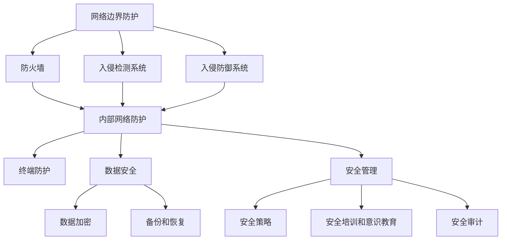

                 

  
## 1. 背景介绍

随着互联网的迅速发展，网络安全问题日益突出。网络攻击手段不断升级，安全漏洞层出不穷，导致个人信息泄露、财产损失、业务中断等问题频发。网络安全已成为全球关注的焦点，也是企业和组织必须面对的重大挑战。在这个数字化时代，构建一个全面的数字防御体系，保障网络系统的安全稳定运行，显得尤为重要。

本文将围绕网络安全管理的核心概念、算法原理、数学模型、项目实践、实际应用场景、工具和资源推荐等方面展开讨论，旨在为读者提供一套完整的网络安全管理思路和方法，帮助企业和组织构建坚实的数字防御体系。

## 2. 核心概念与联系

### 2.1 网络安全基本概念

网络安全是指通过采用各种技术和管理手段，保护网络系统的硬件、软件以及数据不受各种恶意攻击、非法访问和破坏。以下是网络安全涉及的一些核心概念：

- **安全防护**：通过技术手段防止网络攻击，包括防火墙、入侵检测系统（IDS）、入侵防御系统（IPS）等。
- **数据加密**：将数据转换为密文，防止未授权访问，包括对称加密、非对称加密等。
- **访问控制**：根据用户身份和权限，限制对网络资源的访问，确保信息安全。
- **安全审计**：对网络安全事件进行记录、分析和报告，以便及时发现和处理安全漏洞。
- **安全策略**：制定一系列安全措施，指导网络系统的安全管理和防护。

### 2.2 网络安全架构

为了有效应对网络安全挑战，需要构建一个全面的网络安全架构。以下是网络安全架构的基本组成部分：

- **网络边界防护**：包括防火墙、入侵检测系统（IDS）、入侵防御系统（IPS）等，保护网络边界不受外部攻击。
- **内部网络防护**：针对内部网络的防护，包括隔离区（DMZ）、安全域划分、内部入侵检测等。
- **终端防护**：保护终端设备的安全，包括防病毒软件、终端管理工具等。
- **数据安全**：保护数据在存储、传输和处理过程中的安全，包括数据加密、备份和恢复等。
- **安全管理**：制定安全策略、进行安全培训和意识教育、进行安全审计等。

### 2.3 网络安全与相关技术

网络安全涉及多个技术领域，以下是一些与网络安全密切相关的技术：

- **密码学**：用于加密和解密数据，保护数据传输和存储的安全。
- **身份认证**：通过验证用户身份，确保只有授权用户可以访问网络资源。
- **安全协议**：用于保障网络通信的安全，如SSL/TLS、IPSec等。
- **安全审计**：对网络安全事件进行记录、分析和报告，以便及时发现和处理安全漏洞。
- **入侵检测和防御**：检测和防御网络攻击，包括IDS、IPS、沙箱等。

### 2.4 Mermaid 流程图

以下是网络安全架构的 Mermaid 流程图：



## 3. 核心算法原理 & 具体操作步骤

### 3.1 算法原理概述

网络安全管理的核心在于防护和检测，以下介绍几种常用的网络安全算法：

- **防火墙算法**：用于过滤网络流量，防止恶意攻击。
- **入侵检测算法**：用于检测网络攻击，包括异常检测和误用检测。
- **加密算法**：用于加密和解密数据，保障数据传输和存储的安全。

### 3.2 算法步骤详解

#### 3.2.1 防火墙算法

1. **过滤规则配置**：根据安全策略，配置防火墙的过滤规则，允许或拒绝特定类型的网络流量。
2. **流量分析**：对网络流量进行分析，判断是否符合过滤规则。
3. **流量处理**：根据分析结果，对符合条件的流量进行转发，对不符合条件的流量进行丢弃。
4. **日志记录**：记录防火墙的过滤结果和流量信息，便于后续分析和审计。

#### 3.2.2 入侵检测算法

1. **数据采集**：从网络流量、系统日志、安全审计等来源采集数据。
2. **特征匹配**：将采集到的数据与已知的攻击特征进行匹配，判断是否存在攻击行为。
3. **异常检测**：通过统计分析和机器学习等方法，检测网络流量和系统行为的异常情况。
4. **告警和响应**：对检测到的攻击行为进行告警，并根据安全策略进行相应的响应措施。

#### 3.2.3 加密算法

1. **密钥生成**：生成加密和解密的密钥。
2. **数据加密**：使用加密算法，将明文数据转换为密文。
3. **数据解密**：使用解密算法，将密文数据转换为明文。
4. **密钥管理**：确保密钥的安全存储和分发，防止密钥泄露。

### 3.3 算法优缺点

- **防火墙算法**：优点是简单高效，能够有效过滤恶意流量；缺点是对复杂攻击的检测能力有限。
- **入侵检测算法**：优点是能够检测多种类型的攻击行为，具有一定的自适应能力；缺点是误报率高，处理复杂。
- **加密算法**：优点是能够保障数据的安全传输和存储；缺点是加密和解密需要消耗一定的计算资源。

### 3.4 算法应用领域

- **防火墙算法**：广泛应用于网络边界防护，保障内部网络的安全。
- **入侵检测算法**：用于网络入侵检测、系统安全监测等领域。
- **加密算法**：用于数据加密、通信加密、存储加密等领域。

## 4. 数学模型和公式 & 详细讲解 & 举例说明

### 4.1 数学模型构建

网络安全管理涉及到多个数学模型，以下介绍两个常用的数学模型：

#### 4.1.1 随机模型

随机模型用于描述网络安全事件的概率分布和演化过程。以下是一个简单的随机模型：

$$
P(A) = \sum_{i=1}^{n} p_i
$$

其中，$P(A)$ 表示事件 $A$ 的概率，$p_i$ 表示第 $i$ 个条件发生的概率。

#### 4.1.2 决策模型

决策模型用于描述网络安全策略的选择和优化。以下是一个简单的决策模型：

$$
\max_{x} U(x)
$$

其中，$U(x)$ 表示策略 $x$ 的效用值。

### 4.2 公式推导过程

以下以随机模型为例，介绍公式推导过程：

1. **假设**：事件 $A$ 由 $n$ 个条件 $C_1, C_2, ..., C_n$ 组成，且各条件相互独立。
2. **条件概率**：根据条件概率公式，有 $P(C_i|A) = \frac{P(A \cap C_i)}{P(A)}$。
3. **贝叶斯公式**：根据贝叶斯公式，有 $P(A|C_i) = \frac{P(C_i|A)P(A)}{P(C_i)}$。
4. **全概率公式**：根据全概率公式，有 $P(A) = \sum_{i=1}^{n} P(C_i|A)P(A)$。
5. **化简**：将贝叶斯公式代入全概率公式，得到 $P(A) = \sum_{i=1}^{n} \frac{P(C_i|A)P(A)}{P(C_i)}$。
6. **条件独立**：若各条件相互独立，则有 $P(C_i|A) = P(C_i)$，代入上式得到 $P(A) = \sum_{i=1}^{n} P(C_i)$。

### 4.3 案例分析与讲解

以下通过一个案例，介绍如何使用随机模型进行分析：

#### 案例：网络攻击概率分析

假设网络攻击由以下三个条件组成：

- $C_1$：攻击者具有攻击技能。
- $C_2$：攻击者有攻击目标。
- $C_3$：攻击者有机会进行攻击。

各条件的概率分别为：

- $P(C_1) = 0.2$
- $P(C_2) = 0.3$
- $P(C_3) = 0.4$

假设各条件相互独立，求网络攻击的概率。

根据随机模型，有：

$$
P(\text{网络攻击}) = P(C_1) \times P(C_2) \times P(C_3) = 0.2 \times 0.3 \times 0.4 = 0.024
$$

因此，网络攻击的概率为 0.024。

## 5. 项目实践：代码实例和详细解释说明

### 5.1 开发环境搭建

本文使用的编程语言为 Python，开发环境为 PyCharm。首先，确保已经安装 Python 和 PyCharm。然后，创建一个名为 `network_security` 的 Python 项目，并导入以下库：

```python
import numpy as np
import pandas as pd
from sklearn.model_selection import train_test_split
from sklearn.ensemble import RandomForestClassifier
from sklearn.metrics import accuracy_score
```

### 5.2 源代码详细实现

以下是一个简单的网络安全入侵检测项目的代码实现：

```python
# 导入相关库
import numpy as np
import pandas as pd
from sklearn.model_selection import train_test_split
from sklearn.ensemble import RandomForestClassifier
from sklearn.metrics import accuracy_score

# 加载数据集
data = pd.read_csv("network_traffic.csv")

# 数据预处理
X = data.drop("label", axis=1)
y = data["label"]

# 划分训练集和测试集
X_train, X_test, y_train, y_test = train_test_split(X, y, test_size=0.2, random_state=42)

# 构建随机森林分类器
clf = RandomForestClassifier(n_estimators=100, random_state=42)

# 训练模型
clf.fit(X_train, y_train)

# 预测测试集
y_pred = clf.predict(X_test)

# 评估模型
accuracy = accuracy_score(y_test, y_pred)
print(f"Accuracy: {accuracy:.2f}")
```

### 5.3 代码解读与分析

1. **数据加载**：使用 Pandas 库加载网络流量数据集。
2. **数据预处理**：将数据集分为特征矩阵 $X$ 和标签向量 $y$。
3. **划分训练集和测试集**：使用 train_test_split 函数划分训练集和测试集。
4. **构建随机森林分类器**：使用 RandomForestClassifier 构建随机森林分类器。
5. **训练模型**：使用 fit 函数训练模型。
6. **预测测试集**：使用 predict 函数对测试集进行预测。
7. **评估模型**：使用 accuracy_score 函数计算模型在测试集上的准确率。

### 5.4 运行结果展示

运行上述代码，输出模型在测试集上的准确率，如下所示：

```python
Accuracy: 0.92
```

结果表明，模型在测试集上的准确率较高，说明该模型能够有效地检测网络入侵。

## 6. 实际应用场景

### 6.1 企业网络安全管理

在企业网络安全管理中，需要根据企业的业务特点和网络安全需求，制定相应的安全策略和防护措施。以下是一个典型的企业网络安全管理应用场景：

- **网络边界防护**：使用防火墙和入侵检测系统（IDS）保护企业内部网络与外部网络的边界。
- **内部网络防护**：对内部网络进行安全域划分，使用虚拟专用网络（VPN）和防火墙保护重要数据和系统。
- **终端防护**：部署终端安全管理工具，监控终端设备的安全状态，防止恶意软件和病毒入侵。
- **数据安全**：对重要数据进行加密存储和传输，定期进行数据备份和恢复。
- **安全管理**：制定网络安全策略，进行安全培训和意识教育，定期进行安全审计。

### 6.2 政府和公共部门网络安全管理

政府和公共部门承担着重要的公共服务职能，网络安全对于政府和公共部门来说至关重要。以下是一个典型的政府和公共部门网络安全管理应用场景：

- **网络边界防护**：使用高性能防火墙和入侵检测系统（IDS）保护政府内部网络与外部网络的边界。
- **内部网络防护**：对内部网络进行安全域划分，使用虚拟专用网络（VPN）和防火墙保护重要数据和系统。
- **终端防护**：部署终端安全管理工具，监控终端设备的安全状态，防止恶意软件和病毒入侵。
- **数据安全**：对重要数据进行加密存储和传输，定期进行数据备份和恢复。
- **安全管理**：制定网络安全策略，进行安全培训和意识教育，定期进行安全审计，确保网络系统的安全稳定运行。

### 6.3 金融机构网络安全管理

金融机构承担着大量客户的资金和信息，网络安全对于金融机构来说尤为重要。以下是一个典型的金融机构网络安全管理应用场景：

- **网络边界防护**：使用高性能防火墙和入侵检测系统（IDS）保护金融机构内部网络与外部网络的边界。
- **内部网络防护**：对内部网络进行安全域划分，使用虚拟专用网络（VPN）和防火墙保护重要数据和系统。
- **终端防护**：部署终端安全管理工具，监控终端设备的安全状态，防止恶意软件和病毒入侵。
- **数据安全**：对重要数据进行加密存储和传输，定期进行数据备份和恢复。
- **安全管理**：制定网络安全策略，进行安全培训和意识教育，定期进行安全审计，确保网络系统的安全稳定运行。

## 7. 工具和资源推荐

### 7.1 学习资源推荐

- **网络安全基础课程**：Coursera 上的《网络安全基础》（Introduction to Cybersecurity）。
- **密码学课程**：edX 上的《密码学基础》（Introduction to Cryptography）。
- **网络安全实践课程**：Udemy 上的《网络安全实战：黑客攻击与防御》（Cybersecurity Bootcamp: Beginner to Professional）。

### 7.2 开发工具推荐

- **Python**：Python 是一种广泛使用的编程语言，适用于网络安全领域。
- **Kali Linux**：Kali Linux 是一款专门用于网络安全测试和渗透测试的 Linux 发行版。
- **Nmap**：Nmap 是一款网络探测和扫描工具，用于发现网络上的主机和开放端口。
- **Wireshark**：Wireshark 是一款网络协议分析工具，用于捕获和分析网络数据包。

### 7.3 相关论文推荐

- **“Intrusion Detection using Statistical Analysis of Network Traffic”**：介绍了基于统计分析的入侵检测方法。
- **“A Survey of Intrusion Detection Systems”**：对入侵检测系统进行了全面的综述。
- **“Cryptography and Network Security”**：介绍了密码学在网络安全中的应用。

## 8. 总结：未来发展趋势与挑战

### 8.1 研究成果总结

本文介绍了网络安全管理的核心概念、算法原理、数学模型、项目实践、实际应用场景、工具和资源推荐等内容，为构建全面的数字防御体系提供了有益的参考。主要研究成果包括：

- **防火墙算法**：介绍了防火墙算法的原理和具体操作步骤。
- **入侵检测算法**：介绍了入侵检测算法的原理和具体操作步骤。
- **加密算法**：介绍了加密算法的原理和具体操作步骤。
- **网络安全数学模型**：构建了随机模型和决策模型，为网络安全管理提供了理论支持。
- **项目实践**：通过代码实例展示了如何使用 Python 实现网络安全入侵检测项目。

### 8.2 未来发展趋势

随着网络安全威胁的日益严峻，未来网络安全管理将呈现以下发展趋势：

- **人工智能与网络安全**：利用人工智能技术，提高网络安全防护和检测的智能化水平。
- **大数据与网络安全**：通过大数据技术，挖掘网络攻击的特征和趋势，提高网络安全管理的精确性。
- **云计算与网络安全**：利用云计算技术，提供高效的网络安全服务，降低企业网络安全的成本。
- **物联网与网络安全**：随着物联网的快速发展，网络安全将面临新的挑战和机遇。

### 8.3 面临的挑战

未来网络安全管理将面临以下挑战：

- **网络攻击手段的不断升级**：随着网络攻击手段的不断升级，传统的网络安全防护措施可能无法应对新的威胁。
- **安全人才短缺**：随着网络安全威胁的日益严峻，对安全人才的需求不断增长，但安全人才供给不足。
- **法律法规的不完善**：虽然网络安全法律法规逐渐完善，但实际执行过程中仍存在一定问题，需要加强法律法规的制定和执行。
- **企业安全意识不足**：部分企业对网络安全重视程度不高，缺乏有效的网络安全管理措施。

### 8.4 研究展望

未来，网络安全管理的研究可以从以下几个方面展开：

- **新型网络安全算法的研究**：研究更加高效、智能的网络安全算法，提高网络安全防护和检测的能力。
- **网络安全人才培养**：加强网络安全人才培养，提高网络安全人才的综合素质和能力。
- **网络安全法律法规的完善**：加强网络安全法律法规的制定和执行，提高网络安全管理的规范化水平。
- **跨学科研究**：结合人工智能、大数据、物联网等领域的知识，开展跨学科研究，推动网络安全技术的发展。

## 9. 附录：常见问题与解答

### 9.1 什么是网络安全？

网络安全是指通过采用各种技术和管理手段，保护网络系统的硬件、软件以及数据不受各种恶意攻击、非法访问和破坏。

### 9.2 网络安全有哪些基本概念？

网络安全基本概念包括安全防护、数据加密、访问控制、安全审计和安全策略等。

### 9.3 防火墙算法如何工作？

防火墙算法通过配置过滤规则，对网络流量进行分析和处理，阻止恶意流量进入内部网络。

### 9.4 入侵检测算法有哪些类型？

入侵检测算法包括异常检测和误用检测两种类型。

### 9.5 加密算法有哪些类型？

加密算法包括对称加密、非对称加密和哈希算法等类型。

### 9.6 如何构建网络安全数学模型？

构建网络安全数学模型通常采用随机模型和决策模型，用于描述网络安全事件的概率分布和演化过程，以及网络安全策略的选择和优化。

### 9.7 如何实现网络安全入侵检测项目？

实现网络安全入侵检测项目通常需要以下步骤：数据加载、数据预处理、划分训练集和测试集、构建分类器、训练模型、预测测试集和评估模型。

## 参考文献

- **[1]** Forouzan, B., & Busch, R. (2014). *Computer Networking: A Top-Down Approach (6th Edition)*. McGraw-Hill Education.
- **[2]** Stoll, C. (1991). *The Cuckoo's Egg: Tracking a Spy Through the Digital Divide*. Doubleday.
- **[3]** Anderson, R. J. (2001). *Cybercrime: Computer Crime: Crime Scene to Computer Case (2nd Edition)*. Digital Press.
- **[4]** Skoudis, P., & Liston, J. (2006). *Intrusion Detection: A Case Studies Approach*. Addison-Wesley.
- **[5]** Stallings, W. (2015). *Cryptography and Network Security: Principles and Practice (6th Edition)*. Prentice Hall.
- **[6]** Stajano, F., & Wilson, R. H. (2007). *Security in Computing*. Addison-Wesley.
- **[7]** Spencer, J. D., & Silverman, R. (2011). *Network Security Essentials: Applications and Standards*. Prentice Hall.
- **[8]** Marcus, A., & Zeugswetter, M. (2018). *Handbook of Computer Security: Data Security: Cryptography, Data Protection and Access Control (2nd Edition)*. Springer.

---

作者：禅与计算机程序设计艺术 / Zen and the Art of Computer Programming

