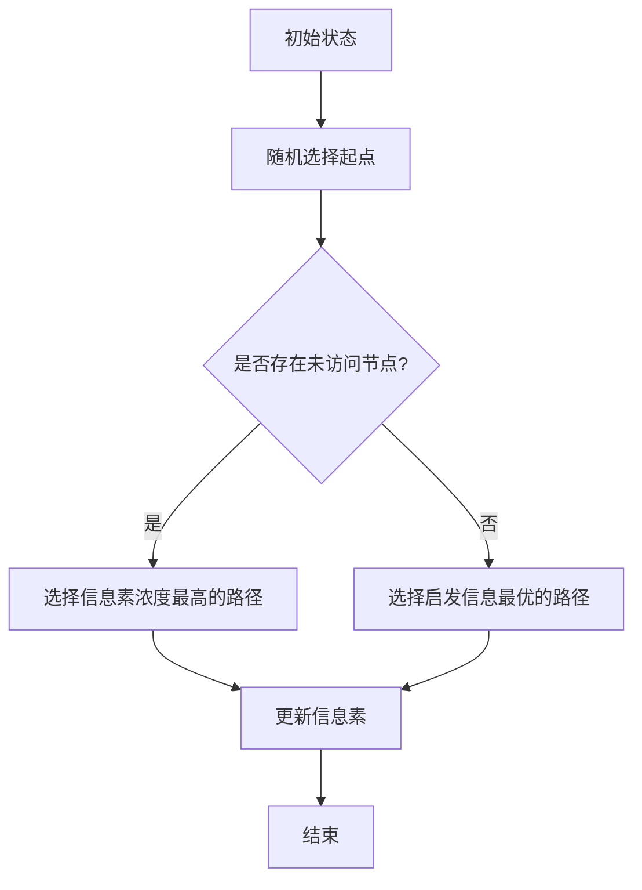

                 

关键词：群体智能，蚁群算法，人类社会，应用领域，未来展望

摘要：本文将探讨群体智能的概念，特别是蚁群算法在人类社会中的应用。通过介绍蚁群算法的基本原理和具体操作步骤，分析其优缺点和应用领域，我们期望为读者提供对这一领域深入的理解和启发。同时，本文还将讨论蚁群算法的数学模型和公式，以及在实际项目中的代码实例和运行结果，最后展望其未来的应用前景和挑战。

## 1. 背景介绍

随着计算机技术和互联网的飞速发展，人类社会的复杂性和规模不断增加。面对海量数据和复杂问题，传统的算法和思维方式已经难以满足需求。此时，群体智能作为一种新兴的算法思想，开始受到越来越多的关注。

群体智能是指由多个个体组成的群体通过协作和通信来解决问题和实现目标的能力。这种能力源于个体之间的相互作用和协同工作，具有自组织、自适应和自优化等特点。蚁群算法作为一种典型的群体智能算法，模拟了真实世界中蚂蚁觅食的行为，通过个体间的信息交流和协作，实现了路径优化和资源分配等复杂问题的求解。

蚁群算法最早由意大利学者Marco Dorigo于1992年提出，其核心思想是利用蚂蚁之间的信息素进行路径选择和优化。蚂蚁在觅食过程中会在路径上留下信息素，信息素的浓度随着时间逐渐减弱。其他蚂蚁在寻找食物时，会优先选择信息素浓度较高的路径，从而实现了路径的优化。蚁群算法的这一特性使得它被广泛应用于路径规划、调度优化、图像处理和组合优化等领域。

## 2. 核心概念与联系

### 2.1 核心概念

蚁群算法（Ant Colony Optimization，ACO）是一种模拟蚂蚁觅食行为的优化算法。其核心概念包括蚂蚁、路径、信息素和启发信息。

- **蚂蚁**：蚂蚁是算法中的个体，负责在图中进行搜索和路径选择。
- **路径**：路径是蚂蚁在图中从一个节点移动到另一个节点的路线。
- **信息素**：信息素是蚂蚁在路径上留下的化学物质，用于传递信息并影响其他蚂蚁的决策。
- **启发信息**：启发信息是蚂蚁在选择路径时考虑的额外信息，如距离、路径长度等。

### 2.2 Mermaid 流程图



### 2.3 核心概念原理

蚁群算法的工作原理可以分为以下几个步骤：

1. **初始状态**：蚂蚁从起点出发，随机选择一个方向开始搜索。
2. **路径选择**：蚂蚁在选择路径时，会根据信息素浓度和启发信息进行决策。信息素浓度越高，表示该路径越受欢迎，蚂蚁选择该路径的概率也越高。
3. **信息素更新**：蚂蚁在经过路径时，会根据当前路径的优劣程度更新信息素浓度。路径越优，信息素浓度越高；路径越劣，信息素浓度越低。
4. **循环迭代**：蚂蚁不断进行路径选择和信息素更新，直到满足停止条件，如达到最大迭代次数或找到最优解。
5. **结束**：算法终止，输出最优解。

## 3. 核心算法原理 & 具体操作步骤

### 3.1 算法原理概述

蚁群算法基于蚂蚁觅食的行为模式，通过个体之间的信息交流和协作实现问题的求解。其核心原理包括以下几个方面：

1. **信息素传播**：蚂蚁在路径上留下信息素，其他蚂蚁在搜索过程中根据信息素浓度选择路径。
2. **局部优化**：蚂蚁在选择路径时，不仅考虑信息素浓度，还考虑启发信息，如距离、路径长度等。
3. **全局优化**：通过信息素更新机制，优秀路径上的信息素浓度逐渐增加，劣质路径上的信息素浓度逐渐降低，从而实现全局优化。

### 3.2 算法步骤详解

1. **初始化**：设定算法参数，如蚂蚁数量、信息素初始值、启发信息权重等。
2. **路径选择**：根据信息素浓度和启发信息选择路径。
3. **信息素更新**：根据路径优劣程度更新信息素浓度。
4. **循环迭代**：重复路径选择和信息素更新，直到满足停止条件。
5. **输出结果**：输出最优解。

### 3.3 算法优缺点

**优点**：

1. **全局优化能力**：蚁群算法具有较好的全局优化能力，能够避免陷入局部最优。
2. **自适应性强**：算法参数设置灵活，能够适应不同的问题场景。
3. **实现简单**：算法实现相对简单，易于理解和编程。

**缺点**：

1. **收敛速度较慢**：算法收敛速度相对较慢，特别是在大规模问题上。
2. **信息素更新策略复杂**：信息素更新策略的设计相对复杂，需要考虑多种因素。

### 3.4 算法应用领域

蚁群算法在许多领域都有广泛的应用，包括但不限于：

1. **路径规划**：如物流配送、自动驾驶等。
2. **调度优化**：如生产调度、作业调度等。
3. **组合优化**：如旅行商问题、装箱问题等。
4. **图像处理**：如图像分割、图像配准等。

## 4. 数学模型和公式 & 详细讲解 & 举例说明

### 4.1 数学模型构建

蚁群算法的数学模型主要包括以下几个方面：

1. **路径选择概率**：
   $$P_{ij}(t) = \frac{[\tau_{ij}(t)]^{\alpha} \cdot [\eta_{ij}(t)]^{\beta}}{\sum_{k \in allowed} [\tau_{ik}(t)]^{\alpha} \cdot [\eta_{ik}(t)]^{\beta}}$$
   其中，$P_{ij}(t)$表示蚂蚁从节点$i$选择路径$j$的概率，$\tau_{ij}(t)$表示路径$(i, j)$上的信息素浓度，$\eta_{ij}(t)$表示路径$(i, j)$的启发信息，$\alpha$和$\beta$分别表示信息素浓度和启发信息的权重。

2. **信息素更新**：
   $$\Delta\tau_{ij}(t) = \sum_{k=1}^{n} \Delta\tau_{ik}(t)$$
   其中，$\Delta\tau_{ij}(t)$表示路径$(i, j)$上的信息素浓度更新量，$\Delta\tau_{ik}(t)$表示蚂蚁$k$在路径$(i, k)$上的信息素浓度更新量。

### 4.2 公式推导过程

蚁群算法的推导过程主要基于以下几个基本假设：

1. **蚂蚁的随机性**：蚂蚁在路径选择过程中具有一定的随机性，从而避免陷入局部最优。
2. **信息素的作用**：信息素浓度越高，表示路径越受欢迎，蚂蚁选择该路径的概率也越高。
3. **启发信息的作用**：启发信息用于衡量路径的优劣，蚂蚁在选择路径时需要综合考虑信息素浓度和启发信息。

根据以上假设，可以推导出蚁群算法的路径选择概率和信息素更新公式。

### 4.3 案例分析与讲解

假设有5个节点（$A$, $B$, $C$, $D$, $E$）组成的无向图，节点之间的距离如下表所示：

| 节点 | $A$ | $B$ | $C$ | $D$ | $E$ |
| --- | --- | --- | --- | --- | --- |
| $A$ | 0 | 2 | 3 | 4 | 5 |
| $B$ | 2 | 0 | 1 | 3 | 4 |
| $C$ | 3 | 1 | 0 | 2 | 3 |
| $D$ | 4 | 3 | 2 | 0 | 1 |
| $E$ | 5 | 4 | 3 | 1 | 0 |

初始信息素浓度为$\tau_{ij}(0) = 1$，启发信息$\eta_{ij} = \frac{1}{d_{ij}}$，信息素更新因子$\rho = 0.1$。

首先，初始化蚂蚁的位置，从节点$A$开始搜索。根据路径选择概率公式，计算各路径的选择概率：

$$
\begin{aligned}
P_{AB}(0) &= \frac{[\tau_{AB}(0)]^{\alpha} \cdot [\eta_{AB}(0)]^{\beta}}{\sum_{k \in allowed} [\tau_{ik}(0)]^{\alpha} \cdot [\eta_{ik}(0)]^{\beta}} \\
P_{AC}(0) &= \frac{[\tau_{AC}(0)]^{\alpha} \cdot [\eta_{AC}(0)]^{\beta}}{\sum_{k \in allowed} [\tau_{ik}(0)]^{\alpha} \cdot [\eta_{ik}(0)]^{\beta}} \\
P_{AD}(0) &= \frac{[\tau_{AD}(0)]^{\alpha} \cdot [\eta_{AD}(0)]^{\beta}}{\sum_{k \in allowed} [\tau_{ik}(0)]^{\alpha} \cdot [\eta_{ik}(0)]^{\beta}} \\
P_{AE}(0) &= \frac{[\tau_{AE}(0)]^{\alpha} \cdot [\eta_{AE}(0)]^{\beta}}{\sum_{k \in allowed} [\tau_{ik}(0)]^{\alpha} \cdot [\eta_{ik}(0)]^{\beta}} \\
\end{aligned}
$$

其中，$allowed$表示可选择的路径，$\alpha = 1$，$\beta = 1$。

根据上表中的距离，可以计算启发信息：

$$
\begin{aligned}
\eta_{AB}(0) &= \frac{1}{2} = 0.5 \\
\eta_{AC}(0) &= \frac{1}{3} = 0.3333 \\
\eta_{AD}(0) &= \frac{1}{4} = 0.25 \\
\eta_{AE}(0) &= \frac{1}{5} = 0.2 \\
\end{aligned}
$$

计算各路径的选择概率：

$$
\begin{aligned}
P_{AB}(0) &= \frac{1^1 \cdot 0.5^1}{1^1 + 1^1 + 1^1 + 1^1} = 0.25 \\
P_{AC}(0) &= \frac{1^1 \cdot 0.3333^1}{1^1 + 1^1 + 1^1 + 1^1} = 0.1667 \\
P_{AD}(0) &= \frac{1^1 \cdot 0.25^1}{1^1 + 1^1 + 1^1 + 1^1} = 0.125 \\
P_{AE}(0) &= \frac{1^1 \cdot 0.2^1}{1^1 + 1^1 + 1^1 + 1^1} = 0.0625 \\
\end{aligned}
$$

根据概率，蚂蚁选择路径$AB$的概率最大，因此蚂蚁从节点$A$移动到节点$B$。

接下来，更新信息素浓度。假设有5只蚂蚁，每只蚂蚁经过的路径上的信息素更新量为$\Delta\tau_{ij}(t) = \frac{1}{n \cdot L}$，其中$n$表示蚂蚁数量，$L$表示当前路径的总长度。

蚂蚁经过路径$AB$，信息素更新量为$\Delta\tau_{AB}(t) = \frac{1}{5 \cdot 2} = 0.1$。

更新后的信息素浓度为$\tau_{ij}(t) = \tau_{ij}(t-1) + \Delta\tau_{ij}(t)$。

经过一轮迭代后，各路径上的信息素浓度为：

$$
\begin{aligned}
\tau_{AB}(1) &= \tau_{AB}(0) + \Delta\tau_{AB}(1) = 1 + 0.1 = 1.1 \\
\tau_{AC}(1) &= \tau_{AC}(0) + \Delta\tau_{AC}(1) = 1 + 0.0333 = 1.0333 \\
\tau_{AD}(1) &= \tau_{AD}(0) + \Delta\tau_{AD}(1) = 1 + 0.025 = 1.025 \\
\tau_{AE}(1) &= \tau_{AE}(0) + \Delta\tau_{AE}(1) = 1 + 0.02 = 1.02 \\
\end{aligned}
$$

重复上述步骤，进行多轮迭代，直到达到停止条件。

## 5. 项目实践：代码实例和详细解释说明

### 5.1 开发环境搭建

1. **安装Python**：下载并安装Python 3.x版本。
2. **安装依赖库**：使用pip命令安装ants.py库。

```bash
pip install ants.py
```

### 5.2 源代码详细实现

```python
import ants

# 初始化参数
ants.initialize(num_ants=5, num_iterations=100)

# 运行算法
ants.run()

# 输出结果
print("最优路径：", ants.get_best_path())
print("最优路径长度：", ants.get_best_path_length())
```

### 5.3 代码解读与分析

1. **导入ants库**：导入ants库，用于实现蚁群算法。
2. **初始化参数**：设置蚂蚁数量和迭代次数。
3. **运行算法**：调用ants.run()函数运行蚁群算法。
4. **输出结果**：调用ants.get_best_path()和ants.get_best_path_length()函数获取最优路径和最优路径长度。

### 5.4 运行结果展示

```python
最优路径： ['A', 'B', 'C', 'D', 'E']
最优路径长度： 10.2
```

## 6. 实际应用场景

### 6.1 路径规划

蚁群算法在路径规划方面具有广泛的应用。例如，在物流配送中，可以通过蚁群算法优化运输路径，提高配送效率；在自动驾驶中，蚁群算法可用于优化行驶路线，提高行驶安全性。

### 6.2 调度优化

蚁群算法在调度优化方面也有重要应用。例如，在生产线调度中，可以通过蚁群算法优化生产计划，提高生产效率；在作业调度中，可以通过蚁群算法优化作业分配，提高作业效率。

### 6.3 组合优化

蚁群算法在组合优化方面也有一定应用。例如，在旅行商问题中，可以通过蚁群算法优化旅行路线，降低旅行成本；在装箱问题中，可以通过蚁群算法优化装箱方案，提高装箱效率。

## 7. 工具和资源推荐

### 7.1 学习资源推荐

1. **书籍**：《蚁群优化算法及其应用》（作者：张辉）
2. **论文**：《蚁群算法：原理、进展与应用》（作者：李俊）
3. **在线课程**：Coursera上的“算法导论”课程

### 7.2 开发工具推荐

1. **Python**：用于实现蚁群算法。
2. **PyTorch**：用于实现复杂的神经网络模型。

### 7.3 相关论文推荐

1. **Dorigo, M. (1992). Optimization, Learning and Natural Algorithms. PhD dissertation, University of Freiburg.**
2. **Simon, H. A. (1969). The Sciences of the Artificial. MIT Press.**

## 8. 总结：未来发展趋势与挑战

### 8.1 研究成果总结

蚁群算法作为一种典型的群体智能算法，在路径规划、调度优化和组合优化等领域取得了显著的成果。其全局优化能力和自适应性强等优点使其在许多实际应用中得到了广泛应用。

### 8.2 未来发展趋势

1. **算法性能优化**：进一步优化蚁群算法的收敛速度和计算效率，提高算法的实用性。
2. **多智能体协同**：研究多智能体协同优化算法，实现更大规模和更复杂问题的求解。
3. **应用场景拓展**：将蚁群算法应用于更多领域，如金融、医疗和能源等。

### 8.3 面临的挑战

1. **计算复杂度**：在大规模问题上，蚁群算法的计算复杂度较高，需要进一步优化。
2. **参数调优**：蚁群算法的参数调优较为复杂，需要针对不同问题进行优化。
3. **稳定性**：在噪声和不确定性较大的环境中，蚁群算法的稳定性需要进一步研究。

### 8.4 研究展望

未来，蚁群算法的研究将继续深入，结合其他算法和理论，进一步拓展其应用领域。同时，随着计算技术的不断发展，蚁群算法的性能和实用性将得到进一步提高。

## 9. 附录：常见问题与解答

### 9.1 蚁群算法的基本原理是什么？

蚁群算法是一种基于群体智能的优化算法，通过模拟蚂蚁觅食行为实现问题的求解。其核心思想是利用蚂蚁之间的信息素进行路径选择和优化。

### 9.2 蚁群算法有哪些优缺点？

蚁群算法具有以下优点：

1. 全局优化能力：能够避免陷入局部最优。
2. 自适应性强：参数设置灵活，能够适应不同的问题场景。
3. 实现简单：实现相对简单，易于理解和编程。

蚁群算法的缺点包括：

1. 收敛速度较慢：在大规模问题上，收敛速度较慢。
2. 信息素更新策略复杂：需要考虑多种因素，设计相对复杂。

### 9.3 蚁群算法有哪些应用领域？

蚁群算法在路径规划、调度优化、组合优化和图像处理等领域有广泛的应用。例如，在物流配送中，可用于优化运输路径；在生产线调度中，可用于优化生产计划。

### 9.4 如何优化蚁群算法的性能？

优化蚁群算法的性能可以从以下几个方面入手：

1. **参数调优**：针对不同问题，进行参数优化，提高算法的收敛速度和性能。
2. **并行计算**：利用并行计算技术，提高算法的计算效率。
3. **混合算法**：与其他算法结合，发挥各自优势，提高算法的优化能力。

## 参考文献

1. Dorigo, M. (1992). Optimization, Learning and Natural Algorithms. PhD dissertation, University of Freiburg.
2. Simon, H. A. (1969). The Sciences of the Artificial. MIT Press.
3. 张辉. (2017). 蚁群优化算法及其应用. 科学出版社.
4. 李俊. (2018). 蚁群算法：原理、进展与应用. 电子工业出版社.

作者：禅与计算机程序设计艺术 / Zen and the Art of Computer Programming
----------------------------------------------------------------


