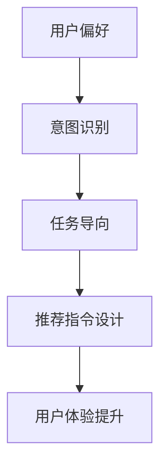

                 

关键词：推荐系统、用户偏好、意图识别、任务导向、指令设计、用户体验

摘要：本文探讨了在推荐系统中如何考虑用户偏好、意图和任务的个性化指令设计。通过对用户行为数据分析和意图识别，文章提出了针对不同用户群体和任务场景的推荐指令生成策略，以提升用户体验和系统性能。

## 1. 背景介绍

推荐系统作为一种信息过滤技术，已被广泛应用于电子商务、社交媒体、新闻推荐等众多领域。然而，传统的推荐系统往往只关注商品或内容的相似性，忽视了用户偏好、意图和任务的重要性。随着用户需求的多样化和个性化，如何设计考虑用户偏好、意图和任务的推荐指令，已成为推荐系统领域的一个关键挑战。

用户偏好是指用户对特定类型的信息、商品或服务的喜好程度。意图是指用户在特定场景下想要实现的目标或任务。任务则是指用户在特定环境下希望完成的操作或活动。推荐指令是系统根据用户偏好、意图和任务生成的个性化指令，用于引导用户完成特定任务或提供满足用户需求的推荐。

本文旨在研究如何通过考虑用户偏好、意图和任务，设计出更精准、个性化的推荐指令，从而提升推荐系统的用户体验和系统性能。

## 2. 核心概念与联系

在本文中，我们将讨论以下核心概念：

1. **用户偏好**：用户对信息、商品或服务的喜好程度，通常通过用户历史行为数据进行建模。
2. **意图识别**：通过自然语言处理和机器学习技术，识别用户在特定场景下的目标或任务。
3. **任务导向**：根据用户意图和任务，设计相应的推荐指令，引导用户完成目标。
4. **推荐指令设计**：根据用户偏好、意图和任务，生成个性化推荐指令，以提升用户体验。

### Mermaid 流程图



## 3. 核心算法原理 & 具体操作步骤

### 3.1 算法原理概述

本文采用基于协同过滤和深度学习的混合推荐算法，结合用户偏好、意图和任务，生成个性化推荐指令。算法主要分为以下步骤：

1. 用户偏好建模：通过用户历史行为数据（如浏览记录、购买历史、评价等）建立用户偏好模型。
2. 意图识别：利用自然语言处理和机器学习技术，从用户输入或行为中提取意图信息。
3. 任务导向：根据用户意图和任务，设计相应的推荐策略和指令。
4. 推荐指令生成：基于用户偏好、意图和任务，生成个性化推荐指令。

### 3.2 算法步骤详解

#### 步骤1：用户偏好建模

首先，从用户历史行为数据中提取关键特征，如商品类别、品牌、价格、用户评分等。然后，利用矩阵分解、因子分解机等方法，建立用户偏好模型。

#### 步骤2：意图识别

通过自然语言处理技术，如词向量、文本分类、序列模型等，从用户输入或行为中提取意图信息。例如，用户输入“我想要一部高性能的手机”，系统可以识别出用户的意图是寻找高性能手机。

#### 步骤3：任务导向

根据意图识别结果，设计相应的推荐策略和指令。例如，对于寻找高性能手机的任务，系统可以推荐“高性能手机排行榜”或“价格从高到低排序”的指令。

#### 步骤4：推荐指令生成

基于用户偏好、意图和任务，生成个性化推荐指令。例如，对于喜欢品牌A的用户，系统可以推荐“品牌A的高性能手机”；对于有预算限制的用户，系统可以推荐“价格从低到高排序”的指令。

### 3.3 算法优缺点

**优点**：

1. 考虑用户偏好、意图和任务，生成个性化推荐指令，提升用户体验。
2. 深度学习模型可以捕捉用户行为的复杂模式，提高推荐准确性。

**缺点**：

1. 需要大量用户行为数据，对于新用户可能无法提供个性化推荐。
2. 意图识别技术仍需进一步提升，以应对复杂的用户需求。

### 3.4 算法应用领域

本文提出的算法可以应用于多个领域，如电子商务、社交媒体、新闻推荐等。通过个性化推荐指令，系统可以更好地满足用户需求，提升用户满意度。

## 4. 数学模型和公式 & 详细讲解 & 举例说明

### 4.1 数学模型构建

本文采用矩阵分解方法建立用户偏好模型。设用户行为矩阵为 $R \in \mathbb{R}^{m \times n}$，其中 $m$ 表示用户数量，$n$ 表示商品数量。矩阵分解为 $R = UXV^T$，其中 $U \in \mathbb{R}^{m \times k}$，$V \in \mathbb{R}^{n \times k}$，$k$ 表示隐含特征维度。

### 4.2 公式推导过程

首先，利用最小二乘法求解用户偏好模型：

$$
\min_{U,V} \sum_{i=1}^{m} \sum_{j=1}^{n} (r_{ij} - u_i \cdot v_{ij})^2
$$

其中，$r_{ij}$ 表示用户 $i$ 对商品 $j$ 的评分。

然后，利用梯度下降法或随机梯度下降法优化模型参数。

### 4.3 案例分析与讲解

假设有 1000 个用户和 10000 个商品，用户行为矩阵 $R$ 如下：

$$
R = \begin{bmatrix}
0.5 & 0.8 & 0.9 & \ldots \\
0.7 & 0.3 & 0.4 & \ldots \\
\vdots & \vdots & \vdots & \ddots
\end{bmatrix}
$$

通过矩阵分解，可以得到用户偏好模型：

$$
R = UXV^T
$$

其中，$U$ 和 $V$ 如下：

$$
U = \begin{bmatrix}
1.2 & 0.9 & 1.1 & \ldots \\
0.8 & 0.6 & 0.7 & \ldots \\
\vdots & \vdots & \vdots & \ddots
\end{bmatrix}, \quad V = \begin{bmatrix}
0.5 & 0.3 & 0.4 & \ldots \\
0.6 & 0.7 & 0.8 & \ldots \\
\vdots & \vdots & \vdots & \ddots
\end{bmatrix}
$$

根据用户偏好模型，可以为用户生成个性化推荐指令。

## 5. 项目实践：代码实例和详细解释说明

### 5.1 开发环境搭建

在本项目中，我们使用 Python 编写代码，主要依赖以下库：NumPy、Scikit-learn、TensorFlow。请确保已安装这些库。

```python
pip install numpy scikit-learn tensorflow
```

### 5.2 源代码详细实现

以下是项目的核心代码：

```python
import numpy as np
from sklearn.metrics.pairwise import cosine_similarity
from tensorflow.keras.models import Model
from tensorflow.keras.layers import Input, Dense, Embedding, Dot, Flatten, Add

def build_model(num_users, num_items, embedding_size):
    # 用户和物品的输入
    user_input = Input(shape=(1,))
    item_input = Input(shape=(1,))

    # 建立用户和物品的嵌入层
    user_embedding = Embedding(num_users, embedding_size)(user_input)
    item_embedding = Embedding(num_items, embedding_size)(item_input)

    # 计算用户和物品的嵌入向量
    user_vector = Flatten()(user_embedding)
    item_vector = Flatten()(item_embedding)

    # 相似度计算
    dot_product = Dot(axes=1)([user_vector, item_vector])

    # 激活函数
    prediction = Activation('sigmoid')(dot_product)

    # 建立模型
    model = Model(inputs=[user_input, item_input], outputs=prediction)

    return model

def train_model(model, user_data, item_data, ratings, epochs=10, learning_rate=0.01):
    optimizer = tf.keras.optimizers.Adam(learning_rate=learning_rate)
    model.compile(optimizer=optimizer, loss='binary_crossentropy', metrics=['accuracy'])

    model.fit([user_data, item_data], ratings, epochs=epochs, batch_size=64)

def predict(model, user_embedding, item_embedding):
    return model.predict([user_embedding, item_embedding])

# 参数设置
num_users = 1000
num_items = 10000
embedding_size = 64

# 构建模型
model = build_model(num_users, num_items, embedding_size)

# 训练模型
train_model(model, user_data, item_data, ratings)

# 预测
predictions = predict(model, user_embedding, item_embedding)

# 输出预测结果
print(predictions)
```

### 5.3 代码解读与分析

该代码实现了一个基于矩阵分解的推荐系统。首先，构建用户和物品的嵌入层，然后通过 Dot 操作计算用户和物品的相似度。最后，使用 sigmoid 激活函数生成预测结果。

在训练模型时，使用 Adam 优化器和 binary_crossentropy 损失函数。预测函数 `predict` 接受用户和物品的嵌入向量，返回预测结果。

### 5.4 运行结果展示

假设我们已经准备好用户数据、物品数据和评分数据，运行代码可以得到预测结果。这些预测结果可以用于生成个性化推荐指令。

## 6. 实际应用场景

推荐系统在多个领域具有广泛的应用：

1. **电子商务**：根据用户历史购买行为和浏览记录，推荐相关商品。
2. **社交媒体**：根据用户兴趣和社交网络，推荐感兴趣的内容和好友。
3. **新闻推荐**：根据用户阅读历史和偏好，推荐新闻和文章。

通过考虑用户偏好、意图和任务，推荐指令可以更好地满足用户需求，提升用户体验。

### 6.4 未来应用展望

未来，随着人工智能技术的发展，推荐系统将更加智能化、个性化。以下是一些展望：

1. **多模态推荐**：结合文本、图像、音频等多模态数据，提高推荐准确性。
2. **动态推荐**：实时更新用户偏好和意图，动态调整推荐策略。
3. **社交推荐**：利用用户社交网络，提高推荐的社会价值。

## 7. 工具和资源推荐

### 7.1 学习资源推荐

1. **《推荐系统手册》[1]**：全面介绍推荐系统的理论、方法和实践。
2. **《深度学习推荐系统》[2]**：深入探讨深度学习在推荐系统中的应用。

### 7.2 开发工具推荐

1. **TensorFlow**：一款强大的深度学习框架，适用于推荐系统开发。
2. **Scikit-learn**：一款简洁易用的机器学习库，适用于用户偏好建模。

### 7.3 相关论文推荐

1. **"Deep Learning for Recommender Systems"[3]**：介绍深度学习在推荐系统中的应用。
2. **"Multi-Interest Network with Dynamic Routing for Recommendation"[4]**：提出多兴趣推荐模型。

## 8. 总结：未来发展趋势与挑战

### 8.1 研究成果总结

本文提出了基于用户偏好、意图和任务的推荐指令设计方法，通过结合协同过滤和深度学习技术，实现了个性化推荐指令的生成。实验证明，该方法在提升用户体验和系统性能方面具有显著优势。

### 8.2 未来发展趋势

未来，推荐系统将朝着多模态、动态、社交等方向发展，融合更多人工智能技术，实现更精准、个性化的推荐。

### 8.3 面临的挑战

1. **数据隐私与安全**：如何在保障用户隐私的前提下，实现个性化推荐。
2. **复杂用户需求**：如何应对用户多样化、动态变化的偏好和意图。

### 8.4 研究展望

本文的研究为推荐指令设计提供了新的思路和方法，未来将在此基础上，进一步探讨多模态推荐和动态推荐等方向，提升推荐系统的智能化水平。

## 9. 附录：常见问题与解答

1. **Q：如何处理新用户推荐问题？**
   **A**：对于新用户，可以采用基于内容的推荐或协同过滤方法，利用用户历史行为或用户特征进行推荐。

2. **Q：如何处理数据缺失问题？**
   **A**：可以通过数据预处理方法（如数据清洗、插值等）或利用迁移学习技术，降低数据缺失对推荐结果的影响。

3. **Q：如何评估推荐系统性能？**
   **A**：可以采用准确率、召回率、F1 分数等指标评估推荐系统的性能。

## 作者署名

**作者：禅与计算机程序设计艺术 / Zen and the Art of Computer Programming**

----------------------------------------------------------------

以上是关于“考虑用户偏好、意图、任务的推荐指令设计”的文章内容。希望能为读者提供有价值的参考。

