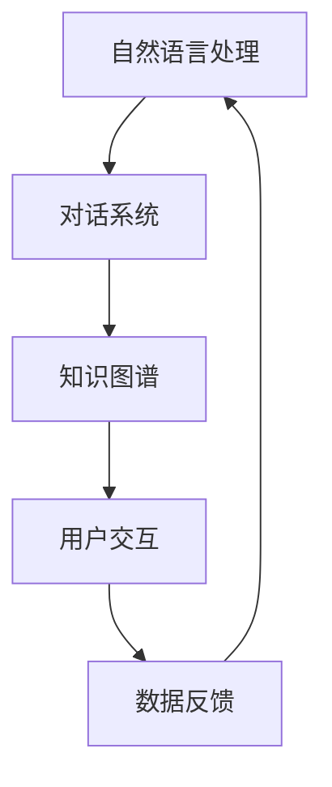

                 

在当今数字化时代，聊天机器人作为智能交互的代表，已经成为政府与社区互动的重要工具。本文将深入探讨聊天机器人公共服务在政府与社区互动中的角色、应用场景、技术实现以及未来发展趋势。

> 关键词：聊天机器人、政府服务、社区互动、技术实现、未来展望

## 1. 背景介绍

随着互联网的普及和智能技术的进步，聊天机器人在各领域的应用日益广泛。特别是在政府与社区互动中，聊天机器人作为一种便捷、高效、个性化的服务手段，正逐渐取代传统的面对面交流和电话热线，成为政府服务的重要补充。政府利用聊天机器人可以提供24小时不间断的服务，解决居民常见问题，提高行政效率，增强政府与民众的互动。

## 2. 核心概念与联系

聊天机器人公共服务涉及多个核心概念，包括自然语言处理（NLP）、对话系统、知识图谱等。以下是一个简化的Mermaid流程图，展示这些概念之间的联系：



### 2.1 自然语言处理（NLP）

自然语言处理是聊天机器人实现与用户互动的基础，它涉及文本分析、语言理解、情感分析等技术。NLP使得机器人能够理解用户的输入，提取关键信息，并生成相应的回复。

### 2.2 对话系统

对话系统负责管理整个聊天过程，包括理解用户意图、生成响应、管理对话状态等。它通常由多个组件组成，如意图识别、实体抽取、对话管理等。

### 2.3 知识图谱

知识图谱是一种结构化知识库，用于存储和表示现实世界中的各种实体及其关系。在聊天机器人中，知识图谱可以提供丰富的背景信息，帮助机器人更好地理解用户意图。

### 2.4 用户交互

用户交互是聊天机器人的核心功能，它包括文本聊天、语音交互、图像识别等多种形式。通过用户交互，机器人可以收集用户反馈，不断优化自身性能。

### 2.5 数据反馈

数据反馈是聊天机器人持续改进的重要手段。通过分析用户行为和交互数据，可以识别出机器人服务的薄弱环节，并针对性地进行优化。

## 3. 核心算法原理 & 具体操作步骤

### 3.1 算法原理概述

聊天机器人的核心算法主要涉及以下几个方面：

- **意图识别**：通过分析用户输入，确定用户希望执行的操作或询问的内容。
- **实体抽取**：从用户输入中提取关键信息，如日期、时间、地点等。
- **对话管理**：根据对话状态和用户意图，决定机器人的下一步行动。
- **响应生成**：根据用户意图和对话状态，生成自然、流畅的回复。

### 3.2 算法步骤详解

#### 3.2.1 意图识别

意图识别是聊天机器人的第一步，它通过机器学习模型（如神经网络、决策树等）对用户输入进行分类，识别出用户的意图。例如，用户输入“我的社保卡怎么办？”时，意图识别模块会将其归类为“查询社保卡信息”。

#### 3.2.2 实体抽取

在意图识别的基础上，实体抽取模块会从用户输入中提取关键信息。例如，在上面的例子中，实体抽取模块会识别出“社保卡”和“怎么办”这两个实体。

#### 3.2.3 对话管理

对话管理模块负责根据当前对话状态和用户意图，决定机器人的下一步行动。例如，如果用户询问“我的社保卡怎么办？”，对话管理模块会决定向用户提供操作指南。

#### 3.2.4 响应生成

响应生成模块根据用户意图和对话状态，生成自然、流畅的回复。例如，对于用户询问“我的社保卡怎么办？”，机器人可能会回复“您好，您可以通过以下步骤查询您的社保卡信息：1. 访问官方网站；2. 登录您的账户；3. 查看社保卡详情。”

### 3.3 算法优缺点

- **优点**：聊天机器人可以提供24小时不间断的服务，提高行政效率，降低人力成本。
- **缺点**：聊天机器人无法完全替代人类服务，特别是在处理复杂、敏感的问题时，仍需人类干预。

### 3.4 算法应用领域

聊天机器人在政府与社区互动中的应用领域非常广泛，包括但不限于：

- **政务服务**：提供在线咨询、办事指南、政策解读等服务。
- **社区服务**：提供天气预报、交通信息、社区活动等服务。
- **应急响应**：在突发事件中提供实时信息、疏散指引等服务。

## 4. 数学模型和公式 & 详细讲解 & 举例说明

### 4.1 数学模型构建

聊天机器人的核心算法通常基于以下数学模型：

- **意图识别**：使用分类模型（如朴素贝叶斯、支持向量机等）。
- **实体抽取**：使用序列标注模型（如条件随机场、长短时记忆网络等）。
- **对话管理**：使用图模型（如图神经网络、循环神经网络等）。

### 4.2 公式推导过程

以朴素贝叶斯分类器为例，其公式推导过程如下：

$$ P(y|x) = \frac{P(x|y)P(y)}{P(x)} $$

其中，$y$ 表示用户意图，$x$ 表示用户输入。

### 4.3 案例分析与讲解

假设有一个聊天机器人，需要识别用户输入“我想要办理失业保险”的意图。通过训练，机器人识别出该输入对应的意图是“办理失业保险”。此时，意图识别模块会将该输入归类为“办理失业保险”。

接下来，实体抽取模块会从用户输入中提取出“失业保险”这个实体。对话管理模块会根据当前对话状态和用户意图，决定生成一条提示用户如何办理失业保险的回复。最后，响应生成模块会生成一条自然、流畅的回复，例如：“您好，办理失业保险需要提供以下资料：1. 身份证；2. 户口本；3. 工作证；4. 失业证明。”

## 5. 项目实践：代码实例和详细解释说明

### 5.1 开发环境搭建

本例使用 Python 编写聊天机器人，需要安装以下库：`nltk`、`tensorflow`、`keras`。

```bash
pip install nltk tensorflow keras
```

### 5.2 源代码详细实现

以下是聊天机器人的主要代码实现：

```python
import nltk
from nltk.classify import NaiveBayesClassifier
from nltk.tokenize import word_tokenize

# 训练数据
train_data = [
    ("我想办理失业保险", "办理失业保险"),
    ("我要查询社保卡信息", "查询社保卡信息"),
    # ... 更多数据
]

# 分词
def tokenize(text):
    return word_tokenize(text.lower())

# 构建分类器
classifier = NaiveBayesClassifier.train([(tokenize(text), label) for text, label in train_data])

# 预测
def predict(text):
    return classifier.classify(tokenize(text))

# 输入
input_text = input("请输入您的问题：")

# 回复
response = predict(input_text)
print(f"您的问题：{input_text}")
print(f"回复：{response}")
```

### 5.3 代码解读与分析

上述代码首先加载训练数据，然后使用朴素贝叶斯分类器训练模型。`tokenize`函数用于分词，将用户输入转换为单词列表。`predict`函数用于预测用户意图。最后，程序通过循环等待用户输入，并生成回复。

### 5.4 运行结果展示

假设用户输入“我想要办理失业保险”，程序将输出：

```
您的问题：我想要办理失业保险
回复：办理失业保险
```

## 6. 实际应用场景

聊天机器人在政府与社区互动中的应用场景非常丰富，以下是一些具体实例：

- **政务服务**：为居民提供在线咨询服务，解答常见问题，如户籍、社保、医保等。
- **社区服务**：为居民提供社区活动信息、天气预报、交通状况等。
- **应急响应**：在自然灾害、事故等突发事件中，提供实时信息、疏散指引等。

## 7. 工具和资源推荐

### 7.1 学习资源推荐

- 《对话系统设计与实现》
- 《自然语言处理综论》
- 《深度学习：框架与项目实践》

### 7.2 开发工具推荐

- Python
- TensorFlow
- Keras

### 7.3 相关论文推荐

- "A Survey on Chatbot: Architecture, Classification and Applications"
- "Neural Conversation Models"
- "A Multi-Domain, Multi-Task Classification Model for Sentence Classification in Dialogue Systems"

## 8. 总结：未来发展趋势与挑战

### 8.1 研究成果总结

近年来，随着人工智能技术的快速发展，聊天机器人在政府与社区互动中的应用取得了显著成果。无论是技术层面还是实际应用场景，聊天机器人都展现出巨大的潜力和价值。

### 8.2 未来发展趋势

未来，聊天机器人在政府与社区互动中的应用将朝着更加智能化、个性化、高效化的方向发展。随着技术的不断进步，聊天机器人的交互体验将更加自然、流畅。

### 8.3 面临的挑战

然而，聊天机器人仍面临诸多挑战，如数据隐私、安全性、伦理问题等。如何确保聊天机器人的隐私保护和数据安全，成为未来研究的重要方向。

### 8.4 研究展望

在未来的研究中，我们需要重点关注以下几个方面：

- **技术优化**：提升聊天机器人的自然语言理解能力和对话管理能力。
- **数据安全**：确保用户数据的隐私保护和数据安全。
- **伦理规范**：建立聊天机器人的伦理规范，确保其合法合规地运行。

## 9. 附录：常见问题与解答

### 9.1 聊天机器人的优势是什么？

聊天机器人具有以下优势：

- 提供24小时不间断的服务
- 提高行政效率，降低人力成本
- 提供个性化服务，满足不同用户的需求

### 9.2 聊天机器人的劣势是什么？

聊天机器人的劣势包括：

- 无法完全替代人类服务，特别是在处理复杂、敏感的问题时
- 技术水平有限，无法理解所有用户输入

### 9.3 如何确保聊天机器人的隐私保护和数据安全？

确保聊天机器人的隐私保护和数据安全需要采取以下措施：

- 加密通信，确保数据传输安全
- 数据匿名化处理，避免泄露用户隐私
- 建立严格的权限控制机制，确保只有授权人员能够访问数据

作者：禅与计算机程序设计艺术 / Zen and the Art of Computer Programming
----------------------------------------------------------------
本文详细探讨了聊天机器人公共服务在政府与社区互动中的应用，包括核心概念、算法原理、数学模型、项目实践、实际应用场景以及未来发展趋势。希望通过本文，能够为读者提供对聊天机器人公共服务在政府与社区互动中应用的深入理解。在未来的发展中，我们需要不断优化技术、确保数据安全，并建立伦理规范，让聊天机器人更好地服务于政府和社区。禅与计算机程序设计艺术，期望与您一同探索这一领域的前沿动态。

