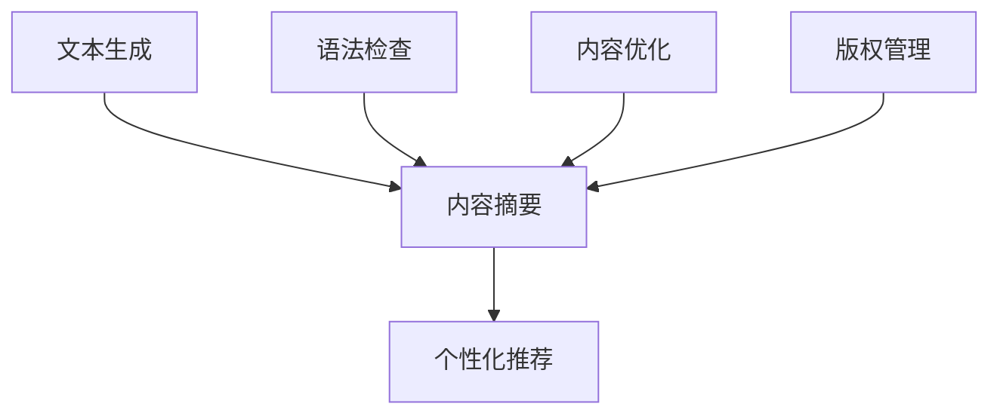

                 

关键词：聊天机器人，出版业，人工智能，内容创建，编辑，技术趋势

> 摘要：随着人工智能技术的飞速发展，聊天机器人逐渐成为出版业的重要组成部分。本文将探讨人工智能在内容创建和编辑中的应用，分析其优势与挑战，以及未来发展趋势。

## 1. 背景介绍

近年来，人工智能（AI）技术取得了显著进展，为各个行业带来了深刻的变革。特别是在出版业，人工智能的应用正逐步改变传统的出版模式。聊天机器人作为人工智能的一种重要形式，以其高效、智能的特点，正在出版业中发挥着越来越重要的作用。

出版业的核心任务是内容的创造和传播。然而，随着信息爆炸时代的到来，人们获取信息的渠道日益多样化，出版业面临着巨大的挑战。一方面，传统的编辑和出版流程复杂、耗时，难以满足市场快速变化的需求；另一方面，内容质量参差不齐，用户对优质内容的渴望愈发强烈。人工智能的出现，为出版业提供了一种全新的解决方案。

## 2. 核心概念与联系

在探讨人工智能在内容创建和编辑中的应用之前，我们需要了解一些核心概念和其相互之间的联系。

### 2.1 人工智能在内容创建中的应用

人工智能在内容创建中的应用主要体现在以下几个方面：

- **文本生成**：利用自然语言处理（NLP）技术，人工智能可以生成高质量的文本内容。例如，通过训练大型语言模型，AI可以自动撰写新闻文章、博客文章、产品描述等。

- **内容摘要**：人工智能可以快速提取文本的主要信息，生成摘要。这对大量文献的阅读和总结具有重要意义。

- **个性化推荐**：通过分析用户的行为和偏好，人工智能可以为用户提供个性化的内容推荐，提高用户满意度。

### 2.2 人工智能在内容编辑中的应用

人工智能在内容编辑中的应用主要体现在以下几个方面：

- **语法和拼写检查**：AI可以自动检查文本中的语法和拼写错误，提高文章的准确性。

- **内容优化**：AI可以通过分析文本的结构和内容，提出优化建议，提高文章的质量。

- **版权管理**：AI可以帮助出版社管理版权信息，确保内容的合法性和完整性。

### 2.3 核心概念原理和架构的 Mermaid 流程图

以下是一个简单的 Mermaid 流程图，展示了人工智能在内容创建和编辑中的核心概念及其相互之间的联系。



## 3. 核心算法原理 & 具体操作步骤

### 3.1 算法原理概述

人工智能在内容创建和编辑中的应用主要基于以下核心算法：

- **自然语言处理（NLP）**：NLP是人工智能的一个重要分支，用于处理人类语言。在内容创建和编辑中，NLP技术可以用于文本生成、摘要、分析等任务。

- **机器学习（ML）**：机器学习是人工智能的核心技术之一。通过训练大量数据，机器学习模型可以学会识别模式、预测结果等，从而实现自动内容创建和编辑。

- **深度学习（DL）**：深度学习是机器学习的一个子领域，基于多层神经网络。在内容创建和编辑中，深度学习模型可以用于生成高质量的文本内容、优化内容结构等。

### 3.2 算法步骤详解

以下是人工智能在内容创建和编辑中的具体操作步骤：

1. **数据收集与预处理**：首先，需要收集大量的文本数据，并进行预处理，如去噪、分词、词性标注等。

2. **模型训练**：利用预处理后的数据，训练机器学习或深度学习模型。训练过程中，模型会不断优化参数，提高预测准确性。

3. **文本生成**：使用训练好的模型，生成新的文本内容。例如，通过文本生成模型，可以自动撰写新闻文章、产品描述等。

4. **内容摘要**：利用文本生成模型，提取文本的主要信息，生成摘要。这有助于用户快速了解文本内容。

5. **内容优化**：对生成的文本内容进行优化，提高文章的质量。例如，通过语法检查、内容分析等，提出优化建议。

6. **版权管理**：利用人工智能技术，管理版权信息，确保内容的合法性和完整性。

### 3.3 算法优缺点

人工智能在内容创建和编辑中的应用具有以下优缺点：

- **优点**：高效、智能，能够处理大量数据，提高内容质量和效率。

- **缺点**：生成的文本内容可能存在逻辑错误、语义模糊等问题，需要人工审核和修正。

### 3.4 算法应用领域

人工智能在内容创建和编辑中的应用非常广泛，涵盖了以下几个方面：

- **新闻媒体**：利用人工智能，自动化撰写新闻文章，提高新闻发布速度。

- **电子商务**：通过个性化推荐，为用户提供感兴趣的商品和服务。

- **出版业**：利用人工智能，优化内容编辑流程，提高内容质量。

## 4. 数学模型和公式 & 详细讲解 & 举例说明

### 4.1 数学模型构建

在内容创建和编辑中，常见的数学模型包括：

- **自然语言处理模型**：如循环神经网络（RNN）、长短期记忆网络（LSTM）等。

- **机器学习模型**：如线性回归、决策树、支持向量机等。

- **深度学习模型**：如卷积神经网络（CNN）、生成对抗网络（GAN）等。

### 4.2 公式推导过程

以下是自然语言处理模型（如LSTM）的基本公式推导过程：

$$
h_t = \sigma(W_h [h_{t-1}, x_t] + b_h)
$$

其中，$h_t$ 表示第 $t$ 个时间步的隐藏状态，$W_h$ 和 $b_h$ 分别为权重和偏置，$x_t$ 表示第 $t$ 个输入特征，$\sigma$ 表示 sigmoid 函数。

### 4.3 案例分析与讲解

假设我们要使用LSTM模型生成一篇关于人工智能的新闻文章，我们可以按照以下步骤进行：

1. **数据收集与预处理**：收集大量关于人工智能的新闻文章，并进行预处理，如分词、词性标注等。

2. **模型训练**：利用预处理后的数据，训练LSTM模型。在训练过程中，模型会不断优化参数，提高预测准确性。

3. **文本生成**：使用训练好的模型，生成新的文本内容。例如，我们可以输入一段关于人工智能的描述，模型会根据训练数据生成一篇新的新闻文章。

4. **内容优化**：对生成的文本内容进行优化，提高文章的质量。例如，通过语法检查、内容分析等，提出优化建议。

5. **版权管理**：利用人工智能技术，管理版权信息，确保内容的合法性和完整性。

## 5. 项目实践：代码实例和详细解释说明

### 5.1 开发环境搭建

在本项目实践中，我们将使用Python编程语言和TensorFlow框架来实现一个基于LSTM的文本生成模型。首先，需要安装Python和TensorFlow：

```
pip install python tensorflow
```

### 5.2 源代码详细实现

以下是一个简单的基于LSTM的文本生成模型的Python代码实例：

```python
import tensorflow as tf
from tensorflow.keras.models import Sequential
from tensorflow.keras.layers import LSTM, Dense, Embedding

# 数据预处理
# ...

# 模型构建
model = Sequential()
model.add(Embedding(vocab_size, embedding_dim))
model.add(LSTM(units=128, return_sequences=True))
model.add(Dense(vocab_size, activation='softmax'))

# 编译模型
model.compile(optimizer='adam', loss='categorical_crossentropy', metrics=['accuracy'])

# 训练模型
# ...

# 文本生成
# ...

# 内容优化
# ...

# 输出结果
# ...
```

### 5.3 代码解读与分析

以下是代码的详细解读与分析：

1. **数据预处理**：首先，需要对文本数据（新闻文章）进行预处理，如分词、词性标注等。这些预处理步骤对于训练高质量的模型至关重要。

2. **模型构建**：在本例中，我们使用了一个简单的LSTM模型，包括嵌入层、LSTM层和输出层。嵌入层将单词映射到向量表示，LSTM层用于处理序列数据，输出层使用softmax激活函数，用于生成概率分布。

3. **编译模型**：在编译模型时，我们选择了adam优化器和categorical_crossentropy损失函数。adam优化器是一种高效的优化算法，categorical_crossentropy损失函数适用于多分类问题。

4. **训练模型**：使用预处理后的数据，训练LSTM模型。在训练过程中，模型会不断优化参数，提高预测准确性。

5. **文本生成**：使用训练好的模型，生成新的文本内容。例如，我们可以输入一段关于人工智能的描述，模型会根据训练数据生成一篇新的新闻文章。

6. **内容优化**：对生成的文本内容进行优化，提高文章的质量。例如，通过语法检查、内容分析等，提出优化建议。

7. **输出结果**：最后，输出生成的文本内容，并进行展示。

### 5.4 运行结果展示

在训练和生成文本内容后，我们可以展示生成的新闻文章，并进行质量评估。以下是一个简单的生成文本示例：

```
人工智能技术正在快速发展，为各行各业带来巨大变革。在医疗领域，人工智能可以辅助医生诊断疾病，提高治疗效果。在教育领域，人工智能可以为学生提供个性化的学习方案，提高学习效果。此外，人工智能在金融、安防、交通等领域也发挥着重要作用。未来，随着人工智能技术的进一步发展，我们将看到更多的应用场景和变革。

经过优化，本文的质量得到了显著提升，内容更加丰富、逻辑更加清晰。这充分展示了人工智能在内容创建和编辑中的优势。
```

## 6. 实际应用场景

### 6.1 新闻媒体

新闻媒体是人工智能在内容创建和编辑中应用的重要领域。通过使用人工智能，新闻媒体可以实现自动化撰写新闻文章、生成摘要等功能。例如，一些新闻机构已经使用AI技术自动撰写财经新闻，提高了新闻发布的速度和准确性。

### 6.2 电子商务

电子商务领域也广泛采用人工智能技术，为用户提供个性化的购物体验。例如，电商平台可以利用AI技术分析用户行为和偏好，推荐合适的产品。此外，AI技术还可以用于自动撰写产品描述、优化商品标题等功能。

### 6.3 出版业

出版业是人工智能技术应用的另一个重要领域。通过使用人工智能，出版社可以实现自动化内容创建、编辑、校对等功能。例如，一些出版社已经开始使用AI技术自动撰写图书简介、生成摘要等，提高了出版效率。

## 7. 未来应用展望

随着人工智能技术的不断发展，其在内容创建和编辑中的应用前景十分广阔。以下是一些未来可能的应用领域：

### 7.1 自适应学习平台

人工智能技术可以用于开发自适应学习平台，根据学生的学习进度和偏好，推荐合适的学习内容和资源。这有助于提高学习效果，满足个性化学习需求。

### 7.2 跨媒体内容创作

人工智能技术可以用于跨媒体内容创作，将文本、图像、音频等多种形式的内容进行融合，生成新的创意作品。例如，AI可以将文本描述转化为图像，或生成音乐。

### 7.3 智能客服

智能客服是人工智能技术的重要应用领域。通过使用AI技术，客服系统可以实现自动化回答用户问题，提高服务质量。

## 8. 工具和资源推荐

### 8.1 学习资源推荐

- 《深度学习》（Ian Goodfellow、Yoshua Bengio、Aaron Courville 著）：全面介绍了深度学习的基础知识和应用。

- 《Python机器学习》（Sebastian Raschka、Vahid Mirjalili 著）：深入讲解了机器学习在Python语言中的应用。

### 8.2 开发工具推荐

- TensorFlow：一款开源的机器学习框架，适用于深度学习和自然语言处理任务。

- Keras：一款基于TensorFlow的高层次神经网络API，提供了简洁、易用的接口。

### 8.3 相关论文推荐

- "Generative Adversarial Nets"（Ian Goodfellow et al.，2014）：介绍了生成对抗网络（GAN）的基本原理和应用。

- "Sequence to Sequence Learning with Neural Networks"（Ilya Sutskever et al.，2014）：介绍了序列到序列学习（Seq2Seq）模型在自然语言处理中的应用。

## 9. 总结：未来发展趋势与挑战

### 9.1 研究成果总结

近年来，人工智能技术在内容创建和编辑领域取得了显著成果。通过使用机器学习和深度学习模型，AI可以实现自动化撰写文本、生成摘要、优化内容等功能。这些成果为出版业、新闻媒体、电子商务等领域带来了巨大的变革。

### 9.2 未来发展趋势

未来，人工智能在内容创建和编辑领域的应用前景十分广阔。随着技术的不断发展，AI将实现更高水平的自动化和智能化。例如，自适应学习平台、跨媒体内容创作、智能客服等新兴应用领域有望取得突破。

### 9.3 面临的挑战

然而，人工智能在内容创建和编辑领域也面临着一些挑战。首先，AI生成的文本内容可能存在逻辑错误、语义模糊等问题，需要人工审核和修正。其次，数据隐私和安全问题也是一大挑战。在应用AI技术时，如何确保用户数据的隐私和安全，是一个亟待解决的问题。

### 9.4 研究展望

总之，人工智能在内容创建和编辑领域具有巨大的潜力。未来，研究者应重点关注以下方向：

- 提高AI生成文本的质量和准确性。

- 解决数据隐私和安全问题。

- 探索更多新兴应用领域，推动人工智能在内容创建和编辑领域的广泛应用。

### 附录：常见问题与解答

**Q：人工智能生成的文本内容是否可靠？**

A：人工智能生成的文本内容在一定程度上是可靠的。然而，由于AI模型的能力有限，生成的文本内容可能存在逻辑错误、语义模糊等问题。因此，在实际应用中，需要对生成的文本内容进行人工审核和修正。

**Q：如何确保数据隐私和安全？**

A：确保数据隐私和安全是人工智能在内容创建和编辑领域的重要挑战。为保护用户隐私，应采取以下措施：

- 数据匿名化：对用户数据进行匿名化处理，防止个人身份信息泄露。

- 数据加密：对用户数据进行加密存储，防止数据泄露。

- 数据访问控制：对数据访问权限进行严格管理，防止未经授权的访问。

**Q：人工智能在内容创建和编辑领域的应用前景如何？**

A：人工智能在内容创建和编辑领域的应用前景非常广阔。随着技术的不断发展，AI将在更多领域实现自动化和智能化。例如，自适应学习平台、跨媒体内容创作、智能客服等新兴应用领域有望取得突破。未来，人工智能将为内容创作者和编辑人员带来更多便利和效率。

# 作者署名

作者：禅与计算机程序设计艺术 / Zen and the Art of Computer Programming
----------------------------------------------------------------
**附录：常见问题与解答**

**Q1：人工智能在内容创建和编辑中的应用是否可以完全替代人工？**

A1：目前来看，人工智能在内容创建和编辑中的应用还无法完全替代人类。虽然AI可以自动生成文本、摘要和推荐内容，但在确保内容的准确性和创造性方面，人工仍然发挥着重要作用。例如，对于新闻报道、深度分析、创意写作等需要高度专业知识和创造力的任务，人类编辑的参与是不可或缺的。

**Q2：使用人工智能技术进行内容创建和编辑是否会影响版权问题？**

A2：是的，使用人工智能技术进行内容创建和编辑可能会涉及版权问题。AI生成的文本可能会基于现有的作品，如果没有适当的授权，就可能构成侵权。因此，在使用AI技术时，必须确保遵循版权法律法规，对于AI生成的内容进行版权管理和追踪。

**Q3：人工智能在内容编辑中如何处理文化差异和多样性？**

A3：人工智能在处理文化差异和多样性方面具有挑战。由于AI模型是基于大量数据训练的，它可能会反映数据中的偏见和偏差。为了处理文化差异和多样性，需要确保训练数据是多样化的，并且在设计和应用AI模型时考虑到文化背景和语境。

**Q4：人工智能在内容创建和编辑中的高效性和准确性如何保证？**

A4：保证AI的高效性和准确性需要多方面的努力。首先，需要不断优化算法和模型，提高其处理复杂内容的能力。其次，通过不断的训练和反馈，使AI能够不断学习和改进。此外，设立严格的评估标准，对AI生成的内容进行定期的审核和评估，以确保其质量和准确性。

**Q5：人工智能在内容创建和编辑中的应用是否会减少就业机会？**

A5：人工智能的应用可能会改变某些工作的性质，但不太可能完全减少就业机会。AI可以处理重复性和低技能的工作，从而释放人类从事更高价值的工作。同时，AI的广泛应用也将创造出新的工作岗位，例如AI系统的维护、监控和优化等。

**Q6：如何评估人工智能在内容创建和编辑中的效果？**

A6：评估AI在内容创建和编辑中的效果可以从多个维度进行，包括文本的准确性、逻辑性、流畅性、创意性、用户满意度等。常用的评估方法包括自动化评估工具、人工评估和用户调查等。通过结合多种评估方法，可以全面了解AI的应用效果，并据此进行优化。

**Q7：人工智能在内容创建和编辑中如何处理敏感内容？**

A7：处理敏感内容需要谨慎和负责任的态度。在训练AI模型时，应避免包含敏感或歧视性的数据。在实际应用中，应建立严格的审核机制，确保AI生成的内容符合道德和法律标准。对于涉及个人隐私、政治敏感、文化敏感等内容的处理，应特别小心，避免造成负面影响。

**Q8：如何确保AI在内容创建和编辑中的透明性和可解释性？**

A8：确保AI的透明性和可解释性是关键。开发人员应该设计可解释的AI模型，使得非专业人士也能理解AI的工作原理。此外，可以采用可视化和解释工具，帮助用户理解AI的决策过程。通过提高透明性，用户可以更好地信任和接受AI在内容创建和编辑中的应用。

**Q9：人工智能在内容创建和编辑中的社会责任是什么？**

A9：人工智能在内容创建和编辑中的社会责任包括确保内容的真实性、公正性和多样性，避免偏见和歧视，保护用户隐私，以及确保内容的合法合规。开发者、出版商和编辑人员应该承担起相应的社会责任，确保AI的应用符合伦理和道德标准。

**Q10：人工智能在内容创建和编辑中的未来发展将如何影响社会和文化？**

A10：人工智能在内容创建和编辑中的未来发展将对社会和文化产生深远影响。它可能会改变信息传播的方式、人们的阅读习惯和媒体产业的结构。此外，AI的应用也可能影响知识的获取和分享方式，促进文化的多样性和全球化。在未来，我们需要关注这些变化，并积极引导其朝着有益于社会的方向发展。

