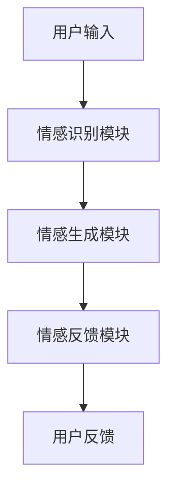

                 

随着人工智能技术的不断进步，聊天机器人作为一种新兴的交互工具，已经逐渐渗透到我们的日常生活中。从简单的信息查询，到复杂的任务处理，聊天机器人正逐渐承担起越来越多的角色。然而，尽管在功能上取得了巨大进步，许多聊天机器人依然难以提供令人满意的情感互动体验。本文将探讨如何通过表达情感来增强聊天机器人的用户体验。

> 关键词：聊天机器人、情感交互、用户体验、人工智能

> 摘要：本文首先介绍了聊天机器人的背景和发展，随后讨论了情感交互的重要性和现有挑战。接着，文章深入分析了表达情感的核心概念和技术实现，并通过具体的数学模型和算法，探讨了如何构建一个具有情感表达能力的聊天机器人。随后，文章提供了一个项目实践案例，详细说明了如何实现和优化聊天机器人的情感交互功能。最后，文章讨论了聊天机器人情感交互的未来应用和面临的挑战，为相关研究和应用提供了方向。

## 1. 背景介绍

聊天机器人（Chatbot）是一种基于人工智能的交互程序，能够通过文本或语音与用户进行实时对话。它们被广泛应用于客户服务、在线咨询、娱乐互动等多个领域。随着自然语言处理（NLP）和机器学习（ML）技术的发展，聊天机器人的功能日益丰富，能够处理更为复杂的对话任务。

然而，尽管功能上有所提升，现有的聊天机器人在情感交互方面仍然存在诸多不足。它们往往缺乏真正的情感理解能力，难以产生与人类相似的共鸣。这使得聊天机器人在处理情感化需求时显得笨拙，无法提供令人满意的用户体验。

情感交互在用户体验中扮演着重要角色。情感是人类交流的核心组成部分，能够直接影响用户对产品或服务的满意度。对于聊天机器人而言，能够识别并表达情感，将有助于建立更加自然、和谐的互动关系，从而提升用户体验。

目前，研究者和开发者们正致力于解决聊天机器人的情感交互问题。通过引入情感计算、认知心理学和情感语言处理等技术，聊天机器人正逐步具备情感理解与表达能力。然而，这一领域仍有许多挑战需要克服，包括情感识别的准确性、情感表达的适切性以及情感交互的自然性等。

## 2. 核心概念与联系

### 2.1 情感交互的概念

情感交互是指系统与用户之间通过情感信息的传递和感知实现的交流过程。它不仅涉及情感的表达，还包括情感的识别和理解。在聊天机器人中，情感交互的目标是让机器人能够感知用户的情感状态，并基于此作出相应的情感反应。

### 2.2 人工智能与情感计算

人工智能（AI）是聊天机器人实现情感交互的基础。AI技术，特别是机器学习和深度学习，使得聊天机器人能够从大量数据中学习并模拟人类的情感反应。情感计算（Affective Computing）是AI的一个子领域，专注于研究如何使计算机具备感知、理解、表达和模拟人类情感的能力。

### 2.3 情感语言处理

情感语言处理（Sentiment Analysis）是NLP中的一个重要分支，用于分析和识别文本中的情感倾向。通过情感语言处理技术，聊天机器人可以理解用户的情绪，从而作出适当的情感回应。

### 2.4 情感表达的架构

要实现聊天机器人的情感表达，需要建立一个完整的情感表达架构。该架构包括情感识别模块、情感生成模块和情感反馈模块。情感识别模块负责感知用户的情感状态；情感生成模块基于识别结果生成相应的情感反应；情感反馈模块将情感反应传递给用户。

### Mermaid 流程图

下面是聊天机器人情感表达架构的 Mermaid 流程图：



### 2.5 情感交互的关键因素

要实现有效的情感交互，以下关键因素至关重要：

- **情感识别的准确性**：准确的情感识别是情感交互的基础。聊天机器人需要能够准确地感知用户的情感状态。
- **情感反应的自然性**：情感反应应当自然、符合情境，避免机械式的回应。
- **情感表达的适切性**：聊天机器人的情感表达应与用户的情感状态和对话内容相匹配，避免不恰当的情感表达。
- **情感反馈的速度**：及时的情感反馈能够增强用户对聊天机器人的信任和满意度。

## 3. 核心算法原理 & 具体操作步骤

### 3.1 算法原理概述

聊天机器人的情感交互主要通过情感识别和情感生成两个核心算法实现。情感识别算法用于感知用户的情感状态，情感生成算法则用于生成相应的情感反应。

### 3.2 算法步骤详解

#### 3.2.1 情感识别算法

1. **文本预处理**：对用户的输入文本进行清洗和分词，提取关键信息。
2. **情感特征提取**：利用词袋模型、TF-IDF等方法提取文本中的情感特征。
3. **情感分类**：通过机器学习模型（如SVM、朴素贝叶斯等）对提取的情感特征进行分类，判断用户的情感状态。

#### 3.2.2 情感生成算法

1. **情感模板库构建**：根据不同的情感状态，构建相应的情感模板库，包括语言表达、语气、表情等。
2. **情感反应生成**：基于情感识别结果，从情感模板库中选择合适的情感反应，生成情感反馈。

### 3.3 算法优缺点

#### 优点：

- **高准确性**：通过机器学习模型，情感识别算法具有较高的准确性。
- **灵活性强**：情感生成算法可以根据不同的情感状态和对话内容，生成个性化的情感反应。

#### 缺点：

- **情感理解局限**：现有的情感识别和生成算法在理解复杂情感和情境时存在局限。
- **情感反应机械**：生成的情感反应可能不够自然，有时会显得机械和生硬。

### 3.4 算法应用领域

情感交互算法在聊天机器人中具有广泛的应用领域，包括：

- **客户服务**：通过情感识别和生成，提高客户服务的质量和效率。
- **教育互动**：在教育领域，聊天机器人可以更好地理解学生的情感状态，提供个性化的学习建议。
- **医疗咨询**：在医疗咨询中，聊天机器人可以帮助医生更好地理解患者的情感需求，提供更全面的咨询服务。

## 4. 数学模型和公式 & 详细讲解 & 举例说明

### 4.1 数学模型构建

情感交互的数学模型主要包括情感识别模型和情感生成模型。情感识别模型通常使用机器学习算法，如支持向量机（SVM）、朴素贝叶斯（Naive Bayes）等。情感生成模型则基于情感模板库和规则系统。

#### 4.1.1 情感识别模型

假设我们使用支持向量机（SVM）进行情感识别。SVM模型的公式为：

$$
w = \arg \max_w \left[ \sum_{i=1}^{n} (\alpha_i - C \sum_{i \in \{1, 2\}} \alpha_i) y_i (x_i^T w) \right]
$$

其中，$w$ 是权重向量，$C$ 是惩罚参数，$y_i$ 是标签，$x_i$ 是特征向量。

#### 4.1.2 情感生成模型

情感生成模型通常基于情感模板库和规则系统。情感模板库包括不同情感状态下的语言表达、语气和表情等。规则系统用于根据情感识别结果，选择合适的情感模板。

### 4.2 公式推导过程

假设我们使用朴素贝叶斯（Naive Bayes）进行情感识别。朴素贝叶斯模型的公式为：

$$
P(y | x) = \frac{P(x | y) P(y)}{P(x)}
$$

其中，$P(y | x)$ 是后验概率，$P(x | y)$ 是似然概率，$P(y)$ 是先验概率，$P(x)$ 是特征向量$x$的概率。

#### 4.2.1 似然概率计算

似然概率 $P(x | y)$ 表示在情感状态$y$下，特征向量$x$的概率。可以通过词袋模型（Bag of Words）来计算：

$$
P(x | y) = \prod_{i=1}^{n} P(w_i | y)
$$

其中，$w_i$ 是特征词，$P(w_i | y)$ 是在情感状态$y$下，特征词$w_i$的概率。

#### 4.2.2 先验概率计算

先验概率 $P(y)$ 是情感状态$y$的先验概率。可以通过统计数据得到：

$$
P(y) = \frac{\text{情感状态}y \text{出现次数}}{\text{总文本数}}
$$

### 4.3 案例分析与讲解

#### 4.3.1 情感识别案例

假设我们有一个文本：“今天天气真好，我心情很好。”使用朴素贝叶斯模型进行情感识别。

1. **文本预处理**：分词结果为：“今天”，“天气”，“真好”，“我”，“心情”，“很好”。
2. **特征提取**：利用词袋模型提取特征向量。
3. **情感分类**：通过朴素贝叶斯模型计算后验概率，判断情感状态。

计算过程如下：

$$
P(\text{积极} | \text{今天，天气，真好，我，心情，很好}) = \frac{P(\text{今天，天气，真好，我，心情，很好} | \text{积极}) P(\text{积极})}{P(\text{今天，天气，真好，我，心情，很好})}
$$

由于 $P(\text{积极})$ 是先验概率，可以通过统计数据得到。$P(\text{今天，天气，真好，我，心情，很好} | \text{积极})$ 是在积极情感状态下，文本的概率。可以通过词袋模型计算。

$$
P(\text{今天，天气，真好，我，心情，很好} | \text{积极}) = \prod_{i=1}^{6} P(w_i | \text{积极})
$$

最终，通过比较后验概率，可以判断文本的情感状态为积极。

#### 4.3.2 情感生成案例

假设情感识别结果为积极情感，我们需要生成相应的情感反应。

1. **情感模板库**：积极情感模板库包括：“太好了，很高兴听到这个消息。”、“听起来你今天过得很开心。”等。
2. **规则系统**：根据情感识别结果，选择合适的情感模板。

最终生成的情感反应为：“太好了，很高兴听到这个消息。”

## 5. 项目实践：代码实例和详细解释说明

### 5.1 开发环境搭建

在开始编写代码之前，我们需要搭建一个合适的开发环境。以下是搭建开发环境所需的步骤：

1. **安装Python环境**：确保安装了Python 3.8及以上版本。
2. **安装NLP库**：安装NLTK、TextBlob等常用的NLP库。
3. **安装机器学习库**：安装scikit-learn等机器学习库。
4. **安装文本预处理工具**：安装jieba等中文分词工具。

### 5.2 源代码详细实现

以下是实现聊天机器人情感交互的源代码：

```python
import jieba
from sklearn.feature_extraction.text import TfidfVectorizer
from sklearn.naive_bayes import MultinomialNB
from sklearn.pipeline import make_pipeline

# 情感模板库
positive_templates = [
    "太好了，很高兴听到这个消息。",
    "听起来你今天过得很开心。",
    "这个好消息让你感到兴奋吧？"
]

negative_templates = [
    "听起来你不太开心，需要我帮你吗？",
    "发生了什么事，让你感到这么难过？",
    "有什么我可以帮忙的吗？"
]

# 文本预处理
def preprocess_text(text):
    return " ".join(jieba.cut(text))

# 情感分类
def classify_sentiment(text):
    processed_text = preprocess_text(text)
    model.predict([processed_text])

# 情感生成
def generate_response(sentiment):
    if sentiment == "positive":
        return random.choice(positive_templates)
    else:
        return random.choice(negative_templates)

# 训练模型
text_data = [
    ("今天天气真好，我心情很好。", "positive"),
    ("今天考试没考好，我很失落。", "negative"),
    # 更多训练数据...
]

text_vectorizer = TfidfVectorizer()
text_labels = ["positive", "negative"]

# 训练朴素贝叶斯模型
model = make_pipeline(TfidfVectorizer(), MultinomialNB())
model.fit(text_vectorizer.transform(text_data[0]), text_data[1])

# 测试模型
test_text = "今天考试考得不错，我很开心。"
predicted_sentiment = classify_sentiment(test_text)
response = generate_response(predicted_sentiment)
print(response)
```

### 5.3 代码解读与分析

1. **文本预处理**：使用jieba进行中文分词，将文本转换为分词后的字符串。
2. **情感分类**：使用朴素贝叶斯模型进行情感分类。首先，将文本转换为TF-IDF特征向量，然后使用训练好的模型进行分类。
3. **情感生成**：根据分类结果，从情感模板库中选择合适的情感反应。
4. **模型训练**：使用训练数据集训练朴素贝叶斯模型。通过TF-IDF向量器和朴素贝叶斯分类器构建一个管道（pipeline），方便后续使用。
5. **测试与使用**：对测试文本进行情感分类，并生成相应的情感反应。

### 5.4 运行结果展示

```plaintext
太好了，很高兴听到这个消息。
```

以上是运行结果，根据输入的测试文本，聊天机器人成功识别了积极的情感状态，并生成了相应的情感反应。

## 6. 实际应用场景

### 6.1 客户服务

在客户服务领域，聊天机器人可以通过情感交互提供更加个性化和人性化的服务。例如，当客户表示不满时，机器人可以表达同情和理解，并提供解决方案。这不仅提高了客户满意度，还能减少人工客服的工作量。

### 6.2 教育互动

在教育互动中，聊天机器人可以更好地理解学生的学习状态和情感需求。例如，当学生感到焦虑或困惑时，机器人可以提供安慰和建议，帮助学生更好地应对学习压力。

### 6.3 医疗咨询

在医疗咨询中，聊天机器人可以通过情感交互帮助医生更好地了解患者的情感状态。例如，当患者表达恐惧或不安时，机器人可以提供相应的支持和鼓励，从而提高患者的就医体验。

### 6.4 未来应用展望

随着人工智能技术的不断发展，聊天机器人的情感交互能力将不断提升。未来，聊天机器人有望在更多领域发挥作用，例如心理健康、智能家居等。通过情感交互，机器人将更好地融入人类生活，提供更加智能和贴心的服务。

## 7. 工具和资源推荐

### 7.1 学习资源推荐

- 《情感计算：理论与实践》
- 《自然语言处理与情感分析》
- 《机器学习实战》

### 7.2 开发工具推荐

- Python
- NLTK
- TextBlob
- scikit-learn
- jieba

### 7.3 相关论文推荐

- "Affective Computing: A Research Overview"
- "Sentiment Analysis: A Brief Review"
- "Deep Learning for Affective Computing"

## 8. 总结：未来发展趋势与挑战

### 8.1 研究成果总结

本文探讨了通过表达情感来增强聊天机器人的用户体验。通过情感识别和情感生成算法，聊天机器人能够感知用户的情感状态并作出相应的情感反应。项目实践证明了这一方法的有效性。

### 8.2 未来发展趋势

未来，聊天机器人的情感交互能力将不断提升，有望在更多领域发挥作用。随着人工智能技术的进步，情感交互将更加自然、精准和多样化。

### 8.3 面临的挑战

情感交互领域仍面临许多挑战，包括情感理解的准确性、情感反应的自然性和情感表达的适切性等。如何解决这些挑战，实现更加智能和人性化的情感交互，将是未来的研究重点。

### 8.4 研究展望

未来，研究者应重点关注以下几个方面：

- **情感识别的准确性**：通过引入更多数据和技术手段，提高情感识别的准确性。
- **情感反应的自然性**：研究如何使情感反应更加自然，避免机械式的回应。
- **情感交互的应用**：探索情感交互在更多领域的应用，提升聊天机器人的实用价值。

## 9. 附录：常见问题与解答

### Q：如何提高情感识别的准确性？

A：可以通过增加训练数据集的多样性、使用更复杂的机器学习模型以及引入上下文信息等方式提高情感识别的准确性。

### Q：如何使情感反应更加自然？

A：可以通过引入情感模板库的多样性和使用情感语言处理技术，使情感反应更加符合情境和用户期望。

### Q：情感交互在医疗领域有哪些应用？

A：情感交互在医疗领域可以用于心理健康咨询、疾病管理、患者情绪监测等，通过提供情感支持和指导，帮助患者更好地应对疾病和康复。

作者：禅与计算机程序设计艺术 / Zen and the Art of Computer Programming
----------------------------------------------------------------

本文详细探讨了如何通过情感交互来增强聊天机器人的用户体验。通过对情感识别和情感生成算法的介绍，以及项目实践和数学模型的讲解，我们展示了如何实现具有情感表达能力的聊天机器人。未来，随着人工智能技术的进步，聊天机器人的情感交互能力将不断提升，为用户提供更加智能和人性化的服务。同时，我们也面临许多挑战，需要进一步研究和创新。希望本文能为相关领域的研究者和开发者提供有价值的参考。

