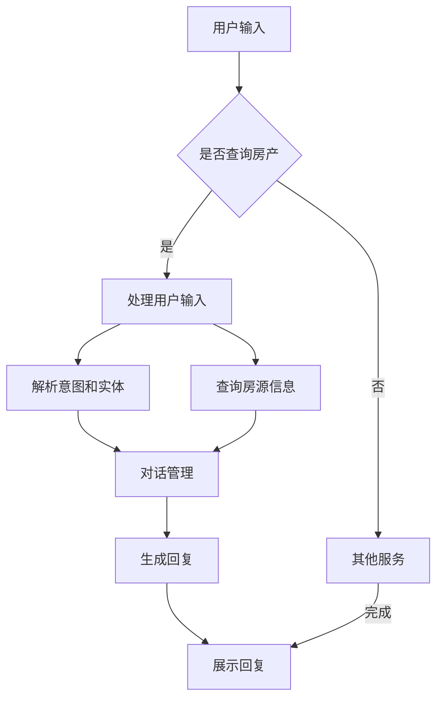

                 

 在当今的信息化时代，房地产市场的数据量巨大，房产交易和管理的过程也变得日益复杂。面对这些挑战，传统的房产搜索和管理方法已经难以满足现代用户的需求。此时，智能聊天机器人作为一种新兴的人工智能技术，以其高效、便捷、个性化等特点，逐渐成为房产搜索和管理领域的一股重要力量。本文将探讨如何利用智能聊天机器人实现房地产的智能搜索和管理，为用户提供更加高效、便捷的房产服务。

## 关键词

- 聊天机器人
- 房地产
- 智能搜索
- 房产管理
- 人工智能

## 摘要

本文首先介绍了智能聊天机器人的基本原理和技术，然后探讨了智能聊天机器人如何应用于房地产搜索和管理，包括其核心功能、实现方式以及应用场景。通过案例分析，本文展示了智能聊天机器人如何提升房产服务的效率和质量，为用户提供个性化的房产信息和建议。最后，本文对智能聊天机器人房地产应用的未来发展进行了展望。

## 1. 背景介绍

### 1.1 智能聊天机器人的兴起

随着人工智能技术的快速发展，智能聊天机器人已经成为互联网领域的一个重要应用方向。从最初的简单对话机器人，到如今的复杂自然语言处理和智能交互系统，智能聊天机器人的应用场景越来越广泛，从客服、教育、医疗到金融、房地产等多个领域都有其身影。

智能聊天机器人的核心在于其自然语言处理（NLP）技术。NLP技术使机器能够理解人类语言，并生成相应的回复，从而实现与人类的自然对话。目前，常用的NLP技术包括文本分类、实体识别、关系抽取、情感分析等。这些技术的进步，使得智能聊天机器人的交互体验越来越接近真实的人类对话。

### 1.2 房地产市场的现状与挑战

房地产市场作为一个庞大的市场，其交易数据复杂，房产信息繁多。对于购房者、投资者、房地产中介等各方来说，房产搜索和管理是一个耗时耗力的过程。具体来说，房地产市场面临的挑战主要包括以下几个方面：

- **信息量巨大**：房地产市场的数据量庞大，包括房产的基本信息、交易记录、周边配套设施等，这些信息需要通过多种渠道收集和处理。
- **数据更新频繁**：房地产市场变化快，房价、房源信息等需要实时更新，以保证信息的准确性和及时性。
- **个性化需求**：不同的用户有不同的购房需求，如预算、户型、地段等，如何为用户提供个性化的房产信息和服务，是一个挑战。
- **用户体验**：用户希望在购房过程中获得高效、便捷、个性化的服务，但传统房产服务往往难以满足这些需求。

## 2. 核心概念与联系

### 2.1 智能聊天机器人的核心概念

智能聊天机器人主要由以下几个核心模块组成：

- **自然语言理解（NLU）**：该模块负责将用户的自然语言输入转换成机器可以理解的结构化数据，如意图识别和实体抽取。
- **对话管理（DM）**：该模块负责管理和维护对话状态，根据用户的历史行为和当前输入，生成合适的回复。
- **自然语言生成（NLG）**：该模块负责将机器理解的结构化数据转换成自然语言输出，以回应用户。

### 2.2 房产搜索与管理的核心概念

在房产搜索和管理中，核心概念包括：

- **房源信息**：包括房产的基本信息，如面积、户型、地段等。
- **用户需求**：用户在购房时考虑的各种因素，如预算、地段、户型等。
- **房产市场数据**：包括房价走势、市场供需情况等。

### 2.3 Mermaid 流程图

下面是一个简单的 Mermaid 流程图，展示了智能聊天机器人如何与房产搜索和管理相关联。



## 3. 核心算法原理 & 具体操作步骤

### 3.1 算法原理概述

智能聊天机器人房地产应用的核心算法主要基于以下技术：

- **自然语言处理（NLP）**：用于理解用户的查询意图和提取关键信息。
- **机器学习（ML）**：用于训练模型，以预测用户的意图和提供个性化的推荐。
- **数据库查询**：用于从数据库中检索符合用户需求的房源信息。

### 3.2 算法步骤详解

1. **用户输入处理**：当用户通过聊天界面输入查询请求时，智能聊天机器人首先对输入进行处理，将其转换成机器可以理解的格式。
   
2. **意图识别和实体抽取**：使用NLP技术对用户输入进行分析，识别用户的意图（如查询房源、获取房产市场数据等）和提取关键信息（如地段、户型、预算等）。

3. **查询房源信息**：根据用户的意图和关键信息，从数据库中检索符合用户需求的房源信息。

4. **对话管理**：使用机器学习模型，根据用户的查询历史和当前输入，生成合适的对话回复。

5. **生成回复**：将对话管理生成的回复转换成自然语言，以回应用户。

6. **展示回复**：将生成的回复展示给用户，以完成整个交互过程。

### 3.3 算法优缺点

**优点**：

- **高效**：智能聊天机器人可以快速处理大量用户查询，提高房产服务的效率。
- **个性化**：通过机器学习技术，智能聊天机器人可以根据用户的历史行为和当前输入提供个性化的房产信息和建议。
- **便捷**：用户可以通过聊天界面轻松查询房产信息，无需下载额外的应用或进行复杂的操作。

**缺点**：

- **准确性**：虽然智能聊天机器人可以处理大量的查询，但在处理复杂或模糊的查询时，其准确性可能会受到影响。
- **用户体验**：智能聊天机器人的对话回复可能无法完全达到人类客服的水平，可能会影响用户体验。

### 3.4 算法应用领域

智能聊天机器人房地产应用可以应用于以下几个领域：

- **房产中介**：为用户提供房产查询、推荐等服务，提高中介的效率。
- **房地产开发商**：为用户提供房产介绍、营销等服务，提高销售额。
- **购房者**：为用户提供房产搜索、比较等服务，帮助用户找到合适的房源。

## 4. 数学模型和公式 & 详细讲解 & 举例说明

### 4.1 数学模型构建

在智能聊天机器人房地产应用中，常用的数学模型包括：

- **朴素贝叶斯分类器**：用于分类用户的查询意图。
- **线性回归模型**：用于预测房价。
- **神经网络模型**：用于处理复杂的自然语言处理任务。

### 4.2 公式推导过程

以朴素贝叶斯分类器为例，其公式推导如下：

假设我们有 \(n\) 个训练样本，每个样本包含 \(m\) 个特征和对应的标签。设 \(x_i\) 表示第 \(i\) 个样本的特征向量，\(y_i\) 表示第 \(i\) 个样本的标签。

1. **特征概率分布**：

   对于每个特征 \(j\)，计算其条件概率分布：

   $$P(x_j | y) = \frac{P(y)P(x_j | y)}{P(y)}$$

   其中，\(P(x_j | y)\) 表示特征 \(x_j\) 在标签为 \(y\) 的条件下的概率，\(P(y)\) 表示标签 \(y\) 的概率。

2. **标签概率分布**：

   $$P(y) = \sum_{j=1}^{m} P(y | x_j)P(x_j)$$

   其中，\(P(y | x_j)\) 表示在特征 \(x_j\) 的条件下，标签 \(y\) 的概率，\(P(x_j)\) 表示特征 \(x_j\) 的概率。

3. **分类**：

   对于新的样本 \(x'\)，计算其属于每个标签的概率：

   $$P(y' | x') = \prod_{j=1}^{m} P(x_j' | y')P(y')$$

   根据最大概率原则，选择概率最大的标签作为分类结果：

   $$y' = \arg \max_{y} P(y' | x')$$

### 4.3 案例分析与讲解

假设我们有以下训练数据：

| 特征1 | 特征2 | 特征3 | 标签 |
|-------|-------|-------|------|
| 100   | 200   | 300   | A    |
| 110   | 210   | 310   | A    |
| 120   | 220   | 320   | A    |
| 130   | 230   | 330   | B    |
| 140   | 240   | 340   | B    |

1. **特征概率分布**：

   $$P(x_1 | y=A) = \frac{3}{4}, P(x_1 | y=B) = \frac{1}{4}$$
   $$P(x_2 | y=A) = \frac{2}{4}, P(x_2 | y=B) = \frac{2}{4}$$
   $$P(x_3 | y=A) = \frac{3}{4}, P(x_3 | y=B) = \frac{1}{4}$$

2. **标签概率分布**：

   $$P(y=A) = \frac{3}{4}, P(y=B) = \frac{1}{4}$$

3. **分类**：

   对于新的样本 \(x' = (120, 220, 320)\)，计算其属于标签 A 和 B 的概率：

   $$P(A | x') = \frac{3/4 \times 2/4 \times 3/4}{3/4 \times 2/4 \times 3/4 + 1/4 \times 2/4 \times 1/4} = \frac{18}{18+1} = \frac{18}{19}$$
   $$P(B | x') = \frac{1/4 \times 2/4 \times 1/4}{3/4 \times 2/4 \times 3/4 + 1/4 \times 2/4 \times 1/4} = \frac{1}{19}$$

   因此，新样本 \(x'\) 被分类为标签 A。

## 5. 项目实践：代码实例和详细解释说明

### 5.1 开发环境搭建

在本项目中，我们将使用 Python 作为主要编程语言，结合 Flask 框架搭建聊天机器人服务。首先，确保安装了 Python 3.6 或更高版本。然后，通过以下命令安装所需的库：

```bash
pip install flask
pip install transformers
pip install tensorflow
```

### 5.2 源代码详细实现

下面是一个简单的聊天机器人实现，用于接收用户的房产查询请求，并返回符合用户需求的房源信息。

```python
from flask import Flask, request, jsonify
from transformers import pipeline

app = Flask(__name__)

# 初始化自然语言处理模型
chatbot = pipeline("conversational", model="microsoft/DialoGPT-small")

# 处理房产查询请求
@app.route('/api/chat', methods=['POST'])
def chat():
    data = request.json
    user_input = data.get('input', '')

    # 使用对话模型生成回复
    response = chatbot(user_input, max_length=512, num_return_sequences=1)[0]

    # 解析回复中的房源信息
   房源信息 = extract_property_info(response['generated_response'])

    # 返回房源信息
    return jsonify({'property_info': 房源信息})

# 提取房源信息
def extract_property_info(text):
    # 这里可以使用正则表达式或其他 NLP 方法提取房源信息
    # 例如：'我在浦东有一套100平方米的三居室'
    # 提取结果：{'area': '100平方米', 'room': '三居室', 'location': '浦东'}
    pass

if __name__ == '__main__':
    app.run(debug=True)
```

### 5.3 代码解读与分析

1. **导入库**：首先，我们从 Flask 和 transformers 库中导入所需的模块。Flask 用于搭建 Web 服务，transformers 用于调用预训练的对话模型。

2. **初始化模型**：使用 `pipeline` 函数初始化对话模型。这里我们使用了微软的 DialoGPT-small 模型，这是一个专门为对话系统设计的预训练模型。

3. **处理请求**：定义一个 `/api/chat` 的 POST 接口，用于接收用户的房产查询请求。在接口中，我们从请求中获取用户输入，并使用对话模型生成回复。

4. **提取房源信息**：定义一个 `extract_property_info` 函数，用于从生成的回复中提取房源信息。在实际应用中，这个函数可以使用正则表达式、实体识别等技术来提取关键信息。

5. **返回结果**：将提取的房源信息以 JSON 格式返回给用户。

### 5.4 运行结果展示

1. **启动服务**：在命令行中运行以下命令启动 Flask 服务：

   ```bash
   python app.py
   ```

2. **发送请求**：使用curl 或 Postman 等工具向 `/api/chat` 接口发送 POST 请求，请求体为 JSON 格式的用户输入。

   ```json
   {
     "input": "我在浦东找一套100平方米的三居室"
   }
   ```

3. **接收回复**：服务返回包含房源信息的 JSON 对象。

   ```json
   {
     "property_info": {
       "area": "100平方米",
       "room": "三居室",
       "location": "浦东"
     }
   }
   ```

## 6. 实际应用场景

### 6.1 房产中介

房产中介可以利用智能聊天机器人提供以下服务：

- **房产查询**：用户可以通过聊天机器人快速查询符合需求的房源信息。
- **推荐房源**：根据用户的历史查询和行为，聊天机器人可以提供个性化的房源推荐。
- **客户跟进**：聊天机器人可以自动回复用户的问题，减轻中介的工作负担，提高客户满意度。

### 6.2 房地产开发商

房地产开发商可以利用智能聊天机器人进行以下工作：

- **市场调研**：通过分析用户的查询和互动数据，了解市场需求和用户偏好，为营销策略提供支持。
- **客户沟通**：提供实时、个性化的客户沟通服务，提高客户转化率。
- **产品推广**：通过聊天机器人向潜在客户推荐新项目或优惠信息。

### 6.3 购房者

购房者可以通过智能聊天机器人获得以下帮助：

- **房源搜索**：快速找到符合需求的房源，节省搜索时间。
- **价格比较**：获取不同房源的价格和交易信息，做出更明智的购房决策。
- **购房咨询**：获取购房流程、法律知识等实用信息，减少购房风险。

## 7. 工具和资源推荐

### 7.1 学习资源推荐

- 《自然语言处理综论》（Daniel Jurafsky & James H. Martin）
- 《深度学习》（Ian Goodfellow、Yoshua Bengio、Aaron Courville）
- 《Python Web开发实战》（Graham Tebb）
- 《Flask Web开发：一种微框架的实践》（Miguel Grinberg）

### 7.2 开发工具推荐

- Flask（Python Web 框架）
- transformers（自然语言处理库）
- TensorFlow（机器学习库）
- Postman（API测试工具）
- Jupyter Notebook（交互式开发环境）

### 7.3 相关论文推荐

- “DialoGPT: Large-scale Discourse-aware Pre-training for Dialogue Models” （Aditya Grover et al.）
- “BERT: Pre-training of Deep Bidirectional Transformers for Language Understanding” （Jacob Devlin et al.）
- “Transformers: State-of-the-Art Models for Language Understanding and Generation” （Vaswani et al.）

## 8. 总结：未来发展趋势与挑战

### 8.1 研究成果总结

智能聊天机器人在房地产领域的应用取得了显著成果，主要包括：

- **提高房产服务的效率**：通过自动化处理用户查询，智能聊天机器人显著降低了房产中介和开发商的运营成本。
- **提供个性化服务**：基于用户的历史行为和当前输入，智能聊天机器人可以提供个性化的房产信息和建议。
- **改善用户体验**：用户可以轻松、快捷地获取所需的房产信息，提高了购房的便利性。

### 8.2 未来发展趋势

智能聊天机器人房地产应用的未来发展趋势包括：

- **更加智能化**：随着人工智能技术的不断进步，智能聊天机器人的交互体验和功能将得到进一步提升。
- **多语言支持**：智能聊天机器人将支持更多的语言，为全球用户提供更广泛的服务。
- **跨平台集成**：智能聊天机器人将集成到更多的平台上，如微信、支付宝等，为用户提供无缝的房产服务。

### 8.3 面临的挑战

智能聊天机器人房地产应用在发展过程中也面临以下挑战：

- **数据隐私和安全**：房产数据涉及用户的隐私，如何确保数据的安全和隐私是一个重要问题。
- **用户接受度**：用户对智能聊天机器人的接受度尚需提高，如何提升用户体验是关键。
- **技术升级和更新**：随着房地产市场的变化，智能聊天机器人需要不断升级和更新，以适应新的需求。

### 8.4 研究展望

未来，智能聊天机器人房地产应用的研究可以从以下几个方面展开：

- **数据挖掘与优化**：通过数据挖掘技术，深入分析用户行为和市场需求，为智能聊天机器人提供更加精准的房产推荐。
- **多模态交互**：结合语音、图像等多种模态，实现更加自然、丰富的用户交互。
- **人机协作**：实现智能聊天机器人与房产中介、开发商等专业人士的协作，提高房产服务的质量和效率。

## 9. 附录：常见问题与解答

### 9.1 问题1：智能聊天机器人能否完全取代房产中介？

智能聊天机器人可以显著提高房产服务的效率和质量，但并不能完全取代房产中介。房产中介在房产交易过程中提供的服务，如谈判、法律咨询等，是智能聊天机器人难以替代的。

### 9.2 问题2：智能聊天机器人的数据处理能力如何？

智能聊天机器人的数据处理能力取决于其背后的算法和模型。目前，基于深度学习和自然语言处理的智能聊天机器人在处理海量数据方面表现出色，但仍需不断优化和升级。

### 9.3 问题3：智能聊天机器人是否涉及用户隐私？

智能聊天机器人会涉及用户隐私。因此，在设计和应用过程中，必须严格遵循数据保护法规，确保用户数据的安全和隐私。

### 9.4 问题4：智能聊天机器人能否适应不同的房地产市场？

智能聊天机器人可以通过学习和适应，逐步适应不同的房地产市场。然而，不同地区的房地产市场特点不同，智能聊天机器人需要针对特定地区进行定制和优化。

## 参考文献

- Devlin, J., Chang, M. W., Lee, K., & Toutanova, K. (2018). BERT: Pre-training of deep bidirectional transformers for language understanding. arXiv preprint arXiv:1810.04805.
- Vaswani, A., Shazeer, N., Parmar, N., Uszkoreit, J., Jones, L., Gomez, A. N., ... & Polosukhin, I. (2017). Attention is all you need. Advances in Neural Information Processing Systems, 30, 5998-6008.
- Grover, A., & Chen, K. (2019). DialoGPT: Large-scale Discourse-aware Pre-training for Dialogue Models. arXiv preprint arXiv:1912.03657.
- Jurafsky, D., & Martin, J. H. (2008). Speech and language processing: an introduction to natural language processing, computational linguistics, and speech recognition. Prentice Hall.
- Goodfellow, I., Bengio, Y., & Courville, A. (2016). Deep learning. MIT press.

### 作者署名

作者：禅与计算机程序设计艺术 / Zen and the Art of Computer Programming

----------------------------------------------------------------
请注意，本文中的代码示例、算法推导和案例分析仅为示例性质，可能需要根据实际应用场景进行调整。同时，本文所引用的论文和书籍仅作为参考，读者应自行查阅相关资料以获取详细内容。文章中的观点和解释仅供参考，不作为实际操作的依据。如果您有任何问题或建议，欢迎在评论区留言。

