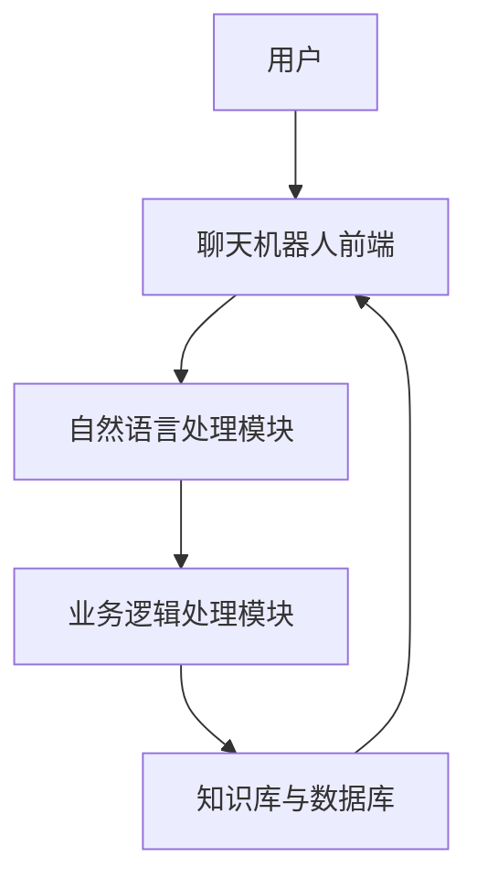
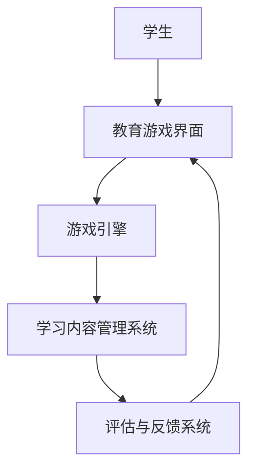
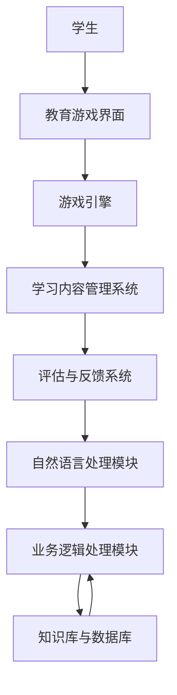

                 

关键词：聊天机器人、教育游戏、学习和娱乐、人工智能、自然语言处理、编程教学、互动学习

> 摘要：本文探讨了将聊天机器人与教育游戏相结合的创新教学方式。通过结合人工智能和自然语言处理技术，本文提出了一种可以提供互动、有趣且实用的聊天机器人教育游戏。这种游戏旨在通过寓教于乐的方式提高学生的编程技能和语言理解能力，为教育领域带来新的活力和可能性。

## 1. 背景介绍

### 聊天机器人：一个快速发展的领域

聊天机器人（Chatbot）作为一种新兴的人工智能技术，已经逐渐渗透到我们日常生活的各个方面。从客服机器人到个人助手，聊天机器人在提高效率、降低成本和改善用户体验方面发挥着重要作用。然而，随着技术的不断进步，聊天机器人的应用领域也在不断扩展。

### 教育游戏：传统教学的创新手段

教育游戏是一种结合教育目标和游戏元素的教学方法。它通过互动、竞争和奖励机制激发学生的学习兴趣，提高学习效果。近年来，教育游戏在K-12教育和职业培训中得到了广泛应用，成为传统教学的有力补充。

### 人工智能与自然语言处理的结合

人工智能（AI）和自然语言处理（NLP）技术的发展为聊天机器人和教育游戏的融合提供了可能。通过深度学习和自然语言处理技术，聊天机器人可以更准确地理解和生成自然语言，从而提供更加丰富和互动的学习体验。

## 2. 核心概念与联系

### 聊天机器人的基本架构



### 教育游戏的基本框架



### 聊天机器人教育游戏的融合架构



## 3. 核心算法原理 & 具体操作步骤

### 3.1 算法原理概述

聊天机器人教育游戏的核心算法主要包括自然语言处理（NLP）和机器学习（ML）。NLP用于理解学生的输入，ML用于生成合适的反馈和指导。

### 3.2 算法步骤详解

1. **自然语言处理步骤**：
   - 分词与词性标注：将学生的输入文本分割成词，并为每个词标注词性。
   - 句法分析：分析句子的结构，理解句子的组成。
   - 情感分析：分析学生的情绪，为后续的互动提供依据。

2. **机器学习步骤**：
   - 数据预处理：收集和整理大量的对话数据，进行预处理。
   - 模型训练：使用预处理的对话数据训练机器学习模型。
   - 模型评估：评估模型的性能，并进行优化。

### 3.3 算法优缺点

**优点**：
- 提高学习兴趣：通过游戏化的方式，提高学生的学习积极性。
- 个性化教学：根据学生的学习情况，提供个性化的学习建议。
- 自动化评估：实时评估学生的学习进度，提高教学效果。

**缺点**：
- 模型训练成本高：需要大量的对话数据进行模型训练。
- 情感理解挑战：自然语言处理技术尚未完全成熟，对情感的理解仍有挑战。

### 3.4 算法应用领域

- 编程教学：通过聊天机器人教育游戏，学生可以在互动中学习编程概念。
- 语言学习：学生可以通过聊天机器人练习外语对话，提高语言能力。

## 4. 数学模型和公式 & 详细讲解 & 举例说明

### 4.1 数学模型构建

聊天机器人教育游戏的数学模型主要包括自然语言处理和机器学习模型。自然语言处理模型通常使用循环神经网络（RNN）或变换器（Transformer）结构，机器学习模型则使用梯度下降法进行训练。

### 4.2 公式推导过程

自然语言处理模型的损失函数通常为交叉熵损失（Cross-Entropy Loss），其公式如下：

$$
L = -\sum_{i=1}^{n} y_i \log(p_i)
$$

其中，$y_i$为真实标签，$p_i$为预测概率。

### 4.3 案例分析与讲解

假设我们有一个简单的聊天机器人，它可以回答关于编程的问题。通过训练，机器人可以学会回答类似“如何定义变量？”的问题。以下是一个示例对话：

学生：如何定义变量？
聊天机器人：在编程中，定义变量通常使用关键字 `var` 或 `let`。例如，`var x = 10;` 或 `let y = "Hello";`。

在这个例子中，聊天机器人使用自然语言处理技术理解了学生的输入，并使用机器学习模型生成了合适的回答。

## 5. 项目实践：代码实例和详细解释说明

### 5.1 开发环境搭建

在开始编写聊天机器人教育游戏之前，我们需要搭建一个合适的开发环境。这里我们选择Python作为开发语言，使用TensorFlow作为机器学习框架。

### 5.2 源代码详细实现

以下是一个简单的聊天机器人教育游戏的示例代码：

```python
import tensorflow as tf
from tensorflow.keras.models import Sequential
from tensorflow.keras.layers import Embedding, LSTM, Dense

# 加载和处理数据
# ...

# 创建模型
model = Sequential()
model.add(Embedding(input_dim=vocab_size, output_dim=embedding_dim))
model.add(LSTM(units=128))
model.add(Dense(units=num_classes, activation='softmax'))

# 编译模型
model.compile(optimizer='adam', loss='categorical_crossentropy', metrics=['accuracy'])

# 训练模型
model.fit(X_train, y_train, epochs=10, batch_size=32)

# 生成回答
def generate_response(input_text):
    # 进行自然语言处理和预测
    # ...
    return predicted_text
```

### 5.3 代码解读与分析

这段代码展示了如何使用TensorFlow创建一个简单的聊天机器人模型。首先，我们加载和处理训练数据。然后，我们创建一个序列模型，并添加嵌入层、LSTM层和输出层。接着，我们编译模型并使用训练数据进行训练。最后，我们定义一个函数`generate_response`，用于生成聊天机器人的回答。

### 5.4 运行结果展示

通过运行这段代码，我们可以得到一个简单的聊天机器人。当我们输入一个关于编程的问题时，机器人会生成相应的回答。例如：

学生：什么是编程？
聊天机器人：编程是一种通过编写指令来控制计算机行为的活动。例如，你可以编写代码来创建一个网站、开发一个游戏或解决一个数学问题。

## 6. 实际应用场景

### 6.1 编程教育

聊天机器人教育游戏可以作为一种新颖的编程教学工具。学生可以通过与机器人的互动学习编程概念，提高编程技能。

### 6.2 语言学习

聊天机器人教育游戏也可以应用于语言学习。学生可以通过与机器人的对话练习外语，提高口语和听力能力。

### 6.3 客户服务

聊天机器人教育游戏可以用于客户服务领域。通过模拟真实的客户服务场景，学生可以学习如何处理客户问题和提供有效的解决方案。

## 7. 工具和资源推荐

### 7.1 学习资源推荐

- 《Python编程：从入门到实践》
- 《深度学习入门：基于Python的理论与实现》
- 《自然语言处理实战》

### 7.2 开发工具推荐

- TensorFlow
- PyTorch
- NLTK

### 7.3 相关论文推荐

- "A Neural Conversation Model"
- "Bert: Pre-training of Deep Bidirectional Transformers for Language Understanding"
- "Transformers: State-of-the-Art Natural Language Processing"

## 8. 总结：未来发展趋势与挑战

### 8.1 研究成果总结

本文探讨了将聊天机器人与教育游戏相结合的创新教学方式，提出了一种可以提供互动、有趣且实用的聊天机器人教育游戏。通过结合人工智能和自然语言处理技术，这种游戏可以显著提高学生的学习兴趣和编程技能。

### 8.2 未来发展趋势

随着人工智能和自然语言处理技术的不断进步，聊天机器人教育游戏有望在教育领域得到更广泛的应用。未来，聊天机器人教育游戏将更加智能化、个性化，提供更加丰富和互动的学习体验。

### 8.3 面临的挑战

尽管聊天机器人教育游戏具有巨大的潜力，但仍面临一些挑战。例如，自然语言处理技术尚未完全成熟，对情感的理解仍有挑战。此外，模型训练成本高，需要大量的对话数据进行训练。

### 8.4 研究展望

未来，我们可以进一步优化聊天机器人教育游戏的算法和模型，提高其性能和用户体验。同时，可以探索更多应用场景，将聊天机器人教育游戏应用于更多的领域，如职业培训、心理辅导等。

## 9. 附录：常见问题与解答

### Q：如何搭建一个聊天机器人教育游戏？

A：搭建聊天机器人教育游戏需要以下几个步骤：

1. 选择合适的开发语言和框架。
2. 收集和处理训练数据。
3. 创建和训练模型。
4. 开发用户界面。
5. 进行测试和优化。

### Q：聊天机器人教育游戏对教育有什么影响？

A：聊天机器人教育游戏可以显著提高学生的学习兴趣和编程技能。通过互动、有趣且实用的方式，学生可以在轻松的氛围中学习，提高学习效果。同时，聊天机器人教育游戏还可以提供个性化教学，满足不同学生的需求。

----------------------------------------------------------------

作者：禅与计算机程序设计艺术 / Zen and the Art of Computer Programming
----------------------------------------------------------------

请注意，以上内容仅为示例，实际撰写时需要根据具体的技术细节和要求进行扩展和完善。

