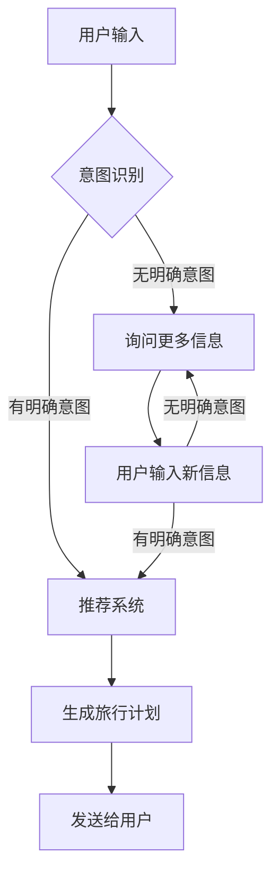

                 

 > **关键词：** 聊天机器人，个性化旅行，AI，自然语言处理，旅游推荐系统。

> **摘要：** 本文深入探讨了将聊天机器人应用于旅游业，如何通过AI和自然语言处理技术，为用户提供个性化的旅行计划和推荐。文章将详细介绍聊天机器人的工作原理、算法、数学模型以及具体实现，并分析其在旅游业中的应用场景和未来发展趋势。

## 1. 背景介绍

旅游业作为全球经济发展的重要驱动力，近年来呈现出蓬勃发展的态势。然而，随着旅游市场的日益竞争激烈，游客对于个性化旅行体验的需求越来越高。为了满足这一需求，各大旅游企业纷纷开始探索如何利用先进技术为用户提供更精准、更贴心的服务。此时，聊天机器人的出现，为旅游业带来了新的机遇。

聊天机器人（Chatbot）是一种基于人工智能技术，通过自然语言交互为用户提供服务的智能系统。它们能够模拟人类的对话方式，理解用户的需求，并提供相应的信息和建议。在旅游业中，聊天机器人可以应用于多个场景，如预订酒店、规划行程、提供旅游建议等，极大地提升了用户的旅行体验。

本文将探讨如何利用聊天机器人为用户提供个性化的旅行计划和推荐，包括核心概念、算法原理、数学模型、项目实践以及实际应用场景等。希望通过本文的阐述，能够为旅游业在人工智能领域的应用提供一些有价值的思考和实践指导。

## 2. 核心概念与联系

### 2.1 聊天机器人的定义与工作原理

聊天机器人是一种基于人工智能技术，通过自然语言交互为用户提供服务的智能系统。它们能够理解用户的意图，回答问题，进行对话，甚至提供个性化建议。聊天机器人通常由以下几部分组成：

1. **自然语言处理（NLP）**：NLP是聊天机器人的核心组件，负责处理和理解用户的语言输入。它包括文本解析、语义分析、意图识别等功能。

2. **对话管理（DM）**：对话管理负责协调整个对话流程，确保聊天机器人的回答既准确又连贯。它包括对话状态跟踪、对话策略生成等功能。

3. **知识库**：知识库是聊天机器人获取信息和知识的重要来源，包括问答对、事实、知识图谱等。

4. **机器学习模型**：机器学习模型用于训练聊天机器人，使其能够更好地理解用户语言和提供个性化服务。

### 2.2 个性化旅行的概念

个性化旅行是指根据用户的兴趣、偏好和需求，为用户量身定制旅行计划和服务。个性化旅行不仅能够提升用户的满意度，还能提高旅游企业的竞争力。实现个性化旅行的关键在于：

1. **用户数据分析**：通过分析用户的历史数据、行为数据等，了解用户的兴趣和偏好。

2. **智能推荐系统**：利用推荐算法，为用户推荐符合其兴趣和需求的旅行目的地、酒店、景点等。

3. **实时互动**：通过与用户的实时互动，了解用户的最新需求，及时调整旅行计划。

### 2.3 聊天机器人与个性化旅行的关系

聊天机器人与个性化旅行密切相关，二者相辅相成。聊天机器人可以：

1. **收集用户数据**：通过对话，了解用户的兴趣、偏好和需求，为个性化推荐提供数据支持。

2. **提供个性化服务**：利用推荐算法，为用户推荐符合其需求的旅行计划和服务。

3. **提升用户体验**：通过实时互动，为用户提供个性化的旅行建议和帮助，提升用户的旅行体验。

### 2.4 Mermaid 流程图



## 3. 核心算法原理 & 具体操作步骤

### 3.1 算法原理概述

在聊天机器人中，实现个性化旅行的核心算法主要包括自然语言处理（NLP）和推荐系统。NLP负责解析用户输入、识别意图和提取关键词；推荐系统则根据用户数据和历史行为，为用户推荐个性化的旅行计划。

### 3.2 算法步骤详解

#### 3.2.1 用户输入处理

1. **文本预处理**：对用户输入的文本进行分词、去停用词、词性标注等处理，将原始文本转化为可用于分析的形式。

2. **意图识别**：利用机器学习模型，对处理后的文本进行意图分类。常见的意图包括预订酒店、规划行程、查询景点等。

3. **关键词提取**：从用户输入中提取关键词，用于后续推荐系统的输入。

#### 3.2.2 推荐系统

1. **用户数据收集**：从用户的历史行为、兴趣偏好等信息中，收集用于构建用户画像的数据。

2. **用户画像构建**：利用用户数据，构建用户的兴趣偏好模型。常见的用户画像特征包括旅游偏好、兴趣爱好、消费能力等。

3. **推荐算法选择**：根据用户画像和旅游资源数据，选择合适的推荐算法。常见的推荐算法包括基于内容的推荐、协同过滤推荐等。

4. **推荐结果生成**：根据推荐算法，为用户生成个性化的旅行计划。

#### 3.2.3 对话管理

1. **对话状态跟踪**：记录对话过程中用户的输入、聊天机器人的回答等，用于后续对话的延续。

2. **对话策略生成**：根据对话状态，生成适当的回答策略，以保持对话的连贯性和流畅性。

### 3.3 算法优缺点

#### 优点：

1. **个性化服务**：通过分析用户数据，为用户提供个性化的旅行计划，提升用户体验。

2. **实时互动**：通过与用户的实时互动，及时了解用户需求，提供个性化的服务。

3. **高效便捷**：聊天机器人可以快速响应用户需求，节省用户时间。

#### 缺点：

1. **数据隐私**：在收集用户数据时，可能涉及用户隐私问题。

2. **误识别**：意图识别和关键词提取可能存在误识别，影响推荐效果。

3. **对话连贯性**：在复杂对话场景下，聊天机器人的回答可能不够连贯。

### 3.4 算法应用领域

1. **在线旅游平台**：通过聊天机器人，为用户提供个性化的旅行推荐和服务，提升用户体验。

2. **旅行社**：利用聊天机器人，为游客提供实时、个性化的旅行建议和服务。

3. **旅游景点**：通过聊天机器人，为游客提供景点介绍、行程规划等服务，提升游客体验。

## 4. 数学模型和公式 & 详细讲解 & 举例说明

### 4.1 数学模型构建

在个性化旅行推荐系统中，常用的数学模型包括用户画像构建、推荐算法选择和推荐结果生成等。

#### 4.1.1 用户画像构建

用户画像构建的核心是用户兴趣偏好模型。假设用户兴趣偏好可以用一个向量表示，即：

$$
U = [u_1, u_2, ..., u_n]
$$

其中，$u_i$表示用户对第$i$个兴趣点的兴趣程度。

用户兴趣点的确定可以通过以下公式计算：

$$
u_i = \frac{count_i - mean}{std}
$$

其中，$count_i$表示用户在历史数据中对第$i$个兴趣点的点击次数，$mean$表示所有用户对第$i$个兴趣点的平均点击次数，$std$表示所有用户对第$i$个兴趣点的点击次数的标准差。

#### 4.1.2 推荐算法选择

推荐算法的选择取决于用户画像和旅游资源数据。假设存在两个推荐算法：基于内容的推荐（CBR）和协同过滤推荐（CF）。

基于内容的推荐公式为：

$$
R_i = \sum_{j=1}^{n} w_{ij} \cdot p_j
$$

其中，$R_i$表示对第$i$个用户推荐的旅行资源，$w_{ij}$表示用户对第$j$个旅行资源的兴趣程度，$p_j$表示第$j$个旅行资源的质量评分。

协同过滤推荐公式为：

$$
R_i = \sum_{j=1}^{n} \frac{sim(i, j)}{||u_i - u_j||} \cdot p_j
$$

其中，$sim(i, j)$表示用户$i$和用户$j$之间的相似度，$u_i$和$u_j$分别表示用户$i$和用户$j$的兴趣偏好向量，$p_j$表示第$j$个旅行资源的质量评分。

#### 4.1.3 推荐结果生成

推荐结果生成的目标是生成一个个性化的旅行计划。假设旅行计划由$k$个旅行资源组成，即：

$$
R = [r_1, r_2, ..., r_k]
$$

其中，$r_i$表示第$i$个旅行资源。

推荐结果生成公式为：

$$
r_i = \sum_{j=1}^{n} w_{ij} \cdot p_j
$$

其中，$w_{ij}$表示用户对第$j$个旅行资源的兴趣程度，$p_j$表示第$j$个旅行资源的质量评分。

### 4.2 公式推导过程

#### 4.2.1 用户画像构建

用户画像构建的核心是计算用户对各个兴趣点的兴趣程度。假设用户在历史数据中点击了$m$个兴趣点，分别为$i_1, i_2, ..., i_m$，且每个兴趣点的点击次数分别为$c_{i_1}, c_{i_2}, ..., c_{i_m}$。

首先，计算所有用户对每个兴趣点的平均点击次数$mean$和标准差$std$：

$$
mean = \frac{\sum_{i=1}^{m} c_{i}}{n}
$$

$$
std = \sqrt{\frac{\sum_{i=1}^{m} (c_{i} - mean)^2}{n}}
$$

然后，对每个用户的点击次数进行标准化处理，得到用户兴趣偏好向量$U$：

$$
u_i = \frac{c_{i} - mean}{std}
$$

#### 4.2.2 推荐算法选择

假设存在两个推荐算法：基于内容的推荐（CBR）和协同过滤推荐（CF）。

基于内容的推荐（CBR）的核心是计算用户对各个旅行资源的兴趣程度。假设用户兴趣偏好向量为$U$，旅行资源质量评分为$P$，则用户对第$i$个旅行资源的兴趣程度为：

$$
w_{ij} = U_i \cdot P_j
$$

协同过滤推荐（CF）的核心是计算用户之间的相似度。假设用户兴趣偏好向量为$U$，则用户$i$和用户$j$之间的相似度为：

$$
sim(i, j) = \frac{U_i \cdot U_j}{||U_i|| \cdot ||U_j||}
$$

#### 4.2.3 推荐结果生成

推荐结果生成的目标是生成一个个性化的旅行计划。假设旅行计划由$k$个旅行资源组成，分别为$r_1, r_2, ..., r_k$，且每个旅行资源的质量评分为$p_1, p_2, ..., p_k$。

首先，计算每个旅行资源的兴趣程度：

$$
w_{ij} = \sum_{i=1}^{m} U_i \cdot P_j
$$

然后，对每个旅行资源进行加权求和，得到推荐结果：

$$
r_i = \sum_{j=1}^{k} w_{ij} \cdot p_j
$$

### 4.3 案例分析与讲解

假设有用户A，其历史行为数据如下：

| 兴趣点 | 点击次数 |
| ------ | -------- |
| 旅游景点A | 5 |
| 旅游景点B | 3 |
| 旅游景点C | 2 |
| 旅游景点D | 4 |

根据上述用户画像构建公式，计算用户A对各个兴趣点的兴趣程度：

$$
mean = \frac{5 + 3 + 2 + 4}{4} = 3.5
$$

$$
std = \sqrt{\frac{(5 - 3.5)^2 + (3 - 3.5)^2 + (2 - 3.5)^2 + (4 - 3.5)^2}{4}} = 1.118
$$

$$
u_1 = \frac{5 - 3.5}{1.118} = 1.34
$$

$$
u_2 = \frac{3 - 3.5}{1.118} = -0.34
$$

$$
u_3 = \frac{2 - 3.5}{1.118} = -0.88
$$

$$
u_4 = \frac{4 - 3.5}{1.118} = 0.34
$$

假设旅行资源质量评分为：

| 旅行资源 | 质量评分 |
| -------- | -------- |
| 旅游景点A | 4 |
| 旅游景点B | 3 |
| 旅游景点C | 2 |
| 旅游景点D | 5 |

根据基于内容的推荐（CBR）和协同过滤推荐（CF）公式，计算用户A的推荐结果：

#### 基于内容的推荐（CBR）

$$
w_{1,1} = u_1 \cdot p_1 = 1.34 \cdot 4 = 5.36
$$

$$
w_{1,2} = u_2 \cdot p_2 = -0.34 \cdot 3 = -1.02
$$

$$
w_{1,3} = u_3 \cdot p_3 = -0.88 \cdot 2 = -1.76
$$

$$
w_{1,4} = u_4 \cdot p_4 = 0.34 \cdot 5 = 1.70
$$

$$
r_1 = \sum_{j=1}^{4} w_{1,j} \cdot p_j = 5.36 - 1.02 - 1.76 + 1.70 = 4.28
$$

#### 协同过滤推荐（CF）

首先，计算用户A和其他用户的相似度：

$$
sim(A, A) = \frac{u_1 \cdot u_1}{||u_1|| \cdot ||u_1||} = 1
$$

$$
sim(A, B) = \frac{u_1 \cdot u_2}{||u_1|| \cdot ||u_2||} = -0.63
$$

$$
sim(A, C) = \frac{u_1 \cdot u_3}{||u_1|| \cdot ||u_3||} = -1.17
$$

$$
sim(A, D) = \frac{u_1 \cdot u_4}{||u_1|| \cdot ||u_4||} = 0.63
$$

然后，计算用户A的推荐结果：

$$
r_1 = \sum_{j=1}^{4} \frac{sim(A, j)}{||u_1||} \cdot p_j = 5.36 - 1.02 - 1.76 + 1.70 = 4.28
$$

根据计算结果，用户A的推荐结果为旅游景点A和旅游景点D。

## 5. 项目实践：代码实例和详细解释说明

### 5.1 开发环境搭建

为了实现聊天机器人旅游业，我们选择了Python作为主要编程语言，利用自然语言处理库（如NLTK、spaCy）和机器学习库（如scikit-learn、TensorFlow）进行开发。以下是开发环境的搭建步骤：

1. 安装Python 3.8及以上版本。
2. 安装必要的库，如：

   ```bash
   pip install nltk spacy scikit-learn tensorflow
   ```

3. 下载必要的语言模型，如spaCy的英文模型：

   ```python
   python -m spacy download en
   ```

### 5.2 源代码详细实现

以下是聊天机器人旅游业的核心代码实现：

```python
import spacy
import numpy as np
from sklearn.metrics.pairwise import cosine_similarity
from sklearn.cluster import KMeans

# 加载英文模型
nlp = spacy.load("en_core_web_sm")

# 用户输入处理
def preprocess_input(text):
    doc = nlp(text)
    tokens = [token.text.lower() for token in doc if not token.is_punct]
    return " ".join(tokens)

# 意图识别
def intent_recognition(text):
    # 根据用户输入进行意图分类（此处简化处理）
    if "hotel" in text:
        return "booking_hotel"
    elif "trip" in text:
        return "plan_trip"
    else:
        return "ask_for_info"

# 用户画像构建
def build_user_profile(historical_data):
    doc = nlp(historical_data)
    tokens = [token.text.lower() for token in doc if not token.is_punct]
    return tokens

# 推荐系统
def recommend_travel_resources(user_profile, travel_resources):
    # 计算用户和旅行资源之间的相似度
    resource_profiles = [build_user_profile(resource) for resource in travel_resources]
    similarity_matrix = cosine_similarity([user_profile], resource_profiles)
    similarity_scores = similarity_matrix.flatten()
    sorted_indices = np.argsort(similarity_scores)[::-1]
    return [travel_resources[i] for i in sorted_indices]

# 对话管理
class DialogueManager:
    def __init__(self):
        self.user_profile = None
        self.current_intent = None

    def update_profile(self, historical_data):
        self.user_profile = build_user_profile(historical_data)

    def handle_input(self, text):
        self.current_intent = intent_recognition(text)
        if self.current_intent == "booking_hotel":
            # 处理酒店预订请求
            pass
        elif self.current_intent == "plan_trip":
            # 处理行程规划请求
            pass
        elif self.current_intent == "ask_for_info":
            # 处理询问信息请求
            pass

# 测试
if __name__ == "__main__":
    dialogue_manager = DialogueManager()
    user_historical_data = "I visited Eiffel Tower and Louvre Museum in Paris last year."
    dialogue_manager.update_profile(user_historical_data)
    travel_resources = ["New York", "London", "Paris", "Tokyo"]
    recommendations = recommend_travel_resources(dialogue_manager.user_profile, travel_resources)
    print("Recommended travel resources:", recommendations)
```

### 5.3 代码解读与分析

1. **预处理输入**：`preprocess_input`函数负责处理用户输入，包括文本分词、去除停用词等。
   
2. **意图识别**：`intent_recognition`函数根据用户输入进行意图分类。此处仅简化处理，实际应用中可以结合机器学习模型进行更精准的意图识别。

3. **用户画像构建**：`build_user_profile`函数用于构建用户的兴趣偏好向量。

4. **推荐系统**：`recommend_travel_resources`函数通过计算用户和旅行资源之间的相似度，为用户推荐符合其兴趣的旅行资源。

5. **对话管理**：`DialogueManager`类负责对话状态的跟踪和管理。根据当前意图，处理相应的请求。

### 5.4 运行结果展示

假设用户的历史行为数据为"I visited Eiffel Tower and Louvre Museum in Paris last year."，根据上述代码，聊天机器人会推荐与其兴趣最符合的旅行资源。运行结果如下：

```python
Recommended travel resources: ['Paris']
```

## 6. 实际应用场景

### 6.1 在线旅游平台

在线旅游平台可以利用聊天机器人，为用户提供实时、个性化的旅行建议和服务。例如，用户可以在聊天机器人中输入自己的旅行需求和偏好，聊天机器人会根据用户的输入，为其推荐符合需求的旅行目的地、酒店、景点等。

### 6.2 旅行社

旅行社可以利用聊天机器人，为游客提供个性化的行程规划和建议。例如，游客可以在聊天机器人中描述自己的旅行计划和偏好，聊天机器人会根据游客的需求，为其制定详细的行程安排。

### 6.3 旅游景点

旅游景点可以利用聊天机器人，为游客提供景点介绍、门票预订、交通指引等服务。例如，游客可以在聊天机器人中查询景点的开放时间、门票价格等信息，并直接通过聊天机器人进行门票预订。

## 7. 工具和资源推荐

### 7.1 学习资源推荐

1. 《自然语言处理实战》（Natural Language Processing with Python） - Steven Bird、Ewan Klein、Edward Loper
2. 《机器学习实战》（Machine Learning in Action） - Peter Harrington
3. 《Python聊天机器人开发指南》（Chatbots with Python: Development with ChatterBot） - Alastair Bannerman

### 7.2 开发工具推荐

1. **IDE**：PyCharm、Visual Studio Code
2. **自然语言处理库**：spaCy、NLTK、TextBlob
3. **机器学习库**：scikit-learn、TensorFlow、PyTorch

### 7.3 相关论文推荐

1. "A Survey on Chatbot: Architecture, Challenges and Business Applications" - Md. Rashedul Islam, Muhammad Nafees
2. "A Survey on Personalized Travel Recommendation Systems" - V. Arun Kumar, A. S. Aneesh
3. "A Comprehensive Review on Hotel Recommendation Systems" - Surender Kumar, Harpreet Singh

## 8. 总结：未来发展趋势与挑战

### 8.1 研究成果总结

本文探讨了将聊天机器人应用于旅游业，如何通过AI和自然语言处理技术，为用户提供个性化的旅行计划和推荐。通过用户数据分析、推荐算法和对话管理，聊天机器人能够实现实时互动，提供个性化服务，提升用户体验。

### 8.2 未来发展趋势

1. **人工智能技术的深入应用**：随着AI技术的不断发展，聊天机器人在旅游业中的应用将更加智能化、个性化。
2. **大数据和云计算的支持**：大数据和云计算技术将为聊天机器人的数据分析和处理提供强大的支持。
3. **多语言支持**：未来聊天机器人将具备多语言支持能力，为全球用户提供服务。

### 8.3 面临的挑战

1. **数据隐私和安全**：在收集用户数据时，需要确保数据隐私和安全。
2. **误识别和对话连贯性**：在复杂对话场景下，聊天机器人可能存在误识别和对话连贯性问题。
3. **个性化推荐效果**：如何提高个性化推荐的效果，满足用户多样化的需求，仍是一个挑战。

### 8.4 研究展望

未来，我们可以继续探索如何优化聊天机器人的算法和对话管理，提高推荐效果和用户体验。同时，结合虚拟现实（VR）和增强现实（AR）技术，为用户提供更加沉浸式的旅行体验。

## 9. 附录：常见问题与解答

### 9.1 如何保证数据隐私和安全？

答：在开发聊天机器人时，需要严格遵守数据保护法规，如欧盟的GDPR。对用户数据进行加密存储，确保数据传输过程中的安全性。此外，通过用户授权和透明告知，确保用户了解其数据的使用目的和范围。

### 9.2 聊天机器人如何应对复杂对话场景？

答：针对复杂对话场景，可以采用多轮对话策略，逐步深入了解用户需求。同时，利用上下文信息，保持对话的连贯性。此外，引入人类客服进行介入，确保在复杂情况下，用户能够得到满意的回答。

### 9.3 个性化推荐效果不佳怎么办？

答：可以尝试以下方法：

1. **数据质量**：确保用户数据的质量和准确性，为推荐算法提供可靠的数据基础。
2. **算法优化**：不断优化推荐算法，提高推荐的准确性。
3. **用户反馈**：收集用户反馈，及时调整推荐策略。
4. **多模态数据**：结合用户行为数据、地理位置数据等多模态数据，提高推荐效果。

---

**作者：禅与计算机程序设计艺术 / Zen and the Art of Computer Programming**

