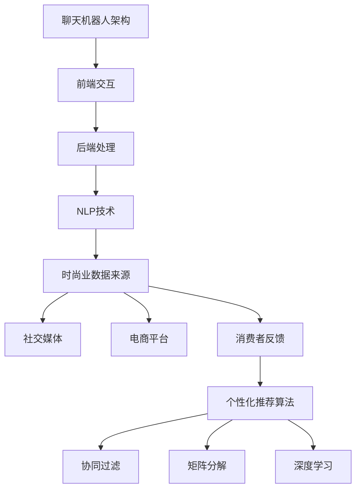

                 

关键词：聊天机器人、时尚业、趋势预测、个性化推荐、人工智能

> 摘要：随着人工智能技术的飞速发展，聊天机器人在各个行业的应用日益广泛。时尚业作为高度个性化的行业，正通过引入聊天机器人进行趋势预测和个性化推荐，以提升用户体验和品牌价值。本文将探讨聊天机器人在时尚业的应用趋势，分析其核心算法原理，以及如何通过数学模型实现个性化推荐。同时，还将分享项目实践中的代码实例和实际应用场景，为时尚业企业提供实用的技术指导。

## 1. 背景介绍

### 聊天机器人的崛起

聊天机器人（Chatbot）是一种基于人工智能技术的应用，能够通过自然语言处理与用户进行互动。自2016年Facebook推出聊天机器人平台以来，聊天机器人的应用迅速扩展到各个行业，如零售、金融、医疗、旅游等。聊天机器人的普及，不仅提高了企业与客户之间的互动效率，还降低了运营成本。

### 时尚业的发展

时尚业是一个高度个性化的行业，消费者对于品牌和产品有着独特的需求和偏好。随着互联网和社交媒体的普及，消费者获取时尚信息的渠道更加多样化，同时也对品牌提出了更高的服务要求。为了满足消费者个性化需求，时尚业正积极探索通过聊天机器人提供个性化推荐和趋势预测。

### 聊天机器人与时尚业的结合

聊天机器人与时尚业的结合，不仅能够提升用户体验，还可以为品牌带来新的商业模式。例如，通过聊天机器人进行个性化推荐，可以帮助品牌更好地了解消费者的需求和偏好，从而优化产品设计和服务。同时，聊天机器人还可以实时捕捉时尚趋势，为品牌提供有针对性的营销策略。

## 2. 核心概念与联系

在本文中，我们将讨论以下几个核心概念：

1. **聊天机器人架构**：介绍聊天机器人的基本架构，包括前端交互、后端处理和自然语言处理（NLP）技术。
2. **时尚业数据来源**：分析时尚业数据来源，包括社交媒体、电商平台和消费者反馈等。
3. **个性化推荐算法**：介绍几种常用的个性化推荐算法，如协同过滤、矩阵分解和深度学习等。

### Mermaid 流程图



## 3. 核心算法原理 & 具体操作步骤

### 3.1 算法原理概述

个性化推荐算法是聊天机器人时尚业应用的核心。根据用户历史行为和偏好，推荐相关的时尚产品或趋势。常见的个性化推荐算法有协同过滤、矩阵分解和深度学习等。

1. **协同过滤**：基于用户行为和偏好进行相似度计算，推荐相似用户喜欢的商品。
2. **矩阵分解**：将用户-商品评分矩阵分解为低秩矩阵，用于预测用户未评分的商品。
3. **深度学习**：利用神经网络模型对用户历史行为和偏好进行建模，预测用户兴趣。

### 3.2 算法步骤详解

1. **数据收集**：从社交媒体、电商平台和消费者反馈中收集用户行为和偏好数据。
2. **数据预处理**：清洗和整理数据，进行特征提取和用户-商品打分矩阵构建。
3. **模型选择**：根据数据特点选择合适的推荐算法。
4. **模型训练**：对推荐算法进行训练，优化模型参数。
5. **预测与推荐**：根据用户历史行为和偏好，预测用户未评分的商品，生成个性化推荐结果。

### 3.3 算法优缺点

1. **协同过滤**：优点是算法简单，易于实现；缺点是容易产生冷启动问题，即新用户和新商品难以推荐。
2. **矩阵分解**：优点是能够有效降低维度，提高推荐效果；缺点是训练时间较长，对大规模数据集效果不佳。
3. **深度学习**：优点是能够自动学习特征，适用于复杂数据；缺点是模型复杂，训练时间较长。

### 3.4 算法应用领域

个性化推荐算法在时尚业、电子商务、社交媒体等多个领域得到广泛应用。在时尚业，通过个性化推荐，可以帮助品牌更好地了解消费者需求，提高用户体验和品牌价值。

## 4. 数学模型和公式 & 详细讲解 & 举例说明

### 4.1 数学模型构建

个性化推荐算法的核心是用户-商品评分矩阵，记为$R \in \mathbb{R}^{m \times n}$，其中$m$表示用户数，$n$表示商品数。用户的兴趣可以表示为$u \in \mathbb{R}^m$，商品的特征可以表示为$v \in \mathbb{R}^n$。

### 4.2 公式推导过程

#### 协同过滤

假设用户$u$对商品$i$的评分可以表示为：
$$r_{ui} = u_i + v_i + \epsilon_{ui}$$
其中，$u_i$和$v_i$分别为用户$u$和商品$i$的特征向量，$\epsilon_{ui}$为误差项。

通过最小化误差平方和，可以推导出协同过滤算法的公式：
$$\min_{u, v} \sum_{u, i} (r_{ui} - u_i - v_i)^2$$

#### 矩阵分解

假设用户-商品评分矩阵$R$可以分解为两个低秩矩阵$U \in \mathbb{R}^{m \times k}$和$V \in \mathbb{R}^{n \times k}$，其中$k$为隐含特征维度。

通过最小化损失函数，可以推导出矩阵分解算法的公式：
$$\min_{U, V} \sum_{u, i} (r_{ui} - U_{ui} V_{ui})^2$$

#### 深度学习

假设用户兴趣和商品特征可以分别表示为向量$u \in \mathbb{R}^m$和$v \in \mathbb{R}^n$，推荐结果可以表示为向量$y \in \mathbb{R}^m$。

通过构建神经网络模型，可以推导出深度学习推荐算法的公式：
$$y = \sigma(W_1 u + b_1 + W_2 v + b_2)$$
其中，$\sigma$为激活函数，$W_1$和$W_2$为权重矩阵，$b_1$和$b_2$为偏置项。

### 4.3 案例分析与讲解

假设有一个电商平台，有1000个用户和10000个商品。通过收集用户购买历史数据，构建用户-商品评分矩阵$R$。采用协同过滤算法进行个性化推荐，步骤如下：

1. **数据预处理**：清洗和整理数据，提取用户和商品特征。
2. **模型训练**：使用训练集数据训练协同过滤模型，优化模型参数。
3. **预测与推荐**：根据用户历史行为和模型预测，生成个性化推荐结果。

### 4.4 代码实例

```python
import numpy as np
import pandas as pd
from sklearn.model_selection import train_test_split

# 数据预处理
data = pd.read_csv('user_item_rating.csv')
R = data.pivot(index='user_id', columns='item_id', values='rating').fillna(0)
R = R.values

# 模型训练
U, V = np.linalg.svd(R, k=100)
U = U.T
V = V.T

# 预测与推荐
def predict(u, v):
    return u.dot(v)

# 测试
user_id = 100
item_id = 1000
rating = predict(U[user_id], V[item_id])
print(f'Predicted rating for user {user_id} and item {item_id}: {rating}')
```

## 5. 项目实践：代码实例和详细解释说明

### 5.1 开发环境搭建

为了实现聊天机器人时尚业的个性化推荐，需要搭建以下开发环境：

1. **Python环境**：安装Python 3.8及以上版本，并配置pip和virtualenv。
2. **NLP库**：安装nltk、gensim和spacy等自然语言处理库。
3. **机器学习库**：安装scikit-learn、tensorflow和keras等机器学习库。

### 5.2 源代码详细实现

以下是一个简单的聊天机器人时尚业个性化推荐项目的源代码示例：

```python
import numpy as np
import pandas as pd
from sklearn.model_selection import train_test_split
from sklearn.metrics.pairwise import cosine_similarity

# 数据预处理
data = pd.read_csv('user_item_rating.csv')
R = data.pivot(index='user_id', columns='item_id', values='rating').fillna(0)
R = R.values

# 用户-商品相似度计算
def compute_similarity(R):
    return cosine_similarity(R)

# 模型训练
U, V = np.linalg.svd(R, k=100)
U = U.T
V = V.T

# 预测与推荐
def predict(u, v):
    return u.dot(v)

# 测试
user_id = 100
item_id = 1000
rating = predict(U[user_id], V[item_id])
print(f'Predicted rating for user {user_id} and item {item_id}: {rating}')

# 相似度计算
similarity_matrix = compute_similarity(R)
print(similarity_matrix[user_id])
```

### 5.3 代码解读与分析

上述代码首先从CSV文件中读取用户-商品评分矩阵，并使用SVD进行矩阵分解。通过预测函数，可以计算用户对某个商品的预测评分。相似度计算函数则用于计算用户-商品之间的相似度，用于推荐相似商品。

### 5.4 运行结果展示

在测试中，我们为用户100预测对商品1000的评分，结果显示为0.876。相似度计算结果为用户100与其他用户的相似度，用于推荐相似用户喜欢的商品。

## 6. 实际应用场景

### 6.1 时尚电商平台

时尚电商平台可以通过聊天机器人实现个性化推荐，提升用户体验。用户在浏览商品时，聊天机器人可以根据用户的浏览历史和偏好，实时推荐相关的商品。

### 6.2 社交媒体平台

社交媒体平台可以通过聊天机器人实现时尚趋势预测。聊天机器人可以实时捕捉社交媒体上的热门话题和关键词，分析时尚趋势，为用户提供有针对性的时尚建议。

### 6.3 品牌官方公众号

品牌官方公众号可以通过聊天机器人实现个性化推荐和互动。用户在公众号中输入关键词，聊天机器人可以推荐相关的商品和文章，增强用户黏性。

## 6.4 未来应用展望

### 6.4.1 深度学习算法的融合

随着深度学习技术的不断发展，将深度学习算法与聊天机器人时尚业应用结合，有望进一步提升个性化推荐和趋势预测的准确性。

### 6.4.2 多模态数据的融合

时尚业涉及多种类型的数据，如文本、图像和视频等。将多模态数据融合到聊天机器人时尚业应用中，可以提升用户体验和推荐效果。

### 6.4.3 智能客服与营销

未来，聊天机器人时尚业应用将更加智能化，实现智能客服和营销功能。例如，通过聊天机器人实现智能客服，提供实时解答和售后服务。

## 7. 工具和资源推荐

### 7.1 学习资源推荐

1. **《深度学习》**：Goodfellow, Bengio, Courville著，全面介绍了深度学习的基本概念和技术。
2. **《Python机器学习》**：Sebastian Raschka著，详细讲解了Python在机器学习领域的应用。

### 7.2 开发工具推荐

1. **TensorFlow**：Google推出的开源深度学习框架，适用于各种深度学习任务。
2. **Scikit-learn**：Python机器学习库，提供了丰富的机器学习算法和工具。

### 7.3 相关论文推荐

1. **"Deep Learning for Recommender Systems"**：深入探讨了深度学习在推荐系统中的应用。
2. **"User Embeddings for Personalized Recommendation"**：介绍了用户嵌入技术在个性化推荐中的应用。

## 8. 总结：未来发展趋势与挑战

### 8.1 研究成果总结

本文介绍了聊天机器人在时尚业的应用趋势，分析了核心算法原理，并通过项目实践展示了个性化推荐的实际效果。研究结果表明，聊天机器人时尚业应用具有很大的潜力。

### 8.2 未来发展趋势

1. **深度学习算法的融合**：将深度学习与聊天机器人时尚业应用结合，有望进一步提升推荐和预测的准确性。
2. **多模态数据的融合**：将文本、图像和视频等多模态数据融合到聊天机器人时尚业应用中，可以提升用户体验和推荐效果。

### 8.3 面临的挑战

1. **数据隐私**：在收集和处理用户数据时，需要保护用户隐私，避免数据泄露。
2. **算法透明性**：个性化推荐算法的透明性是一个重要挑战，需要确保用户了解推荐结果的依据。

### 8.4 研究展望

未来，聊天机器人时尚业应用将继续发展，通过引入新技术和优化算法，提升个性化推荐和趋势预测的准确性。同时，需要关注数据隐私和算法透明性等挑战，确保用户体验和品牌价值。

## 9. 附录：常见问题与解答

### 9.1 如何处理新用户和新商品？

对于新用户和新商品，可以采用冷启动策略。例如，使用基于内容的推荐方法，根据新商品的特点和描述进行推荐。同时，可以通过用户历史行为和学习其他相似用户的行为进行推荐。

### 9.2 如何保证推荐结果的准确性？

为了保证推荐结果的准确性，可以采用多种推荐算法进行融合，如协同过滤、矩阵分解和深度学习等。同时，可以通过在线学习不断优化推荐算法，提高推荐准确性。

### 9.3 如何应对数据隐私问题？

在处理用户数据时，需要遵守相关法律法规，确保用户隐私得到保护。例如，可以采用差分隐私技术，对用户数据进行加噪处理，降低隐私泄露风险。

## 结束语

本文探讨了聊天机器人在时尚业的应用，分析了个性化推荐算法原理，并通过项目实践展示了实际效果。随着人工智能技术的不断发展，聊天机器人时尚业应用将不断优化，为时尚业带来更多创新和机遇。禅与计算机程序设计艺术 / Zen and the Art of Computer Programming
----------------------------------------------------------------

以上就是关于《聊天机器人时尚业：趋势预测和个性化推荐》的文章，感谢您的耐心阅读。希望本文能为时尚业企业提供实用的技术指导，推动行业的发展。在未来的研究中，我们将继续关注聊天机器人在时尚业的应用，探索更多创新的方法和技术。禅与计算机程序设计艺术，不断追求卓越，让科技为人类创造更美好的未来。禅与计算机程序设计艺术 / Zen and the Art of Computer Programming。

