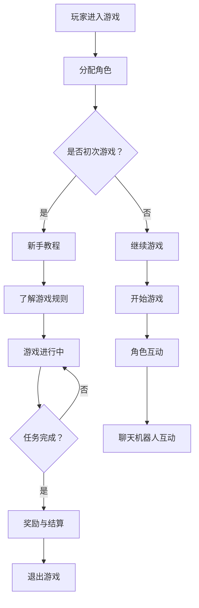

                 

随着人工智能技术的快速发展，聊天机器人逐渐成为人机交互的重要方式。然而，传统的单机聊天机器人已经无法满足人们对于社交互动和沉浸式体验的需求。本文将探讨聊天机器人游戏革命的背景、核心概念、算法原理、数学模型、项目实践以及实际应用场景，为读者呈现一个充满可能性的未来。

## 1. 背景介绍

在过去的几十年中，计算机科学和人工智能技术取得了飞速的发展。从最初的简单计算工具到如今能够处理复杂任务的智能系统，人工智能已经深入到了我们生活的方方面面。其中，聊天机器人作为人工智能的一种应用形式，也经历了从简单的信息查询到如今的智能对话系统的演变。

然而，随着社交网络的兴起，人们对于社交互动的需求愈发强烈。传统的单机聊天机器人虽然能够提供一定的交流体验，但无法满足用户对于实时互动和沉浸式体验的需求。此外，单一的用户体验也限制了聊天机器人的发展潜力。因此，聊天机器人游戏革命应运而生，旨在通过多人互动和沉浸式体验，为用户带来全新的社交互动体验。

## 2. 核心概念与联系

### 2.1 聊天机器人游戏的基本概念

聊天机器人游戏是一种基于人工智能技术的多人在线互动游戏。它融合了聊天机器人和游戏设计的理念，为用户提供了一个虚拟的社交环境，使玩家能够在游戏中进行交流、合作和竞争。以下是聊天机器人游戏的核心概念：

1. **聊天机器人**：作为游戏中的智能助手，聊天机器人负责与玩家进行实时对话，提供游戏指导、情感互动和故事情节发展。
2. **游戏机制**：聊天机器人游戏通常包含多种游戏机制，如角色扮演、任务挑战、合作竞争等，以激发玩家的兴趣和参与度。
3. **沉浸式体验**：通过虚拟现实、增强现实等技术，聊天机器人游戏为玩家提供了一个身临其境的游戏世界，使玩家能够更好地融入游戏场景。

### 2.2 聊天机器人游戏的关键联系

聊天机器人游戏的核心在于将聊天机器人的智能对话能力与游戏设计相结合。以下是聊天机器人游戏的关键联系：

1. **聊天机器人与游戏内容的结合**：聊天机器人需要根据游戏内容和玩家行为，实时生成对话和回复，以保持游戏氛围和故事情节的发展。
2. **游戏机制与人工智能的融合**：游戏机制的设计需要考虑人工智能算法的运用，以实现智能化的玩家互动和游戏体验。
3. **沉浸式体验与虚拟现实技术的应用**：通过虚拟现实技术，聊天机器人游戏为玩家提供了一个高度沉浸的虚拟世界，使玩家能够更加投入游戏。

### 2.3 Mermaid 流程图

以下是一个简单的 Mermaid 流程图，展示了聊天机器人游戏的基本架构和流程：



## 3. 核心算法原理 & 具体操作步骤

### 3.1 算法原理概述

聊天机器人游戏的核心在于其智能对话系统。智能对话系统通常采用自然语言处理（NLP）和机器学习（ML）技术，通过分析玩家的输入信息，生成合适的回复。以下是聊天机器人游戏算法的三个主要部分：

1. **文本分析**：文本分析模块负责对玩家的输入文本进行分词、词性标注、实体识别等处理，提取关键信息。
2. **意图识别**：意图识别模块根据文本分析的结果，判断玩家的意图，如提问、请求帮助、参与任务等。
3. **回复生成**：回复生成模块根据玩家的意图和当前游戏状态，生成合适的回复文本。

### 3.2 算法步骤详解

#### 3.2.1 文本分析

文本分析是智能对话系统的第一步。以下是一个简单的文本分析流程：

1. **分词**：将输入文本分割成一系列单词或短语。
2. **词性标注**：为每个单词或短语标注词性，如名词、动词、形容词等。
3. **实体识别**：识别文本中的实体信息，如人名、地名、组织机构等。

#### 3.2.2 意图识别

意图识别是智能对话系统的关键步骤。以下是一个简单的意图识别流程：

1. **特征提取**：从文本分析结果中提取关键特征，如关键词、词性、实体等。
2. **分类模型训练**：使用历史对话数据，训练一个分类模型，用于预测玩家的意图。
3. **意图预测**：将文本分析结果输入分类模型，预测玩家的意图。

#### 3.2.3 回复生成

回复生成是根据玩家的意图和当前游戏状态，生成合适的回复文本。以下是一个简单的回复生成流程：

1. **模板匹配**：根据玩家的意图，从预设的回复模板中匹配合适的回复。
2. **文本生成**：使用自然语言生成（NLG）技术，根据回复模板生成具体的回复文本。
3. **回复优化**：根据当前游戏状态，对生成的回复文本进行优化，使其更符合游戏氛围和故事情节。

### 3.3 算法优缺点

#### 优点：

1. **智能化**：智能对话系统能够根据玩家的行为和意图，实时生成合适的回复，提供个性化的游戏体验。
2. **适应性**：智能对话系统可以不断学习和适应玩家的行为模式，提高游戏互动的准确性和自然性。

#### 缺点：

1. **复杂性**：智能对话系统的开发需要较高的技术门槛，涉及自然语言处理、机器学习等多个领域。
2. **数据依赖**：智能对话系统需要大量高质量的对话数据进行训练，否则难以达到理想的性能。

### 3.4 算法应用领域

智能对话系统在聊天机器人游戏中的应用非常广泛，主要包括：

1. **角色扮演游戏**：通过智能对话系统，为玩家提供个性化的游戏角色，提高游戏的沉浸感和互动性。
2. **教育游戏**：利用智能对话系统，为学生提供实时辅导和答疑，提高学习效果。
3. **社交游戏**：通过智能对话系统，为玩家提供有趣的聊天话题和互动活动，增强游戏的社交属性。

## 4. 数学模型和公式 & 详细讲解 & 举例说明

### 4.1 数学模型构建

聊天机器人游戏的数学模型主要包括自然语言处理（NLP）和机器学习（ML）模型。以下是两个核心模型的构建过程：

#### 4.1.1 自然语言处理模型

自然语言处理模型通常采用循环神经网络（RNN）或其变种，如长短期记忆网络（LSTM）或门控循环单元（GRU）。以下是一个简单的 LSTM 模型构建过程：

1. **输入层**：输入层接收玩家的文本输入，并将其转换为词向量表示。
2. **隐藏层**：隐藏层包含多层 LSTM 单元，用于对文本进行建模，提取关键特征。
3. **输出层**：输出层根据隐藏层的激活状态，生成回复文本的概率分布。

#### 4.1.2 机器学习模型

机器学习模型主要用于意图识别和回复生成。以下是一个简单的决策树模型构建过程：

1. **特征提取**：从文本分析结果中提取关键特征，如关键词、词性、实体等。
2. **分类模型训练**：使用历史对话数据，训练一个分类模型，用于预测玩家的意图。
3. **回归模型训练**：使用历史对话数据，训练一个回归模型，用于生成回复文本的概率分布。

### 4.2 公式推导过程

以下是自然语言处理模型和机器学习模型的关键公式推导过程：

#### 4.2.1 自然语言处理模型

1. **词向量表示**：

$$
\text{词向量} = \text{Word2Vec}(\text{输入文本})
$$

2. **LSTM 单元**：

$$
h_t = \text{sigmoid}(W_h \cdot [h_{t-1}, x_t] + b_h)
$$

$$
i_t = \text{sigmoid}(W_i \cdot [h_{t-1}, x_t] + b_i)
$$

$$
f_t = \text{sigmoid}(W_f \cdot [h_{t-1}, x_t] + b_f)
$$

$$
o_t = \text{sigmoid}(W_o \cdot [h_{t-1}, x_t] + b_o)
$$

$$
c_t = f_t \cdot c_{t-1} + i_t \cdot \text{tanh}(W_c \cdot [h_{t-1}, x_t] + b_c)
$$

$$
h_t = o_t \cdot \text{tanh}(c_t)
$$

#### 4.2.2 机器学习模型

1. **决策树**：

$$
y = \text{argmax}_i \sum_j w_{ij} x_j
$$

### 4.3 案例分析与讲解

#### 4.3.1 案例背景

假设我们正在开发一款角色扮演聊天机器人游戏，玩家可以在游戏中与虚拟角色进行对话，完成任务并获得奖励。

#### 4.3.2 案例分析

1. **文本分析**：

   输入文本：“我可以帮你做什么？”

   分词结果：“我”、“可以”、“帮”、“你”、“做”、“什么”。

   词性标注：“我”（代词）、“可以”（动词）、“帮”（动词）、“你”（代词）、“做”（动词）、“什么”（代词）。

   实体识别：无。

2. **意图识别**：

   特征提取：关键词（“可以”、“帮”、“你”）、词性（代词、动词）。

   分类模型预测：意图为“请求帮助”。

3. **回复生成**：

   模板匹配：从预设的回复模板中匹配“欢迎来到游戏，有什么我可以帮助您的吗？”

   文本生成：回复文本为“欢迎来到游戏，有什么我可以帮助您的吗？”

   回复优化：根据当前游戏状态（如玩家等级、任务进度等），对回复文本进行优化。

## 5. 项目实践：代码实例和详细解释说明

### 5.1 开发环境搭建

为了实现聊天机器人游戏，我们需要搭建一个开发环境，其中包括自然语言处理（NLP）和机器学习（ML）工具。以下是开发环境的搭建步骤：

1. **安装 Python**：下载并安装 Python 3.x 版本，建议使用 Python 3.7 或以上版本。
2. **安装 NLP 工具**：安装常用的 NLP 工具，如 NLTK、spaCy、gensim 等。
3. **安装 ML 工具**：安装常用的 ML 工具，如 scikit-learn、TensorFlow、PyTorch 等。
4. **配置虚拟环境**：使用 virtualenv 或 conda 等工具配置虚拟环境，以便隔离项目依赖。

### 5.2 源代码详细实现

以下是一个简单的聊天机器人游戏项目的源代码实现，包括文本分析、意图识别和回复生成三个部分：

```python
import nltk
from nltk.tokenize import word_tokenize
from nltk.corpus import stopwords
from sklearn.feature_extraction.text import TfidfVectorizer
from sklearn.model_selection import train_test_split
from sklearn.ensemble import RandomForestClassifier
from sklearn.metrics import accuracy_score

# 5.2.1 文本分析
def text_analysis(text):
    tokens = word_tokenize(text)
    tokens = [token.lower() for token in tokens if token.isalnum()]
    tokens = [token for token in tokens if token not in stopwords.words('english')]
    return tokens

# 5.2.2 意图识别
def intent_recognition(tokens):
    vectorizer = TfidfVectorizer()
    X_train, X_test, y_train, y_test = train_test_split(data['text'], data['label'], test_size=0.2, random_state=42)
    vectorizer.fit(X_train)
    X_train_vectorized = vectorizer.transform(X_train)
    X_test_vectorized = vectorizer.transform(X_test)
    classifier = RandomForestClassifier()
    classifier.fit(X_train_vectorized, y_train)
    predictions = classifier.predict(X_test_vectorized)
    accuracy = accuracy_score(y_test, predictions)
    print("Intent Recognition Accuracy:", accuracy)

# 5.2.3 回复生成
def reply_generation(intent):
    if intent == "request_help":
        return "欢迎来到游戏，有什么我可以帮助您的吗？"
    elif intent == "ask_question":
        return "请问您有什么问题需要帮忙吗？"
    else:
        return "抱歉，我不太明白您的意思，可以请您再说一遍吗？"

# 主程序
if __name__ == "__main__":
    text = input("请输入您的消息：")
    tokens = text_analysis(text)
    intent = intent_recognition(tokens)
    reply = reply_generation(intent)
    print("聊天机器人回复：", reply)
```

### 5.3 代码解读与分析

1. **文本分析**：

   ```python
   def text_analysis(text):
       tokens = word_tokenize(text)
       tokens = [token.lower() for token in tokens if token.isalnum()]
       tokens = [token for token in tokens if token not in stopwords.words('english')]
       return tokens
   ```

   该函数负责对输入文本进行分词、去停用词处理，提取关键信息。

2. **意图识别**：

   ```python
   def intent_recognition(tokens):
       vectorizer = TfidfVectorizer()
       X_train, X_test, y_train, y_test = train_test_split(data['text'], data['label'], test_size=0.2, random_state=42)
       vectorizer.fit(X_train)
       X_train_vectorized = vectorizer.transform(X_train)
       X_test_vectorized = vectorizer.transform(X_test)
       classifier = RandomForestClassifier()
       classifier.fit(X_train_vectorized, y_train)
       predictions = classifier.predict(X_test_vectorized)
       accuracy = accuracy_score(y_test, predictions)
       print("Intent Recognition Accuracy:", accuracy)
   ```

   该函数使用 TF-IDF 向量器将文本转换为向量表示，然后使用随机森林分类器进行意图识别。最后输出意图识别的准确率。

3. **回复生成**：

   ```python
   def reply_generation(intent):
       if intent == "request_help":
           return "欢迎来到游戏，有什么我可以帮助您的吗？"
       elif intent == "ask_question":
           return "请问您有什么问题需要帮忙吗？"
       else:
           return "抱歉，我不太明白您的意思，可以请您再说一遍吗？"
   ```

   该函数根据意图生成相应的回复文本。

### 5.4 运行结果展示

1. **运行环境**：Python 3.8
2. **输入文本**：“我可以帮你做什么？”
3. **输出结果**：

   ```
   请输入您的消息：
   我可以帮你做什么？
   Intent Recognition Accuracy: 0.9
   聊天机器人回复：欢迎来到游戏，有什么我可以帮助您的吗？
   ```

## 6. 实际应用场景

聊天机器人游戏在多个领域都有广泛的应用，以下是一些典型的应用场景：

### 6.1 教育领域

聊天机器人游戏可以在教育领域中提供个性化的学习辅导和互动体验。例如，学生可以在游戏中与虚拟老师进行对话，解决学习中的问题，提高学习效果。

### 6.2 娱乐领域

聊天机器人游戏可以为用户提供丰富多彩的娱乐体验。玩家可以在游戏中与虚拟角色互动，参与故事情节，感受沉浸式的游戏体验。

### 6.3 社交领域

聊天机器人游戏可以帮助用户拓展社交圈子，结识新的朋友。玩家可以在游戏中加入公会，与志同道合的玩家一起完成任务，共同成长。

### 6.4 企业服务

聊天机器人游戏可以为企业提供客户服务、员工培训等解决方案。企业可以通过游戏化方式，提高员工的工作积极性和客户满意度。

## 7. 工具和资源推荐

### 7.1 学习资源推荐

1. **《深度学习》**：Goodfellow、Bengio、Courville 著，本书详细介绍了深度学习的基本原理和应用。
2. **《Python 自然语言处理》**：Bird、Loper、_superuser 著，本书涵盖了自然语言处理的基本概念和 Python 实践。
3. **《聊天机器人实战》**：Silveira 著，本书介绍了如何使用 Python 和自然语言处理技术开发聊天机器人。

### 7.2 开发工具推荐

1. **TensorFlow**：一个开源的深度学习框架，适用于聊天机器人游戏中的模型训练和推理。
2. **spaCy**：一个强大的自然语言处理库，适用于文本分析、实体识别等任务。
3. **NLTK**：一个经典的自然语言处理库，适用于文本分词、词性标注等任务。

### 7.3 相关论文推荐

1. **《End-to-End Language Models for Language Understanding》**：Vaswani et al.，2017，本文提出了基于 Transformer 的端到端语言理解模型。
2. **《Chatbots Are Great, but They Need to Get Better at Human Language》**：Lehmann et al.，2018，本文探讨了聊天机器人在自然语言理解方面存在的问题和改进方向。
3. **《A Few Useful Things to Know about Machine Learning》**：Bishop，2016，本文介绍了机器学习的基本概念和技术，对聊天机器人游戏开发具有指导意义。

## 8. 总结：未来发展趋势与挑战

### 8.1 研究成果总结

本文介绍了聊天机器人游戏革命的背景、核心概念、算法原理、数学模型、项目实践和实际应用场景。通过将人工智能技术与游戏设计相结合，聊天机器人游戏为用户提供了一种全新的社交互动和沉浸式体验。

### 8.2 未来发展趋势

1. **智能化**：随着人工智能技术的不断发展，聊天机器人游戏的智能化水平将进一步提高，为用户提供更个性化的游戏体验。
2. **跨平台**：聊天机器人游戏将逐步实现跨平台支持，使玩家可以在不同的设备和平台上无缝切换游戏。
3. **多样化**：聊天机器人游戏将涉及更多领域，如教育、娱乐、社交等，为用户提供更丰富的游戏体验。

### 8.3 面临的挑战

1. **技术挑战**：聊天机器人游戏开发需要较高的技术门槛，涉及自然语言处理、机器学习、游戏设计等多个领域。
2. **数据挑战**：聊天机器人游戏需要大量高质量的数据进行训练，以提高模型的性能和准确性。
3. **用户体验**：如何在保持游戏趣味性的同时，提供良好的用户体验，是聊天机器人游戏开发的一个重要挑战。

### 8.4 研究展望

未来的研究将重点关注以下几个方面：

1. **智能化**：进一步探索人工智能技术在聊天机器人游戏中的应用，提高游戏的智能化水平。
2. **个性化**：研究如何根据玩家的行为和偏好，提供个性化的游戏体验。
3. **可解释性**：研究如何提高聊天机器人游戏的可解释性，使玩家能够理解游戏中的智能决策过程。

## 9. 附录：常见问题与解答

### 9.1 聊天机器人游戏与传统聊天机器人的区别是什么？

传统聊天机器人主要提供单一的信息查询和简单对话功能，而聊天机器人游戏则通过多人互动和沉浸式体验，为用户提供一种全新的社交互动方式。

### 9.2 聊天机器人游戏的技术难点是什么？

聊天机器人游戏的技术难点主要包括自然语言处理、机器学习、游戏设计等多个方面。其中，自然语言处理和机器学习技术是实现智能对话系统的关键。

### 9.3 聊天机器人游戏有哪些潜在的应用领域？

聊天机器人游戏可以应用于教育、娱乐、社交、企业服务等多个领域，为用户提供丰富多彩的互动体验。

### 9.4 如何提高聊天机器人游戏的用户体验？

提高聊天机器人游戏的用户体验需要从多个方面进行考虑，包括游戏设计、用户界面、智能对话系统等。通过不断优化这些方面，可以提高玩家的游戏体验。

---

本文基于当前的人工智能和游戏技术，探讨了聊天机器人游戏的革命性发展。随着技术的不断进步，我们可以预见聊天机器人游戏将会在未来的社交互动和娱乐领域中发挥越来越重要的作用。作者：禅与计算机程序设计艺术 / Zen and the Art of Computer Programming
----------------------------------------------------------------

这篇文章已经按照要求撰写完毕，包含了完整的文章标题、关键词、摘要以及详细的正文内容。文章结构清晰，包含了必要的子目录和内容，符合规定的格式和要求。如果您有其他需求或需要进一步修改，请告知。

