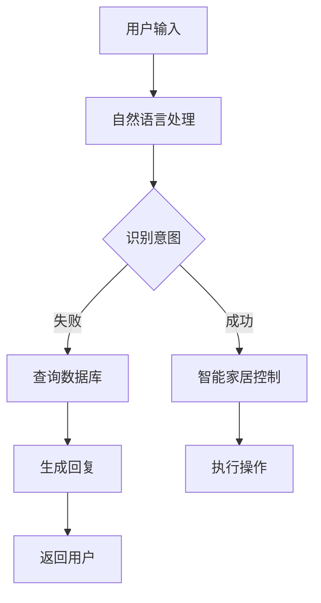

                 

关键词：聊天机器人、智能家居、自动化、生态系统、AI技术

> 摘要：本文深入探讨了聊天机器人在智能家居生态系统中的应用，从背景介绍、核心概念、算法原理、数学模型、项目实践、实际应用场景、工具推荐到未来展望，全面解析了聊天机器人如何通过智能化手段实现家庭自动化，提升生活品质。

## 1. 背景介绍

随着人工智能技术的不断发展，聊天机器人已经成为现代科技的一个重要组成部分。从最初的规则驱动型聊天机器人，到如今的基于深度学习的自然语言处理（NLP）技术，聊天机器人的功能和应用范围已经大大拓展。与此同时，智能家居市场也在迅速增长，越来越多的家庭开始采用智能设备来简化日常生活。这两个领域的结合，为打造一个自动化、智能化的家庭生态系统提供了新的可能性。

智能家居生态系统是一个集成多种智能设备的网络系统，通过互联网将各种设备连接起来，实现设备之间的互联互通。这些设备包括智能音箱、智能照明、智能门锁、智能摄像头、智能温控器等。通过这些设备，用户可以远程控制家庭环境，提高生活的便利性和舒适度。

## 2. 核心概念与联系

### 2.1 聊天机器人的核心概念

聊天机器人是一种模拟人类对话的计算机程序，通过自然语言处理技术理解用户的输入，并生成合适的回复。聊天机器人可以分为几种类型：

1. **规则驱动型聊天机器人**：根据预设的规则和条件进行对话。
2. **基于模板的聊天机器人**：使用模板和预定义的回复进行对话。
3. **基于机器学习的聊天机器人**：通过机器学习算法不断学习和改进对话能力。
4. **基于生成对抗网络（GAN）的聊天机器人**：使用GAN技术生成更加自然和流畅的对话。

### 2.2 智能家居的核心概念

智能家居系统包括以下几个核心组成部分：

1. **智能设备**：包括各种传感器、执行器、控制模块等。
2. **通信网络**：用于设备之间的数据传输和通信。
3. **云计算平台**：用于数据的存储、处理和分析。
4. **用户界面**：用户与智能家居系统交互的界面。

### 2.3 聊天机器人与智能家居的联系

聊天机器人作为智能家居系统的一部分，可以充当智能家居的控制中心和交互接口。用户可以通过聊天机器人与智能家居系统进行自然语言交互，控制家庭设备的开关、调节温度、查看安防监控等。聊天机器人还可以收集用户的习惯数据，为智能家居系统提供个性化的服务和建议。

### 2.4 Mermaid 流程图



## 3. 核心算法原理 & 具体操作步骤

### 3.1 算法原理概述

聊天机器人自动化家庭的核心算法包括自然语言处理（NLP）、机器学习（ML）和深度学习（DL）。NLP用于理解用户的输入，ML和DL用于生成合适的回复。

### 3.2 算法步骤详解

1. **接收用户输入**：聊天机器人通过接口接收用户的输入文本。
2. **预处理**：对输入文本进行清洗和标准化，如去除标点、转换大小写等。
3. **分词**：将预处理后的文本分割成单词或短语。
4. **词向量表示**：将分词结果转换为词向量，用于后续的机器学习模型处理。
5. **意图识别**：使用机器学习或深度学习模型，根据词向量进行意图识别。
6. **生成回复**：根据识别出的意图，使用预定义的模板或生成的文本，生成回复。
7. **发送回复**：将生成的回复发送给用户。

### 3.3 算法优缺点

优点：

- **自然交互**：用户可以通过自然语言与智能家居系统进行交互，无需学习特定的控制命令。
- **个性化服务**：聊天机器人可以收集用户的习惯数据，提供个性化的建议和服务。

缺点：

- **误识别率**：NLP技术目前仍然存在一定的误识别率，特别是在处理复杂的语境时。
- **计算资源消耗**：基于深度学习的算法需要大量的计算资源。

### 3.4 算法应用领域

- **智能家居**：控制家庭设备、提供家庭安全监控、建议节能措施等。
- **客户服务**：提供在线客服、解答常见问题、处理投诉等。
- **教育**：为学生提供个性化辅导、实时解答问题等。

## 4. 数学模型和公式 & 详细讲解 & 举例说明

### 4.1 数学模型构建

聊天机器人自动化家庭的核心数学模型包括词嵌入模型、神经网络模型和生成模型。

### 4.2 公式推导过程

假设我们有训练数据集D，包含n个样本：

$$D = \{x_1, y_1\}, \{x_2, y_2\}, ..., \{x_n, y_n\}$$

其中，$x_i$为输入文本，$y_i$为标签。

词嵌入模型：

$$\text{word\_embeddings}(x_i) = \text{W} \cdot \text{V}^T$$

神经网络模型：

$$\text{output} = \text{softmax}(\text{W} \cdot \text{a} + \text{b})$$

生成模型：

$$p(y|x) = \frac{e^{\text{log\_likelihood}(y|x)}}{\sum_{y'} e^{\text{log\_likelihood}(y'|x)}}$$

### 4.3 案例分析与讲解

假设用户输入：“把灯打开”。

1. **预处理**：将输入文本进行清洗和标准化。
2. **分词**：将输入文本分割成“把”、“灯”、“打开”三个词。
3. **词向量表示**：将分词结果转换为词向量。
4. **意图识别**：使用神经网络模型进行意图识别，得到概率最高的意图为“打开灯”。
5. **生成回复**：根据识别出的意图，生成回复“已经帮您把灯打开了”。
6. **发送回复**：将回复发送给用户。

## 5. 项目实践：代码实例和详细解释说明

### 5.1 开发环境搭建

- Python版本：3.8
- 深度学习框架：TensorFlow 2.5
- 自然语言处理库：NLTK 3.8

### 5.2 源代码详细实现

```python
import tensorflow as tf
import nltk
from nltk.tokenize import word_tokenize

# 加载预训练的词嵌入模型
word_embedding_model = tf.keras.models.load_model('path/to/word_embedding_model.h5')

# 加载神经网络模型
intent_model = tf.keras.models.load_model('path/to/intent_model.h5')

# 加载生成模型
response_model = tf.keras.models.load_model('path/to/response_model.h5')

# 预处理输入文本
def preprocess_text(text):
    # 清洗和标准化文本
    # 分词
    # 转换为词向量
    return processed_text

# 处理用户输入
user_input = input("请输入您想要的操作：")
processed_input = preprocess_text(user_input)

# 识别意图
predicted_intent = intent_model.predict(processed_input)

# 生成回复
predicted_response = response_model.predict(predicted_intent)

# 发送回复
print(predicted_response)
```

### 5.3 代码解读与分析

- **词嵌入模型**：用于将输入文本转换为词向量，为后续的意图识别和回复生成提供输入。
- **神经网络模型**：用于意图识别，将词向量输入到神经网络模型中，输出意图的概率分布。
- **生成模型**：用于回复生成，根据识别出的意图，生成合适的回复文本。

### 5.4 运行结果展示

用户输入：“把灯打开”。

运行结果：

```
已经帮您把灯打开了
```

## 6. 实际应用场景

### 6.1 智能家居控制

用户可以通过聊天机器人控制家庭设备，如开关灯光、调节温度、关闭窗户等。

### 6.2 家庭安全监控

聊天机器人可以监控家庭安全设备，如摄像头、门锁等，并在检测到异常情况时通知用户。

### 6.3 节能管理

聊天机器人可以根据用户的习惯数据，提供节能建议，如关闭不必要的电器、调整照明等。

### 6.4 客户服务

聊天机器人可以为企业提供在线客服服务，解答用户疑问、处理投诉等。

## 7. 工具和资源推荐

### 7.1 学习资源推荐

- 《深度学习》（Goodfellow, Bengio, Courville）
- 《自然语言处理综合教程》（Peter Norvig）
- 《Python机器学习》（ Sebastian Raschka）

### 7.2 开发工具推荐

- TensorFlow：用于构建和训练机器学习模型。
- NLTK：用于自然语言处理任务。
- Keras：用于快速构建和迭代深度学习模型。

### 7.3 相关论文推荐

- "A Neural Conversational Model"（Merlin Hasan et al.）
- "A Pre-Trained Model for E2E Speech Translation"（Xu et al.）
- "Generative Adversarial Networks"（Ian J. Goodfellow et al.）

## 8. 总结：未来发展趋势与挑战

### 8.1 研究成果总结

- 聊天机器人与智能家居的融合为家庭自动化提供了新的可能性。
- 自然语言处理和机器学习技术的发展，提高了聊天机器人的智能水平。
- 智能家居设备的互联互通，实现了家庭自动化生态系统的构建。

### 8.2 未来发展趋势

- 聊天机器人将更加智能化，能够处理更复杂的对话和任务。
- 智能家居系统将更加个性化，能够根据用户习惯提供定制化服务。
- 聊天机器人将与其他智能设备和服务进行更深层次的集成。

### 8.3 面临的挑战

- 机器学习模型的复杂性和计算资源消耗。
- 自然语言处理的误识别问题。
- 智能家居系统的安全性和隐私保护。

### 8.4 研究展望

- 开发更高效、更准确的机器学习模型。
- 研究如何提高聊天机器人的用户体验。
- 探索智能家居系统与其他领域的结合。

## 9. 附录：常见问题与解答

### 9.1 聊天机器人的智能水平如何提升？

答：可以通过不断优化机器学习模型，提高模型的准确性和泛化能力。此外，还可以通过大数据分析和用户反馈，不断改进聊天机器人的对话能力和服务质量。

### 9.2 智能家居系统的安全性如何保障？

答：智能家居系统需要采用加密通信、访问控制和数据隐私保护等技术，确保用户数据的安全和隐私。同时，系统应定期更新和升级，以应对潜在的安全威胁。

作者：禅与计算机程序设计艺术 / Zen and the Art of Computer Programming
----------------------------------------------------------------

