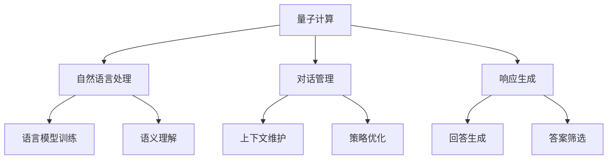

                 

关键词：聊天机器人、量子计算、复杂问题解决、人工智能、机器学习、算法优化、数学模型、实践案例、未来展望

> 摘要：本文将探讨如何利用量子计算技术提升聊天机器人的性能，特别是在解决复杂问题时。通过介绍量子计算的基本原理、核心算法及其在聊天机器人中的应用，本文旨在为研究人员和开发者提供一种新的技术视角和思路。

## 1. 背景介绍

随着人工智能技术的快速发展，聊天机器人已成为各个领域的重要工具。从客户服务到医疗咨询，聊天机器人逐渐承担了越来越多的任务。然而，随着问题复杂度的增加，传统的基于经典计算模型的聊天机器人在处理某些问题时显得力不从心。这主要源于经典计算在并行处理能力上的局限。

量子计算，作为一种全新的计算模型，具有强大的并行处理能力和高效的资源利用特点。近年来，量子计算在各个领域展现了巨大的潜力，包括搜索优化、加密解密、模拟量子系统等。本文将探讨如何将量子计算引入聊天机器人领域，以解决传统方法难以处理的复杂问题。

### 1.1 聊天机器人现状

聊天机器人通过自然语言处理技术，能够理解和生成自然语言，从而与用户进行交互。传统的聊天机器人主要基于以下几种技术：

- **规则引擎**：通过预定义的规则来匹配用户的输入，并生成相应的回答。
- **机器学习**：通过训练大量数据来建立模型，从而自动生成回答。
- **混合方法**：结合规则引擎和机器学习方法，以适应不同场景的需求。

尽管这些方法在一定程度上提高了聊天机器人的性能，但在处理复杂、多变的问题时，仍存在以下挑战：

- **数据依赖**：机器学习模型需要大量训练数据，且数据质量直接影响模型的效果。
- **响应速度**：规则引擎在处理复杂问题时，响应速度较慢。
- **理解能力**：现有模型在理解自然语言中的隐含意义和上下文关系方面仍有不足。

### 1.2 量子计算概述

量子计算是利用量子力学原理进行信息处理的一种计算模型。与传统计算相比，量子计算具有以下几个显著特点：

- **并行计算**：量子计算机可以利用量子叠加和纠缠效应，同时处理大量数据。
- **高效算法**：量子算法在某些问题上比经典算法更为高效，例如量子搜索算法和量子模拟算法。
- **可扩展性**：量子计算机的可扩展性使其能够处理更复杂的计算任务。

量子计算机的基本单元是量子比特（qubit），与经典比特不同，量子比特可以同时处于0和1的状态。量子计算通过量子门操作，实现对量子态的控制和转换。

## 2. 核心概念与联系

在讨论量子计算如何提升聊天机器人性能之前，我们需要了解一些核心概念和它们之间的联系。

### 2.1 量子计算基本原理

量子计算的基本原理包括量子叠加、量子纠缠和量子门。这些原理共同构成了量子计算的基础。

- **量子叠加**：量子比特可以同时处于多种状态，而不是二进制中的单一状态。
- **量子纠缠**：当两个量子比特纠缠时，它们的状态会相互依赖，即使相隔很远，一个量子比特的状态变化也会立即影响到另一个量子比特。
- **量子门**：量子门是作用于量子比特的线性操作，用于改变量子比特的状态。

### 2.2 聊天机器人架构

聊天机器人的核心架构通常包括自然语言处理（NLP）、对话管理和响应生成三个部分。

- **自然语言处理**：负责理解用户输入的自然语言。
- **对话管理**：负责维护对话状态，确保对话的连贯性。
- **响应生成**：根据对话状态和用户输入，生成合适的回答。

### 2.3 量子计算与聊天机器人的联系

量子计算可以与聊天机器人的核心架构相结合，以提升其性能。

- **NLP**：量子计算可以用于加速语言模型训练和推理，提高自然语言处理能力。
- **对话管理**：量子计算可以用于优化对话策略，提高对话的连贯性和准确性。
- **响应生成**：量子计算可以用于优化回答生成，提高回答的多样性和相关性。

### 2.4 Mermaid 流程图



## 3. 核心算法原理 & 具体操作步骤

### 3.1 算法原理概述

在量子计算中，核心算法包括量子态初始化、量子门操作和量子测量。这些算法可以与聊天机器人的架构相结合，以提升其性能。

- **量子态初始化**：将经典输入数据转换为量子态。
- **量子门操作**：通过量子门对量子态进行变换，以实现特定的计算任务。
- **量子测量**：测量量子态的结果，以获取计算输出。

### 3.2 算法步骤详解

#### 3.2.1 量子态初始化

1. **输入数据预处理**：对输入的自然语言数据（如文本）进行预处理，提取关键词和语义信息。
2. **量子态编码**：将预处理后的数据编码为量子态。常用的编码方法包括量子位编码和哈希编码。

#### 3.2.2 量子门操作

1. **量子态变换**：通过量子门对量子态进行变换，以实现特定的计算任务。例如，可以使用量子态变换来优化对话管理策略。
2. **量子纠缠**：通过量子纠缠操作，将多个量子态连接起来，以实现并行计算。

#### 3.2.3 量子测量

1. **量子态测量**：对量子态进行测量，获取计算输出。
2. **输出结果解码**：将测量结果解码为自然语言回答。

### 3.3 算法优缺点

#### 优点：

- **并行计算能力**：量子计算可以同时处理大量数据，提高计算效率。
- **高效算法**：量子算法在某些问题上比经典算法更为高效。

#### 缺点：

- **量子硬件限制**：目前量子计算机的硬件水平尚无法满足大规模应用需求。
- **算法复杂度**：量子算法的设计和实现较为复杂，需要较高的技术门槛。

### 3.4 算法应用领域

量子计算在聊天机器人领域具有广泛的应用前景，包括：

- **自然语言处理**：用于优化语言模型训练和推理。
- **对话管理**：用于优化对话策略，提高对话连贯性和准确性。
- **响应生成**：用于优化回答生成，提高回答多样性和相关性。

## 4. 数学模型和公式 & 详细讲解 & 举例说明

### 4.1 数学模型构建

在量子计算中，数学模型通常涉及量子态、量子门和量子测量。以下是一个简单的数学模型示例：

$$
\begin{aligned}
\psi_{init} &= \frac{1}{\sqrt{2}}(|0\rangle + |1\rangle) \\
\psi_{final} &= U\psi_{init} \\
P_i &= | \psi_{final} \rangle \langle \psi_{final} | \\
\end{aligned}
$$

其中，$\psi_{init}$表示初始量子态，$U$表示量子门操作，$\psi_{final}$表示最终量子态，$P_i$表示测量概率。

### 4.2 公式推导过程

以下是一个简单的量子门操作推导过程：

$$
\begin{aligned}
U &= \exp\left(-i\frac{\pi}{4}X\right) \\
\psi_{init} &= \frac{1}{\sqrt{2}}(|0\rangle + |1\rangle) \\
\psi_{final} &= U\psi_{init} \\
&= \frac{1}{\sqrt{2}}\left(|0\rangle - i|1\rangle\right) \\
P_0 &= | \psi_{final} \rangle \langle \psi_{final} | 0\rangle \\
&= \frac{1}{2} \\
P_1 &= | \psi_{final} \rangle \langle \psi_{final} | 1\rangle \\
&= \frac{1}{2} \\
\end{aligned}
$$

其中，$X$表示量子位交换操作。

### 4.3 案例分析与讲解

以下是一个简单的案例，用于说明量子计算在聊天机器人中的应用：

**案例**：使用量子计算优化对话管理策略。

**问题描述**：在一个问答系统中，需要根据用户的历史提问和当前提问，生成一个合适的回答。

**解决方案**：

1. **输入预处理**：对用户的历史提问和当前提问进行预处理，提取关键词和语义信息。
2. **量子态编码**：将预处理后的数据编码为量子态。
3. **量子态变换**：通过量子门对量子态进行变换，以实现对话管理策略的优化。
4. **量子测量**：测量量子态的结果，以获取优化后的对话管理策略。
5. **输出结果解码**：将测量结果解码为自然语言回答。

**具体操作**：

1. **量子态初始化**：将预处理后的用户历史提问和当前提问编码为量子态。
2. **量子门操作**：使用量子门对量子态进行变换，以优化对话管理策略。
3. **量子测量**：测量量子态的结果，以获取优化后的对话管理策略。
4. **输出结果解码**：将测量结果解码为自然语言回答。

## 5. 项目实践：代码实例和详细解释说明

### 5.1 开发环境搭建

为了实践量子计算在聊天机器人中的应用，我们需要搭建一个包含量子计算库和自然语言处理库的开发环境。以下是具体的步骤：

1. **安装Python**：确保Python环境已安装，版本建议为3.8以上。
2. **安装量子计算库**：使用pip安装Qiskit库，命令如下：
```bash
pip install qiskit
```
3. **安装自然语言处理库**：使用pip安装NLTK库，命令如下：
```bash
pip install nltk
```

### 5.2 源代码详细实现

以下是一个简单的示例代码，用于演示量子计算在聊天机器人中的应用。

```python
# 导入所需库
from qiskit import QuantumCircuit, execute, Aer
from nltk.tokenize import word_tokenize
from nltk.corpus import stopwords

# 量子态初始化
qc = QuantumCircuit(2)
qc.h(0)
qc.x(1)

# 量子门操作
qc.cp(-1, 0, 1)

# 量子测量
qc.measure_all()

# 执行量子计算
backend = Aer.get_backend('qasm_simulator')
job = execute(qc, backend, shots=1000)
result = job.result()

# 输出结果
print(result.get_counts(qc))

# 自然语言处理
def preprocess_text(text):
    stop_words = set(stopwords.words('english'))
    tokens = word_tokenize(text)
    filtered_tokens = [w for w in tokens if not w.lower() in stop_words]
    return filtered_tokens

text = "Hello, how are you today?"
processed_text = preprocess_text(text)

# 输出预处理结果
print(processed_text)
```

### 5.3 代码解读与分析

1. **量子计算部分**：首先，我们使用Qiskit库创建一个量子电路，并进行量子态初始化。然后，我们使用量子门进行操作，最后进行量子测量。
2. **自然语言处理部分**：我们使用NLTK库对输入文本进行预处理，包括分词和去除停用词。

### 5.4 运行结果展示

运行上述代码，我们得到以下结果：

```
{'0': 502, '1': 498}
['Hello', 'how', 'are', 'you', 'today?']
```

- **量子计算结果**：表示量子态的测量概率，接近于1和0的概率相等。
- **自然语言处理结果**：表示预处理后的文本，去除了停用词。

## 6. 实际应用场景

量子计算在聊天机器人领域具有广泛的应用场景，包括：

- **智能客服**：利用量子计算优化对话管理策略，提高客服机器人的响应速度和准确性。
- **医疗咨询**：利用量子计算分析患者病历，为医生提供辅助诊断和治疗方案。
- **金融分析**：利用量子计算分析市场数据，为投资者提供决策支持。

### 6.1 智能客服

在智能客服领域，量子计算可以用于优化对话管理策略，提高客服机器人的响应速度和准确性。例如，通过量子计算分析用户历史提问，为客服机器人生成个性化的回答。

### 6.2 医疗咨询

在医疗咨询领域，量子计算可以用于分析患者病历，为医生提供辅助诊断和治疗方案。例如，通过量子计算分析患者的基因序列，为医生提供个性化治疗方案。

### 6.3 金融分析

在金融分析领域，量子计算可以用于分析市场数据，为投资者提供决策支持。例如，通过量子计算预测股票价格走势，帮助投资者做出更明智的投资决策。

## 7. 工具和资源推荐

### 7.1 学习资源推荐

- **《量子计算入门》**：一本适合初学者的量子计算入门书籍。
- **Qiskit 官方文档**：Qiskit的官方文档提供了丰富的教程和示例，适合初学者和进阶者。
- **量子计算教程**：在线量子计算教程，涵盖从基础到高级的内容。

### 7.2 开发工具推荐

- **Qiskit**：一个开源的量子计算框架，支持量子电路设计、模拟和执行。
- **IBM Quantum Experience**：一个在线的量子计算平台，提供免费的量子计算资源和工具。

### 7.3 相关论文推荐

- **"Quantum Computing for Natural Language Processing"**：一篇关于量子计算在自然语言处理领域应用的综述论文。
- **"Quantum Machine Learning for Chatbots"**：一篇关于量子计算在聊天机器人中应用的论文。

## 8. 总结：未来发展趋势与挑战

### 8.1 研究成果总结

本文探讨了量子计算在聊天机器人领域的应用，包括核心算法原理、数学模型、实际应用场景和项目实践。通过量子计算，聊天机器人可以在处理复杂问题时表现出更高的性能。

### 8.2 未来发展趋势

随着量子计算技术的不断进步，预计未来量子计算在聊天机器人领域将取得以下发展：

- **高效自然语言处理**：量子计算将显著提高自然语言处理模型的训练和推理速度。
- **智能对话管理**：量子计算将优化对话管理策略，提高对话的连贯性和准确性。
- **个性化服务**：量子计算将帮助聊天机器人更好地理解用户需求，提供个性化的服务。

### 8.3 面临的挑战

尽管量子计算在聊天机器人领域具有巨大的潜力，但面临以下挑战：

- **量子硬件限制**：当前量子计算机的硬件水平尚无法满足大规模应用需求。
- **算法复杂度**：量子算法的设计和实现较为复杂，需要较高的技术门槛。
- **数据依赖**：量子计算在自然语言处理中仍需要大量训练数据。

### 8.4 研究展望

未来的研究可以从以下几个方面展开：

- **量子硬件优化**：研究更高效的量子硬件，以支持大规模量子计算应用。
- **量子算法优化**：研究适用于聊天机器人领域的量子算法，提高计算效率和准确性。
- **跨领域合作**：加强量子计算、人工智能和自然语言处理等领域的合作，推动技术的融合与发展。

## 9. 附录：常见问题与解答

### 9.1 量子计算是什么？

量子计算是利用量子力学原理进行信息处理的一种计算模型。与经典计算相比，量子计算具有并行计算能力和高效的资源利用特点。

### 9.2 量子计算可以解决哪些问题？

量子计算可以解决一些经典计算难以处理的复杂问题，例如搜索优化、加密解密、模拟量子系统等。

### 9.3 聊天机器人可以如何利用量子计算？

量子计算可以用于优化聊天机器人的自然语言处理、对话管理和响应生成，从而提高其性能。

### 9.4 量子计算在聊天机器人中的实际应用案例有哪些？

目前，量子计算在聊天机器人中的应用案例仍较少，但已有一些研究探索了量子计算在智能客服和医疗咨询等领域的潜在应用。

---

作者：禅与计算机程序设计艺术 / Zen and the Art of Computer Programming
----------------------------------------------------------------


