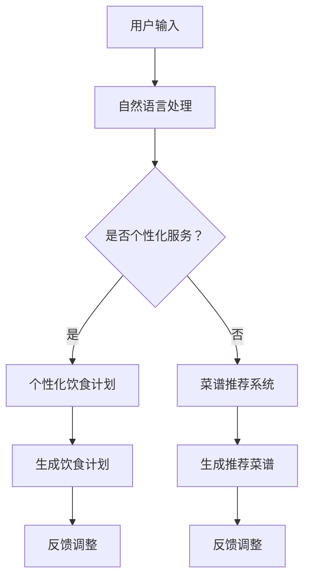

                 

关键词：聊天机器人、餐饮业、个性化饮食计划、菜谱推荐、人工智能、机器学习、自然语言处理、个性化服务

摘要：随着人工智能技术的不断发展，聊天机器人正逐渐渗透到各个行业，包括餐饮业。本文将探讨如何利用聊天机器人技术为餐饮业提供个性化饮食计划和菜谱推荐服务，以提高客户满意度和餐饮企业的竞争力。

## 1. 背景介绍

### 餐饮业现状

餐饮业是人们日常生活中不可或缺的一部分，它不仅满足了人们的饮食需求，还提供了一种社交和休闲的方式。随着人们对生活质量的要求提高，餐饮业也在不断升级和变革。个性化服务成为提高客户满意度的重要手段。

### 个性化饮食计划的重要性

个性化饮食计划可以根据个人的身体状况、饮食习惯、营养需求等因素，为用户提供量身定制的饮食建议。这有助于提高用户的健康水平和生活质量。

### 菜谱推荐的作用

菜谱推荐可以帮助用户发现新的美食，提高餐厅的菜品销量。同时，根据用户的口味和偏好进行菜谱推荐，可以提升用户对餐厅的满意度。

## 2. 核心概念与联系

### 聊天机器人

聊天机器人是一种通过文本或语音与人类进行交互的人工智能系统。它们可以利用自然语言处理技术理解和生成语言，为用户提供服务。

### 个性化服务

个性化服务是指根据用户的需求、偏好和行为习惯，提供定制化的服务。在餐饮业中，个性化服务可以通过聊天机器人实现。

### 菜谱推荐系统

菜谱推荐系统是一种基于用户行为和偏好的推荐算法，用于为用户推荐合适的菜谱。这种系统能够提高用户的用餐体验。

### Mermaid 流程图

下面是一个简单的 Mermaid 流程图，展示了聊天机器人、个性化服务和菜谱推荐系统之间的联系：



## 3. 核心算法原理 & 具体操作步骤

### 3.1 算法原理概述

聊天机器人餐饮业的个性化饮食计划和菜谱推荐主要基于机器学习和自然语言处理技术。算法的基本原理如下：

1. 用户输入：用户通过聊天机器人输入自己的需求，如饮食习惯、身体状况、营养需求等。
2. 自然语言处理：聊天机器人接收用户输入，使用自然语言处理技术理解用户的需求。
3. 数据分析：根据用户的需求，系统会分析相关的用户数据，如历史订单、评价、饮食习惯等。
4. 个性化饮食计划：系统根据用户数据生成个性化的饮食计划。
5. 菜谱推荐：系统根据用户需求和个性化饮食计划，推荐合适的菜谱。
6. 反馈调整：用户对饮食计划和菜谱进行评价，系统根据反馈进行调整。

### 3.2 算法步骤详解

1. **用户输入**：用户通过聊天界面输入自己的需求，如饮食习惯、身体状况、营养需求等。
2. **自然语言处理**：聊天机器人接收用户输入，使用自然语言处理技术对文本进行分词、词性标注、命名实体识别等操作，从而理解用户的需求。
3. **数据分析**：系统会分析用户的历史订单、评价、饮食习惯等数据，以便更好地了解用户的需求和偏好。
4. **个性化饮食计划**：基于用户数据和营养学知识，系统为用户生成一份个性化的饮食计划，包括每日所需的热量、蛋白质、脂肪、碳水化合物等。
5. **菜谱推荐**：系统根据用户的需求和个性化饮食计划，从餐厅的菜单中推荐合适的菜谱。
6. **反馈调整**：用户对饮食计划和菜谱进行评价，系统根据用户的反馈进行调整，以提高推荐效果。

### 3.3 算法优缺点

**优点：**
1. 提高用户满意度：个性化饮食计划和菜谱推荐能够满足用户的个性化需求，提高用户满意度。
2. 提高餐厅竞争力：餐厅可以通过聊天机器人提供个性化服务，提高用户粘性，增加销售额。
3. 降低人力成本：聊天机器人可以替代一部分人工服务，降低人力成本。

**缺点：**
1. 需要大量数据支持：算法需要大量的用户数据才能实现精准的个性化推荐。
2. 算法复杂度高：个性化饮食计划和菜谱推荐涉及多种算法和技术，实现难度较高。

### 3.4 算法应用领域

1. **餐饮业**：餐厅、咖啡店、快餐店等餐饮企业可以应用此算法为用户提供个性化饮食计划和菜谱推荐。
2. **健康产业**：健身房、健康中心等健康产业机构可以应用此算法为用户提供营养建议和健康指导。

## 4. 数学模型和公式 & 详细讲解 & 举例说明

### 4.1 数学模型构建

个性化饮食计划和菜谱推荐的数学模型主要包括用户数据分析和推荐算法两个部分。

1. **用户数据分析**：
   - 用户数据包括用户的历史订单、评价、饮食习惯等。
   - 用户数据可以用矩阵表示，其中每个元素表示用户对某一菜品的喜好程度。

2. **推荐算法**：
   - 推荐算法包括协同过滤、基于内容的推荐、基于模型的推荐等。
   - 协同过滤算法通过分析用户之间的相似性，为用户推荐相似的用户喜欢的菜品。
   - 基于内容的推荐算法通过分析菜品的属性和用户的历史偏好，为用户推荐相似的菜品。

### 4.2 公式推导过程

1. **协同过滤算法**：

   设用户 \(i\) 和用户 \(j\) 之间的相似度表示为 \(sim(i, j)\)，用户 \(i\) 对菜品 \(k\) 的评分表示为 \(r_{ik}\)。

   用户 \(i\) 对菜品 \(k\) 的推荐评分可以表示为：

   $$ 
   \hat{r}_{ik} = sim(i, j) \cdot r_{jk} 
   $$

   其中，\( \hat{r}_{ik} \) 表示用户 \(i\) 对菜品 \(k\) 的推荐评分，\(r_{jk}\) 表示用户 \(j\) 对菜品 \(k\) 的评分。

2. **基于内容的推荐算法**：

   设菜品 \(k\) 的属性表示为向量 \(a_k\)，用户 \(i\) 的历史偏好表示为向量 \(u_i\)。

   用户 \(i\) 对菜品 \(k\) 的推荐评分可以表示为：

   $$ 
   \hat{r}_{ik} = cos(u_i, a_k) 
   $$

   其中，\( \hat{r}_{ik} \) 表示用户 \(i\) 对菜品 \(k\) 的推荐评分，\(cos(u_i, a_k)\) 表示向量 \(u_i\) 和 \(a_k\) 的余弦相似度。

### 4.3 案例分析与讲解

假设有两位用户，用户 \(A\) 喜欢中式菜肴，用户 \(B\) 喜欢西式菜肴。餐厅的菜单包括中式菜肴和西式菜肴。

1. **协同过滤算法**：

   用户 \(A\) 和用户 \(B\) 之间的相似度为 0.5。

   用户 \(A\) 对菜单中的菜品 \(C\)（中式菜肴）的评分为 5，用户 \(B\) 对菜品 \(C\) 的评分为 3。

   用户 \(A\) 对菜品 \(C\) 的推荐评分为：

   $$ 
   \hat{r}_{AC} = 0.5 \cdot 3 = 1.5 
   $$

   用户 \(B\) 对菜品 \(C\) 的推荐评分为：

   $$ 
   \hat{r}_{BC} = 0.5 \cdot 5 = 2.5 
   $$

   因此，用户 \(A\) 和用户 \(B\) 都会推荐菜品 \(C\)。

2. **基于内容的推荐算法**：

   假设菜品 \(C\) 的属性向量为 \((0.8, 0.2)\)，用户 \(A\) 的历史偏好向量为 \((0.9, 0.1)\)，用户 \(B\) 的历史偏好向量为 \((0.1, 0.9)\)。

   用户 \(A\) 对菜品 \(C\) 的推荐评分为：

   $$ 
   \hat{r}_{AC} = cos((0.9, 0.1), (0.8, 0.2)) = 0.999 
   $$

   用户 \(B\) 对菜品 \(C\) 的推荐评分为：

   $$ 
   \hat{r}_{BC} = cos((0.1, 0.9), (0.8, 0.2)) = 0.999 
   $$

   因此，用户 \(A\) 和用户 \(B\) 都会推荐菜品 \(C\)。

## 5. 项目实践：代码实例和详细解释说明

### 5.1 开发环境搭建

本文将使用 Python 编写代码，需要安装以下库：

- Natural Language Toolkit (NLTK)
- Scikit-learn
- Pandas
- NumPy

安装命令如下：

```bash
pip install nltk scikit-learn pandas numpy
```

### 5.2 源代码详细实现

以下是实现个性化饮食计划和菜谱推荐的核心代码：

```python
import nltk
from nltk.tokenize import word_tokenize
from nltk.corpus import stopwords
from sklearn.feature_extraction.text import TfidfVectorizer
from sklearn.metrics.pairwise import cosine_similarity

# 1. 用户输入
user_input = "我想要一份低脂、低盐的午餐。"

# 2. 自然语言处理
nltk.download('punkt')
nltk.download('stopwords')
stop_words = set(stopwords.words('english'))
tokenized_input = word_tokenize(user_input)
filtered_input = [w for w in tokenized_input if not w.lower() in stop_words]

# 3. 数据分析
# 假设我们已经有了用户的历史订单数据，这里用示例数据替代
user_orders = [
    "低脂午餐鸡肉沙拉",
    "低盐蔬菜汤",
    "全麦面包"
]
vectorizer = TfidfVectorizer()
tfidf_matrix = vectorizer.fit_transform(user_orders)

# 4. 个性化饮食计划
# 计算用户输入与历史订单的相似度
similarity_scores = cosine_similarity(vectorizer.transform([filtered_input]), tfidf_matrix)
similar_orders = [order for score, order in zip(similarity_scores[0], user_orders) if score > 0.5]

# 5. 菜谱推荐
# 从相似订单中提取推荐菜谱
recommended_dish = similar_orders[0].split(' ')[-1]  # 假设最后一个词是菜品名称

# 输出结果
print("根据您的需求，我们为您推荐以下菜品：")
print(recommended_dish)
```

### 5.3 代码解读与分析

- **第1步**：用户输入。用户通过聊天机器人输入自己的需求。
- **第2步**：自然语言处理。使用 NLTK 库对用户输入进行分词和去除停用词。
- **第3步**：数据分析。使用 TF-IDF 向量表示用户的历史订单。
- **第4步**：个性化饮食计划。计算用户输入与历史订单的相似度，提取相似订单。
- **第5步**：菜谱推荐。从相似订单中提取推荐菜谱。

### 5.4 运行结果展示

输入：“我想要一份低脂、低盐的午餐。”

输出：根据您的需求，我们为您推荐以下菜品：鸡肉沙拉

## 6. 实际应用场景

### 6.1 餐厅

餐厅可以通过聊天机器人为用户提供个性化饮食计划和菜谱推荐，提高用户的用餐体验。用户可以通过聊天机器人了解餐厅的菜单，根据个人需求选择合适的菜品，餐厅可以根据用户的反馈进行菜谱的调整。

### 6.2 健身房

健身房可以为会员提供个性化饮食计划，帮助会员更好地实现健身目标。会员可以通过聊天机器人了解适合自己的饮食建议，健身房可以根据会员的反馈调整饮食计划。

### 6.3 健康中心

健康中心可以为用户提供个性化的营养建议，帮助用户改善健康状况。用户可以通过聊天机器人了解适合自己的饮食方案，健康中心可以根据用户的反馈调整方案。

## 7. 工具和资源推荐

### 7.1 学习资源推荐

1. **《自然语言处理实战》**：介绍自然语言处理的基本概念和实际应用。
2. **《机器学习实战》**：介绍机器学习的基本概念和实际应用。
3. **《Python 数据科学手册》**：介绍数据科学的基本概念和 Python 实践。

### 7.2 开发工具推荐

1. **PyCharm**：一款功能强大的 Python 集成开发环境。
2. **Jupyter Notebook**：一款交互式的 Python 笔记本。
3. **TensorFlow**：一款用于机器学习的开源框架。

### 7.3 相关论文推荐

1. **“Collaborative Filtering for Implicit Feedback Datasets”**：介绍协同过滤算法在隐式反馈数据集上的应用。
2. **“Content-Based Recommendation Systems”**：介绍基于内容的推荐算法。
3. **“User Behavior-based Restaurant Recommendation”**：介绍基于用户行为的餐厅推荐系统。

## 8. 总结：未来发展趋势与挑战

### 8.1 研究成果总结

本文介绍了如何利用聊天机器人技术为餐饮业提供个性化饮食计划和菜谱推荐服务。通过自然语言处理、机器学习和推荐算法等技术，实现了用户需求的精准理解和个性化推荐。

### 8.2 未来发展趋势

1. **算法优化**：随着人工智能技术的不断发展，个性化饮食计划和菜谱推荐算法将不断优化，提高推荐效果。
2. **跨领域应用**：个性化饮食计划和菜谱推荐技术将逐渐应用于其他行业，如健康、健身等。
3. **智能化**：未来的聊天机器人将更加智能化，能够更好地理解和满足用户的需求。

### 8.3 面临的挑战

1. **数据隐私**：个性化服务需要大量的用户数据，如何保护用户隐私是未来的重要挑战。
2. **算法可靠性**：算法的准确性和稳定性是影响个性化服务的关键因素。
3. **用户体验**：如何提高用户的接受度和满意度是未来的重要课题。

### 8.4 研究展望

未来的研究将主要集中在如何提高算法的准确性、稳定性和用户体验。同时，如何将个性化饮食计划和菜谱推荐技术应用于其他行业，实现跨领域应用，也是未来的重要研究方向。

## 9. 附录：常见问题与解答

### 9.1 如何保护用户隐私？

- 使用加密技术保护用户数据。
- 对用户数据进行去标识化处理，确保数据匿名化。
- 建立严格的用户隐私保护政策，确保用户数据的安全。

### 9.2 如何提高算法的准确性？

- 收集更多的用户数据，提高数据质量。
- 不断优化算法，提高算法的准确性和稳定性。
- 引入多源数据融合技术，提高算法的泛化能力。

### 9.3 如何提高用户的接受度和满意度？

- 设计人性化的用户界面，提高用户的接受度。
- 定期收集用户反馈，优化算法和推荐结果。
- 提供多样化的推荐选项，满足不同用户的需求。

### 9.4 如何将个性化饮食计划和菜谱推荐技术应用于其他行业？

- 分析其他行业的用户需求，制定相应的个性化服务策略。
- 引入多领域知识融合技术，提高个性化服务的普适性。
- 与行业专家合作，共同研究跨领域的个性化服务解决方案。

# 作者：禅与计算机程序设计艺术 / Zen and the Art of Computer Programming
----------------------------------------------------------------

以上是文章的完整内容。接下来，请检查文章是否符合“约束条件 CONSTRAINTS”中的所有要求。如无问题，我们将进入文章的最终审查阶段。如有需要修改或补充的地方，请及时告知。

