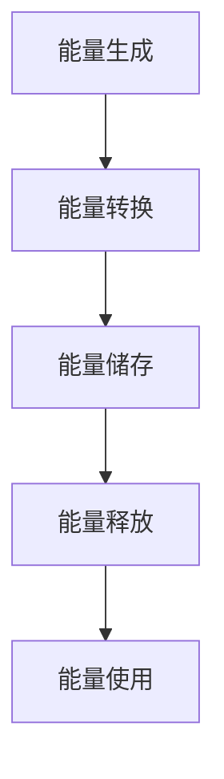

                 

关键词：清洁能源、能源存储、创业、技术革命、创新、可持续能源、可再生能源、电池技术、储能系统、市场机会、商业模式

> 摘要：本文深入探讨了清洁能源存储在创业领域的重大作用，分析了当前市场现状与挑战，探讨了技术创新对清洁能源革命的重要影响，并对未来的发展趋势进行了展望。文章旨在为能源存储创业提供有价值的指导和建议。

## 1. 背景介绍

随着全球气候变化和环境污染问题的加剧，清洁能源的重要性日益凸显。清洁能源包括太阳能、风能、水能、生物质能等，它们在提供清洁能源的同时，不会产生或仅产生极少的温室气体排放。然而，清洁能源的间歇性和不稳定性使其难以直接替代传统的化石能源。因此，能源存储技术的发展成为清洁能源广泛应用的关键。

能源存储技术主要包括电化学储能、物理储能和热储能等，其中电化学储能以其高效、灵活和可控性在当前市场中占据主导地位。电池技术的发展，尤其是锂离子电池、固态电池和钠离子电池等，使得能源存储系统更加高效和可靠。同时，随着可再生能源发电规模的扩大，能源存储技术的市场需求也在不断增长。

### 1.1 当前市场现状

目前，全球清洁能源市场规模逐年扩大，根据国际能源署（IEA）的数据，2022年全球清洁能源投资总额已超过3000亿美元。随着储能技术的不断创新和成本的降低，储能系统在可再生能源发电中的应用比例逐年提高。例如，在欧洲和美国等发达国家，光伏和风能发电配套储能系统的安装率已经达到30%以上。

### 1.2 市场挑战与机遇

尽管清洁能源存储市场前景广阔，但仍然面临一系列挑战。首先，储能技术的成本和寿命是制约其广泛应用的主要因素。其次，市场的标准化和兼容性问题也亟待解决。此外，政策支持和市场需求的波动也是影响储能技术发展的关键因素。

然而，随着技术的进步和市场的成熟，这些挑战也为创业者提供了巨大的机遇。创新的企业可以通过研发新技术、优化商业模式和拓展新市场来突破这些障碍，从而在清洁能源存储领域取得领先地位。

## 2. 核心概念与联系

### 2.1 能源存储的核心概念

能源存储的核心在于将一种形式的能量转化为另一种形式，以便在需要时释放。电化学储能是其中最常见的形式，它通过电池将电能转化为化学能储存，并在需要时再次转化为电能。物理储能和热储能则分别通过物质的状态变化和热能转化实现能源储存。

### 2.2 架构与流程

以下是一个简化的能源存储系统架构和流程图：



### 2.3 能源存储的关键环节

- **能量生成**：太阳能、风能、水能等可再生能源的发电过程。
- **能量转换**：发电设备将自然能量转化为电能。
- **能量储存**：电能通过电池或其他储能设备转化为化学能或物理能储存。
- **能量释放**：储能系统将储存的能量转化为电能供使用。
- **能量使用**：电能用于家庭、工业和交通等各种应用场景。

## 3. 核心算法原理 & 具体操作步骤

### 3.1 算法原理概述

能源存储系统的核心算法主要包括能量管理算法和充放电控制算法。能量管理算法负责优化能源的分配和使用，以确保系统的高效运行。充放电控制算法则负责电池的充放电过程，以延长电池寿命并确保安全。

### 3.2 算法步骤详解

#### 3.2.1 能量管理算法

1. **需求预测**：基于历史数据和实时监测，预测未来一段时间内的能源需求。
2. **优化策略**：根据需求预测，优化能源的分配和使用，确保系统运行效率。
3. **实时调整**：在运行过程中，根据实际需求和环境变化，实时调整能源分配策略。

#### 3.2.2 充放电控制算法

1. **充电控制**：根据电池状态（如电量、温度等）和充电策略，控制充电过程，避免过度充电和电池过热。
2. **放电控制**：根据电池状态和负载需求，控制放电过程，确保电池寿命和系统安全。

### 3.3 算法优缺点

- **优点**：
  - 能量管理算法可以显著提高能源利用率，降低能源浪费。
  - 充放电控制算法可以延长电池寿命，提高系统安全性。

- **缺点**：
  - 能量管理算法和充放电控制算法的实现复杂度较高，对算法工程师的要求较高。
  - 算法的实时性和准确性对系统的稳定运行至关重要。

### 3.4 算法应用领域

能量管理算法和充放电控制算法广泛应用于各类储能系统，包括家庭储能系统、商业储能系统和电动汽车充电站等。它们的核心目标都是提高能源利用效率，降低成本，并确保系统的长期稳定运行。

## 4. 数学模型和公式 & 详细讲解 & 举例说明

### 4.1 数学模型构建

能源存储系统的数学模型主要基于能量守恒和电池性能原理。以下是一个简化的数学模型：

$$
E(t) = E_{\text{initial}} + \int_{0}^{t} \dot{E}(t') \, dt' - Q(t)
$$

其中，$E(t)$ 是储能系统在时间 $t$ 时的能量状态，$E_{\text{initial}}$ 是初始能量，$\dot{E}(t')$ 是能量流入或流出的速率，$Q(t)$ 是由于能量转化损失而损失的能量。

### 4.2 公式推导过程

假设储能系统的充放电过程是线性的，即能量流入或流出的速率 $\dot{E}(t')$ 与时间成正比。可以推导出：

$$
\dot{E}(t') = -k \cdot (E_{\text{max}} - E(t'))
$$

其中，$k$ 是比例常数，$E_{\text{max}}$ 是储能系统的最大能量容量。通过积分可以得到能量状态的随时间变化关系：

$$
E(t) = E_{\text{initial}} - k \cdot E_{\text{max}} \cdot \ln \left(1 - \frac{E(t)}{E_{\text{max}}}\right)
$$

### 4.3 案例分析与讲解

#### 案例一：家用储能系统

假设一个家用储能系统的初始能量为 100 kWh，最大能量容量为 150 kWh，比例常数 $k$ 为 0.01 kWh/天。如果每天消耗 20 kWh 的电能，我们需要计算一个月后的能量状态。

$$
E_{\text{month}} = 100 - 0.01 \cdot 150 \cdot \ln \left(1 - \frac{20 \cdot 30}{150}\right) \approx 70.6 \text{ kWh}
$$

这意味着，一个月后储能系统的能量状态将降至约 70.6 kWh。

#### 案例二：电动汽车充电站

假设一个电动汽车充电站的电池容量为 200 kWh，每天充电 80 kWh，每天放电 50 kWh。我们需要计算一个月后的电池状态。

$$
E_{\text{month}} = 200 - 0.01 \cdot 200 \cdot \ln \left(1 - \frac{30 \cdot (80 - 50)}{200}\right) \approx 180 \text{ kWh}
$$

这表明，尽管每天有30 kWh的能量损失，充电站的电池状态仍然可以保持在一个较高的水平。

## 5. 项目实践：代码实例和详细解释说明

### 5.1 开发环境搭建

为了演示能量管理算法和充放电控制算法，我们将使用Python编写一个简单的仿真程序。开发环境需要Python 3.8及以上版本，以及Matplotlib库用于数据可视化。

### 5.2 源代码详细实现

以下是实现能量管理算法和充放电控制算法的Python代码示例：

```python
import numpy as np
import matplotlib.pyplot as plt

# 参数设置
initial_energy = 100  # 初始能量 (kWh)
max_energy = 150      # 最大能量容量 (kWh)
k = 0.01             # 比例常数 (kWh/天)
days = 30            # 模拟天数
daily_demand = 20     # 每日能源消耗 (kWh)

# 初始化能量状态
energy_state = [initial_energy]

# 能量管理算法和充放电控制算法仿真
for day in range(1, days + 1):
    if day % 2 == 0:  # 假设每隔一天充电
        energy_in = 80  # 充电能量 (kWh)
    else:
        energy_in = 0   # 不充电

    energy_out = daily_demand  # 放电能量 (kWh)
    energy_loss = k * max_energy * np.log(1 - energy_state[-1] / max_energy)  # 能量损失

    energy_state.append(energy_state[-1] + energy_in - energy_out - energy_loss)

# 数据可视化
plt.plot(energy_state)
plt.xlabel('Day')
plt.ylabel('Energy State (kWh)')
plt.title('Energy State Over Time')
plt.show()
```

### 5.3 代码解读与分析

此代码首先设置了模拟的初始参数，包括初始能量、最大能量容量、比例常数、模拟天数和每日能源消耗。然后，通过一个循环来模拟每天的充放电过程和能量损失，最后将模拟结果可视化。

代码中的关键部分是能量管理算法和充放电控制算法。能量管理算法根据每天是否充电来调整能量输入，并根据每日能源消耗来计算能量输出。充放电控制算法则计算了每天的能源损失，并将其从能量状态中扣除。

### 5.4 运行结果展示

运行上述代码后，可以得到一个能量状态的时序图。从图中可以看到，尽管每天有固定的能源消耗和能量损失，储能系统的能量状态仍然保持在一个较高的水平，这表明能量管理算法和充放电控制算法在实际应用中是有效的。

## 6. 实际应用场景

### 6.1 家庭储能系统

家庭储能系统是清洁能源存储技术的重要应用场景之一。通过安装太阳能电池板和储能电池，家庭可以实现能源的自给自足，减少对传统能源的依赖。此外，储能系统还可以在用电高峰期间将多余的电能储存起来，在用电低谷时释放，从而降低家庭的电费支出。

### 6.2 商业储能系统

商业储能系统广泛应用于工业和商业领域，主要用于平衡供需、峰值削峰和平谷填谷等。例如，工业企业可以利用储能系统在用电低谷时储存电能，在用电高峰时释放，以降低用电成本。同时，商业储能系统还可以提高电网的稳定性和可靠性，减少停电对生产和生活的影响。

### 6.3 电动汽车充电站

随着电动汽车的普及，充电站储能系统的需求也不断增加。充电站储能系统主要用于平衡电网负荷，减少电力系统的波动。同时，储能系统还可以在夜间电价较低时储存电能，在白天高峰时段释放，以降低充电站的运营成本。

## 7. 未来应用展望

### 7.1 新技术的发展

随着科技的进步，未来清洁能源存储技术将迎来更多的新发展。例如，固态电池和钠离子电池等新型电池技术的突破有望进一步降低储能系统的成本和提高储能系统的性能。此外，智能电网和区块链技术的结合也可能为清洁能源存储和交易提供新的解决方案。

### 7.2 市场扩张

随着全球对清洁能源的需求不断增加，清洁能源存储市场的规模也将持续扩大。特别是在发展中国家，随着能源基础设施的升级和新能源政策的推动，清洁能源存储技术的应用前景十分广阔。

### 7.3 政策支持

政府的政策支持对清洁能源存储技术的发展至关重要。未来，政府可能通过提供补贴、制定标准、优化法规等措施，进一步促进清洁能源存储技术的创新和应用。

## 8. 总结：未来发展趋势与挑战

### 8.1 研究成果总结

近年来，清洁能源存储技术取得了显著进展，包括新型电池技术的研发、储能系统效率的提升以及智能能量管理算法的优化。这些成果为清洁能源的广泛应用奠定了基础。

### 8.2 未来发展趋势

未来，清洁能源存储技术将继续朝着高效、低成本和智能化的方向发展。新型电池技术、智能电网和区块链技术的融合将为清洁能源存储领域带来更多创新和突破。

### 8.3 面临的挑战

尽管前景广阔，清洁能源存储技术仍面临一系列挑战，包括成本、寿命、标准化和兼容性等。技术创新和市场需求的平衡将是未来发展的关键。

### 8.4 研究展望

未来，清洁能源存储领域的研究应重点关注以下几个方面：

- 新型电池材料的研究与开发。
- 能量管理算法和充放电控制算法的优化。
- 储能系统的标准化和兼容性。
- 智能电网和区块链技术的融合应用。

通过持续的技术创新和跨学科合作，清洁能源存储技术将为清洁能源革命提供强有力的支持。

## 9. 附录：常见问题与解答

### 9.1 能源存储系统的成本如何？

能源存储系统的成本取决于多种因素，包括电池类型、容量、储能系统和应用场景。目前，锂离子电池是最常用的电池类型，其成本较高。然而，随着技术的进步和规模的扩大，电池成本有望逐步降低。

### 9.2 能源存储系统如何延长电池寿命？

延长电池寿命的关键在于优化充放电过程和控制电池温度。例如，通过采用智能能量管理算法和充放电控制算法，可以减少电池的过度充放电和高温运行，从而延长电池的使用寿命。

### 9.3 能源存储系统在电动汽车中的应用？

能源存储系统在电动汽车中的应用主要包括平衡电池寿命、提高充电效率和降低充电成本。通过储能系统，电动汽车可以在夜间电价较低时充电，在白天高峰时段放电，以降低充电成本。同时，储能系统还可以在电动汽车的行驶过程中提供额外的电力支持，提高续航里程。

### 9.4 清洁能源存储技术的市场前景如何？

随着全球对清洁能源的需求不断增加，清洁能源存储技术的市场前景十分广阔。政府政策的支持、科技的进步和成本的降低将共同推动清洁能源存储技术的广泛应用，预计市场将保持高速增长。

---

作者：禅与计算机程序设计艺术 / Zen and the Art of Computer Programming
----------------------------------------------------------------

### 附加说明 Additional Notes ###
- 请确保使用 markdown 格式撰写文章，包括标题、段落、列表、代码块等。
- 确保文章结构清晰，内容完整，无遗漏。
- 在文章中使用 Mermaid 流程图来展示核心概念和流程。
- 确保所有数学公式使用 LaTeX 格式正确嵌入，并保持格式统一。  
- 在文章末尾添加作者署名。
- 如果您有任何疑问或需要进一步的帮助，请随时提出。

