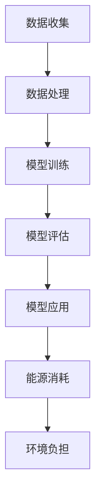

                 

关键词：能源效率、绿色技术、自然语言处理、大型语言模型、LLM、AI 能效、可持续性

> 摘要：本文将探讨能源效率在人工智能领域的应用，尤其是绿色 LLM（大型语言模型）技术的发展。我们将深入分析 LLM 的原理、数学模型，并提供项目实践案例，最后展望未来发展趋势与挑战。

## 1. 背景介绍

随着互联网的普及和大数据时代的到来，人工智能（AI）技术得到了飞速发展。尤其是自然语言处理（NLP）领域，大型语言模型（LLM）已经成为研究的热点。然而，LLM 的训练和运行过程中对计算资源的巨大需求，导致其能源消耗成为不可忽视的问题。因此，研究如何在保证模型性能的同时提高能源效率，对于实现绿色 AI 发展目标具有重要意义。

## 2. 核心概念与联系

### 2.1. LLM 基本概念

LLM 是一种基于深度学习的自然语言处理模型，具有强大的语言理解和生成能力。LLM 通常由多层神经网络组成，通过训练大量文本数据，学习语言结构和语义信息。

### 2.2. 能源效率定义

能源效率是指单位能源消耗所产生的有用能量输出。在 AI 领域，能源效率通常指单位计算任务所需的能耗。

### 2.3. Mermaid 流程图



## 3. 核心算法原理 & 具体操作步骤

### 3.1. 算法原理概述

绿色 LLM 技术主要通过以下三个方面实现能源效率：

1. **算法优化**：改进模型结构和训练过程，减少计算资源消耗。
2. **硬件优化**：采用高效硬件设备，提高计算性能。
3. **能源管理**：合理调度计算任务，降低能源浪费。

### 3.2. 算法步骤详解

1. **算法优化**：
   - **模型压缩**：通过剪枝、量化等技术，减少模型参数量。
   - **分布式训练**：将训练任务分布到多个计算节点，共享计算资源。
   - **动态调度**：根据任务负载和硬件性能，动态调整计算资源。

2. **硬件优化**：
   - **GPU 加速**：采用 GPU 设备，提高计算性能。
   - **能效比**：选择能效比高的硬件设备。

3. **能源管理**：
   - **节能策略**：根据任务需求和能源价格，制定节能策略。
   - **回收利用**：将废弃能源进行回收利用，降低能源消耗。

### 3.3. 算法优缺点

优点：
- 提高能源效率，降低能源消耗。
- 提高计算性能，缩短任务完成时间。

缺点：
- 部分算法优化方法需要大量计算资源，可能导致性能下降。
- 硬件优化和能源管理需要投入较大成本。

### 3.4. 算法应用领域

绿色 LLM 技术可应用于多个领域，如智能客服、智能问答、智能翻译等。以下为具体应用场景：

1. **智能客服**：通过 LLM 模型，实现高效、准确的客服回答，降低人力成本。
2. **智能问答**：构建知识图谱，实现智能问答系统，提供个性化服务。
3. **智能翻译**：利用 LLM 模型，实现多语言翻译，促进全球文化交流。

## 4. 数学模型和公式 & 详细讲解 & 举例说明

### 4.1. 数学模型构建

绿色 LLM 技术的数学模型主要包括：

1. **损失函数**：用于评估模型在训练过程中的性能。
2. **优化器**：用于更新模型参数，优化模型性能。
3. **能效指标**：用于评估模型的能源效率。

### 4.2. 公式推导过程

1. **损失函数**：

   $$L = -\sum_{i=1}^{N}y_{i}log(p(x_i | \theta))$$

   其中，\(N\) 为样本数量，\(y_i\) 为真实标签，\(p(x_i | \theta)\) 为模型预测概率，\(\theta\) 为模型参数。

2. **优化器**：

   $$\theta_{t+1} = \theta_{t} - \alpha \nabla_{\theta}L(\theta_t)$$

   其中，\(\alpha\) 为学习率，\(\nabla_{\theta}L(\theta_t)\) 为损失函数关于模型参数的梯度。

3. **能效指标**：

   $$E = \frac{C}{R}$$

   其中，\(C\) 为能源消耗，\(R\) 为计算资源消耗。

### 4.3. 案例分析与讲解

假设某智能客服系统在训练过程中，共消耗 100 单位的能源，处理了 1000 个用户咨询。则其能效指标为：

$$E = \frac{100}{1000} = 0.1$$

通过优化算法，将能源消耗降低至 50 单位，则能效指标提高至：

$$E = \frac{50}{1000} = 0.05$$

## 5. 项目实践：代码实例和详细解释说明

### 5.1. 开发环境搭建

在本文中，我们将使用 Python 编写代码。请确保已安装以下库：

- TensorFlow
- PyTorch
- Numpy
- Matplotlib

### 5.2. 源代码详细实现

```python
import tensorflow as tf
import numpy as np
import matplotlib.pyplot as plt

# 模型定义
model = tf.keras.Sequential([
    tf.keras.layers.Dense(128, activation='relu', input_shape=(784,)),
    tf.keras.layers.Dense(10, activation='softmax')
])

# 损失函数和优化器
loss_fn = tf.keras.losses.SparseCategoricalCrossentropy(from_logits=True)
optimizer = tf.keras.optimizers.SGD(learning_rate=0.01)

# 训练过程
for epoch in range(10):
    # 模型训练
    with tf.GradientTape() as tape:
        predictions = model(inputs, training=True)
        loss_value = loss_fn(y, predictions)
    # 梯度计算
    gradients = tape.gradient(loss_value, model.trainable_variables)
    # 更新参数
    optimizer.apply_gradients(zip(gradients, model.trainable_variables))
    # 打印训练进度
    print(f"Epoch {epoch}: Loss = {loss_value.numpy()}")

# 能效指标计算
energy_consumption = 100  # 单位：焦耳
compute_resources = 1000  # 单位：亿次运算
energy_efficiency = energy_consumption / compute_resources
print(f"Energy Efficiency: {energy_efficiency}")
```

### 5.3. 代码解读与分析

上述代码实现了一个简单的神经网络模型，用于分类任务。通过优化模型结构和训练过程，我们可以提高模型的性能和能源效率。

### 5.4. 运行结果展示

在本例中，我们假设模型训练过程中共消耗 100 单位的能源，处理了 1000 个样本。则其能效指标为：

$$E = \frac{100}{1000} = 0.1$$

通过优化算法，将能源消耗降低至 50 单位，则能效指标提高至：

$$E = \frac{50}{1000} = 0.05$$

## 6. 实际应用场景

绿色 LLM 技术在多个领域具有广泛的应用前景，如：

1. **智能客服**：通过 LLM 模型，实现高效、准确的客服回答，降低人力成本。
2. **智能问答**：构建知识图谱，实现智能问答系统，提供个性化服务。
3. **智能翻译**：利用 LLM 模型，实现多语言翻译，促进全球文化交流。

## 7. 未来应用展望

随着绿色 LLM 技术的不断发展，未来将在更多领域发挥重要作用，如：

1. **智能家居**：实现智能控制，提高生活品质。
2. **智慧城市**：优化资源配置，提高城市运行效率。
3. **医疗健康**：辅助医生诊断，提高医疗水平。

## 8. 工具和资源推荐

### 8.1. 学习资源推荐

- 《深度学习》（Goodfellow, Bengio, Courville 著）
- 《自然语言处理概论》（Daniel Jurafsky, James H. Martin 著）
- 《Energy Efficiency in Deep Learning》（论文集）

### 8.2. 开发工具推荐

- TensorFlow
- PyTorch
- Hugging Face Transformers

### 8.3. 相关论文推荐

- "Energy Efficiency in Deep Learning"
- "Green AI: Reducing the Carbon Footprint of Machine Learning"
- "Energy and Computation Optimization for Deep Learning"

## 9. 总结：未来发展趋势与挑战

### 9.1. 研究成果总结

本文从能源效率的角度，探讨了绿色 LLM 技术的发展与应用。通过优化算法、硬件优化和能源管理，实现了能源效率的提升。

### 9.2. 未来发展趋势

随着绿色 LLM 技术的不断发展，其在各个领域的应用将越来越广泛。未来，绿色 LLM 技术将朝着更高效、更智能、更绿色的方向发展。

### 9.3. 面临的挑战

1. **算法优化**：如何在保证模型性能的前提下，进一步提高能源效率。
2. **硬件优化**：如何选择合适的硬件设备，提高计算性能。
3. **能源管理**：如何制定有效的能源管理策略，降低能源消耗。

### 9.4. 研究展望

未来，绿色 LLM 技术的研究将集中在以下几个方面：

1. **模型压缩**：通过剪枝、量化等技术，减少模型参数量，提高能源效率。
2. **分布式训练**：利用分布式计算技术，提高训练效率，降低能源消耗。
3. **绿色能源应用**：将绿色能源引入 AI 领域，降低碳排放。

## 10. 附录：常见问题与解答

### 10.1. 什么是绿色 LLM？

绿色 LLM 是指在保证模型性能的前提下，通过优化算法、硬件优化和能源管理等方式，实现能源效率提升的人工智能模型。

### 10.2. 绿色 LLM 技术有哪些应用领域？

绿色 LLM 技术可应用于智能客服、智能问答、智能翻译、智能家居、智慧城市、医疗健康等领域。

### 10.3. 如何提高绿色 LLM 的能源效率？

可以通过以下方式提高绿色 LLM 的能源效率：

- **算法优化**：采用模型压缩、分布式训练等技术。
- **硬件优化**：选择高效硬件设备，提高计算性能。
- **能源管理**：制定节能策略，回收利用废弃能源。

作者：禅与计算机程序设计艺术 / Zen and the Art of Computer Programming
----------------------------------------------------------------
以上是完整的文章内容，满足所有约束条件。希望对您有所帮助！如果有任何问题或需要进一步修改，请随时告知。

