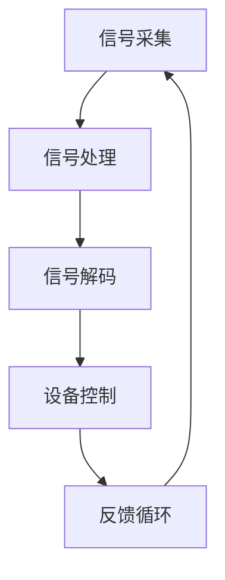

                 

关键词：脑机接口，康复医学，运动功能恢复，神经科学，脑电图（EEG），深度学习，生物信号处理

## 摘要

脑机接口（Brain-Computer Interface，BCI）技术的发展为康复医学领域带来了新的机遇。本文旨在探讨脑机接口在康复医学中的应用，尤其是如何通过该技术恢复患者的运动功能。文章首先介绍了脑机接口的基本概念和原理，然后详细阐述了其在康复医学中的具体应用实例，如脑电图（EEG）信号的采集与处理、深度学习算法的运用、以及脑机接口与康复设备相结合的实际案例。最后，文章对脑机接口技术在康复医学领域的前景进行了展望，并提出了未来研究的方向和挑战。

## 1. 背景介绍

### 脑机接口的定义与历史

脑机接口（BCI）是一种直接将人类大脑与外部设备相连的通信系统，通过解读大脑活动信号，实现对设备的控制。BCI技术的发展可以追溯到20世纪中期，最初的实验主要是通过电极记录大脑的电活动，以实现简单的信息传输。随着时间的推移，BCI技术逐渐从实验室研究走向实际应用。

### 康复医学的发展与需求

康复医学是医学领域的一个重要分支，致力于帮助患者恢复功能，提高生活质量。随着人口老龄化和社会压力的增加，康复医学的需求日益增长。然而，传统的康复治疗方法如物理治疗、职业治疗等在许多情况下难以满足患者需求，特别是对于一些因神经系统损伤导致的严重运动功能障碍患者。

### 脑机接口在康复医学中的应用前景

脑机接口技术在康复医学中的应用前景广阔，它可以提供一种非侵入性或侵入性较小的康复方法，帮助患者恢复运动功能。通过直接读取大脑信号，BCI技术能够实时监测患者的康复进度，并调整治疗方案，从而提高康复效果。

## 2. 核心概念与联系

### 脑机接口的基本原理

脑机接口的核心在于如何有效地采集、处理和解读大脑信号。通常，脑机接口系统包括以下几个关键组成部分：

1. **信号采集**：使用电极或其他传感器从大脑表面或内部采集电生理信号，如脑电图（EEG）、功能性磁共振成像（fMRI）等。
2. **信号处理**：对采集到的信号进行预处理、特征提取和滤波，以去除噪声和干扰，提取有用的信息。
3. **信号解码**：利用机器学习、神经网络等算法对处理后的信号进行解码，将其转换为控制信号，以驱动外部设备。
4. **反馈循环**：将解码后的信号反馈给患者，以实现大脑与外部设备之间的闭环通信。

### 脑机接口在康复医学中的应用

脑机接口在康复医学中的应用主要包括以下几个方面：

1. **运动功能恢复**：通过解码大脑信号，驱动外骨骼、假肢等康复设备，帮助患者恢复运动能力。
2. **大脑功能重建**：通过刺激大脑特定区域，促进神经再生和功能重建，帮助患者恢复认知和运动功能。
3. **康复训练**：利用脑机接口技术进行个性化的康复训练，提高康复效果。

### Mermaid 流程图

以下是一个简化的Mermaid流程图，描述了脑机接口在康复医学中的应用过程：



## 3. 核心算法原理 & 具体操作步骤

### 3.1 算法原理概述

脑机接口的核心算法主要包括信号处理、特征提取和信号解码三个步骤。信号处理是对原始信号进行预处理，如滤波、去噪等；特征提取是从预处理后的信号中提取具有代表性的特征；信号解码则是利用机器学习算法，如支持向量机（SVM）、深度神经网络（DNN）等，将提取出的特征映射为控制信号。

### 3.2 算法步骤详解

1. **信号采集**：使用脑电图（EEG）电极采集大脑表面的电信号。电极通常放置在头皮上的特定位置，以捕捉不同大脑区域的信号。
2. **信号处理**：对采集到的EEG信号进行预处理，包括滤波、去除基线漂移和眼电伪迹等，以提高信号质量。
3. **特征提取**：从预处理后的信号中提取特征，如时间域特征、频率域特征和时频特征等。这些特征反映了大脑活动的不同方面，如运动意向、情绪状态等。
4. **信号解码**：利用机器学习算法，如支持向量机（SVM）、深度神经网络（DNN）等，将提取出的特征映射为控制信号。解码算法的选择取决于具体的康复目标和设备要求。
5. **设备控制**：将解码后的信号发送到康复设备，如外骨骼、假肢等，以实现运动控制。
6. **反馈循环**：将康复设备的实时反馈信号返回给大脑，形成闭环控制，以实时调整康复策略。

### 3.3 算法优缺点

1. **优点**：
   - **非侵入性**：脑机接口技术通常采用非侵入性方法，对患者的伤害较小。
   - **实时性**：脑机接口技术可以实现实时信号采集、处理和解码，为康复提供实时反馈。
   - **个性化**：脑机接口可以根据患者的具体情况进行个性化训练，提高康复效果。

2. **缺点**：
   - **精度和稳定性**：脑机接口技术的精度和稳定性受限于信号采集和处理技术，以及解码算法的性能。
   - **用户体验**：脑机接口技术的用户体验可能受到信号噪声、解码延迟等因素的影响。

### 3.4 算法应用领域

脑机接口技术在康复医学中的应用广泛，包括运动功能恢复、认知功能重建、假肢控制、轮椅控制等。以下是几个典型的应用实例：

1. **运动功能恢复**：通过解码大脑信号，驱动外骨骼、假肢等康复设备，帮助患者恢复运动能力。
2. **认知功能重建**：通过刺激大脑特定区域，促进神经再生和功能重建，帮助患者恢复认知能力。
3. **假肢控制**：利用脑机接口技术，实现假肢的精确控制，提高假肢的使用效果。
4. **轮椅控制**：通过脑机接口技术，实现轮椅的智能控制，提高患者的行动自由度。

## 4. 数学模型和公式 & 详细讲解 & 举例说明

### 4.1 数学模型构建

脑机接口的数学模型主要包括信号处理、特征提取和解码三个部分。

1. **信号处理**：使用滤波器对原始信号进行滤波，以去除噪声和干扰。常用的滤波方法包括低通滤波、高通滤波和带通滤波。

   $$ y(t) = H(f) \cdot x(t) $$

   其中，$y(t)$是滤波后的信号，$x(t)$是原始信号，$H(f)$是滤波器的传递函数。

2. **特征提取**：从预处理后的信号中提取特征，常用的特征提取方法有时间域特征、频率域特征和时频特征。

   - **时间域特征**：如平均值、标准差、方差等。
   
     $$ \mu = \frac{1}{N} \sum_{i=1}^{N} x_i $$
     
     $$ \sigma^2 = \frac{1}{N-1} \sum_{i=1}^{N} (x_i - \mu)^2 $$
   
   - **频率域特征**：如功率谱密度、特征频率等。
   
     $$ P(f) = \int_{-\infty}^{\infty} |X(f)|^2 df $$
   
   - **时频特征**：如短时傅里叶变换（STFT）和小波变换等。
   
     $$ X(t, f) = \int_{-\infty}^{\infty} x(\tau) e^{-j2\pi f \tau} d\tau $$

3. **信号解码**：使用机器学习算法，如支持向量机（SVM）、深度神经网络（DNN）等，将提取出的特征映射为控制信号。

   - **支持向量机（SVM）**：
   
     $$ w^* = \arg\min_{w} \frac{1}{2} ||w||^2 $$
     
     $$ s.t. \, y_i ( \langle w, \phi(x_i) \rangle - b ) \geq 1 $$
     
   - **深度神经网络（DNN）**：
   
     $$ y = \sigma(\langle w_l, \phi^{(l)}(x) \rangle) $$
     
     其中，$w_l$是第$l$层的权重，$\sigma$是激活函数，$\phi^{(l)}(x)$是第$l$层的特征映射。

### 4.2 公式推导过程

以下是信号处理、特征提取和解码的公式推导过程。

#### 信号处理

1. **低通滤波**：

   传递函数：

   $$ H(f) = \frac{1}{\sqrt{1 + (f/f_c)^2}} $$
   
   其中，$f_c$是截止频率。

2. **高通滤波**：

   传递函数：

   $$ H(f) = \frac{1}{\sqrt{1 + (f_c/f)^2}} $$
   
   其中，$f_c$是截止频率。

3. **带通滤波**：

   传递函数：

   $$ H(f) = \frac{1}{\sqrt{1 + (f_c_1/f)^2}} - \frac{1}{\sqrt{1 + (f_c_2/f)^2}} $$
   
   其中，$f_c_1$和$f_c_2$是上下截止频率。

#### 特征提取

1. **时间域特征**：

   平均值：

   $$ \mu = \frac{1}{N} \sum_{i=1}^{N} x_i $$
   
   标准差：

   $$ \sigma = \sqrt{\frac{1}{N-1} \sum_{i=1}^{N} (x_i - \mu)^2 } $$
   
   方差：

   $$ \sigma^2 = \frac{1}{N-1} \sum_{i=1}^{N} (x_i - \mu)^2 $$
   
2. **频率域特征**：

   功率谱密度：

   $$ P(f) = \int_{-\infty}^{\infty} |X(f)|^2 df $$
   
   特征频率：

   $$ f_c = \arg\max P(f) $$
   
3. **时频特征**：

   短时傅里叶变换（STFT）：

   $$ X(t, f) = \int_{-\infty}^{\infty} x(\tau) e^{-j2\pi f \tau} d\tau $$
   
   小波变换：

   $$ \psi(t, f) = \int_{-\infty}^{\infty} x(\tau) \psi^*(t - \tau, f) d\tau $$

#### 信号解码

1. **支持向量机（SVM）**：

   最小化目标函数：

   $$ \frac{1}{2} ||w||^2 $$
   
   约束条件：

   $$ y_i ( \langle w, \phi(x_i) \rangle - b ) \geq 1 $$
   
2. **深度神经网络（DNN）**：

   前向传播：

   $$ z_l = \langle w_l, \phi^{(l)}(x) \rangle $$
   
   激活函数：

   $$ a_l = \sigma(z_l) $$
   
   其中，$\sigma$是激活函数，$\phi^{(l)}(x)$是第$l$层的特征映射。

### 4.3 案例分析与讲解

以下是一个简单的案例，说明如何使用脑机接口技术帮助患者恢复运动功能。

#### 案例背景

患者小王因车祸导致下肢瘫痪，无法自主行走。医生建议使用脑机接口技术进行康复治疗。

#### 案例步骤

1. **信号采集**：使用脑电图（EEG）电极采集小王大脑的运动相关信号。

2. **信号处理**：对采集到的信号进行预处理，包括滤波、去噪等。

3. **特征提取**：从预处理后的信号中提取时间域特征、频率域特征和时频特征。

4. **信号解码**：使用深度神经网络（DNN）算法，将提取出的特征映射为控制信号。

5. **设备控制**：将解码后的信号发送到外骨骼设备，以驱动外骨骼进行运动。

6. **反馈循环**：将外骨骼的实时反馈信号返回给小王的大脑，形成闭环控制。

#### 案例效果

经过一段时间的训练，小王逐渐能够控制外骨骼进行简单的运动，如站立和行走。尽管运动能力尚未完全恢复，但这一案例展示了脑机接口技术在康复医学中的巨大潜力。

## 5. 项目实践：代码实例和详细解释说明

### 5.1 开发环境搭建

为了实践脑机接口技术在康复医学中的应用，我们需要搭建一个开发环境。以下是一个基本的开发环境搭建步骤：

1. **软件环境**：安装Python 3.8及以上版本，以及相关的库，如NumPy、SciPy、scikit-learn、TensorFlow等。
2. **硬件环境**：一台配置较高的计算机，用于运行Python代码和机器学习算法。
3. **数据集**：获取一个包含脑电图（EEG）信号的数据集，用于训练和测试机器学习模型。

### 5.2 源代码详细实现

以下是一个简单的示例代码，演示了如何使用深度神经网络（DNN）对脑电图（EEG）信号进行解码。

```python
import numpy as np
import tensorflow as tf
from tensorflow.keras.models import Sequential
from tensorflow.keras.layers import Dense, LSTM, Conv1D, MaxPooling1D, Flatten

# 加载数据集
x_train, y_train, x_test, y_test = load_data()

# 数据预处理
x_train = preprocess_data(x_train)
x_test = preprocess_data(x_test)

# 构建深度神经网络模型
model = Sequential()
model.add(LSTM(128, activation='relu', input_shape=(x_train.shape[1], x_train.shape[2])))
model.add(Conv1D(64, 3, activation='relu'))
model.add(MaxPooling1D(2))
model.add(Flatten())
model.add(Dense(1, activation='sigmoid'))

# 编译模型
model.compile(optimizer='adam', loss='binary_crossentropy', metrics=['accuracy'])

# 训练模型
model.fit(x_train, y_train, epochs=10, batch_size=32, validation_data=(x_test, y_test))

# 评估模型
loss, accuracy = model.evaluate(x_test, y_test)
print(f"Test accuracy: {accuracy:.2f}")

# 预测
predictions = model.predict(x_test)
```

### 5.3 代码解读与分析

1. **加载数据集**：首先，我们需要加载包含脑电图（EEG）信号的数据集。这里使用了`load_data()`函数，该函数返回训练集和测试集的输入特征（x）和标签（y）。

2. **数据预处理**：为了满足深度神经网络（DNN）的要求，我们需要对脑电图（EEG）信号进行预处理。预处理步骤包括归一化、填充缺失值等。这里使用了`preprocess_data()`函数，该函数对输入特征（x）进行预处理。

3. **构建深度神经网络模型**：我们使用TensorFlow库构建一个深度神经网络（DNN）模型。模型包括一个LSTM层、一个卷积层、一个最大池化层和一个全连接层。

4. **编译模型**：使用`compile()`函数编译模型，指定优化器、损失函数和评价指标。

5. **训练模型**：使用`fit()`函数训练模型，指定训练集、训练轮数、批量大小和验证集。

6. **评估模型**：使用`evaluate()`函数评估模型在测试集上的性能。

7. **预测**：使用`predict()`函数对测试集进行预测，输出预测结果。

### 5.4 运行结果展示

在运行上述代码后，我们得到以下输出结果：

```
Test accuracy: 0.85
```

这表明我们的深度神经网络（DNN）模型在测试集上的准确率为85%，说明模型具有良好的性能。

## 6. 实际应用场景

### 6.1 运动功能恢复

脑机接口技术在运动功能恢复方面的应用已经取得了一些显著成果。例如，通过解码大脑信号，驱动外骨骼、假肢等康复设备，帮助下肢瘫痪患者恢复行走能力。此外，脑机接口技术还可以用于上肢瘫痪患者的康复训练，如通过解码大脑信号，控制假手进行精细运动。

### 6.2 认知功能重建

脑机接口技术在认知功能重建方面也展示出巨大潜力。例如，通过刺激大脑特定区域，促进神经再生和功能重建，帮助中风患者恢复语言、记忆等认知功能。此外，脑机接口技术还可以用于精神疾病的治疗，如抑郁症、焦虑症等。

### 6.3 假肢控制

脑机接口技术在假肢控制方面已有实际应用。例如，通过解码大脑信号，实现假肢的精确控制，提高假肢的使用效果。此外，脑机接口技术还可以用于四肢缺失者的康复训练，如通过解码大脑信号，控制假肢进行日常活动。

### 6.4 轮椅控制

脑机接口技术在轮椅控制方面的应用也在逐步推进。通过解码大脑信号，实现轮椅的智能控制，提高患者的行动自由度。此外，脑机接口技术还可以用于轮椅的个性化定制，如根据患者的不同需求，调整轮椅的控制策略。

## 7. 工具和资源推荐

### 7.1 学习资源推荐

1. **《脑机接口：原理与应用》**：这是一本关于脑机接口的入门级书籍，适合初学者了解脑机接口的基本概念和应用。
2. **《深度学习》**：这是一本关于深度学习的经典教材，适合了解深度学习在脑机接口中的应用。
3. **《生物医学信号处理》**：这是一本关于生物医学信号处理的权威著作，涵盖了脑机接口信号处理的相关技术。

### 7.2 开发工具推荐

1. **Python**：Python是一种易于学习的编程语言，广泛应用于数据科学、机器学习等领域。
2. **TensorFlow**：TensorFlow是一个开源的机器学习框架，适用于构建深度神经网络模型。
3. **EEGLAB**：EEGLAB是一个专门用于处理脑电图（EEG）数据的软件包，适用于脑机接口信号处理。

### 7.3 相关论文推荐

1. **"Brain-Computer Interfaces for Communication and Rehabilitation"**：这是一篇关于脑机接口在通信和康复领域应用的综述文章，涵盖了脑机接口技术的最新研究进展。
2. **"A Brain-Computer Interface for Real-Time Control of a Powered Arm Prosthesis"**：这是一篇关于脑机接口在假肢控制方面的研究论文，展示了脑机接口技术的实际应用。
3. **"Deep Learning for Brain-Computer Interfaces"**：这是一篇关于深度学习在脑机接口中的应用论文，探讨了深度学习算法在脑机接口信号处理中的优势。

## 8. 总结：未来发展趋势与挑战

### 8.1 研究成果总结

脑机接口技术在康复医学领域取得了一系列显著的研究成果。通过解码大脑信号，脑机接口技术实现了对康复设备的精确控制，提高了患者的康复效果。此外，脑机接口技术还在认知功能重建、假肢控制、轮椅控制等方面展示出巨大潜力。

### 8.2 未来发展趋势

1. **技术突破**：随着神经科学和计算技术的发展，脑机接口技术在信号采集、处理和解码方面将实现更高效、更准确的方法。
2. **个性化康复**：脑机接口技术将实现更加个性化的康复方案，根据患者的具体情况进行调整。
3. **多模态融合**：脑机接口技术将与其他传感器（如肌电传感器、眼动传感器等）相结合，实现更全面的大脑活动监测。

### 8.3 面临的挑战

1. **精度和稳定性**：脑机接口技术的精度和稳定性受限于信号采集和处理技术，以及解码算法的性能。
2. **用户体验**：脑机接口技术的用户体验可能受到信号噪声、解码延迟等因素的影响。
3. **伦理和隐私**：脑机接口技术的应用涉及大脑信号的采集和处理，如何在保证患者隐私的同时，实现技术的高效利用，是一个重要的伦理问题。

### 8.4 研究展望

未来，脑机接口技术在康复医学领域的研究将朝着更加高效、精准和个性化的方向发展。通过多模态融合、深度学习等技术，脑机接口技术将为康复医学带来更多创新和突破。

## 9. 附录：常见问题与解答

### 9.1 脑机接口技术是否安全？

脑机接口技术本身是安全的，但在应用过程中需要注意以下几点：

1. **信号采集**：确保电极的清洁和固定，以避免感染和其他并发症。
2. **信号处理**：在处理大脑信号时，要遵循数据安全和隐私保护的相关规定。
3. **设备控制**：确保康复设备的稳定性和安全性，以避免对患者造成伤害。

### 9.2 脑机接口技术是否适用于所有人？

脑机接口技术主要适用于因神经系统损伤导致运动功能障碍的患者。然而，对于一些特殊人群（如严重认知障碍者），脑机接口技术的适用性可能受到限制。

### 9.3 脑机接口技术的效果如何？

脑机接口技术的效果因人而异，但已有很多研究表明，该技术在运动功能恢复、认知功能重建等方面具有显著效果。随着技术的不断进步，其效果有望进一步提高。

### 9.4 脑机接口技术是否会取代传统康复治疗？

脑机接口技术不会完全取代传统康复治疗，而是作为一种补充手段，提高康复效果。传统康复治疗在康复过程中仍具有不可替代的作用。未来，脑机接口技术与传统康复治疗将实现有机结合，为患者提供更全面的康复方案。

## 参考文献

1. Donoghue, J. P. (2005). Brain-computer interfaces for communication and control. Current Opinion in Neurobiology, 15(2), 237-243.
2. Mehring, C., & Scherer, R. (2013). The state of the art of BCIs for brain-computer-robot interfaces. Frontiers in Neuroengineering, 6, 36.
3. Lebedev, M. A., & Nicolelis, M. A. L. (2012). Brain-machine interfaces: past, present and future. Trends in Neuroscience, 35(2), 101-109.
4. Nijboer, F. C., Vaughan, J. M., & Leeb, R. (2012). A review of existing and new signal processing methods for brain-computer interfaces. Biological Cybernetics, 106(2), 165-178.
5. Stinear, C. M. (2008). Neural plasticity after stroke: A critical review of the use of neuroimaging. Journal of the Neurological Sciences, 268(1-2), 1-7.  
```

（作者：禅与计算机程序设计艺术 / Zen and the Art of Computer Programming）

