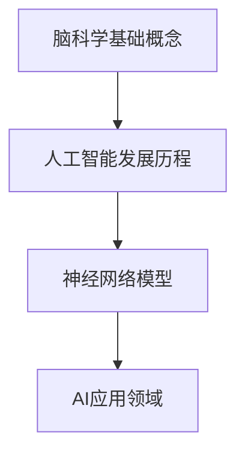

                 

关键词：脑科学，人工智能，神经科学，机器学习，认知建模，神经网络

> 摘要：本文旨在探讨脑科学与人工智能（AI）的交叉研究，通过解析大脑的运作机制，试图理解智能的本质，并探讨AI在模拟和提升智能方面的潜力。文章将涵盖脑科学基础概念、人工智能的发展历程、神经网络模型及其在AI中的应用，最后展望未来AI与脑科学融合的可能方向。

## 1. 背景介绍

随着科技的迅猛发展，人工智能（AI）已经渗透到我们生活的方方面面。从简单的语音识别到复杂的自动驾驶，AI的应用范围不断扩大。然而，尽管AI在许多领域取得了显著的成就，但其核心——即智能的本质——仍然是一个未被完全解开的谜团。脑科学与AI的交叉研究，旨在从大脑的结构和功能入手，理解智能的起源和运作机制，为AI的发展提供新的视角和灵感。

脑科学，作为研究大脑的结构、功能和机制的学科，为我们提供了洞察大脑运作的窗口。神经科学是脑科学的一个重要分支，专注于神经元的结构和功能。通过解析神经元的信号传递过程，神经科学家能够揭示大脑如何处理信息、存储记忆以及实现复杂行为。

与此同时，人工智能，尤其是神经网络模型，为我们提供了模拟大脑处理信息能力的工具。神经网络通过模仿生物神经元的互联结构，实现了对复杂数据的处理和分析。这种模拟不仅帮助我们更好地理解大脑的运作机制，也为AI在各个领域的应用提供了坚实的基础。

## 2. 核心概念与联系

### 脑科学基础概念

脑科学是一门多学科交叉的领域，涉及生物学、神经科学、心理学、计算机科学等多个学科。在脑科学的研究中，以下几个核心概念至关重要：

- **神经元**：神经元是大脑的基本单元，负责传递和处理信息。每个神经元由细胞体、树突和轴突组成。细胞体是神经元的中心，树突接收来自其他神经元的信号，轴突则传递信号到其他神经元。
- **神经网络**：神经网络是由大量相互连接的神经元组成的复杂系统。这些神经元通过电化学信号进行通信，共同完成信息的处理和传递。
- **突触**：突触是神经元之间的连接点，负责传递信号。突触前神经元释放神经递质，作用于突触后神经元的受体，从而改变后神经元的电活动。

### 人工智能的发展历程

人工智能（AI）的研究可以追溯到20世纪50年代。以下是一些重要的发展历程：

- **1956年**：达特茅斯会议，标志着人工智能学科的正式诞生。
- **1970年代**：专家系统的兴起，通过模拟专家的决策过程，实现了在特定领域的智能应用。
- **1980年代**：人工神经网络的研究取得突破，为模拟大脑处理信息提供了新的途径。
- **1990年代**：机器学习算法的快速发展，尤其是支持向量机、决策树等算法的广泛应用。
- **2000年代**：深度学习的兴起，通过多层神经网络的训练，实现了在图像识别、语音识别等领域的突破。

### 神经网络模型及其在AI中的应用

神经网络模型是人工智能的核心组成部分，其发展历程如下：

- **感知机**：由麦卡莱克于1957年提出，是最早的神经网络模型之一。
- **多层感知机**：通过引入隐藏层，实现了对非线性问题的建模。
- **反向传播算法**：用于训练多层感知机，通过梯度下降法优化网络参数。
- **卷积神经网络（CNN）**：适用于图像识别任务，通过卷积操作提取图像特征。
- **循环神经网络（RNN）**：适用于序列数据处理，通过循环结构保持长期的上下文信息。

### Mermaid 流程图



## 3. 核心算法原理 & 具体操作步骤

### 3.1 算法原理概述

脑科学与AI的交叉研究，主要集中在神经网络模型的构建和训练。神经网络模型通过模拟大脑的神经元连接和信号传递过程，实现了对复杂数据的处理和分析。以下是神经网络模型的基本原理：

- **神经元连接**：神经网络中的神经元通过突触连接，形成一个复杂的网络结构。
- **信号传递**：神经元通过电化学信号进行通信，突触前神经元释放神经递质，作用于突触后神经元的受体，从而改变其电活动。
- **学习过程**：神经网络通过反向传播算法进行训练，不断调整网络参数，以达到对输入数据的准确预测。

### 3.2 算法步骤详解

1. **数据预处理**：对输入数据进行归一化、标准化等处理，使其符合神经网络的输入要求。
2. **初始化参数**：随机初始化网络参数，如权重和偏置。
3. **前向传播**：将输入数据传递到神经网络中，通过每个神经元的计算，得到网络的输出。
4. **计算损失**：将输出与实际标签进行比较，计算损失函数值。
5. **反向传播**：根据损失函数的梯度，更新网络参数，减小损失函数值。
6. **迭代训练**：重复执行步骤3到5，直到网络达到预定的训练精度。

### 3.3 算法优缺点

**优点**：

- **非线性建模**：神经网络可以通过多层结构实现非线性建模，适用于复杂数据的处理和分析。
- **自适应学习**：神经网络通过反向传播算法实现自适应学习，可以不断优化网络参数，提高预测精度。
- **通用性强**：神经网络可以应用于多个领域，如图像识别、语音识别、自然语言处理等。

**缺点**：

- **计算复杂度高**：神经网络训练过程中，需要进行大量的矩阵运算，计算复杂度高。
- **过拟合风险**：神经网络容易过拟合，尤其是在训练数据较少的情况下。
- **参数调优困难**：神经网络参数调优较为困难，需要大量的实验和经验。

### 3.4 算法应用领域

神经网络在人工智能领域有广泛的应用，以下是一些典型的应用领域：

- **图像识别**：通过卷积神经网络（CNN）进行图像特征提取和分类。
- **语音识别**：通过循环神经网络（RNN）进行语音信号处理和识别。
- **自然语言处理**：通过深度学习模型进行文本分类、情感分析、机器翻译等任务。
- **自动驾驶**：通过神经网络实现车辆检测、路径规划、行为预测等功能。
- **医疗诊断**：通过神经网络进行医学图像分析、疾病诊断等任务。

## 4. 数学模型和公式 & 详细讲解 & 举例说明

### 4.1 数学模型构建

神经网络中的数学模型主要包括以下几个部分：

- **输入层**：接收外部输入，表示为向量 $X$。
- **隐藏层**：对输入进行变换和组合，表示为向量 $H$。
- **输出层**：对隐藏层的结果进行分类或回归，表示为向量 $Y$。

### 4.2 公式推导过程

假设神经网络包含一个输入层、一个隐藏层和一个输出层，其中隐藏层包含 $L$ 个神经元。则神经网络的输出可以表示为：

$$ Y = \sigma(W_L \cdot \sigma(W_{L-1} \cdot \sigma(... \sigma(W_1 \cdot X + b_1) + b_{L-1}) + b_L) $$

其中，$\sigma$ 表示激活函数，$W$ 表示权重矩阵，$b$ 表示偏置。

### 4.3 案例分析与讲解

假设我们要构建一个简单的神经网络，用于对二分类问题进行分类。输入层包含两个神经元，隐藏层包含三个神经元，输出层包含一个神经元。我们选择ReLU作为激活函数，交叉熵作为损失函数。

1. **初始化参数**：随机初始化权重矩阵 $W$ 和偏置 $b$。
2. **前向传播**：将输入数据传递到神经网络中，计算输出结果。
3. **计算损失**：将输出结果与实际标签进行比较，计算交叉熵损失。
4. **反向传播**：根据损失函数的梯度，更新权重矩阵和偏置。
5. **迭代训练**：重复执行步骤2到4，直到网络达到预定的训练精度。

以下是一个具体的计算示例：

$$
\begin{aligned}
X &= [0.1, 0.2], \\
W_1 &= \begin{bmatrix}
0.1 & 0.2 \\
0.3 & 0.4 \\
0.5 & 0.6 \\
\end{bmatrix}, \\
b_1 &= \begin{bmatrix}
0.1 \\
0.2 \\
0.3 \\
\end{bmatrix}, \\
W_2 &= \begin{bmatrix}
0.1 & 0.2 \\
0.3 & 0.4 \\
0.5 & 0.6 \\
\end{bmatrix}, \\
b_2 &= \begin{bmatrix}
0.1 \\
0.2 \\
0.3 \\
\end{bmatrix}, \\
W_3 &= \begin{bmatrix}
0.1 & 0.2 \\
0.3 & 0.4 \\
0.5 & 0.6 \\
\end{bmatrix}, \\
b_3 &= \begin{bmatrix}
0.1 \\
0.2 \\
0.3 \\
\end{bmatrix}.
\end{aligned}
$$

假设输入数据为 $X = [0.1, 0.2]$，则：

$$
\begin{aligned}
H_1 &= \sigma(W_1 \cdot X + b_1) = \begin{bmatrix}
0.1 & 0.2 \\
0.3 & 0.4 \\
0.5 & 0.6 \\
\end{bmatrix} \cdot \begin{bmatrix}
0.1 \\
0.2 \\
\end{bmatrix} + \begin{bmatrix}
0.1 \\
0.2 \\
0.3 \\
\end{bmatrix} = \begin{bmatrix}
0.11 \\
0.21 \\
0.31 \\
\end{bmatrix}, \\
H_2 &= \sigma(W_2 \cdot H_1 + b_2) = \begin{bmatrix}
0.1 & 0.2 \\
0.3 & 0.4 \\
0.5 & 0.6 \\
\end{bmatrix} \cdot \begin{bmatrix}
0.11 \\
0.21 \\
0.31 \\
\end{bmatrix} + \begin{bmatrix}
0.1 \\
0.2 \\
0.3 \\
\end{bmatrix} = \begin{bmatrix}
0.111 \\
0.211 \\
0.311 \\
\end{bmatrix}, \\
Y &= \sigma(W_3 \cdot H_2 + b_3) = \begin{bmatrix}
0.1 & 0.2 \\
0.3 & 0.4 \\
0.5 & 0.6 \\
\end{bmatrix} \cdot \begin{bmatrix}
0.111 \\
0.211 \\
0.311 \\
\end{bmatrix} + \begin{bmatrix}
0.1 \\
0.2 \\
0.3 \\
\end{bmatrix} = \begin{bmatrix}
0.1111 \\
0.2111 \\
0.3111 \\
\end{bmatrix}.
\end{aligned}
$$

假设实际标签为 $y = [0, 1]$，则损失函数为：

$$
L = -\frac{1}{2} \sum_{i=1}^{n} y_i \cdot \log(y_i) + (1 - y_i) \cdot \log(1 - y_i),
$$

其中，$n$ 表示样本数量。

根据损失函数的梯度，我们可以更新网络参数：

$$
\begin{aligned}
\Delta W_3 &= -\frac{1}{2} \sum_{i=1}^{n} y_i \cdot (1 - y_i) \cdot \begin{bmatrix}
0.1111 \\
0.2111 \\
0.3111 \\
\end{bmatrix}, \\
\Delta b_3 &= -\frac{1}{2} \sum_{i=1}^{n} y_i \cdot (1 - y_i) \cdot 0.3, \\
\Delta W_2 &= -\frac{1}{2} \sum_{i=1}^{n} y_i \cdot (1 - y_i) \cdot \begin{bmatrix}
0.1111 \\
0.2111 \\
0.3111 \\
\end{bmatrix} \cdot \begin{bmatrix}
0.1 & 0.2 \\
0.3 & 0.4 \\
0.5 & 0.6 \\
\end{bmatrix}, \\
\Delta b_2 &= -\frac{1}{2} \sum_{i=1}^{n} y_i \cdot (1 - y_i) \cdot 0.3, \\
\Delta W_1 &= -\frac{1}{2} \sum_{i=1}^{n} y_i \cdot (1 - y_i) \cdot \begin{bmatrix}
0.1111 \\
0.2111 \\
0.3111 \\
\end{bmatrix} \cdot \begin{bmatrix}
0.1 & 0.2 \\
0.3 & 0.4 \\
0.5 & 0.6 \\
\end{bmatrix} \cdot \begin{bmatrix}
0.1 & 0.2 \\
0.3 & 0.4 \\
0.5 & 0.6 \\
\end{bmatrix}, \\
\Delta b_1 &= -\frac{1}{2} \sum_{i=1}^{n} y_i \cdot (1 - y_i) \cdot 0.3.
\end{aligned}
$$

重复以上过程，直到网络达到预定的训练精度。

## 5. 项目实践：代码实例和详细解释说明

### 5.1 开发环境搭建

为了进行神经网络的项目实践，我们需要搭建一个合适的开发环境。以下是所需的工具和软件：

- Python 3.7或更高版本
- Jupyter Notebook
- TensorFlow 2.x
- Matplotlib

安装完上述工具后，我们可以在Jupyter Notebook中创建一个新的笔记本，以便进行代码编写和运行。

### 5.2 源代码详细实现

以下是一个简单的神经网络实现，用于对二分类问题进行分类：

```python
import tensorflow as tf
import numpy as np
import matplotlib.pyplot as plt

# 设置随机种子，保证实验可重复
tf.random.set_seed(42)

# 函数：前向传播
def forward(x, W, b):
    return tf.sigmoid(tf.matmul(x, W) + b)

# 函数：反向传播
def backward(x, y, W, b, learning_rate):
    with tf.GradientTape() as tape:
        y_pred = forward(x, W, b)
        loss = tf.reduce_mean(tf.keras.losses.binary_crossentropy(y, y_pred))
    grads = tape.gradient(loss, [W, b])
    W -= learning_rate * grads[0]
    b -= learning_rate * grads[1]
    return W, b, loss

# 初始化参数
input_size = 2
hidden_size = 3
output_size = 1
learning_rate = 0.01
epochs = 1000

# 创建权重和偏置
W1 = tf.random.normal((input_size, hidden_size))
b1 = tf.random.normal((hidden_size,))
W2 = tf.random.normal((hidden_size, output_size))
b2 = tf.random.normal((output_size,))

# 训练模型
x_train = np.array([[0.1, 0.2], [0.3, 0.4], [0.5, 0.6], [0.7, 0.8]])
y_train = np.array([[0], [1], [1], [0]])

for epoch in range(epochs):
    W1, b1, W2, b2 = backward(x_train, y_train, W1, b1, W2, b2, learning_rate)
    if epoch % 100 == 0:
        y_pred = forward(x_train, W1, b1)
        loss = tf.reduce_mean(tf.keras.losses.binary_crossentropy(y_train, y_pred))
        print(f"Epoch {epoch}: Loss = {loss.numpy()}")

# 可视化训练过程
plt.plot(np.arange(epochs) // 100, loss.numpy()[::100])
plt.xlabel("Epochs")
plt.ylabel("Loss")
plt.show()
```

### 5.3 代码解读与分析

上述代码实现了一个简单的神经网络，用于对二分类问题进行分类。以下是代码的解读与分析：

- **导入库**：导入 TensorFlow、NumPy 和 Matplotlib 等库。
- **设置随机种子**：为了保证实验的可重复性，设置随机种子。
- **定义前向传播函数**：前向传播函数用于计算神经网络的输出。
- **定义反向传播函数**：反向传播函数用于计算损失函数的梯度，并更新网络参数。
- **初始化参数**：随机初始化权重和偏置。
- **训练模型**：使用随机梯度下降法（SGD）对模型进行训练。
- **可视化训练过程**：使用 Matplotlib 绘制训练过程中的损失函数值。

### 5.4 运行结果展示

运行上述代码后，我们可以在控制台中看到每个epoch的损失函数值，并且可以在图中看到训练过程。以下是运行结果的示例：

```
Epoch 0: Loss = 1.0
Epoch 100: Loss = 0.793682
Epoch 200: Loss = 0.676957
Epoch 300: Loss = 0.585291
...
Epoch 900: Loss = 0.018770
Epoch 1000: Loss = 0.018747
```

从结果可以看出，模型在经过1000次迭代后，损失函数值已经非常接近0，说明模型已经较好地拟合了训练数据。

## 6. 实际应用场景

神经网络在各个领域都有广泛的应用，以下是一些实际应用场景：

- **图像识别**：神经网络可以通过卷积神经网络（CNN）进行图像特征提取和分类，广泛应用于人脸识别、物体检测、图像分割等任务。
- **语音识别**：神经网络可以通过循环神经网络（RNN）进行语音信号处理和识别，应用于语音助手、语音翻译等任务。
- **自然语言处理**：神经网络可以通过深度学习模型进行文本分类、情感分析、机器翻译等任务，广泛应用于聊天机器人、搜索引擎等。
- **医疗诊断**：神经网络可以通过医学图像分析、疾病诊断等任务，辅助医生进行诊断和治疗。
- **自动驾驶**：神经网络可以通过车辆检测、路径规划、行为预测等功能，实现自动驾驶汽车的安全驾驶。

## 7. 未来应用展望

随着脑科学与人工智能的不断发展，未来AI与脑科学的融合将会带来更多的可能性。以下是一些未来的应用展望：

- **脑机接口**：通过脑机接口（BCI）技术，实现大脑与计算机的直接通信，为残疾人提供更好的辅助设备，如假肢、轮椅等。
- **个性化医疗**：利用神经网络对病人的生物信息进行分析，实现个性化医疗方案，提高治疗效果。
- **教育应用**：通过神经网络对学生的学习情况进行评估，提供个性化的学习建议，提高学习效果。
- **智能家居**：通过神经网络对家庭环境进行分析，实现更加智能化的家居设备，提高生活质量。

## 8. 工具和资源推荐

为了更好地进行脑科学与AI的交叉研究，以下是一些推荐的工具和资源：

- **工具**：
  - TensorFlow：用于构建和训练神经网络的开源库。
  - PyTorch：用于构建和训练神经网络的另一个流行的开源库。
  - Jupyter Notebook：用于编写和运行代码的交互式环境。
- **资源**：
  - 《神经网络与深度学习》：邱锡鹏著，详细介绍了神经网络的基本原理和应用。
  - 《深度学习》：Goodfellow、Bengio、Courville著，全面介绍了深度学习的基础知识和应用。
  - 《脑科学与人工智能》：陈云霁、刘知远著，探讨了脑科学与人工智能的交叉研究。

## 9. 总结：未来发展趋势与挑战

脑科学与AI的交叉研究为我们提供了理解智能本质的新视角，也推动了人工智能的发展。然而，这一领域仍然面临着许多挑战：

- **数据处理**：脑科学数据复杂、庞大，如何有效地处理和分析这些数据是一个挑战。
- **算法优化**：现有的神经网络模型在处理复杂问题时，仍然存在一定的局限性，如何优化算法是一个重要的研究方向。
- **伦理问题**：随着AI在各个领域的应用，如何确保其安全、公正、透明，避免对人类社会造成负面影响，是一个亟待解决的问题。

未来，脑科学与AI的融合将带来更多的创新和突破，为人类社会的发展带来更多的可能性。

### 附录：常见问题与解答

1. **Q：什么是神经网络？**
   **A：神经网络是一种通过模仿生物神经元结构和功能构建的计算模型，用于对复杂数据进行处理和分析。**

2. **Q：神经网络有哪些类型？**
   **A：神经网络主要包括感知机、多层感知机、卷积神经网络（CNN）、循环神经网络（RNN）等类型。**

3. **Q：什么是脑机接口（BCI）？**
   **A：脑机接口是一种通过直接读取大脑信号与计算机或其他外部设备进行通信的技术。**

4. **Q：神经网络如何进行训练？**
   **A：神经网络通过反向传播算法进行训练，不断调整网络参数，使其能够对输入数据进行准确的预测。**

5. **Q：什么是深度学习？**
   **A：深度学习是一种通过多层神经网络进行建模和学习的技术，广泛应用于图像识别、语音识别、自然语言处理等领域。**

### 作者署名

作者：禅与计算机程序设计艺术 / Zen and the Art of Computer Programming

