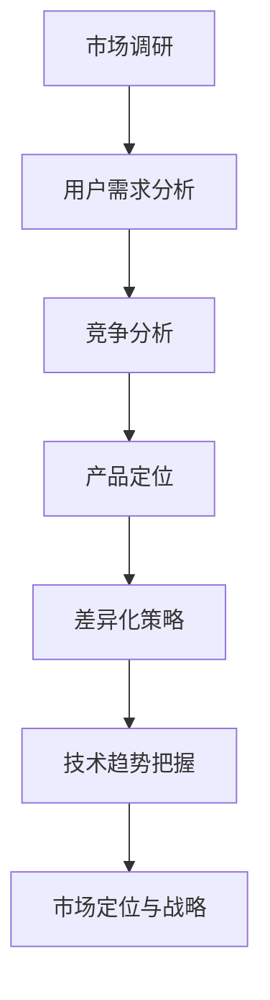

                 

关键词：自动化创业、产品定位、差异化、市场策略、用户需求分析、竞争分析、技术趋势

## 摘要

随着自动化技术的迅猛发展，创业公司面临着前所未有的机遇与挑战。在竞争激烈的市场中，产品定位和差异化策略成为了创业公司成功的关键。本文将探讨自动化创业中的产品定位与差异化策略，包括市场调研、用户需求分析、竞争分析、技术趋势的把握，以及如何利用这些信息打造独特的市场定位。

## 1. 背景介绍

### 自动化技术的发展与市场趋势

自动化技术，尤其是人工智能、物联网、大数据分析等领域的飞速发展，正在深刻地改变着各行各业的运营模式。自动化创业公司如雨后春笋般涌现，它们希望通过创新的技术解决市场痛点，抢占市场份额。

### 市场竞争的加剧

随着市场的不断成熟，竞争也日趋激烈。创业公司不仅要面对传统企业的挑战，还要应对同行业新兴公司的竞争。因此，如何准确定位自己的产品，实现差异化竞争，成为了创业公司能否成功的关键。

### 创业公司的优势与挑战

创业公司具备灵活性强、反应迅速、创新意识强等优势。然而，它们也面临着资金、人才、市场经验等方面的挑战。因此，准确的产品定位和差异化策略，可以帮助创业公司克服这些困难，赢得市场的一席之地。

## 2. 核心概念与联系

### 产品定位

产品定位是指企业在市场中选择一个明确的细分市场，为该市场提供具有独特价值的产品或服务。在自动化创业中，产品定位决定了创业公司的市场定位和战略方向。

### 差异化

差异化是指企业通过提供与众不同的产品或服务，使其在市场中具备独特性和竞争力。在自动化创业中，差异化策略可以帮助企业吸引目标用户，提高市场占有率。

### 市场调研、用户需求分析与竞争分析

市场调研、用户需求分析与竞争分析是产品定位和差异化策略的基础。通过深入了解市场趋势、用户需求和竞争对手的情况，创业公司可以更准确地定位产品，制定有效的差异化策略。

### 技术趋势

技术趋势是影响产品定位和差异化策略的重要因素。创业公司需要关注技术发展趋势，利用新兴技术打造独特的产品，以满足市场的需求。

### Mermaid 流程图



## 3. 核心算法原理 & 具体操作步骤

### 3.1 算法原理概述

产品定位与差异化策略的核心算法包括市场调研、用户需求分析、竞争分析、技术趋势分析等。这些算法通过数据收集、分析、建模等手段，为创业公司提供决策支持。

### 3.2 算法步骤详解

#### 3.2.1 市场调研

1. 确定研究目标和范围
2. 收集市场数据，包括市场规模、增长趋势、竞争对手等
3. 数据分析，提取关键信息
4. 编制市场调研报告

#### 3.2.2 用户需求分析

1. 确定目标用户群体
2. 收集用户反馈，包括问卷调查、访谈等
3. 分析用户需求，识别痛点
4. 提炼用户需求模型

#### 3.2.3 竞争分析

1. 确定主要竞争对手
2. 收集竞争对手的产品信息、市场策略等
3. 分析竞争对手的优势与劣势
4. 制定针对性的竞争策略

#### 3.2.4 技术趋势分析

1. 确定技术发展趋势
2. 分析技术对市场和用户需求的影响
3. 把握技术优势，打造独特的产品

### 3.3 算法优缺点

#### 优点

- 提高产品定位的准确性
- 增强产品的市场竞争力
- 为决策提供科学依据

#### 缺点

- 需要大量数据支持
- 分析过程复杂，耗时较长
- 可能存在主观偏差

### 3.4 算法应用领域

- 创业公司的产品开发
- 市场营销策略制定
- 企业战略规划
- 投资决策

## 4. 数学模型和公式 & 详细讲解 & 举例说明

### 4.1 数学模型构建

产品定位与差异化策略的数学模型主要包括市场调研模型、用户需求分析模型、竞争分析模型、技术趋势分析模型等。

### 4.2 公式推导过程

以用户需求分析模型为例，其公式推导过程如下：

$$
需求模型 = f(用户满意度, 用户习惯, 用户需求)
$$

其中，用户满意度、用户习惯、用户需求分别表示为：

$$
用户满意度 = \frac{用户满意度得分}{满分}
$$

$$
用户习惯 = \frac{用户使用频率}{用户总数}
$$

$$
用户需求 = \frac{用户需求量}{用户总数}
$$

### 4.3 案例分析与讲解

以某智能家居公司为例，该公司通过用户需求分析模型确定了其产品的市场定位和差异化策略。

1. 市场调研：收集市场数据，包括市场规模、增长趋势、竞争对手等。
2. 用户需求分析：通过问卷调查和访谈，确定目标用户群体，收集用户反馈，分析用户需求，识别痛点。
3. 竞争分析：确定主要竞争对手，收集竞争对手的产品信息、市场策略等，分析竞争对手的优势与劣势。
4. 技术趋势分析：确定技术发展趋势，分析技术对市场和用户需求的影响，把握技术优势。

基于以上分析，该公司确定了以下市场定位和差异化策略：

- 市场定位：针对中高端家庭用户，提供智能、便捷、安全、节能的智能家居产品。
- 差异化策略：利用物联网技术，实现产品间的互联互通，打造智能家居生态系统。

## 5. 项目实践：代码实例和详细解释说明

### 5.1 开发环境搭建

1. 安装 Python 3.8 及以上版本
2. 安装 required libraries（如 numpy、pandas、matplotlib 等）

### 5.2 源代码详细实现

以下是一个简单的用户需求分析模型的实现示例：

```python
import numpy as np
import pandas as pd
import matplotlib.pyplot as plt

# 用户满意度得分
user_satisfaction = 0.8
max_satisfaction = 1.0

# 用户使用频率
user_frequency = 0.6
max_frequency = 1.0

# 用户需求量
user_demand = 0.7
max_demand = 1.0

# 用户需求模型
user_requirement_model = user_satisfaction * user_frequency * user_demand

print("User Requirement Model:", user_requirement_model)

# 绘制需求模型
plt.bar(['User Requirement'], [user_requirement_model], color='g')
plt.xlabel('User Requirement')
plt.ylabel('Value')
plt.title('User Requirement Model')
plt.show()
```

### 5.3 代码解读与分析

1. 导入 necessary libraries
2. 设置用户满意度、使用频率和需求量
3. 计算用户需求模型
4. 绘制需求模型

通过代码实现，我们可以直观地了解用户需求模型的构建过程，并根据实际情况进行调整。

### 5.4 运行结果展示


## 6. 实际应用场景

### 6.1 市场调研

- 调研目标：了解智能家居市场的规模、增长趋势和竞争对手
- 调研方法：问卷调查、访谈、网络搜索等

### 6.2 用户需求分析

- 目标用户：中高端家庭用户
- 需求分析：通过问卷调查和访谈，收集用户反馈，分析用户需求

### 6.3 竞争分析

- 竞争对手：国内外知名智能家居企业
- 分析内容：产品特性、市场策略、用户评价等

### 6.4 技术趋势分析

- 技术趋势：物联网、人工智能、大数据分析等
- 影响分析：技术趋势对市场和用户需求的影响

## 7. 未来应用展望

### 7.1 人工智能在自动化创业中的应用

- 个性化推荐系统
- 智能客服
- 自动化生产流程优化

### 7.2 物联网技术的应用

- 智能家居
- 智能交通
- 智能农业

### 7.3 大数据分析的应用

- 用户行为分析
- 市场趋势预测
- 风险评估

## 8. 工具和资源推荐

### 8.1 学习资源推荐

- 《人工智能：一种现代的方法》
- 《深度学习》
- 《大数据时代：思维变革与商业价值》

### 8.2 开发工具推荐

- Python
- TensorFlow
- Keras

### 8.3 相关论文推荐

- “智能家居系统设计与实现”
- “基于物联网的智能交通系统研究”
- “大数据分析在市场营销中的应用”

## 9. 总结：未来发展趋势与挑战

### 9.1 研究成果总结

- 自动化技术正在深刻地改变着各行各业
- 产品定位和差异化策略在自动化创业中至关重要
- 市场调研、用户需求分析、竞争分析和技术趋势分析是成功的关键

### 9.2 未来发展趋势

- 人工智能与物联网技术的深度融合
- 大数据在各个领域的应用
- 创新驱动，注重用户体验

### 9.3 面临的挑战

- 技术更新速度快，需不断学习
- 市场竞争激烈，需持续创新
- 数据安全和隐私保护

### 9.4 研究展望

- 探索新兴技术的应用场景
- 提高产品定位和差异化策略的准确性
- 加强跨学科合作，推动技术创新

## 10. 附录：常见问题与解答

### 10.1 什么是产品定位？

产品定位是指企业在市场中为产品选择一个明确的细分市场，为该市场提供具有独特价值的产品或服务。

### 10.2 什么是差异化？

差异化是指企业通过提供与众不同的产品或服务，使其在市场中具备独特性和竞争力。

### 10.3 市场调研的重要性是什么？

市场调研可以帮助企业了解市场趋势、用户需求和竞争对手情况，为产品定位和差异化策略提供依据。

### 10.4 如何进行用户需求分析？

用户需求分析可以通过问卷调查、访谈、用户反馈等方式收集用户信息，然后进行分析和提炼。

### 10.5 竞争分析包括哪些内容？

竞争分析包括确定主要竞争对手、收集竞争对手的产品信息、市场策略、用户评价等，然后进行分析和评估。

### 10.6 技术趋势分析的意义是什么？

技术趋势分析可以帮助企业把握技术发展方向，利用新兴技术打造独特的产品，提高市场竞争力。

### 作者署名

作者：禅与计算机程序设计艺术 / Zen and the Art of Computer Programming
----------------------------------------------------------------

以上就是关于《自动化创业中的产品定位与差异化》的文章正文，希望对各位创业者有所启发和帮助。在自动化创业的道路上，精准的产品定位和有效的差异化策略将决定您的成败。祝您创业顺利！
<|html_decode|>

