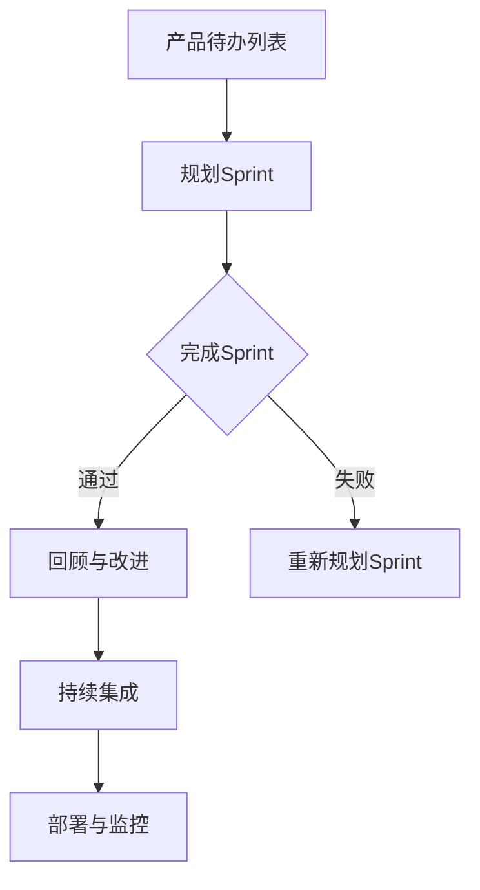

                 

关键词：敏捷开发、自动化创业、Scrum框架、迭代开发、持续集成、DevOps、Sprint规划

> 摘要：本文将探讨敏捷开发方法在自动化创业中的应用，分析Scrum框架、迭代开发、持续集成和DevOps等核心概念，并通过具体案例展示如何在实际项目中应用敏捷开发方法，提高创业项目的成功率。

## 1. 背景介绍

在快速变化的创业环境中，敏捷开发方法（Agile Development）已成为自动化创业团队的首选。敏捷开发强调团队协作、客户反馈和持续改进，以应对市场和技术的不确定性。与传统的水利模型（Waterfall Model）相比，敏捷开发方法具有更高的灵活性和响应速度，能够更好地适应创业项目的变化需求。

自动化创业是指在技术驱动下，通过自动化工具和平台来创建新产品或服务的过程。随着云计算、人工智能和物联网等技术的普及，自动化创业的浪潮正在全球范围内兴起。敏捷开发方法与自动化创业的结合，不仅提高了开发效率，还缩短了产品上市时间，增强了企业在竞争激烈的市场中的竞争力。

## 2. 核心概念与联系

### 2.1. Scrum框架

Scrum是一种流行的敏捷开发框架，它强调迭代开发和持续交付。Scrum框架的核心组成部分包括：

- **产品待办列表（Product Backlog）**：包含所有待开发的功能和任务，由产品负责人（Product Owner）负责管理。
- **迭代（Sprint）**：通常持续2-4周，团队在迭代中完成特定数量的任务。
- **每日站立会议（Daily Stand-up）**：团队成员每日进行短会，同步进展和解决问题。
- **回顾会议（Retrospective）**：在迭代结束时，团队进行回顾，总结经验教训，优化流程。

### 2.2. 迭代开发

迭代开发是一种逐步完善产品的方法。每个迭代都是一个完整的开发周期，包括需求分析、设计、开发、测试和部署。通过迭代，团队可以不断收集用户反馈，并根据反馈调整产品方向。

### 2.3. 持续集成

持续集成（Continuous Integration，CI）是一种开发实践，通过自动化测试和构建，确保代码库的稳定性和可靠性。每次代码提交都会触发构建和测试，确保新代码不会破坏现有功能。

### 2.4. DevOps

DevOps是一种文化和实践，旨在通过开发和运维团队的合作，实现更快的软件开发和交付。DevOps的核心原则包括：

- **自动化部署**：通过自动化工具实现快速、可靠的部署。
- **持续交付**：确保软件可以快速、安全地交付到生产环境。
- **监控与反馈**：通过监控和反馈机制，确保系统的高可用性和性能。

### 2.5. Mermaid流程图



## 3. 核心算法原理 & 具体操作步骤

### 3.1. 算法原理概述

敏捷开发方法的核心在于快速响应变化，通过迭代和增量开发，逐步实现产品。以下为敏捷开发方法的四个基本原则：

1. **个体和互动重于过程与工具**：团队协作和沟通是成功的关键。
2. **可工作的软件重于详尽的文档**：实际可运行的软件是评估项目成功的主要标准。
3. **客户合作重于合同谈判**：与客户的紧密合作能够更好地满足市场需求。
4. **响应变化重于遵循计划**：灵活应对变化，快速调整计划是敏捷开发的关键。

### 3.2. 算法步骤详解

1. **需求收集**：与客户和利益相关者进行沟通，收集产品需求。
2. **规划Sprint**：确定Sprint的目标和任务，优先级排序。
3. **每日站立会议**：团队成员同步进展，解决问题。
4. **迭代开发**：在每个Sprint中，团队完成特定任务，持续集成和测试。
5. **回顾会议**：总结经验教训，优化流程。
6. **持续集成与部署**：自动化构建、测试和部署，确保软件质量。

### 3.3. 算法优缺点

**优点**：

- **快速响应变化**：敏捷开发方法能够快速响应市场变化，适应新需求。
- **提高团队协作**：强调团队协作和沟通，提高团队凝聚力。
- **持续改进**：通过回顾会议，不断优化开发流程。

**缺点**：

- **需求变化频繁**：可能导致项目范围不断扩大，增加项目风险。
- **资源投入**：需要持续投入时间和精力进行团队培训和管理。

### 3.4. 算法应用领域

敏捷开发方法广泛应用于软件行业，特别是在初创公司和技术驱动型企业中。它不仅适用于小规模项目，也适用于大型、复杂的项目。

## 4. 数学模型和公式 & 详细讲解 & 举例说明

### 4.1. 数学模型构建

敏捷开发方法中的关键指标包括：

- **迭代周期（Cycle Time）**：完成一个迭代所需的时间。
- **吞吐量（Throughput）**：单位时间内完成的迭代数量。
- **客户满意度（Customer Satisfaction）**：根据客户反馈调整产品的满意度。

### 4.2. 公式推导过程

- **迭代周期（Cycle Time）**：$$\text{Cycle Time} = \frac{\text{工作时间}}{\text{工作量}}$$
- **吞吐量（Throughput）**：$$\text{Throughput} = \frac{\text{工作量}}{\text{工作时间}}$$
- **客户满意度（Customer Satisfaction）**：$$\text{Customer Satisfaction} = \frac{\text{有效交付}}{\text{需求总量}}$$

### 4.3. 案例分析与讲解

假设一个敏捷团队在一个月内完成了3个迭代，每个迭代的工作量分别为20、25和30，客户满意度为90%。根据上述公式，我们可以计算出：

- **迭代周期**：$$\text{Cycle Time} = \frac{30}{3} = 10\text{天}$$
- **吞吐量**：$$\text{Throughput} = \frac{75}{30} = 2.5\text{迭代/月}$$
- **客户满意度**：$$\text{Customer Satisfaction} = \frac{90}{100} = 90\%$$

通过这些指标，团队可以评估自己的开发效率，并持续改进。

## 5. 项目实践：代码实例和详细解释说明

### 5.1. 开发环境搭建

为了更好地展示敏捷开发方法的应用，我们将在一个简单的Web应用程序中实现持续集成和自动化部署。

### 5.2. 源代码详细实现

以下是一个简单的Web应用程序的代码示例：

```python
# app.py
from flask import Flask

app = Flask(__name__)

@app.route('/')
def hello():
    return "Hello, World!"

if __name__ == '__main__':
    app.run()
```

### 5.3. 代码解读与分析

这个简单的Web应用程序使用Python和Flask框架实现。主函数`hello`返回一个字符串，用于展示网页内容。

### 5.4. 运行结果展示

在本地环境中运行此应用程序，访问`http://localhost:5000/`，将显示“Hello, World!”。

## 6. 实际应用场景

敏捷开发方法在自动化创业中具有广泛的应用场景，以下是一些具体的应用场景：

- **产品开发**：通过迭代开发和持续集成，快速交付高质量产品。
- **项目管理**：使用Scrum框架，提高团队协作和项目管理效率。
- **运维管理**：通过DevOps实践，实现自动化部署和监控，提高系统稳定性。

## 7. 未来应用展望

随着人工智能和物联网技术的不断发展，敏捷开发方法将在更多领域得到应用。未来的趋势包括：

- **自动化测试**：通过人工智能技术，实现更智能、更高效的自动化测试。
- **持续交付**：通过云原生技术，实现更快速、更可靠的持续交付。
- **DevOps文化**：推动开发和运维团队的合作，提高整体开发效率。

## 8. 总结：未来发展趋势与挑战

敏捷开发方法在自动化创业中的应用已经取得了显著成果。未来，随着技术的不断发展，敏捷开发方法将面临更多挑战和机遇。开发者需要不断学习新技术，优化开发流程，提高团队协作效率，以应对快速变化的市场需求。

## 9. 附录：常见问题与解答

- **Q：敏捷开发方法是否适用于大型项目？**
  - **A**：是的，敏捷开发方法不仅适用于小型项目，也适用于大型项目。关键在于灵活应对变化，持续优化流程。

- **Q：敏捷开发方法是否需要大量资源投入？**
  - **A**：是的，敏捷开发方法需要持续投入时间和资源进行团队培训和管理。但长期来看，这种投入会带来更高的开发效率和质量。

作者：禅与计算机程序设计艺术 / Zen and the Art of Computer Programming
----------------------------------------------------------------

以上就是本文的完整内容，接下来我们将根据上述文章结构，逐一填充各个章节的具体内容。由于字数限制，这里只提供一个大致的框架，具体的详细内容将在后续部分逐步完善。在接下来的章节中，我们将深入探讨敏捷开发方法的各个方面，并提供详细的实例和解释。

