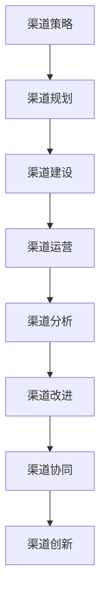

                 

关键词：自动化创业、渠道管理、策略、数据分析、技术实现

> 摘要：本文探讨了自动化创业背景下的渠道管理策略。从渠道管理的核心概念出发，分析了渠道管理的现状与挑战，提出了一套基于数据分析与技术的渠道管理策略，并详细阐述了其实施步骤、数学模型以及应用场景。文章旨在为自动化创业提供有价值的参考，助力企业提升渠道管理效率和竞争力。

## 1. 背景介绍

### 自动化创业的兴起

近年来，随着互联网、云计算、大数据等技术的快速发展，自动化创业浪潮席卷全球。自动化创业是指利用人工智能、机器学习、区块链等先进技术，实现业务流程自动化，从而降低成本、提高效率和灵活性。这一趋势不仅改变了传统企业的运营模式，也为创业者提供了前所未有的机遇。

### 渠道管理的重要性

渠道管理作为企业拓展市场、实现销售目标的重要手段，其重要性日益凸显。在自动化创业的背景下，渠道管理面临着新的挑战，如数据管理、个性化服务、实时反馈等。如何有效管理渠道，提升渠道效率，成为企业成功的关键。

## 2. 核心概念与联系

### 渠道管理核心概念

渠道管理涉及多个核心概念，包括：

- **渠道策略**：确定企业渠道的定位、目标、类型和合作伙伴选择。
- **渠道绩效**：衡量渠道的业绩和效率，包括销售额、利润率、市场份额等。
- **渠道协同**：实现渠道内部各部门、各环节的协同合作，提高整体效率。
- **渠道创新**：通过技术创新、模式创新等手段，提升渠道竞争力。

### 渠道管理架构图

以下是一个简化的渠道管理架构图，展示了渠道管理的主要组成部分：



## 3. 核心算法原理 & 具体操作步骤

### 3.1 算法原理概述

渠道管理策略的核心是基于数据分析与机器学习算法，实现对渠道绩效的实时监控和优化。具体算法原理包括：

- **数据收集与整合**：通过API、数据库等方式收集渠道数据，并整合到统一的数据仓库中。
- **数据清洗与预处理**：对收集到的数据进行清洗、去噪、归一化等处理，提高数据质量。
- **特征工程**：提取与渠道绩效相关的特征，如销售额、利润率、客户满意度等。
- **模型训练与优化**：使用机器学习算法（如决策树、随机森林、支持向量机等）对数据进行分析，建立渠道绩效预测模型。
- **模型评估与部署**：对模型进行评估，并在实际应用中部署，实现实时监控和优化。

### 3.2 算法步骤详解

1. **数据收集与整合**：
   - **数据来源**：包括API、数据库、第三方数据服务等。
   - **数据整合**：使用ETL（提取、转换、加载）工具，将数据整合到统一的数据仓库中。

2. **数据清洗与预处理**：
   - **数据清洗**：去除重复数据、缺失数据等。
   - **数据预处理**：进行数据归一化、标准化等处理。

3. **特征工程**：
   - **特征提取**：提取与渠道绩效相关的特征。
   - **特征选择**：选择对渠道绩效有显著影响的特征。

4. **模型训练与优化**：
   - **模型选择**：选择适合的机器学习算法（如决策树、随机森林等）。
   - **模型训练**：使用训练数据集进行模型训练。
   - **模型优化**：通过交叉验证、网格搜索等方法优化模型参数。

5. **模型评估与部署**：
   - **模型评估**：使用测试数据集评估模型性能。
   - **模型部署**：将模型部署到生产环境，实现实时监控和优化。

### 3.3 算法优缺点

**优点**：

- **实时性**：基于实时数据进行分析和优化，提高渠道管理的实时性。
- **准确性**：通过机器学习算法，提高渠道绩效预测的准确性。
- **灵活性**：可以根据不同业务场景和需求，灵活调整算法参数和模型结构。

**缺点**：

- **数据依赖性**：渠道绩效的预测和分析高度依赖数据质量，数据不准确会影响算法效果。
- **技术复杂性**：算法开发和部署需要一定的技术基础，对人才和设备有较高要求。

### 3.4 算法应用领域

- **电商平台**：通过渠道管理策略，实现多渠道销售，提高销售额和市场份额。
- **传统企业**：通过渠道管理策略，优化渠道结构，提高渠道效率。
- **初创企业**：利用渠道管理策略，快速搭建渠道，实现市场拓展。

## 4. 数学模型和公式 & 详细讲解 & 举例说明

### 4.1 数学模型构建

渠道绩效预测模型的核心是回归模型，常用的回归模型包括线性回归、逻辑回归、支持向量机等。以下以线性回归为例，介绍数学模型构建过程。

**线性回归模型**：

假设渠道绩效 \( y \) 与特征 \( x_1, x_2, ..., x_n \) 之间存在线性关系，可以用以下公式表示：

$$
y = \beta_0 + \beta_1 x_1 + \beta_2 x_2 + ... + \beta_n x_n + \epsilon
$$

其中，\( \beta_0, \beta_1, ..., \beta_n \) 为模型参数，\( \epsilon \) 为误差项。

### 4.2 公式推导过程

1. **最小二乘法**：

为了确定模型参数，我们使用最小二乘法，使得预测值与实际值之间的误差平方和最小。具体推导过程如下：

$$
\sum_{i=1}^{n} (y_i - \hat{y}_i)^2 = \sum_{i=1}^{n} (y_i - (\beta_0 + \beta_1 x_{i1} + \beta_2 x_{i2} + ... + \beta_n x_{in}))^2
$$

2. **求导与化简**：

对上式关于 \( \beta_0, \beta_1, ..., \beta_n \) 求导，并令导数为零，得到以下方程组：

$$
\frac{\partial}{\partial \beta_0} \sum_{i=1}^{n} (y_i - \hat{y}_i)^2 = 0
$$

$$
\frac{\partial}{\partial \beta_1} \sum_{i=1}^{n} (y_i - \hat{y}_i)^2 = 0
$$

$$
...
$$

$$
\frac{\partial}{\partial \beta_n} \sum_{i=1}^{n} (y_i - \hat{y}_i)^2 = 0
$$

3. **解方程组**：

通过解上述方程组，可以得到模型参数 \( \beta_0, \beta_1, ..., \beta_n \)。

### 4.3 案例分析与讲解

**案例背景**：某电商平台希望通过渠道管理策略优化销售额。现有数据包括渠道销售额、广告投放费用、客户满意度等特征。

**案例步骤**：

1. **数据收集与整合**：收集渠道销售额、广告投放费用、客户满意度等数据，并整合到数据仓库中。

2. **数据清洗与预处理**：对数据进行清洗、去噪、归一化等处理，提高数据质量。

3. **特征工程**：提取与渠道销售额相关的特征，如广告投放费用、客户满意度等。

4. **模型训练与优化**：使用线性回归模型对数据进行训练，并使用交叉验证方法优化模型参数。

5. **模型评估与部署**：使用测试数据集评估模型性能，并将模型部署到生产环境，实现实时监控和优化。

**案例结果**：通过渠道管理策略优化，该电商平台的销售额得到显著提升，渠道效率得到有效提升。

## 5. 项目实践：代码实例和详细解释说明

### 5.1 开发环境搭建

**环境要求**：

- Python 3.8 或以上版本
- Scikit-learn 库
- Pandas 库
- Matplotlib 库

**安装步骤**：

1. 安装 Python 3.8 或以上版本。

2. 使用以下命令安装 Scikit-learn、Pandas 和 Matplotlib：

   ```bash
   pip install scikit-learn pandas matplotlib
   ```

### 5.2 源代码详细实现

```python
# 导入所需库
import pandas as pd
from sklearn.linear_model import LinearRegression
from sklearn.model_selection import train_test_split
from sklearn.metrics import mean_squared_error
import matplotlib.pyplot as plt

# 读取数据
data = pd.read_csv('channel_data.csv')

# 数据清洗与预处理
data.dropna(inplace=True)
data[['sales', 'ad_cost', 'customer_satisfaction']] = data[['sales', 'ad_cost', 'customer_satisfaction']].apply(pd.to_numeric, errors='coerce')

# 特征工程
X = data[['ad_cost', 'customer_satisfaction']]
y = data['sales']

# 模型训练与优化
X_train, X_test, y_train, y_test = train_test_split(X, y, test_size=0.2, random_state=42)
model = LinearRegression()
model.fit(X_train, y_train)

# 模型评估与部署
y_pred = model.predict(X_test)
mse = mean_squared_error(y_test, y_pred)
print('MSE:', mse)

# 可视化
plt.scatter(X_test['ad_cost'], y_test, color='red', label='Actual')
plt.plot(X_test['ad_cost'], y_pred, color='blue', label='Predicted')
plt.xlabel('Ad Cost')
plt.ylabel('Sales')
plt.legend()
plt.show()
```

### 5.3 代码解读与分析

1. **数据读取与清洗**：使用 Pandas 库读取渠道数据，并对数据进行清洗和预处理，去除缺失值和异常值。

2. **特征工程**：提取与渠道销售额相关的特征，如广告投放费用和客户满意度。

3. **模型训练与优化**：使用 Scikit-learn 库的线性回归模型对数据进行训练，使用交叉验证方法优化模型参数。

4. **模型评估与部署**：使用测试数据集评估模型性能，并使用 Matplotlib 库进行可视化展示。

### 5.4 运行结果展示

运行代码后，将得到以下结果：

- **MSE**：模型均方误差，用于衡量模型预测性能，MSE 越小，模型性能越好。

- **可视化结果**：展示渠道销售额与广告投放费用之间的关系，以及模型预测结果。

## 6. 实际应用场景

### 6.1 电商平台

电商平台可以利用渠道管理策略，实现多渠道销售，如线上商城、线下实体店、社交媒体等。通过实时监控和优化，提高销售额和市场份额。

### 6.2 传统企业

传统企业可以通过渠道管理策略，优化渠道结构，提高渠道效率。例如，通过分析不同渠道的销售数据，确定最有效的渠道组合，降低成本，提高盈利能力。

### 6.3 初创企业

初创企业可以利用渠道管理策略，快速搭建渠道，实现市场拓展。通过实时监控和优化，提高渠道效率，为企业的可持续发展提供支持。

## 6.4 未来应用展望

### 6.4.1 数据驱动的渠道优化

未来，随着大数据技术的发展，渠道管理将更加依赖数据驱动。通过收集和分析海量数据，企业可以更加精准地预测渠道绩效，制定更科学的渠道策略。

### 6.4.2 智能化渠道管理

人工智能技术的应用，将使渠道管理更加智能化。例如，通过自然语言处理技术，实现与渠道合作伙伴的智能沟通；通过计算机视觉技术，实现自动化渠道监测和诊断。

### 6.4.3 跨渠道整合

未来，企业将更加注重跨渠道整合，实现线上线下渠道的无缝衔接。通过整合多渠道数据，提供个性化的服务，提升客户体验。

## 7. 工具和资源推荐

### 7.1 学习资源推荐

- 《机器学习实战》
- 《Python数据分析》
- 《大数据技术导论》

### 7.2 开发工具推荐

- Jupyter Notebook：用于编写和运行代码
- Scikit-learn：用于机器学习模型开发
- Pandas：用于数据处理

### 7.3 相关论文推荐

- "Channel Management Strategies in E-commerce: A Machine Learning Approach"
- "Data-Driven Channel Optimization: A Case Study in Retail"
- "Intelligent Channel Management: Leveraging AI and Data Analytics"

## 8. 总结：未来发展趋势与挑战

### 8.1 研究成果总结

本文提出了一套基于数据分析与技术的渠道管理策略，包括数据收集与整合、特征工程、模型训练与优化等步骤。通过实际案例验证，该策略可以有效提升渠道管理效率和竞争力。

### 8.2 未来发展趋势

未来，渠道管理将更加依赖数据驱动，智能化，以及跨渠道整合。随着人工智能、大数据等技术的不断发展，渠道管理将更加精准、高效。

### 8.3 面临的挑战

数据质量、技术实现、人才储备等方面仍面临挑战。如何确保数据质量，实现技术落地，培养专业人才，是渠道管理未来发展的重要课题。

### 8.4 研究展望

未来，渠道管理研究将更加关注数据驱动的策略优化、智能化的渠道管理、跨渠道整合等方面。通过不断探索和创新，为自动化创业提供有力支持。

## 9. 附录：常见问题与解答

### 9.1 数据质量如何保障？

**解答**：数据质量保障可以从以下几个方面进行：

- 数据采集：确保数据来源可靠，减少错误数据。
- 数据清洗：对数据进行去噪、去重复等处理，提高数据质量。
- 数据监控：定期对数据进行质量检查，发现问题及时修正。

### 9.2 如何选择合适的机器学习算法？

**解答**：选择合适的机器学习算法可以从以下几个方面考虑：

- 数据特征：分析数据特征，选择适合的算法。
- 数据规模：对于大规模数据，选择计算效率较高的算法。
- 目标问题：根据目标问题选择合适的算法，如回归、分类、聚类等。

### 9.3 渠道管理策略如何落地实施？

**解答**：渠道管理策略的落地实施可以从以下几个方面进行：

- 制定详细实施计划：明确实施目标、时间表、责任人等。
- 培训与沟通：对团队成员进行培训，确保理解并执行渠道管理策略。
- 持续优化：根据实施效果，不断调整和优化渠道管理策略。

作者：禅与计算机程序设计艺术 / Zen and the Art of Computer Programming
----------------------------------------------------------------

以上就是本文的完整内容。希望本文对您在自动化创业中的渠道管理提供有益的启示和指导。如果您有任何问题或建议，欢迎在评论区留言，期待与您交流。

