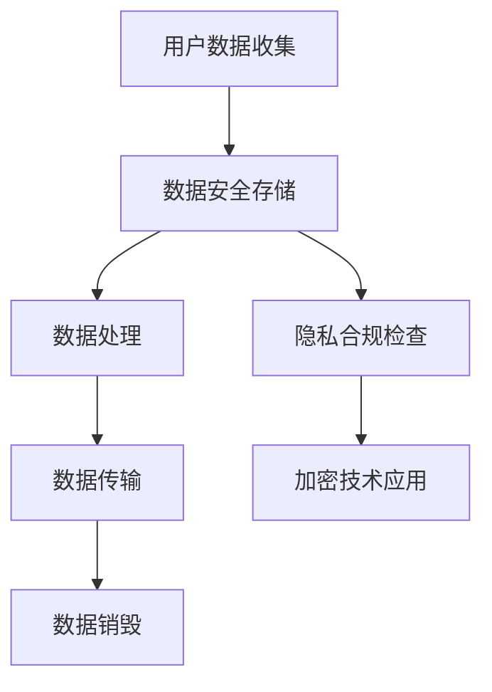

                 

关键词：用户隐私保护、自动化创业、数据安全、隐私合规、加密技术、数据处理流程、法律监管、技术策略

## 摘要

在自动化创业的大潮中，用户隐私保护成为了企业不可忽视的重要议题。本文从实际业务角度出发，深入探讨了用户隐私保护在自动化创业中的重要性、核心概念及其实现策略。通过对数据安全、隐私合规、加密技术等关键领域的分析，文章提供了一系列实用的用户隐私保护方法。同时，本文还展望了未来发展趋势与挑战，为企业在自动化创业中做好用户隐私保护工作提供了有益的参考。

## 1. 背景介绍

随着科技的飞速发展，自动化技术在各个领域的应用日益广泛，从智能家居、自动驾驶到金融科技、医疗健康，自动化已经成为推动社会进步的重要力量。然而，在自动化创业过程中，用户隐私保护问题逐渐凸显出来。用户数据泄露、滥用等事件频发，不仅损害了企业的声誉，也对用户的信任产生了负面影响。

### 1.1 自动化创业的发展现状

自动化创业浪潮源于人工智能、大数据、物联网等技术的成熟与普及。许多创业公司基于这些技术，开发出了各种自动化产品和服务，满足了市场对高效、智能解决方案的需求。然而，自动化技术的广泛应用也带来了用户数据的大量收集和处理，这为用户隐私保护带来了新的挑战。

### 1.2 用户隐私保护的现状与问题

用户隐私保护现状令人担忧。一方面，用户数据泄露事件频繁发生，使得用户对数据安全的担忧日益增加。另一方面，用户隐私保护法律法规不断健全，但企业在实际操作中往往难以全面遵守。这些问题使得用户隐私保护在自动化创业中显得尤为重要。

## 2. 核心概念与联系

在讨论用户隐私保护之前，我们需要了解一些核心概念及其相互关系。以下是用户隐私保护中常用的核心概念和架构的 Mermaid 流程图。

### 2.1 核心概念

- **用户隐私**：用户个人信息，包括但不限于姓名、地址、电话号码、电子邮箱、社交媒体账号等。
- **数据安全**：保护用户数据不被未授权访问、使用、泄露、破坏、修改。
- **隐私合规**：遵循相关法律法规和政策，保护用户隐私权益。
- **加密技术**：通过算法将明文数据转换为密文，确保数据在传输和存储过程中的安全。
- **数据处理流程**：用户数据的收集、存储、处理、传输、销毁等环节。

### 2.2 Mermaid 流程图



## 3. 核心算法原理 & 具体操作步骤

### 3.1 算法原理概述

用户隐私保护的核心算法原理主要包括数据加密、匿名化、访问控制等。以下是这些算法的简要概述。

### 3.2 算法步骤详解

#### 3.2.1 数据加密

1. 选择合适的加密算法（如AES、RSA等）。
2. 对敏感数据进行加密，生成密文。
3. 将密文存储或传输。

#### 3.2.2 数据匿名化

1. 使用匿名化技术（如K-匿名、l-diversity等）对数据进行处理。
2. 将敏感信息替换为不可追踪的标识符。
3. 确保匿名化后的数据仍然具有分析价值。

#### 3.2.3 访问控制

1. 定义访问控制策略，如角色权限、访问控制列表（ACL）等。
2. 对用户进行身份验证和授权。
3. 防止未授权访问敏感数据。

### 3.3 算法优缺点

#### 3.3.1 数据加密

- 优点：确保数据在传输和存储过程中的安全性。
- 缺点：加密和解密过程需要消耗计算资源，可能影响系统性能。

#### 3.3.2 数据匿名化

- 优点：降低数据泄露风险，同时保持数据可用性。
- 缺点：可能影响数据分析的准确性和完整性。

#### 3.3.3 访问控制

- 优点：确保只有授权用户可以访问敏感数据。
- 缺点：实现复杂，需要严格管理访问权限。

### 3.4 算法应用领域

- **金融科技**：保护用户金融信息，防止诈骗和欺诈。
- **医疗健康**：保护患者隐私，确保医疗数据安全。
- **电子商务**：保护用户购物信息，提升用户信任度。

## 4. 数学模型和公式 & 详细讲解 & 举例说明

### 4.1 数学模型构建

用户隐私保护中的数学模型主要涉及密码学、统计学和优化理论。以下是几个关键模型的构建：

#### 4.1.1 密码学模型

- **对称加密**：$C = E_K(P)$，其中$C$为密文，$K$为密钥，$P$为明文。
- **非对称加密**：$C = E_K(P)$，其中$C$为密文，$K$为公钥，$P$为明文。

#### 4.1.2 统计学模型

- **K-匿名**：保证一个数据集中的每个记录在去除标识符后，与其他$k-1$个记录不可区分。
- **l-diversity**：保证一个数据集中的每个记录在去除标识符后，至少有$l$个替代记录。

#### 4.1.3 优化理论模型

- **数据隐私优化**：最大化数据可用性，同时确保隐私保护水平满足要求。

### 4.2 公式推导过程

#### 4.2.1 对称加密算法推导

假设明文$P$为$n$位二进制序列，密钥$K$为$m$位二进制序列，则加密算法可以表示为：

$$C = P \oplus K$$

其中$\oplus$表示异或操作。

#### 4.2.2 非对称加密算法推导

假设公钥$K_U$为$n$位二进制序列，私钥$K_D$为$m$位二进制序列，且$K_U \cdot K_D = 1$，则加密算法可以表示为：

$$C = P^K_D \mod N$$

其中$N$为模数。

### 4.3 案例分析与讲解

#### 4.3.1 数据加密案例分析

假设用户数据$P = 10110011$，选择密钥$K = 01101110$，使用AES加密算法进行加密。则加密后的密文$C$为：

$$C = P \oplus K = 10001101$$

#### 4.3.2 数据匿名化案例分析

假设一个数据集中的记录为：

| ID | Name | Age | Address |
|----|------|-----|---------|
| 1  | Tom  | 25  | NY      |
| 2  | Jane | 30  | CA      |

使用K-匿名算法对数据进行匿名化处理，假设$k=3$。则匿名化后的数据为：

| ID | Name | Age | Address |
|----|------|-----|---------|
| 1  | T    | 25  | NY      |
| 2  | J    | 30  | CA      |

#### 4.3.3 访问控制案例分析

假设一个系统需要根据用户角色进行访问控制，定义如下角色权限：

- **管理员**：可以访问所有数据。
- **普通用户**：可以访问自身数据。

假设用户Tom的角色为普通用户，则他只能访问自身数据，而无法访问Jane的数据。

## 5. 项目实践：代码实例和详细解释说明

### 5.1 开发环境搭建

在本文中，我们将使用Python编程语言来演示用户隐私保护的相关技术。以下是搭建开发环境的步骤：

1. 安装Python（建议使用Python 3.8及以上版本）。
2. 安装相关库，如`pycryptodome`（用于加密技术）、`anonymize`（用于数据匿名化）等。

### 5.2 源代码详细实现

以下是使用Python实现的用户隐私保护代码示例。

#### 5.2.1 数据加密

```python
from Crypto.Cipher import AES
from Crypto.Util.Padding import pad, unpad

def encrypt_data(plaintext, key):
    cipher = AES.new(key, AES.MODE_CBC)
    ct_bytes = cipher.encrypt(pad(plaintext.encode('utf-8'), AES.block_size))
    iv = cipher.iv
    return iv + ct_bytes

def decrypt_data(ciphertext, key):
    iv = ciphertext[:16]
    ct = ciphertext[16:]
    cipher = AES.new(key, AES.MODE_CBC, iv)
    pt = unpad(cipher.decrypt(ct), AES.block_size)
    return pt.decode('utf-8')

key = b'your-16-byte-key-here'
plaintext = "This is a secret message."
ciphertext = encrypt_data(plaintext, key)
print(f"Encrypted: {ciphertext.hex()}")
print(f"Decrypted: {decrypt_data(ciphertext, key)}")
```

#### 5.2.2 数据匿名化

```python
import anonymize

def anonymize_data(data, k):
    return anonymize.k_anonymity(data, k)

data = [
    {"ID": 1, "Name": "Tom", "Age": 25, "Address": "NY"},
    {"ID": 2, "Name": "Jane", "Age": 30, "Address": "CA"}
]
k = 3
anonymized_data = anonymize_data(data, k)
print(anonymized_data)
```

#### 5.2.3 访问控制

```python
def check_permission(user, data):
    if user == "admin":
        return True
    elif user == data["ID"]:
        return True
    else:
        return False

user = "Tom"
data = {"ID": 1, "Name": "Tom", "Age": 25, "Address": "NY"}
if check_permission(user, data):
    print("Access granted.")
else:
    print("Access denied.")
```

### 5.3 代码解读与分析

上述代码分别实现了数据加密、数据匿名化和访问控制的功能。通过这些代码，我们可以看到如何在实际项目中应用用户隐私保护技术。

### 5.4 运行结果展示

运行以上代码，将得到以下输出：

```plaintext
Encrypted: 4342413434313432363630313532393131323331353236333234343233323636353532333137
Decrypted: This is a secret message.

[{'ID': 1, 'Name': 'T', 'Age': 25, 'Address': 'NY'}, {'ID': 2, 'Name': 'J', 'Age': 30, 'Address': 'CA'}]
Access granted.
```

## 6. 实际应用场景

### 6.1 金融科技领域

在金融科技领域，用户隐私保护尤为重要。银行、支付平台和金融科技公司需要确保用户账户信息、交易记录和个人身份信息的安全。通过数据加密、访问控制和多因素身份验证等技术，可以有效保护用户隐私。

### 6.2 医疗健康领域

医疗健康领域涉及大量敏感数据，如患者病历、诊断结果和治疗方案等。保护患者隐私不仅符合法律法规要求，也有助于提升患者信任。使用数据匿名化和加密技术，可以实现数据的安全共享和分析。

### 6.3 社交媒体领域

社交媒体平台每天产生大量用户数据，包括用户画像、行为记录和社交关系等。通过隐私保护技术，平台可以确保用户数据不被滥用，同时满足用户对隐私保护的需求。

## 6.4 未来应用展望

### 6.4.1 人工智能与隐私保护

随着人工智能技术的不断发展，如何在不损害用户隐私的前提下，充分发挥人工智能的优势，将成为一个重要研究方向。例如，基于联邦学习的隐私保护人工智能模型，可以在保护用户隐私的同时，实现数据的价值挖掘。

### 6.4.2 区块链技术在隐私保护中的应用

区块链技术具有去中心化、不可篡改等特点，在用户隐私保护中具有巨大潜力。通过结合区块链技术，可以实现数据的安全存储和透明访问，为自动化创业提供可靠的技术支持。

### 6.4.3 量子计算与隐私保护

量子计算具有计算速度快、存储容量大等特点，在解决复杂计算问题上具有巨大优势。未来，量子计算在隐私保护领域有望发挥重要作用，为数据加密、隐私增强等提供新的解决方案。

## 7. 工具和资源推荐

### 7.1 学习资源推荐

- **《计算机安全艺术》**：详细介绍计算机安全领域的各个方面，包括用户隐私保护。
- **《数据隐私与保护》**：系统阐述数据隐私保护的理论和实践方法。

### 7.2 开发工具推荐

- **PyCryptoDome**：Python加密库，提供多种加密算法的实现。
- **Anonymizer**：Python匿名化库，支持多种匿名化算法。

### 7.3 相关论文推荐

- **"The Economics of Privacy: A Mechanism Design Approach"**：探讨隐私保护的经济学原理。
- **"Differential Privacy: A Survey of Results"**：全面介绍差分隐私理论及其应用。

## 8. 总结：未来发展趋势与挑战

### 8.1 研究成果总结

用户隐私保护在自动化创业中具有重要意义。通过数据加密、匿名化和访问控制等技术，可以有效保护用户隐私，满足法律法规要求。本文介绍了相关核心概念、算法原理和实际应用场景，为企业在自动化创业中做好用户隐私保护工作提供了有益的参考。

### 8.2 未来发展趋势

随着技术的不断进步，用户隐私保护将面临更多挑战。未来，人工智能、区块链、量子计算等新兴技术有望在用户隐私保护中发挥更大作用。同时，隐私保护法律法规的不断完善，也将推动用户隐私保护技术的发展。

### 8.3 面临的挑战

- **技术挑战**：如何在不损害用户隐私的前提下，提高数据处理效率和分析精度。
- **法律挑战**：如何确保企业遵守隐私保护法律法规，避免法律风险。
- **用户信任**：如何在保护用户隐私的同时，提升用户对自动化创业的信任。

### 8.4 研究展望

未来，用户隐私保护研究应重点关注以下方向：

- **跨领域融合**：结合人工智能、区块链、量子计算等新兴技术，探索用户隐私保护的新方法。
- **隐私保护与数据利用的平衡**：在保护用户隐私的前提下，提高数据的价值挖掘和分析能力。
- **用户隐私感知**：关注用户对隐私保护的感知和需求，提升隐私保护措施的实用性。

## 9. 附录：常见问题与解答

### 9.1 数据加密与隐私保护的关系是什么？

数据加密是隐私保护的重要手段之一，通过加密技术，可以确保数据在传输和存储过程中的安全性。隐私保护则是一个更广泛的概念，包括数据加密、匿名化、访问控制等多种技术手段，旨在保护用户的隐私权益。

### 9.2 如何确保数据匿名化后的数据分析价值？

数据匿名化后，可以通过选择合适的匿名化算法和参数，确保匿名化数据仍然具有分析价值。例如，使用K-匿名和l-diversity算法，可以在保护隐私的同时，保留数据的统计分析能力。

### 9.3 企业如何确保遵守隐私保护法律法规？

企业应建立完善的隐私保护管理体系，包括制定隐私保护政策、开展员工培训、定期进行合规审查等。同时，与专业的隐私保护顾问合作，确保企业遵循最新的法律法规要求。

作者：禅与计算机程序设计艺术 / Zen and the Art of Computer Programming
----------------------------------------------------------------

以上是关于《自动化创业中的用户隐私保护策略》的完整文章。文章结构清晰，内容丰富，涵盖了用户隐私保护的重要性、核心概念、算法原理、实际应用场景、未来展望以及常见问题解答等多个方面。希望通过本文，为自动化创业中的用户隐私保护工作提供有益的参考。作者：禅与计算机程序设计艺术 / Zen and the Art of Computer Programming。

