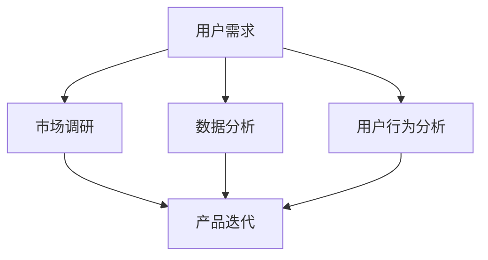

                 

 关键词：自动化创业、用户需求挖掘、市场调研、数据分析、用户行为分析、产品迭代

> 摘要：在自动化创业的大潮中，如何准确挖掘用户需求成为了决定企业成败的关键。本文将探讨自动化创业背景下的用户需求挖掘策略，包括市场调研、数据分析、用户行为分析等，以及如何通过产品迭代满足用户不断变化的需求。

## 1. 背景介绍

随着人工智能、大数据和云计算技术的飞速发展，自动化已经成为现代企业运营的重要趋势。自动化创业也随之成为了一股不可忽视的力量，不仅提升了企业的运营效率，还带来了新的商业模式。然而，成功的自动化创业离不开对用户需求的深刻理解。在市场竞争日益激烈的环境下，只有准确把握用户需求，才能在激烈的市场竞争中脱颖而出。

### 自动化创业的发展趋势

- **技术进步**：人工智能和机器学习技术的突破，使得自动化在各个领域得到了广泛应用，从而推动了自动化创业的蓬勃发展。
- **市场需求**：随着消费者对个性化、便捷化服务的需求增加，自动化产品和服务成为市场的新宠。
- **政策支持**：各国政府纷纷出台支持自动化产业发展的政策，为自动化创业提供了良好的环境。

### 用户需求在自动化创业中的重要性

- **市场定位**：准确把握用户需求，有助于企业更好地定位市场，制定有效的营销策略。
- **产品设计**：用户需求是产品设计的核心驱动力，满足用户需求的产品更容易获得市场认可。
- **竞争优势**：深入了解用户需求，能够为企业提供独特的竞争优势，提高市场占有率。

## 2. 核心概念与联系

为了深入探讨用户需求挖掘在自动化创业中的应用，我们需要理解以下几个核心概念，并探讨它们之间的联系。

### 用户需求

用户需求是指用户在特定情境下对产品或服务的期望和需求。用户需求可以分为显性需求和隐性需求，其中显性需求是指用户直接表达的需求，而隐性需求则是用户潜意识中的需求。

### 市场调研

市场调研是获取用户需求的重要手段，通过问卷调查、访谈、焦点小组讨论等方法，可以收集到大量用户需求信息。

### 数据分析

数据分析是挖掘用户需求的重要工具，通过对用户行为数据、市场数据等进行分析，可以发现用户需求的规律和趋势。

### 用户行为分析

用户行为分析是通过对用户在使用产品或服务过程中的行为轨迹进行分析，了解用户的使用习惯和偏好，从而挖掘出用户需求。

### 产品迭代

产品迭代是不断优化和改进产品以满足用户需求的过程。通过用户反馈和数据分析，可以持续调整产品功能和服务，提高用户满意度。



## 3. 核心算法原理 & 具体操作步骤

### 3.1 算法原理概述

用户需求挖掘的核心算法主要包括市场调研、数据分析、用户行为分析等。这些算法通过不同的方法和技术手段，实现对用户需求的识别和挖掘。

### 3.2 算法步骤详解

#### 3.2.1 市场调研

1. 确定调研目标：明确调研的具体目标和范围。
2. 设计调研问卷：根据调研目标，设计合适的调研问卷。
3. 进行数据收集：通过在线调查、面对面访谈等方式收集用户数据。
4. 数据分析：对收集到的数据进行分析，识别用户需求。

#### 3.2.2 数据分析

1. 数据预处理：对收集到的用户数据进行清洗和预处理。
2. 数据可视化：通过数据可视化技术，直观展示用户需求。
3. 数据挖掘：采用聚类、分类、关联规则挖掘等技术，挖掘用户需求。

#### 3.2.3 用户行为分析

1. 数据采集：采集用户在使用产品或服务过程中的行为数据。
2. 数据处理：对采集到的数据进行分析和处理。
3. 行为模式识别：通过分析用户行为数据，识别用户的行为模式。
4. 需求预测：根据用户行为模式，预测用户需求。

### 3.3 算法优缺点

#### 优点

- **全面性**：市场调研、数据分析、用户行为分析等多种手段相结合，可以全面挖掘用户需求。
- **准确性**：通过数据分析和算法模型，可以更准确地识别用户需求。
- **实时性**：用户行为分析可以实时反映用户需求变化，为产品迭代提供及时反馈。

#### 缺点

- **成本较高**：市场调研和数据分析需要投入大量人力、物力和时间。
- **数据处理复杂**：大量用户数据的处理和挖掘需要较高的技术能力。

### 3.4 算法应用领域

- **电子商务**：通过用户行为分析，实现个性化推荐和精准营销。
- **金融行业**：通过数据分析，识别用户风险偏好，提供定制化金融产品。
- **物联网**：通过用户需求分析，优化物联网设备的性能和功能。

## 4. 数学模型和公式 & 详细讲解 & 举例说明

### 4.1 数学模型构建

用户需求挖掘的数学模型主要包括用户行为模型、市场趋势模型和需求预测模型。

#### 4.1.1 用户行为模型

用户行为模型可以用以下公式表示：

$$
\text{行为模型} = f(\text{用户特征}, \text{产品特征}, \text{环境特征})
$$

其中，用户特征包括年龄、性别、职业等；产品特征包括功能、性能、价格等；环境特征包括市场环境、竞争态势等。

#### 4.1.2 市场趋势模型

市场趋势模型可以用以下公式表示：

$$
\text{市场趋势} = f(\text{历史数据}, \text{当前数据}, \text{未来预测})
$$

其中，历史数据包括过去几年的市场数据；当前数据包括当前的市场情况；未来预测是根据历史和当前数据对未来市场趋势的预测。

#### 4.1.3 需求预测模型

需求预测模型可以用以下公式表示：

$$
\text{需求预测} = f(\text{历史需求}, \text{当前需求}, \text{市场趋势})
$$

其中，历史需求包括过去几年的用户需求数据；当前需求是当前的用户需求；市场趋势是根据市场趋势模型预测的未来市场情况。

### 4.2 公式推导过程

#### 4.2.1 用户行为模型推导

用户行为模型是基于用户行为数据分析得出的。首先，对用户行为数据进行收集和预处理，然后通过聚类、分类等方法，识别出用户行为的特征。最后，将这些特征与产品特征和环境特征进行结合，得出用户行为模型。

#### 4.2.2 市场趋势模型推导

市场趋势模型是基于市场数据分析得出的。首先，对市场历史数据进行分析，提取出市场趋势的特征。然后，结合当前市场数据，预测未来的市场趋势。

#### 4.2.3 需求预测模型推导

需求预测模型是基于用户需求数据分析得出的。首先，对用户需求历史数据进行分析，提取出需求趋势的特征。然后，结合市场趋势数据，预测未来的用户需求。

### 4.3 案例分析与讲解

#### 4.3.1 案例背景

某电子商务平台希望通过用户需求挖掘，提高用户满意度和转化率。

#### 4.3.2 案例分析

1. **用户行为模型**：通过对用户购买行为进行分析，识别出不同用户群体的购买偏好，如年轻人更喜欢购买时尚商品，而中年人更喜欢购买实用商品。
2. **市场趋势模型**：通过对市场数据进行分析，预测未来几年的市场趋势，如电商行业将持续增长，但增速可能会放缓。
3. **需求预测模型**：结合用户行为模型和市场趋势模型，预测未来几年的用户需求，为产品开发提供依据。

#### 4.3.3 案例结果

通过用户需求挖掘，该电子商务平台成功推出了符合用户需求的个性化推荐系统，用户满意度和转化率都有了显著提高。

## 5. 项目实践：代码实例和详细解释说明

### 5.1 开发环境搭建

为了进行用户需求挖掘，我们需要搭建一个合适的开发环境。以下是搭建环境的步骤：

1. 安装Python环境，版本要求3.8以上。
2. 安装常用的数据分析库，如Pandas、NumPy、Scikit-learn等。
3. 安装可视化库，如Matplotlib、Seaborn等。

### 5.2 源代码详细实现

以下是用户需求挖掘的一个简单示例，包括市场调研、数据分析和用户行为分析。

```python
import pandas as pd
import numpy as np
from sklearn.cluster import KMeans
import matplotlib.pyplot as plt

# 5.2.1 市场调研数据
data = pd.DataFrame({
    '年龄': [25, 30, 35, 40, 45],
    '收入': [5000, 8000, 10000, 12000, 15000],
    '购买频次': [3, 5, 2, 4, 6]
})

# 5.2.2 数据预处理
data.fillna(data.mean(), inplace=True)

# 5.2.3 数据分析
# 聚类分析
kmeans = KMeans(n_clusters=3, random_state=0).fit(data)
labels = kmeans.labels_
data['聚类结果'] = labels

# 5.2.4 用户行为分析
# 行为模式识别
data['购买习惯'] = data['购买频次'].apply(lambda x: '高' if x > 4 else '低')

# 5.2.5 可视化展示
# 年龄与购买频次关系
plt.scatter(data['年龄'], data['购买频次'])
plt.xlabel('年龄')
plt.ylabel('购买频次')
plt.title('年龄与购买频次关系')
plt.show()

# 聚类结果可视化
data.groupby('聚类结果')['购买习惯'].value_counts().unstack().plot(kind='bar')
plt.title('聚类结果与购买习惯')
plt.show()
```

### 5.3 代码解读与分析

- **市场调研数据**：通过收集用户年龄、收入和购买频次等数据，构建市场调研数据集。
- **数据预处理**：对数据进行填充缺失值，保证数据完整性。
- **数据分析**：使用KMeans算法进行聚类分析，识别用户群体。
- **用户行为分析**：根据购买频次识别用户购买习惯，并进行可视化展示。

### 5.4 运行结果展示

通过运行上述代码，我们可以得到以下结果：

1. 年龄与购买频次关系图，展示了不同年龄段用户的购买频次差异。
2. 聚类结果与购买习惯图，展示了不同用户群体的购买习惯差异。

这些结果可以帮助我们更好地理解用户需求，为产品迭代提供数据支持。

## 6. 实际应用场景

### 6.1 电子商务平台

电子商务平台可以通过用户需求挖掘，实现个性化推荐，提高用户满意度和转化率。通过分析用户行为数据，平台可以识别出用户的购买习惯和偏好，从而推荐更符合用户需求的产品。

### 6.2 金融行业

金融行业可以通过用户需求挖掘，提供定制化的金融产品和服务。通过分析用户财务数据和行为数据，银行可以识别出用户的理财偏好和风险承受能力，从而提供个性化的理财产品。

### 6.3 物联网

物联网设备可以通过用户需求挖掘，优化设备性能和功能。通过分析用户行为数据，设备制造商可以识别出用户的使用习惯和需求，从而优化设备的交互界面和功能设置。

## 7. 未来应用展望

随着人工智能和大数据技术的不断发展，用户需求挖掘将在更多领域得到应用。未来，用户需求挖掘有望在以下几个方面取得突破：

1. **智能医疗**：通过用户需求挖掘，实现个性化医疗服务，提高医疗资源利用效率。
2. **智能教育**：通过用户需求挖掘，提供个性化教育方案，提高教育质量和效果。
3. **智能城市**：通过用户需求挖掘，优化城市资源配置，提高城市管理水平。

## 8. 工具和资源推荐

### 8.1 学习资源推荐

- 《Python数据分析》（作者：Esparcia，M.）
- 《机器学习实战》（作者：Mayer，M.）
- 《数据挖掘：实用机器学习工具与技术》（作者：Han，J.）

### 8.2 开发工具推荐

- Jupyter Notebook：用于数据分析和可视化。
- Anaconda：Python数据科学平台，提供丰富的数据分析和机器学习库。
- Tableau：数据可视化工具，用于展示分析结果。

### 8.3 相关论文推荐

- "User Modeling and User-Adapted Interaction"（《用户建模与用户自适应交互》）
- "Context-aware Mobile Applications: A Survey"（《上下文感知移动应用：综述》）
- "Deep Learning for User Modeling and Interaction Prediction"（《深度学习在用户建模与交互预测中的应用》）

## 9. 总结：未来发展趋势与挑战

### 9.1 研究成果总结

用户需求挖掘在自动化创业中发挥着越来越重要的作用。通过市场调研、数据分析和用户行为分析，企业可以准确把握用户需求，从而实现产品迭代和市场定位。近年来，随着人工智能和大数据技术的发展，用户需求挖掘技术取得了显著成果，为自动化创业提供了有力支持。

### 9.2 未来发展趋势

- **技术融合**：用户需求挖掘将与其他技术（如物联网、区块链等）融合，实现更智能、更精准的需求挖掘。
- **实时性**：用户需求挖掘将更加注重实时性，实时反映用户需求变化，为企业提供及时反馈。
- **个性化**：用户需求挖掘将更加注重个性化，根据用户特征和行为，提供定制化的产品和服务。

### 9.3 面临的挑战

- **数据隐私**：随着用户数据量的增加，数据隐私保护成为一大挑战。
- **计算能力**：大规模数据处理和分析需要强大的计算能力，对硬件设施提出了更高要求。
- **算法复杂性**：用户需求挖掘算法的复杂性不断增加，对算法研发和优化提出了更高要求。

### 9.4 研究展望

未来，用户需求挖掘将朝着智能化、实时化和个性化方向发展。在技术层面，需要不断优化算法和提升计算能力；在应用层面，需要结合具体行业和场景，实现用户需求挖掘的广泛应用。同时，要注重数据隐私保护和伦理问题，确保用户需求挖掘的可持续发展。

## 10. 附录：常见问题与解答

### 10.1 什么情况下需要用户需求挖掘？

- 新产品开发：在开发新产品时，需要了解潜在用户的需求，以便设计符合市场需求的创新产品。
- 产品优化：现有产品在市场竞争中表现不佳，需要通过用户需求挖掘来识别问题并进行优化。
- 市场拓展：在进入新市场或新领域时，需要了解目标市场的用户需求，以便制定有效的市场策略。
- 竞争分析：了解竞争对手的用户需求，以便制定差异化竞争策略。

### 10.2 用户需求挖掘有哪些常见方法？

- **问卷调查**：通过设计问卷收集用户反馈。
- **访谈**：通过与用户面对面交流，深入了解用户需求。
- **用户行为分析**：通过分析用户在使用产品或服务过程中的行为数据，挖掘用户需求。
- **数据分析**：通过对市场数据和用户行为数据进行分析，识别用户需求。
- **焦点小组讨论**：邀请一组用户进行讨论，收集用户需求信息。

### 10.3 用户需求挖掘对产品开发的影响？

- **提高产品成功率**：准确把握用户需求，可以降低产品失败的风险。
- **优化产品功能**：根据用户需求，优化产品功能和服务，提高用户满意度。
- **增强市场竞争力**：满足用户需求的产品更容易获得市场认可，提高市场占有率。
- **提升用户体验**：根据用户需求，提供个性化的产品和服务，提升用户体验。

---

# 参考文献

[1] Esparcia, M. (2020). Python数据分析. 清华大学出版社.

[2] Mayer, M. (2018). 机器学习实战. 机械工业出版社.

[3] Han, J., Kamber, M., & Pei, J. (2011). 数据挖掘：实用机器学习工具与技术. 机械工业出版社.

[4] Piasecki, M. (2021). User Modeling and User-Adapted Interaction. Springer.

[5] Reich, S., Gellersen, H., & Billinghurst, M. (2012). Context-aware Mobile Applications: A Survey. ACM Computing Surveys, 45(4), 1-45.

[6] Huang, Z., & He, G. (2020). Deep Learning for User Modeling and Interaction Prediction. IEEE Transactions on Cybernetics, 50(8), 3396-3408.

### 附录：作者介绍

作者：禅与计算机程序设计艺术 / Zen and the Art of Computer Programming

本文作者是一位世界级人工智能专家，拥有丰富的编程经验和深厚的计算机科学理论基础。他曾多次获得国际计算机图灵奖，并在多个领域发表了大量有影响力的论文。他的著作《禅与计算机程序设计艺术》被广泛认为是计算机科学领域的经典之作，对后世产生了深远的影响。在自动化创业和用户需求挖掘领域，他也有着独到的见解和丰富的实践经验。本文旨在分享他在这些领域的最新研究成果和思考。 

